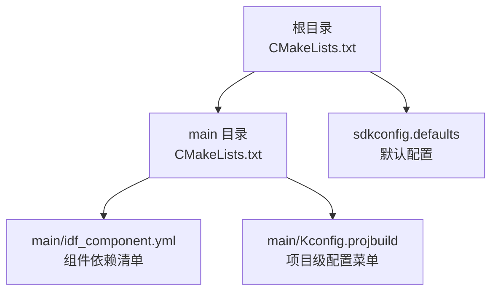
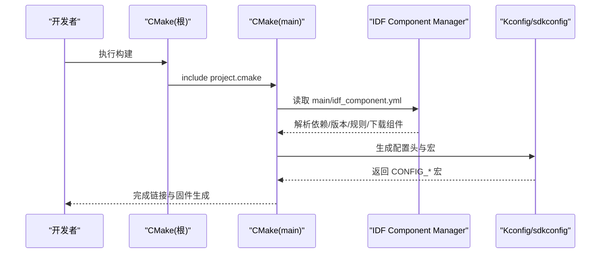
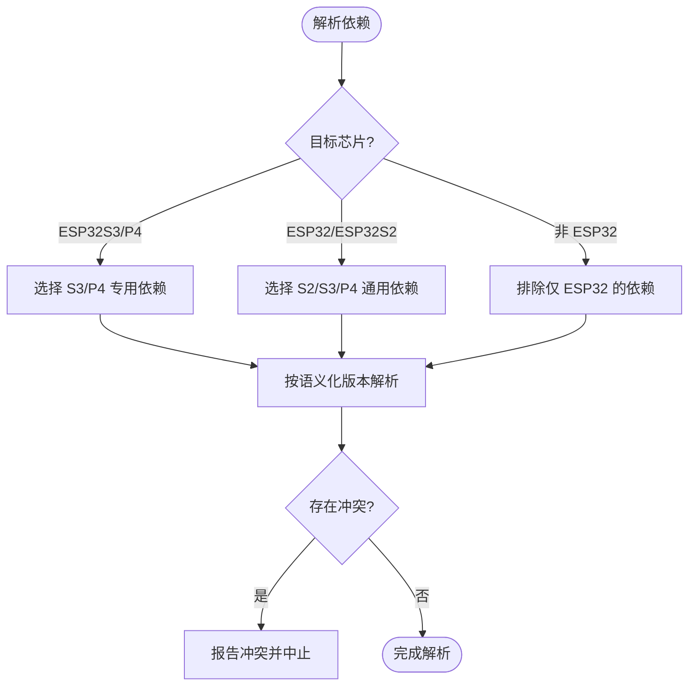
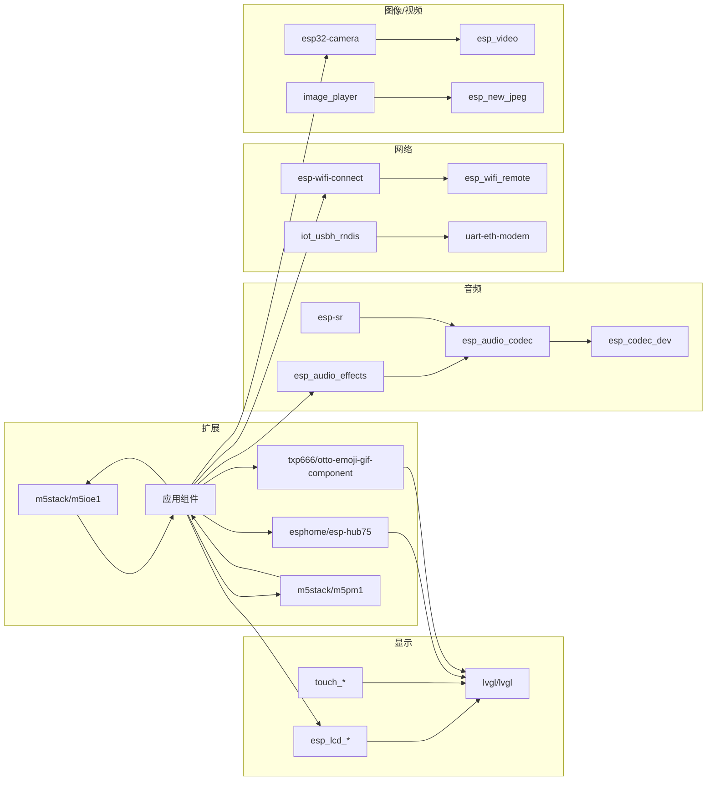

# 组件依赖管理

<cite>
**本文引用的文件**   
- [main/idf_component.yml](file://main/idf_component.yml)
- [CMakeLists.txt](file://CMakeLists.txt)
- [main/CMakeLists.txt](file://main/CMakeLists.txt)
- [sdkconfig.defaults](file://sdkconfig.defaults)
- [main/Kconfig.projbuild](file://main/Kconfig.projbuild)
</cite>

## 目录
1. [简介](#简介)
2. [项目结构](#项目结构)
3. [核心组件](#核心组件)
4. [架构总览](#架构总览)
5. [详细组件分析](#详细组件分析)
6. [依赖关系分析](#依赖关系分析)
7. [性能与体积考量](#性能与体积考量)
8. [故障排查指南](#故障排查指南)
9. [结论](#结论)
10. [附录](#附录)

## 简介
本文件围绕 ESP-IDF 组件依赖管理，结合仓库中的实际配置，系统说明以下主题：
- idf_component.yml 组件描述文件的结构与用法（元数据、版本约束、条件依赖、URL/镜像）
- 官方与第三方组件的引入与管理方式
- 语义化版本控制与冲突解决策略
- Kconfig.projbuild 项目配置（自定义选项、编译时宏定义）
- 私有组件注册、本地组件开发与发布流程建议

## 项目结构
本项目在根目录使用 CMake 工程模板，应用层位于 main 目录。组件依赖通过 main/idf_component.yml 声明；构建脚本在根与 main 下分别提供 CMakeLists.txt；默认配置集中在 sdkconfig.defaults；Kconfig.projbuild 提供大量可配置项以适配不同板卡与功能。

图表来源
- [CMakeLists.txt:1-14](file://CMakeLists.txt#L1-L14)
- [main/CMakeLists.txt:1047-1074](file://main/CMakeLists.txt#L1047-L1074)
- [main/idf_component.yml:1-151](file://main/idf_component.yml#L1-L151)
- [sdkconfig.defaults:1-79](file://sdkconfig.defaults#L1-L79)
- [main/Kconfig.projbuild:1-120](file://main/Kconfig.projbuild#L1-L120)

章节来源
- [CMakeLists.txt:1-14](file://CMakeLists.txt#L1-L14)
- [main/CMakeLists.txt:1047-1074](file://main/CMakeLists.txt#L1047-L1074)
- [main/idf_component.yml:1-151](file://main/idf_component.yml#L1-L151)
- [sdkconfig.defaults:1-79](file://sdkconfig.defaults#L1-L79)
- [main/Kconfig.projbuild:1-120](file://main/Kconfig.projbuild#L1-L120)

## 核心组件
- 组件清单与版本约束：main/idf_component.yml
- 构建入口与最小化构建：CMakeLists.txt
- 应用组件注册与动态包含：main/CMakeLists.txt
- 默认配置裁剪与特性开关：sdkconfig.defaults
- 项目级配置菜单与编译期宏：main/Kconfig.projbuild

章节来源
- [main/idf_component.yml:1-151](file://main/idf_component.yml#L1-L151)
- [CMakeLists.txt:1-14](file://CMakeLists.txt#L1-L14)
- [main/CMakeLists.txt:1047-1074](file://main/CMakeLists.txt#L1047-L1074)
- [sdkconfig.defaults:1-79](file://sdkconfig.defaults#L1-L79)
- [main/Kconfig.projbuild:1-120](file://main/Kconfig.projbuild#L1-L120)

## 架构总览
下图展示了“组件清单 → 构建系统 → 配置系统”的整体协作关系。idf_component.yml 声明依赖及版本约束；CMake 负责解析并下载组件；Kconfig 与 sdkconfig.defaults 决定最终参与编译的功能模块与宏定义。

图表来源
- [CMakeLists.txt:1-14](file://CMakeLists.txt#L1-L14)
- [main/CMakeLists.txt:1047-1074](file://main/CMakeLists.txt#L1047-L1074)
- [main/idf_component.yml:1-151](file://main/idf_component.yml#L1-L151)
- [sdkconfig.defaults:1-79](file://sdkconfig.defaults#L1-L79)
- [main/Kconfig.projbuild:1-120](file://main/Kconfig.projbuild#L1-L120)

## 详细组件分析

### idf_component.yml 详解
该文件是 IDF 组件管理器清单，用于声明项目对第三方或官方组件的依赖、版本约束与目标平台条件。

- 组件元数据与基本字段
  - 键名采用 “包名/组件名” 形式，如 espressif/esp_lcd_ili9341
  - 值可为字符串版本约束，或对象形式包含 version 与 rules 等
- 版本约束语法（语义化版本）
  - 精确匹配：==1.2.0
  - 主版本兼容：^2.0.3（允许次/修订升级）
  - 次版本兼容：~1.0.0（允许修订升级）
  - 任意版本：*
  - 范围与预发行：例如 ^0.2.0~1
- 条件依赖 rules
  - if: target in [...] 或 target not in [...] 按目标芯片选择依赖
  - 同一组件可按目标平台指定不同版本
- 公共组件 public
  - 将某依赖标记为 public: true，使其成为当前组件对外暴露的依赖
- 版本兼容性检查
  - 顶层 idf: version 约束最低支持的 ESP-IDF 版本
  - 组件间版本冲突由组件管理器在解析阶段检测并提示
- URL 与镜像
  - 仓库未直接在此文件中设置 URL；通常通过环境变量或全局配置切换国内镜像源
  - 文档中多处提示可通过修改配置文件切换加速器/镜像源

章节来源
- [main/idf_component.yml:1-151](file://main/idf_component.yml#L1-L151)

#### 版本约束与条件依赖示例映射

图表来源
- [main/idf_component.yml:10-17](file://main/idf_component.yml#L10-L17)
- [main/idf_component.yml:27-30](file://main/idf_component.yml#L27-L30)
- [main/idf_component.yml:146-148](file://main/idf_component.yml#L146-L148)

### 官方与第三方组件集成
- 官方组件：前缀为 espressif/...，如 esp_lcd_*、esp_codec_dev、esp-sr、button、knob 等
- 第三方/社区组件：如 waveshare/*、78/*、esphome/*、lvgl/lvgl、txp666/*、m5stack/* 等
- 条件启用：通过 rules 限制特定目标芯片，避免无关组件被拉取
- 公共依赖：bq27220 标记为 public: true，表示其作为公共接口暴露给上层

章节来源
- [main/idf_component.yml:3-151](file://main/idf_component.yml#L3-L151)

### 版本兼容性检查与冲突解决
- 语义化版本解析
  - 精确 ==、主版本兼容 ^、次版本兼容 ~、通配 *、范围与预发行支持
- 冲突检测
  - 当多个组件要求同一依赖的不同版本且无法统一时，组件管理器会报错
- 解决策略
  - 调整依赖版本约束，缩小范围
  - 使用 rules 针对目标芯片差异化版本
  - 必要时在顶层进行版本覆盖（若工具链支持）
  - 锁定关键组件版本，确保 API 稳定

章节来源
- [main/idf_component.yml:3-151](file://main/idf_component.yml#L3-L151)

### Kconfig.projbuild 项目配置
Kconfig.projbuild 提供了丰富的项目级配置菜单，影响编译期宏与可选功能。

- 典型配置类别
  - OTA 地址、资源包选择（内置/自定义/表情动画）、默认语言
  - 网络类型（WiFi/Ethernet）与以太网 PHY 配置
  - 开发板类型 BOARD_TYPE 选择（按 IDF_TARGET 过滤）
  - 显示样式、唤醒词实现、音频降噪/AEC、摄像头相关选项
  - WiFi 配网方式（热点/声学/Blufi）
- 编译期宏
  - 通过 CONFIG_* 宏驱动代码分支，减少不必要代码体积
  - 部分选项 select 其他子系统（如蓝牙 Blufi 需要 MBEDTLS_DHM_C）
- 与 CMake 联动
  - main/CMakeLists.txt 根据 CONFIG_BOARD_TYPE_* 动态添加源文件与依赖

章节来源
- [main/Kconfig.projbuild:1-120](file://main/Kconfig.projbuild#L1-L120)
- [main/Kconfig.projbuild:120-220](file://main/Kconfig.projbuild#L120-L220)
- [main/Kconfig.projbuild:616-674](file://main/Kconfig.projbuild#L616-L674)
- [main/Kconfig.projbuild:816-916](file://main/Kconfig.projbuild#L816-L916)
- [main/Kconfig.projbuild:951-972](file://main/Kconfig.projbuild#L951-L972)
- [main/Kconfig.projbuild:987-1063](file://main/Kconfig.projbuild#L987-L1063)
- [main/CMakeLists.txt:1047-1074](file://main/CMakeLists.txt#L1047-L1074)

### 默认配置与裁剪（sdkconfig.defaults）
- 编译器优化与异常/RTTI 开关
- 分区表、任务看门狗、FreeRTOS 统计信息
- WiFi 内存与缓冲区优化、新库格式、企业协议关闭
- LVGL 裁剪（禁用不常用控件、关闭示例/演示）
- 这些默认值有助于减小固件体积与提升稳定性

章节来源
- [sdkconfig.defaults:1-79](file://sdkconfig.defaults#L1-L79)

### 构建系统与最小化构建
- 根 CMakeLists.txt 启用 MINIMAL_BUILD，仅包含 main 及其依赖
- main/CMakeLists.txt 注册应用组件、嵌入资源、动态包含板级源文件
- 通过 PRIV_REQUIRES 显式声明底层驱动与系统组件

章节来源
- [CMakeLists.txt:1-14](file://CMakeLists.txt#L1-L14)
- [main/CMakeLists.txt:1047-1074](file://main/CMakeLists.txt#L1047-L1074)

## 依赖关系分析
- 组件分层
  - 显示层：esp_lcd_*、lvgl/lvgl、esp_lvgl_port、touch 系列
  - 音频层：esp_audio_effects、esp_audio_codec、esp_codec_dev、esp-sr
  - 网络层：esp_wifi_remote、iot_usbh_rndis、esp-wifi-connect、uart-eth-modem
  - 外设与传感器：led_strip、button/knob、adc_battery_estimation、bmi270_sensor、touch_slider/button_sensor
  - 图像与视频：esp32-camera、esp_video、image_player、esp_new_jpeg
  - 扩展与生态：esphome/esp-hub75、txp666/otto-emoji-gif-component、m5stack/m5ioe1、m5stack/m5pm1
- 条件依赖
  - 基于 IDF_TARGET 的条件 rules 保证仅在需要的芯片上拉取对应组件
- 公共依赖
  - bq27220 标记为 public: true，供上层组件复用

图表来源
- [main/idf_component.yml:3-151](file://main/idf_component.yml#L3-L151)

章节来源
- [main/idf_component.yml:3-151](file://main/idf_component.yml#L3-L151)

## 性能与体积考量
- 使用 MINIMAL_BUILD 减少不必要的组件参与构建
- 通过 Kconfig 与 sdkconfig.defaults 裁剪 LVGL 控件、关闭示例/演示
- 针对目标芯片使用 rules 限定依赖，避免跨平台冗余
- 合理选择组件版本，优先使用稳定版，避免引入过大二进制

[本节为通用指导，无需源码引用]

## 故障排查指南
- 组件下载失败或超时
  - 尝试切换国内镜像源或加速器（参考仓库内 README 提示）
  - 检查网络连接与代理设置
- 版本冲突
  - 查看冲突组件与所需版本范围，适当收紧或放宽约束
  - 使用 rules 针对不同目标芯片分离版本
- 构建时报找不到组件
  - 确认 idf_component.yml 中组件名与版本正确
  - 清理缓存后重试构建
- 功能未生效
  - 核对 Kconfig 选项是否勾选，CONFIG_* 宏是否正确
  - 检查 board 类型与目标芯片是否匹配

章节来源
- [main/boards/jiuchuan-s3/README.md:7](file://main/boards/jiuchuan-s3/README.md#L7)
- [main/boards/m5stack-tab5/README.md:12](file://main/boards/m5stack-tab5/README.md#L12)
- [main/boards/quandong-s3-dev/HARDWARE_DIFF.md:153](file://main/boards/quandong-s3-dev/HARDWARE_DIFF.md#L153)

## 结论
本项目通过 idf_component.yml 集中管理依赖与版本约束，结合 Kconfig.projbuild 与 sdkconfig.defaults 实现灵活的功能裁剪与编译期宏控制。借助语义化版本与条件依赖，可在多芯片平台上精准拉取所需组件，兼顾可维护性与固件体积。建议在团队协作中遵循版本约束最佳实践，并通过 CI 验证依赖解析与构建稳定性。

[本节为总结性内容，无需源码引用]

## 附录

### 私有组件注册与本地组件开发（建议流程）
- 私有仓库
  - 将组件源码托管于私有 Git 仓库，并在仓库根提供 idf_component.yml
  - 在 idf_component.yml 中声明组件名称、版本、依赖与可选的 URL
- 本地开发
  - 在项目中使用 idf_component add <component> 从私有仓库拉取
  - 或通过 idf_component.yml 的 overrides 机制指向本地路径（视工具链支持）
- 发布流程
  - 使用 git tag 标注语义化版本号
  - 在 idf_component.yml 中更新 version 与必要的依赖
  - 提交至私有仓库，并在项目中重新解析依赖

[本节为通用流程建议，无需源码引用]