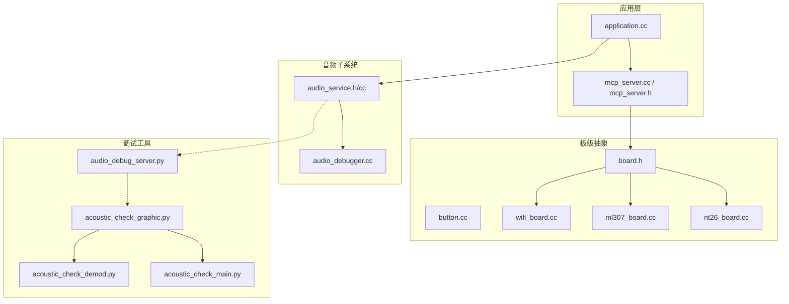
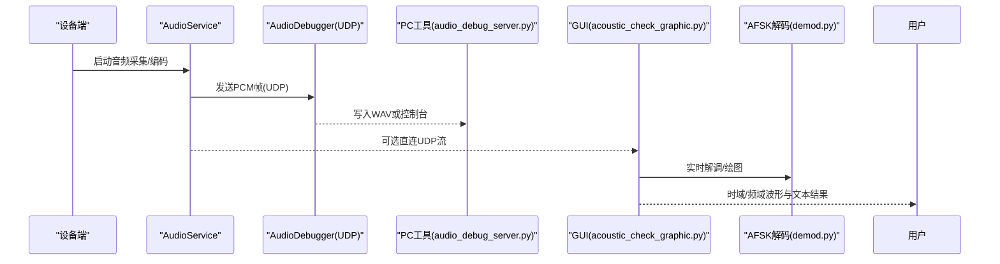
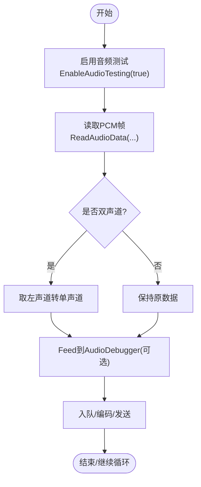
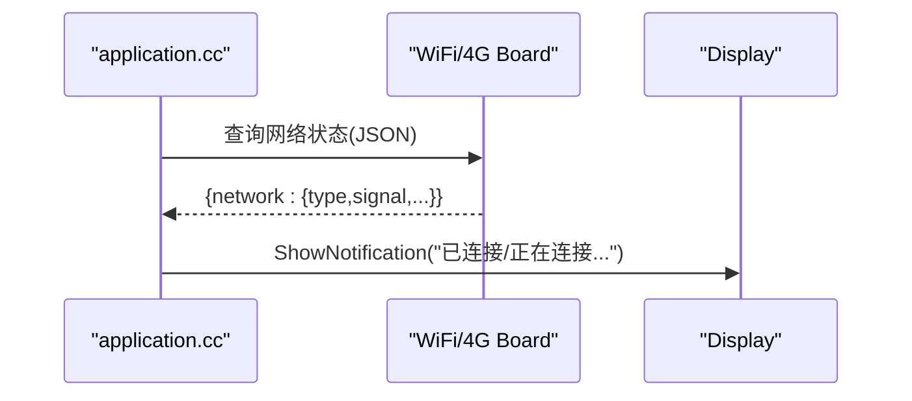
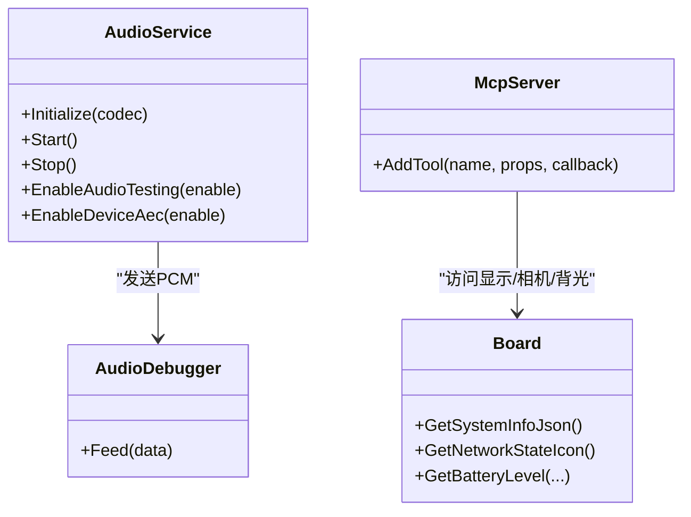

# 测试与验证

<cite>
**本文引用的文件**   
- [README.md](file://README.md)
- [audio_service.h](file://main/audio/audio_service.h)
- [audio_service.cc](file://main/audio/audio_service.cc)
- [audio_debugger.cc](file://main/audio/processors/audio_debugger.cc)
- [audio_debug_server.py](file://scripts/audio_debug_server.py)
- [acoustic_check_main.py](file://scripts/acoustic_check/main.py)
- [acoustic_check_graphic.py](file://scripts/acoustic_check/graphic.py)
- [acoustic_check_demod.py](file://scripts/acoustic_check/demod.py)
- [button.cc](file://main/boards/common/button.cc)
- [wifi_board.cc](file://main/boards/common/wifi_board.cc)
- [ml307_board.cc](file://main/boards/common/ml307_board.cc)
- [nt26_board.cc](file://main/boards/common/nt26_board.cc)
- [application.cc](file://main/application.cc)
- [mcp_server.h](file://main/mcp_server.h)
- [mcp_server.cc](file://main/mcp_server.cc)
- [board.h](file://main/boards/common/board.h)
- [custom-board.md](file://docs/custom-board.md)
- [websocket.md](file://docs/websocket.md)
- [mqtt-udp_zh.md](file://docs/mqtt-udp_zh.md)
</cite>

## 目录
1. [简介](#简介)
2. [项目结构](#项目结构)
3. [核心组件](#核心组件)
4. [架构总览](#架构总览)
5. [详细组件分析](#详细组件分析)
6. [依赖关系分析](#依赖关系分析)
7. [性能考量](#性能考量)
8. [故障排查指南](#故障排查指南)
9. [结论](#结论)
10. [附录](#附录)

## 简介
本指南面向板级适配与验证，覆盖以下目标：
- 硬件功能测试方法：音频输入输出、显示、网络、按键响应
- 声学性能测试工具使用：音频质量分析、回声消除评估、唤醒词识别测试
- 自动化测试脚本开发：单元测试框架、集成测试用例、性能基准测试
- 调试工具与日志分析方法：快速定位和解决硬件兼容性问题

本项目为基于 ESP-IDF 的语音交互固件，支持多种通信协议（WebSocket、MQTT+UDP），内置音频采集/编码/播放链路、唤醒词检测、显示与网络能力，并通过 MCP 暴露设备控制能力。

章节来源
- [README.md:1-173](file://README.md#L1-L173)

## 项目结构
围绕“测试与验证”的关键目录与文件：
- 音频子系统：audio_service、音频处理器、唤醒词模块
- 板级抽象：Board/WiFi/4G 等网络实现、按钮、显示、摄像头
- 协议层：WebSocket/MQTT+UDP 文档与实现
- 调试工具：音频 UDP 转发与 Python 可视化/解码工具
- MCP 工具：屏幕亮度、主题、拍照等能力暴露

图示来源
- [application.cc:114-143](file://main/application.cc#L114-L143)
- [mcp_server.cc:70-102](file://main/mcp_server.cc#L70-L102)
- [mcp_server.h:176-221](file://main/mcp_server.h#L176-L221)
- [audio_service.h:43-129](file://main/audio/audio_service.h#L43-L129)
- [audio_service.cc:230-257](file://main/audio/audio_service.cc#L230-L257)
- [audio_debugger.cc:37-68](file://main/audio/processors/audio_debugger.cc#L37-L68)
- [button.cc:1-125](file://main/boards/common/button.cc#L1-L125)
- [wifi_board.cc:339-357](file://main/boards/common/wifi_board.cc#L339-L357)
- [ml307_board.cc:256-270](file://main/boards/common/ml307_board.cc#L256-L270)
- [nt26_board.cc:226-271](file://main/boards/common/nt26_board.cc#L226-L271)
- [board.h:75-92](file://main/boards/common/board.h#L75-L92)
- [audio_debug_server.py:1-55](file://scripts/audio_debug_server.py#L1-L55)
- [acoustic_check_graphic.py:1-444](file://scripts/acoustic_check/graphic.py#L1-L444)
- [acoustic_check_demod.py:1-281](file://scripts/acoustic_check/demod.py#L1-L281)
- [acoustic_check_main.py:1-19](file://scripts/acoustic_check/main.py#L1-L19)

章节来源
- [custom-board.md:435-474](file://docs/custom-board.md#L435-L474)

## 核心组件
- 音频服务 AudioService：负责音频采集、编码、播放队列、唤醒词处理、AEC 开关、音频测试模式等
- 音频调试器 AudioDebugger：将 PCM 数据通过 UDP 发送到 PC，便于离线分析与回放
- 板级抽象 Board/WiFi/4G：提供系统信息 JSON（含网络信号强度、电池、温度等）
- 按钮 Button：GPIO/ADC 按键驱动，支持单击、双击、长按等事件
- MCP 服务器：对外暴露屏幕亮度、主题切换、拍照等工具能力
- 调试工具链：Python UDP 接收保存 WAV；Qt+Matplotlib 实时波形/频谱与 AFSK 解码

章节来源
- [audio_service.h:43-129](file://main/audio/audio_service.h#L43-L129)
- [audio_service.cc:230-257](file://main/audio/audio_service.cc#L230-L257)
- [audio_debugger.cc:37-68](file://main/audio/processors/audio_debugger.cc#L37-L68)
- [wifi_board.cc:339-357](file://main/boards/common/wifi_board.cc#L339-L357)
- [ml307_board.cc:256-270](file://main/boards/common/ml307_board.cc#L256-L270)
- [nt26_board.cc:226-271](file://main/boards/common/nt26_board.cc#L226-L271)
- [button.cc:1-125](file://main/boards/common/button.cc#L1-L125)
- [mcp_server.cc:70-102](file://main/mcp_server.cc#L70-L102)
- [mcp_server.h:176-221](file://main/mcp_server.h#L176-L221)

## 架构总览
从“测试与验证”视角的系统交互如下：

图示来源
- [audio_service.cc:230-257](file://main/audio/audio_service.cc#L230-L257)
- [audio_debugger.cc:37-68](file://main/audio/processors/audio_debugger.cc#L37-L68)
- [audio_debug_server.py:1-55](file://scripts/audio_debug_server.py#L1-L55)
- [acoustic_check_graphic.py:1-444](file://scripts/acoustic_check/graphic.py#L1-L444)
- [acoustic_check_demod.py:1-281](file://scripts/acoustic_check/demod.py#L1-L281)

## 详细组件分析

### 音频输入输出测试
- 测试入口
  - 启用音频测试模式：调用 EnableAudioTesting(true)，进入专用任务路径，周期性读取音频并入队
  - 参考路径：[audio_service.h:43-129](file://main/audio/audio_service.h#L43-L129)、[audio_service.cc:230-257](file://main/audio/audio_service.cc#L230-L257)
- 输入链路
  - 从 Codec 读取 PCM，若双声道则取左声道单声道化
  - 可开启 AEC（EnableDeviceAec）用于回声消除评估
- 输出链路
  - 解码后送入播放队列，等待空队列再推进
- 录音与回放
  - 使用 audio_debug_server.py 接收 UDP PCM 并保存为 WAV，便于离线分析
  - 或使用 GUI 工具进行实时监听与保存

图示来源
- [audio_service.cc:230-257](file://main/audio/audio_service.cc#L230-L257)
- [audio_debugger.cc:37-68](file://main/audio/processors/audio_debugger.cc#L37-L68)

章节来源
- [audio_service.h:43-129](file://main/audio/audio_service.h#L43-L129)
- [audio_service.cc:230-257](file://main/audio/audio_service.cc#L230-L257)
- [audio_debug_server.py:1-55](file://scripts/audio_debug_server.py#L1-L55)

### 显示功能验证
- 能力暴露
  - 通过 MCP 设置屏幕亮度与主题，便于自动化验证
  - 参考路径：[mcp_server.cc:70-102](file://main/mcp_server.cc#L70-L102)、[mcp_server.h:176-221](file://main/mcp_server.h#L176-L221)
- 状态上报
  - 获取屏幕主题、亮度等信息，结合 UI 展示确认
- 建议用例
  - 自动切换明/暗主题，检查 UI 刷新与资源加载
  - 调节亮度至边界值（最小/最大），观察显示稳定性

章节来源
- [mcp_server.cc:70-102](file://main/mcp_server.cc#L70-L102)
- [mcp_server.h:176-221](file://main/mcp_server.h#L176-L221)

### 网络连接测试
- WiFi 网络
  - 获取 RSSI 并映射为强/中/弱等级，生成系统信息 JSON
  - 参考路径：[wifi_board.cc:339-357](file://main/boards/common/wifi_board.cc#L339-L357)
- 4G 网络（ML307/NT26）
  - 获取运营商、CSQ 信号强度并分类，生成系统信息 JSON
  - 参考路径：[ml307_board.cc:256-270](file://main/boards/common/ml307_board.cc#L256-L270)、[nt26_board.cc:226-271](file://main/boards/common/nt26_board.cc#L226-L271)
- 连接事件
  - 应用层对连接/断开事件进行处理，更新 UI 通知
  - 参考路径：[application.cc:114-143](file://main/application.cc#L114-L143)

图示来源
- [application.cc:114-143](file://main/application.cc#L114-L143)
- [wifi_board.cc:339-357](file://main/boards/common/wifi_board.cc#L339-L357)
- [ml307_board.cc:256-270](file://main/boards/common/ml307_board.cc#L256-L270)
- [nt26_board.cc:226-271](file://main/boards/common/nt26_board.cc#L226-L271)

章节来源
- [wifi_board.cc:339-357](file://main/boards/common/wifi_board.cc#L339-L357)
- [ml307_board.cc:256-270](file://main/boards/common/ml307_board.cc#L256-L270)
- [nt26_board.cc:226-271](file://main/boards/common/nt26_board.cc#L226-L271)
- [application.cc:114-143](file://main/application.cc#L114-L143)

### 按键响应检测
- 通用按键封装
  - 支持 GPIO/ADC 按键，注册单击、双击、长按、按下/抬起回调
  - 参考路径：[button.cc:1-125](file://main/boards/common/button.cc#L1-L125)
- 板级示例
  - 部分板卡通过 IO 扩展器自定义按键驱动，配置短/长按时间
  - 参考路径：[atk_dnesp32s3_box3.cc:255-290](file://main/boards/atk-dnesp32s3-box3/atk_dnesp32s3_box3.cc#L255-L290)、[atk_dnesp32s3_box2.cc:206-238](file://main/boards/atk-dnesp32s3-box2-wifi/atk_dnesp32s3_box2.cc#L206-L238)
- 建议用例
  - 触发不同点击次数，验证回调执行顺序与去抖
  - 长按触发特定流程（如进入配网/恢复出厂）

章节来源
- [button.cc:1-125](file://main/boards/common/button.cc#L1-L125)
- [atk_dnesp32s3_box3.cc:255-290](file://main/boards/atk-dnesp32s3-box3/atk_dnesp32s3_box3.cc#L255-L290)
- [atk_dnesp32s3_box2.cc:206-238](file://main/boards/atk-dnesp32s3-box2-wifi/atk_dnesp32s3_box2.cc#L206-L238)

### 声学性能测试工具使用
- 音频质量分析
  - 使用 audio_debug_server.py 接收 UDP PCM 并保存为 WAV，再用任意音频软件分析信噪比、失真、频率响应等
  - 参考路径：[audio_debug_server.py:1-55](file://scripts/audio_debug_server.py#L1-L55)
- 实时监听与频谱
  - acoustic_check_graphic.py 提供 Qt+Matplotlib 界面，实时绘制时域波形与频谱，并可保存音频
  - 参考路径：[acoustic_check_graphic.py:1-444](file://scripts/acoustic_check/graphic.py#L1-L444)
- 回声消除效果评估
  - 在设备端开启 AEC（EnableDeviceAec），对比开/关时的回授与残响
  - 参考路径：[audio_service.h:123-129](file://main/audio/audio_service.h#L123-L129)
- 唤醒词识别测试
  - 通过 AudioService 的唤醒词相关接口与统计，验证唤醒词检测触发与误报率
  - 参考路径：[audio_service.h:113-122](file://main/audio/audio_service.h#L113-L122)

章节来源
- [audio_debug_server.py:1-55](file://scripts/audio_debug_server.py#L1-L55)
- [acoustic_check_graphic.py:1-444](file://scripts/acoustic_check/graphic.py#L1-L444)
- [audio_service.h:113-129](file://main/audio/audio_service.h#L113-L129)

### 自动化测试脚本开发
- 单元测试框架
  - 针对 Button、MCP 属性校验、网络状态解析等编写独立测试用例
  - 建议以 C++ 单元测试框架（例如 GoogleTest）组织，按模块拆分
- 集成测试用例
  - 端到端流程：按键触发 -> 网络状态变化 -> 显示通知 -> 音频采集/播放
  - 利用 MCP 工具批量操作屏幕亮度/主题，验证 UI 一致性
- 性能基准测试
  - 音频链路延迟：测量从采集到播放的时间差
  - 网络吞吐：统计单位时间内成功传输的音频包数量与丢包率
  - 内存占用：监控任务栈与堆使用情况

章节来源
- [mcp_server.cc:70-102](file://main/mcp_server.cc#L70-L102)
- [mcp_server.h:176-221](file://main/mcp_server.h#L176-L221)
- [audio_service.h:43-129](file://main/audio/audio_service.h#L43-L129)

### 调试工具与日志分析方法
- 音频调试
  - 设备端通过 AudioDebugger 将 PCM 经 UDP 发送至 PC，配合 audio_debug_server.py 保存 WAV
  - 参考路径：[audio_debugger.cc:37-68](file://main/audio/processors/audio_debugger.cc#L37-L68)、[audio_debug_server.py:1-55](file://scripts/audio_debug_server.py#L1-L55)
- 协议与消息
  - WebSocket 与 MQTT+UDP 的消息格式、版本选择与安全机制见文档
  - 参考路径：[websocket.md:414-442](file://docs/websocket.md#L414-L442)、[mqtt-udp_zh.md:294-382](file://docs/mqtt-udp_zh.md#L294-L382)
- 常见问题定位
  - 无音频：检查 I2S 接线、PA 使能、Codec I2C 地址
  - 显示异常：核对 SPI 配置、镜像与颜色反转
  - 无法联网：核查 Wi-Fi 凭证与配网方式、服务端可达性

章节来源
- [audio_debugger.cc:37-68](file://main/audio/processors/audio_debugger.cc#L37-L68)
- [audio_debug_server.py:1-55](file://scripts/audio_debug_server.py#L1-L55)
- [websocket.md:414-442](file://docs/websocket.md#L414-L442)
- [mqtt-udp_zh.md:294-382](file://docs/mqtt-udp_zh.md#L294-L382)
- [custom-board.md:462-468](file://docs/custom-board.md#L462-L468)

## 依赖关系分析
- 组件耦合
  - AudioService 依赖 AudioCodec 与 AudioDebugger，受事件组控制任务调度
  - Board 抽象统一了网络、电池、温度等系统信息的获取方式
  - MCP 工具依赖 Board 提供的 Display/Camera/Backlight 等能力
- 外部依赖
  - 协议层依赖底层网络栈（WiFi/以太网/4G）
  - 调试工具依赖 Python 生态（PyQt、Matplotlib、NumPy）

图示来源
- [audio_service.h:105-129](file://main/audio/audio_service.h#L105-L129)
- [audio_debugger.cc:37-68](file://main/audio/processors/audio_debugger.cc#L37-L68)
- [board.h:75-92](file://main/boards/common/board.h#L75-L92)
- [mcp_server.cc:70-102](file://main/mcp_server.cc#L70-L102)

章节来源
- [audio_service.h:105-129](file://main/audio/audio_service.h#L105-L129)
- [board.h:75-92](file://main/boards/common/board.h#L75-L92)
- [mcp_server.cc:70-102](file://main/mcp_server.cc#L70-L102)

## 性能考量
- 音频链路
  - 合理设置 OPUS 帧长与采样率，平衡延迟与带宽
  - 避免在高频任务中进行阻塞式 I/O，确保队列不溢出
- 网络传输
  - WebSocket 适合高可靠场景；MQTT+UDP 适合低延迟但需处理丢包与重传策略
  - 关注序列号连续性与时间戳校验，防止乱序与重放
- 资源管理
  - 及时释放 UDP 套接字与解码上下文，避免内存泄漏
  - 限制 UI 刷新频率，减少不必要的重绘

章节来源
- [websocket.md:414-442](file://docs/websocket.md#L414-L442)
- [mqtt-udp_zh.md:294-382](file://docs/mqtt-udp_zh.md#L294-L382)

## 故障排查指南
- 构建与安装问题
  - 收集 sdkconfig、完整构建日志与崩溃回溯
  - 参考模板：Issue 模板字段要求
- 运行时问题
  - 记录固件版本、操作系统、构建方式与复现步骤
  - 优先检查网络连通性与证书/密钥配置
- 音频问题
  - 使用 UDP 抓包与 WAV 回放定位编解码与链路问题
  - 对比 AEC 开/关状态下的听感差异
- 显示问题
  - 通过 MCP 调整亮度/主题，观察 UI 行为
  - 核对 SPI/LVGL 初始化参数与面板驱动

章节来源
- [audio_debug_server.py:1-55](file://scripts/audio_debug_server.py#L1-L55)
- [mcp_server.cc:70-102](file://main/mcp_server.cc#L70-L102)
- [custom-board.md:462-468](file://docs/custom-board.md#L462-L468)

## 结论
通过统一的音频/网络/显示/按键能力与 MCP 工具暴露，本项目提供了完善的板级适配与验证基础。结合 UDP 音频调试与 Python 可视化工具，可高效完成音频质量、回声消除与唤醒词识别的评测。建议在 CI 中引入自动化测试脚本，覆盖关键路径与性能基线，持续提升硬件兼容性与稳定性。

## 附录
- 协议与文档
  - WebSocket 协议要点与版本选择
  - MQTT+UDP 混合通信协议说明
- 自定义板指南
  - 输入辅助（Button/Knob/PressToTalk）、MCP 集成、常见排障

章节来源
- [websocket.md:414-442](file://docs/websocket.md#L414-L442)
- [mqtt-udp_zh.md:294-382](file://docs/mqtt-udp_zh.md#L294-L382)
- [custom-board.md:435-474](file://docs/custom-board.md#L435-L474)