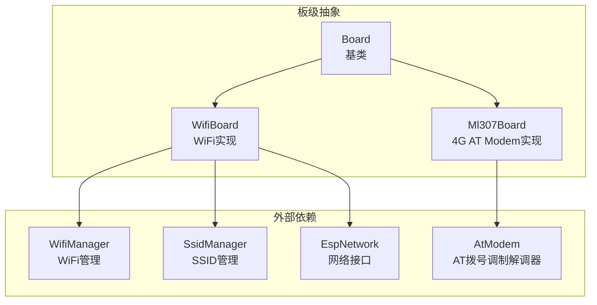
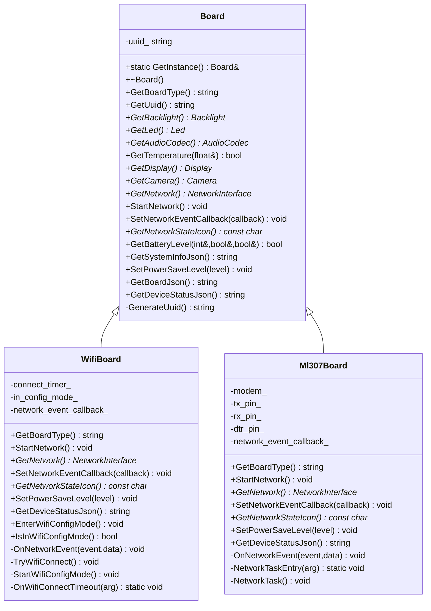
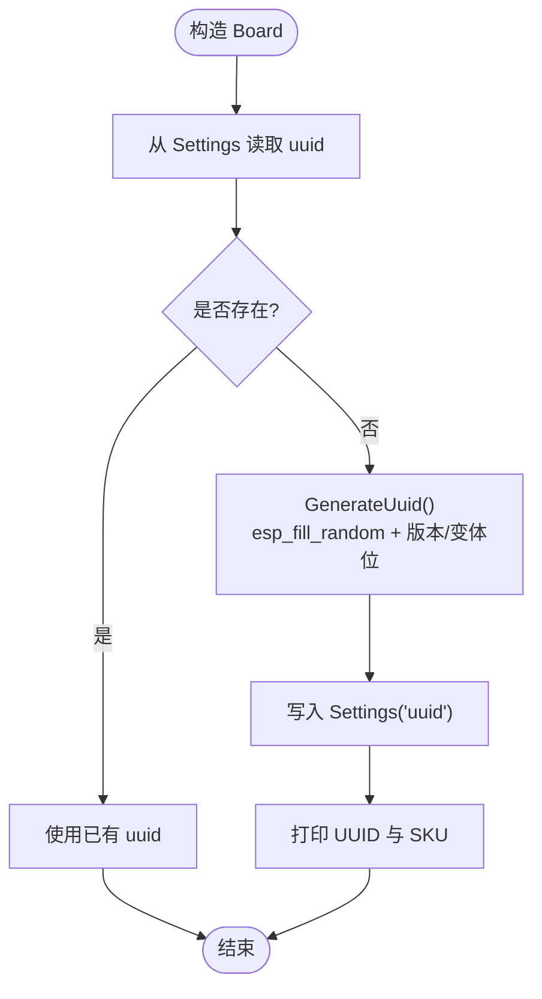
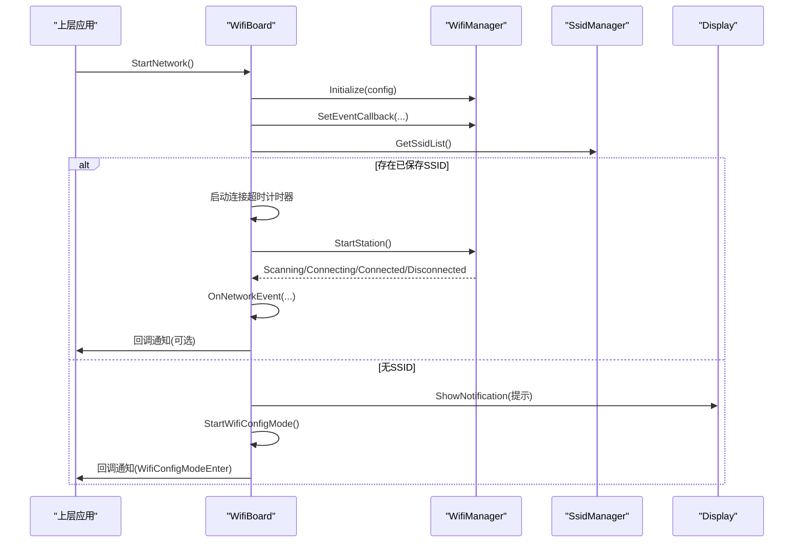
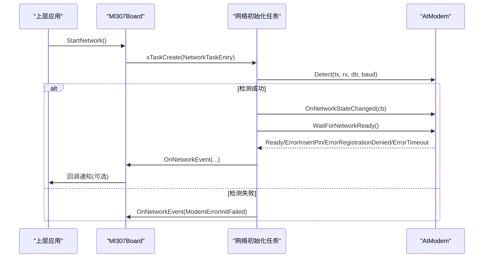
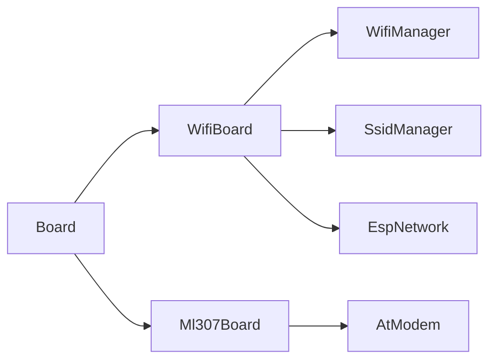

# Board基类设计

<cite>
**本文引用的文件**   
- [board.h](file://main/boards/common/board.h)
- [board.cc](file://main/boards/common/board.cc)
- [wifi_board.h](file://main/boards/common/wifi_board.h)
- [wifi_board.cc](file://main/boards/common/wifi_board.cc)
- [ml307_board.h](file://main/boards/common/ml307_board.h)
- [ml307_board.cc](file://main/boards/common/ml307_board.cc)
- [custom-board.md](file://docs/custom-board.md)
- [custom-board_zh.md](file://docs/custom-board_zh.md)
</cite>

## 目录
1. [引言](#引言)
2. [项目结构](#项目结构)
3. [核心组件](#核心组件)
4. [架构总览](#架构总览)
5. [详细组件分析](#详细组件分析)
6. [依赖关系分析](#依赖关系分析)
7. [性能与功耗特性](#性能与功耗特性)
8. [故障排查指南](#故障排查指南)
9. [结论](#结论)
10. [附录：自定义板卡开发步骤与最佳实践](#附录自定义板卡开发步骤与最佳实践)

## 引言
本文件围绕Board抽象基类及其派生类（WifiBoard、Ml307Board）进行系统化文档化，重点解释以下能力与接口规范：
- 设备标识管理：UUID的生成与持久化策略
- 硬件资源访问接口：音频编解码器、显示、背光、LED、摄像头等
- 网络事件回调机制：统一的事件枚举与回调注册
- 关键虚函数职责：GetBoardType()、GetAudioCodec()、GetNetwork()、StartNetwork()、SetPowerSaveLevel()、GetSystemInfoJson()、GetDeviceStatusJson()等
- 电源管理模式：PowerSaveLevel在WiFi与蜂窝场景下的落地方式
- 系统信息查询：芯片信息、分区表、应用版本、显示信息等聚合输出

## 项目结构
Board相关代码位于common目录下，提供统一的板级抽象与通用实现；具体网络类型（WiFi/4G）通过子类扩展。

图表来源
- [board.h:49-85](file://main/boards/common/board.h#L49-L85)
- [wifi_board.h:9-67](file://main/boards/common/wifi_board.h#L9-L67)
- [ml307_board.h:9-36](file://main/boards/common/ml307_board.h#L9-L36)

章节来源
- [board.h:49-85](file://main/boards/common/board.h#L49-L85)
- [wifi_board.h:9-67](file://main/boards/common/wifi_board.h#L9-L67)
- [ml307_board.h:9-36](file://main/boards/common/ml307_board.h#L9-L36)

## 核心组件
- Board抽象基类
  - 提供单例访问入口、UUID管理与默认实现、系统信息JSON聚合、基础硬件访问点（Display/Led/Camera/AudioCodec等）
  - 强制派生类实现的接口包括：GetBoardType()、GetAudioCodec()、GetNetwork()、StartNetwork()、GetNetworkStateIcon()、SetPowerSaveLevel()、GetBoardJson()、GetDeviceStatusJson()
- WifiBoard
  - 基于WifiManager/SsidManager完成WiFi连接流程，支持配网模式（AP/Blufi/声学配网），统一网络事件转发
  - 提供WiFi状态图标、设备状态JSON（含音量、亮度、电池、网络信号强度等）
- Ml307Board
  - 基于AT Modem完成4G模块检测、网络注册与状态上报，提供蜂窝网络状态图标与设备状态JSON

章节来源
- [board.h:49-85](file://main/boards/common/board.h#L49-L85)
- [board.cc:15-46](file://main/boards/common/board.cc#L15-L46)
- [wifi_board.h:9-67](file://main/boards/common/wifi_board.h#L9-L67)
- [wifi_board.cc:48-145](file://main/boards/common/wifi_board.cc#L48-L145)
- [ml307_board.h:9-36](file://main/boards/common/ml307_board.h#L9-L36)
- [ml307_board.cc:20-65](file://main/boards/common/ml307_board.cc#L20-L65)

## 架构总览
Board作为顶层抽象，屏蔽不同网络栈与外设差异，向上层Application暴露统一接口。

图表来源
- [board.h:49-85](file://main/boards/common/board.h#L49-L85)
- [wifi_board.h:9-67](file://main/boards/common/wifi_board.h#L9-L67)
- [ml307_board.h:9-36](file://main/boards/common/ml307_board.h#L9-L36)

## 详细组件分析

### Board基类设计与接口规范
- 设计要点
  - 单例模式：GetInstance()通过create_board工厂函数返回具体板型实例
  - UUID管理：首次启动时生成并持久化，后续重启复用
  - 默认实现：无屏/无灯/无相机/温度读取失败等“空实现”，便于最小化板卡快速跑通
  - 系统信息聚合：GetSystemInfoJson()汇总语言、Flash、堆、MAC、UUID、芯片信息、应用描述、分区表、OTA、显示信息与板级信息
- 关键虚函数说明
  - GetBoardType()：返回板卡类型字符串（如“wifi”、“ml307”）
  - GetAudioCodec()：返回音频编解码器指针，派生类需根据硬件实现
  - GetNetwork()/StartNetwork()：获取网络接口与启动网络连接（异步）
  - SetNetworkEventCallback()：注册统一网络事件回调
  - GetNetworkStateIcon()：返回当前网络状态图标
  - SetPowerSaveLevel()：设置功耗等级（LOW_POWER/BALANCED/PERFORMANCE）
  - GetBoardJson()/GetDeviceStatusJson()：分别返回板级元数据与运行时设备状态
  - GetSystemInfoJson()：返回系统级综合信息（由基类实现）

章节来源
- [board.h:49-85](file://main/boards/common/board.h#L49-L85)
- [board.cc:70-178](file://main/boards/common/board.cc#L70-L178)

#### 设备UUID生成与持久化机制
- 流程概述
  - 构造时从Settings读取“uuid”键值
  - 若为空则调用GenerateUuid()生成UUID v4，写入Settings并记录日志
- 算法要点
  - 使用硬件随机源填充16字节
  - 按RFC 4122设置版本位与变体位
  - 格式化为标准36字符字符串

图表来源
- [board.cc:15-46](file://main/boards/common/board.cc#L15-L46)

章节来源
- [board.cc:15-46](file://main/boards/common/board.cc#L15-L46)

#### 系统信息查询与JSON聚合
- 内容范围
  - 语言、Flash大小、最小空闲堆、MAC地址、UUID
  - 芯片型号/核心数/修订/特性
  - 应用名称/版本/编译时间/IDF版本/ELF SHA256
  - 分区表列表、当前运行OTA分区
  - 显示信息（是否单色、宽高）
  - 板级信息（由派生类GetBoardJson()拼接）
- 复杂度
  - 遍历分区表，线性复杂度O(N)，N为分区数量
  - 字符串拼接开销可控，适合周期性查询或调试导出

章节来源
- [board.cc:70-178](file://main/boards/common/board.cc#L70-L178)

### WifiBoard：WiFi网络与配网流程
- 职责
  - 初始化并启动WiFi管理器，桥接底层WiFi事件到统一NetworkEvent
  - 处理超时进入配网模式（AP/Blufi/声学配网）
  - 提供WiFi状态图标与设备状态JSON
- 关键流程
  - StartNetwork()：初始化配置、注册事件回调、尝试连接或进入配网
  - TryWifiConnect()：有SSID则发起连接并设超时；无SSID直接进入配网
  - OnNetworkEvent()：停止超时计时器、切换配网标志、转发回调
  - EnterWifiConfigMode()：安全地中断正在进行的任务后进入配网

图表来源
- [wifi_board.cc:52-145](file://main/boards/common/wifi_board.cc#L52-L145)
- [wifi_board.cc:159-238](file://main/boards/common/wifi_board.cc#L159-L238)

章节来源
- [wifi_board.h:9-67](file://main/boards/common/wifi_board.h#L9-L67)
- [wifi_board.cc:48-145](file://main/boards/common/wifi_board.cc#L48-L145)
- [wifi_board.cc:159-238](file://main/boards/common/wifi_board.cc#L159-L238)

#### WiFi网络事件回调机制
- 事件映射
  - Scanning/Connecting/Connected/Disconnected/WifiConfigModeEnter/WifiConfigModeExit
- 回调注册
  - SetNetworkEventCallback()允许上层订阅统一事件，用于UI更新或业务逻辑

章节来源
- [board.h:20-44](file://main/boards/common/board.h#L20-L44)
- [wifi_board.cc:62-83](file://main/boards/common/wifi_board.cc#L62-L83)
- [wifi_board.cc:147-149](file://main/boards/common/wifi_board.cc#L147-L149)

#### WiFi状态图标与设备状态JSON
- 图标选择
  - 依据是否处于配网模式、是否连接、RSSI阈值选择不同图标
- 设备状态JSON
  - 包含音频音量、屏幕亮度/主题、电池电量/充放电状态、网络类型/信号强度、芯片温度等

章节来源
- [wifi_board.cc:249-266](file://main/boards/common/wifi_board.cc#L249-L266)
- [wifi_board.cc:301-357](file://main/boards/common/wifi_board.cc#L301-L357)

### Ml307Board：4G AT Modem网络
- 职责
  - 创建独立任务执行网络初始化：检测Modem、等待网络就绪、上报错误与状态
  - 将网络状态变化转换为统一NetworkEvent并触发回调
- 关键流程
  - StartNetwork()：创建任务并立即返回
  - NetworkTask()：循环重试检测Modem与网络注册，遇到SIM缺失/拒绝/超时等错误上报
  - GetNetwork()：返回AtModem指针作为NetworkInterface
  - GetNetworkStateIcon()：基于CSQ计算信号强度图标
  - GetDeviceStatusJson()：输出蜂窝网络类型、运营商、信号强度等

图表来源
- [ml307_board.cc:134-141](file://main/boards/common/ml307_board.cc#L134-L141)
- [ml307_board.cc:67-132](file://main/boards/common/ml307_board.cc#L67-L132)
- [ml307_board.cc:27-65](file://main/boards/common/ml307_board.cc#L27-L65)

章节来源
- [ml307_board.h:9-36](file://main/boards/common/ml307_board.h#L9-L36)
- [ml307_board.cc:20-65](file://main/boards/common/ml307_board.cc#L20-L65)
- [ml307_board.cc:134-141](file://main/boards/common/ml307_board.cc#L134-L141)

## 依赖关系分析
- 组件耦合
  - Board为松耦合抽象，具体网络栈由子类注入（WifiManager/AtModem）
  - 事件模型统一，避免上层对底层细节的感知
- 外部依赖
  - WiFi路径：WifiManager、SsidManager、EspNetwork
  - 4G路径：AtModem（串口+AT命令集）
- 潜在循环依赖
  - 未发现直接循环引用；事件回调以函数对象形式传递，降低耦合

图表来源
- [board.h:49-85](file://main/boards/common/board.h#L49-L85)
- [wifi_board.h:9-67](file://main/boards/common/wifi_board.h#L9-L67)
- [ml307_board.h:9-36](file://main/boards/common/ml307_board.h#L9-L36)

章节来源
- [board.h:49-85](file://main/boards/common/board.h#L49-L85)
- [wifi_board.h:9-67](file://main/boards/common/wifi_board.h#L9-L67)
- [ml307_board.h:9-36](file://main/boards/common/ml307_board.h#L9-L36)

## 性能与功耗特性
- 功耗等级
  - PowerSaveLevel::LOW_POWER/BALANCED/PERFORMANCE
  - WiFi路径：通过WifiManager.SetPowerSaveLevel生效
  - 4G路径：当前未实现（占位）
- 连接超时与重试
  - WiFi连接超时进入配网，避免长时间阻塞
  - 4G模块检测与网络注册具备最大重试次数，防止无限等待
- JSON序列化
  - 系统信息JSON包含大量字段，建议按需调用或在后台任务中生成

章节来源
- [wifi_board.cc:284-299](file://main/boards/common/wifi_board.cc#L284-L299)
- [ml307_board.cc:181-184](file://main/boards/common/ml307_board.cc#L181-L184)
- [board.cc:70-178](file://main/boards/common/board.cc#L70-L178)

## 故障排查指南
- 无法连接WiFi
  - 检查是否有已保存SSID；若无，确认是否进入配网模式
  - 查看网络事件回调中的Scanning/Connecting/Disconnected状态
- 配网模式异常
  - 确认是否触发了EnterWifiConfigMode；观察是否因超时进入
  - 检查AP/Blufi/声学配网分支是否启用
- 4G模块不可用
  - 关注ModemDetecting/ModemErrorInitFailed等事件
  - 检查串口引脚与波特率配置
- 设备状态JSON为空或不完整
  - 确认GetAudioCodec()/GetBacklight()/GetDisplay()是否返回有效对象
  - 检查GetBatteryLevel()是否被正确实现

章节来源
- [wifi_board.cc:151-157](file://main/boards/common/wifi_board.cc#L151-L157)
- [wifi_board.cc:159-238](file://main/boards/common/wifi_board.cc#L159-L238)
- [ml307_board.cc:31-65](file://main/boards/common/ml307_board.cc#L31-L65)

## 结论
Board抽象通过统一接口屏蔽了不同网络栈与外设差异，提供了完善的设备标识、系统信息查询与网络事件回调机制。WifiBoard与Ml307Board分别在WiFi与4G场景下实现了完整的生命周期管理与状态上报，便于上层应用以一致的方式控制设备与展示状态。

## 附录：自定义板卡开发步骤与最佳实践
- 目录与命名
  - 在main/boards下新建目录，遵循[品牌]-[型号]命名
- 配置文件
  - config.h：定义音频采样率、I2S引脚、编解码器I2C地址、按钮/LED/显示屏引脚等
  - config.json：指定目标芯片、固件包名与sdkconfig追加项
- 板级实现
  - 继承自WifiBoard或Ml307Board
  - 重写必要虚函数：GetAudioCodec()、GetDisplay()、GetBacklight()等
  - 使用DECLARE_BOARD宏注册板型
- 构建系统集成
  - Kconfig.projbuild中添加BOARD_TYPE选项
  - CMakeLists.txt中添加对应分支，设置字体与表情集合
- 构建与烧录
  - 使用idf.py手动配置或直接使用release.py脚本自动化打包
- 注意事项
  - 不要覆盖原有板卡配置，保持唯一标识与升级通道
  - 分步调试：先点亮显示，再接入音频，最后联调网络
  - 严格核对管脚映射与硬件兼容性

章节来源
- [custom-board.md:1-474](file://docs/custom-board.md#L1-L474)
- [custom-board_zh.md:1-453](file://docs/custom-board_zh.md#L1-L453)