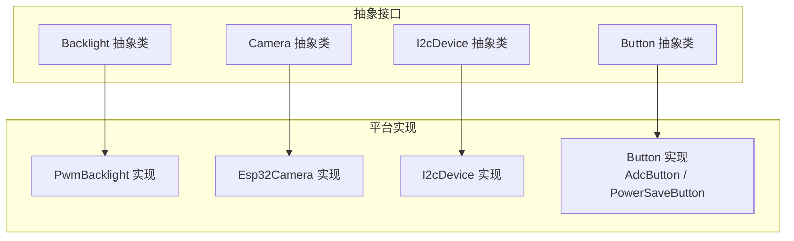
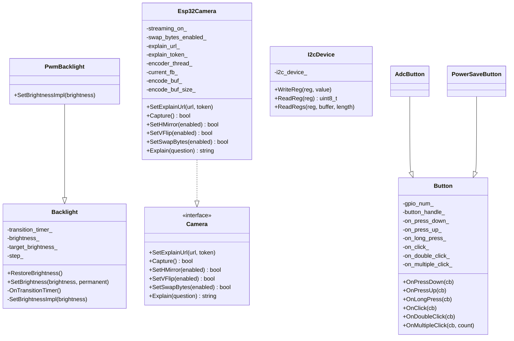
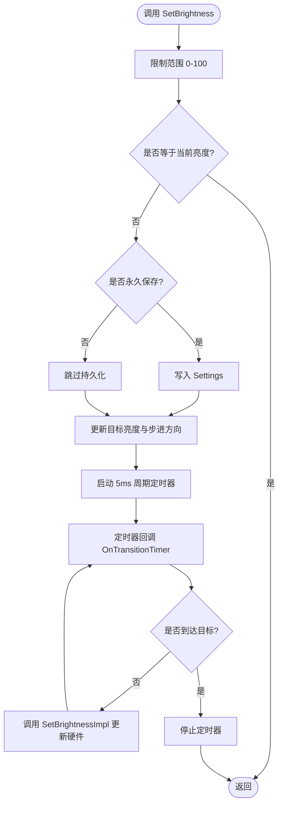
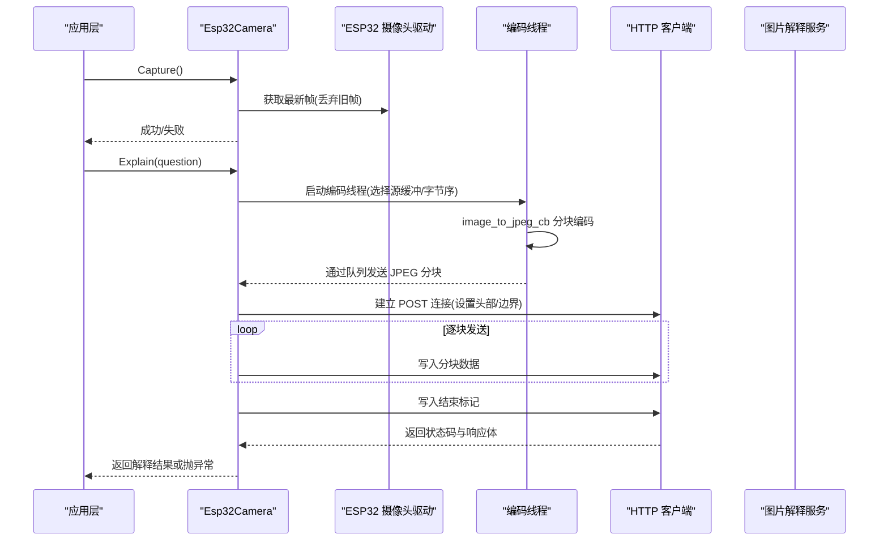
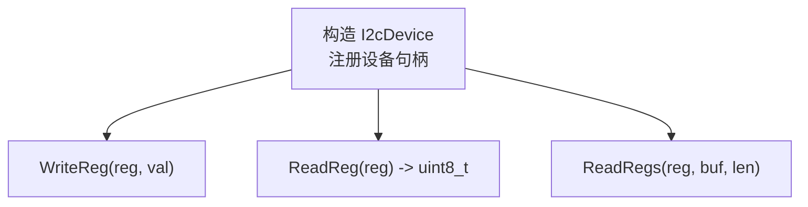
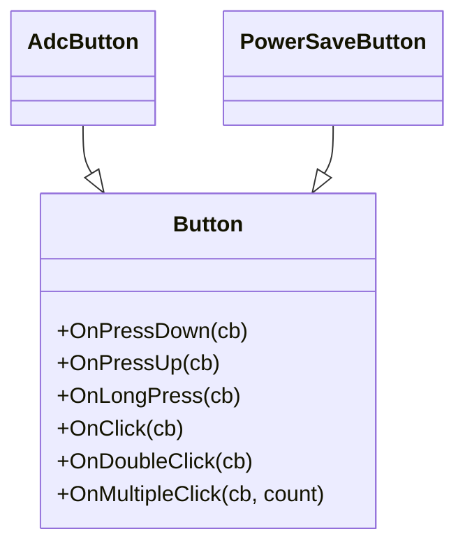
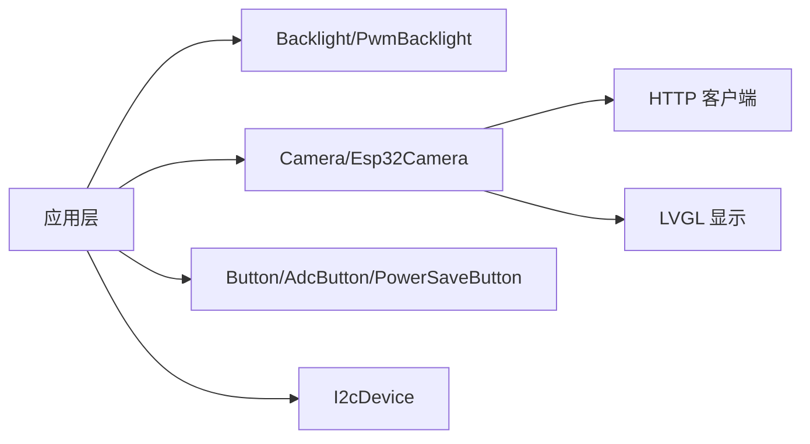

# 外设管理接口

<cite>
**本文引用的文件**   
- [backlight.h](file://main/boards/common/backlight.h)
- [backlight.cc](file://main/boards/common/backlight.cc)
- [camera.h](file://main/boards/common/camera.h)
- [esp32_camera.h](file://main/boards/common/esp32_camera.h)
- [esp32_camera.cc](file://main/boards/common/esp32_camera.cc)
- [i2c_device.h](file://main/boards/common/i2c_device.h)
- [i2c_device.cc](file://main/boards/common/i2c_device.cc)
- [button.h](file://main/boards/common/button.h)
- [button.cc](file://main/boards/common/button.cc)
</cite>

## 目录
1. [简介](#简介)
2. [项目结构](#项目结构)
3. [核心组件](#核心组件)
4. [架构总览](#架构总览)
5. [详细组件分析](#详细组件分析)
6. [依赖关系分析](#依赖关系分析)
7. [性能考虑](#性能考虑)
8. [故障排查指南](#故障排查指南)
9. [结论](#结论)
10. [附录](#附录)

## 简介
本文件面向“外设管理接口”的实现与使用，聚焦以下能力：
- 背光控制接口 Backlight：亮度调节、平滑过渡、持久化保存；定时关闭可通过上层定时器或任务配合实现。
- 摄像头抽象 Camera 及 ESP32 具体实现 Esp32Camera：图像采集、格式转换（含 RGB565 字节序处理）、内存管理、预览显示、JPEG 编码与网络上传。
- I2C 设备抽象层 I2cDevice：基于 ESP-IDF I2C Master 的设备注册与寄存器读写封装。
- 按钮输入 Button：按键检测、长按/短按识别、双击/多次点击回调；支持 GPIO 与 ADC 两种驱动方式。
- 通用外设集成方法：GPIO 扩展、ADC 采样、PWM 输出在本仓库中的接入点与推荐做法。
- 资源管理与错误处理：统一日志、异常抛出、内存分配策略与释放路径。

## 项目结构
与外设管理相关的核心代码位于 boards/common 目录下，采用“抽象接口 + 平台实现”的分层组织方式：
- 抽象接口：camera.h、i2c_device.h、button.h、backlight.h
- 平台实现：esp32_camera.*、i2c_device.*、button.*、backlight.*

图表来源
- [backlight.h:10-36](file://main/boards/common/backlight.h#L10-L36)
- [esp32_camera.h:22-44](file://main/boards/common/esp32_camera.h#L22-L44)
- [i2c_device.h:6-16](file://main/boards/common/i2c_device.h#L6-L16)
- [button.h:11-47](file://main/boards/common/button.h#L11-L47)

章节来源
- [backlight.h:10-36](file://main/boards/common/backlight.h#L10-L36)
- [esp32_camera.h:22-44](file://main/boards/common/esp32_camera.h#L22-L44)
- [i2c_device.h:6-16](file://main/boards/common/i2c_device.h#L6-L16)
- [button.h:11-47](file://main/boards/common/button.h#L11-L47)

## 核心组件
- Backlight/PwmBacklight：提供亮度设置、平滑过渡、持久化恢复；底层通过 LEDC PWM 输出控制。
- Camera/Esp32Camera：定义统一的拍照、镜像/翻转、字节序交换、图片解释等接口；ESP32 实现负责帧缓冲获取、RGB565 字节序处理、JPEG 编码与 HTTP 上传。
- I2cDevice：封装 I2C 设备句柄创建与单/多寄存器读写。
- Button/AdcButton/PowerSaveButton：封装 iot_button 库，提供多种事件回调；支持 GPIO 与 ADC 按键。

章节来源
- [backlight.h:10-36](file://main/boards/common/backlight.h#L10-L36)
- [backlight.cc:10-122](file://main/boards/common/backlight.cc#L10-L122)
- [camera.h:6-14](file://main/boards/common/camera.h#L6-L14)
- [esp32_camera.h:22-44](file://main/boards/common/esp32_camera.h#L22-L44)
- [esp32_camera.cc:20-323](file://main/boards/common/esp32_camera.cc#L20-L323)
- [i2c_device.h:6-16](file://main/boards/common/i2c_device.h#L6-L16)
- [i2c_device.cc:8-35](file://main/boards/common/i2c_device.cc#L8-L35)
- [button.h:11-47](file://main/boards/common/button.h#L11-L47)
- [button.cc:18-125](file://main/boards/common/button.cc#L18-L125)

## 架构总览
下图展示各组件的继承与依赖关系，以及关键数据流（如摄像头捕获→编码→上传）。

图表来源
- [backlight.h:10-36](file://main/boards/common/backlight.h#L10-L36)
- [esp32_camera.h:22-44](file://main/boards/common/esp32_camera.h#L22-L44)
- [i2c_device.h:6-16](file://main/boards/common/i2c_device.h#L6-L16)
- [button.h:11-47](file://main/boards/common/button.h#L11-L47)

## 详细组件分析

### 背光控制 Backlight 与 PwmBacklight
- 设计要点
  - 抽象基类 Backlight 维护当前亮度、目标亮度、步进方向与渐变定时器；子类实现 SetBrightnessImpl 以适配不同硬件。
  - PwmBacklight 基于 ESP-IDF LEDC 配置 10bit 分辨率通道，将 0-100 映射为 0-1023 占空比。
  - RestoreBrightness 从 Settings 读取并恢复亮度；SetBrightness 支持永久保存。
- 使用建议
  - 初始化时调用 RestoreBrightness 恢复用户上次设置。
  - 通过 SetBrightness 设置目标亮度；如需立即生效可结合上层逻辑在超时后调用 SetBrightness(0) 实现“定时关闭”。
  - 若需更精细的定时策略，可在应用层使用 esp_timer 周期性触发 SetBrightness(0)。

图表来源
- [backlight.cc:46-82](file://main/boards/common/backlight.cc#L46-L82)
- [backlight.cc:115-120](file://main/boards/common/backlight.cc#L115-L120)

章节来源
- [backlight.h:10-36](file://main/boards/common/backlight.h#L10-L36)
- [backlight.cc:10-122](file://main/boards/common/backlight.cc#L10-L122)

### 摄像头抽象 Camera 与 Esp32Camera 实现
- 抽象接口 Camera
  - 定义统一能力：设置图片解释服务 URL/Token、拍照、水平镜像、垂直翻转、可选的像素字节序交换、图片解释。
- Esp32Camera 实现要点
  - 初始化与传感器配置：通过 esp_camera_init 初始化，必要时针对特定传感器进行默认配置。
  - 帧获取与预览：优先丢弃旧帧以保证实时性；对 RGB565 格式进行可选字节序交换，并将预览图推送至 LVGL 显示。
  - JPEG 编码与上传：在独立线程中完成编码，通过队列分块传输到 HTTP 客户端，构造 multipart/form-data 上传。
  - 内存管理：RGB565 编码缓冲区与 JPEG 分块均使用 SPIRAM 分配；析构时释放帧缓冲与编码缓冲，并反初始化摄像头。
  - 错误处理：初始化失败、帧获取失败、队列创建失败、HTTP 连接/状态码异常等均记录日志并抛出运行时异常。

图表来源
- [esp32_camera.cc:59-130](file://main/boards/common/esp32_camera.cc#L59-L130)
- [esp32_camera.cc:155-323](file://main/boards/common/esp32_camera.cc#L155-L323)

章节来源
- [camera.h:6-14](file://main/boards/common/camera.h#L6-L14)
- [esp32_camera.h:22-44](file://main/boards/common/esp32_camera.h#L22-L44)
- [esp32_camera.cc:20-323](file://main/boards/common/esp32_camera.cc#L20-L323)

### I2C 设备抽象层 I2cDevice
- 功能概述
  - 构造函数中基于传入的 I2C 总线与设备地址创建设备句柄，固定 7bit 地址位宽与 400kHz 速率。
  - 提供单寄存器写、单寄存器读、连续寄存器读三个基础操作。
- 使用建议
  - 在上层设备驱动中继承 I2cDevice，复用寄存器读写能力，避免重复 I2C 事务细节。
  - 注意错误传播：内部已对 I2C 传输进行错误检查，上层应结合业务语义进行重试或降级。

图表来源
- [i2c_device.cc:8-35](file://main/boards/common/i2c_device.cc#L8-L35)

章节来源
- [i2c_device.h:6-16](file://main/boards/common/i2c_device.h#L6-L16)
- [i2c_device.cc:8-35](file://main/boards/common/i2c_device.cc#L8-L35)

### 按钮输入 Button、AdcButton、PowerSaveButton
- 功能概述
  - 基于 iot_button 封装，支持 GPIO 与 ADC 两种按键源。
  - 提供按下/抬起、单击、双击、长按、多次点击等回调注册。
  - PowerSaveButton 为便捷子类，启用低功耗模式。
- 使用建议
  - 根据硬件选择 GPIO 或 ADC 构造方式；对于需要省电的场景使用 PowerSaveButton。
  - 合理设置长按/短按时长以满足交互需求。

图表来源
- [button.h:11-47](file://main/boards/common/button.h#L11-L47)

章节来源
- [button.h:11-47](file://main/boards/common/button.h#L11-L47)
- [button.cc:18-125](file://main/boards/common/button.cc#L18-L125)

### 通用外设集成方法（GPIO 扩展、ADC 采样、PWM 输出）
- GPIO 扩展
  - 参考现有板级实现中对 GPIO 的使用方式，结合 i2c_device 访问外部扩展芯片（如 IO Expander），通过寄存器配置引脚方向与电平。
- ADC 采样
  - 使用 AdcButton 作为 ADC 按键示例；对于通用 ADC 采样，可在对应板级文件中引入 ESP-IDF ADC 驱动并进行校准与滤波。
- PWM 输出
  - 参考 PwmBacklight 的 LEDC 配置方式，按需配置频率、分辨率与通道，用于驱动电机、LED 调光等场景。

[本节为概念性指导，不直接分析具体文件]

## 依赖关系分析
- 组件耦合
  - Backlight 与底层 LEDC 驱动解耦，通过虚函数 SetBrightnessImpl 扩展。
  - Esp32Camera 依赖 ESP32 摄像头驱动、LVGL 显示、HTTP 网络栈与系统信息模块。
  - I2cDevice 仅依赖 ESP-IDF I2C Master API，便于移植到其他总线。
  - Button 依赖 iot_button 库，屏蔽底层中断与消抖细节。
- 潜在循环依赖
  - 当前实现未见明显循环依赖；上层应用通过抽象接口组合各组件。

图表来源
- [esp32_camera.cc:10-18](file://main/boards/common/esp32_camera.cc#L10-L18)
- [backlight.cc:4-6](file://main/boards/common/backlight.cc#L4-L6)
- [button.cc:3-4](file://main/boards/common/button.cc#L3-L4)
- [i2c_device.cc:1-3](file://main/boards/common/i2c_device.cc#L1-L3)

章节来源
- [esp32_camera.cc:10-18](file://main/boards/common/esp32_camera.cc#L10-L18)
- [backlight.cc:4-6](file://main/boards/common/backlight.cc#L4-L6)
- [button.cc:3-4](file://main/boards/common/button.cc#L3-L4)
- [i2c_device.cc:1-3](file://main/boards/common/i2c_device.cc#L1-L3)

## 性能考虑
- 背光渐变
  - 5ms 周期定时器更新，兼顾流畅度与 CPU 占用；可根据实际体验调整步长与周期。
- 摄像头
  - 优先丢弃旧帧保证实时性；RGB565 字节序交换仅在需要时执行；JPEG 编码在独立线程中进行，避免阻塞主流程。
  - 大对象尽量分配在 SPIRAM，降低 PSRAM 碎片风险；及时释放临时缓冲。
- I2C
  - 400kHz 速率适合大多数外设；批量读取使用 ReadRegs 减少事务次数。
- 按钮
  - 使用 iot_button 内置消抖与事件去重；低功耗模式下可降低扫描频率。

[本节提供一般性建议，不直接分析具体文件]

## 故障排查指南
- 背光无法恢复或亮度异常
  - 检查 Settings 中 display.brightness 值是否为有效正数；确认 LEDC 通道与引脚配置正确。
- 摄像头初始化失败或无帧
  - 查看初始化错误码与日志；确认 camera_config_t 参数与硬件连线；检查 SPIRAM 分配是否成功。
- 图片解释失败
  - 确认已设置 URL 与 Token；检查网络连接与服务器状态码；关注编码线程是否产生有效分块。
- I2C 读写失败
  - 核对设备地址、SCL/SDA 引脚与上拉电阻；确认总线时钟与器件规格匹配。
- 按钮无响应或误触发
  - 检查 active_level 与硬件电路；适当调整长按/短按时长；确认未禁用下拉导致浮空。

章节来源
- [backlight.cc:32-44](file://main/boards/common/backlight.cc#L32-L44)
- [esp32_camera.cc:20-36](file://main/boards/common/esp32_camera.cc#L20-L36)
- [esp32_camera.cc:155-169](file://main/boards/common/esp32_camera.cc#L155-L169)
- [esp32_camera.cc:310-323](file://main/boards/common/esp32_camera.cc#L310-L323)
- [i2c_device.cc:8-19](file://main/boards/common/i2c_device.cc#L8-L19)
- [button.cc:21-36](file://main/boards/common/button.cc#L21-L36)

## 结论
本外设管理接口通过清晰的抽象与平台实现分离，提供了可扩展的背光、摄像头、I2C 与按钮能力。结合统一的错误处理与内存管理策略，能够在多板型平台上稳定运行。建议在新增外设时遵循相同分层模式，保持接口稳定与实现可替换。

[本节为总结性内容，不直接分析具体文件]

## 附录
- 相关头文件与实现文件路径
  - 背光：[backlight.h](file://main/boards/common/backlight.h)、[backlight.cc](file://main/boards/common/backlight.cc)
  - 摄像头：[camera.h](file://main/boards/common/camera.h)、[esp32_camera.h](file://main/boards/common/esp32_camera.h)、[esp32_camera.cc](file://main/boards/common/esp32_camera.cc)
  - I2C：[i2c_device.h](file://main/boards/common/i2c_device.h)、[i2c_device.cc](file://main/boards/common/i2c_device.cc)
  - 按钮：[button.h](file://main/boards/common/button.h)、[button.cc](file://main/boards/common/button.cc)

[本节为索引性内容，不直接分析具体文件]