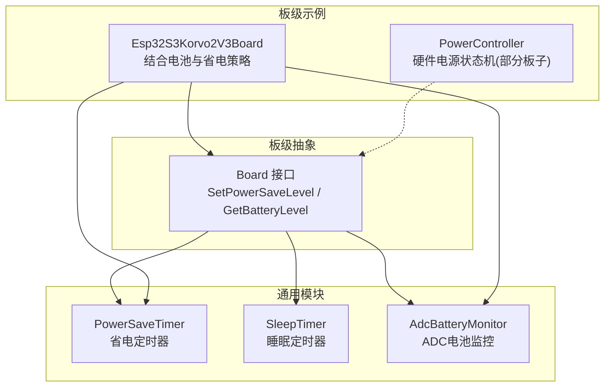
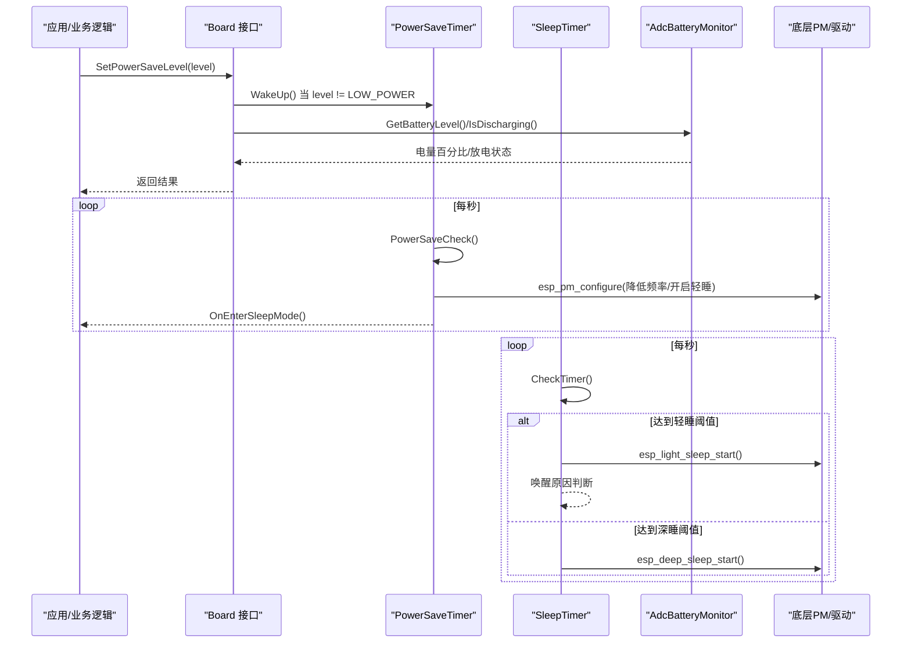
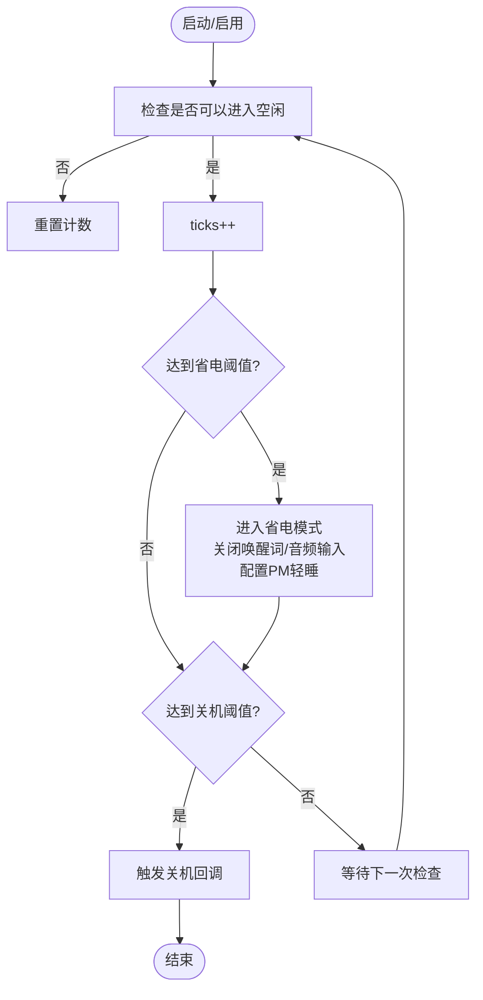
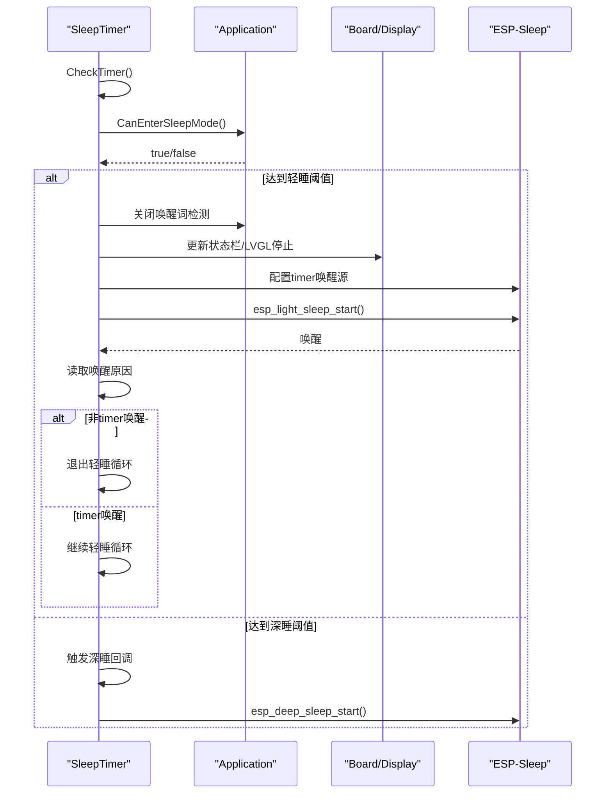
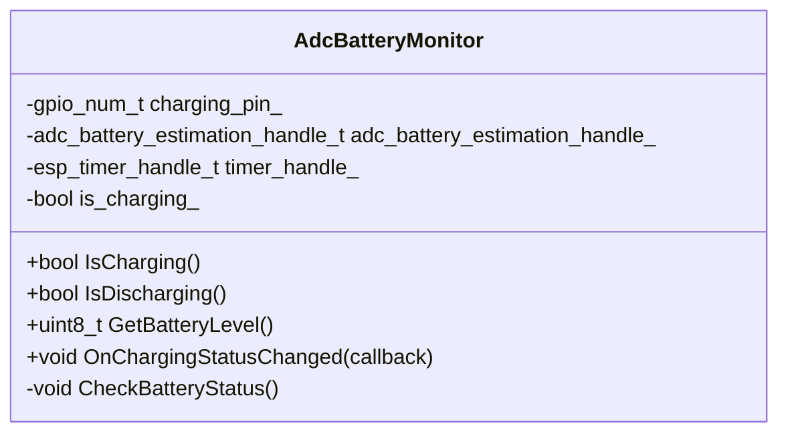
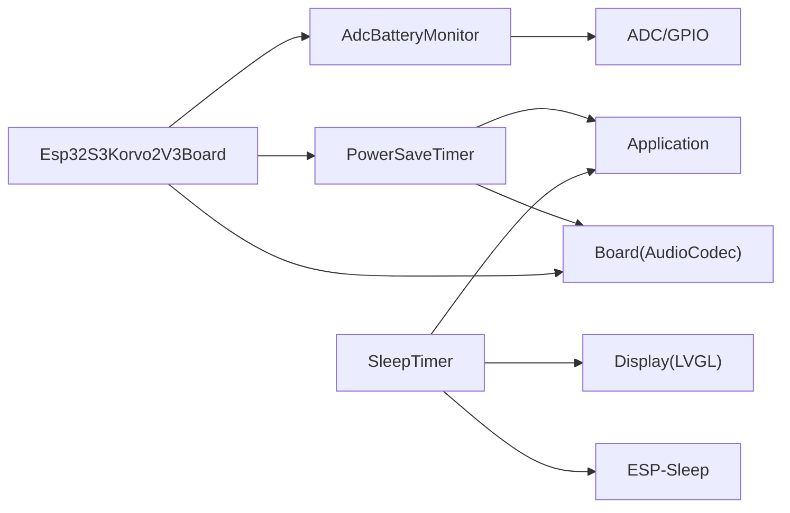

# 电源管理系统

<cite>
**本文引用的文件**   
- [board.h](file://main/boards/common/board.h)
- [power_save_timer.h](file://main/boards/common/power_save_timer.h)
- [power_save_timer.cc](file://main/boards/common/power_save_timer.cc)
- [sleep_timer.h](file://main/boards/common/sleep_timer.h)
- [sleep_timer.cc](file://main/boards/common/sleep_timer.cc)
- [adc_battery_monitor.h](file://main/boards/common/adc_battery_monitor.h)
- [adc_battery_monitor.cc](file://main/boards/common/adc_battery_monitor.cc)
- [esp32s3_korvo2_v3_board.cc](file://main/boards/esp32s3-korvo2-v3/esp32s3_korvo2_v3_board.cc)
- [power_manager.h（korvo2-v3）](file://main/boards/esp32s3-korvo2-v3/power_manager.h)
- [power_controller.h（jiuchuan-s3）](file://main/boards/jiuchuan-s3/power_controller.h)
</cite>

## 目录
1. [简介](#简介)
2. [项目结构](#项目结构)
3. [核心组件](#核心组件)
4. [架构总览](#架构总览)
5. [详细组件分析](#详细组件分析)
6. [依赖关系分析](#依赖关系分析)
7. [性能与功耗优化建议](#性能与功耗优化建议)
8. [故障排查指南](#故障排查指南)
9. [结论](#结论)

## 简介
本指南面向电源管理子系统，围绕以下目标展开：
- 说明省电级别 PowerSaveLevel 的设计与适用场景（低功耗、平衡、高性能）。
- 解释省电定时器 PowerSaveTimer 的工作原理：空闲检测、自动休眠、唤醒机制。
- 阐述睡眠定时器 SleepTimer 的实现：轻睡眠与深度睡眠的切换与恢复。
- 说明电池监控 AdcBatteryMonitor 的功能：电量估算、充电状态判断、低电量告警联动。
- 提供功耗优化策略与提升续航的最佳实践。

## 项目结构
电源管理相关代码主要位于 boards/common 目录下，包含通用的省电与睡眠控制模块；各具体板级实现通过 Board 抽象接口接入，并在需要时扩展电源行为。

图表来源
- [power_save_timer.h:1-35](file://main/boards/common/power_save_timer.h#L1-L35)
- [sleep_timer.h:1-33](file://main/boards/common/sleep_timer.h#L1-L33)
- [adc_battery_monitor.h:1-31](file://main/boards/common/adc_battery_monitor.h#L1-L31)
- [board.h:35-40](file://main/boards/common/board.h#L35-L40)
- [esp32s3_korvo2_v3_board.cc:437-454](file://main/boards/esp32s3-korvo2-v3/esp32s3_korvo2_v3_board.cc#L437-L454)
- [power_controller.h:1-58](file://main/boards/jiuchuan-s3/power_controller.h#L1-L58)

章节来源
- [board.h:35-40](file://main/boards/common/board.h#L35-L40)

## 核心组件
- 省电级别 PowerSaveLevel：定义设备整体功耗档位，用于上层策略选择。
- 省电定时器 PowerSaveTimer：基于系统空闲时长触发“省电模式”，可配置进入轻睡眠与关闭唤醒词等。
- 睡眠定时器 SleepTimer：在空闲条件下进入轻睡眠或深度睡眠，支持回调与唤醒源配置。
- ADC 电池监控 AdcBatteryMonitor：周期采样并估算电量，检测充电状态变化，供上层做策略与告警。

章节来源
- [power_save_timer.h:1-35](file://main/boards/common/power_save_timer.h#L1-L35)
- [sleep_timer.h:1-33](file://main/boards/common/sleep_timer.h#L1-L33)
- [adc_battery_monitor.h:1-31](file://main/boards/common/adc_battery_monitor.h#L1-L31)
- [board.h:35-40](file://main/boards/common/board.h#L35-L40)

## 架构总览
下图展示了从应用层到硬件层的电源管理调用链与数据流。

图表来源
- [esp32s3_korvo2_v3_board.cc:437-454](file://main/boards/esp32s3-korvo2-v3/esp32s3_korvo2_v3_board.cc#L437-L454)
- [power_save_timer.cc:62-104](file://main/boards/common/power_save_timer.cc#L62-L104)
- [power_save_timer.cc:106-133](file://main/boards/common/power_save_timer.cc#L106-L133)
- [sleep_timer.cc:66-123](file://main/boards/common/sleep_timer.cc#L66-L123)
- [adc_battery_monitor.cc:108-116](file://main/boards/common/adc_battery_monitor.cc#L108-L116)

## 详细组件分析

### 省电级别 PowerSaveLevel 设计
- 枚举值与含义
  - LOW_POWER：最大省电（最低功耗），适合长时间待机、弱交互场景。
  - BALANCED：中等省电，兼顾响应与能耗，适合一般使用。
  - PERFORMANCE：不省电（最高功耗/全性能），适合高负载任务。
- 典型用法
  - 板级实现中，当设置非 LOW_POWER 时，会主动唤醒省电定时器，避免误入省电态。
  - 结合电池状态（是否放电）动态启用/禁用省电定时器，以延长续航。

章节来源
- [board.h:35-40](file://main/boards/common/board.h#L35-L40)
- [esp32s3_korvo2_v3_board.cc:446-451](file://main/boards/esp32s3-korvo2-v3/esp32s3_korvo2_v3_board.cc#L446-L451)

### 省电定时器 PowerSaveTimer 工作原理
- 关键能力
  - 周期性检查空闲条件，累计 ticks_ 秒后进入省电模式。
  - 进入省电模式时：可选关闭唤醒词检测、关闭音频输入、调整 CPU 频率并允许轻睡眠。
  - 退出省电模式时：恢复 CPU 频率、按需重新开启唤醒词检测、触发退出回调。
  - 支持关机请求回调，便于在超长空闲时执行安全关机流程。
- 重要参数
  - seconds_to_sleep：进入省电模式的空闲秒数。
  - seconds_to_shutdown：触发关机请求的累计秒数（可选）。
  - cpu_max_freq：CPU 最大频率，影响性能与功耗权衡。
- 与板级集成
  - 板级可在检测到“放电”时启用省电定时器，在“充电”时禁用，避免插着电也进入省电态。

图表来源
- [power_save_timer.cc:62-104](file://main/boards/common/power_save_timer.cc#L62-L104)
- [power_save_timer.cc:106-133](file://main/boards/common/power_save_timer.cc#L106-L133)

章节来源
- [power_save_timer.h:1-35](file://main/boards/common/power_save_timer.h#L1-L35)
- [power_save_timer.cc:1-133](file://main/boards/common/power_save_timer.cc#L1-L133)
- [esp32s3_korvo2_v3_board.cc:437-454](file://main/boards/esp32s3-korvo2-v3/esp32s3_korvo2_v3_board.cc#L437-L454)

### 睡眠定时器 SleepTimer 实现
- 功能概述
  - 周期性检查空闲条件，达到轻睡阈值则进入轻睡眠，达到深睡阈值则进入深度睡眠。
  - 支持进入/退出轻睡回调、进入深睡回调。
  - 轻睡循环内刷新显示状态栏，配置定时唤醒源，处理唤醒原因。
- 关键流程
  - 进入轻睡前：关闭唤醒词检测，暂停 LVGL 渲染，配置 timer 唤醒源，调用轻睡 API。
  - 唤醒后：根据唤醒原因决定是否继续轻睡循环或退出。
  - 达到深睡阈值：触发回调并调用深度睡眠 API。

图表来源
- [sleep_timer.cc:66-123](file://main/boards/common/sleep_timer.cc#L66-L123)

章节来源
- [sleep_timer.h:1-33](file://main/boards/common/sleep_timer.h#L1-L33)
- [sleep_timer.cc:1-134](file://main/boards/common/sleep_timer.cc#L1-L134)

### 电池监控 AdcBatteryMonitor 功能
- 能力说明
  - 初始化 ADC 单元与通道，支持分压电阻配置。
  - 可选接入充电检测引脚，优先使用库函数进行充电状态估计，否则回退到 GPIO 电平读取。
  - 周期任务获取容量百分比，并在充电状态变化时触发回调。
- 与上层联动
  - 板级可根据 IsDischarging() 动态启用/禁用省电定时器，从而在电池供电时更积极地节能。
  - 上层可订阅充电状态变化，用于 UI 提示或策略切换。

图表来源
- [adc_battery_monitor.h:1-31](file://main/boards/common/adc_battery_monitor.h#L1-L31)
- [adc_battery_monitor.cc:1-116](file://main/boards/common/adc_battery_monitor.cc#L1-L116)

章节来源
- [adc_battery_monitor.h:1-31](file://main/boards/common/adc_battery_monitor.h#L1-L31)
- [adc_battery_monitor.cc:1-116](file://main/boards/common/adc_battery_monitor.cc#L1-L116)
- [esp32s3_korvo2_v3_board.cc:437-454](file://main/boards/esp32s3-korvo2-v3/esp32s3_korvo2_v3_board.cc#L437-L454)

### 板级电源控制器（部分板子）
- 某些板子提供独立的电源状态机，统一管理 ACTIVE、LIGHT_SLEEP、DEEP_SLEEP、SHUTDOWN 等状态，并通过 RTC IO 控制电源使能。
- 该控制器可作为更细粒度的电源开关，与通用定时器配合使用。

章节来源
- [power_controller.h:1-58](file://main/boards/jiuchuan-s3/power_controller.h#L1-L58)

## 依赖关系分析
- 模块耦合
  - PowerSaveTimer 依赖 Application 的空闲判定与音频服务，以及 Board 的音频编解码器。
  - SleepTimer 依赖 Application、Board 的 Display 与 ESP-Sleep 驱动。
  - AdcBatteryMonitor 依赖 ADC 与可选 GPIO，向上层暴露统一接口。
- 外部依赖
  - ESP-IDF 的 esp_pm、esp_sleep、esp_timer 等驱动。
  - 板级特定的电源管理实现（如 korvo2-v3 的 power_manager.h 中的电量映射与低电量回调）。

图表来源
- [power_save_timer.cc:62-104](file://main/boards/common/power_save_timer.cc#L62-L104)
- [sleep_timer.cc:66-123](file://main/boards/common/sleep_timer.cc#L66-L123)
- [adc_battery_monitor.cc:1-116](file://main/boards/common/adc_battery_monitor.cc#L1-L116)
- [esp32s3_korvo2_v3_board.cc:437-454](file://main/boards/esp32s3-korvo2-v3/esp32s3_korvo2_v3_board.cc#L437-L454)

章节来源
- [power_save_timer.cc:62-104](file://main/boards/common/power_save_timer.cc#L62-L104)
- [sleep_timer.cc:66-123](file://main/boards/common/sleep_timer.cc#L66-L123)
- [adc_battery_monitor.cc:1-116](file://main/boards/common/adc_battery_monitor.cc#L1-L116)
- [esp32s3_korvo2_v3_board.cc:437-454](file://main/boards/esp32s3-korvo2-v3/esp32s3_korvo2_v3_board.cc#L437-L454)

## 性能与功耗优化建议
- 合理设置省电与睡眠阈值
  - 根据产品形态与用户期望调整 seconds_to_sleep 与 seconds_to_deep_sleep，避免频繁唤醒导致额外开销。
- 利用电池状态动态策略
  - 在放电状态下启用省电定时器，在充电时禁用，减少不必要的休眠/唤醒抖动。
- 音频与唤醒词管理
  - 进入省电/轻睡前关闭唤醒词检测与音频输入，退出后再按需恢复，避免后台持续耗电。
- CPU 频率与 PM 配置
  - 在空闲阶段降低最小频率并允许轻睡，活跃时恢复高频，平衡响应与功耗。
- 显示与外设
  - 轻睡前暂停 LVGL 渲染与屏幕刷新，必要时降低背光亮度或关闭非必要外设。
- 低电量告警与用户体验
  - 结合电量估算与低电量阈值，提前提示用户或限制高功耗功能，延长可用时间。

[本节为通用指导，无需源码引用]

## 故障排查指南
- 无法进入省电/睡眠
  - 检查 Application.CanEnterSleepMode 返回值，确认无阻塞任务或网络活动。
  - 核对 settings 中 sleep_mode 开关是否被禁用。
- 唤醒后行为异常
  - 查看轻睡唤醒原因是否为 timer，若非 timer 唤醒需按业务逻辑处理。
  - 确认唤醒词检测与音频输入在退出省电/轻睡后正确恢复。
- 电量读数不准确
  - 校验 ADC 分压电阻配置与通道衰减设置。
  - 若未配置充电检测引脚，确认回退逻辑是否满足需求。
- 低电量告警未触发
  - 确认上层已注册充电状态变化回调，且阈值设置合理。

章节来源
- [power_save_timer.cc:30-48](file://main/boards/common/power_save_timer.cc#L30-L48)
- [sleep_timer.cc:34-52](file://main/boards/common/sleep_timer.cc#L34-L52)
- [sleep_timer.cc:102-108](file://main/boards/common/sleep_timer.cc#L102-L108)
- [adc_battery_monitor.cc:108-116](file://main/boards/common/adc_battery_monitor.cc#L108-L116)

## 结论
本电源管理系统通过分层设计将“省电级别”“省电定时器”“睡眠定时器”“电池监控”解耦，既保证了在不同板级上的可移植性，又提供了灵活的策略组合空间。借助电池状态与空闲检测，系统能够在保证用户体验的前提下最大化续航；同时，完善的回调与唤醒机制使得复杂场景下的电源管理更加稳健可靠。