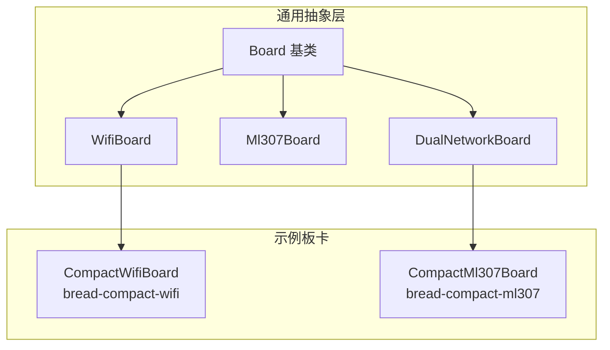
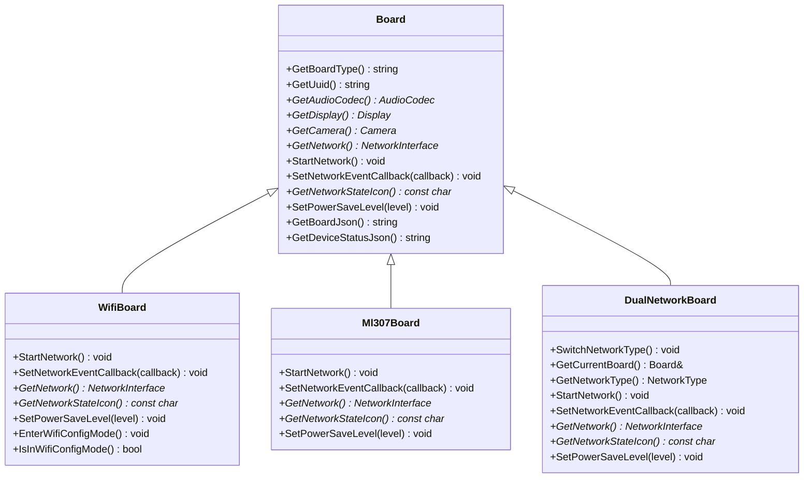
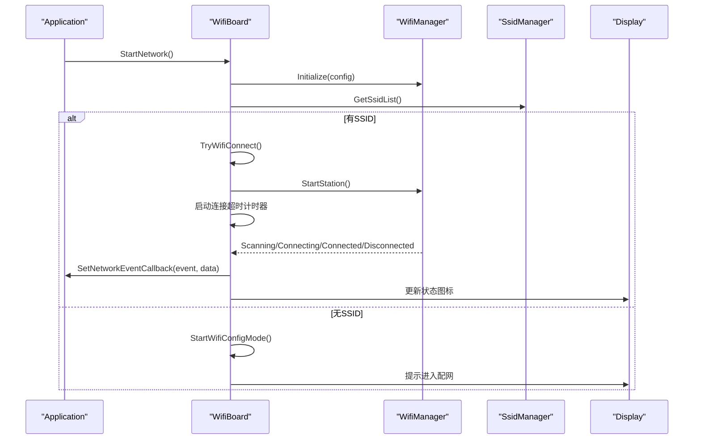
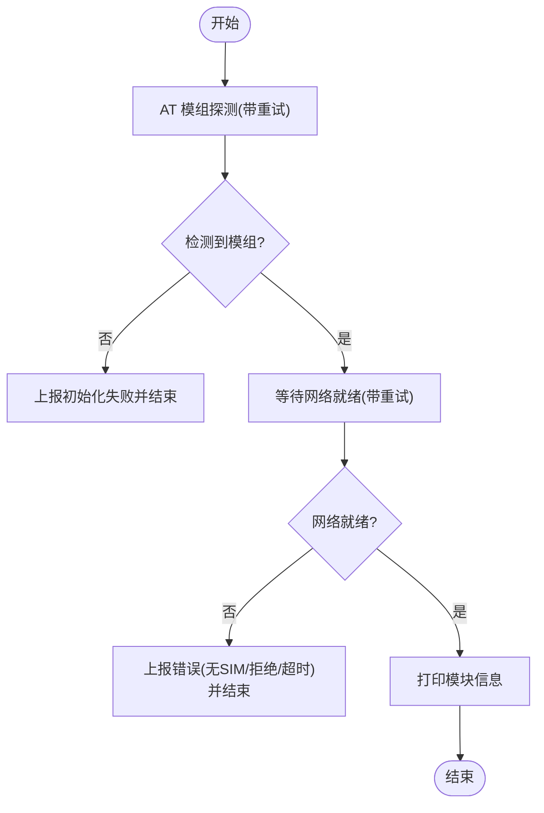
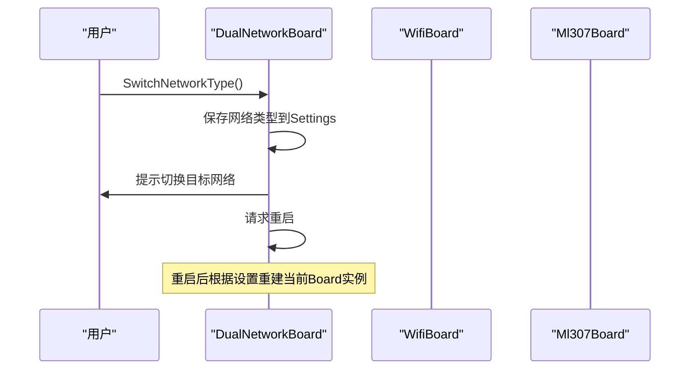
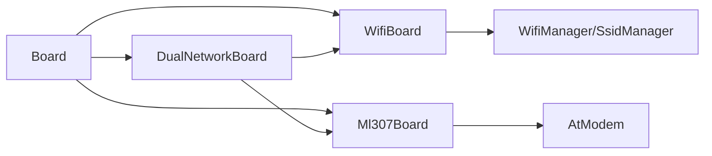

# 硬件抽象层实现

<cite>
**本文引用的文件**   
- [board.h](file://main/boards/common/board.h)
- [board.cc](file://main/boards/common/board.cc)
- [wifi_board.h](file://main/boards/common/wifi_board.h)
- [wifi_board.cc](file://main/boards/common/wifi_board.cc)
- [ml307_board.h](file://main/boards/common/ml307_board.h)
- [ml307_board.cc](file://main/boards/common/ml307_board.cc)
- [dual_network_board.h](file://main/boards/common/dual_network_board.h)
- [dual_network_board.cc](file://main/boards/common/dual_network_board.cc)
- [compact_wifi_board.cc](file://main/boards/bread-compact-wifi/compact_wifi_board.cc)
- [compact_ml307_board.cc](file://main/boards/bread-compact-ml307/compact_ml307_board.cc)
- [custom-board.md](file://docs/custom-board.md)
</cite>

## 目录
1. [引言](#引言)
2. [项目结构](#项目结构)
3. [核心组件](#核心组件)
4. [架构总览](#架构总览)
5. [详细组件分析](#详细组件分析)
6. [依赖关系分析](#依赖关系分析)
7. [性能与功耗考量](#性能与功耗考量)
8. [故障排查指南](#故障排查指南)
9. [结论](#结论)
10. [附录：自定义Board开发步骤](#附录自定义board开发步骤)

## 引言
本指南面向需要在小智语音助手项目中扩展或移植新硬件的工程师，系统化阐述硬件抽象层（HAL）的设计模式、接口规范与最佳实践。重点覆盖 Board 基类设计、WiFiBoard 与 Ml307Board 的继承关系与差异、双网络切换方案，以及电源管理、外设控制、错误处理与状态管理的落地方法。文档同时提供从现有板卡出发的最小化定制路径，帮助快速完成新板适配。

## 项目结构
本项目将“板级抽象”集中在 main/boards/common 下，提供通用基类与能力封装；具体板卡位于 main/boards/<vendor>/<board>/ 中，通过声明宏注册到系统。

图示来源
- [board.h:49-85](file://main/boards/common/board.h#L49-L85)
- [wifi_board.h:9-67](file://main/boards/common/wifi_board.h#L9-L67)
- [ml307_board.h:9-36](file://main/boards/common/ml307_board.h#L9-L36)
- [dual_network_board.h:16-58](file://main/boards/common/dual_network_board.h#L16-L58)
- [compact_wifi_board.cc:24-186](file://main/boards/bread-compact-wifi/compact_wifi_board.cc#L24-L186)
- [compact_ml307_board.cc:20-189](file://main/boards/bread-compact-ml307/compact_ml307_board.cc#L20-L189)

章节来源
- [custom-board.md:1-474](file://docs/custom-board.md#L1-L474)

## 核心组件
- Board 基类
  - 职责：定义统一的板级抽象接口，包括设备标识、显示/音频/摄像头访问、网络接入、电量/温度读取、系统信息导出、电源策略等。
  - 关键接口：GetBoardType、GetUuid、GetAudioCodec、GetDisplay、GetCamera、GetNetwork、StartNetwork、SetNetworkEventCallback、GetNetworkStateIcon、SetPowerSaveLevel、GetBoardJson、GetDeviceStatusJson。
  - 默认实现：无屏/无灯/无摄像头的占位返回；系统信息 JSON 聚合芯片、分区表、应用版本、显示尺寸等。
- WifiBoard
  - 职责：基于 WiFiManager 的异步联网流程、配网模式（热点/Blufi/声学）、连接超时处理、事件转发、信号强度图标映射、设备状态 JSON 输出、Wi-Fi 省电级别设置。
- Ml307Board
  - 职责：基于 AT 模组（ML307）的初始化、检测、网络注册、状态回调、CSQ 信号强度映射、设备状态 JSON 输出。
- DualNetworkBoard
  - 职责：在 WiFi 与 ML307 之间动态选择并代理调用，支持持久化保存当前网络类型并在重启后生效。

章节来源
- [board.h:49-85](file://main/boards/common/board.h#L49-L85)
- [board.cc:15-179](file://main/boards/common/board.cc#L15-L179)
- [wifi_board.h:9-67](file://main/boards/common/wifi_board.h#L9-L67)
- [wifi_board.cc:29-358](file://main/boards/common/wifi_board.cc#L29-L358)
- [ml307_board.h:9-36](file://main/boards/common/ml307_board.h#L9-L36)
- [ml307_board.cc:20-271](file://main/boards/common/ml307_board.cc#L20-L271)
- [dual_network_board.h:16-58](file://main/boards/common/dual_network_board.h#L16-L58)
- [dual_network_board.cc:10-99](file://main/boards/common/dual_network_board.cc#L10-L99)

## 架构总览
下图展示了 HAL 的核心类关系与典型交互：上层 Application 通过 Board::GetInstance() 获取具体板卡实例，统一调用网络启动、事件回调、状态查询等方法。

图示来源
- [board.h:49-85](file://main/boards/common/board.h#L49-L85)
- [wifi_board.h:9-67](file://main/boards/common/wifi_board.h#L9-L67)
- [ml307_board.h:9-36](file://main/boards/common/ml307_board.h#L9-L36)
- [dual_network_board.h:16-58](file://main/boards/common/dual_network_board.h#L16-L58)

## 详细组件分析

### Board 基类设计与接口规范
- 设计要点
  - 单例工厂：通过 create_board 与 DECLARE_BOARD 宏在运行时构造具体板卡实例。
  - 设备唯一标识：首次生成 UUID 并持久化，后续启动复用。
  - 默认能力降级：无屏/无灯/无摄像头时返回占位对象，避免上层空指针。
  - 系统信息聚合：汇总芯片、分区表、应用版本、显示参数与板级信息。
- 关键接口说明
  - GetBoardType：用于区分板卡类型（如 wifi、ml307）。
  - StartNetwork：启动网络（异步），通过 SetNetworkEventCallback 上报扫描/连接/断开/配网等事件。
  - GetNetworkStateIcon：根据当前网络状态返回图标字符串，供 UI 渲染。
  - SetPowerSaveLevel：按平台实现省电策略（WiFi 侧已实现，蜂窝侧待完善）。
  - GetBoardJson / GetDeviceStatusJson：分别输出板级元数据与运行态设备状态。

章节来源
- [board.h:49-85](file://main/boards/common/board.h#L49-L85)
- [board.cc:15-179](file://main/boards/common/board.cc#L15-L179)

### WifiBoard：Wi-Fi 联网与配网
- 核心流程
  - 初始化 Wi-Fi 管理器，绑定事件回调，将底层 Wi-Fi 事件转换为统一的 NetworkEvent。
  - 若存在已配置 SSID，则尝试连接并设置超时计时器；若无 SSID，进入配网模式。
  - 连接成功停止超时计时器，退出配网标志；超时或退出配网后重新尝试连接。
- 配网模式
  - 支持多种配网方式（热点、Blufi、声学），根据编译选项启用不同流程。
  - 进入配网前会清理协议通道，确保资源释放后再切换状态。
- 状态与图标
  - 根据是否处于配网模式、是否连接、RSSI 值映射到不同的图标常量。
- 设备状态 JSON
  - 包含扬声器音量、屏幕亮度/主题、电池、网络类型/信号等级、芯片温度等。

图示来源
- [wifi_board.cc:52-104](file://main/boards/common/wifi_board.cc#L52-L104)
- [wifi_board.cc:159-197](file://main/boards/common/wifi_board.cc#L159-L197)
- [wifi_board.cc:249-282](file://main/boards/common/wifi_board.cc#L249-L282)

章节来源
- [wifi_board.h:9-67](file://main/boards/common/wifi_board.h#L9-L67)
- [wifi_board.cc:29-358](file://main/boards/common/wifi_board.cc#L29-L358)

### Ml307Board：4G 模组驱动与网络注册
- 核心流程
  - 创建独立任务进行模组检测与网络注册，避免阻塞主流程。
  - 带重试上限的 AT 模组探测与网络就绪等待，期间上报 ModemDetecting/Connecting/Connected 及各类错误事件。
  - 成功后打印模块版本、IMEI、ICCID 等信息。
- 状态与图标
  - 根据 CSQ 值映射信号强度图标，未就绪或无效值返回无信号图标。
- 设备状态 JSON
  - 包含扬声器音量、屏幕亮度/主题、电池、网络类型/运营商/信号等级等。

图示来源
- [ml307_board.cc:67-132](file://main/boards/common/ml307_board.cc#L67-L132)
- [ml307_board.cc:147-166](file://main/boards/common/ml307_board.cc#L147-L166)

章节来源
- [ml307_board.h:9-36](file://main/boards/common/ml307_board.h#L9-L36)
- [ml307_board.cc:20-271](file://main/boards/common/ml307_board.cc#L20-L271)

### DualNetworkBoard：WiFi/4G 双网切换
- 职责
  - 根据 Settings 中的 type 字段决定当前使用 WiFi 还是 ML307，并持有对应 Board 实例。
  - 对外代理所有 Board 接口，内部转发至当前活动板卡。
  - 提供 SwitchNetworkType 切换并持久化，随后触发重启以加载新网络栈。
- 使用建议
  - 适用于同一硬件可插拔或可选网络方案的场景，减少重复代码。

图示来源
- [dual_network_board.cc:45-57](file://main/boards/common/dual_network_board.cc#L45-L57)
- [dual_network_board.cc:35-43](file://main/boards/common/dual_network_board.cc#L35-L43)

章节来源
- [dual_network_board.h:16-58](file://main/boards/common/dual_network_board.h#L16-L58)
- [dual_network_board.cc:10-99](file://main/boards/common/dual_network_board.cc#L10-L99)

### 示例板卡：CompactWifiBoard 与 CompactMl307Board
- CompactWifiBoard
  - 继承自 WifiBoard，实现 I2C/OLED 显示、按键、LED、音频编解码器，演示了如何组合通用组件。
- CompactMl307Board
  - 继承自 DualNetworkBoard，展示如何在双网板上集成显示、按键与网络切换逻辑。

章节来源
- [compact_wifi_board.cc:24-186](file://main/boards/bread-compact-wifi/compact_wifi_board.cc#L24-L186)
- [compact_ml307_board.cc:20-189](file://main/boards/bread-compact-ml307/compact_ml307_board.cc#L20-L189)

## 依赖关系分析
- 组件耦合
  - Board 为顶层抽象，WifiBoard/Ml307Board/DualNetworkBoard 均依赖其接口。
  - WifiBoard 依赖 Wi-Fi 子系统（WifiManager/SsidManager/Blufi/Acoustic Provisioning）。
  - Ml307Board 依赖 AT 模组驱动（AtModem）与 FreeRTOS 任务。
  - DualNetworkBoard 组合两种网络实现，并通过 Settings 持久化选择。
- 外部依赖
  - ESP-IDF 基础库（FreeRTOS、ESP_LOG、ESP_TIMER、ESP_PARTITION、ESP_OTA 等）。
  - 第三方组件（cJSON、Font Awesome 图标、语言包等）。

图示来源
- [board.h:49-85](file://main/boards/common/board.h#L49-L85)
- [wifi_board.h:9-67](file://main/boards/common/wifi_board.h#L9-L67)
- [ml307_board.h:9-36](file://main/boards/common/ml307_board.h#L9-L36)
- [dual_network_board.h:16-58](file://main/boards/common/dual_network_board.h#L16-L58)

章节来源
- [board.cc:70-179](file://main/boards/common/board.cc#L70-L179)
- [wifi_board.cc:268-358](file://main/boards/common/wifi_board.cc#L268-L358)
- [ml307_board.cc:168-271](file://main/boards/common/ml307_board.cc#L168-L271)

## 性能与功耗考量
- Wi-Fi 省电
  - WifiBoard 已实现 SetPowerSaveLevel，将 PowerSaveLevel 映射到 Wi-Fi 省电级别，影响连接与休眠策略。
- 4G 省电
  - Ml307Board 的 SetPowerSaveLevel 目前为 TODO，可按需结合模组 AT 命令或系统休眠机制实现。
- 任务与定时器
  - 网络初始化采用独立任务与定时器，避免阻塞主循环，提升响应性。
- 资源释放
  - 配网完成后释放 Blufi 等资源；进入配网前重置协议通道，防止资源泄漏。

章节来源
- [wifi_board.cc:284-299](file://main/boards/common/wifi_board.cc#L284-L299)
- [ml307_board.cc:181-184](file://main/boards/common/ml307_board.cc#L181-L184)
- [wifi_board.cc:106-145](file://main/boards/common/wifi_board.cc#L106-L145)

## 故障排查指南
- Wi-Fi 无法连接
  - 检查是否存在有效 SSID；确认超时计时器是否触发；查看配网模式是否正确进入。
  - 参考：TryWifiConnect、OnWifiConnectTimeout、StartWifiConfigMode。
- 4G 模组未识别
  - 检查 TX/RX/DTR 引脚与波特率；关注 ModemDetecting 与 ModemErrorInitFailed 事件。
  - 参考：NetworkTask、OnNetworkEvent。
- 信号弱/不稳定
  - 观察 RSSI/CSQ 值与图标映射；必要时调整天线或位置。
  - 参考：GetNetworkStateIcon（Wi-Fi/4G）。
- 设备状态异常
  - 对比 GetDeviceStatusJson 输出，逐项核对音频、屏幕、电池、网络字段。
  - 参考：WifiBoard::GetDeviceStatusJson、Ml307Board::GetDeviceStatusJson。

章节来源
- [wifi_board.cc:89-157](file://main/boards/common/wifi_board.cc#L89-L157)
- [ml307_board.cc:67-132](file://main/boards/common/ml307_board.cc#L67-L132)
- [wifi_board.cc:301-358](file://main/boards/common/wifi_board.cc#L301-L358)
- [ml307_board.cc:186-271](file://main/boards/common/ml307_board.cc#L186-L271)

## 结论
通过 Board 抽象与 WifiBoard/Ml307Board/DualNetworkBoard 的分层设计，项目实现了跨平台、可扩展的硬件抽象层。开发者可基于现有基类快速完成新板适配，并通过事件回调、状态 JSON 与图标映射获得一致的体验。建议在新增板卡时优先复用 common 下的通用组件，遵循最小改动原则，逐步引入显示、音频、按键与网络功能。

## 附录：自定义Board开发步骤
- 新建板卡目录与配置文件
  - 在 main/boards 下创建目录，编写 config.h（引脚与参数）与 config.json（构建目标与 sdkconfig_append）。
- 实现板卡类
  - 继承合适的基类（WifiBoard/Ml307Board/DualNetworkBoard）。
  - 实现必要接口：GetAudioCodec、GetDisplay、GetBacklight、GetLed 等。
  - 在构造函数中完成 I2C/SPI/按键/工具等初始化。
  - 使用 DECLARE_BOARD 宏注册板卡。
- 构建系统集成
  - 在 Kconfig 中添加 BOARD_TYPE 选项。
  - 在 CMakeLists.txt 中增加分支，指定字体与表情集等。
- 构建与烧录
  - 使用 idf.py 或 release.py 脚本构建与打包固件。
- 调试与验证
  - 先点亮显示，再上音频，最后联调网络与服务端。
  - 对照 GetDeviceStatusJson 与日志定位问题。

章节来源
- [custom-board.md:1-474](file://docs/custom-board.md#L1-L474)