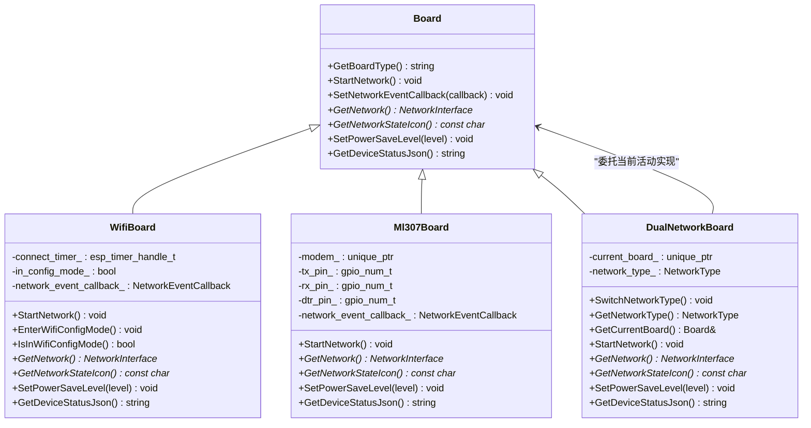
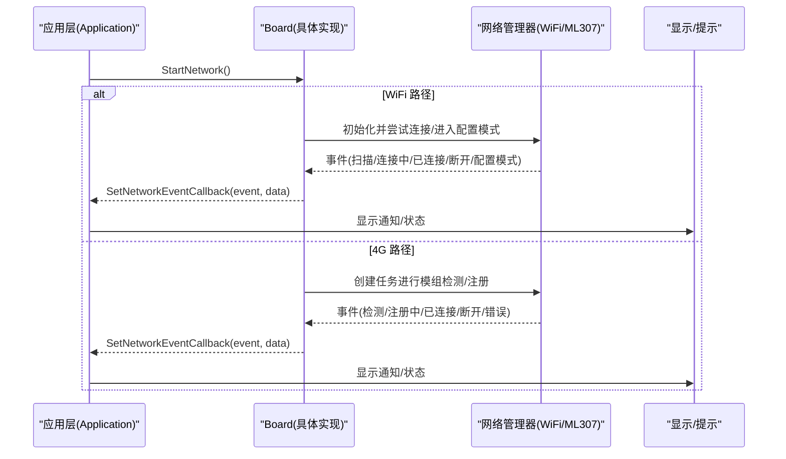
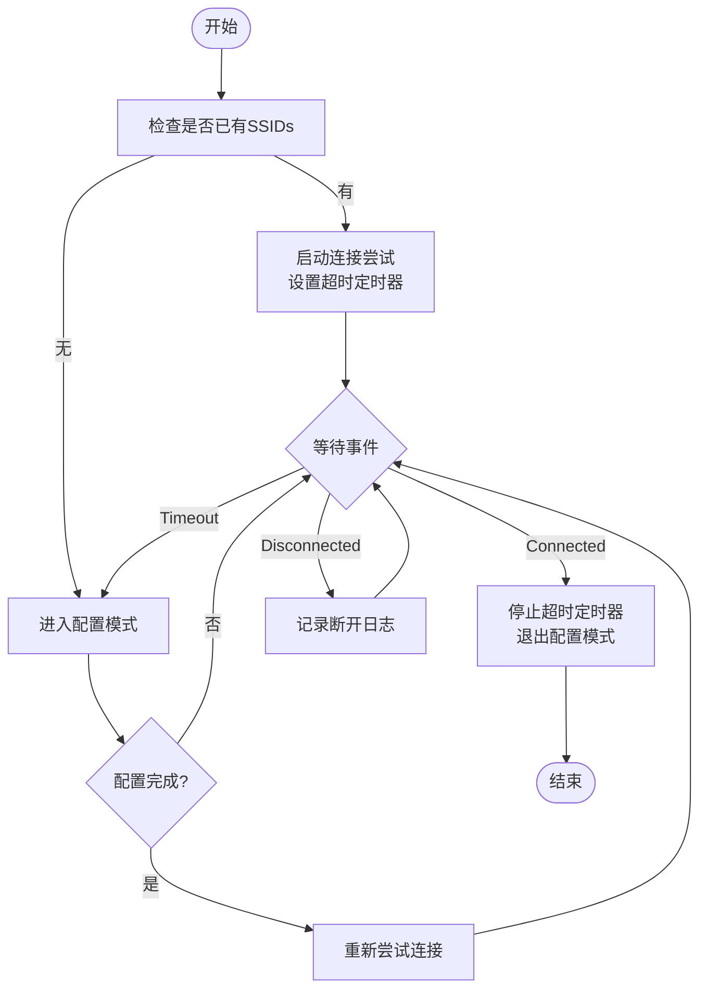
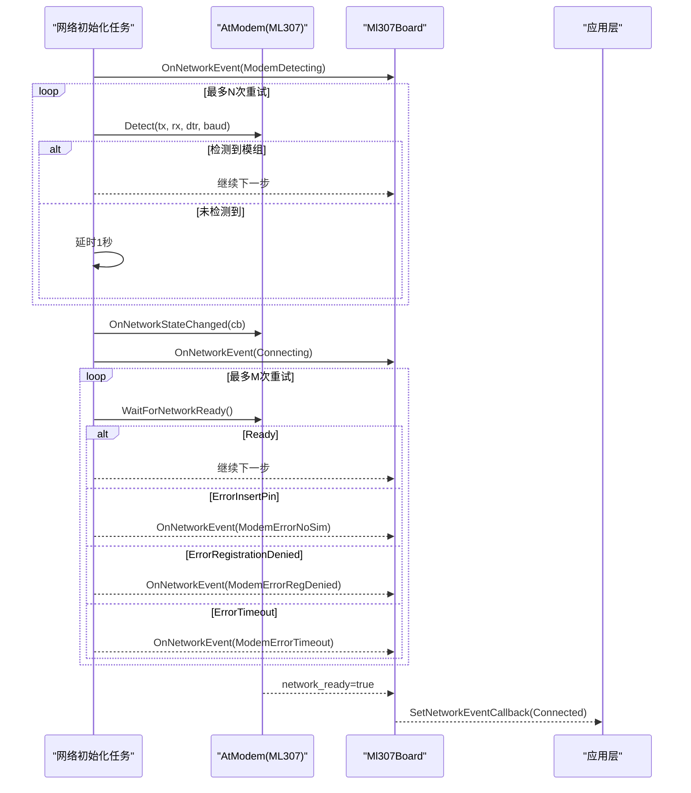
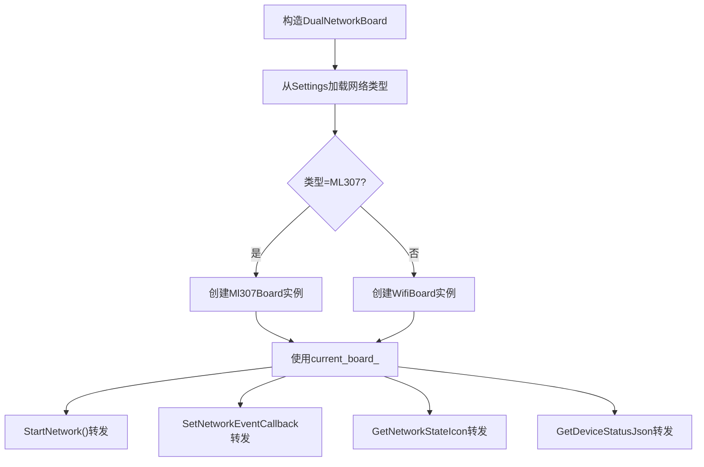
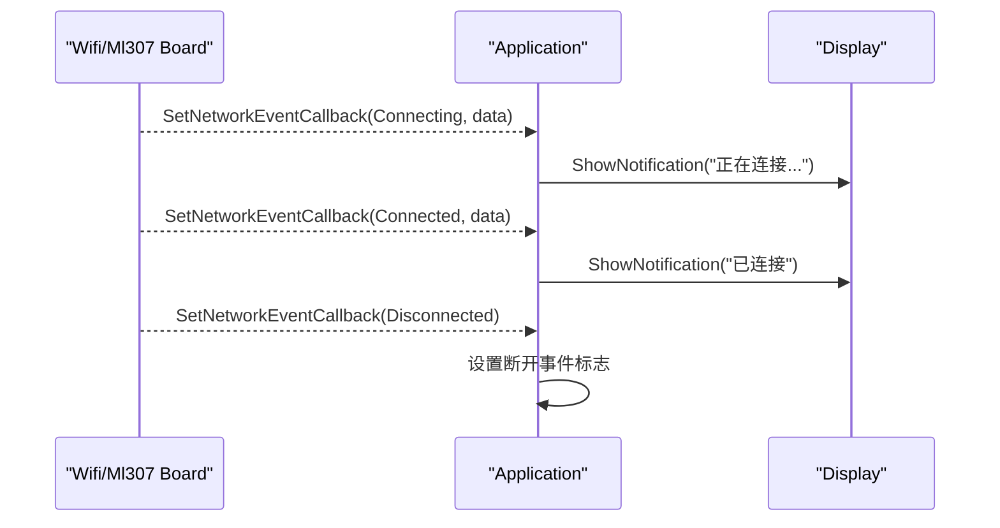
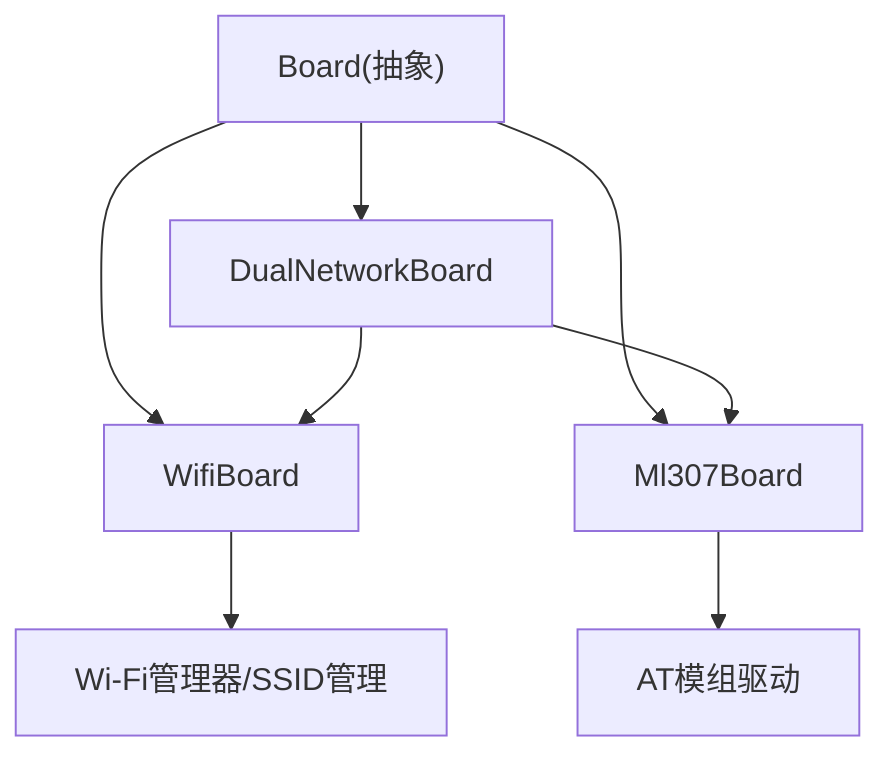

# 网络适配器实现

<cite>
**本文引用的文件列表**
- [board.h](file://main/boards/common/board.h)
- [wifi_board.h](file://main/boards/common/wifi_board.h)
- [wifi_board.cc](file://main/boards/common/wifi_board.cc)
- [ml307_board.h](file://main/boards/common/ml307_board.h)
- [ml307_board.cc](file://main/boards/common/ml307_board.cc)
- [dual_network_board.h](file://main/boards/common/dual_network_board.h)
- [dual_network_board.cc](file://main/boards/common/dual_network_board.cc)
- [application.cc](file://main/application.cc)
</cite>

## 目录
1. [简介](#简介)
2. [项目结构](#项目结构)
3. [核心组件](#核心组件)
4. [架构总览](#架构总览)
5. [详细组件分析](#详细组件分析)
6. [依赖关系分析](#依赖关系分析)
7. [性能与优化](#性能与优化)
8. [故障排查指南](#故障排查指南)
9. [结论](#结论)
10. [附录](#附录)

## 简介
本指南围绕网络适配器的完整实现，系统性说明 WiFiBoard 与 Ml307Board 的继承关系、功能差异与交互方式；详解 WiFi 连接流程（扫描、连接、断线重连、配置模式）以及 4G 通信模块初始化过程（SIM 检测、网络注册、数据连接建立）。同时覆盖双网络支持 DualNetworkBoard 的实现原理（网络类型选择与切换），并提供网络事件回调处理、错误处理场景、性能优化与安全通信配置建议。

## 项目结构
本项目采用“板级抽象 + 具体网络实现”的分层设计：
- Board 为统一抽象基类，定义网络接口、设备状态、电源管理等通用能力。
- WifiBoard 与 Ml307Board 分别实现基于 ESP-WiFi 和 ML307 4G 模块的网络接入。
- DualNetworkBoard 作为组合器，根据设置动态选择并代理到当前活动网络实现。

图表来源
- [board.h:1-93](file://main/boards/common/board.h#L1-L93)
- [wifi_board.h:1-70](file://main/boards/common/wifi_board.h#L1-L70)
- [ml307_board.h:1-39](file://main/boards/common/ml307_board.h#L1-L39)
- [dual_network_board.h:1-60](file://main/boards/common/dual_network_board.h#L1-L60)

章节来源
- [board.h:1-93](file://main/boards/common/board.h#L1-L93)

## 核心组件
- Board 抽象层
  - 定义统一的网络事件枚举、回调类型、电源管理级别等，屏蔽底层网络差异。
- WifiBoard
  - 基于 Wi-Fi Manager 完成 SSID 管理、连接尝试、超时进入配置模式、信号强度图标展示、WiFi 省电等级设置等。
- Ml307Board
  - 通过 AT 指令驱动 ML307 模块，执行 SIM 检测、网络注册等待、CSQ 信号质量评估、设备信息上报等。
- DualNetworkBoard
  - 从 Settings 加载默认网络类型，构造并持有当前活动的 Board 实例，转发所有网络相关调用；提供重启式切换策略。

章节来源
- [board.h:1-93](file://main/boards/common/board.h#L1-L93)
- [wifi_board.h:1-70](file://main/boards/common/wifi_board.h#L1-L70)
- [ml307_board.h:1-39](file://main/boards/common/ml307_board.h#L1-L39)
- [dual_network_board.h:1-60](file://main/boards/common/dual_network_board.h#L1-L60)

## 架构总览
系统启动后，应用层通过 Board::GetInstance() 获取具体板卡对象，调用 StartNetwork() 启动网络初始化。不同网络实现以异步方式工作，并通过统一的 NetworkEvent 回调向上汇报状态变化。上层（Application）监听这些事件，更新 UI 或触发后续协议栈连接逻辑。

图表来源
- [application.cc:114-143](file://main/application.cc#L114-L143)
- [wifi_board.cc:52-145](file://main/boards/common/wifi_board.cc#L52-L145)
- [ml307_board.cc:67-141](file://main/boards/common/ml307_board.cc#L67-L141)

## 详细组件分析

### WiFiBoard 分析与流程
- 关键职责
  - 初始化 Wi-Fi 管理器，绑定事件回调，将 Wi-Fi 事件映射为统一 NetworkEvent。
  - 若存在已保存 SSID，则发起连接并设置超时定时器；若无 SSID，进入配置模式。
  - 支持多种配网方式（热点、Blufi、声学），并在连接成功后释放配置资源。
  - 提供 GetNetworkStateIcon() 依据 RSSI 返回信号图标。
  - 提供 SetPowerSaveLevel() 映射到 Wi-Fi 省电等级。
- 连接流程要点
  - 扫描：由 Wi-Fi 管理器在配置模式下触发，内部事件转换为 Scanning。
  - 连接：StartStation() 后等待连接成功或超时；成功时停止定时器并退出配置模式。
  - 断线重连：Wi-Fi 管理器负责底层重连策略；WifiBoard 仅转发 Disconnected 事件。
  - 配置模式：StopStation() 后进入 AP/Blufi/声学配网流程，完成后自动重试连接。

图表来源
- [wifi_board.cc:89-157](file://main/boards/common/wifi_board.cc#L89-L157)
- [wifi_board.cc:159-197](file://main/boards/common/wifi_board.cc#L159-L197)
- [wifi_board.cc:199-238](file://main/boards/common/wifi_board.cc#L199-L238)

章节来源
- [wifi_board.h:1-70](file://main/boards/common/wifi_board.h#L1-L70)
- [wifi_board.cc:29-157](file://main/boards/common/wifi_board.cc#L29-L157)
- [wifi_board.cc:159-238](file://main/boards/common/wifi_board.cc#L159-L238)

### Ml307Board 分析与流程
- 关键职责
  - 在独立 FreeRTOS 任务中执行模组初始化：串口波特率探测、AT 握手、SIM 检测、网络注册等待。
  - 订阅模组网络状态回调，将 Connected/Disconnected 事件上抛。
  - 根据 CSQ 计算信号强度图标，生成设备状态 JSON。
- 初始化流程要点
  - 模组检测：循环尝试 AtModem::Detect，失败则延时重试直至上限。
  - 网络注册：WaitForNetworkReady 轮询，区分无卡、拒绝注册、超时等错误并上报。
  - 成功注册后输出模块版本、IMEI、ICCID 等信息。

图表来源
- [ml307_board.cc:67-132](file://main/boards/common/ml307_board.cc#L67-L132)
- [ml307_board.cc:134-141](file://main/boards/common/ml307_board.cc#L134-L141)

章节来源
- [ml307_board.h:1-39](file://main/boards/common/ml307_board.h#L1-L39)
- [ml307_board.cc:20-141](file://main/boards/common/ml307_board.cc#L20-L141)

### DualNetworkBoard 分析与策略
- 关键职责
  - 从 Settings 读取默认网络类型，构造并持有当前活动的 Board 实例（WiFi 或 ML307）。
  - 对外暴露 SwitchNetworkType()，写入新类型并触发重启以生效。
  - 所有网络相关方法均转发至 current_board_。
- 网络切换策略
  - 当前实现为“持久化+重启”策略：切换后保存设置并重启，下次启动按新类型初始化。
  - 未实现运行时热切换与故障转移（如 WiFi 断线自动切 4G），可在未来扩展。

图表来源
- [dual_network_board.cc:10-43](file://main/boards/common/dual_network_board.cc#L10-L43)
- [dual_network_board.cc:45-57](file://main/boards/common/dual_network_board.cc#L45-L57)
- [dual_network_board.cc:64-98](file://main/boards/common/dual_network_board.cc#L64-L98)

章节来源
- [dual_network_board.h:1-60](file://main/boards/common/dual_network_board.h#L1-L60)
- [dual_network_board.cc:1-99](file://main/boards/common/dual_network_board.cc#L1-L99)

### 网络事件回调与上层处理
- 统一事件模型
  - NetworkEvent 包含通用事件（Scanning/Connecting/Connected/Disconnected/WiFi配置模式进入/退出）与蜂窝特有事件（ModemDetecting/ModemErrorNoSim/ModemErrorRegDenied/ModemErrorInitFailed/ModemErrorTimeout）。
- 上层处理
  - Application 在收到事件后更新显示通知、设置事件标志位，用于控制协议栈连接与重试。

图表来源
- [application.cc:114-143](file://main/application.cc#L114-L143)
- [board.h:20-44](file://main/boards/common/board.h#L20-L44)

章节来源
- [board.h:20-44](file://main/boards/common/board.h#L20-L44)
- [application.cc:114-143](file://main/application.cc#L114-L143)

## 依赖关系分析
- 耦合与内聚
  - WifiBoard 强依赖 Wi-Fi 管理器与 SsidManager；Ml307Board 强依赖 AtModem；DualNetworkBoard 弱耦合于两者，通过组合与转发降低耦合度。
- 外部依赖
  - Wi-Fi 侧：esp_wifi、wifi_manager、ssid_manager、blufi（可选）、声学配网（可选）。
  - 4G 侧：AT 模组驱动（at_modem）。
- 潜在循环依赖
  - 未发现直接循环依赖；Board 抽象位于顶层，具体实现不反向依赖 Board 工厂。

图表来源
- [board.h:1-93](file://main/boards/common/board.h#L1-L93)
- [wifi_board.cc:1-23](file://main/boards/common/wifi_board.cc#L1-L23)
- [ml307_board.cc:1-12](file://main/boards/common/ml307_board.cc#L1-L12)
- [dual_network_board.cc:1-8](file://main/boards/common/dual_network_board.cc#L1-L8)

章节来源
- [board.h:1-93](file://main/boards/common/board.h#L1-L93)
- [wifi_board.cc:1-23](file://main/boards/common/wifi_board.cc#L1-L23)
- [ml307_board.cc:1-12](file://main/boards/common/ml307_board.cc#L1-L12)
- [dual_network_board.cc:1-8](file://main/boards/common/dual_network_board.cc#L1-L8)

## 性能与优化
- Wi-Fi 性能
  - 使用 SetPowerSaveLevel() 调整 Wi-Fi 省电等级，平衡功耗与吞吐。
  - 合理设置连接超时与重试间隔，避免频繁重连导致 CPU 占用过高。
  - 利用 RSSI 阈值判断信号质量，必要时提示用户靠近路由器或切换信道。
- 4G 性能
  - 模组检测与网络注册的重试次数与时延已在实现中限定，避免长时间阻塞。
  - 关注 CSQ 指标，低信号环境可考虑外置天线或调整安装位置。
- 系统级节能
  - 结合 PowerSaveTimer 在空闲时降低 CPU 频率、启用轻睡眠，提升续航。
- 安全通信
  - 优先使用 HTTPS/WebSocket over TLS 等加密通道。
  - 对 Wi-Fi 建议使用 WPA2/WPA3，避免开放网络。
  - 对 4G 确保运营商套餐与 APN 配置正确，避免明文传输敏感数据。

[本节为通用指导，无需特定源码引用]

## 故障排查指南
- Wi-Fi 无法连接
  - 检查是否存在有效 SSID；若无，确认是否进入配置模式并完成配网。
  - 观察是否触发超时回调并进入配置模式；必要时手动进入配置模式。
  - 查看 RSSI 与信道，评估信号质量与环境干扰。
- 4G 无法注册
  - 确认 SIM 卡插入与激活状态；若报无卡错误，检查卡槽与供电。
  - 若报注册被拒，检查运营商套餐、APN 与区域覆盖。
  - 若报超时，检查天线与信号强度。
- 事件回调未触发
  - 确认上层已调用 SetNetworkEventCallback() 并正确处理各事件分支。
  - 检查 Display 通知是否正常显示，辅助定位问题阶段。

章节来源
- [wifi_board.cc:151-157](file://main/boards/common/wifi_board.cc#L151-L157)
- [ml307_board.cc:31-65](file://main/boards/common/ml307_board.cc#L31-L65)
- [application.cc:114-143](file://main/application.cc#L114-L143)

## 结论
本实现通过 Board 抽象统一了 Wi-Fi 与 4G 两种网络接入方式，提供了清晰的事件模型与可扩展的双网络组合方案。WifiBoard 与 Ml307Board 各自封装了底层细节，DualNetworkBoard 则以组合方式简化了多网络场景的使用。当前切换策略为重启式，适合大多数嵌入式设备；未来可在此基础上增加运行时热切换与智能故障转移机制，进一步提升可用性。

[本节为总结性内容，无需特定源码引用]

## 附录
- 术语
  - RSSI：接收信号强度指示，单位 dBm，数值越大信号越强。
  - CSQ：蜂窝网络信号质量指数，范围 0-31，数值越大信号越强。
  - AP/STA：接入点/站点模式，Wi-Fi 常见工作模式。
- 参考实现路径
  - Wi-Fi 连接与配置模式：[wifi_board.cc:52-197](file://main/boards/common/wifi_board.cc#L52-L197)
  - 4G 模组初始化与事件：[ml307_board.cc:67-141](file://main/boards/common/ml307_board.cc#L67-L141)
  - 双网络组合与转发：[dual_network_board.cc:10-98](file://main/boards/common/dual_network_board.cc#L10-L98)
  - 统一事件模型与上层处理：[board.h:20-44](file://main/boards/common/board.h#L20-L44), [application.cc:114-143](file://main/application.cc#L114-L143)