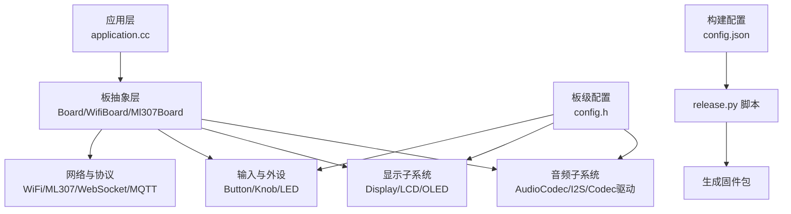
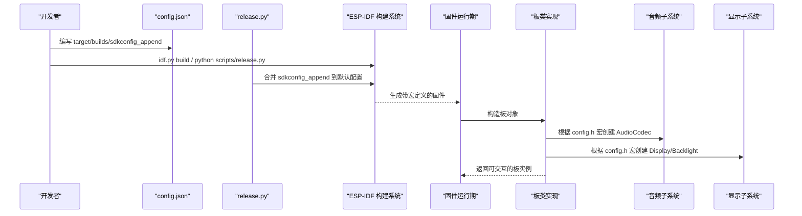
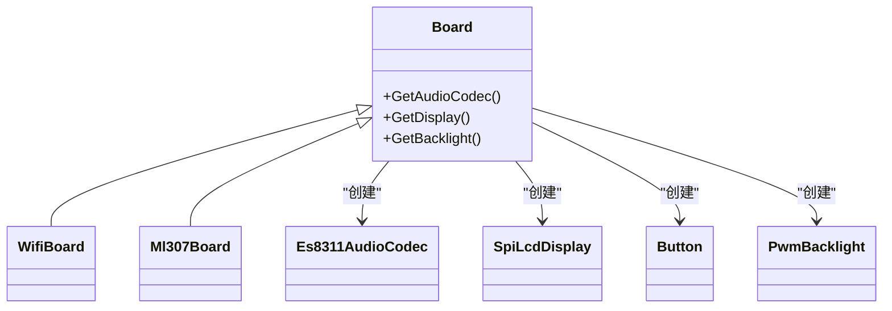

# 配置文件结构详解

<cite>
**本文引用的文件**   
- [README.md](file://README.md)
- [custom-board.md](file://docs/custom-board.md)
- [lichuang-c3-dev/config.h](file://main/boards/lichuang-c3-dev/config.h)
- [lichuang-c3-dev/config.json](file://main/boards/lichuang-c3-dev/config.json)
- [esp-box-3/config.h](file://main/boards/esp-box-3/config.h)
- [esp-box-3/config.json](file://main/boards/esp-box-3/config.json)
- [m5stack-core-s3/config.h](file://main/boards/m5stack-core-s3/config.h)
- [m5stack-core-s3/config.json](file://main/boards/m5stack-core-s3/config.json)
</cite>

## 目录
1. [简介](#简介)
2. [项目结构](#项目结构)
3. [核心组件](#核心组件)
4. [架构总览](#架构总览)
5. [详细组件分析](#详细组件分析)
6. [依赖关系分析](#依赖关系分析)
7. [性能与功耗考量](#性能与功耗考量)
8. [故障排查指南](#故障排查指南)
9. [结论](#结论)
10. [附录：配置项参考手册](#附录配置项参考手册)

## 简介
本文件面向板级开发者，系统化梳理 xiaozhi-esp32 项目中“板级配置文件”的结构与用法，重点覆盖：
- config.h 中音频参数（采样率、I2S 引脚）、GPIO 映射（麦克风、扬声器、LED、按钮）、显示参数（分辨率、方向、背光）等宏定义的作用与组合方式。
- config.json 中的构建与硬件描述信息：目标芯片、固件名称、sdkconfig_append 扩展项（如分区表、语言、唤醒词开关、AEC 开关等）。
- 提供完整配置项参考手册（取值范围、默认值、使用场景），并通过具体示例展示如何为不同硬件特性进行正确配置。

## 项目结构
每个板子位于 main/boards/<厂商>/<板名>/ 或 main/boards/<板名>/ 下，典型包含：
- xxx_board.cc：板级初始化与胶水代码
- config.h：引脚分配与板级设置（音频、显示、按键、LED 等）
- config.json：供 release.py 使用的构建配置（target、builds、sdkconfig_append）
- README.md：板级说明文档

图表来源
- [custom-board.md:12-20](file://docs/custom-board.md#L12-L20)
- [custom-board.md:136-146](file://docs/custom-board.md#L136-L146)
- [custom-board.md:398-445](file://docs/custom-board.md#L398-L445)

章节来源
- [custom-board.md:12-20](file://docs/custom-board.md#L12-L20)
- [custom-board.md:136-146](file://docs/custom-board.md#L136-L146)
- [custom-board.md:398-445](file://docs/custom-board.md#L398-L445)

## 核心组件
- 板级配置入口
  - config.h：集中声明所有硬件相关宏（音频、显示、GPIO、相机等）
  - config.json：声明 target、builds、sdkconfig_append，用于 release.py 自动构建
- 板类实现
  - 继承 WifiBoard/Ml307Board 等基类，覆写 GetAudioCodec()/GetDisplay()/GetBacklight() 等接口
  - 在构造函数中完成 I2C/SPI/按钮/工具注册等初始化
- 通用组件
  - 音频编解码器：Es8311/Es8374/Es8388/Es8389/BoxAudioCodec/NoAudioCodec/DummyAudioCodec
  - 显示驱动：ST7789/ILI9341/SH8601 等
  - 电源管理：Axp2101/Sy6970/AdcBatteryMonitor/PowerSaveTimer/SleepTimer
  - 网络：WifiBoard/Ml307Board/Nt26Board/DualNetworkBoard/RndisBoard
  - 输入：Button/Knob/PressToTalkMcpTool/SystemReset

章节来源
- [custom-board.md:136-146](file://docs/custom-board.md#L136-L146)
- [custom-board.md:398-445](file://docs/custom-board.md#L398-L445)

## 架构总览
下图展示了从配置到运行时初始化的关键路径：config.h 的宏被板类读取并传入各子系统；config.json 由 release.py 解析并注入 sdkconfig 宏，影响编译期行为（如分区表、语言、唤醒词、AEC 等）。

图表来源
- [custom-board.md:90-134](file://docs/custom-board.md#L90-L134)
- [custom-board.md:136-146](file://docs/custom-board.md#L136-L146)

## 详细组件分析

### 音频参数配置（采样率、I2S 模式、参考通道）
- 采样率
  - AUDIO_INPUT_SAMPLE_RATE：输入采样率（常见 16000/24000 Hz）
  - AUDIO_OUTPUT_SAMPLE_RATE：输出采样率（常见 16000/24000 Hz）
- I2S 引脚
  - AUDIO_I2S_GPIO_MCLK/AUDIO_I2S_GPIO_WS/AUDIO_I2S_GPIO_BCLK/AUDIO_I2S_GPIO_DIN/AUDIO_I2S_GPIO_DOUT
- 参考通道（降噪/回声消除）
  - AUDIO_INPUT_REFERENCE：启用参考通道（配合双麦阵列）
- 功放与编解码器
  - AUDIO_CODEC_PA_PIN：功放使能引脚
  - AUDIO_CODEC_I2C_SDA_PIN/AUDIO_CODEC_I2C_SCL_PIN：I2C 总线
  - AUDIO_CODEC_ES8311_ADDR/AUDIO_CODEC_ES7210_ADDR：编解码器地址
  - AUDIO_CODEC_USE_PCA9557：通过 IO 扩展控制 PA 等

示例参考
- Lichuang-C3-Dev：单路 I2S + ES8311，无内置 LED，有 BOOT 键，SPI LCD
- ESP-BOX-3：支持参考通道（双麦），ES8311 + ES7210
- M5Stack CoreS3：支持参考通道，AW88298 功放 + ES7210 麦克风

章节来源
- [lichuang-c3-dev/config.h:6-21](file://main/boards/lichuang-c3-dev/config.h#L6-L21)
- [esp-box-3/config.h:6-22](file://main/boards/esp-box-3/config.h#L6-L22)
- [m5stack-core-s3/config.h:8-22](file://main/boards/m5stack-core-s3/config.h#L8-L22)

### GPIO 引脚映射（麦克风、扬声器、LED、按钮）
- 麦克风/参考通道
  - 通过 I2S DIN 与参考通道宏（AUDIO_INPUT_REFERENCE）协同工作
- 扬声器/功放
  - AUDIO_CODEC_PA_PIN 控制功放使能
- LED
  - BUILTIN_LED_GPIO：内置 LED（未使用则置为 GPIO_NUM_NC）
- 按钮
  - BOOT_BUTTON_GPIO：开机/进入配网/切换对话状态
  - VOLUME_UP_BUTTON_GPIO/VOLUME_DOWN_BUTTON_GPIO：音量调节（可选）

示例参考
- Lichuang-C3-Dev：BOOT 键接 GPIO9，BUILTIN_LED 未使用
- ESP-BOX-3：BOOT 键接 GPIO0，BUILTIN_LED 未使用
- M5Stack CoreS3：BOOT 键接 GPIO0，BUILTIN_LED 未使用

章节来源
- [lichuang-c3-dev/config.h:22-26](file://main/boards/lichuang-c3-dev/config.h#L22-L26)
- [esp-box-3/config.h:23-27](file://main/boards/esp-box-3/config.h#L23-L27)
- [m5stack-core-s3/config.h:23-27](file://main/boards/m5stack-core-s3/config.h#L23-L27)

### 显示参数设置（分辨率、方向、偏移、背光）
- 分辨率与方向
  - DISPLAY_WIDTH/DISPLAY_HEIGHT：屏幕宽高
  - DISPLAY_MIRROR_X/DISPLAY_MIRROR_Y：X/Y 镜像
  - DISPLAY_SWAP_XY：交换 X/Y
- 偏移
  - DISPLAY_OFFSET_X/DISPLAY_OFFSET_Y：像素偏移
- 背光
  - DISPLAY_BACKLIGHT_PIN：背光 PWM 引脚
  - DISPLAY_BACKLIGHT_OUTPUT_INVERT：是否反相控制
- SPI/I2C 接口（依驱动而定）
  - DISPLAY_SPI_SCK_PIN/DISPLAY_SPI_MOSI_PIN/DISPLAY_DC_PIN/DISPLAY_SPI_CS_PIN
  - DISPLAY_SDA_PIN/DISPLAY_SCL_PIN（I2C OLED 等）

示例参考
- Lichuang-C3-Dev：SPI LCD，320x240，开启 X 镜像与 XY 交换，背光反相
- ESP-BOX-3：320x240，X/Y 均镜像，不交换，非反相背光
- M5Stack CoreS3：320x240，无镜像与交换，背光引脚未使用

章节来源
- [lichuang-c3-dev/config.h:27-42](file://main/boards/lichuang-c3-dev/config.h#L27-L42)
- [esp-box-3/config.h:28-38](file://main/boards/esp-box-3/config.h#L28-L38)
- [m5stack-core-s3/config.h:28-40](file://main/boards/m5stack-core-s3/config.h#L28-L40)

### config.json 硬件与构建描述
- target：目标芯片（esp32/esp32c3/esp32s3/esp32c6/esp32p4 等）
- builds[]：构建条目数组
  - name：固件包名（通常与目录同名）
  - sdkconfig_append：追加的 sdkconfig 宏列表
- 常用 sdkconfig_append 项
  - 分区表：CONFIG_PARTITION_TABLE_CUSTOM_FILENAME="partitions/v2/8m.csv"
  - Flash 大小：CONFIG_ESPTOOLPY_FLASHSIZE_4MB=y 等
  - 语言：CONFIG_LANGUAGE_ZH_CN=y / CONFIG_LANGUAGE_EN_US=y
  - 唤醒词：CONFIG_USE_DEVICE_AEC=y / CONFIG_WAKE_WORD_DISABLED=y / CONFIG_USE_ESP_WAKE_WORD=y
  - 控制台：CONFIG_ESP_CONSOLE_USB_SERIAL_JTAG=y
  - 摄像头：CONFIG_CAMERA_GC0308=y 及分辨率/帧率选项
  - PSRAM：CONFIG_SPIRAM_MODE_QUAD=y

示例参考
- Lichuang-C3-Dev：esp32c3，8MB 分区，启用 ESP 唤醒词，USB JTAG 控制台
- ESP-BOX-3：esp32s3，启用设备端 AEC
- M5Stack CoreS3：esp32s3，Quad PSRAM，GC0308 摄像头 320x240@20fps

章节来源
- [lichuang-c3-dev/config.json:1-14](file://main/boards/lichuang-c3-dev/config.json#L1-L14)
- [esp-box-3/config.json:1-11](file://main/boards/esp-box-3/config.json#L1-L11)
- [m5stack-core-s3/config.json:1-14](file://main/boards/m5stack-core-s3/config.json#L1-L14)
- [custom-board.md:90-134](file://docs/custom-board.md#L90-L134)

### 相机引脚（可选）
- CAMERA_PIN_*：DVP 摄像头数据与时钟引脚
- XCLK_FREQ_HZ：像素时钟频率

示例参考
- M5Stack CoreS3：定义了完整的 DVP 引脚与 20MHz 时钟

章节来源
- [m5stack-core-s3/config.h:44-66](file://main/boards/m5stack-core-s3/config.h#L44-L66)

## 依赖关系分析
- config.h 宏被板类与子系统直接消费（AudioCodec、Display、Button、Backlight 等）
- config.json 被 release.py 解析，合并到 sdkconfig，影响编译期宏与分区表选择
- 板类继承自 WifiBoard/Ml307Board 等，统一暴露 GetAudioCodec/GetDisplay/GetBacklight 等接口

图表来源
- [custom-board.md:136-146](file://docs/custom-board.md#L136-L146)
- [custom-board.md:398-445](file://docs/custom-board.md#L398-L445)

章节来源
- [custom-board.md:136-146](file://docs/custom-board.md#L136-L146)
- [custom-board.md:398-445](file://docs/custom-board.md#L398-L445)

## 性能与功耗考量
- 音频采样率越高，CPU 与内存占用越大；语音交互常用 16k/24k，需结合 ASR/TTS 能力权衡
- 启用参考通道（双麦）可提升降噪效果，但需要额外 I2S 通道与更多 RAM
- 高分辨率与高刷新率显示会显著增加 DMA 与显存压力，建议按屏尺寸匹配字体与表情集
- 合理设置背光亮度与休眠策略可降低功耗

[本节为通用指导，无需源码引用]

## 故障排查指南
- 显示异常：检查 SPI 配置、镜像与反色、XY 交换与偏移
- 无声/杂音：核对 I2S 接线、PA 使能引脚、编解码器 I2C 地址
- WiFi 无法连接：确认凭据与配网流程
- 无法到达服务器：校验 WebSocket/MQTT 端点配置
- 构建失败：核对 target 与 sdkconfig_append 是否与硬件一致

章节来源
- [custom-board.md:462-468](file://docs/custom-board.md#L462-L468)

## 结论
通过 config.h 与 config.json 的组合，可以灵活适配多种 ESP32 系列板卡。建议在新增板卡时：
- 严格区分 IO 差异，新建板类型或使用 builds 产生独立固件名
- 优先复用现有板类与通用组件，逐步点亮显示、音频、网络
- 依据硬件能力选择合适的采样率、显示分辨率与功能开关

[本节为总结性内容，无需源码引用]

## 附录：配置项参考手册

### config.h 音频相关
- AUDIO_INPUT_SAMPLE_RATE
  - 类型：整数（Hz）
  - 常见取值：16000、24000
  - 默认：依板实现
  - 场景：ASR 输入采样率，需与后端一致
- AUDIO_OUTPUT_SAMPLE_RATE
  - 类型：整数（Hz）
  - 常见取值：16000、24000
  - 场景：TTS 输出采样率
- AUDIO_I2S_GPIO_MCLK/WS/BCLK/DIN/DOUT
  - 类型：GPIO 编号
  - 场景：I2S 主时钟、位时钟、左右声道、数据输入/输出
- AUDIO_INPUT_REFERENCE
  - 类型：布尔
  - 场景：启用参考通道（双麦降噪/回声消除）
- AUDIO_CODEC_PA_PIN
  - 类型：GPIO 编号
  - 场景：功放使能控制
- AUDIO_CODEC_I2C_SDA_PIN/AUDIO_CODEC_I2C_SCL_PIN
  - 类型：GPIO 编号
  - 场景：编解码器 I2C 总线
- AUDIO_CODEC_ES8311_ADDR/AUDIO_CODEC_ES7210_ADDR
  - 类型：十六进制地址
  - 场景：ES8311（DAC/ADC）与 ES7210（MEMS 麦克风）I2C 地址
- AUDIO_CODEC_USE_PCA9557
  - 类型：宏开关
  - 场景：通过 IO 扩展控制 PA 等外设

章节来源
- [lichuang-c3-dev/config.h:6-21](file://main/boards/lichuang-c3-dev/config.h#L6-L21)
- [esp-box-3/config.h:6-22](file://main/boards/esp-box-3/config.h#L6-L22)
- [m5stack-core-s3/config.h:8-22](file://main/boards/m5stack-core-s3/config.h#L8-L22)

### config.h GPIO 与外设
- BUILTIN_LED_GPIO
  - 类型：GPIO 编号或 GPIO_NUM_NC
  - 场景：板载指示灯
- BOOT_BUTTON_GPIO
  - 类型：GPIO 编号
  - 场景：开机/配网/对话切换
- VOLUME_UP_BUTTON_GPIO/VOLUME_DOWN_BUTTON_GPIO
  - 类型：GPIO 编号或 GPIO_NUM_NC
  - 场景：音量加减

章节来源
- [lichuang-c3-dev/config.h:22-26](file://main/boards/lichuang-c3-dev/config.h#L22-L26)
- [esp-box-3/config.h:23-27](file://main/boards/esp-box-3/config.h#L23-L27)
- [m5stack-core-s3/config.h:23-27](file://main/boards/m5stack-core-s3/config.h#L23-L27)

### config.h 显示相关
- DISPLAY_WIDTH/DISPLAY_HEIGHT
  - 类型：整数（像素）
  - 场景：屏幕分辨率
- DISPLAY_MIRROR_X/DISPLAY_MIRROR_Y/DISPLAY_SWAP_XY
  - 类型：布尔
  - 场景：屏幕镜像与坐标轴交换
- DISPLAY_OFFSET_X/DISPLAY_OFFSET_Y
  - 类型：整数（像素）
  - 场景：显示区域偏移
- DISPLAY_BACKLIGHT_PIN/DISPLAY_BACKLIGHT_OUTPUT_INVERT
  - 类型：GPIO 编号/布尔
  - 场景：PWM 背光与极性
- DISPLAY_SPI_SCK_PIN/DISPLAY_SPI_MOSI_PIN/DISPLAY_DC_PIN/DISPLAY_SPI_CS_PIN
  - 类型：GPIO 编号
  - 场景：SPI 接口引脚
- DISPLAY_SDA_PIN/DISPLAY_SCL_PIN
  - 类型：GPIO 编号
  - 场景：I2C 接口引脚（OLED 等）

章节来源
- [lichuang-c3-dev/config.h:27-42](file://main/boards/lichuang-c3-dev/config.h#L27-L42)
- [esp-box-3/config.h:28-38](file://main/boards/esp-box-3/config.h#L28-L38)
- [m5stack-core-s3/config.h:28-40](file://main/boards/m5stack-core-s3/config.h#L28-L40)

### config.json 构建与硬件描述
- target
  - 类型：字符串
  - 取值：esp32/esp32c3/esp32s3/esp32c6/esp32p4 等
  - 场景：指定目标芯片
- builds[].name
  - 类型：字符串
  - 场景：固件包名（OTA 标识）
- builds[].sdkconfig_append
  - 类型：字符串数组
  - 常见项：
    - CONFIG_ESPTOOLPY_FLASHSIZE_4MB/8MB/16MB=y
    - CONFIG_PARTITION_TABLE_CUSTOM_FILENAME="partitions/v2/4m.csv|8m.csv|16m.csv"
    - CONFIG_LANGUAGE_ZH_CN=y / CONFIG_LANGUAGE_EN_US=y
    - CONFIG_USE_DEVICE_AEC=y / CONFIG_WAKE_WORD_DISABLED=y / CONFIG_USE_ESP_WAKE_WORD=y
    - CONFIG_ESP_CONSOLE_USB_SERIAL_JTAG=y
    - CONFIG_SPIRAM_MODE_QUAD=y
    - CONFIG_CAMERA_GC0308=y 及分辨率/帧率选项

章节来源
- [lichuang-c3-dev/config.json:1-14](file://main/boards/lichuang-c3-dev/config.json#L1-L14)
- [esp-box-3/config.json:1-11](file://main/boards/esp-box-3/config.json#L1-L11)
- [m5stack-core-s3/config.json:1-14](file://main/boards/m5stack-core-s3/config.json#L1-L14)
- [custom-board.md:90-134](file://docs/custom-board.md#L90-L134)

### 相机引脚（可选）
- CAMERA_PIN_PWDN/CAMERA_PIN_RESET/CAMERA_PIN_XCLK/CAMERA_PIN_SIOD/CAMERA_PIN_SIOC/CAMERA_PIN_D0~D7/CAMERA_PIN_VSYNC/CAMERA_PIN_HREF/CAMERA_PIN_PCLK
  - 类型：GPIO 编号或 GPIO_NUM_NC
  - 场景：DVP 摄像头数据与时钟线
- XCLK_FREQ_HZ
  - 类型：整数（Hz）
  - 场景：像素时钟频率

章节来源
- [m5stack-core-s3/config.h:44-66](file://main/boards/m5stack-core-s3/config.h#L44-L66)

### 配置示例速查
- 仅语音交互（无屏）
  - config.h：关闭显示相关宏，保留音频与按钮
  - config.json：选择合适分区表与语言
- 带 SPI LCD 的语音交互
  - config.h：配置 SPI 引脚、分辨率、镜像与背光
  - config.json：按需启用唤醒词或 AEC
- 双麦降噪
  - config.h：开启 AUDIO_INPUT_REFERENCE，配置参考通道 I2S
  - config.json：启用设备端 AEC（CONFIG_USE_DEVICE_AEC=y）
- 带摄像头的视觉交互
  - config.h：配置 CAMERA_PIN_* 与 XCLK_FREQ_HZ
  - config.json：启用摄像头驱动与分辨率/帧率选项

章节来源
- [custom-board.md:90-134](file://docs/custom-board.md#L90-L134)
- [custom-board.md:136-146](file://docs/custom-board.md#L136-L146)