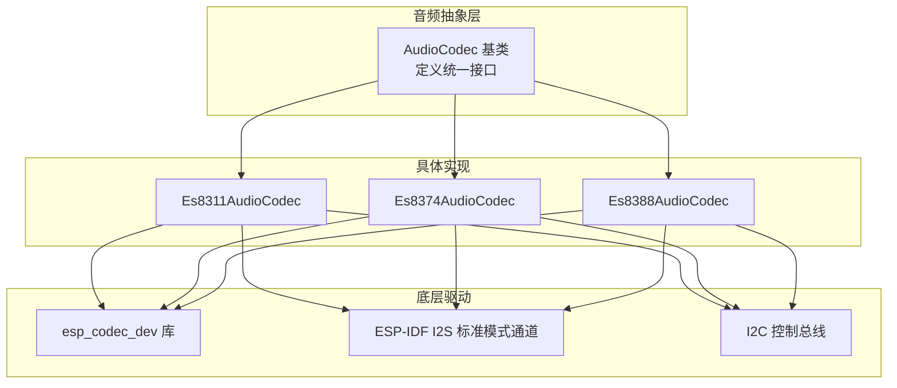
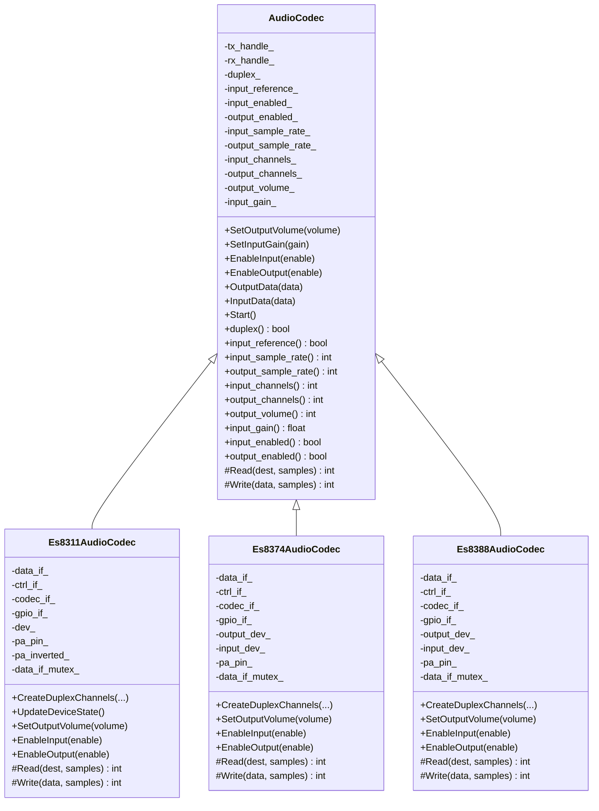
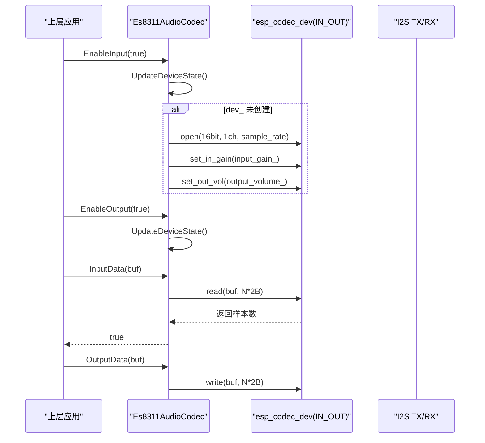
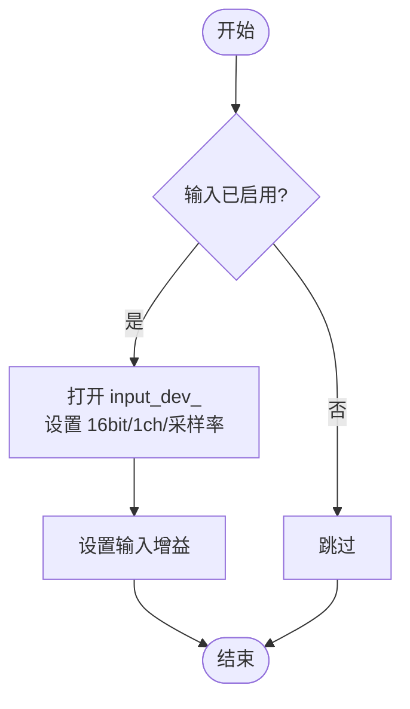
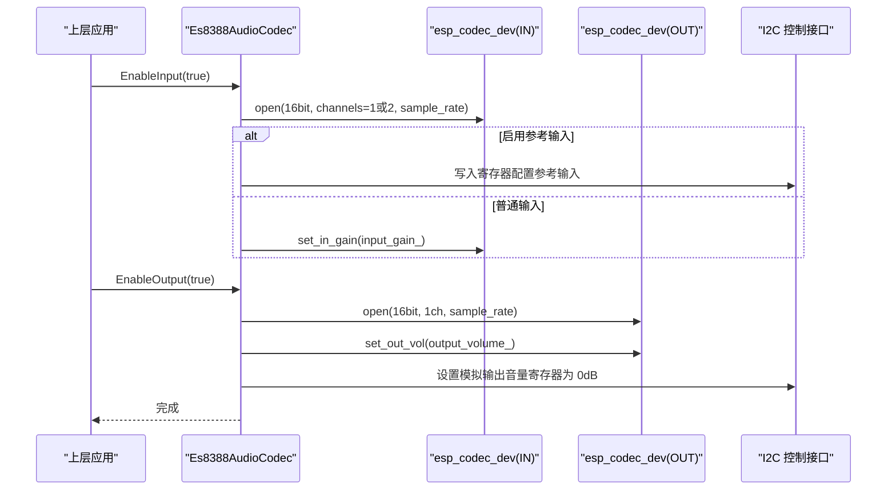
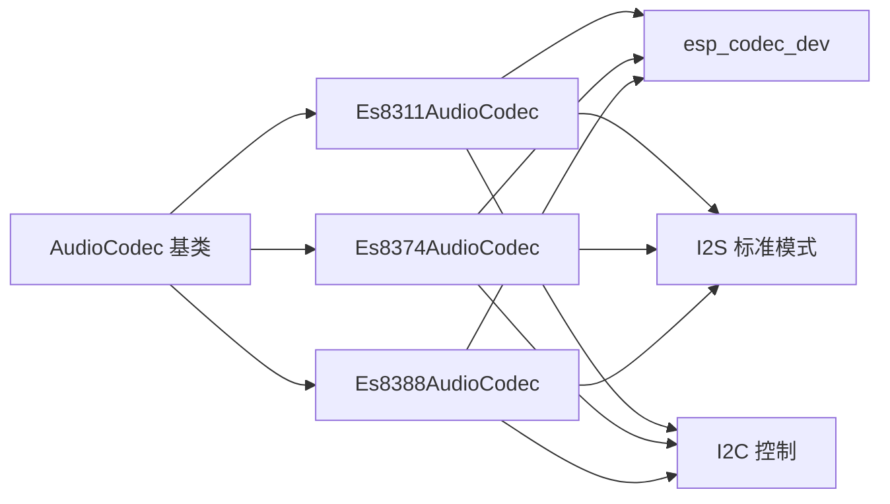

# AudioCodec抽象接口设计

<cite>
**本文引用的文件**
- [audio_codec.h](file://main/audio/audio_codec.h)
- [audio_codec.cc](file://main/audio/audio_codec.cc)
- [es8311_audio_codec.h](file://main/audio/codecs/es8311_audio_codec.h)
- [es8311_audio_codec.cc](file://main/audio/codecs/es8311_audio_codec.cc)
- [es8374_audio_codec.h](file://main/audio/codecs/es8374_audio_codec.h)
- [es8374_audio_codec.cc](file://main/audio/codecs/es8374_audio_codec.cc)
- [es8388_audio_codec.h](file://main/audio/codecs/es8388_audio_codec.h)
- [es8388_audio_codec.cc](file://main/audio/codecs/es8388_audio_codec.cc)
</cite>

## 目录
1. [简介](#简介)
2. [项目结构](#项目结构)
3. [核心组件](#核心组件)
4. [架构总览](#架构总览)
5. [详细组件分析](#详细组件分析)
6. [依赖关系分析](#依赖关系分析)
7. [性能与实时性考虑](#性能与实时性考虑)
8. [故障排查指南](#故障排查指南)
9. [结论](#结论)
10. [附录：I2S参数与双工模式速查](#附录i2s参数与双工模式速查)

## 简介
本文件围绕 AudioCodec 抽象接口进行系统化文档化，重点解释基类设计理念、关键方法语义与行为约定，并结合具体实现（ES8311/ES8374/ES8388）说明 I2S 通信参数配置、双工模式支持、采样率管理策略。同时给出使用示例路径、错误处理要点与性能优化建议，帮助读者快速理解并正确集成音频编解码层。

## 项目结构
AudioCodec 抽象位于 main/audio 目录，具体硬件驱动以“板级/芯片级”方式在 main/audio/codecs 下实现，遵循“统一接口 + 多实现”的扩展模式。

图表来源
- [audio_codec.h:17-59](file://main/audio/audio_codec.h#L17-L59)
- [es8311_audio_codec.cc:100-156](file://main/audio/codecs/es8311_audio_codec.cc#L100-L156)
- [es8374_audio_codec.cc:76-132](file://main/audio/codecs/es8374_audio_codec.cc#L76-L132)
- [es8388_audio_codec.cc:85-137](file://main/audio/codecs/es8388_audio_codec.cc#L85-L137)

章节来源
- [audio_codec.h:17-59](file://main/audio/audio_codec.h#L17-L59)
- [audio_codec.cc:17-68](file://main/audio/audio_codec.cc#L17-L68)

## 核心组件
AudioCodec 基类提供统一的音频输入输出抽象，屏蔽不同硬件差异，向上层暴露稳定 API。

- 设计目标
  - 统一接口：上层无需关心具体硬件，通过同一套方法完成音量、增益、开关、数据读写。
  - 可插拔实现：新增硬件只需继承并重写 Read/Write 等虚函数。
  - 资源生命周期：由具体实现负责 I2S 通道、设备句柄、PA 引脚等资源的创建与释放。
  - 状态可见性：提供 duplex/input_reference/sample_rate/channels/volume/gain/enabled 等查询接口。

- 关键方法与职责
  - SetOutputVolume(volume)：设置输出音量，持久化到设置存储（默认值保护）。
  - SetInputGain(gain)：设置输入增益（单位与范围由具体实现决定）。
  - EnableInput(enable)/EnableOutput(enable)：启用/禁用输入或输出，内部维护状态位。
  - OutputData(data)/InputData(data)：面向上层的数据读写封装，内部调用 Write/Read。
  - Start()：启动时加载持久化音量等配置，打印日志。
  - 纯虚函数 Read/Write：由具体实现对接 esp_codec_dev 或 I2S 驱动。

- 重要成员与访问器
  - duplex_/input_reference_：是否全双工、是否启用参考输入（用于回声消除）。
  - input_sample_rate_/output_sample_rate_：输入/输出采样率。
  - input_channels_/output_channels_：输入/输出通道数。
  - output_volume_/input_gain_：音量与增益。
  - input_enabled_/output_enabled_：输入/输出使能标志。

章节来源
- [audio_codec.h:17-59](file://main/audio/audio_codec.h#L17-L59)
- [audio_codec.cc:17-68](file://main/audio/audio_codec.cc#L17-L68)

## 架构总览
AudioCodec 作为抽象层，向上提供统一 API；向下通过 esp_codec_dev 与 I2S 标准模式通道对接硬件。各具体实现负责：
- 初始化 I2S 双工通道（TX/RX），配置时钟、位宽、槽位、GPIO。
- 初始化 codec_if/data_if/gpio_if 控制面与数据面。
- 按需打开/关闭 esp_codec_dev 实例，设置采样率、通道、增益、音量。
- 控制 PA 引脚电平，避免无声或爆音。

图表来源
- [audio_codec.h:17-59](file://main/audio/audio_codec.h#L17-L59)
- [es8311_audio_codec.h:13-40](file://main/audio/codecs/es8311_audio_codec.h#L13-L40)
- [es8374_audio_codec.h:13-39](file://main/audio/codecs/es8374_audio_codec.h#L13-L39)
- [es8388_audio_codec.h:12-38](file://main/audio/codecs/es8388_audio_codec.h#L12-L38)

## 详细组件分析

### ES8311 实现
- 初始化要点
  - 设置 duplex_=true，input_channels_=1，input_sample_rate_=output_sample_rate_（构造中断言相等）。
  - CreateDuplexChannels 使用 I2S_NUM_0 主模式，MCLK 倍频 256，16bit，立体声槽，左右声道均使能。
  - 通过 audio_codec_new_i2s_data/i2c_ctrl/gpio 构建 data_if/ctrl_if/gpio_if，再创建 es8311 codec_if。
  - 采用单 esp_codec_dev 实例（IN_OUT），根据 input/output 使能动态 open/close。
- 关键流程
  - UpdateDeviceState：当任一方向启用且 dev_ 未创建则创建并打开，设置 16bit/单声道/采样率，应用增益与音量；当两者都禁用则关闭并置空 dev_；同时控制 PA 引脚电平。
  - SetOutputVolume：若 dev_ 存在则直接更新硬件音量，再调用基类保存。
  - EnableInput/EnableOutput：加锁后更新状态并触发 UpdateDeviceState。
  - Read/Write：仅在对应方向启用时调用 esp_codec_dev_read/write。

图表来源
- [es8311_audio_codec.cc:70-98](file://main/audio/codecs/es8311_audio_codec.cc#L70-L98)
- [es8311_audio_codec.cc:158-188](file://main/audio/codecs/es8311_audio_codec.cc#L158-L188)
- [es8311_audio_codec.cc:190-202](file://main/audio/codecs/es8311_audio_codec.cc#L190-L202)

章节来源
- [es8311_audio_codec.cc:7-68](file://main/audio/codecs/es8311_audio_codec.cc#L7-L68)
- [es8311_audio_codec.cc:100-156](file://main/audio/codecs/es8311_audio_codec.cc#L100-L156)
- [es8311_audio_codec.cc:158-202](file://main/audio/codecs/es8311_audio_codec.cc#L158-L202)

### ES8374 实现
- 初始化要点
  - 同样设置 duplex_=true，input_channels_=1，采样率一致。
  - CreateDuplexChannels 与 ES8311 类似，I2S 主模式，256 倍频，16bit，立体声槽。
  - 分别创建 output_dev_ 与 input_dev_ 两个 esp_codec_dev 实例，独立 open/close。
- 关键流程
  - EnableInput：打开 input_dev_，设置 16bit/1ch/采样率，设置输入增益。
  - EnableOutput：打开 output_dev_，设置 16bit/1ch/采样率，设置输出音量，控制 PA 引脚。
  - Read/Write：仅在对应方向启用时调用 esp_codec_dev_read/write。

图表来源
- [es8374_audio_codec.cc:139-158](file://main/audio/codecs/es8374_audio_codec.cc#L139-L158)
- [es8374_audio_codec.cc:160-186](file://main/audio/codecs/es8374_audio_codec.cc#L160-L186)
- [es8374_audio_codec.cc:188-200](file://main/audio/codecs/es8374_audio_codec.cc#L188-L200)

章节来源
- [es8374_audio_codec.cc:7-74](file://main/audio/codecs/es8374_audio_codec.cc#L7-L74)
- [es8374_audio_codec.cc:76-132](file://main/audio/codecs/es8374_audio_codec.cc#L76-L132)
- [es8374_audio_codec.cc:134-200](file://main/audio/codecs/es8374_audio_codec.cc#L134-L200)

### ES8388 实现
- 初始化要点
  - duplex_=true，input_reference_ 可由构造参数指定；当启用参考输入时 input_channels_=2，否则为 1。
  - CreateDuplexChannels 与前述实现一致。
  - 分别创建 output_dev_ 与 input_dev_ 两个 esp_codec_dev 实例。
- 关键流程
  - EnableInput：根据 input_reference_ 选择通道掩码（启用左/右两路），必要时通过 ctrl_if 写入寄存器配置参考输入；非参考输入时使用 esp_codec_dev_set_in_gain。
  - EnableOutput：打开 output_dev_，设置 16bit/1ch/采样率，设置输出音量，并通过 ctrl_if 将模拟输出音量设为 0dB，控制 PA 引脚。
  - Read/Write：仅在对应方向启用时调用 esp_codec_dev_read/write。

图表来源
- [es8388_audio_codec.cc:144-171](file://main/audio/codecs/es8388_audio_codec.cc#L144-L171)
- [es8388_audio_codec.cc:173-206](file://main/audio/codecs/es8388_audio_codec.cc#L173-L206)
- [es8388_audio_codec.cc:208-221](file://main/audio/codecs/es8388_audio_codec.cc#L208-L221)

章节来源
- [es8388_audio_codec.cc:7-83](file://main/audio/codecs/es8388_audio_codec.cc#L7-L83)
- [es8388_audio_codec.cc:85-137](file://main/audio/codecs/es8388_audio_codec.cc#L85-L137)
- [es8388_audio_codec.cc:139-221](file://main/audio/codecs/es8388_audio_codec.cc#L139-L221)

## 依赖关系分析
- 外部依赖
  - ESP-IDF I2S 标准模式通道：用于建立 TX/RX 双工通道，配置 MCLK/BCLK/WS/DIN/DOUT。
  - esp_codec_dev 库：提供统一的编解码设备抽象，简化不同 CODEC 的差异。
  - I2C 控制总线：用于对 CODEC 寄存器进行配置（如增益、音量、参考输入等）。
- 耦合与内聚
  - AudioCodec 基类仅关注通用逻辑与状态，低耦合高内聚。
  - 具体实现各自封装硬件细节，互不影响，便于替换与扩展。
- 潜在循环依赖
  - 无直接循环依赖；具体实现依赖基类与底层库。

图表来源
- [audio_codec.h:17-59](file://main/audio/audio_codec.h#L17-L59)
- [es8311_audio_codec.cc:100-156](file://main/audio/codecs/es8311_audio_codec.cc#L100-L156)
- [es8374_audio_codec.cc:76-132](file://main/audio/codecs/es8374_audio_codec.cc#L76-L132)
- [es8388_audio_codec.cc:85-137](file://main/audio/codecs/es8388_audio_codec.cc#L85-L137)

章节来源
- [audio_codec.h:17-59](file://main/audio/audio_codec.h#L17-L59)

## 性能与实时性考虑
- DMA 缓冲与帧大小
  - 基类定义 AUDIO_CODEC_DMA_DESC_NUM/AUDIO_CODEC_DMA_FRAME_NUM，具体实现中多处复用该常量，影响吞吐与延迟平衡。
- 采样率与位宽
  - 所有实现均采用 16bit 线性 PCM，采样率在构造时要求输入输出一致（断言），避免运行时重配带来的抖动。
- 线程安全
  - 具体实现在关键路径（Enable/SetVolume/Read/Write）使用互斥锁保护，避免并发修改导致的状态不一致。
- 功耗与静音
  - 通过 EnableInput/EnableOutput 控制 esp_codec_dev 的 open/close，减少空闲功耗；PA 引脚电平随输出使能切换，避免无声或爆音。
- 推荐实践
  - 批量读写：尽量以固定帧大小（例如 240 个采样点）进行 InputData/OutputData，匹配 DMA 帧大小以降低中断开销。
  - 预配置：在 Start 前完成所有 Enable 与音量/增益设置，减少运行时频繁切换。
  - 参考输入：如需 AEC，优先选择支持参考输入的 CODEC（如 ES8388）并启用 input_reference。

章节来源
- [audio_codec.h:14-16](file://main/audio/audio_codec.h#L14-L16)
- [es8311_audio_codec.cc:100-156](file://main/audio/codecs/es8311_audio_codec.cc#L100-L156)
- [es8374_audio_codec.cc:76-132](file://main/audio/codecs/es8374_audio_codec.cc#L76-L132)
- [es8388_audio_codec.cc:85-137](file://main/audio/codecs/es8388_audio_codec.cc#L85-L137)

## 故障排查指南
- 常见问题定位
  - 无声：检查 EnableOutput 是否被调用、PA 引脚电平是否正确、输出音量是否为 0。
  - 杂音/爆音：确认输入/输出采样率一致；检查 MCLK 倍频与 GPIO 极性配置；避免在播放过程中频繁更改音量。
  - 无法录音：检查 EnableInput 是否成功、输入增益是否合理、参考输入是否需要额外寄存器配置（ES8388）。
- 日志与断言
  - 基类与具体实现均有 ESP_LOGI/E/W 日志，结合 TAG 定位问题模块。
  - 构造与初始化阶段大量使用 assert/ESP_ERROR_CHECK，失败时会立即中止，需检查返回值与硬件连接。
- 恢复策略
  - 先 Disable 再 Enable：在切换输入/输出状态前先关闭，再重新打开，确保设备处于一致状态。
  - 重置音量/增益：在异常后调用 SetOutputVolume/SetInputGain 恢复默认值。

章节来源
- [audio_codec.cc:30-46](file://main/audio/audio_codec.cc#L30-L46)
- [es8311_audio_codec.cc:158-188](file://main/audio/codecs/es8311_audio_codec.cc#L158-L188)
- [es8374_audio_codec.cc:134-186](file://main/audio/codecs/es8374_audio_codec.cc#L134-L186)
- [es8388_audio_codec.cc:139-206](file://main/audio/codecs/es8388_audio_codec.cc#L139-L206)

## 结论
AudioCodec 抽象接口通过统一 API 屏蔽了不同 CODEC 的差异，配合 esp_codec_dev 与 I2S 标准模式通道，实现了简洁、可扩展的音频子系统。具体实现遵循一致的初始化与状态管理模式，兼顾性能与稳定性。在实际工程中，建议严格遵循采样率一致性、批量读写、线程安全与电源管理最佳实践，以获得更优的实时性与音质表现。

## 附录：I2S参数与双工模式速查
- 通用参数
  - 模式：I2S 标准模式，主模式（MASTER）
  - 位宽：16bit
  - 槽位：立体声（左右声道均使能）
  - MCLK 倍频：256
  - 端口：I2S_NUM_0
- 双工支持
  - 所有具体实现均设置 duplex_=true，支持同时收发。
- 参考输入
  - ES8388 支持 input_reference_，开启后 input_channels_=2，并通过寄存器配置参考输入通道。
- 典型采样率
  - 构造时要求 input_sample_rate_ == output_sample_rate_，常见为 16kHz/48kHz（由上层传入）。

章节来源
- [es8311_audio_codec.cc:100-156](file://main/audio/codecs/es8311_audio_codec.cc#L100-L156)
- [es8374_audio_codec.cc:76-132](file://main/audio/codecs/es8374_audio_codec.cc#L76-L132)
- [es8388_audio_codec.cc:85-137](file://main/audio/codecs/es8388_audio_codec.cc#L85-L137)
- [es8388_audio_codec.cc:144-171](file://main/audio/codecs/es8388_audio_codec.cc#L144-L171)