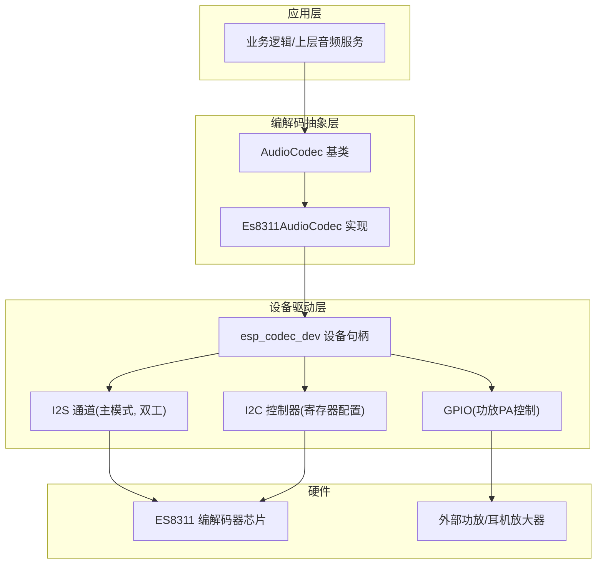
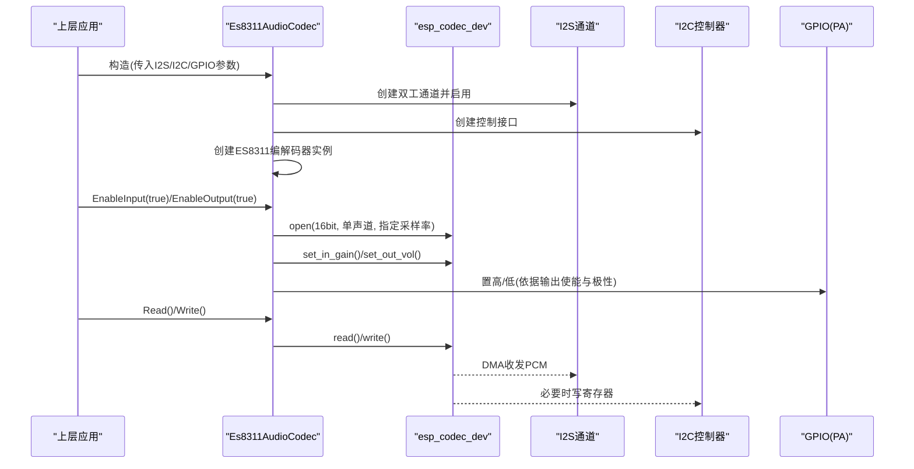
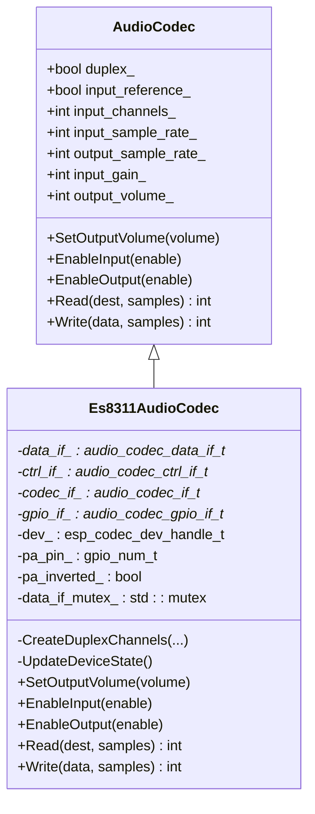
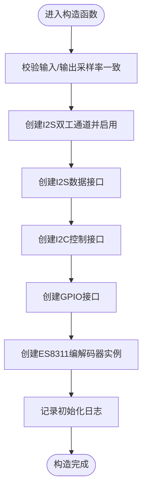
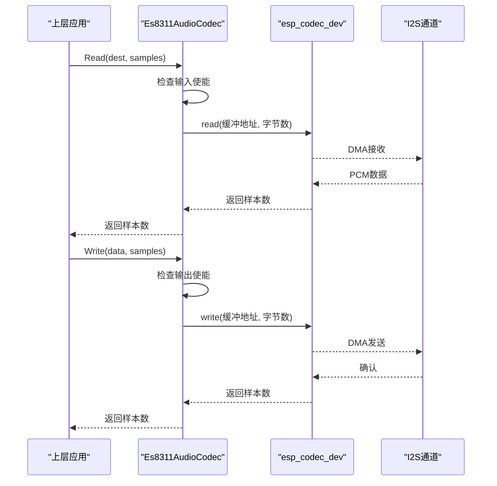
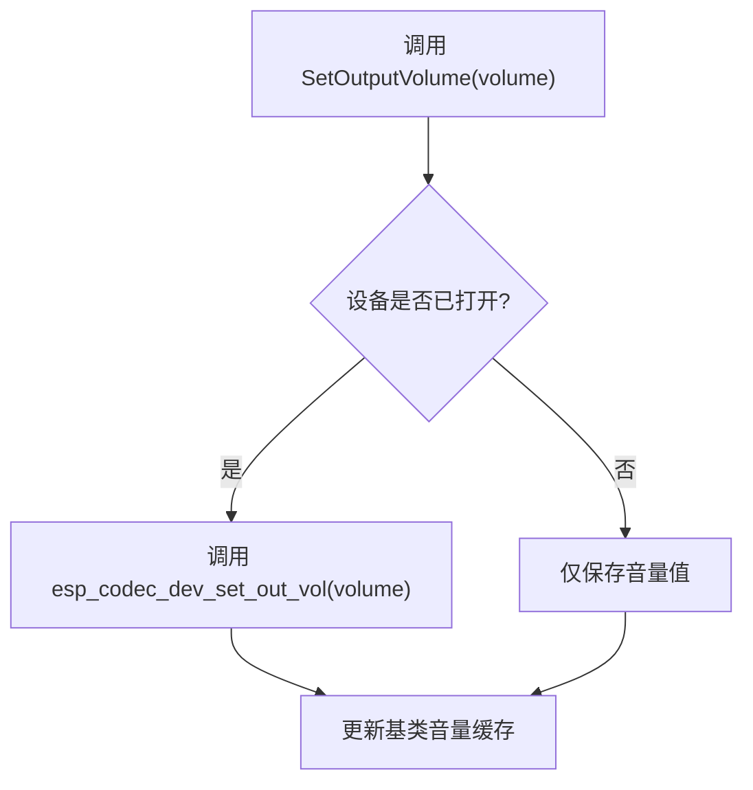
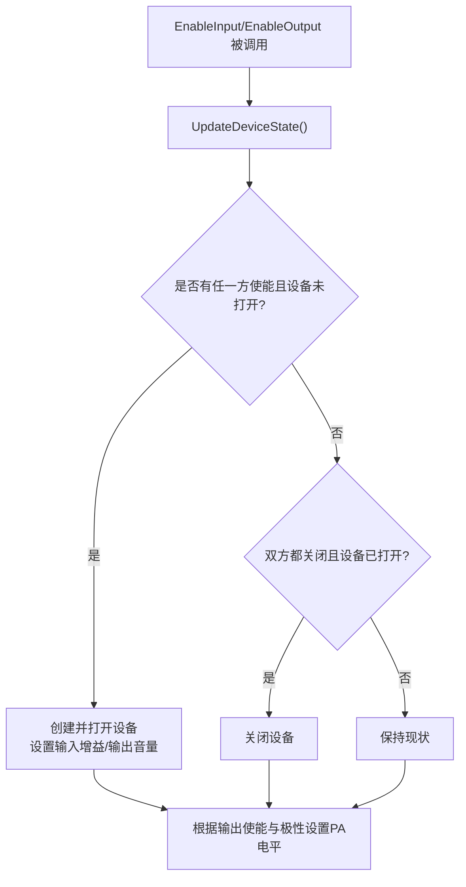
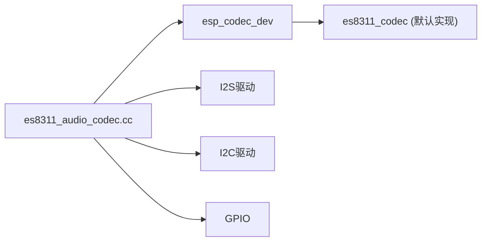

# ES8311编解码器实现

<cite>
**本文引用的文件**   
- [es8311_audio_codec.h](file://main/audio/codecs/es8311_audio_codec.h)
- [es8311_audio_codec.cc](file://main/audio/codecs/es8311_audio_codec.cc)
- [custom-board_zh.md](file://docs/custom-board_zh.md)
</cite>

## 目录
1. [简介](#简介)
2. [项目结构](#项目结构)
3. [核心组件](#核心组件)
4. [架构总览](#架构总览)
5. [详细组件分析](#详细组件分析)
6. [依赖关系分析](#依赖关系分析)
7. [性能考虑](#性能考虑)
8. [故障排查指南](#故障排查指南)
9. [结论](#结论)
10. [附录](#附录)

## 简介
本指南面向在ESP32平台上集成ES8311音频编解码器的开发者，结合仓库中的具体实现，系统阐述：
- ES8311的硬件特性与I2S/I2C接口要点
- 初始化流程、音频数据流路径、音量与增益控制
- 引脚配置方法、常见问题定位与性能调优建议
- 基于代码级实现的时序与状态流转说明

## 项目结构
ES8311驱动位于音频编解码器模块中，采用分层设计：上层通过统一的AudioCodec接口调用，底层由esp_codec_dev与I2S/I2C驱动完成实际的数据与控制通路。

图示来源
- [es8311_audio_codec.h:13-40](file://main/audio/codecs/es8311_audio_codec.h#L13-L40)
- [es8311_audio_codec.cc:22-58](file://main/audio/codecs/es8311_audio_codec.cc#L22-L58)
- [es8311_audio_codec.cc:100-156](file://main/audio/codecs/es8311_audio_codec.cc#L100-L156)

章节来源
- [es8311_audio_codec.h:13-40](file://main/audio/codecs/es8311_audio_codec.h#L13-L40)
- [es8311_audio_codec.cc:22-58](file://main/audio/codecs/es8311_audio_codec.cc#L22-L58)

## 核心组件
- Es8311AudioCodec：封装ES8311的创建、I2S双工通道建立、I2C控制接口、设备生命周期管理、输入输出使能、音量与增益设置、读写数据等。
- esp_codec_dev：统一设备抽象，负责打开/关闭设备、设置采样率/位宽/通道、设置输入增益与输出音量、读写PCM数据。
- I2S通道：主模式，标准TDM格式，16bit，立体声槽（内部按单声道处理），MCLK=256倍频。
- I2C控制：用于ES8311寄存器配置（由esp_codec_dev默认实现）。
- GPIO：可选PA引脚控制，支持反相逻辑。

章节来源
- [es8311_audio_codec.h:13-40](file://main/audio/codecs/es8311_audio_codec.h#L13-L40)
- [es8311_audio_codec.cc:70-98](file://main/audio/codecs/es8311_audio_codec.cc#L70-L98)
- [es8311_audio_codec.cc:100-156](file://main/audio/codecs/es8311_audio_codec.cc#L100-L156)

## 架构总览
ES8311驱动的关键交互如下：
- 构造阶段：创建I2S双工通道；创建I2S数据接口、I2C控制接口、GPIO接口；创建ES8311编解码器实例。
- 运行时：EnableInput/EnableOutput触发UpdateDeviceState，按需open/close esp_codec_dev并设置输入增益与输出音量；Read/Write通过esp_codec_dev进行DMA传输。
- PA控制：根据输出使能状态切换PA电平，支持反相。

图示来源
- [es8311_audio_codec.cc:7-58](file://main/audio/codecs/es8311_audio_codec.cc#L7-L58)
- [es8311_audio_codec.cc:70-98](file://main/audio/codecs/es8311_audio_codec.cc#L70-L98)
- [es8311_audio_codec.cc:190-202](file://main/audio/codecs/es8311_audio_codec.cc#L190-L202)

## 详细组件分析

### 类与接口关系

图示来源
- [es8311_audio_codec.h:13-40](file://main/audio/codecs/es8311_audio_codec.h#L13-L40)

章节来源
- [es8311_audio_codec.h:13-40](file://main/audio/codecs/es8311_audio_codec.h#L13-L40)

### 初始化流程与关键配置
- I2S双工通道：主模式，16bit，立体声槽掩码，WS宽度16bit，MCLK=256倍频，启用TX/RX。
- 编解码器工作模式：双工（IN_OUT）。
- 采样率/位宽/通道：16bit，单声道，采样率由构造参数决定。
- 输入增益与输出音量：在设备open后设置。
- PA控制：根据输出使能状态与极性翻转控制。

图示来源
- [es8311_audio_codec.cc:7-58](file://main/audio/codecs/es8311_audio_codec.cc#L7-L58)
- [es8311_audio_codec.cc:100-156](file://main/audio/codecs/es8311_audio_codec.cc#L100-L156)

章节来源
- [es8311_audio_codec.cc:7-58](file://main/audio/codecs/es8311_audio_codec.cc#L7-L58)
- [es8311_audio_codec.cc:100-156](file://main/audio/codecs/es8311_audio_codec.cc#L100-L156)

### 音频数据流处理
- 读取路径：上层调用Read -> 若输入已使能则通过esp_codec_dev_read从I2S拉取PCM到缓冲区。
- 写入路径：上层调用Write -> 若输出已使能则通过esp_codec_dev_write将PCM推送到I2S。
- 线程安全：对设备操作加互斥锁，避免并发冲突。

图示来源
- [es8311_audio_codec.cc:190-202](file://main/audio/codecs/es8311_audio_codec.cc#L190-L202)

章节来源
- [es8311_audio_codec.cc:190-202](file://main/audio/codecs/es8311_audio_codec.cc#L190-L202)

### 音量控制与增益调节
- 输出音量：通过SetOutputVolume更新，并在设备运行期调用esp_codec_dev_set_out_vol生效。
- 输入增益：在设备open时设置一次input_gain，也可在需要时调整。
- 注意：音量变更需持有互斥锁，确保与读写的原子性。

图示来源
- [es8311_audio_codec.cc:158-164](file://main/audio/codecs/es8311_audio_codec.cc#L158-L164)
- [es8311_audio_codec.cc:87-89](file://main/audio/codecs/es8311_audio_codec.cc#L87-L89)

章节来源
- [es8311_audio_codec.cc:158-164](file://main/audio/codecs/es8311_audio_codec.cc#L158-L164)
- [es8311_audio_codec.cc:87-89](file://main/audio/codecs/es8311_audio_codec.cc#L87-L89)

### 引脚配置与硬件连接
- I2S引脚：mclk、bclk、ws、dout、din，需在构造时传入对应GPIO编号。
- I2C总线：端口号、ES8311地址、I2C master句柄，用于寄存器访问。
- PA引脚：可选，支持反相逻辑；当输出使能时控制功放上电或静音。
- MCLK：可选择是否使用MCLK，配合I2S时钟倍频使用。

章节来源
- [es8311_audio_codec.h:32-34](file://main/audio/codecs/es8311_audio_codec.h#L32-L34)
- [es8311_audio_codec.cc:32-52](file://main/audio/codecs/es8311_audio_codec.cc#L32-L52)
- [es8311_audio_codec.cc:137-148](file://main/audio/codecs/es8311_audio_codec.cc#L137-L148)
- [custom-board_zh.md:61](file://docs/custom-board_zh.md#L61)

### 设备状态管理与PA控制
- UpdateDeviceState：当任一方向使能且设备未打开时，创建并打开设备，设置输入增益与输出音量；当两者均关闭时关闭设备。
- PA控制：根据输出使能状态与极性翻转设置GPIO电平。

图示来源
- [es8311_audio_codec.cc:70-98](file://main/audio/codecs/es8311_audio_codec.cc#L70-L98)

章节来源
- [es8311_audio_codec.cc:70-98](file://main/audio/codecs/es8311_audio_codec.cc#L70-L98)

## 依赖关系分析
- 直接依赖：
  - esp_codec_dev：设备抽象与API（open/close/read/write/set_in_gain/set_out_vol）
  - I2S驱动：主模式双工通道，标准模式配置
  - I2C驱动：寄存器配置（通过audio_codec_i2c_ctrl）
  - GPIO：PA控制
- 间接依赖：
  - es8311_codec_new：ES8311特定编解码器实现（由esp_codec_dev_defaults提供）

图示来源
- [es8311_audio_codec.cc:22-58](file://main/audio/codecs/es8311_audio_codec.cc#L22-L58)
- [es8311_audio_codec.cc:100-156](file://main/audio/codecs/es8311_audio_codec.cc#L100-L156)

章节来源
- [es8311_audio_codec.cc:22-58](file://main/audio/codecs/es8311_audio_codec.cc#L22-L58)
- [es8311_audio_codec.cc:100-156](file://main/audio/codecs/es8311_audio_codec.cc#L100-L156)

## 性能考虑
- I2S DMA：使用默认描述符与帧数配置，保证吞吐与延迟平衡。
- 时钟倍频：MCLK=256倍频，有助于降低抖动与提高音质。
- 互斥保护：对设备操作加锁，避免并发导致的竞态与丢帧。
- 动态开关：仅在需要时打开设备，减少功耗与资源占用。
- 音量/增益：合理设置输入增益与输出音量，避免削波与底噪过大。

[本节为通用指导，不直接分析具体文件]

## 故障排查指南
- 无声音/无声输出
  - 检查EnableOutput是否被调用，PA引脚电平是否正确，极性是否匹配。
  - 确认输出音量设置有效，设备处于打开状态。
- 录音无声/底噪大
  - 检查EnableInput是否被调用，输入增益是否合适。
  - 确认I2S接线与引脚定义正确，MCLK/BCLK/WS极性无误。
- I2C通信失败
  - 核对I2C端口、ES8311地址与master句柄是否正确。
  - 查看初始化日志，确认ES8311编解码器实例创建成功。
- 数据异常/爆音
  - 检查采样率一致性断言是否通过，I2S配置是否与硬件一致。
  - 适当调整DMA描述符与帧数，优化缓冲策略。

章节来源
- [es8311_audio_codec.cc:54-58](file://main/audio/codecs/es8311_audio_codec.cc#L54-L58)
- [es8311_audio_codec.cc:70-98](file://main/audio/codecs/es8311_audio_codec.cc#L70-L98)
- [es8311_audio_codec.cc:158-164](file://main/audio/codecs/es8311_audio_codec.cc#L158-L164)
- [es8311_audio_codec.cc:190-202](file://main/audio/codecs/es8311_audio_codec.cc#L190-L202)

## 结论
本实现以esp_codec_dev为核心，结合I2S与I2C驱动，提供了简洁可靠的ES8311编解码器接入方案。通过清晰的设备状态管理、线程安全的读写路径以及灵活的音量/增益控制，能够满足大多数语音交互场景的需求。建议在硬件层面严格对齐I2S时序与极性，并根据实际声学环境微调输入增益与输出音量，以获得最佳听感与识别效果。

[本节为总结，不直接分析具体文件]

## 附录
- 常用宏与地址：项目中多处定义了ES8311默认地址常量，便于在不同板级配置中复用。
- 参考文档：自定义板级文档中包含ES8311相关配置示例与说明。

章节来源
- [custom-board_zh.md:61](file://docs/custom-board_zh.md#L61)