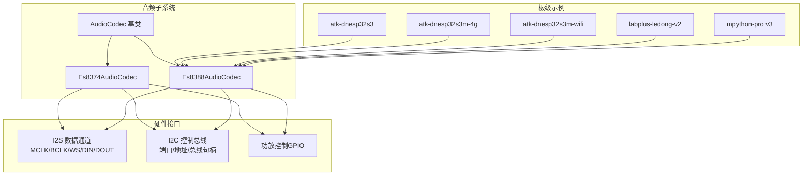
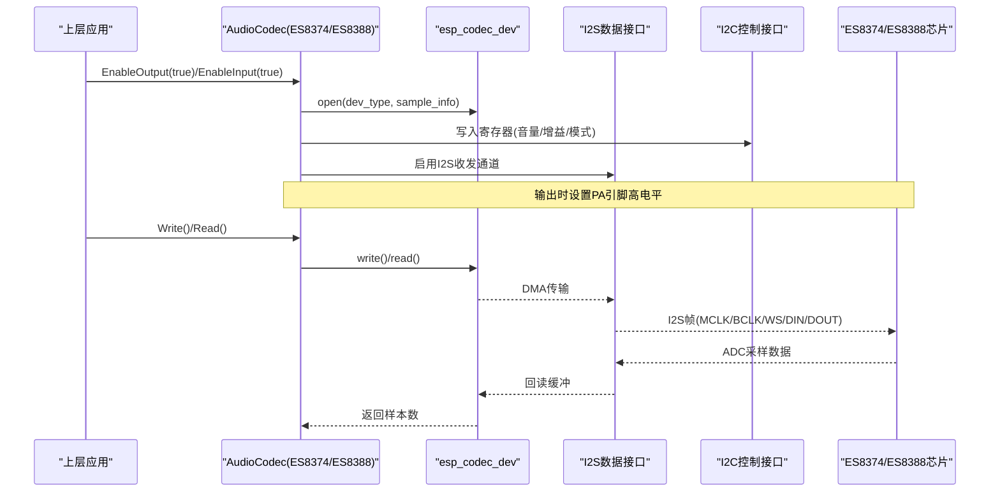
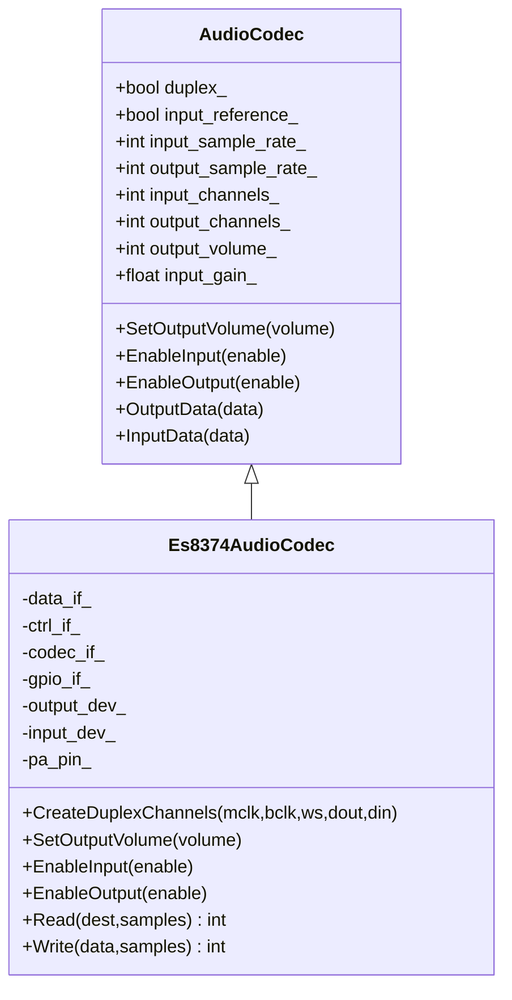
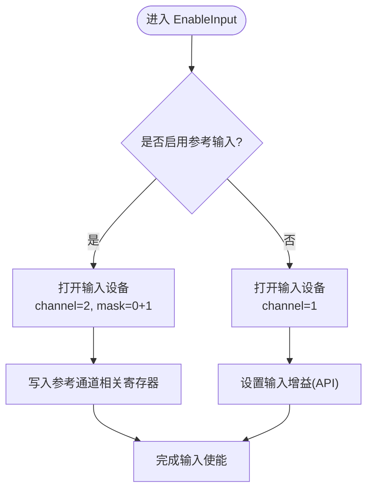
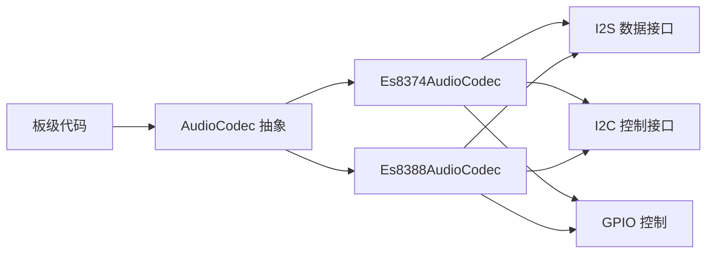

# ES8374/ES8388编解码器实现

<cite>
**本文引用的文件**   
- [es8374_audio_codec.h](file://main/audio/codecs/es8374_audio_codec.h)
- [es8374_audio_codec.cc](file://main/audio/codecs/es8374_audio_codec.cc)
- [es8388_audio_codec.h](file://main/audio/codecs/es8388_audio_codec.h)
- [es8388_audio_codec.cc](file://main/audio/codecs/es8388_audio_codec.cc)
- [audio_codec.h](file://main/audio/audio_codec.h)
- [audio_codec.cc](file://main/audio/audio_codec.cc)
- [atk_dnesp32s3.cc](file://main/boards/atk-dnesp32s3/atk_dnesp32s3.cc)
- [atk_dnesp32s3m-4g.cc](file://main/boards/atk-dnesp32s3m-4g/atk_dnesp32s3m.cc)
- [atk_dnesp32s3m-wifi.cc](file://main/boards/atk-dnesp32s3m-wifi/atk_dnesp32s3m.cc)
- [labplus_ledong_v2.cc](file://main/boards/labplus-ledong-v2/labplus_ledong_v2.cc)
- [mpython_pro.cc](file://main/boards/labplus-mpython-v3/mpython_pro.cc)
</cite>

## 目录
1. [简介](#简介)
2. [项目结构](#项目结构)
3. [核心组件](#核心组件)
4. [架构总览](#架构总览)
5. [详细组件分析](#详细组件分析)
6. [依赖关系分析](#依赖关系分析)
7. [性能与功耗考量](#性能与功耗考量)
8. [故障排查指南](#故障排查指南)
9. [结论](#结论)
10. [附录](#附录)

## 简介
本文件面向在项目中集成和迁移 ES8374 与 ES8388 音频编解码器的工程师，基于仓库中的实际实现进行对比说明。内容涵盖两类芯片的初始化流程、I2S 参数配置、输入输出控制、音量与增益设置、参考通道（回声消除）支持差异、功耗管理建议、选型与迁移策略，以及多个板级使用案例与调试经验总结。

## 项目结构
本项目将音频编解码器抽象为统一的 AudioCodec 接口，ES8374 与 ES8388 分别提供具体实现类，并通过各 Board 的 GetAudioCodec() 返回实例，供上层应用统一调用。

图表来源
- [audio_codec.h:1-62](file://main/audio/audio_codec.h#L1-L62)
- [es8374_audio_codec.h:1-41](file://main/audio/codecs/es8374_audio_codec.h#L1-L41)
- [es8388_audio_codec.h:1-41](file://main/audio/codecs/es8388_audio_codec.h#L1-L41)
- [atk_dnesp32s3.cc:199-214](file://main/boards/atk-dnesp32s3/atk_dnesp32s3.cc#L199-L214)
- [atk_dnesp32s3m-4g.cc:190-205](file://main/boards/atk-dnesp32s3m-4g/atk_dnesp32s3m.cc#L190-L205)
- [atk_dnesp32s3m-wifi.cc:200-215](file://main/boards/atk-dnesp32s3m-wifi/atk_dnesp32s3m.cc#L200-L215)
- [labplus_ledong_v2.cc:136-151](file://main/boards/labplus-ledong-v2/labplus_ledong_v2.cc#L136-L151)
- [mpython_pro.cc:116-131](file://main/boards/labplus-mpython-v3/mpython_pro.cc#L116-L131)

章节来源
- [audio_codec.h:1-62](file://main/audio/audio_codec.h#L1-L62)
- [audio_codec.cc:1-68](file://main/audio/audio_codec.cc#L1-L68)
- [es8374_audio_codec.h:1-41](file://main/audio/codecs/es8374_audio_codec.h#L1-L41)
- [es8388_audio_codec.h:1-41](file://main/audio/codecs/es8388_audio_codec.h#L1-L41)

## 核心组件
- AudioCodec 基类：定义统一的输入/输出开关、音量/增益设置、数据读写等接口，并提供默认持久化与日志记录。
- Es8374AudioCodec：基于 esp_codec_dev 的 ES8374 驱动封装，创建独立输入/输出设备句柄，I2S 双工通道，PA 引脚控制。
- Es8388AudioCodec：基于 esp_codec_dev 的 ES8388 驱动封装，支持可选参考输入通道（用于回声消除），并包含模拟输出电平校准逻辑。

章节来源
- [audio_codec.h:17-59](file://main/audio/audio_codec.h#L17-L59)
- [audio_codec.cc:17-68](file://main/audio/audio_codec.cc#L17-L68)
- [es8374_audio_codec.h:13-39](file://main/audio/codecs/es8374_audio_codec.h#L13-L39)
- [es8388_audio_codec.h:12-38](file://main/audio/codecs/es8388_audio_codec.h#L12-L38)

## 架构总览
下图展示从上层到硬件的调用链与数据流，包括 I2S 数据路径与 I2C 控制路径。

图表来源
- [es8374_audio_codec.cc:139-200](file://main/audio/codecs/es8374_audio_codec.cc#L139-L200)
- [es8388_audio_codec.cc:144-221](file://main/audio/codecs/es8388_audio_codec.cc#L144-L221)
- [audio_codec.cc:17-27](file://main/audio/audio_codec.cc#L17-L27)

## 详细组件分析

### ES8374 编解码器
- 初始化要点
  - 创建 I2S 双工通道（TX/RX），时钟源默认，MCLK 倍频 256，16bit，立体声槽位。
  - 通过 I2C 创建控制接口，构建 ES8374 codec_if，工作模式为 BOTH。
  - 分别创建输出与输入 esp_codec_dev 句柄，关闭后不自动禁用。
- 输入/输出控制
  - 打开输入/输出时设置采样率、位宽、通道数；输出开启时设置音量并拉高 PA 引脚。
  - 读取/写入使用 esp_codec_dev_read/write，带错误忽略宏避免异常中断。
- 特性
  - 不支持参考输入通道（input_reference_ 固定为 false）。
  - 输入增益默认值较高，便于小信号拾音。

图表来源
- [audio_codec.h:17-59](file://main/audio/audio_codec.h#L17-L59)
- [es8374_audio_codec.h:13-39](file://main/audio/codecs/es8374_audio_codec.h#L13-L39)

章节来源
- [es8374_audio_codec.cc:7-74](file://main/audio/codecs/es8374_audio_codec.cc#L7-L74)
- [es8374_audio_codec.cc:76-132](file://main/audio/codecs/es8374_audio_codec.cc#L76-L132)
- [es8374_audio_codec.cc:134-200](file://main/audio/codecs/es8374_audio_codec.cc#L134-L200)

### ES8388 编解码器
- 初始化要点
  - 与 ES8374 类似，但额外设置 master_mode=true，并配置 PA 电压与 DAC 电压以适配硬件。
  - 支持可选参考输入通道（input_reference），当启用时输入通道数为 2，并在打开输入时设置特定寄存器以启用参考通道。
- 输入/输出控制
  - 输出开启时，除设置数字音量外，还直接写寄存器将模拟输出电平设为 0dB（覆盖默认 -45dB）。
  - 输入增益在非参考模式下通过标准 API 设置；参考模式下走专用寄存器路径。
- 特性
  - 支持参考输入通道，适合需要 AEC（回声消除）的场景。
  - 对模拟输出电平的显式校准，有助于在不同硬件上获得一致的响度表现。

图表来源
- [es8388_audio_codec.cc:144-171](file://main/audio/codecs/es8388_audio_codec.cc#L144-L171)

章节来源
- [es8388_audio_codec.cc:7-71](file://main/audio/codecs/es8388_audio_codec.cc#L7-L71)
- [es8388_audio_codec.cc:85-137](file://main/audio/codecs/es8388_audio_codec.cc#L85-L137)
- [es8388_audio_codec.cc:139-221](file://main/audio/codecs/es8388_audio_codec.cc#L139-L221)

### 板级使用案例
以下板子均通过 GetAudioCodec() 返回 Es8388AudioCodec 实例，演示了如何在不同硬件平台上复用同一套音频驱动。

- atk-dnesp32s3
  - 使用 I2C0 作为控制总线，传入 AUDIO_CODEC_ES8388_ADDR，未连接 PA 引脚。
- atk-dnesp32s3m-4g / atk-dnesp32s3m-wifi
  - 同样使用 I2C0，提供音量按键回调，动态调整输出音量。
- labplus-ledong-v2 / mpython-pro v3
  - 典型 WiFi 开发板，使用相同构造方式创建 ES8388 实例。

章节来源
- [atk_dnesp32s3.cc:199-214](file://main/boards/atk-dnesp32s3/atk_dnesp32s3.cc#L199-L214)
- [atk_dnesp32s3m-4g.cc:190-205](file://main/boards/atk-dnesp32s3m-4g/atk_dnesp32s3m.cc#L190-L205)
- [atk_dnesp32s3m-wifi.cc:200-215](file://main/boards/atk-dnesp32s3m-wifi/atk_dnesp32s3m.cc#L200-L215)
- [labplus_ledong_v2.cc:136-151](file://main/boards/labplus-ledong-v2/labplus_ledong_v2.cc#L136-L151)
- [mpython_pro.cc:116-131](file://main/boards/labplus-mpython-v3/mpython_pro.cc#L116-L131)

## 依赖关系分析
- 组件耦合
  - ES8374/ES8388 均依赖 audio_codec_if、i2c_ctrl_if、i2s_data_if 与 gpio_if，通过 esp_codec_dev 暴露统一的数据面。
  - 板级代码仅依赖 AudioCodec 抽象，屏蔽底层差异。
- 外部依赖
  - ESP-IDF I2S 驱动、ESP Codec Dev 库、I2C Master 驱动。
- 潜在循环依赖
  - 当前实现无循环依赖，Board 层仅持有 AudioCodec 指针。

图表来源
- [audio_codec.h:17-59](file://main/audio/audio_codec.h#L17-L59)
- [es8374_audio_codec.h:13-39](file://main/audio/codecs/es8374_audio_codec.h#L13-L39)
- [es8388_audio_codec.h:12-38](file://main/audio/codecs/es8388_audio_codec.h#L12-L38)

章节来源
- [audio_codec.h:17-59](file://main/audio/audio_codec.h#L17-L59)
- [es8374_audio_codec.h:13-39](file://main/audio/codecs/es8374_audio_codec.h#L13-L39)
- [es8388_audio_codec.h:12-38](file://main/audio/codecs/es8388_audio_codec.h#L12-L38)

## 性能与功耗考量
- I2S 缓冲区与 DMA
  - 两者均采用 I2S 主模式，DMA 描述符与帧数影响吞吐与延迟。ES8388 使用常量宏配置，ES8374 使用硬编码值，二者数值相近。
- 时钟与对齐
  - MCLK 倍频 256，16bit，立体声槽位，左对齐（部分平台）。确保与外设一致以避免失真或无声。
- 功耗管理建议
  - 非活跃期关闭输入/输出设备句柄，避免持续转换与放大。
  - 关闭 PA 引脚以降低功放静态电流。
  - 合理设置输入增益与输出音量，避免不必要的过驱动导致额外功耗。
- 参考通道与 AEC
  - 仅在需要回声消除时启用 ES8388 的参考输入通道，以减少处理开销与噪声引入。

[本节为通用指导，无需列出具体文件来源]

## 故障排查指南
- 无声或爆音
  - 检查 I2S 引脚映射与极性（MCLK/BCLK/WS/DIN/DOUT），确认左右对齐与位宽一致。
  - 核对 ES8388 模拟输出寄存器是否被设置为期望电平（默认可能较低）。
- 无法初始化
  - 确认 I2C 端口、地址与总线句柄正确；查看初始化日志输出。
- 输入无信号
  - 检查输入通道数与参考通道配置是否匹配；确认输入增益设置有效。
- 音量调节无效
  - 确认输出设备已打开且音量设置生效；注意 PA 引脚电平状态。

章节来源
- [es8374_audio_codec.cc:134-200](file://main/audio/codecs/es8374_audio_codec.cc#L134-L200)
- [es8388_audio_codec.cc:139-221](file://main/audio/codecs/es8388_audio_codec.cc#L139-L221)
- [audio_codec.cc:40-68](file://main/audio/audio_codec.cc#L40-L68)

## 结论
- ES8374 与 ES8388 在本项目中采用相同的抽象层，便于跨芯片移植。
- ES8388 在参考输入通道与模拟输出电平校准方面更具优势，适合需要 AEC 与一致性响度的产品。
- 通过板级 GetAudioCodec() 的统一返回，可在不同硬件间快速切换与复用音频驱动。
- 建议在量产前针对具体硬件进行 I2S 时序与模拟输出校准验证，并结合功耗策略优化待机与运行态能耗。

[本节为总结性内容，无需列出具体文件来源]

## 附录

### 芯片选择与迁移指南
- 何时选择 ES8374
  - 不需要参考输入通道，成本敏感，基础录音/播放场景。
- 何时选择 ES8388
  - 需要参考输入通道（AEC）、需要更灵活的模拟输出电平校准。
- 迁移步骤
  - 替换构造函数参数（I2C 端口、地址、I2S 引脚、PA 引脚）。
  - 若需参考输入，启用 ES8388 的 input_reference 参数并相应调整输入通道数。
  - 校验输出音量与模拟输出电平，必要时微调寄存器。
- 兼容性注意事项
  - 保持输入/输出采样率一致，避免双工冲突。
  - 确保 I2S 对齐与位宽与外设一致。
  - 关注 PA 引脚极性（反相/同相）与硬件设计。

章节来源
- [es8374_audio_codec.cc:7-74](file://main/audio/codecs/es8374_audio_codec.cc#L7-L74)
- [es8388_audio_codec.cc:7-71](file://main/audio/codecs/es8388_audio_codec.cc#L7-L71)
- [es8388_audio_codec.cc:144-171](file://main/audio/codecs/es8388_audio_codec.cc#L144-L171)