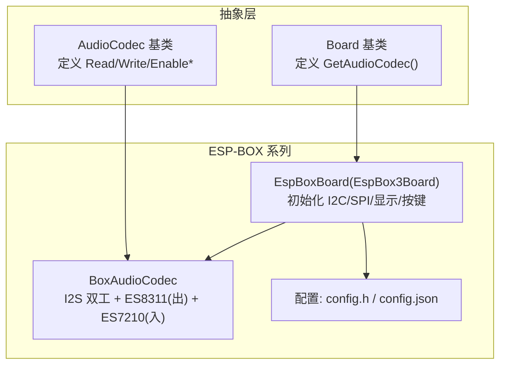
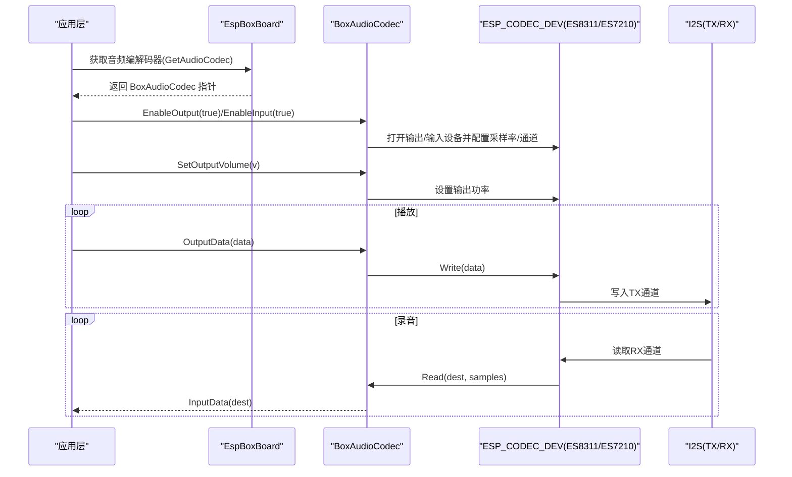
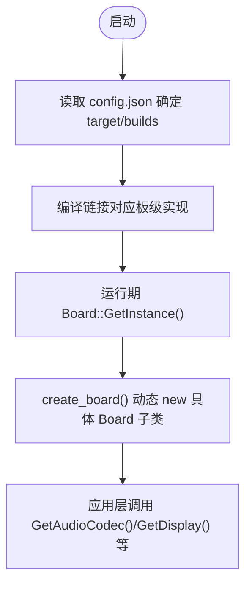
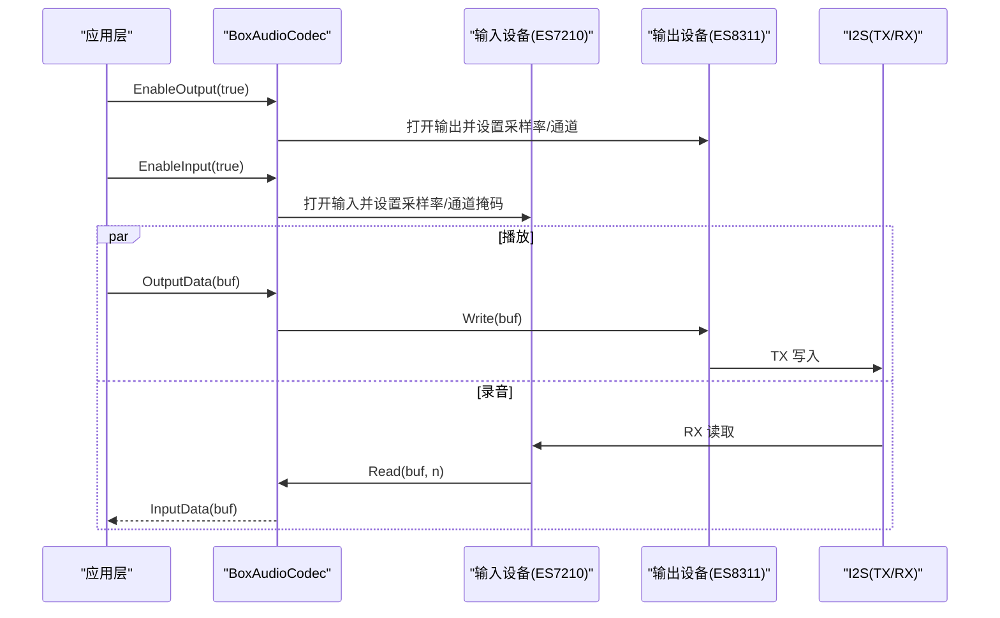
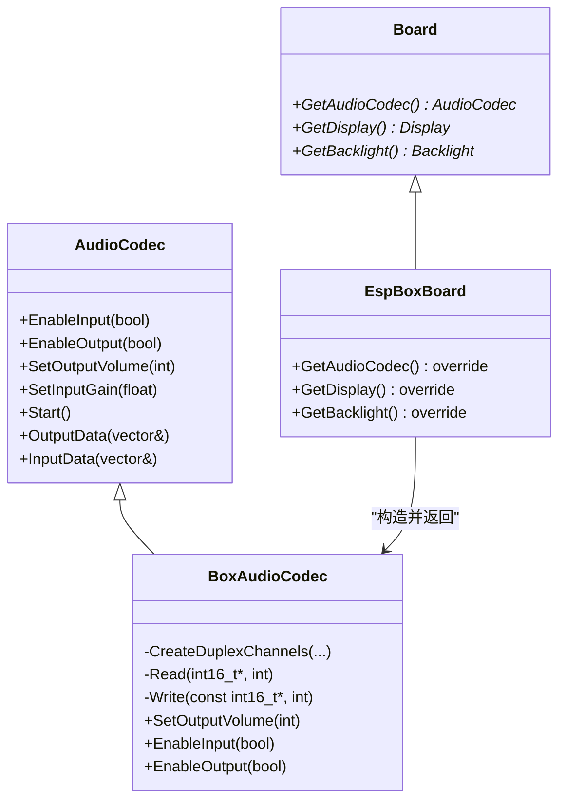

# 板级集成示例

<cite>
**本文引用的文件**   
- [board.h](file://main\boards\common\board.h)
- [board.cc](file://main\boards\common\board.cc)
- [audio_codec.h](file://main\audio\audio_codec.h)
- [box_audio_codec.h](file://main\audio\codecs\box_audio_codec.h)
- [box_audio_codec.cc](file://main\audio\codecs\box_audio_codec.cc)
- [esp_box_board.cc](file://main\boards\esp-box\esp_box_board.cc)
- [config.h](file://main\boards\esp-box\config.h)
- [config.json](file://main\boards\esp-box\config.json)
- [esp_box3_board.cc](file://main\boards\esp-box-3\esp_box3_board.cc)
- [esp_box_lite_board.cc](file://main\boards\esp-box-lite\esp_box_lite_board.cc)
</cite>

## 目录
1. [简介](#简介)
2. [项目结构](#项目结构)
3. [核心组件](#核心组件)
4. [架构总览](#架构总览)
5. [详细组件分析](#详细组件分析)
6. [依赖关系分析](#依赖关系分析)
7. [性能与资源考量](#性能与资源考量)
8. [常见问题与调试指南](#常见问题与调试指南)
9. [结论](#结论)

## 简介
本文件面向硬件工程师与固件开发者，提供以 ESP-BOX 为代表的板级音频编解码器集成实战指南。内容涵盖：
- 在 Board 类中集成 AudioCodec 的完整流程
- 引脚映射与音频参数配置方法
- 不同板级的集成差异（ESP-BOX、ESP-BOX-3、ESP-BOX-LITE）
- 配置文件结构与动态加载机制
- 常见集成问题定位与调试技巧

## 项目结构
围绕“板级音频编解码器集成”的关键代码分布在以下位置：
- 通用抽象层
  - 板级抽象接口：Board 基类定义 GetAudioCodec 等虚函数
  - 音频编解码抽象：AudioCodec 基类定义读写、开关、音量/增益控制等
- 具体实现
  - ESP-BOX 系列板级实现：分别包含各自的 Board 子类与音频 Codec 实例化逻辑
  - 音频 Codec 驱动：基于 ESP-IDF esp_codec_dev 封装的 BoxAudioCodec
- 配置
  - 各板级 config.h 定义 I2S/I2C/PA 引脚、采样率、参考输入等
  - 构建目标与 SDK 配置片段由 config.json 指定

图表来源
- [board.h:46-85](file://main\boards\common\board.h#L46-L85)
- [audio_codec.h:17-59](file://main\audio\audio_codec.h#L17-L59)
- [esp_box_board.cc:38-175](file://main\boards\esp-box\esp_box_board.cc#L38-L175)
- [box_audio_codec.h:11-38](file://main\audio\codecs\box_audio_codec.h#L11-L38)
- [config.h:6-21](file://main\boards\esp-box\config.h#L6-L21)
- [config.json:1-9](file://main\boards\esp-box\config.json#L1-L9)

章节来源
- [board.h:46-85](file://main\boards\common\board.h#L46-L85)
- [audio_codec.h:17-59](file://main\audio\audio_codec.h#L17-L59)
- [esp_box_board.cc:38-175](file://main\boards\esp-box\esp_box_board.cc#L38-L175)
- [box_audio_codec.h:11-38](file://main\audio\codecs\box_audio_codec.h#L11-L38)
- [config.h:6-21](file://main\boards\esp-box\config.h#L6-L21)
- [config.json:1-9](file://main\boards\esp-box\config.json#L1-L9)

## 核心组件
- Board 抽象
  - 通过静态工厂 create_board 与 DECLARE_BOARD 宏完成运行时动态创建具体板级对象
  - 关键接口：GetAudioCodec、GetDisplay、GetBacklight、GetNetwork 等
- AudioCodec 抽象
  - 统一输入输出能力：EnableInput/EnableOutput、SetOutputVolume/SetInputGain、Start、Read/Write
  - 内部维护 I2S 通道句柄、采样率/通道数/音量/增益等状态
- ESP-BOX 板级实现
  - 初始化 I2C（用于编解码器控制）、SPI（用于 LCD）、按钮、背光
  - 返回 BoxAudioCodec 实例，传入 I2C 总线句柄、I2S 引脚、PA 引脚、编解码器地址、是否启用参考输入等
- BoxAudioCodec 实现
  - 使用 ESP-IDF esp_codec_dev 框架，分别创建输出（ES8311 DAC）与输入（ES7210 PDM 麦克风阵列）设备
  - 使用 I2S 标准模式 TX 与 TDM 模式 RX 建立全双工链路
  - 支持参考输入通道（用于回声消除）

章节来源
- [board.h:46-85](file://main\boards\common\board.h#L46-L85)
- [board.cc:15-23](file://main\boards\common\board.cc#L15-L23)
- [audio_codec.h:17-59](file://main\audio\audio_codec.h#L17-L59)
- [esp_box_board.cc:147-162](file://main\boards\esp-box\esp_box_board.cc#L147-L162)
- [box_audio_codec.h:11-38](file://main\audio\codecs\box_audio_codec.h#L11-L38)
- [box_audio_codec.cc:9-78](file://main\audio\codecs\box_audio_codec.cc#L9-L78)

## 架构总览
下图展示了从应用侧到硬件驱动的调用链路与数据流：

图表来源
- [esp_box_board.cc:147-162](file://main\boards\esp-box\esp_box_board.cc#L147-L162)
- [box_audio_codec.cc:184-233](file://main\audio\codecs\box_audio_codec.cc#L184-L233)
- [box_audio_codec.cc:235-247](file://main\audio\codecs\box_audio_codec.cc#L235-L247)

## 详细组件分析

### ESP-BOX 板级集成要点
- 初始化顺序
  - 先初始化 I2C（连接 ES8311/ES7210），再初始化 SPI（LCD），最后初始化按钮与背光
- 音频路径
  - 通过 GetAudioCodec 返回 BoxAudioCodec 实例，构造参数包括：
    - I2C 总线句柄
    - 输入/输出采样率
    - I2S MCLK/BCLK/WS/DOUT/DIN 引脚
    - PA 控制引脚
    - ES8311/ES7210 的 I2C 地址
    - 是否启用参考输入（用于 AEC）
- 显示与交互
  - 使用 ili9341 驱动，结合自定义初始化命令序列
  - 按键绑定切换对话状态或进入配网模式

章节来源
- [esp_box_board.cc:44-90](file://main\boards\esp-box\esp_box_board.cc#L44-L90)
- [esp_box_board.cc:92-145](file://main\boards\esp-box\esp_box_board.cc#L92-L145)
- [esp_box_board.cc:147-172](file://main\boards\esp-box\esp_box_board.cc#L147-L172)

### 引脚映射与音频参数配置（ESP-BOX）
- 关键宏定义位于 board 的 config.h，主要包含：
  - 输入/输出采样率
  - 是否启用参考输入
  - I2S 引脚：MCLK、WS、BCLK、DIN、DOUT
  - 编解码器相关：PA 引脚、I2C SDA/SCL、ES8311/ES7210 地址
- 这些宏直接传入 BoxAudioCodec 构造函数，决定底层 I2S 与 codec 的配置

章节来源
- [config.h:6-21](file://main\boards\esp-box\config.h#L6-L21)
- [esp_box_board.cc:147-162](file://main\boards\esp-box\esp_box_board.cc#L147-L162)

### 不同板级的集成差异
- ESP-BOX vs ESP-BOX-3
  - 两者均使用相同的 BoxAudioCodec 与 ili9341 显示方案，差异主要在 GPIO 与初始化细节
- ESP-BOX-LITE
  - 采用轻量版音频编解码实现（BoxAudioCodecLite），并通过 ADC 按键实现音量调节与状态切换
  - 同样初始化 I2C、SPI 与 LCD，但按键处理与音量控制逻辑不同

章节来源
- [esp_box3_board.cc:148-172](file://main\boards\esp-box-3\esp_box3_board.cc#L148-L172)
- [esp_box_lite_board.cc:212-234](file://main\boards\esp-box-lite\esp_box_lite_board.cc#L212-L234)

### 配置文件结构与动态加载机制
- 构建目标与 SDK 配置
  - 每个板级目录下存在 config.json，声明 target 与 builds，用于选择目标芯片与附加 sdkconfig 片段
- 运行时动态创建 Board
  - 通过 DECLARE_BOARD 宏生成 create_board 函数，Board::GetInstance 在首次访问时创建具体板级对象
  - 该机制使得同一份上层代码可适配多种板型

图表来源
- [config.json:1-9](file://main\boards\esp-box\config.json#L1-L9)
- [board.h:87-90](file://main\boards\common\board.h#L87-L90)
- [board.h:62-65](file://main\boards\common\board.h#L62-L65)

章节来源
- [config.json:1-9](file://main\boards\esp-box\config.json#L1-L9)
- [board.h:87-90](file://main\boards\common\board.h#L87-L90)
- [board.h:62-65](file://main\boards\common\board.h#L62-L65)

### 音频数据通路时序（读/写）

图表来源
- [box_audio_codec.cc:184-233](file://main\audio\codecs\box_audio_codec.cc#L184-L233)
- [box_audio_codec.cc:235-247](file://main\audio\codecs\box_audio_codec.cc#L235-L247)

## 依赖关系分析
- 模块耦合
  - Board 子类依赖 AudioCodec 抽象；ESP-BOX 系列通过 BoxAudioCodec 对接 ESP-IDF esp_codec_dev
  - 显示与背光独立于音频子系统，但同属 Board 管理范围
- 外部依赖
  - ESP-IDF I2C、I2S（标准/TDM）、LCD 驱动、esp_codec_dev 库
- 潜在循环依赖
  - 当前设计通过抽象层解耦，未见明显循环依赖

图表来源
- [board.h:46-85](file://main\boards\common\board.h#L46-L85)
- [audio_codec.h:17-59](file://main\audio\audio_codec.h#L17-L59)
- [esp_box_board.cc:147-172](file://main\boards\esp-box\esp_box_board.cc#L147-L172)
- [box_audio_codec.h:11-38](file://main\audio\codecs\box_audio_codec.h#L11-L38)
- [box_audio_codec.cc:94-182](file://main\audio\codecs\box_audio_codec.cc#L94-L182)

章节来源
- [board.h:46-85](file://main\boards\common\board.h#L46-L85)
- [audio_codec.h:17-59](file://main\audio\audio_codec.h#L17-L59)
- [esp_box_board.cc:147-172](file://main\boards\esp-box\esp_box_board.cc#L147-L172)
- [box_audio_codec.h:11-38](file://main\audio\codecs\box_audio_codec.h#L11-L38)
- [box_audio_codec.cc:94-182](file://main\audio\codecs\box_audio_codec.cc#L94-L182)

## 性能与资源考量
- I2S 双工与 DMA
  - 使用 I2S 标准模式 TX 与 TDM 模式 RX，配合 DMA 描述符与帧数量配置，降低 CPU 占用
- 参考输入与通道掩码
  - 启用参考输入后，输入通道掩码包含参考通道，便于后端 AEC 算法利用
- 音量与增益
  - 输出音量通过 esp_codec_dev 设置，输入增益可在打开输入时配置
- 功耗与电源
  - 合理设置 PA 引脚与背光亮灭策略，避免不必要的功耗

[本节为通用指导，不直接分析具体文件]

## 常见问题与调试指南
- 无声音或无声音
  - 检查 PA 引脚与 I2C 地址是否正确
  - 确认 EnableOutput(true) 已调用且输出设备成功打开
  - 核对 I2S 引脚与采样率配置是否与硬件一致
- 录音无声或噪声大
  - 检查 EnableInput(true) 是否调用
  - 若启用参考输入，确认通道掩码包含参考通道
  - 调整输入增益，观察底噪与信号强度
- 按键与显示异常
  - 确认 SPI 初始化与 LCD 驱动初始化顺序
  - 校验复位引脚极性、镜像与旋转配置
- 日志与断点
  - 关注初始化阶段的错误码（如 I2C、I2S、LCD 初始化失败）
  - 在 Read/Write 路径添加日志，验证数据吞吐是否正常

章节来源
- [box_audio_codec.cc:184-233](file://main\audio\codecs\box_audio_codec.cc#L184-L233)
- [esp_box_board.cc:44-90](file://main\boards\esp-box\esp_box_board.cc#L44-L90)
- [esp_box_board.cc:92-145](file://main\boards\esp-box\esp_box_board.cc#L92-L145)

## 结论
通过在 Board 抽象层中注入 AudioCodec 实现，并结合 config.h 的引脚与参数配置，ESP-BOX 系列能够以最小改动复用统一的音频数据通路。BoxAudioCodec 基于 ESP-IDF esp_codec_dev 提供了稳定的全双工音频能力，配合参考输入可实现端侧回声消除。借助 config.json 与 DECLARE_BOARD 的动态加载机制，多板级共享同一套上层逻辑，显著降低了移植与维护成本。