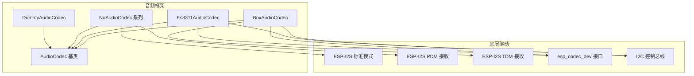
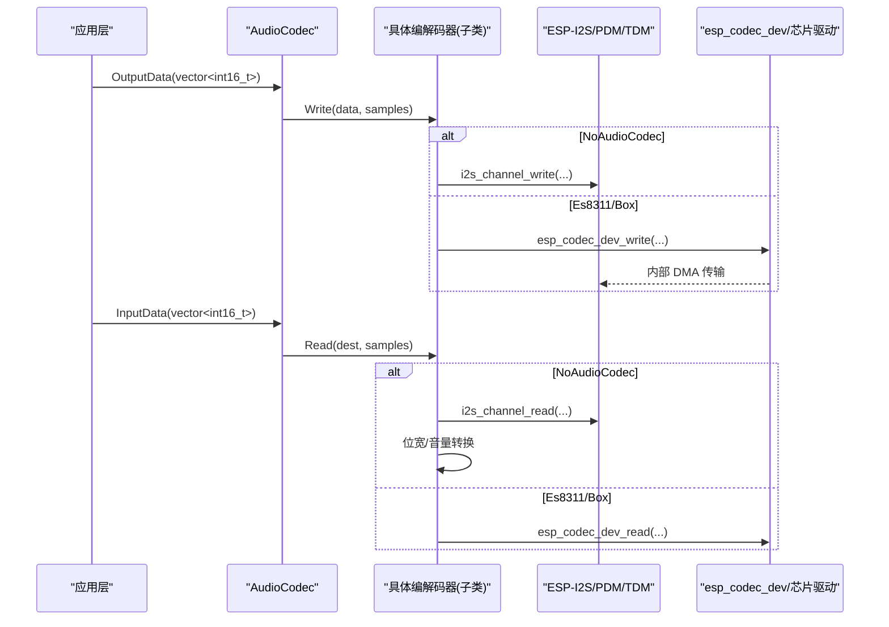
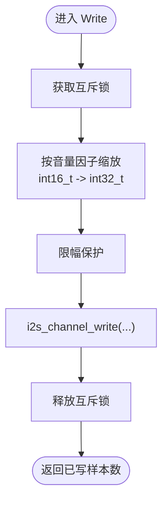
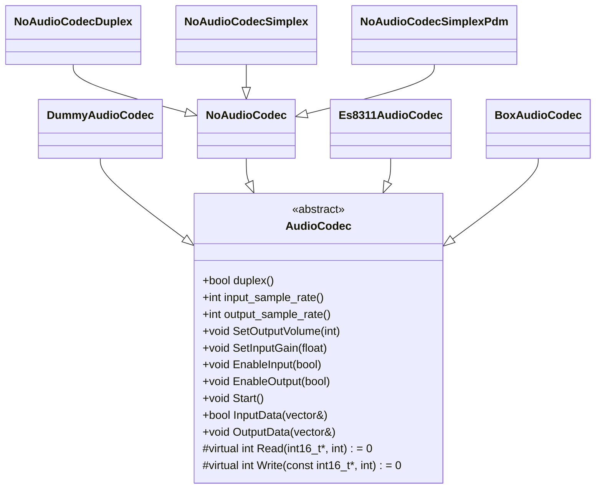

# 自定义编解码器开发

<cite>
**本文引用的文件**   
- [audio_codec.h](file://main\audio\audio_codec.h)
- [audio_codec.cc](file://main\audio\audio_codec.cc)
- [dummy_audio_codec.h](file://main\audio\codecs\dummy_audio_codec.h)
- [dummy_audio_codec.cc](file://main\audio\codecs\dummy_audio_codec.cc)
- [no_audio_codec.h](file://main\audio\codecs\no_audio_codec.h)
- [no_audio_codec.cc](file://main\audio\codecs\no_audio_codec.cc)
- [es8311_audio_codec.h](file://main\audio\codecs\es8311_audio_codec.h)
- [es8311_audio_codec.cc](file://main\audio\codecs\es8311_audio_codec.cc)
- [box_audio_codec.h](file://main\audio\codecs\box_audio_codec.h)
- [box_audio_codec.cc](file://main\audio\codecs\box_audio_codec.cc)
</cite>

## 目录
1. [简介](#简介)
2. [项目结构](#项目结构)
3. [核心组件](#核心组件)
4. [架构总览](#架构总览)
5. [详细组件分析](#详细组件分析)
6. [依赖关系分析](#依赖关系分析)
7. [性能与实时性](#性能与实时性)
8. [测试与集成验证](#测试与集成验证)
9. [故障排查指南](#故障排查指南)
10. [结论](#结论)

## 简介
本指南面向需要在 ESP-IDF 平台上实现自定义音频编解码器的开发者。基于 DummyAudioCodec 和 NoAudioCodec 示例，系统讲解如何继承 AudioCodec 基类、实现 Read/Write 虚函数、配置 I2S 参数、处理音频数据流，并提供完整的开发模板、测试方法与集成验证流程。同时涵盖内存管理、中断处理和实时性保证的最佳实践。

## 项目结构
本项目将音频编解码抽象为统一的 AudioCodec 接口，具体硬件驱动通过不同子类实现：
- 基类 AudioCodec：定义统一 API（Start、EnableInput/Output、SetOutputVolume/SetInputGain、InputData/OutputData）以及纯虚函数 Read/Write。
- DummyAudioCodec：最小实现，用于快速验证上层链路。
- NoAudioCodec：直接操作 I2S/PDM 通道，提供全双工/单工及 PDM 麦克风支持。
- Es8311AudioCodec/BoxAudioCodec：基于 esp_codec_dev 的完整编解码器实现，展示更复杂的设备初始化与多芯片组合。

图表来源
- [audio_codec.h:17-59](file://main\audio\audio_codec.h#L17-L59)
- [dummy_audio_codec.h:6-14](file://main\audio\codecs\dummy_audio_codec.h#L6-L14)
- [no_audio_codec.h:10-41](file://main\audio\codecs\no_audio_codec.h#L10-L41)
- [es8311_audio_codec.h:13-40](file://main\audio\codecs\es8311_audio_codec.h#L13-L40)
- [box_audio_codec.h:11-38](file://main\audio\codecs\box_audio_codec.h#L11-L38)

章节来源
- [audio_codec.h:17-59](file://main\audio\audio_codec.h#L17-L59)
- [audio_codec.cc:17-38](file://main\audio\audio_codec.cc#L17-L38)

## 核心组件
- AudioCodec 基类
  - 对外 API：Start、EnableInput/Output、SetOutputVolume、SetInputGain、InputData/OutputData。
  - 内部状态：双工标志、输入参考标志、采样率、通道数、音量/增益、使能状态等。
  - 纯虚函数：Read/Write，由子类实现具体数据通路。
- DummyAudioCodec
  - 最小化实现，Read/Write 返回 0，便于快速联调上层逻辑。
- NoAudioCodec 系列
  - 直接通过 ESP-I2S 标准模式或 PDM 模式收发数据。
  - 提供 Duplex/Simplex/SimplexPdm 三种形态，适配不同硬件拓扑。
  - 内置音量缩放与位宽转换（32bit→16bit），并采用互斥锁保护并发访问。
- Es8311AudioCodec/BoxAudioCodec
  - 使用 esp_codec_dev 封装复杂编解码器设备，支持 PA 控制、多通道、TDM 输入等高级特性。

章节来源
- [audio_codec.h:17-59](file://main\audio\audio_codec.h#L17-L59)
- [audio_codec.cc:17-68](file://main\audio\audio_codec.cc#L17-L68)
- [dummy_audio_codec.h:6-14](file://main\audio\codecs\dummy_audio_codec.h#L6-L14)
- [dummy_audio_codec.cc:3-21](file://main\audio\codecs\dummy_audio_codec.cc#L3-L21)
- [no_audio_codec.h:10-41](file://main\audio\codecs\no_audio_codec.h#L10-L41)
- [no_audio_codec.cc:19-282](file://main\audio\codecs\no_audio_codec.cc#L19-L282)
- [es8311_audio_codec.h:13-40](file://main\audio\codecs\es8311_audio_codec.h#L13-L40)
- [es8311_audio_codec.cc:7-202](file://main\audio\codecs\es8311_audio_codec.cc#L7-L202)
- [box_audio_codec.h:11-38](file://main\audio\codecs\box_audio_codec.h#L11-L38)
- [box_audio_codec.cc:9-247](file://main\audio\codecs\box_audio_codec.cc#L9-L247)

## 架构总览
下图展示了从应用层到硬件驱动的调用链路与数据流向。上层通过 InputData/OutputData 与 AudioCodec 交互，最终落入子类的 Read/Write 实现；NoAudioCodec 直接读写 I2S/PDM，而 Es8311/Box 则通过 esp_codec_dev 与外部编解码芯片通信。

图表来源
- [audio_codec.cc:17-27](file://main\audio\audio_codec.cc#L17-L27)
- [no_audio_codec.cc:218-282](file://main\audio\codecs\no_audio_codec.cc#L218-L282)
- [es8311_audio_codec.cc:190-202](file://main\audio\codecs\es8311_audio_codec.cc#L190-L202)
- [box_audio_codec.cc:235-247](file://main\audio\codecs\box_audio_codec.cc#L235-L247)

## 详细组件分析

### 继承 AudioCodec 的步骤与要点
- 步骤概览
  1) 新建类继承 AudioCodec，声明覆盖 Read/Write。
  2) 在构造函数中设置 duplex_/input_sample_rate_/output_sample_rate_ 等属性。
  3) 初始化底层通道（I2S/TDM/PDM 或 esp_codec_dev）。
  4) 在 Read/Write 中完成数据搬运与必要的格式转换。
  5) 根据需要覆盖 EnableInput/EnableOutput/SetOutputVolume/SetInputGain。
- 关键注意事项
  - 线程安全：若存在并发访问，需加锁保护（如 std::mutex）。
  - 缓冲区大小：确保传入 samples 与实际读写一致，避免越界。
  - 位宽与对齐：注意 16bit/32bit 转换、左对齐/右对齐、MSB/LSB 顺序。
  - 时钟与帧格式：MCLK/BCLK/WS 频率与分频、slot mask、TDm 槽位。
  - 错误处理：对底层 API 返回值进行校验，必要时记录日志。

章节来源
- [audio_codec.h:17-59](file://main\audio\audio_codec.h#L17-L59)
- [audio_codec.cc:17-68](file://main\audio\audio_codec.cc#L17-L68)

### DummyAudioCodec 最小实现
- 用途：快速验证上层音频链路，不产生实际音频数据。
- 行为：Read/Write 直接返回 0，构造时设置 duplex/input/output 相关属性。
- 适用场景：单元测试、协议联调、无硬件环境下的回归测试。

章节来源
- [dummy_audio_codec.h:6-14](file://main\audio\codecs\dummy_audio_codec.h#L6-L14)
- [dummy_audio_codec.cc:3-21](file://main\audio\codecs\dummy_audio_codec.cc#L3-L21)

### NoAudioCodec 系列（I2S/PDM）
- 设计目标：直接对接 ESP-I2S 标准模式与 PDM 接收，提供灵活引脚与 slot 配置。
- 主要类
  - NoAudioCodecDuplex：同一端口全双工。
  - NoAudioCodecSimplex：独立 TX/RX 通道，支持自定义 slot mask。
  - NoAudioCodecSimplexPdm：TX 为标准 I2S，RX 为 PDM 模式（仅部分 SoC 支持）。
- 数据路径
  - Write：将 int16_t 转换为 int32_t，按音量因子缩放后写入 I2S。
  - Read：从 I2S 读取 int32_t，右移/截断为 int16_t，可选输入增益放大。
  - EnableInput/EnableOutput：启用/禁用对应通道，更新内部使能状态。
- 并发与同步
  - 使用 std::mutex 保护数据接口，避免多线程竞争。
- 典型 I2S 配置项
  - 采样率、MCLK 倍频、数据位宽、slot 模式、GPIO 映射、对齐方式。

图表来源
- [no_audio_codec.cc:218-239](file://main\audio\codecs\no_audio_codec.cc#L218-L239)

章节来源
- [no_audio_codec.h:10-41](file://main\audio\codecs\no_audio_codec.h#L10-L41)
- [no_audio_codec.cc:19-282](file://main\audio\codecs\no_audio_codec.cc#L19-L282)
- [no_audio_codec.cc:368-386](file://main\audio\codecs\no_audio_codec.cc#L368-L386)

### Es8311AudioCodec（单芯片编解码器）
- 特点：基于 esp_codec_dev + I2C 控制，支持 PA 引脚控制、MCLK 选择、立体声输出。
- 初始化流程
  - 创建 I2S 全双工通道。
  - 构建 data_if/ctrl_if/gpio_if，实例化 es8311 codec。
  - 按需打开/关闭 esp_codec_dev，动态设置输入增益与输出音量。
- 数据路径
  - Read/Write 直接调用 esp_codec_dev_read/write，无需额外位宽转换。
- 适用场景：需要精细控制 DAC/ADC 参数、PA 开关、低延迟播放的设备。

章节来源
- [es8311_audio_codec.h:13-40](file://main\audio\codecs\es8311_audio_codec.h#L13-L40)
- [es8311_audio_codec.cc:7-202](file://main\audio\codecs\es8311_audio_codec.cc#L7-L202)

### BoxAudioCodec（多芯片组合，含 TDM 输入）
- 特点：输出 ES8311（DAC），输入 ES7210（MEMS 阵列麦克风），支持 TDM 多通道输入与回声消除参考通道。
- 初始化流程
  - 分别创建 output_dev 与 input_dev，绑定各自 codec_if 与 data_if。
  - RX 使用 TDM 模式，配置多槽位以容纳多路 MIC。
- 数据路径
  - Read/Write 通过 esp_codec_dev 读写，输入可配置通道掩码与增益。
- 适用场景：高端语音终端、带参考通道的 AEC 方案。

章节来源
- [box_audio_codec.h:11-38](file://main\audio\codecs\box_audio_codec.h#L11-L38)
- [box_audio_codec.cc:9-247](file://main\audio\codecs\box_audio_codec.cc#L9-L247)

## 依赖关系分析
- 耦合与内聚
  - AudioCodec 作为稳定抽象，子类高内聚地封装各自硬件细节。
  - NoAudioCodec 与 ESP-I2S 强耦合；Es8311/Box 与 esp_codec_dev 强耦合。
- 外部依赖
  - ESP-IDF I2S/PDM/TDM 驱动。
  - esp_codec_dev 及其默认接口（I2C/GPIO/I2S）。
- 潜在循环依赖
  - 当前未见循环引用，AudioCodec 被各子类反向依赖。

图表来源
- [audio_codec.h:17-59](file://main\audio\audio_codec.h#L17-L59)
- [dummy_audio_codec.h:6-14](file://main\audio\codecs\dummy_audio_codec.h#L6-L14)
- [no_audio_codec.h:10-41](file://main\audio\codecs\no_audio_codec.h#L10-L41)
- [es8311_audio_codec.h:13-40](file://main\audio\codecs\es8311_audio_codec.h#L13-L40)
- [box_audio_codec.h:11-38](file://main\audio\codecs\box_audio_codec.h#L11-L38)

章节来源
- [audio_codec.h:17-59](file://main\audio\audio_codec.h#L17-L59)

## 性能与实时性
- 内存管理
  - 优先使用栈上固定大小缓冲或在高频路径避免频繁堆分配。
  - NoAudioCodec::Write 中临时 vector 可在高频路径外预分配或使用环形缓冲减少分配开销。
- 中断与 DMA
  - ESP-I2S 使用 DMA 传输，合理设置 DMA_DESC_NUM/DMA_FRAME_NUM 以降低 CPU 占用。
  - 避免在 ISR 中进行耗时操作，所有数据处理应在任务上下文完成。
- 实时性保证
  - 使用 portMAX_DELAY 或短超时平衡吞吐与时延。
  - 对 Read/Write 增加边界检查与限幅，防止溢出导致卡顿。
  - 对于 PDM 模式，确认 SoC 支持并正确配置位宽与通道掩码。
- 音量与增益
  - 音量缩放建议在线性域或幂律域进行，避免削波失真。
  - 输入增益放大后进行限幅，防止溢出。

[本节为通用指导，不直接分析具体文件]

## 测试与集成验证
- 单元测试（无硬件）
  - 使用 DummyAudioCodec 验证上层 InputData/OutputData 调用链与状态机。
  - 模拟异常返回（如 Read 返回 0）验证健壮性。
- 硬件联调（有硬件）
  - 使用 NoAudioCodecSimplex 或 SimplexPdm 进行环路测试：录制一段音频并回放，检测时延与失真。
  - 调整 I2S 参数（采样率、位宽、slot mask）匹配外设手册。
  - 针对 Es8311/Box，验证 PA 控制、输入参考通道、多通道采集。
- 压力与稳定性
  - 长时间运行（如 24h）观察丢包、爆音、CPU 占用。
  - 在高负载下切换 EnableInput/EnableOutput，验证状态一致性。
- 指标建议
  - 端到端时延、抖动、丢帧率、CPU 占用、功耗。

[本节为通用指导，不直接分析具体文件]

## 故障排查指南
- 常见问题
  - 无声/杂音：检查 I2S 引脚映射、时钟分频、slot 模式与对齐。
  - 爆音/削波：检查音量/增益设置与限幅逻辑。
  - 读不到数据：确认 I2S 通道已 enable，超时时间是否过短。
  - PDM 不可用：确认 SoC 支持 PDM RX，且配置位宽为 16bit。
- 定位方法
  - 打印关键路径日志（初始化、enable、read/write 返回值）。
  - 使用示波器/逻辑分析仪观测 BCLK/WS/MCLK 波形。
  - 逐步替换为 DummyAudioCodec 隔离问题范围。

章节来源
- [no_audio_codec.cc:241-256](file://main\audio\codecs\no_audio_codec.cc#L241-L256)
- [no_audio_codec.cc:368-386](file://main\audio\codecs\no_audio_codec.cc#L368-L386)
- [es8311_audio_codec.cc:190-202](file://main\audio\codecs\es8311_audio_codec.cc#L190-L202)
- [box_audio_codec.cc:235-247](file://main\audio\codecs\box_audio_codec.cc#L235-L247)

## 结论
通过继承 AudioCodec 并实现 Read/Write，结合合适的 I2S/PDM/TDM 配置与 esp_codec_dev 封装，可以高效地扩展多种音频编解码器。遵循线程安全、DMA 友好、限幅保护与充分测试的实践，能够在资源受限的嵌入式设备上实现稳定、低时延的音频链路。