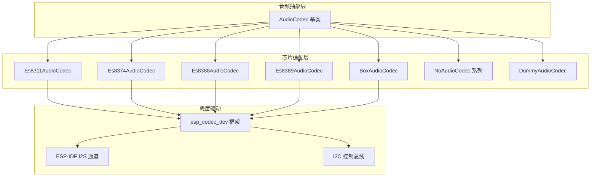
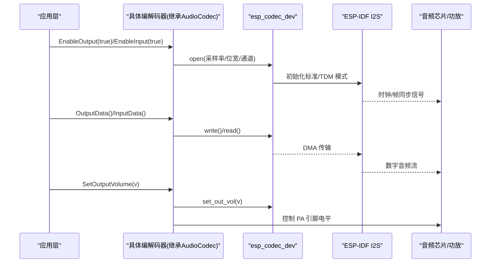
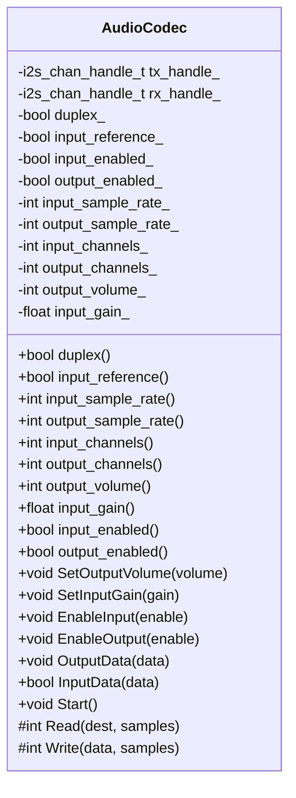
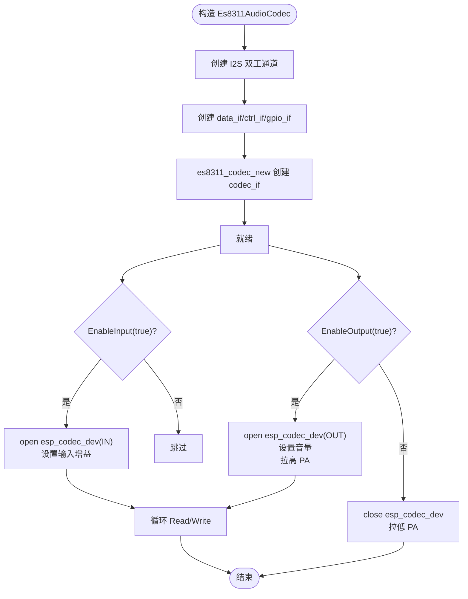
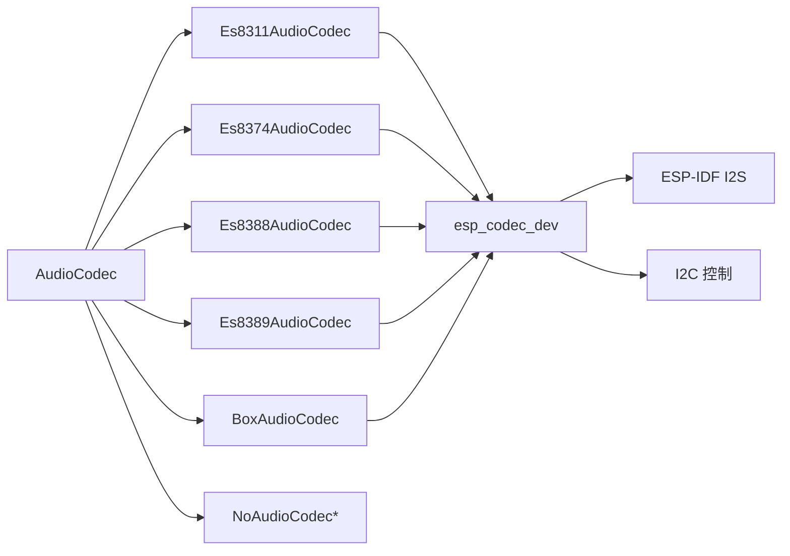

# 音频编解码器集成

<cite>
**本文引用的文件**
- [audio_codec.h](file://main\audio\audio_codec.h)
- [es8311_audio_codec.h](file://main\audio\codecs\es8311_audio_codec.h)
- [es8311_audio_codec.cc](file://main\audio\codecs\es8311_audio_codec.cc)
- [es8374_audio_codec.h](file://main\audio\codecs\es8374_audio_codec.h)
- [es8374_audio_codec.cc](file://main\audio\codecs\es8374_audio_codec.cc)
- [es8388_audio_codec.h](file://main\audio\codecs\es8388_audio_codec.h)
- [es8388_audio_codec.cc](file://main\audio\codecs\es8388_audio_codec.cc)
- [es8389_audio_codec.h](file://main\audio\codecs\es8389_audio_codec.h)
- [es8389_audio_codec.cc](file://main\audio\codecs\es8389_audio_codec.cc)
- [no_audio_codec.h](file://main\audio\codecs\no_audio_codec.h)
- [no_audio_codec.cc](file://main\audio\codecs\no_audio_codec.cc)
- [box_audio_codec.h](file://main\audio\codecs\box_audio_codec.h)
- [box_audio_codec.cc](file://main\audio\codecs\box_audio_codec.cc)
</cite>

## 目录
1. [简介](#简介)
2. [项目结构](#项目结构)
3. [核心组件](#核心组件)
4. [架构总览](#架构总览)
5. [详细组件分析](#详细组件分析)
6. [依赖关系分析](#依赖关系分析)
7. [性能与功耗优化](#性能与功耗优化)
8. [故障排查指南](#故障排查指南)
9. [结论](#结论)
10. [附录：自定义编解码器开发步骤](#附录自定义编解码器开发步骤)

## 简介
本指南面向需要在 ESP32 平台上集成音频编解码器的开发者，围绕 AudioCodec 抽象接口的设计与实现要求，系统讲解 ES8311、ES8374、ES8388、ES8389 等常见音频芯片的适配方法与初始化流程，并提供自定义编解码器的开发步骤。文档同时涵盖 I2S 通信参数配置、数据流处理、音频质量调优、延迟优化与功耗管理实践建议。

## 项目结构
本项目将音频编解码器相关代码集中在 main/audio 目录下：
- 抽象层：AudioCodec 基类定义统一接口与公共状态
- 驱动适配层：各具体芯片（ES8311/ES8374/ES8388/ES8389）及无外部编解码器场景的实现
- 特殊组合：BoxAudioCodec 用于多设备组合（如 ES8311 + ES7210）

图表来源
- [audio_codec.h:17-59](file://main\audio\audio_codec.h#L17-L59)
- [es8311_audio_codec.h:13-40](file://main\audio\codecs\es8311_audio_codec.h#L13-L40)
- [es8374_audio_codec.h:13-39](file://main\audio\codecs\es8374_audio_codec.h#L13-L39)
- [es8388_audio_codec.h:12-38](file://main\audio\codecs\es8388_audio_codec.h#L12-L38)
- [es8389_audio_codec.h:12-38](file://main\audio\codecs\es8389_audio_codec.h#L12-L38)
- [box_audio_codec.h:11-38](file://main\audio\codecs\box_audio_codec.h#L11-L38)
- [no_audio_codec.h:10-41](file://main\audio\codecs\no_audio_codec.h#L10-L41)

章节来源
- [audio_codec.h:17-59](file://main\audio\audio_codec.h#L17-L59)

## 核心组件
- AudioCodec 抽象接口
  - 提供统一的输入输出控制与数据读写接口：EnableInput/EnableOutput、SetOutputVolume、InputData/OutputData、Start 等
  - 内部维护 I2S 收发句柄、双工标志、采样率、通道数、音量与增益等状态
  - 子类需实现 Read/Write 以对接具体硬件或上层库
- 具体编解码器实现
  - Es8311/Es8374/Es8388/Es8389：基于 esp_codec_dev 与 I2S 标准模式，封装芯片特定初始化、PA 控制、输入参考通道支持等
  - NoAudioCodec 系列：直接操作 I2S 通道，适用于 PDM 麦克风或直连 DAC 的场景
  - BoxAudioCodec：组合 ES8311（DAC）与 ES7210（ADC），使用 TDM 接收多路麦克风并可选参考通道
  - DummyAudioCodec：空实现，便于调试与链路验证

章节来源
- [audio_codec.h:17-59](file://main\audio\audio_codec.h#L17-L59)
- [es8311_audio_codec.h:13-40](file://main\audio\codecs\es8311_audio_codec.h#L13-L40)
- [es8374_audio_codec.h:13-39](file://main\audio\codecs\es8374_audio_codec.h#L13-L39)
- [es8388_audio_codec.h:12-38](file://main\audio\codecs\es8388_audio_codec.h#L12-L38)
- [es8389_audio_codec.h:12-38](file://main\audio\codecs\es8389_audio_codec.h#L12-L38)
- [no_audio_codec.h:10-41](file://main\audio\codecs\no_audio_codec.h#L10-L41)
- [box_audio_codec.h:11-38](file://main\audio\codecs\box_audio_codec.h#L11-L38)

## 架构总览
下图展示从应用调用到硬件驱动的完整路径，包括 I2S 与 esp_codec_dev 的交互以及 PA 控制时序。

图表来源
- [es8311_audio_codec.cc:70-98](file://main\audio\codecs\es8311_audio_codec.cc#L70-L98)
- [es8374_audio_codec.cc:139-186](file://main\audio\codecs\es8374_audio_codec.cc#L139-L186)
- [es8388_audio_codec.cc:144-206](file://main\audio\codecs\es8388_audio_codec.cc#L144-L206)
- [es8389_audio_codec.cc:145-192](file://main\audio\codecs\es8389_audio_codec.cc#L145-L192)
- [no_audio_codec.cc:258-282](file://main\audio\codecs\no_audio_codec.cc#L258-L282)

## 详细组件分析

### AudioCodec 抽象接口设计
- 关键职责
  - 统一对外 API：音量设置、输入/输出使能、数据读写、启动
  - 内部状态：双工、参考输入、采样率、通道数、音量与增益
  - 抽象方法：Read/Write 由子类实现，屏蔽底层差异
- 复杂度与扩展性
  - 通过虚函数与成员变量解耦，新增芯片只需实现 Read/Write 与必要的初始化逻辑
  - 线程安全：在关键路径中使用互斥锁保护设备状态切换

图表来源
- [audio_codec.h:17-59](file://main\audio\audio_codec.h#L17-L59)

章节来源
- [audio_codec.h:17-59](file://main\audio\audio_codec.h#L17-L59)

### ES8311 适配
- 初始化要点
  - 创建 I2S 双工通道（标准模式，16bit，立体声）
  - 构建 data_if/ctrl_if/gpio_if，并通过 es8311_codec_new 创建 codec_if
  - 根据输入/输出使能动态打开/关闭 esp_codec_dev，并控制 PA 引脚
- 关键参数
  - 工作模式：双工
  - 采样率：输入=输出
  - 位宽：16bit；通道：单声道（可结合上层做立体声处理）
  - PA 控制：支持反相逻辑
- 典型流程
  - 构造时建立 I2S 与 codec_if
  - EnableInput/EnableOutput 中按需 open/close esp_codec_dev 并设置增益/音量
  - Read/Write 委托给 esp_codec_dev

图表来源
- [es8311_audio_codec.cc:7-59](file://main\audio\codecs\es8311_audio_codec.cc#L7-L59)
- [es8311_audio_codec.cc:70-98](file://main\audio\codecs\es8311_audio_codec.cc#L70-L98)
- [es8311_audio_codec.cc:158-188](file://main\audio\codecs\es8311_audio_codec.cc#L158-L188)
- [es8311_audio_codec.cc:190-202](file://main\audio\codecs\es8311_audio_codec.cc#L190-L202)

章节来源
- [es8311_audio_codec.h:13-40](file://main\audio\codecs\es8311_audio_codec.h#L13-L40)
- [es8311_audio_codec.cc:7-59](file://main\audio\codecs\es8311_audio_codec.cc#L7-L59)
- [es8311_audio_codec.cc:70-98](file://main\audio\codecs\es8311_audio_codec.cc#L70-L98)
- [es8311_audio_codec.cc:158-188](file://main\audio\codecs\es8311_audio_codec.cc#L158-L188)
- [es8311_audio_codec.cc:190-202](file://main\audio\codecs\es8311_audio_codec.cc#L190-L202)

### ES8374 适配
- 初始化要点
  - 分别创建输出与输入 esp_codec_dev 实例，独立 open/close
  - 支持 PA 控制，默认非反相
- 关键参数
  - 工作模式：双工
  - 采样率：输入=输出
  - 位宽：16bit；通道：单声道
- 典型流程
  - 构造阶段完成 I2S 与 codec_if 初始化
  - EnableInput/EnableOutput 中分别 open/close 对应 dev，并设置增益/音量与 PA 电平
  - Read/Write 委托给各自 dev

章节来源
- [es8374_audio_codec.h:13-39](file://main\audio\codecs\es8374_audio_codec.h#L13-L39)
- [es8374_audio_codec.cc:7-62](file://main\audio\codecs\es8374_audio_codec.cc#L7-L62)
- [es8374_audio_codec.cc:134-186](file://main\audio\codecs\es8374_audio_codec.cc#L134-L186)
- [es8374_audio_codec.cc:188-200](file://main\audio\codecs\es8374_audio_codec.cc#L188-L200)

### ES8388 适配
- 初始化要点
  - 支持输入参考通道（回声消除），当启用参考输入时，输入通道数为 2
  - 输出侧对模拟输出音量寄存器进行显式配置，确保默认电平合理
  - 支持 PA 控制
- 关键参数
  - 工作模式：双工
  - 采样率：输入=输出
  - 位宽：16bit；通道：单声道或双声道（参考输入）
- 典型流程
  - 构造阶段完成 I2S 与 codec_if 初始化，并创建独立的 IN/OUT dev
  - EnableInput 中根据是否参考输入选择通道掩码与增益设置方式
  - EnableOutput 中设置数字音量与模拟输出寄存器，控制 PA
  - Read/Write 委托给各自 dev

章节来源
- [es8388_audio_codec.h:12-38](file://main\audio\codecs\es8388_audio_codec.h#L12-L38)
- [es8388_audio_codec.cc:7-71](file://main\audio\codecs\es8388_audio_codec.cc#L7-L71)
- [es8388_audio_codec.cc:139-206](file://main\audio\codecs\es8388_audio_codec.cc#L139-L206)
- [es8388_audio_codec.cc:208-221](file://main\audio\codecs\es8388_audio_codec.cc#L208-L221)

### ES8389 适配
- 初始化要点
  - 与 ES8374 类似，分别创建 IN/OUT dev，支持 PA 控制
- 关键参数
  - 工作模式：双工
  - 采样率：输入=输出
  - 位宽：16bit；通道：单声道
- 典型流程
  - 构造阶段完成 I2S 与 codec_if 初始化
  - EnableInput/EnableOutput 中 open/close 对应 dev，设置增益/音量与 PA 电平
  - Read/Write 委托给各自 dev

章节来源
- [es8389_audio_codec.h:12-38](file://main\audio\codecs\es8389_audio_codec.h#L12-L38)
- [es8389_audio_codec.cc:7-70](file://main\audio\codecs\es8389_audio_codec.cc#L7-L70)
- [es8389_audio_codec.cc:140-192](file://main\audio\codecs\es8389_audio_codec.cc#L140-L192)
- [es8389_audio_codec.cc:194-206](file://main\audio\codecs\es8389_audio_codec.cc#L194-L206)

### NoAudioCodec 系列（直连 I2S/PDM）
- 适用场景
  - 无需外部编解码器，直接通过 I2S 连接 DAC 或 PDM 麦克风
- 主要特性
  - Duplex/Simplex 两种拓扑
  - SimplexPdm 支持 PDM 接收（16bit），并在读取后按增益放大
  - 输出侧内置音量缩放（平方律映射）与限幅保护
- 典型流程
  - 构造阶段创建 I2S 通道并配置标准或 PDM 模式
  - EnableInput/EnableOutput 控制通道使能
  - Read/Write 直接走 i2s_channel_read/write

章节来源
- [no_audio_codec.h:10-41](file://main\audio\codecs\no_audio_codec.h#L10-L41)
- [no_audio_codec.cc:19-76](file://main\audio\codecs\no_audio_codec.cc#L19-L76)
- [no_audio_codec.cc:79-216](file://main\audio\codecs\no_audio_codec.cc#L79-L216)
- [no_audio_codec.cc:218-282](file://main\audio\codecs\no_audio_codec.cc#L218-L282)
- [no_audio_codec.cc:285-387](file://main\audio\codecs\no_audio_codec.cc#L285-L387)

### BoxAudioCodec（ES8311 + ES7210 组合）
- 适用场景
  - 需要多路麦克风阵列与独立 DAC 输出的高端方案
- 关键特性
  - 输出：ES8311（DAC），输入：ES7210（ADC）
  - 发送端使用 I2S 标准模式，接收端使用 TDM 模式以承载多路麦克风
  - 可选参考输入通道（用于 AEC）
- 典型流程
  - 构造阶段分别初始化 OUT/IN 的 codec_if 与 dev
  - EnableInput 中设置 4 通道 TDM 与参考通道掩码，并设置通道增益
  - EnableOutput 中设置数字音量
  - Read/Write 委托给各自 dev

章节来源
- [box_audio_codec.h:11-38](file://main\audio\codecs\box_audio_codec.h#L11-L38)
- [box_audio_codec.cc:9-78](file://main\audio\codecs\box_audio_codec.cc#L9-L78)
- [box_audio_codec.cc:94-182](file://main\audio\codecs\box_audio_codec.cc#L94-L182)
- [box_audio_codec.cc:184-233](file://main\audio\codecs\box_audio_codec.cc#L184-L233)
- [box_audio_codec.cc:235-247](file://main\audio\codecs\box_audio_codec.cc#L235-L247)

## 依赖关系分析
- 组件耦合
  - 所有具体编解码器均依赖 AudioCodec 抽象接口
  - 芯片适配层依赖 esp_codec_dev 与 ESP-IDF I2S 驱动
  - 控制面依赖 I2C 总线访问芯片寄存器
- 潜在风险
  - 不同芯片的 I2S 时序与对齐策略存在差异，需严格匹配
  - 输入参考通道仅在部分芯片支持，需在构造参数中明确
  - PA 控制极性可能因板级设计而异，需正确配置反相标志

图表来源
- [audio_codec.h:17-59](file://main\audio\audio_codec.h#L17-L59)
- [es8311_audio_codec.cc:22-59](file://main\audio\codecs\es8311_audio_codec.cc#L22-L59)
- [es8374_audio_codec.cc:20-62](file://main\audio\codecs\es8374_audio_codec.cc#L20-L62)
- [es8388_audio_codec.cc:20-71](file://main\audio\codecs\es8388_audio_codec.cc#L20-L71)
- [es8389_audio_codec.cc:19-70](file://main\audio\codecs\es8389_audio_codec.cc#L19-L70)
- [box_audio_codec.cc:21-78](file://main\audio\codecs\box_audio_codec.cc#L21-L78)

章节来源
- [audio_codec.h:17-59](file://main\audio\audio_codec.h#L17-L59)

## 性能与功耗优化
- 延迟优化
  - 调整 DMA 描述符与帧数量，平衡吞吐与时延（例如 AUDIO_CODEC_DMA_DESC_NUM/AUDIO_CODEC_DMA_FRAME_NUM）
  - 减少不必要的状态切换，避免频繁 open/close esp_codec_dev
  - 使用合适的 MCLK 倍频（如 256x）以降低抖动
- 音频质量调优
  - 合理设置输入增益与输出音量，避免削波与底噪过大
  - 对于 ES8388，注意模拟输出寄存器默认值，必要时显式设置为 0dB
  - 参考输入开启时，确保通道掩码与增益配置一致
- 功耗管理
  - 在不使用时关闭输入/输出通道，释放 esp_codec_dev 资源
  - 控制 PA 引脚电平，避免空闲时功放耗电
  - 在无外部编解码器场景下，仅启用必要 I2S 通道

[本节为通用指导，不直接分析具体文件]

## 故障排查指南
- 常见问题定位
  - I2S 初始化失败：检查 GPIO 分配、MCLK/BCLK/WS/DIN/DOUT 连线与极性与芯片手册一致
  - 无声或爆音：确认采样率、位宽、通道数与对齐策略一致；检查 PA 控制极性
  - 输入噪声大：调整输入增益，确认参考输入通道掩码与增益设置
  - 功耗异常：确认未使用时已关闭通道与 PA
- 日志与断言
  - 关注构造与状态切换处的错误码与日志输出
  - 对关键指针与返回值进行断言，快速定位初始化失败点

章节来源
- [es8311_audio_codec.cc:54-58](file://main\audio\codecs\es8311_audio_codec.cc#L54-L58)
- [es8374_audio_codec.cc:64-74](file://main\audio\codecs\es8374_audio_codec.cc#L64-L74)
- [es8388_audio_codec.cc:73-83](file://main\audio\codecs\es8388_audio_codec.cc#L73-L83)
- [es8389_audio_codec.cc:72-82](file://main\audio\codecs\es8389_audio_codec.cc#L72-L82)
- [no_audio_codec.cc:368-386](file://main\audio\codecs\no_audio_codec.cc#L368-L386)

## 结论
通过 AudioCodec 抽象接口与 esp_codec_dev 框架的结合，本项目实现了多种音频编解码器的统一接入。ES8311/ES8374/ES8388/ES8389 等芯片的适配遵循一致的初始化与数据流模型，配合 I2S 与 I2C 控制总线，能够灵活覆盖从简单直连到复杂多麦克风的场景。遵循本文档的配置与优化建议，可在保证音质与稳定性的前提下，有效降低延迟与功耗。

[本节为总结性内容，不直接分析具体文件]

## 附录：自定义编解码器开发步骤
- 继承 AudioCodec 基类
  - 声明类并实现 Read/Write 虚函数
  - 根据需要覆写 SetOutputVolume、EnableInput、EnableOutput 等方法
- 配置 I2S 通信参数
  - 创建 I2S 通道（标准或 TDM/PDM），设置采样率、位宽、通道数、对齐策略与 GPIO
  - 若使用外部编解码器，创建 data_if/ctrl_if/gpio_if，并调用对应 codec_new 接口
- 实现音频数据流处理
  - 在 Read/Write 中调用 esp_codec_dev_read/write 或直接 i2s_channel_read/write
  - 处理音量与增益，避免溢出与削波
- 配置芯片特定参数
  - 依据芯片手册设置寄存器（如模拟输出音量、输入增益、参考通道掩码等）
  - 控制 PA 引脚电平，支持反相逻辑
- 测试与调优
  - 验证双工/单工、参考输入、静音与唤醒行为
  - 调整 DMA 参数与增益，平衡延迟、音质与功耗

章节来源
- [audio_codec.h:17-59](file://main\audio\audio_codec.h#L17-L59)
- [es8311_audio_codec.cc:7-59](file://main\audio\codecs\es8311_audio_codec.cc#L7-L59)
- [es8374_audio_codec.cc:7-62](file://main\audio\codecs\es8374_audio_codec.cc#L7-L62)
- [es8388_audio_codec.cc:7-71](file://main\audio\codecs\es8388_audio_codec.cc#L7-L71)
- [es8389_audio_codec.cc:7-70](file://main\audio\codecs\es8389_audio_codec.cc#L7-L70)
- [no_audio_codec.cc:19-76](file://main\audio\codecs\no_audio_codec.cc#L19-L76)
- [box_audio_codec.cc:9-78](file://main\audio\codecs\box_audio_codec.cc#L9-L78)