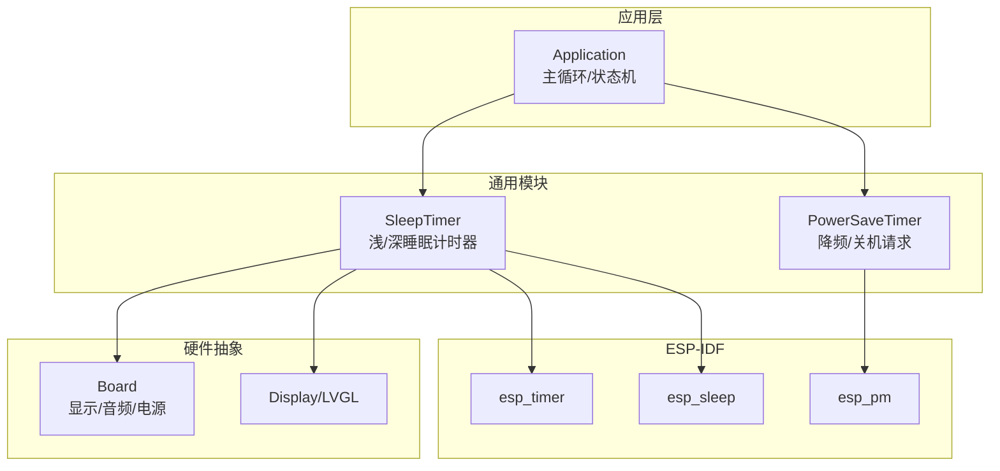
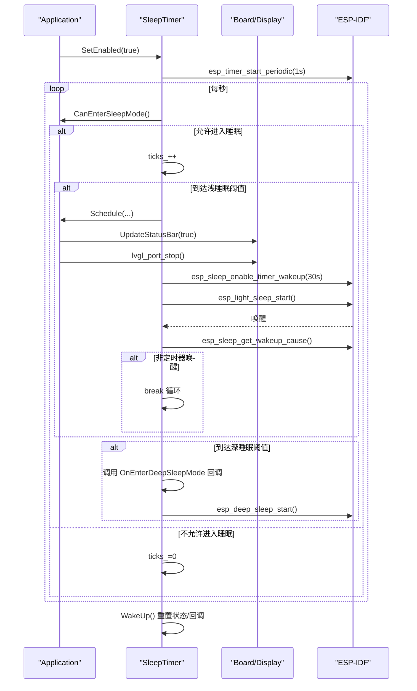
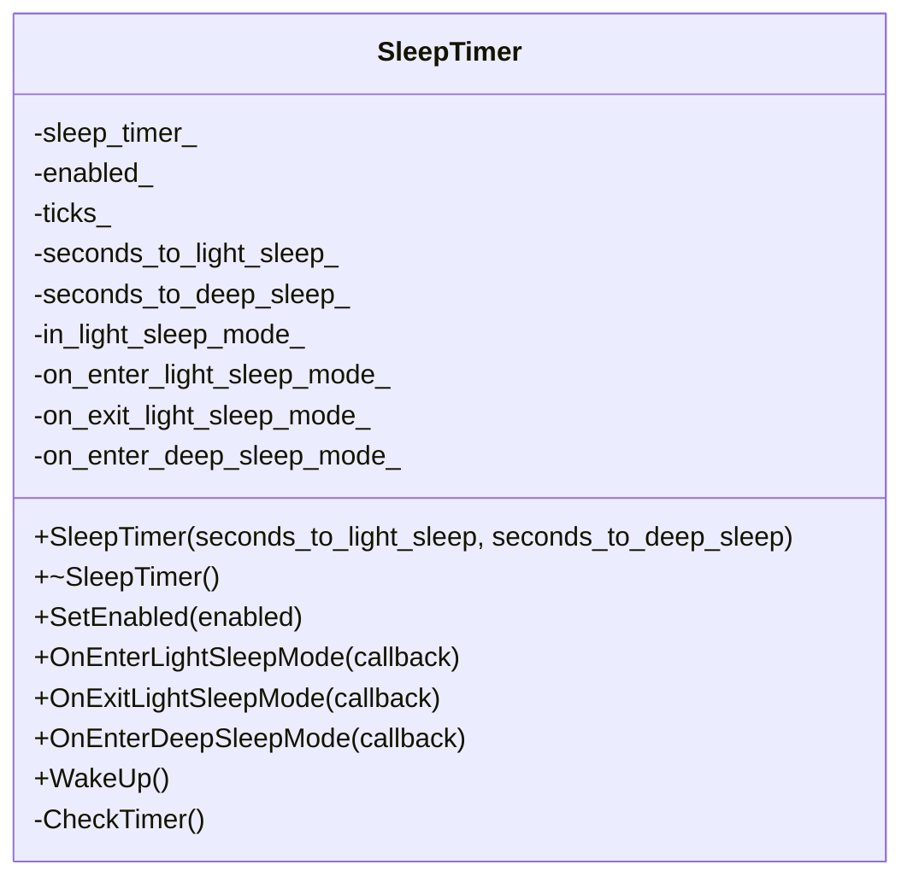
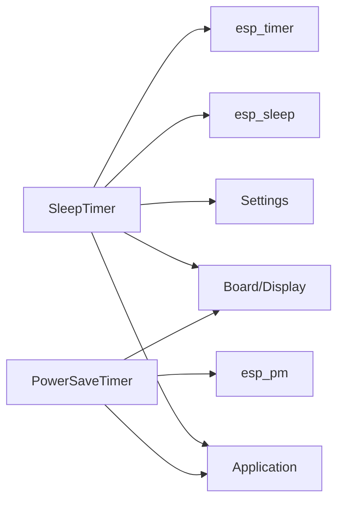

# 休眠计时器

<cite>
**本文引用的文件**
- [sleep_timer.h](file://main/boards/common/sleep_timer.h)
- [sleep_timer.cc](file://main/boards/common/sleep_timer.cc)
- [power_save_timer.cc](file://main/boards/common/power_save_timer.cc)
- [application.h](file://main/application.h)
- [application.cc](file://main/application.cc)
- [esp_spot_board.cc](file://main/boards/esp-spot/esp_spot_board.cc)
- [jiuchuan_dev_board.cc](file://main/boards/jiuchuan-s3/jiuchuan_dev_board.cc)
</cite>

## 目录
1. [简介](#简介)
2. [项目结构](#项目结构)
3. [核心组件](#核心组件)
4. [架构总览](#架构总览)
5. [详细组件分析](#详细组件分析)
6. [依赖关系分析](#依赖关系分析)
7. [性能与功耗考量](#性能与功耗考量)
8. [故障排查指南](#故障排查指南)
9. [结论](#结论)
10. [附录：唤醒源配置与数据持久化](#附录唤醒源配置与数据持久化)

## 简介
本技术文档聚焦于“休眠计时器”的设计与实现，围绕 SleepTimer 类展开，系统阐述其在 ESP32 平台上的浅睡眠（Light Sleep）与深度睡眠（Deep Sleep）控制、唤醒源配置、状态恢复逻辑。同时覆盖休眠计时器的启动流程、定时触发机制、唤醒事件处理；说明不同唤醒源的配置方法（GPIO 中断、触摸唤醒、定时器唤醒等）；给出休眠模式选择策略、功耗对比分析、数据持久化方案；并提供完整的代码示例路径以展示如何实现自定义休眠逻辑、唤醒后的状态恢复和数据保存；最后包含调试技巧与功耗测量方法。

## 项目结构
与休眠计时器相关的核心代码位于 boards/common 目录下，SleepTimer 提供基于 esp_timer 的周期性检查，结合 Application 的状态判断与 Board/Display/LVGL 资源管理，完成进入浅睡眠与深度睡眠的流程。PowerSaveTimer 作为补充，用于更通用的降频与关机请求场景。部分板级实现展示了 GPIO 外部中断唤醒与 IMU 中断唤醒等用法。

图表来源
- [sleep_timer.cc:14-27](file://main/boards/common/sleep_timer.cc#L14-L27)
- [sleep_timer.cc:34-52](file://main/boards/common/sleep_timer.cc#L34-L52)
- [sleep_timer.cc:66-123](file://main/boards/common/sleep_timer.cc#L66-L123)
- [power_save_timer.cc:10-23](file://main/boards/common/power_save_timer.cc#L10-L23)
- [application.cc:165-259](file://main/application.cc#L165-L259)

章节来源
- [sleep_timer.h:1-33](file://main/boards/common/sleep_timer.h#L1-L33)
- [sleep_timer.cc:1-134](file://main/boards/common/sleep_timer.cc#L1-L134)
- [power_save_timer.cc:1-132](file://main/boards/common/power_save_timer.cc#L1-L132)
- [application.h:43-176](file://main/application.h#L43-L176)
- [application.cc:165-259](file://main/application.cc#L165-L259)

## 核心组件
- SleepTimer：基于 esp_timer 周期任务，按秒计数，达到阈值后进入浅睡眠或深度睡眠；支持回调钩子，便于在入/出睡眠前后执行资源准备与恢复。
- PowerSaveTimer：通用省电计时器，可配置 CPU 最大频率、进入省电模式时间、关机请求时间，配合 esp_pm 进行动态调频与轻睡开关。
- Application：提供 CanEnterSleepMode 能力判断与 Schedule 调度接口，确保在合适的时机进入睡眠并安全地恢复 UI/音频等资源。
- 板级示例：通过 GPIO 外部中断、IMU 中断等作为唤醒源，演示如何配置 ext0/ext1 唤醒并在唤醒后恢复交互。

章节来源
- [sleep_timer.h:8-32](file://main/boards/common/sleep_timer.h#L8-L32)
- [sleep_timer.cc:14-27](file://main/boards/common/sleep_timer.cc#L14-L27)
- [power_save_timer.cc:10-23](file://main/boards/common/power_save_timer.cc#L10-L23)
- [application.h:110](file://main/application.h#L110)
- [application.cc:165-259](file://main/application.cc#L165-L259)

## 架构总览
SleepTimer 的工作流由三个关键阶段组成：启动与使能、定时检查与决策、进入睡眠与唤醒恢复。其内部维护 ticks_ 计数器，每 1s 递增一次；当达到浅睡眠阈值时，先暂停唤醒词检测、更新 UI 状态、停止 LVGL 渲染、配置唤醒源（当前为定时器），然后调用 esp_light_sleep_start 进入浅睡眠；若达到深睡眠阈值则调用 esp_deep_sleep_start 进入深度睡眠。唤醒后根据唤醒原因决定是否退出浅睡眠循环并调用 WakeUp 重置状态。

图表来源
- [sleep_timer.cc:34-52](file://main/boards/common/sleep_timer.cc#L34-L52)
- [sleep_timer.cc:66-123](file://main/boards/common/sleep_timer.cc#L66-L123)
- [application.cc:165-259](file://main/application.cc#L165-L259)

## 详细组件分析

### SleepTimer 设计与实现
- 构造与生命周期
  - 使用 esp_timer_create 创建周期任务，回调中调用 CheckTimer。
  - 析构时停止并删除定时器，避免泄漏。
- 使能与禁用
  - SetEnabled 读取 Settings 中的 sleep_mode 开关，若关闭则直接返回。
  - 启用时复位 ticks_ 并启动 1s 周期任务；禁用时停止任务并调用 WakeUp 清理状态。
- 定时检查与睡眠决策
  - CheckTimer 首先通过 Application::CanEnterSleepMode 判断是否允许进入睡眠。
  - 到达浅睡眠阈值时：
    - 记录 in_light_sleep_mode_ 标志，调用 OnEnterLightSleepMode 回调。
    - 临时关闭唤醒词检测，避免误唤醒。
    - 通过 Application::Schedule 在主线程中执行：刷新状态栏、停止 LVGL、配置唤醒源（当前为定时器）、进入浅睡眠。
    - 唤醒后获取唤醒原因，若非定时器唤醒则跳出循环，随后调用 WakeUp 清理。
  - 到达深睡眠阈值时：
    - 调用 OnEnterDeepSleepMode 回调，随后调用 esp_deep_sleep_start。
- 唤醒恢复
  - WakeUp 重置 ticks_，若处于浅睡眠状态则清除标志并调用 OnExitLightSleepMode 回调。

图表来源
- [sleep_timer.h:8-32](file://main/boards/common/sleep_timer.h#L8-L32)
- [sleep_timer.cc:14-27](file://main/boards/common/sleep_timer.cc#L14-L27)
- [sleep_timer.cc:34-52](file://main/boards/common/sleep_timer.cc#L34-L52)
- [sleep_timer.cc:66-123](file://main/boards/common/sleep_timer.cc#L66-L123)
- [sleep_timer.cc:125-133](file://main/boards/common/sleep_timer.cc#L125-L133)

章节来源
- [sleep_timer.h:1-33](file://main/boards/common/sleep_timer.h#L1-L33)
- [sleep_timer.cc:1-134](file://main/boards/common/sleep_timer.cc#L1-L134)

### PowerSaveTimer 与 SleepTimer 的差异
- PowerSaveTimer 侧重 CPU 动态调频与可选关机请求，不直接调用 esp_light_sleep_start/esp_deep_sleep_start，而是通过 esp_pm_configure 调整最大频率与轻睡开关，并在达到关机阈值时触发 on_shutdown_request_ 回调，由上层决定具体行为（例如设置 RTC GPIO 拉低以切断电源）。
- SleepTimer 直接驱动浅/深睡眠，适合需要明确进入低功耗状态的场景。

章节来源
- [power_save_timer.cc:10-23](file://main/boards/common/power_save_timer.cc#L10-L23)
- [power_save_timer.cc:79-132](file://main/boards/common/power_save_timer.cc#L79-L132)

### 唤醒源配置与示例
- 定时器唤醒（浅睡眠）
  - 在 SleepTimer 进入浅睡眠前配置定时器唤醒源，唤醒后读取唤醒原因，若非定时器唤醒则提前退出浅睡眠循环。
- GPIO 外部中断唤醒（深睡眠）
  - 示例：在 jiuchuan_dev_board.cc 中，通过 esp_sleep_enable_ext0_wakeup 配置按键边沿唤醒，并在唤醒后重新配置唤醒源以便再次进入深睡眠。
- 多 GPIO 外部中断唤醒（深睡眠）
  - 示例：在 esp_spot_board.cc 中，通过 esp_sleep_enable_ext1_wakeup 配置多个 GPIO（按键与 IMU 中断）组合唤醒。
- 触摸唤醒（概念性说明）
  - 可通过 esp_sleep_enable_touchpad_wakeup 配置触摸唤醒，适用于带触摸屏的设备。该功能未在仓库中直接出现，但属于 ESP-IDF 标准能力，可在上层按需集成。

章节来源
- [sleep_timer.cc:95-106](file://main/boards/common/sleep_timer.cc#L95-L106)
- [jiuchuan_dev_board.cc:117-144](file://main/boards/jiuchuan-s3/jiuchuan_dev_board.cc#L117-L144)
- [esp_spot_board.cc:340-343](file://main/boards/esp-spot/esp_spot_board.cc#L340-L343)

## 依赖关系分析
- SleepTimer 依赖：
  - Application：CanEnterSleepMode 与 Schedule 调度。
  - Board/Display：UI 状态更新与 LVGL 端口控制。
  - Settings：读取 sleep_mode 开关。
  - ESP-IDF：esp_timer、esp_sleep、LVGL 端口。
- PowerSaveTimer 依赖：
  - Application：AudioService 唤醒词检测启停。
  - Board：音频编解码器输入开关。
  - ESP-IDF：esp_pm 动态电源管理。

图表来源
- [sleep_timer.cc:1-10](file://main/boards/common/sleep_timer.cc#L1-L10)
- [power_save_timer.cc:1-6](file://main/boards/common/power_save_timer.cc#L1-L6)

章节来源
- [sleep_timer.cc:1-10](file://main/boards/common/sleep_timer.cc#L1-L10)
- [power_save_timer.cc:1-6](file://main/boards/common/power_save_timer.cc#L1-L6)

## 性能与功耗考量
- 浅睡眠 vs 深睡眠
  - 浅睡眠（Light Sleep）：CPU 时钟降低，外设部分保留，唤醒速度快，适合短时等待与快速响应场景。
  - 深睡眠（Deep Sleep）：CPU 与大部分外设断电，仅 RTC 与少量 GPIO 保持工作，功耗最低，唤醒需完整重启初始化。
- 动态调频（PowerSaveTimer）
  - 通过 esp_pm 降低 CPU 最大频率，减少运行功耗，适合长时间待机但不需要完全断电的场景。
- 唤醒源选择
  - 定时器唤醒：适合固定间隔唤醒，如心跳上报、轮询传感器。
  - GPIO 外部中断：适合按键、传感器信号触发。
  - 触摸唤醒：适合人机交互设备，提高用户体验。
- 资源管理
  - 进入睡眠前停止 LVGL 渲染、关闭音频输入、暂停唤醒词检测，避免不必要的功耗与误唤醒。
  - 唤醒后恢复 UI 与音频，确保交互连续性。

[本节为通用指导，不直接分析具体文件]

## 故障排查指南
- 无法进入睡眠
  - 检查 Application::CanEnterSleepMode 返回值，确认无活跃对话或网络操作。
  - 确认 Settings 中 sleep_mode 未被关闭。
- 浅睡眠后立即唤醒
  - 检查唤醒原因是否为定时器；若非定时器唤醒，应处理业务逻辑并退出浅睡眠循环。
- 深睡眠无法唤醒
  - 确认唤醒源已正确配置（ext0/ext1/timer/touch），且引脚电平/上拉配置符合预期。
- 唤醒后状态不一致
  - 确保在 OnEnterDeepSleepMode 回调中保存必要状态到 NVS/RTC 内存，并在启动流程中恢复。

章节来源
- [sleep_timer.cc:66-123](file://main/boards/common/sleep_timer.cc#L66-L123)
- [sleep_timer.cc:34-52](file://main/boards/common/sleep_timer.cc#L34-L52)
- [jiuchuan_dev_board.cc:117-144](file://main/boards/jiuchuan-s3/jiuchuan_dev_board.cc#L117-L144)

## 结论
SleepTimer 提供了简洁可靠的浅/深睡眠控制能力，结合 Application 的状态管理与 Board/Display 的资源协调，能够在保证用户体验的同时显著降低功耗。PowerSaveTimer 作为补充，适用于需要动态调频与关机请求的场景。通过合理选择唤醒源与完善的数据持久化策略，可实现稳定高效的低功耗设备。

[本节为总结，不直接分析具体文件]

## 附录：唤醒源配置与数据持久化

### 唤醒源配置要点
- 定时器唤醒（浅睡眠）
  - 在进入浅睡眠前调用 esp_sleep_enable_timer_wakeup，唤醒后通过 esp_sleep_get_wakeup_cause 判断原因。
- GPIO 外部中断唤醒（深睡眠）
  - ext0：单 GPIO 边沿触发；ext1：多 GPIO 组合触发。需在唤醒后重新配置唤醒源以便再次进入深睡眠。
- 触摸唤醒（概念性说明）
  - 可使用 esp_sleep_enable_touchpad_wakeup 配置触摸唤醒，适用于带触摸屏的设备。

章节来源
- [sleep_timer.cc:95-106](file://main/boards/common/sleep_timer.cc#L95-L106)
- [jiuchuan_dev_board.cc:117-144](file://main/boards/jiuchuan-s3/jiuchuan_dev_board.cc#L117-L144)
- [esp_spot_board.cc:340-343](file://main/boards/esp-spot/esp_spot_board.cc#L340-L343)

### 数据持久化方案
- NVS（非易失存储）
  - 在 OnEnterDeepSleepMode 回调中将关键状态写入 NVS，确保深睡眠后重启可恢复。
- RTC 内存
  - 对于极小状态（如标志位、计数器），可写入 RTC 内存以减少 NVS 写入次数。
- 文件系统（SPIFFS/LittleFS）
  - 大量日志或结构化数据建议落盘，注意磨损均衡与写入频率。

[本节为通用指导，不直接分析具体文件]

### 自定义休眠逻辑示例（代码片段路径）
- 浅睡眠流程与唤醒原因处理
  - [sleep_timer.cc:88-109](file://main/boards/common/sleep_timer.cc#L88-L109)
- 深睡眠入口与回调
  - [sleep_timer.cc:116-122](file://main/boards/common/sleep_timer.cc#L116-L122)
- GPIO 外部中断唤醒与重配
  - [jiuchuan_dev_board.cc:117-144](file://main/boards/jiuchuan-s3/jiuchuan_dev_board.cc#L117-L144)
- 多 GPIO 外部中断唤醒
  - [esp_spot_board.cc:340-343](file://main/boards/esp-spot/esp_spot_board.cc#L340-L343)

### 调试技巧与功耗测量
- 调试技巧
  - 使用 ESP_LOGI 打印唤醒原因与状态变化，定位异常唤醒路径。
  - 在 OnEnter/OnExit 回调中增加 UI 提示，便于观察进入/退出睡眠的时机。
- 功耗测量
  - 使用电流表或功耗分析仪测量浅/深睡眠期间的平均电流。
  - 对比不同唤醒源下的唤醒时间与功耗，优化唤醒策略。

[本节为通用指导，不直接分析具体文件]