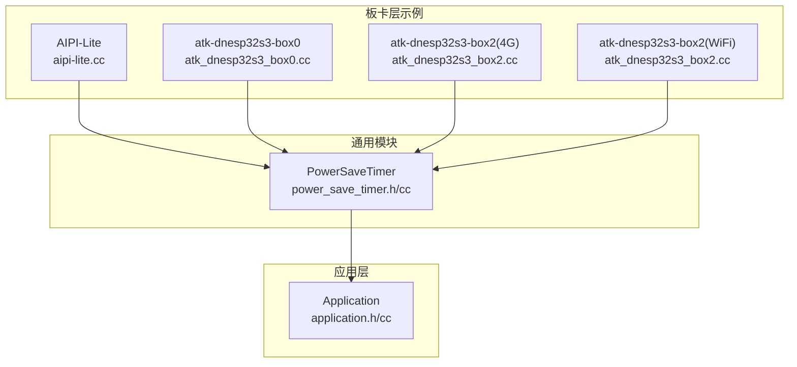
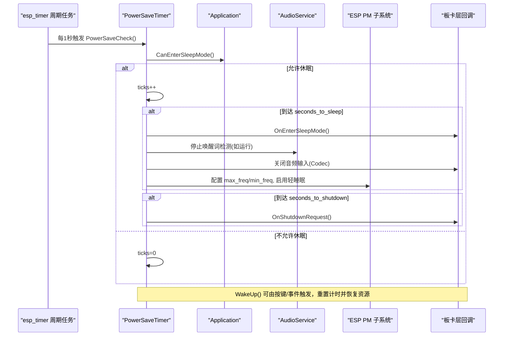
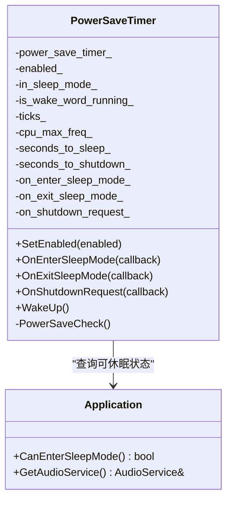
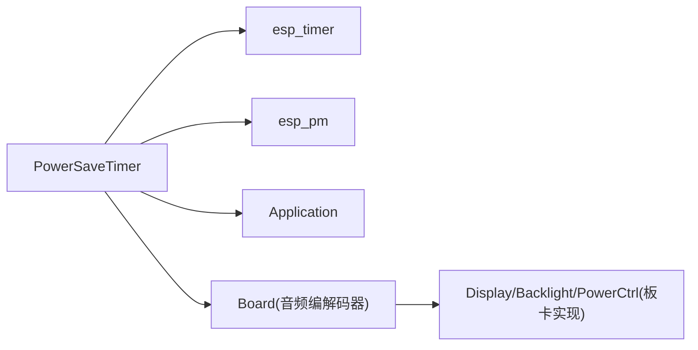

# 低功耗定时器

<cite>
**本文引用的文件**   
- [power_save_timer.h](file://main/boards/common/power_save_timer.h)
- [power_save_timer.cc](file://main/boards/common/power_save_timer.cc)
- [aipi-lite.cc](file://main/boards/aipi-lite/aipi-lite.cc)
- [atk_dnesp32s3_box0.cc](file://main/boards/atk-dnesp32s3-box0/atk_dnesp32s3_box0.cc)
- [atk_dnesp32s3_box2_4g.cc](file://main/boards/atk-dnesp32s3-box2-4g/atk_dnesp32s3_box2.cc)
- [atk_dnesp32s3_box2_wifi.cc](file://main/boards/atk-dnesp32s3-box2-wifi/atk_dnesp32s3_box2.cc)
- [application.h](file://main/application.h)
- [application.cc](file://main/application.cc)
</cite>

## 目录
1. [简介](#简介)
2. [项目结构](#项目结构)
3. [核心组件](#核心组件)
4. [架构总览](#架构总览)
5. [详细组件分析](#详细组件分析)
6. [依赖关系分析](#依赖关系分析)
7. [性能与功耗优化](#性能与功耗优化)
8. [故障排查指南](#故障排查指南)
9. [结论](#结论)
10. [附录：集成示例与最佳实践](#附录集成示例与最佳实践)

## 简介
本技术文档围绕 PowerSaveTimer 类展开，系统阐述其设计目标、工作原理与实现细节。PowerSaveTimer 用于在设备空闲时自动进入“省电模式”，通过降低 CPU 频率、启用轻睡眠、关闭音频输入与唤醒词检测等手段降低功耗；同时提供回调机制以对接显示背光、电源管理、关机流程等上层逻辑。文档还涵盖构造函数参数配置、回调函数使用方法、唤醒源与唤醒策略、错误处理与性能调优建议，并给出多块板卡的集成示例路径。

## 项目结构
PowerSaveTimer 位于通用模块中，被多个具体板卡工程复用。其职责边界清晰：内部基于 esp_timer 周期轮询，结合 Application 的“可休眠”状态判断，驱动 PMIC/PM 子系统与音频服务进行资源降配；对外暴露 SetEnabled/WakeUp 以及三类回调接口，供板卡层接入 UI 与电源控制。

图表来源
- [power_save_timer.h:1-35](file://main/boards/common/power_save_timer.h#L1-L35)
- [power_save_timer.cc:1-133](file://main/boards/common/power_save_timer.cc#L1-L133)
- [aipi-lite.cc:46-65](file://main/boards/aipi-lite/aipi-lite.cc#L46-L65)
- [atk_dnesp32s3_box0.cc:133-163](file://main/boards/atk-dnesp32s3-box0/atk_dnesp32s3_box0.cc#L133-L163)
- [atk_dnesp32s3_box2_4g.cc:95-117](file://main/boards/atk-dnesp32s3-box2-4g/atk_dnesp32s3_box2.cc#L95-L117)
- [atk_dnesp32s3_box2_wifi.cc:95-117](file://main/boards/atk-dnesp32s3-box2-wifi/atk_dnesp32s3_box2.cc#L95-L117)

章节来源
- [power_save_timer.h:1-35](file://main/boards/common/power_save_timer.h#L1-L35)
- [power_save_timer.cc:1-133](file://main/boards/common/power_save_timer.cc#L1-L133)

## 核心组件
- PowerSaveTimer：基于 esp_timer 的周期性检查器，负责：
  - 根据 ticks 计数与 seconds_to_sleep 触发进入省电模式
  - 若设置 seconds_to_shutdown，则在达到阈值后触发关机请求回调
  - 进入/退出省电模式时调用对应回调
  - 可选地调整 CPU 最大频率、开启轻睡眠、关闭音频输入与唤醒词检测
- Application：提供 CanEnterSleepMode 判定，决定当前是否允许进入省电模式
- 板卡层：在 OnEnterSleepMode/OnExitSleepMode/OnShutdownRequest 中执行显示背光、电源控制、深度休眠等操作

章节来源
- [power_save_timer.h:8-34](file://main/boards/common/power_save_timer.h#L8-L34)
- [power_save_timer.cc:10-104](file://main/boards/common/power_save_timer.cc#L10-L104)
- [application.h:110](file://main/application.h#L110)

## 架构总览
PowerSaveTimer 的工作流由定时任务驱动，结合 Application 的状态机与音频服务，形成“检测—降配—恢复”的闭环。

图表来源
- [power_save_timer.cc:30-104](file://main/boards/common/power_save_timer.cc#L30-L104)
- [power_save_timer.cc:106-132](file://main/boards/common/power_save_timer.cc#L106-L132)
- [application.h:110](file://main/application.h#L110)

## 详细组件分析

### PowerSaveTimer 类设计与实现
- 构造与析构
  - 构造：创建 esp_timer，周期为 1 秒（微秒单位），回调指向 PowerSaveCheck
  - 析构：停止并删除 timer
- 生命周期控制
  - SetEnabled：读取持久化设置 sleep_mode，决定是否启动周期任务；禁用时立即 WakeUp
  - WakeUp：重置 ticks，若处于省电模式则恢复 CPU 频率、关闭轻睡眠、恢复唤醒词检测与回调
- 省电决策
  - PowerSaveCheck：先校验 Application::CanEnterSleepMode，不满足则清零 ticks
  - 到达 seconds_to_sleep：进入省电模式，调用 OnEnterSleepMode，必要时关闭音频输入与唤醒词检测，配置 PM
  - 到达 seconds_to_shutdown：调用 OnShutdownRequest（仅当已注册回调且未设为 -1）
- 回调机制
  - OnEnterSleepMode：用于在进入省电前保存状态或执行硬件降功耗操作
  - OnExitSleepMode：用于恢复显示、背光、外设等
  - OnShutdownRequest：用于执行关机流程（例如关闭面板、拉低电源控制引脚、进入深度休眠）

图表来源
- [power_save_timer.h:8-34](file://main/boards/common/power_save_timer.h#L8-L34)
- [power_save_timer.cc:10-104](file://main/boards/common/power_save_timer.cc#L10-L104)
- [application.h:110](file://main/application.h#L110)

章节来源
- [power_save_timer.h:8-34](file://main/boards/common/power_save_timer.h#L8-L34)
- [power_save_timer.cc:10-132](file://main/boards/common/power_save_timer.cc#L10-L132)

### 构造函数参数详解
- cpu_max_freq
  - 作用：进入省电模式时将 CPU 最大频率降至该值，最小频率固定为 40MHz，并启用轻睡眠；退出时恢复为原最大频率
  - 影响：越低越省电，但响应延迟可能增加；设为 -1 表示不调整 PM（仍会走进入/退出回调）
- seconds_to_sleep
  - 作用：连续空闲秒数达到该值即进入省电模式
  - 影响：值越大越不易进入省电；设为 -1 表示永不自动进入
- seconds_to_shutdown
  - 作用：连续空闲秒数达到该值即触发关机请求回调
  - 影响：用于长时间无人交互后的自动关机；设为 -1 表示不触发

章节来源
- [power_save_timer.cc:10-104](file://main/boards/common/power_save_timer.cc#L10-L104)

### 回调函数机制与最佳实践
- OnEnterSleepMode
  - 典型动作：关闭屏幕背光至最低、置显示为省电模式、记录需要恢复的状态
  - 注意：避免在此处做耗时阻塞操作
- OnExitSleepMode
  - 典型动作：恢复背光亮度、恢复显示正常模式、恢复音频输入与唤醒词检测（若之前是运行的）
- OnShutdownRequest
  - 典型动作：关闭显示面板、拉低电源控制引脚、进入深度休眠
  - 注意：确保所有关键资源已释放，避免中断或 DMA 仍在运行

章节来源
- [power_save_timer.cc:70-104](file://main/boards/common/power_save_timer.cc#L70-L104)
- [power_save_timer.cc:106-132](file://main/boards/common/power_save_timer.cc#L106-L132)

### 唤醒源与唤醒策略
- 唤醒入口
  - 外部事件：按键按下、触摸、网络事件等均可调用 WakeUp() 打断省电
  - 内部事件：应用层在状态变化或业务活跃时也可主动唤醒
- 唤醒后行为
  - 重置 ticks，退出省电模式，恢复 CPU 频率与轻睡眠配置，恢复音频输入与唤醒词检测，并触发 OnExitSleepMode
- 注意事项
  - 若使用 RTC IO 作为唤醒源，需在 OnShutdownRequest 中正确配置并保持必要的 GPIO 电平

章节来源
- [power_save_timer.cc:106-132](file://main/boards/common/power_save_timer.cc#L106-L132)

### 与 Application 的协作
- CanEnterSleepMode：决定当前是否允许进入省电模式（例如正在通话、录音、连接建立中等不应休眠）
- 音频服务：进入省电时会暂停唤醒词检测并关闭音频输入；退出时按需恢复

章节来源
- [power_save_timer.cc:62-98](file://main/boards/common/power_save_timer.cc#L62-L98)
- [application.h:110](file://main/application.h#L110)

## 依赖关系分析
- 直接依赖
  - esp_timer：周期调度
  - esp_pm：CPU 频率与轻睡眠配置
  - Application：获取可休眠状态与音频服务
  - Board：获取音频编解码器以关闭输入
- 间接依赖
  - 各板卡层：在回调中操作显示、背光、电源控制器、RTC IO 等

图表来源
- [power_save_timer.cc:1-104](file://main/boards/common/power_save_timer.cc#L1-L104)

章节来源
- [power_save_timer.cc:1-104](file://main/boards/common/power_save_timer.cc#L1-L104)

## 性能与功耗优化
- 合理设置 seconds_to_sleep
  - 对交互频繁场景可适当增大，减少频繁进出省电带来的抖动
- 谨慎设置 seconds_to_shutdown
  - 仅在确需长期无人值守关机的场景启用，避免误关机
- CPU 频率与轻睡眠
  - 将 cpu_max_freq 设置为较低值可显著降低功耗，但需权衡唤醒延迟与实时性
- 音频与唤醒词
  - 进入省电时关闭唤醒词检测与音频输入，可进一步降低功耗；退出时再按需恢复
- 回调开销
  - 回调内避免长耗时与阻塞操作，尽量采用异步或轻量操作

[本节为通用指导，无需源码引用]

## 故障排查指南
- 无法进入省电模式
  - 检查 Application::CanEnterSleepMode 返回是否为真
  - 确认 SetEnabled(true) 已被调用且未被 settings 中的 sleep_mode 禁用
- 进入省电后功能异常
  - 检查 OnEnterSleepMode 是否正确关闭了必要外设
  - 检查 OnExitSleepMode 是否正确恢复了外设与音频输入
- 关机回调未触发
  - 确认 seconds_to_shutdown 不为 -1 且已注册 OnShutdownRequest
- 唤醒无效
  - 确认外部事件确实调用了 WakeUp()
  - 若使用 RTC IO 唤醒，检查引脚配置与保持状态

章节来源
- [power_save_timer.cc:30-104](file://main/boards/common/power_save_timer.cc#L30-L104)
- [power_save_timer.cc:106-132](file://main/boards/common/power_save_timer.cc#L106-L132)

## 结论
PowerSaveTimer 以极简的 API 提供了跨板卡的统一省电能力，通过“定时检测+回调钩子”的方式，将 CPU 频率管理、轻睡眠、音频资源管理与上层业务解耦。配合合理的参数配置与回调实现，可在保证用户体验的前提下显著降低待机功耗。

[本节为总结，无需源码引用]

## 附录：集成示例与最佳实践

### 示例一：AIPI-Lite 板卡
- 初始化与回调
  - 构造 PowerSaveTimer(-1, 60, 300)，表示不调整 CPU 频率，60 秒进入省电，300 秒触发关机回调
  - OnEnterSleepMode：设置显示省电模式、背光最低
  - OnExitSleepMode：恢复显示与背光
  - OnShutdownRequest：关闭显示面板、拉低电源控制引脚、进入深度休眠
- 唤醒
  - 按键点击/长按均调用 WakeUp()
- 参考路径
  - [aipi-lite.cc:46-65](file://main/boards/aipi-lite/aipi-lite.cc#L46-L65)
  - [aipi-lite.cc:135-171](file://main/boards/aipi-lite/aipi-lite.cc#L135-L171)

章节来源
- [aipi-lite.cc:46-65](file://main/boards/aipi-lite/aipi-lite.cc#L46-L65)
- [aipi-lite.cc:135-171](file://main/boards/aipi-lite/aipi-lite.cc#L135-L171)

### 示例二：atk-dnesp32s3-box0
- 初始化与回调
  - 构造 PowerSaveTimer(-1, 60, 300)
  - OnEnterSleepMode：置显示省电模式、背光最低
  - OnExitSleepMode：恢复显示与背光
  - OnShutdownRequest：电池供电下关闭相关电源控制引脚
- 唤醒
  - 按键事件调用 WakeUp()
- 参考路径
  - [atk_dnesp32s3_box0.cc:133-163](file://main/boards/atk-dnesp32s3-box0/atk_dnesp32s3_box0.cc#L133-L163)
  - [atk_dnesp32s3_box0.cc:194-293](file://main/boards/atk-dnesp32s3-box0/atk_dnesp32s3_box0.cc#L194-L293)

章节来源
- [atk_dnesp32s3_box0.cc:133-163](file://main/boards/atk-dnesp32s3-box0/atk_dnesp32s3_box0.cc#L133-L163)
- [atk_dnesp32s3_box0.cc:194-293](file://main/boards/atk-dnesp32s3-box0/atk_dnesp32s3_box0.cc#L194-L293)

### 示例三：atk-dnesp32s3-box2(4G)
- 初始化与回调
  - 构造 PowerSaveTimer(-1, 60, 300)
  - OnEnterSleepMode：显示省电模式、背光最低
  - OnExitSleepMode：恢复显示与背光
  - OnShutdownRequest：电池供电下关闭背光与电源控制引脚
- 唤醒
  - 按键事件调用 WakeUp()
- 参考路径
  - [atk_dnesp32s3_box2_4g.cc:95-117](file://main/boards/atk-dnesp32s3-box2-4g/atk_dnesp32s3_box2.cc#L95-L117)
  - [atk_dnesp32s3_box2_4g.cc:194-312](file://main/boards/atk-dnesp32s3-box2-4g/atk_dnesp32s3_box2.cc#L194-L312)

章节来源
- [atk_dnesp32s3_box2_4g.cc:95-117](file://main/boards/atk-dnesp32s3-box2-4g/atk_dnesp32s3_box2.cc#L95-L117)
- [atk_dnesp32s3_box2_4g.cc:194-312](file://main/boards/atk-dnesp32s3-box2-4g/atk_dnesp32s3_box2.cc#L194-L312)

### 示例四：atk-dnesp32s3-box2(WiFi)
- 初始化与回调
  - 构造 PowerSaveTimer(-1, 60, 300)
  - OnEnterSleepMode：显示省电模式、背光最低
  - OnExitSleepMode：恢复显示与背光
  - OnShutdownRequest：电池供电下关闭背光与电源控制引脚
- 唤醒
  - 按键事件调用 WakeUp()
- 参考路径
  - [atk_dnesp32s3_box2_wifi.cc:95-117](file://main/boards/atk-dnesp32s3-box2-wifi/atk_dnesp32s3_box2.cc#L95-L117)
  - [atk_dnesp32s3_box2_wifi.cc:194-292](file://main/boards/atk-dnesp32s3-box2-wifi/atk_dnesp32s3_box2.cc#L194-L292)

章节来源
- [atk_dnesp32s3_box2_wifi.cc:95-117](file://main/boards/atk-dnesp32s3-box2-wifi/atk_dnesp32s3_box2.cc#L95-L117)
- [atk_dnesp32s3_box2_wifi.cc:194-292](file://main/boards/atk-dnesp32s3-box2-wifi/atk_dnesp32s3_box2.cc#L194-L292)

### 集成步骤清单
- 在板卡初始化中创建 PowerSaveTimer 实例，传入合适的参数
- 注册三类回调，完成显示、背光、电源控制等硬件操作
- 在用户交互（按键、触摸、网络事件）中调用 WakeUp()
- 在充电状态下可禁用省电定时器，放电时启用
- 如需自动关机，设置 seconds_to_shutdown 并在回调中执行安全关机流程

[本节为通用指导，无需源码引用]