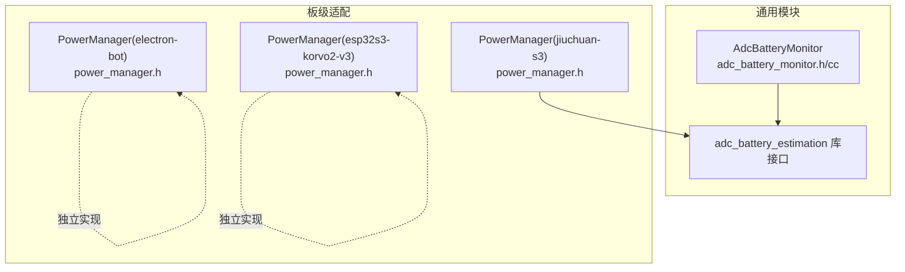
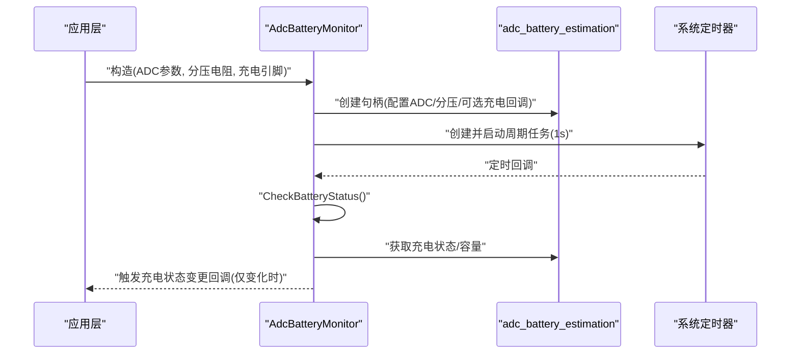
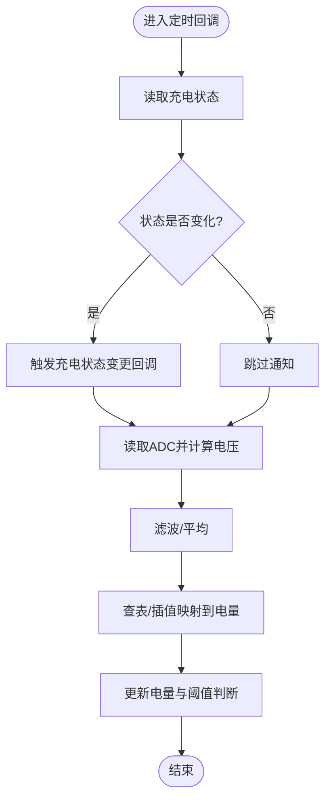
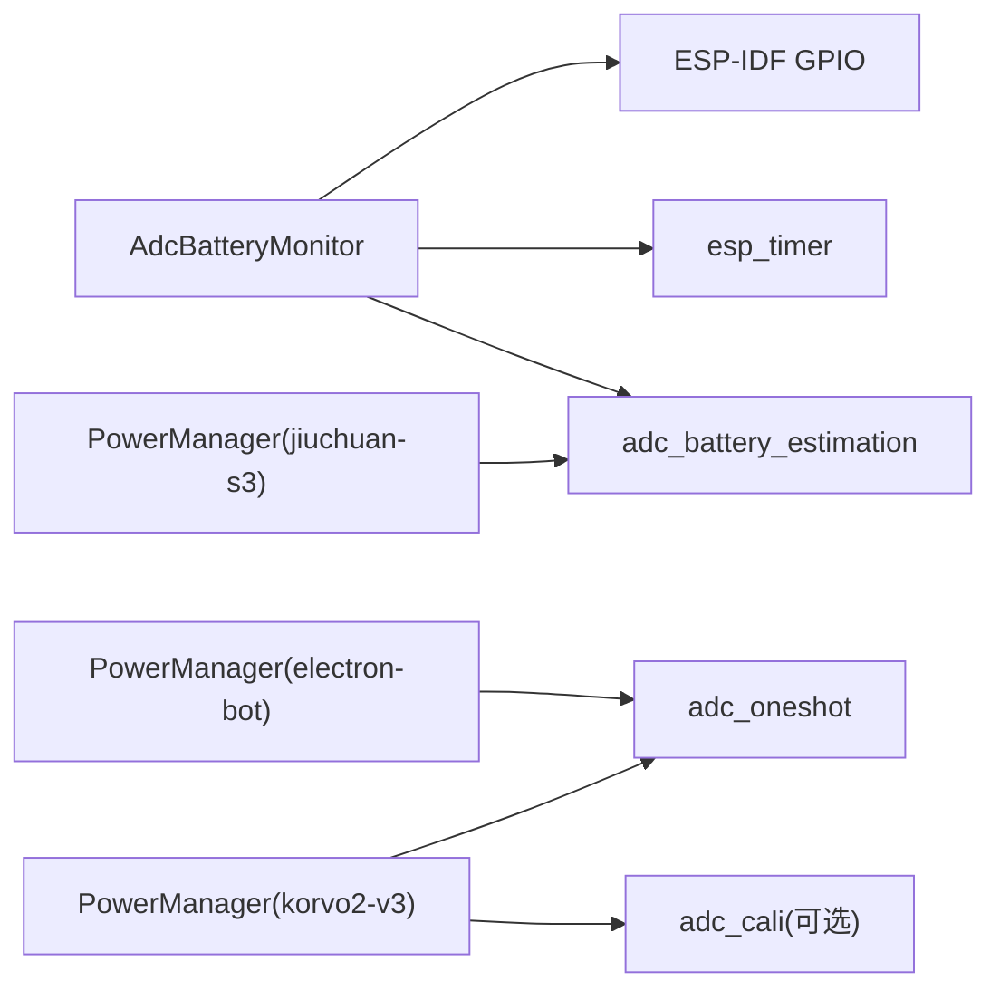

# 电池电量监测

<cite>
**本文引用的文件**   
- [adc_battery_monitor.h](file://main/boards/common/adc_battery_monitor.h)
- [adc_battery_monitor.cc](file://main/boards/common/adc_battery_monitor.cc)
- [power_manager.h（jiuchuan-s3）](file://main/boards/jiuchuan-s3/power_manager.h)
- [power_manager.h（electron-bot）](file://main/boards/electron-bot/power_manager.h)
- [power_manager.h（esp32s3-korvo2-v3）](file://main/boards/esp32s3-korvo2-v3/power_manager.h)
- [custom-board.md](file://docs/custom-board.md)
</cite>

## 目录
1. [简介](#简介)
2. [项目结构](#项目结构)
3. [核心组件](#核心组件)
4. [架构总览](#架构总览)
5. [详细组件分析](#详细组件分析)
6. [依赖关系分析](#依赖关系分析)
7. [性能与精度优化](#性能与精度优化)
8. [故障排查指南](#故障排查指南)
9. [结论](#结论)
10. [附录：配置与使用示例](#附录配置与使用示例)

## 简介
本技术文档围绕 ADC 电池电量监测系统，重点解析 AdcBatteryMonitor 类的设计与实现原理，涵盖 ADC 采样、电压转换、电量估算模型、充电状态检测、定时器轮询机制、滤波与噪声抑制策略，以及不同板级 PowerManager 的差异化实现。同时提供硬件电路设计注意事项、采样频率选择建议、低电量告警与阈值设置方法，帮助读者快速集成并优化电池监测功能。

## 项目结构
本项目采用“通用能力 + 板级适配”的组织方式：
- 通用能力：AdcBatteryMonitor 封装了基于 adc_battery_estimation 库的 ADC 电量估算、充电状态检测与定时轮询逻辑。
- 板级适配：各板子的 PowerManager 根据自身硬件（ADC 通道、分压电阻、是否带外部充电引脚等）进行具体实现，有的直接调用 adc_battery_estimation，有的自行完成 ADC 采样与查表换算。



图表来源
- [adc_battery_monitor.h:1-31](file://main/boards/common/adc_battery_monitor.h#L1-L31)
- [adc_battery_monitor.cc:1-116](file://main/boards/common/adc_battery_monitor.cc#L1-L116)
- [power_manager.h（jiuchuan-s3）:1-201](file://main/boards/jiuchuan-s3/power_manager.h#L1-L201)
- [power_manager.h（electron-bot）:1-128](file://main/boards/electron-bot/power_manager.h#L1-L128)
- [power_manager.h（esp32s3-korvo2-v3）:39-113](file://main/boards/esp32s3-korvo2-v3/power_manager.h#L39-L113)

章节来源
- [custom-board.md:423](file://docs/custom-board.md#L423)

## 核心组件
- AdcBatteryMonitor：对外暴露 IsCharging/IsDischarging/GetBatteryLevel 与 OnChargingStatusChanged 回调；内部通过 esp_timer 周期性检查充电状态变化，并通过 adc_battery_estimation 库获取容量百分比。
- adc_battery_estimation 库：提供创建/销毁句柄、获取充电状态与容量百分比等 API；支持传入 ADC 单元、位宽、衰减、分压电阻、可选充电检测回调与电池点表。
- 板级 PowerManager：
  - jiuchuan-s3：直接使用 adc_battery_estimation，并提供电池点表以适配锂电池放电曲线。
  - electron-bot：自实现 ADC 采样、滑动平均与线性插值映射到电量百分比。
  - esp32s3-korvo2-v3：自实现 ADC 多次采样、校准或线性换算、分压还原、滑动窗口平均与分段查表映射。

章节来源
- [adc_battery_monitor.h:9-28](file://main/boards/common/adc_battery_monitor.h#L9-L28)
- [adc_battery_monitor.cc:18-55](file://main/boards/common/adc_battery_monitor.cc#L18-L55)
- [power_manager.h（jiuchuan-s3）:104-130](file://main/boards/jiuchuan-s3/power_manager.h#L104-L130)
- [power_manager.h（electron-bot）:31-68](file://main/boards/electron-bot/power_manager.h#L31-L68)
- [power_manager.h（esp32s3-korvo2-v3）:57-113](file://main/boards/esp32s3-korvo2-v3/power_manager.h#L57-L113)

## 架构总览
AdcBatteryMonitor 作为通用层，屏蔽底层差异，向上提供统一接口；板级 PowerManager 可选择复用该通用层或直接实现。

```mermaid
classDiagram
class AdcBatteryMonitor {
+AdcBatteryMonitor(adc_unit, adc_channel, upper_resistor, lower_resistor, charging_pin)
+~AdcBatteryMonitor()
+IsCharging() bool
+IsDischarging() bool
+GetBatteryLevel() uint8_t
+OnChargingStatusChanged(callback) void
-CheckBatteryStatus() void
-charging_pin_ : gpio_num_t
-adc_battery_estimation_handle_ : handle
-timer_handle_ : handle
-is_charging_ : bool
-on_charging_status_changed_ : function
}
class PowerManager_jiuchuan_s3 {
+PowerManager(charging_pin)
+IsCharging() bool
+IsDischarging() bool
+GetBatteryLevel() int32_t
+OnChargingStatusChanged(callback) void
-ReadBatteryAdcData() void
-CheckBatteryStatus() void
-adc_battery_estimation_handle : handle
}
class PowerManager_electron_bot {
+PowerManager(charging_pin, adc_unit, adc_channel)
+IsCharging() bool
+GetBatteryLevel() uint8_t
-InitializeAdc() void
-CheckBatteryStatus() void
-ReadBatteryAdcData() void
-CalculateBatteryLevel(avg_adc) void
}
class PowerManager_korvo2_v3 {
+PowerManager(...)
-ReadBatteryAdcData() void
-CheckBatteryStatus() void
}
AdcBatteryMonitor --> "使用" adc_battery_estimation : "API"
PowerManager_jiuchuan_s3 --> "使用" adc_battery_estimation : "API"
PowerManager_electron_bot ..> "独立实现" : "ADC+查表"
PowerManager_korvo2_v3 ..> "独立实现" : "ADC+校准+查表"
```

图表来源
- [adc_battery_monitor.h:9-28](file://main/boards/common/adc_battery_monitor.h#L9-L28)
- [adc_battery_monitor.cc:1-116](file://main/boards/common/adc_battery_monitor.cc#L1-L116)
- [power_manager.h（jiuchuan-s3）:1-201](file://main/boards/jiuchuan-s3/power_manager.h#L1-L201)
- [power_manager.h（electron-bot）:1-128](file://main/boards/electron-bot/power_manager.h#L1-L128)
- [power_manager.h（esp32s3-korvo2-v3）:39-113](file://main/boards/esp32s3-korvo2-v3/power_manager.h#L39-L113)

## 详细组件分析

### AdcBatteryMonitor 设计与实现
- 初始化流程
  - 若提供充电引脚，则配置为输入模式；否则不启用 GPIO 检测。
  - 构造 adc_battery_estimation 配置：指定 ADC 单元、位宽、衰减、通道、上下分压电阻；若提供充电引脚，则注册充电检测回调，否则交由库内软件估算。
  - 创建并启动周期定时器（默认 1 秒），回调中执行 CheckBatteryStatus。
- 运行期行为
  - IsCharging：优先通过库接口获取充电状态；若无句柄则回退到 GPIO 读取或返回默认值。
  - GetBatteryLevel：通过库接口获取容量百分比，错误时返回默认值。
  - OnChargingStatusChanged：允许上层注册回调，当检测到充电状态变化时触发。
  - CheckBatteryStatus：比较新旧充电状态，仅在变化时通知上层。



图表来源
- [adc_battery_monitor.cc:18-55](file://main/boards/common/adc_battery_monitor.cc#L18-L55)
- [adc_battery_monitor.cc:68-116](file://main/boards/common/adc_battery_monitor.cc#L68-L116)

章节来源
- [adc_battery_monitor.h:9-28](file://main/boards/common/adc_battery_monitor.h#L9-L28)
- [adc_battery_monitor.cc:1-116](file://main/boards/common/adc_battery_monitor.cc#L1-L116)

### 板级 PowerManager 对比

#### jiuchuan-s3：基于 adc_battery_estimation 的完整方案
- 配置要点
  - 定义 ADC 单元、位宽、衰减、通道与分压电阻。
  - 提供电池点表（电压-电量映射），用于更贴合锂电池放电曲线的估算。
  - 创建 adc_battery_estimation 句柄，并在定时器中周期性读取容量。
- 特点
  - 利用库内置算法与点表，减少手工标定复杂度。
  - 可结合充电引脚状态与电量阈值实现低电量告警。

章节来源
- [power_manager.h（jiuchuan-s3）:12-18](file://main/boards/jiuchuan-s3/power_manager.h#L12-L18)
- [power_manager.h（jiuchuan-s3）:104-130](file://main/boards/jiuchuan-s3/power_manager.h#L104-L130)
- [power_manager.h（jiuchuan-s3）:42-76](file://main/boards/jiuchuan-s3/power_manager.h#L42-L76)

#### electron-bot：自实现 ADC 采样与线性映射
- 实现要点
  - 使用 adc_oneshot 驱动，固定位宽与衰减。
  - 环形缓冲区维护最近若干次采样，计算平均值后做线性插值映射到 0-100%。
- 适用场景
  - 简单分压电路、对精度要求不高、无需复杂温度补偿的场景。

章节来源
- [power_manager.h（electron-bot）:31-68](file://main/boards/electron-bot/power_manager.h#L31-L68)
- [power_manager.h（electron-bot）:99-112](file://main/boards/electron-bot/power_manager.h#L99-L112)

#### esp32s3-korvo2-v3：多次采样 + 校准/线性换算 + 分段查表
- 实现要点
  - 多次采样取平均，降低瞬时噪声影响。
  - 优先使用 ADC 校准函数将原始码转换为 mV；若无校准则按线性公式换算。
  - 根据分压比还原电池实际电压，滑动窗口平均后再分段查表映射到电量。
- 适用场景
  - 需要更高精度与稳定性的设备，且具备 ADC 校准能力。

章节来源
- [power_manager.h（esp32s3-korvo2-v3）:57-113](file://main/boards/esp32s3-korvo2-v3/power_manager.h#L57-L113)

### 关键算法与数据流

#### ADC 采样与电压转换
- 基本流程
  - 配置 ADC 单元与通道（位宽、衰减）。
  - 单次或多读采样，必要时加入延时以降低耦合干扰。
  - 使用校准函数或线性公式将原始码转换为电压（mV）。
  - 根据分压比还原电池端电压。
- 典型参数
  - 位宽：常用 12bit（满量程约 4095）。
  - 衰减：常用 12dB，对应较宽测量范围。
  - 分压电阻：由硬件决定，需在上/下电阻参数中正确填写。

章节来源
- [power_manager.h（electron-bot）:99-112](file://main/boards/electron-bot/power_manager.h#L99-L112)
- [power_manager.h（esp32s3-korvo2-v3）:72-83](file://main/boards/esp32s3-korvo2-v3/power_manager.h#L72-L83)
- [adc_battery_monitor.cc:18-28](file://main/boards/common/adc_battery_monitor.cc#L18-L28)

#### 电量计算模型
- 线性插值（简单）
  - 在两个已知点之间按比例映射，适合粗略估计。
- 分段查表（推荐）
  - 依据电池类型（如锂电池）的放电曲线，建立多段电压-电量映射，提高全量程精度。
- 库内估算（最简接入）
  - 通过 adc_battery_estimation 提供的点表与算法，自动输出百分比。

章节来源
- [power_manager.h（electron-bot）:58-68](file://main/boards/electron-bot/power_manager.h#L58-L68)
- [power_manager.h（esp32s3-korvo2-v3）:97-113](file://main/boards/esp32s3-korvo2-v3/power_manager.h#L97-L113)
- [power_manager.h（jiuchuan-s3）:104-127](file://main/boards/jiuchuan-s3/power_manager.h#L104-L127)

#### 充电状态检测
- 硬件直读：通过 GPIO 电平判断充电状态。
- 库内回调：将 GPIO 读取封装为回调供库使用。
- 软件估算：未提供 GPIO 时，库内部可能基于电压趋势或其他策略估算。

章节来源
- [adc_battery_monitor.cc:31-41](file://main/boards/common/adc_battery_monitor.cc#L31-L41)
- [adc_battery_monitor.cc:68-84](file://main/boards/common/adc_battery_monitor.cc#L68-L84)

#### 采样滤波与噪声抑制
- 滑动平均/环形缓冲：平滑短期波动。
- 多次采样取平均：进一步抑制随机噪声。
- 合理延时：避免与高频开关噪声同步采样。

章节来源
- [power_manager.h（electron-bot）:36-56](file://main/boards/electron-bot/power_manager.h#L36-L56)
- [power_manager.h（esp32s3-korvo2-v3）:61-70](file://main/boards/esp32s3-korvo2-v3/power_manager.h#L61-L70)

#### 温度补偿机制
- 当前代码路径中未见显式温度传感器接入与补偿逻辑。
- 建议在电量估算前引入温度修正系数（例如根据电池厂商提供的温度-容量曲线），或在显示层做经验性修正。

[本节为概念性说明，无直接源码引用]

### 流程图：电量更新主循环（通用思路）


[此图为概念流程示意，不对应特定源码文件]

## 依赖关系分析
- AdcBatteryMonitor 依赖：
  - ESP-IDF GPIO 与 esp_timer。
  - adc_battery_estimation 库（创建/销毁句柄、获取充电状态与容量）。
- 板级 PowerManager 依赖：
  - jiuchuan-s3：同上，外加自定义电池点表。
  - electron-bot/esp32s3-korvo2-v3：依赖 esp_adc/adc_oneshot 与可能的 adc_cali 校准。



图表来源
- [adc_battery_monitor.cc:1-55](file://main/boards/common/adc_battery_monitor.cc#L1-L55)
- [power_manager.h（jiuchuan-s3）:104-130](file://main/boards/jiuchuan-s3/power_manager.h#L104-L130)
- [power_manager.h（electron-bot）:99-112](file://main/boards/electron-bot/power_manager.h#L99-L112)
- [power_manager.h（esp32s3-korvo2-v3）:72-83](file://main/boards/esp32s3-korvo2-v3/power_manager.h#L72-L83)

章节来源
- [adc_battery_monitor.cc:1-116](file://main/boards/common/adc_battery_monitor.cc#L1-L116)
- [power_manager.h（jiuchuan-s3）:1-201](file://main/boards/jiuchuan-s3/power_manager.h#L1-L201)
- [power_manager.h（electron-bot）:1-128](file://main/boards/electron-bot/power_manager.h#L1-L128)
- [power_manager.h（esp32s3-korvo2-v3）:39-113](file://main/boards/esp32s3-korvo2-v3/power_manager.h#L39-L113)

## 性能与精度优化
- 采样频率与时机
  - 建议 1-5 秒一次，避免频繁唤醒导致功耗上升；可在充电状态下适当提高频率。
- 采样次数与间隔
  - 单次或多次采样（如 5-10 次），每次间隔 5-20ms，有助于避开瞬态噪声。
- 滤波策略
  - 滑动平均/环形缓冲；极端值剔除（如去极值平均）可进一步提升稳定性。
- 校准与分压
  - 优先使用 ADC 校准函数；准确记录分压电阻值，确保上/下电阻参数与实际一致。
- 显示优化
  - 电量变化阈值化（如 1% 才刷新），减少 UI 抖动。
- 续航估算
  - 结合历史电流/功率与剩余电量，采用积分法或查表法估算剩余时间；本项目未包含电流采集，可基于负载状态近似估算。

[本节为通用指导，无直接源码引用]

## 故障排查指南
- 电量始终为 100% 或不变
  - 检查 adc_battery_estimation 句柄是否成功创建；确认 GetBatteryLevel 返回值处理逻辑。
- 充电状态不正确
  - 确认充电引脚配置与电平有效逻辑；若未提供引脚，库内估算可能与实际不一致。
- 电量跳变剧烈
  - 增加采样次数与滑动窗口长度；检查分压电阻精度与布局走线。
- 低电量告警未触发
  - 确认阈值设置与回调注册；在电量更新后增加阈值判断与事件上报。

章节来源
- [adc_battery_monitor.cc:90-102](file://main/boards/common/adc_battery_monitor.cc#L90-L102)
- [adc_battery_monitor.cc:108-116](file://main/boards/common/adc_battery_monitor.cc#L108-L116)
- [power_manager.h（jiuchuan-s3）:42-76](file://main/boards/jiuchuan-s3/power_manager.h#L42-L76)

## 结论
AdcBatteryMonitor 提供了简洁统一的 ADC 电量监测抽象，配合 adc_battery_estimation 库可快速落地；对于高精度需求，推荐采用分段查表与 ADC 校准，并结合滑动平均与合理的采样频率。板级 PowerManager 可根据硬件条件灵活选择“复用库”或“自实现”，在工程实践中兼顾精度、功耗与开发成本。

[本节为总结性内容，无直接源码引用]

## 附录：配置与使用示例

### 使用 AdcBatteryMonitor 的基本步骤
- 构造实例
  - 传入 ADC 单元、通道、上/下分压电阻值；可选传入充电引脚。
- 注册充电状态变更回调
  - 在回调中进行 UI 更新或告警处理。
- 获取电量与充电状态
  - 调用 GetBatteryLevel 与 IsCharging/IsDischarging。

章节来源
- [adc_battery_monitor.h:11-18](file://main/boards/common/adc_battery_monitor.h#L11-L18)
- [adc_battery_monitor.cc:18-55](file://main/boards/common/adc_battery_monitor.cc#L18-L55)
- [adc_battery_monitor.cc:104-116](file://main/boards/common/adc_battery_monitor.cc#L104-L116)

### 板级 PowerManager 参考
- jiuchuan-s3
  - 提供电池点表与 adc_battery_estimation 配置，定时器周期读取容量。
- electron-bot
  - 自实现 ADC 采样、滑动平均与线性映射。
- esp32s3-korvo2-v3
  - 多次采样、校准/线性换算、分压还原、分段查表映射。

章节来源
- [power_manager.h（jiuchuan-s3）:104-130](file://main/boards/jiuchuan-s3/power_manager.h#L104-L130)
- [power_manager.h（electron-bot）:31-68](file://main/boards/electron-bot/power_manager.h#L31-L68)
- [power_manager.h（esp32s3-korvo2-v3）:57-113](file://main/boards/esp32s3-korvo2-v3/power_manager.h#L57-L113)

### 电量阈值与低电量告警
- 在电量更新后比较阈值（如 20%），低于阈值时触发回调或事件。
- 可在充电状态变化时重置告警标志，避免重复触发。

章节来源
- [power_manager.h（jiuchuan-s3）:35](file://main/boards/jiuchuan-s3/power_manager.h#L35)
- [power_manager.h（jiuchuan-s3）:194-200](file://main/boards/jiuchuan-s3/power_manager.h#L194-L200)

### 硬件电路设计注意事项
- 分压电阻选择
  - 阻值不宜过大，避免 ADC 输入阻抗影响；建议使用 100k/100k 或 200k/100k 等常见组合，并确保精度与温漂可控。
- 布局与滤波
  - 在 ADC 输入端就近放置小电容（如 100nF）滤除高频噪声；远离大电流走线与开关电源节点。
- 参考地与电源完整性
  - 模拟地与数字地单点连接；保证 VCC 与 GND 回路短而粗。
- 充电检测引脚
  - 若使用 GPIO 检测，注意电平有效逻辑与上/下拉配置，避免悬空误判。

[本节为通用指导，无直接源码引用]