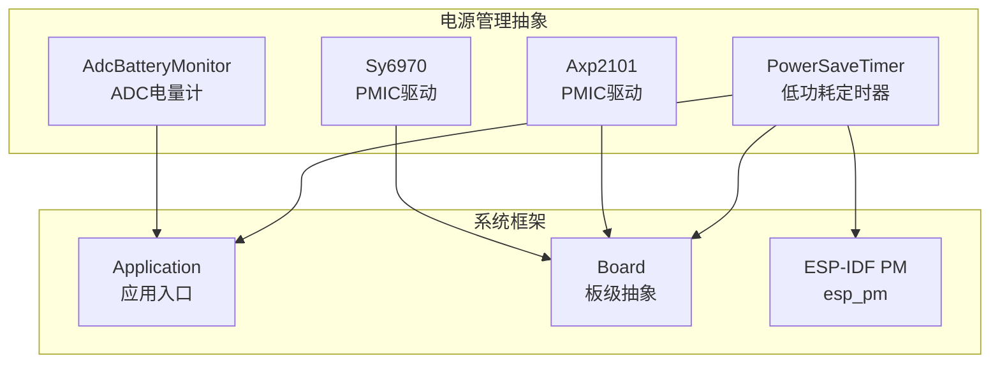
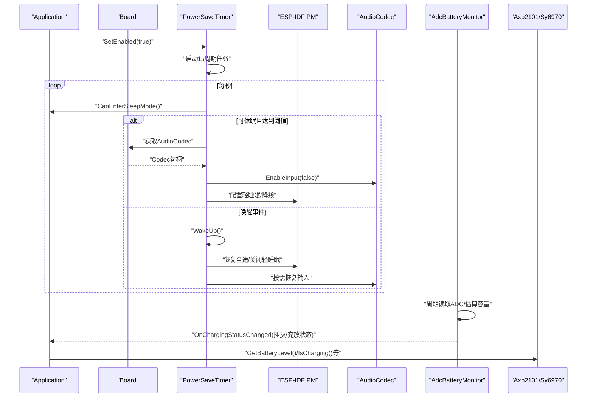
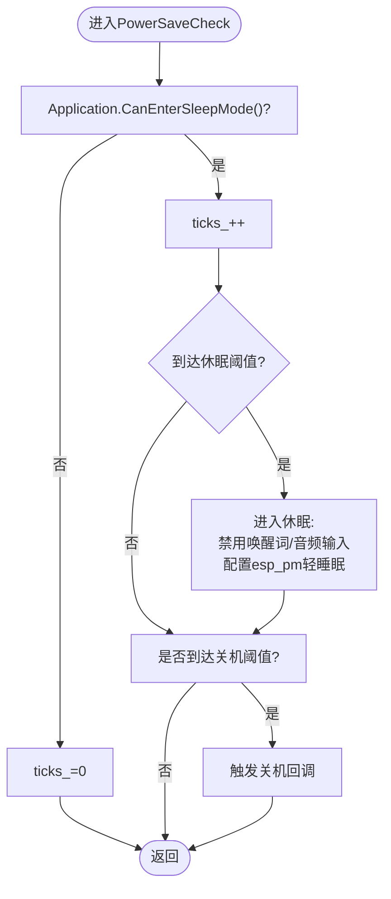
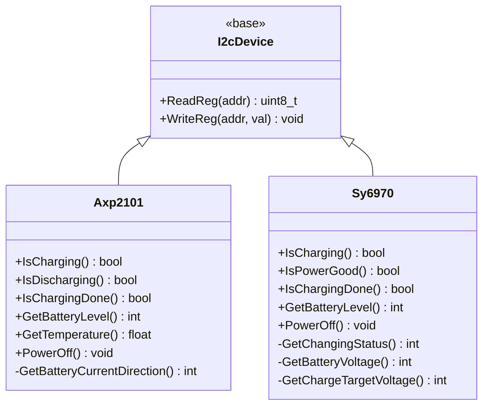
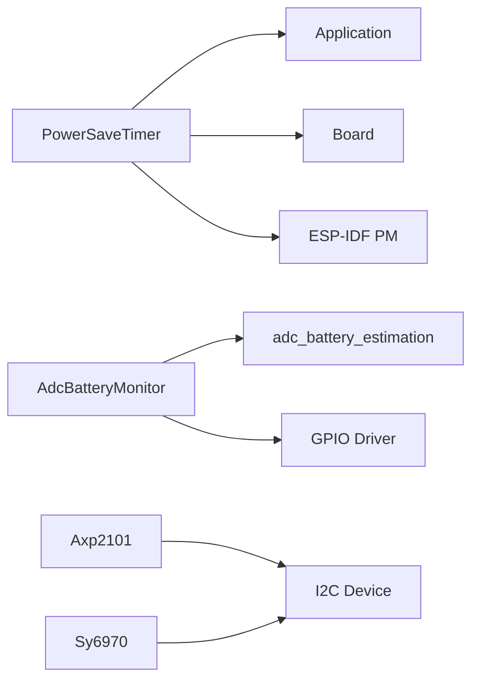

# 电源管理抽象

<cite>
**本文引用的文件**   
- [power_save_timer.h](file://main/boards/common/power_save_timer.h)
- [power_save_timer.cc](file://main/boards/common/power_save_timer.cc)
- [axp2101.h](file://main/boards/common/axp2101.h)
- [axp2101.cc](file://main/boards/common/axp2101.cc)
- [sy6970.h](file://main/boards/common/sy6970.h)
- [sy6970.cc](file://main/boards/common/sy6970.cc)
- [adc_battery_monitor.h](file://main/boards/common/adc_battery_monitor.h)
- [adc_battery_monitor.cc](file://main/boards/common/adc_battery_monitor.cc)
- [nt26_board.cc](file://main/boards/common/nt26_board.cc)
</cite>

## 目录
1. [简介](#简介)
2. [项目结构](#项目结构)
3. [核心组件](#核心组件)
4. [架构总览](#架构总览)
5. [详细组件分析](#详细组件分析)
6. [依赖关系分析](#依赖关系分析)
7. [性能与功耗特性](#性能与功耗特性)
8. [故障诊断与排错](#故障诊断与排错)
9. [结论](#结论)
10. [附录：配置与示例](#附录配置与示例)

## 简介
本文件面向电源管理抽象层，系统性阐述以下主题：
- PowerSaveLevel 枚举的设计与各功耗级别适用场景（基于板级实现）
- 低功耗定时器的实现原理、休眠计时器管理机制
- 电池电量监测的 ADC 采样与估算算法
- 不同电源管理芯片（AXP2101、SY6970）驱动适配差异
- 电源状态切换流程、唤醒源配置思路、功耗优化策略
- 配置示例、续航优化技巧、低功耗模式下的功能限制说明
- 电源相关故障诊断与性能分析方法

## 项目结构
电源管理相关代码集中在 boards/common 目录下，包含通用定时器、ADC 电量计以及 PMIC 驱动适配。部分板级通过 SetPowerSaveLevel 暴露 PowerSaveLevel 控制能力。



图表来源
- [power_save_timer.h:1-35](file://main/boards/common/power_save_timer.h#L1-L35)
- [power_save_timer.cc:1-133](file://main/boards/common/power_save_timer.cc#L1-L133)
- [adc_battery_monitor.h:1-31](file://main/boards/common/adc_battery_monitor.h#L1-L31)
- [adc_battery_monitor.cc:1-116](file://main/boards/common/adc_battery_monitor.cc#L1-L116)
- [axp2101.h:1-21](file://main/boards/common/axp2101.h#L1-L21)
- [axp2101.cc:1-42](file://main/boards/common/axp2101.cc#L1-L42)
- [sy6970.h:1-21](file://main/boards/common/sy6970.h#L1-L21)
- [sy6970.cc:1-66](file://main/boards/common/sy6970.cc#L1-L66)

章节来源
- [power_save_timer.h:1-35](file://main/boards/common/power_save_timer.h#L1-L35)
- [power_save_timer.cc:1-133](file://main/boards/common/power_save_timer.cc#L1-L133)
- [adc_battery_monitor.h:1-31](file://main/boards/common/adc_battery_monitor.h#L1-L31)
- [adc_battery_monitor.cc:1-116](file://main/boards/common/adc_battery_monitor.cc#L1-L116)
- [axp2101.h:1-21](file://main/boards/common/axp2101.h#L1-L21)
- [axp2101.cc:1-42](file://main/boards/common/axp2101.cc#L1-L42)
- [sy6970.h:1-21](file://main/boards/common/sy6970.h#L1-L21)
- [sy6970.cc:1-66](file://main/boards/common/sy6970.cc#L1-L66)

## 核心组件
- 低功耗定时器 PowerSaveTimer：周期性检查空闲时长，进入/退出轻睡眠，回调上层进行资源降频与外设关闭；支持关机请求回调。
- ADC 电量计 AdcBatteryMonitor：基于 ESP-IDF ADC 与电量估算库，周期轮询并上报充电状态变化与剩余电量百分比。
- PMIC 驱动 Axp2101/Sy6970：封装 I2C 寄存器读写，提供充电状态、电量、温度、关机等功能接口。
- 板级电源等级 SetPowerSaveLevel：在特定板级中根据 PowerSaveLevel 调整 CPU 频率锁与轻睡眠策略。

章节来源
- [power_save_timer.h:1-35](file://main/boards/common/power_save_timer.h#L1-L35)
- [power_save_timer.cc:1-133](file://main/boards/common/power_save_timer.cc#L1-L133)
- [adc_battery_monitor.h:1-31](file://main/boards/common/adc_battery_monitor.h#L1-L31)
- [adc_battery_monitor.cc:1-116](file://main/boards/common/adc_battery_monitor.cc#L1-L116)
- [axp2101.h:1-21](file://main/boards/common/axp2101.h#L1-L21)
- [axp2101.cc:1-42](file://main/boards/common/axp2101.cc#L1-L42)
- [sy6970.h:1-21](file://main/boards/common/sy6970.h#L1-L21)
- [sy6970.cc:1-66](file://main/boards/common/sy6970.cc#L1-L66)
- [nt26_board.cc:163-180](file://main/boards/common/nt26_board.cc#L163-L180)

## 架构总览
电源管理抽象层由“定时器调度 + 电量采集 + PMIC 驱动 + 板级策略”构成，统一向上层 Application/Board 暴露接口，向下对接 ESP-IDF PM 与外设。



图表来源
- [power_save_timer.cc:30-104](file://main/boards/common/power_save_timer.cc#L30-L104)
- [power_save_timer.cc:106-133](file://main/boards/common/power_save_timer.cc#L106-L133)
- [adc_battery_monitor.cc:44-55](file://main/boards/common/adc_battery_monitor.cc#L44-L55)
- [adc_battery_monitor.cc:108-116](file://main/boards/common/adc_battery_monitor.cc#L108-L116)
- [axp2101.cc:29-35](file://main/boards/common/axp2101.cc#L29-L35)
- [sy6970.cc:46-61](file://main/boards/common/sy6970.cc#L46-L61)

## 详细组件分析

### PowerSaveTimer：低功耗定时器与休眠计时器
- 设计要点
  - 使用 esp_timer 以 1s 周期触发 PowerSaveCheck。
  - 在进入轻睡眠前：禁用唤醒词检测、关闭音频输入、调用 esp_pm_configure 降低最大频率并启用轻睡眠。
  - 唤醒时：恢复 CPU 频率、按需重新开启唤醒词检测、触发退出回调。
  - 支持关机请求回调，当累计时间超过阈值时触发。
- 关键流程
  - 设置启用：读取配置项 sleep_mode，若允许则启动周期任务。
  - 进入休眠：判断 CanEnterSleepMode，满足条件后执行资源降级与 PM 配置。
  - 唤醒恢复：清零计数，恢复 PM 配置与外设状态。
- 复杂度与开销
  - 周期任务为 O(1)，仅在边界处触发外设操作与 PM 配置，整体开销极低。



图表来源
- [power_save_timer.cc:62-104](file://main/boards/common/power_save_timer.cc#L62-L104)

章节来源
- [power_save_timer.h:1-35](file://main/boards/common/power_save_timer.h#L1-L35)
- [power_save_timer.cc:1-133](file://main/boards/common/power_save_timer.cc#L1-L133)

### AdcBatteryMonitor：ADC 采样与电量估算
- 初始化
  - 可选充电引脚 GPIO 配置。
  - 配置 adc_battery_estimation_t，指定 ADC 单元、通道、分压电阻、可选充电检测回调。
  - 创建 esp_timer 周期任务（1s）轮询电量与充放状态。
- 算法与数据流
  - 优先使用 adc_battery_estimation_get_capacity 获取容量百分比。
  - 充电状态优先使用库函数，回退到 GPIO 电平或默认值。
  - 周期任务比较新旧状态，变化时触发用户回调。
- 异常与容错
  - 句柄无效或 API 失败时返回默认值（如 100%），避免崩溃。

```mermaid
classDiagram
class AdcBatteryMonitor {
-gpio_num_t charging_pin_
-adc_battery_estimation_handle_t adc_battery_estimation_handle_
-esp_timer_handle_t timer_handle_
-bool is_charging_
-std : : function<void(bool)> on_charging_status_changed_
+AdcBatteryMonitor(...)
+~AdcBatteryMonitor()
+IsCharging() bool
+IsDischarging() bool
+GetBatteryLevel() uint8_t
+OnChargingStatusChanged(callback) void
-CheckBatteryStatus() void
}
```

图表来源
- [adc_battery_monitor.h:1-31](file://main/boards/common/adc_battery_monitor.h#L1-L31)
- [adc_battery_monitor.cc:1-116](file://main/boards/common/adc_battery_monitor.cc#L1-L116)

章节来源
- [adc_battery_monitor.h:1-31](file://main/boards/common/adc_battery_monitor.h#L1-L31)
- [adc_battery_monitor.cc:1-116](file://main/boards/common/adc_battery_monitor.cc#L1-L116)

### PMIC 驱动适配：Axp2101 与 Sy6970
- Axp2101
  - 通过 I2C 读取寄存器位域判断电流方向、充电完成标志、电量百分比与温度。
  - 提供 PowerOff 接口用于系统关机。
- Sy6970
  - 通过 I2C 读取状态寄存器判断充电阶段、功率良好标志。
  - 将电池电压与目标充电电压换算为百分比电量，并进行边界保护。
  - 提供 PowerOff 接口用于系统关机。



图表来源
- [axp2101.h:1-21](file://main/boards/common/axp2101.h#L1-L21)
- [axp2101.cc:1-42](file://main/boards/common/axp2101.cc#L1-L42)
- [sy6970.h:1-21](file://main/boards/common/sy6970.h#L1-L21)
- [sy6970.cc:1-66](file://main/boards/common/sy6970.cc#L1-L66)

章节来源
- [axp2101.h:1-21](file://main/boards/common/axp2101.h#L1-L21)
- [axp2101.cc:1-42](file://main/boards/common/axp2101.cc#L1-L42)
- [sy6970.h:1-21](file://main/boards/common/sy6970.h#L1-L21)
- [sy6970.cc:1-66](file://main/boards/common/sy6970.cc#L1-L66)

### PowerSaveLevel 设计与适用场景
- 设计依据
  - 在特定板级实现中通过 SetPowerSaveLevel(level) 切换 CPU 频率锁与轻睡眠策略。
  - 典型级别包括 BALANCED（均衡）、PERFORMANCE（高性能）。
- 适用场景建议
  - PERFORMANCE：高吞吐任务（语音识别、网络收发）期间保持最高频率。
  - BALANCED：日常交互与待机之间折中，兼顾响应与功耗。
  - 其他级别（如更低功耗）可在板级扩展，结合 PowerSaveTimer 的轻睡眠策略进一步节能。
- 行为约束
  - 从低档切高档需重新获取 PM 锁；从高档切低档需释放 PM 锁。
  - 切换时需保证无并发冲突，避免频繁抖动。

章节来源
- [nt26_board.cc:163-180](file://main/boards/common/nt26_board.cc#L163-L180)

## 依赖关系分析
- 模块耦合
  - PowerSaveTimer 依赖 Application（CanEnterSleepMode、AudioService）、Board（AudioCodec）、ESP-IDF PM。
  - AdcBatteryMonitor 依赖 ESP-IDF ADC 与电量估算库、可选 GPIO。
  - PMIC 驱动依赖 I2C 总线与各自寄存器定义。
- 外部依赖
  - ESP-IDF：esp_timer、esp_pm、driver/gpio、ADC 子系统。
  - 第三方库：adc_battery_estimation（电量估算）。
- 潜在循环依赖
  - 当前未见直接循环引用；注意在板级实现中避免对 PowerSaveTimer 的强依赖导致初始化顺序问题。



图表来源
- [power_save_timer.cc:1-133](file://main/boards/common/power_save_timer.cc#L1-L133)
- [adc_battery_monitor.cc:1-116](file://main/boards/common/adc_battery_monitor.cc#L1-L116)
- [axp2101.cc:1-42](file://main/boards/common/axp2101.cc#L1-L42)
- [sy6970.cc:1-66](file://main/boards/common/sy6970.cc#L1-L66)

章节来源
- [power_save_timer.cc:1-133](file://main/boards/common/power_save_timer.cc#L1-L133)
- [adc_battery_monitor.cc:1-116](file://main/boards/common/adc_battery_monitor.cc#L1-L116)
- [axp2101.cc:1-42](file://main/boards/common/axp2101.cc#L1-L42)
- [sy6970.cc:1-66](file://main/boards/common/sy6970.cc#L1-L66)

## 性能与功耗特性
- 轻睡眠与 CPU 频率
  - 进入轻睡眠可降低最小频率并允许 CPU 在空闲时进入低功耗状态；退出时恢复固定高频以降低延迟。
- 外设功耗
  - 进入休眠前关闭音频输入与唤醒词检测，减少持续采样与处理功耗。
- 电量估算
  - 使用硬件 ADC 与库内算法，周期 1s 轮询，平衡精度与功耗。
- 建议
  - 合理设置 seconds_to_sleep 与 seconds_to_shutdown，避免过于激进导致误休眠。
  - 在高负载任务期间锁定高性能模式，任务结束后释放。

[本节为通用指导，不直接分析具体文件]

## 故障诊断与排错
- 常见问题
  - 无法进入休眠：检查 CanEnterSleepMode 返回值与业务逻辑占用情况。
  - 唤醒后未恢复：确认 WakeUp 路径是否被正确调用，PM 配置是否生效。
  - 电量读数异常：检查 ADC 分压电阻配置、充电引脚接线与 adc_battery_estimation 初始化。
  - PMIC 通信失败：校验 I2C 地址、总线可用性与寄存器访问时序。
- 定位方法
  - 观察日志输出（TAG: PowerSaveTimer/Axp2101/Sy6970/AdcBatteryMonitor）。
  - 使用 esp_pm 统计与功耗测量工具验证频率与睡眠状态。
  - 在回调中打印关键变量（ticks、in_sleep_mode、is_wake_word_running_、capacity）。

章节来源
- [power_save_timer.cc:30-104](file://main/boards/common/power_save_timer.cc#L30-L104)
- [power_save_timer.cc:106-133](file://main/boards/common/power_save_timer.cc#L106-L133)
- [adc_battery_monitor.cc:90-116](file://main/boards/common/adc_battery_monitor.cc#L90-L116)
- [axp2101.cc:12-41](file://main/boards/common/axp2101.cc#L12-L41)
- [sy6970.cc:12-61](file://main/boards/common/sy6970.cc#L12-L61)

## 结论
该电源管理抽象层通过统一的定时器调度、ADC 电量计与 PMIC 驱动适配，实现了灵活的功耗分级与轻睡眠机制。配合板级 PowerSaveLevel 策略，可在不同应用场景下取得良好的功耗与性能平衡。建议在产品化过程中完善唤醒源配置、细化电量曲线校准，并结合实际负载进行功耗闭环优化。

[本节为总结性内容，不直接分析具体文件]

## 附录：配置与示例

### 电源管理配置示例
- 启用低功耗定时器
  - 构造 PowerSaveTimer(cpu_max_freq, seconds_to_sleep, seconds_to_shutdown)。
  - 注册进入/退出休眠与关机回调。
  - 调用 SetEnabled(true) 启动。
- 配置 ADC 电量计
  - 构造 AdcBatteryMonitor(adc_unit, adc_channel, upper_resistor, lower_resistor, charging_pin)。
  - 注册 OnChargingStatusChanged 回调，监听插拔与充放状态变化。
- 切换电源等级
  - 在板级实现中调用 SetPowerSaveLevel(PowerSaveLevel::BALANCED/PERFORMANCE)。

章节来源
- [power_save_timer.h:10-17](file://main/boards/common/power_save_timer.h#L10-L17)
- [power_save_timer.cc:30-60](file://main/boards/common/power_save_timer.cc#L30-L60)
- [adc_battery_monitor.h:11-18](file://main/boards/common/adc_battery_monitor.h#L11-L18)
- [adc_battery_monitor.cc:3-55](file://main/boards/common/adc_battery_monitor.cc#L3-L55)
- [nt26_board.cc:163-180](file://main/boards/common/nt26_board.cc#L163-L180)

### 电池续航优化技巧
- 缩短活跃期：快速完成计算与网络传输，尽早进入轻睡眠。
- 降低采样率：在非关键路径降低 ADC 轮询频率（当前为 1s，可按需调整）。
- 关闭非必要外设：在进入休眠前关闭音频输入、屏幕背光等。
- 合理设置阈值：seconds_to_sleep 与 seconds_to_shutdown 按使用习惯调优。

[本节为通用指导，不直接分析具体文件]

### 低功耗模式下的功能限制说明
- 音频输入与唤醒词检测可能被禁用，直到唤醒后恢复。
- CPU 频率可能受限，影响实时性要求高的任务。
- 某些外设需在唤醒后再初始化或恢复状态。

章节来源
- [power_save_timer.cc:78-98](file://main/boards/common/power_save_timer.cc#L78-L98)
- [power_save_timer.cc:112-126](file://main/boards/common/power_save_timer.cc#L112-L126)