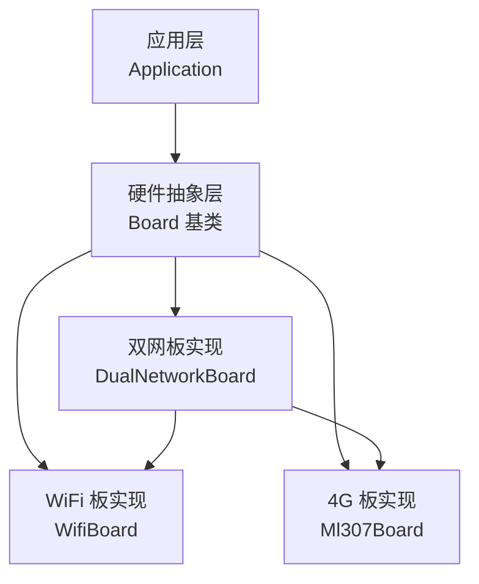
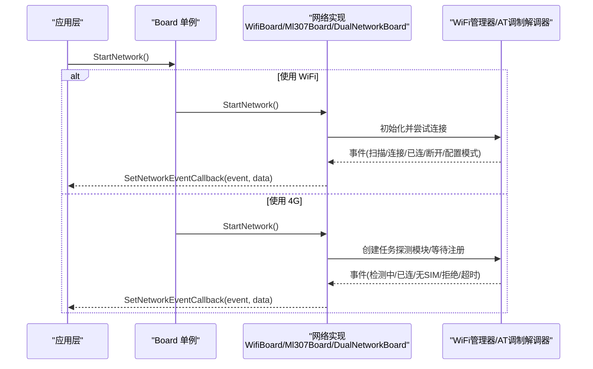
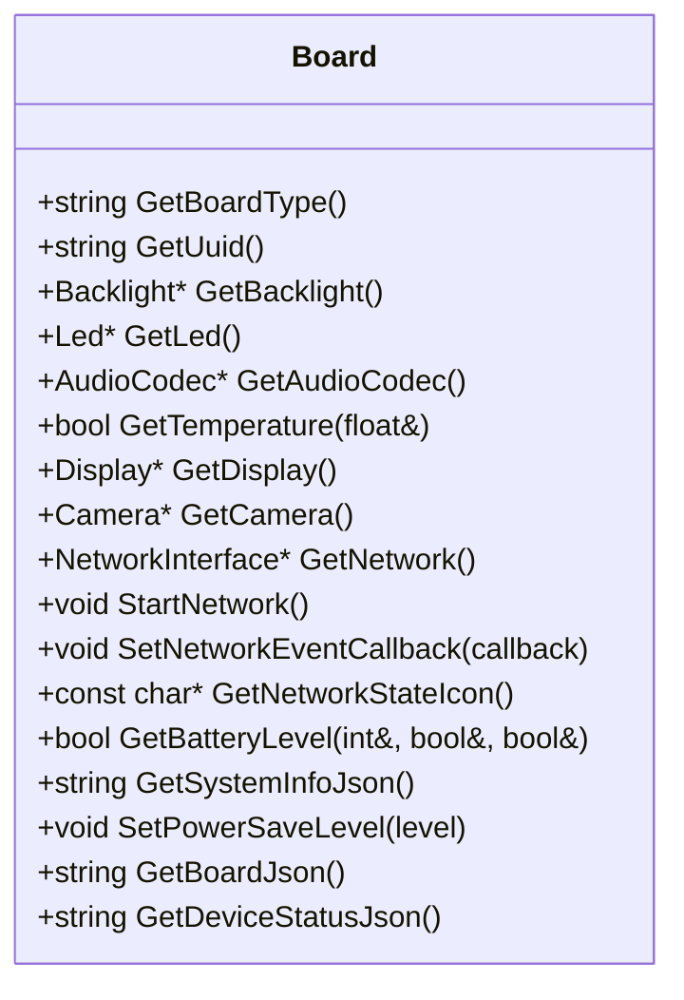
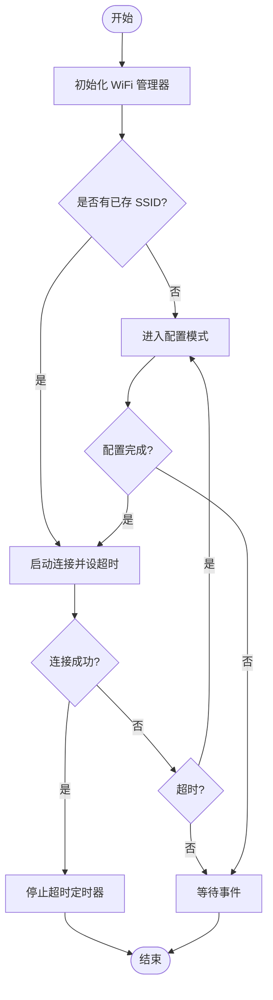
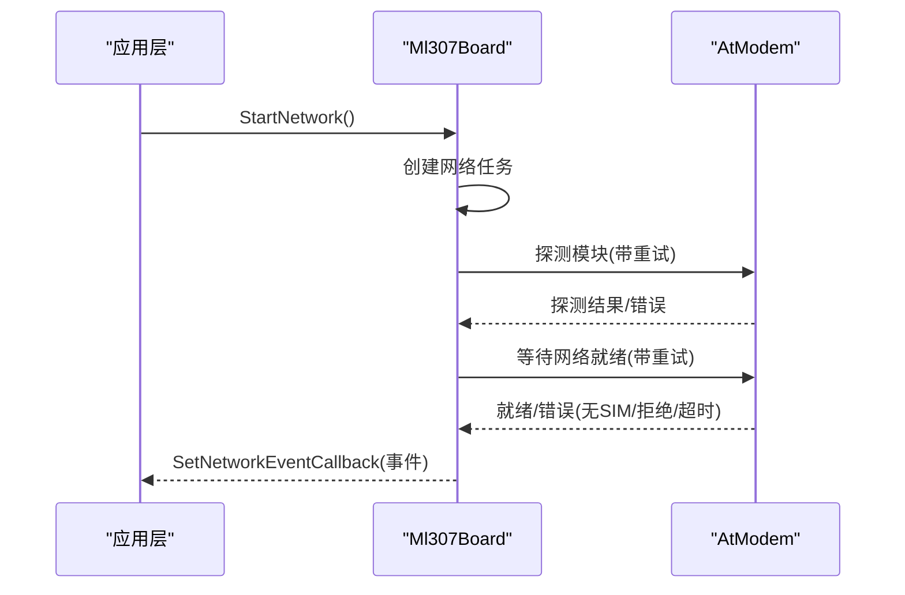
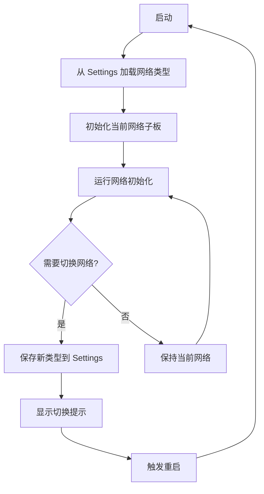
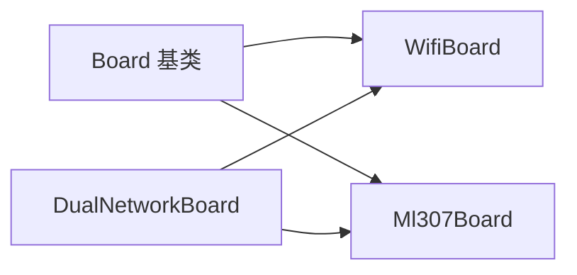

# 硬件抽象层

<cite>
**本文引用的文件**   
- [board.h](file://main/boards/common/board.h)
- [board.cc](file://main/boards/common/board.cc)
- [wifi_board.h](file://main/boards/common/wifi_board.h)
- [wifi_board.cc](file://main/boards/common/wifi_board.cc)
- [ml307_board.h](file://main/boards/common/ml307_board.h)
- [ml307_board.cc](file://main/boards/common/ml307_board.cc)
- [dual_network_board.h](file://main/boards/common/dual_network_board.h)
- [dual_network_board.cc](file://main/boards/common/dual_network_board.cc)
</cite>

## 目录
1. [简介](#简介)
2. [项目结构](#项目结构)
3. [核心组件](#核心组件)
4. [架构总览](#架构总览)
5. [详细组件分析](#详细组件分析)
6. [依赖关系分析](#依赖关系分析)
7. [性能与功耗考量](#性能与功耗考量)
8. [故障诊断指南](#故障诊断指南)
9. [结论](#结论)
10. [附录：新板级适配开发指南](#附录新板级适配开发指南)

## 简介
本技术文档围绕硬件抽象层（HAL）展开，重点阐述 Board 抽象接口的设计理念、实现原理与扩展方式。通过统一的抽象层，70+ 种支持的开发板得以以一致的方式被上层应用访问，屏蔽底层网络（WiFi/4G）、电源管理、外设接口的差异。文档还涵盖动态板级识别机制、运行时切换策略、常见硬件问题诊断方法，以及为硬件厂商提供的标准化接入方案。

## 项目结构
本项目采用“通用抽象 + 具体板卡实现”的分层组织方式：
- 通用抽象层位于 main/boards/common，提供 Board 基类及网络类型派生类（WiFi、ML307、双网）。
- 各具体板卡位于 main/boards/<board_name>，通过声明宏注册到系统，实现 GetBoardType、GetAudioCodec、GetNetwork 等接口。
- 上层应用通过单例 Board::GetInstance() 获取当前板卡实例，统一调用网络、显示、音频、电池等能力。

图表来源
- [board.h:49-85](file://main/boards/common/board.h#L49-L85)
- [wifi_board.h:9-67](file://main/boards/common/wifi_board.h#L9-L67)
- [ml307_board.h:9-36](file://main/boards/common/ml307_board.h#L9-L36)
- [dual_network_board.h:16-58](file://main/boards/common/dual_network_board.h#L16-L58)

章节来源
- [board.h:49-85](file://main/boards/common/board.h#L49-L85)
- [board.cc:15-23](file://main/boards/common/board.cc#L15-L23)

## 核心组件
- Board 抽象接口
  - 职责：定义设备唯一标识、网络、音频、显示、背光、摄像头、温度、电池、系统信息、电源管理等统一 API。
  - 关键方法：GetBoardType、GetUuid、GetNetwork、StartNetwork、SetNetworkEventCallback、GetNetworkStateIcon、SetPowerSaveLevel、GetBoardJson、GetDeviceStatusJson。
  - 事件模型：NetworkEvent 枚举统一了 WiFi 扫描/连接/断开、配置模式进入/退出，以及 4G 模块检测、SIM 错误、注册失败、超时等事件。
  - 工厂模式：create_board 与 DECLARE_BOARD 宏用于在编译期将具体板卡注册为全局单例。

- WifiBoard
  - 职责：封装基于 ESP-IDF 的 WiFi 管理流程，包括 SSID 列表管理、热点/蓝牙配网、连接超时处理、RSSI 图标映射、电源等级设置等。
  - 异步启动：StartNetwork 立即返回，通过回调上报 Scanning/Connecting/Connected/Disconnected/ConfigModeEnter/ConfigModeExit。
  - 状态反馈：GetNetworkStateIcon 根据是否处于配置模式、是否连接、RSSI 强度返回不同图标。

- Ml307Board
  - 职责：封装 AT 指令集驱动的 4G 模块初始化、网络注册、信号质量查询、事件上报。
  - 异步任务：StartNetwork 创建独立任务执行模块探测、等待网络就绪、上报各类错误事件（无 SIM、注册拒绝、超时等）。
  - 状态反馈：GetNetworkStateIcon 基于 CSQ 值映射信号强度图标。

- DualNetworkBoard
  - 职责：在 WiFi 与 ML307 之间进行运行时选择与切换，持久化保存当前网络类型，重启后恢复。
  - 切换流程：SwitchNetworkType 更新 Settings、提示用户并触发系统重启；重启后按上次选择的网络类型初始化对应子板。

章节来源
- [board.h:17-85](file://main/boards/common/board.h#L17-L85)
- [board.cc:15-23](file://main/boards/common/board.cc#L15-L23)
- [wifi_board.h:9-67](file://main/boards/common/wifi_board.h#L9-L67)
- [wifi_board.cc:52-145](file://main/boards/common/wifi_board.cc#L52-L145)
- [ml307_board.h:9-36](file://main/boards/common/ml307_board.h#L9-L36)
- [ml307_board.cc:67-141](file://main/boards/common/ml307_board.cc#L67-L141)
- [dual_network_board.h:16-58](file://main/boards/common/dual_network_board.h#L16-L58)
- [dual_network_board.cc:10-57](file://main/boards/common/dual_network_board.cc#L10-L57)

## 架构总览
下图展示了从应用层到具体网络实现的调用链路与数据流向。

图表来源
- [board.h:76-84](file://main/boards/common/board.h#L76-L84)
- [wifi_board.cc:52-145](file://main/boards/common/wifi_board.cc#L52-L145)
- [ml307_board.cc:134-141](file://main/boards/common/ml307_board.cc#L134-L141)
- [dual_network_board.cc:64-73](file://main/boards/common/dual_network_board.cc#L64-L73)

## 详细组件分析

### Board 抽象接口设计
- 设计理念
  - 统一入口：所有硬件能力通过 Board 单例暴露，避免上层耦合具体驱动。
  - 事件驱动：网络相关事件通过回调统一上报，便于 UI 与业务逻辑响应。
  - 可扩展性：新增网络或外设只需派生新类并实现必要虚函数。
- 关键数据结构
  - NetworkEvent：统一 WiFi/4G 事件语义，包含扫描、连接、断开、配置模式、模块检测、SIM 错误、注册拒绝、初始化失败、超时等。
  - PowerSaveLevel：低功耗/均衡/高性能三级电源策略。
- 默认行为
  - UUID 生成与持久化：首次启动生成 v4 UUID 并写入 Settings，后续读取复用。
  - 系统信息 JSON：聚合芯片信息、分区表、OTA 分区、显示尺寸、语言等。

图表来源
- [board.h:49-85](file://main/boards/common/board.h#L49-L85)

章节来源
- [board.h:17-85](file://main/boards/common/board.h#L17-L85)
- [board.cc:15-46](file://main/boards/common/board.cc#L15-L46)
- [board.cc:70-178](file://main/boards/common/board.cc#L70-L178)

### WiFi 板抽象（WifiBoard）
- 功能要点
  - 启动流程：初始化 WiFi 管理器、设置事件回调、尝试连接或进入配置模式。
  - 超时控制：连接超时定时器触发后自动进入配置模式。
  - 配置模式：支持热点配网、蓝牙配网、声学配网（条件编译），并在完成后自动重试连接。
  - 状态图标：根据配置模式、连接状态、RSSI 返回不同图标。
  - 电源策略：将 Board 的电源等级映射到 WiFi 功率等级。
- 事件转发
  - 将 WiFi 事件转换为统一的 NetworkEvent，并通过回调通知上层。

图表来源
- [wifi_board.cc:52-145](file://main/boards/common/wifi_board.cc#L52-L145)
- [wifi_board.cc:159-197](file://main/boards/common/wifi_board.cc#L159-L197)
- [wifi_board.cc:249-266](file://main/boards/common/wifi_board.cc#L249-L266)

章节来源
- [wifi_board.h:9-67](file://main/boards/common/wifi_board.h#L9-L67)
- [wifi_board.cc:29-46](file://main/boards/common/wifi_board.cc#L29-L46)
- [wifi_board.cc:52-145](file://main/boards/common/wifi_board.cc#L52-L145)
- [wifi_board.cc:249-266](file://main/boards/common/wifi_board.cc#L249-L266)
- [wifi_board.cc:284-299](file://main/boards/common/wifi_board.cc#L284-L299)

### 4G 板抽象（Ml307Board）
- 功能要点
  - 异步初始化：StartNetwork 创建任务，执行模块探测、网络注册、错误上报。
  - 错误分类：无 SIM、注册拒绝、初始化失败、操作超时等事件均通过回调上报。
  - 状态图标：基于 CSQ 值映射信号强度图标。
  - 设备状态：输出运营商、CSQ、IMEI、ICCID、注册状态等信息。
- 注意事项
  - 模块探测与网络就绪等待均有最大重试次数，避免无限阻塞。
  - 网络状态变化回调不直接发送 AT 命令，避免阻塞接收任务。

图表来源
- [ml307_board.cc:67-141](file://main/boards/common/ml307_board.cc#L67-L141)
- [ml307_board.cc:134-141](file://main/boards/common/ml307_board.cc#L134-L141)

章节来源
- [ml307_board.h:9-36](file://main/boards/common/ml307_board.h#L9-L36)
- [ml307_board.cc:20-25](file://main/boards/common/ml307_board.cc#L20-L25)
- [ml307_board.cc:67-141](file://main/boards/common/ml307_board.cc#L67-L141)
- [ml307_board.cc:147-166](file://main/boards/common/ml307_board.cc#L147-L166)

### 双网络板（DualNetworkBoard）
- 功能要点
  - 运行时选择：根据 Settings 中的 type 字段决定当前使用 WiFi 还是 ML307。
  - 切换流程：SwitchNetworkType 更新 Settings、提示用户、触发重启；重启后按新选择初始化对应子板。
  - 代理转发：对上层的所有 Board 接口调用均转发至当前活动子板。
- 适用场景
  - 同时具备 WiFi 与 4G 能力的设备，可在弱 WiFi 环境下自动或手动切换到 4G。

图表来源
- [dual_network_board.cc:10-57](file://main/boards/common/dual_network_board.cc#L10-L57)
- [dual_network_board.cc:64-73](file://main/boards/common/dual_network_board.cc#L64-L73)

章节来源
- [dual_network_board.h:16-58](file://main/boards/common/dual_network_board.h#L16-L58)
- [dual_network_board.cc:23-43](file://main/boards/common/dual_network_board.cc#L23-L43)
- [dual_network_board.cc:45-57](file://main/boards/common/dual_network_board.cc#L45-L57)
- [dual_network_board.cc:64-99](file://main/boards/common/dual_network_board.cc#L64-L99)

## 依赖关系分析
- 组件耦合
  - Board 为根抽象，WifiBoard/Ml307Board/DualNetworkBoard 与其松耦合，仅依赖公共接口。
  - DualNetworkBoard 组合 WifiBoard/Ml307Board，形成运行时可插拔的网络栈。
- 外部依赖
  - WiFi 路径依赖 WiFiManager、SsidManager、Blufi（条件编译）。
  - 4G 路径依赖 AtModem 驱动。
- 潜在循环依赖
  - 当前设计通过回调与任务解耦，未发现直接循环依赖。

图表来源
- [board.h:49-85](file://main/boards/common/board.h#L49-L85)
- [wifi_board.h:9-67](file://main/boards/common/wifi_board.h#L9-L67)
- [ml307_board.h:9-36](file://main/boards/common/ml307_board.h#L9-L36)
- [dual_network_board.h:16-58](file://main/boards/common/dual_network_board.h#L16-L58)

章节来源
- [board.h:49-85](file://main/boards/common/board.h#L49-L85)
- [dual_network_board.h:16-58](file://main/boards/common/dual_network_board.h#L16-L58)

## 性能与功耗考量
- WiFi 功耗
  - 通过 SetPowerSaveLevel 将 Board 级别策略映射到 WiFi 功率等级，平衡吞吐与功耗。
- 4G 功耗
  - 模块探测与网络就绪等待存在重试上限，避免长时间高功耗占用；建议结合业务空闲周期降低轮询频率。
- 资源释放
  - WiFi 连接成功后释放 Blufi 资源，减少内存占用。
- 显示与音频
  - 设备状态 JSON 中包含音量、亮度、主题等，便于上层做自适应节能策略。

[本节为通用指导，无需特定文件引用]

## 故障诊断指南
- WiFi 无法连接
  - 现象：一直停留在扫描/连接状态或频繁进入配置模式。
  - 排查：检查是否存在有效 SSID、RSSI 是否过弱、是否触发了连接超时。
  - 参考：连接超时回调与配置模式入口。
- 4G 模块未识别
  - 现象：反复打印模块检测失败。
  - 排查：确认 TX/RX/DTR 引脚配置、波特率、供电与复位时序。
  - 参考：模块探测重试与错误事件上报。
- 4G 注册失败
  - 现象：上报无 SIM、注册拒绝、超时等错误。
  - 排查：检查 SIM 卡状态、运营商覆盖、APN 配置。
  - 参考：网络就绪等待与错误分支。
- 双网切换无效
  - 现象：切换后仍使用旧网络。
  - 排查：确认 Settings 是否写入成功、是否触发重启、重启后是否正确加载新类型。
  - 参考：Settings 读写与重启流程。

章节来源
- [wifi_board.cc:151-157](file://main/boards/common/wifi_board.cc#L151-L157)
- [wifi_board.cc:159-197](file://main/boards/common/wifi_board.cc#L159-L197)
- [ml307_board.cc:82-86](file://main/boards/common/ml307_board.cc#L82-L86)
- [ml307_board.cc:104-123](file://main/boards/common/ml307_board.cc#L104-L123)
- [dual_network_board.cc:23-33](file://main/boards/common/dual_network_board.cc#L23-L33)
- [dual_network_board.cc:45-57](file://main/boards/common/dual_network_board.cc#L45-L57)

## 结论
通过 Board 抽象层，项目实现了跨 70+ 种开发板的统一访问与扩展。WiFi 与 4G 的差异被封装在各自实现中，双网板进一步提供了灵活的运行时切换能力。配合事件回调与状态 JSON，上层应用可以稳定地感知设备状态并进行相应处理。该设计具备良好的可维护性与可扩展性，适合多硬件平台的快速落地。

[本节为总结性内容，无需特定文件引用]

## 附录：新板级适配开发指南
- 目标
  - 为新硬件板快速接入抽象层，确保与现有 70+ 板保持一致的访问方式。
- 步骤
  1. 新建板卡目录与源文件
     - 在 main/boards/<your_board> 下创建 config.h、config.json、<board>.cc 等文件。
  2. 定义板卡类型与名称
     - 在配置头文件中定义 BOARD_TYPE、BOARD_NAME 等宏，供系统识别与日志输出。
  3. 实现 Board 接口
     - 继承 Board 或合适的网络派生类（WifiBoard/Ml307Board/DualNetworkBoard）。
     - 实现 GetBoardType、GetAudioCodec、GetNetwork、GetNetworkStateIcon、SetPowerSaveLevel、GetBoardJson、GetDeviceStatusJson 等虚函数。
  4. 注册板卡
     - 在实现文件中添加 DECLARE_BOARD(YourBoardClass) 宏，使 create_board 能构造你的板卡实例。
  5. 配置引脚与外设
     - 在 config.h 中定义 GPIO、I2C、SPI、ADC 等引脚映射。
     - 如需自定义电源管理，实现 GetBatteryLevel、SetPowerSaveLevel 等。
  6. 网络初始化
     - WiFi 板：遵循 WifiBoard 的事件回调约定，必要时重写 StartNetwork 以适配特殊流程。
     - 4G 板：遵循 Ml307Board 的异步任务模式，正确上报各类错误事件。
     - 双网板：使用 DualNetworkBoard 组合两种网络，并在 SwitchNetworkType 中处理切换与重启。
  7. 构建与验证
     - 使用 IDF 工具链编译，烧录后观察日志与 UI 状态，验证网络事件、状态 JSON、图标显示是否符合预期。
- 配置文件结构建议
  - config.h：宏定义（BOARD_TYPE、BOARD_NAME、GPIO 映射、外设参数）。
  - config.json：描述板卡元数据（屏幕分辨率、音频编解码器、按键布局等）。
- 硬件初始化流程建议
  - 先初始化显示与 LED，再初始化网络，最后初始化音频与外设。
  - 网络初始化应异步进行，避免阻塞主流程。
- 动态识别与运行时切换
  - 使用 Settings 存储网络类型、UUID、用户偏好等。
  - 双网板通过 SwitchNetworkType 切换并重启，保证下次启动按新选择初始化。
- 常见问题与自检清单
  - 引脚冲突：确认无重复分配，注意复用功能。
  - 电源不足：评估峰值电流，必要时增加外置电源或限流。
  - 网络不稳定：检查天线、SIM 卡、APN、路由器兼容性。
  - 事件丢失：确保回调线程安全，避免长耗时操作阻塞回调。

[本节为通用指导，无需特定文件引用]