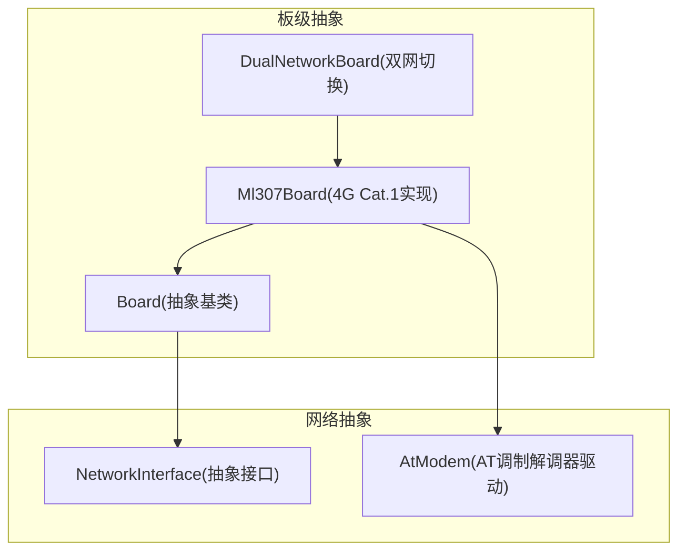
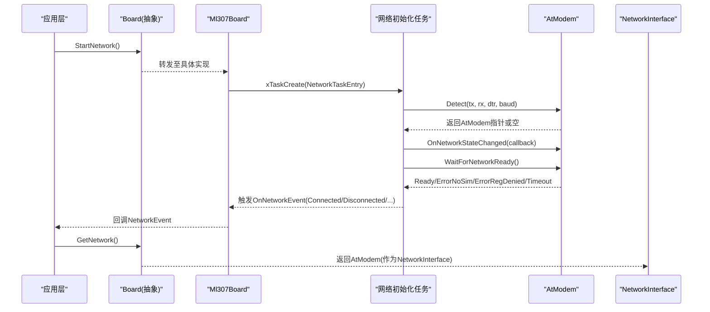
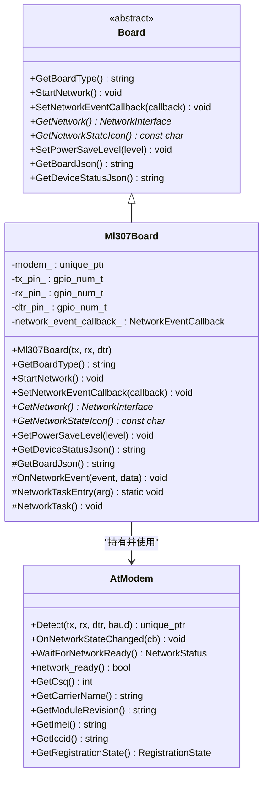
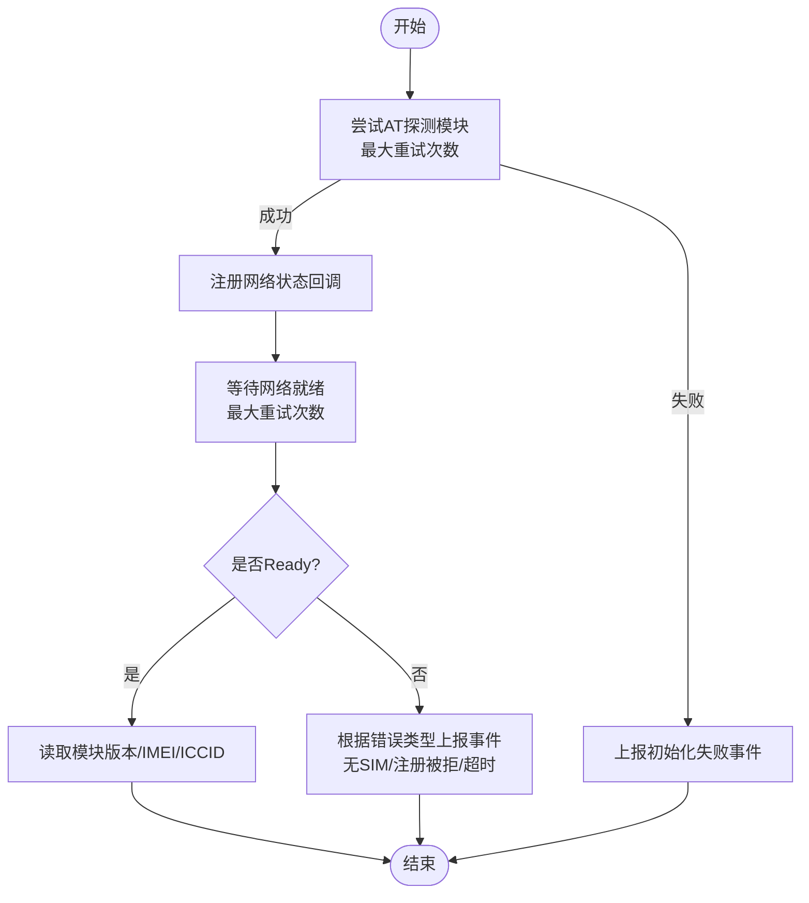
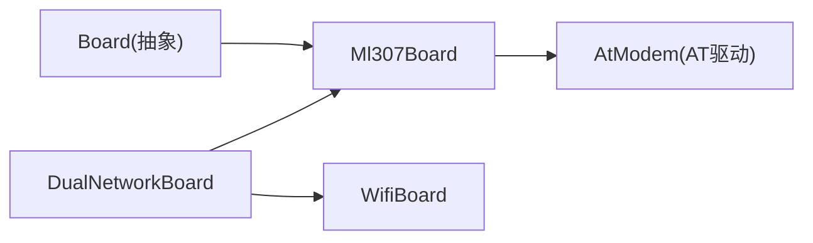

# 4G Cat.1网络接口

<cite>
**本文引用的文件列表**
- [ml307_board.h](file://main/boards/common/ml307_board.h)
- [ml307_board.cc](file://main/boards/common/ml307_board.cc)
- [board.h](file://main/boards/common/board.h)
- [dual_network_board.h](file://main/boards/common/dual_network_board.h)
- [dual_network_board.cc](file://main/boards/common/dual_network_board.cc)
</cite>

## 目录
1. [简介](#简介)
2. [项目结构](#项目结构)
3. [核心组件](#核心组件)
4. [架构总览](#架构总览)
5. [详细组件分析](#详细组件分析)
6. [依赖关系分析](#依赖关系分析)
7. [性能与功耗考虑](#性能与功耗考虑)
8. [故障诊断与调试指南](#故障诊断与调试指南)
9. [结论](#结论)
10. [附录：AT指令参考与示例](#附录at指令参考与示例)

## 简介
本技术文档围绕4G Cat.1网络接口的实现，重点解析 Ml307Board 类的设计与实现，涵盖4G模块初始化、AT指令通信协议抽象、数据流传输机制、网络连接建立流程、SIM卡状态检测、运营商信息获取、网络注册过程、信号强度监测、网络切换逻辑、错误码处理与异常恢复、功耗管理与休眠唤醒策略、流量统计能力，以及调试方法与性能优化建议。读者可据此快速理解并扩展基于ML307的4G联网能力。

## 项目结构
本项目采用“板级抽象 + 网络抽象”的分层设计：
- Board 抽象层定义统一的设备能力与网络接口（如 StartNetwork、GetNetwork、SetNetworkEventCallback 等）。
- Ml307Board 作为具体4G Cat.1板卡实现，封装 AT 调制解调器驱动与网络事件回调。
- DualNetworkBoard 提供 WiFi 与 ML307 双网切换的统一入口。

图表来源
- [ml307_board.h:9-36](file://main/boards/common/ml307_board.h#L9-L36)
- [ml307_board.cc:134-145](file://main/boards/common/ml307_board.cc#L134-L145)
- [dual_network_board.h:16-46](file://main/boards/common/dual_network_board.h#L16-L46)
- [dual_network_board.cc:35-43](file://main/boards/common/dual_network_board.cc#L35-L43)

章节来源
- [ml307_board.h:1-38](file://main/boards/common/ml307_board.h#L1-L38)
- [ml307_board.cc:1-271](file://main/boards/common/ml307_board.cc#L1-L271)
- [board.h:1-93](file://main/boards/common/board.h#L1-L93)
- [dual_network_board.h:1-46](file://main/boards/common/dual_network_board.h#L1-L46)
- [dual_network_board.cc:1-99](file://main/boards/common/dual_network_board.cc#L1-L99)

## 核心组件
- Ml307Board：4G Cat.1板卡的具体实现，负责：
  - 通过串口与AT调制解调器通信，完成模块探测、网络注册、状态上报。
  - 将底层网络事件转换为统一 NetworkEvent 回调。
  - 暴露 GetNetwork() 返回 AtModem 实例，供上层以 NetworkInterface 方式访问。
  - 提供信号强度图标映射、设备状态JSON输出。
- Board 抽象：定义所有板卡必须实现的接口，包括网络启动、事件回调、网络状态图标、电源管理级别等。
- DualNetworkBoard：在WiFi与ML307之间进行运行时选择与重启切换，对外透明转发调用。

章节来源
- [ml307_board.h:9-36](file://main/boards/common/ml307_board.h#L9-L36)
- [ml307_board.cc:27-65](file://main/boards/common/ml307_board.cc#L27-L65)
- [board.h:49-85](file://main/boards/common/board.h#L49-L85)
- [dual_network_board.h:16-46](file://main/boards/common/dual_network_board.h#L16-L46)
- [dual_network_board.cc:35-43](file://main/boards/common/dual_network_board.cc#L35-L43)

## 架构总览
下图展示了从应用侧到4G模块的整体交互路径：应用通过 Board 抽象发起网络启动；Ml307Board 创建独立任务执行模块探测与网络注册；AtModem 负责AT命令收发与网络状态回调；上层通过 NetworkInterface 使用TCP/UDP/MQTT/WebSocket等协议栈。

图表来源
- [ml307_board.cc:134-141](file://main/boards/common/ml307_board.cc#L134-L141)
- [ml307_board.cc:67-132](file://main/boards/common/ml307_board.cc#L67-L132)
- [ml307_board.cc:143-145](file://main/boards/common/ml307_board.cc#L143-L145)

## 详细组件分析

### Ml307Board 类设计与实现
- 成员与职责
  - modem_：指向 AtModem 的智能指针，封装AT驱动与网络状态。
  - tx_pin_/rx_pin_/dtr_pin_：串口引脚配置。
  - network_event_callback_：统一网络事件回调，向外部通知连接状态与错误。
  - NetworkTask()/NetworkTaskEntry()：在FreeRTOS任务中执行模块探测与网络注册。
- 关键方法
  - StartNetwork()：异步创建网络初始化任务，避免阻塞主流程。
  - SetNetworkEventCallback()：设置上层回调，用于UI或业务逻辑响应。
  - GetNetwork()：返回 AtModem 指针，作为 NetworkInterface 使用。
  - GetNetworkStateIcon()：根据CSQ值映射为信号图标。
  - GetDeviceStatusJson()/GetBoardJson()：汇总设备与网络状态，便于远程监控。
  - SetPowerSaveLevel()：当前未实现ML307省电策略占位。

图表来源
- [ml307_board.h:9-36](file://main/boards/common/ml307_board.h#L9-L36)
- [ml307_board.cc:134-145](file://main/boards/common/ml307_board.cc#L134-L145)
- [ml307_board.cc:147-166](file://main/boards/common/ml307_board.cc#L147-L166)
- [ml307_board.cc:168-179](file://main/boards/common/ml307_board.cc#L168-L179)

章节来源
- [ml307_board.h:1-38](file://main/boards/common/ml307_board.h#L1-L38)
- [ml307_board.cc:20-25](file://main/boards/common/ml307_board.cc#L20-L25)
- [ml307_board.cc:27-65](file://main/boards/common/ml307_board.cc#L27-L65)
- [ml307_board.cc:67-132](file://main/boards/common/ml307_board.cc#L67-L132)
- [ml307_board.cc:134-145](file://main/boards/common/ml307_board.cc#L134-L145)
- [ml307_board.cc:147-166](file://main/boards/common/ml307_board.cc#L147-L166)
- [ml307_board.cc:168-179](file://main/boards/common/ml307_board.cc#L168-L179)
- [ml307_board.cc:181-184](file://main/boards/common/ml307_board.cc#L181-L184)

### 4G网络连接建立流程
- 模块探测：按固定波特率尝试AT握手，最多重试若干次。
- 网络状态回调：注册网络就绪/断开回调，以便实时通知上层。
- 等待注册：循环等待网络就绪，区分无SIM、注册被拒、超时等错误。
- 成功后采集模块版本、IMEI、ICCID等信息。

图表来源
- [ml307_board.cc:67-132](file://main/boards/common/ml307_board.cc#L67-L132)

章节来源
- [ml307_board.cc:67-132](file://main/boards/common/ml307_board.cc#L67-L132)

### SIM卡状态检测与运营商信息获取
- SIM卡状态：通过等待网络就绪的错误码判断是否插入SIM卡。
- 运营商信息：在网络就绪后查询运营商名称，同时输出模块版本、IMEI、ICCID。
- 注意：为避免阻塞接收任务，不要在网络状态回调中直接发送AT命令。

章节来源
- [ml307_board.cc:105-132](file://main/boards/common/ml307_board.cc#L105-L132)
- [ml307_board.cc:168-179](file://main/boards/common/ml307_board.cc#L168-L179)

### 网络注册过程与信号强度监测
- 网络注册：通过等待网络就绪的状态机推进，支持多次重试与错误分类。
- 信号强度：依据CSQ值映射为不同信号等级图标，供UI显示。

章节来源
- [ml307_board.cc:105-123](file://main/boards/common/ml307_board.cc#L105-L123)
- [ml307_board.cc:147-166](file://main/boards/common/ml307_board.cc#L147-L166)

### 网络切换逻辑（双网）
- DualNetworkBoard 根据配置选择当前网络类型（WiFi或ML307），并在需要时保存配置并重启系统以切换生效。
- 对外统一转发 Board 接口调用，对上层透明。

章节来源
- [dual_network_board.h:16-46](file://main/boards/common/dual_network_board.h#L16-L46)
- [dual_network_board.cc:23-33](file://main/boards/common/dual_network_board.cc#L23-L33)
- [dual_network_board.cc:35-43](file://main/boards/common/dual_network_board.cc#L35-L43)
- [dual_network_board.cc:45-57](file://main/boards/common/dual_network_board.cc#L45-L57)

### 数据流传输机制
- 上层通过 Board::GetNetwork() 获取 NetworkInterface 指针，实际指向 AtModem 实例。
- 上层可使用HTTP/WebSocket/MQTT/UDP等协议栈，经由该接口进行数据收发。

章节来源
- [ml307_board.cc:143-145](file://main/boards/common/ml307_board.cc#L143-L145)
- [board.h:76-78](file://main/boards/common/board.h#L76-L78)

### 错误码处理与异常恢复
- 错误事件：无SIM、注册被拒、初始化失败、操作超时等，均通过统一事件上报。
- 恢复策略：
  - 模块探测失败：按最大重试次数间隔重试。
  - 网络注册失败：按最大重试次数轮询等待，期间持续上报错误事件。
  - 网络断开：通过回调通知上层，由上层决定重连策略。

章节来源
- [ml307_board.cc:31-65](file://main/boards/common/ml307_board.cc#L31-L65)
- [ml307_board.cc:67-132](file://main/boards/common/ml307_board.cc#L67-L132)

### 功耗管理与休眠唤醒策略
- 当前 Ml307Board::SetPowerSaveLevel 为占位实现，未接入ML307省电模式控制。
- 建议在后续版本中结合模块AT指令实现：
  - 空闲降频/休眠
  - 周期性唤醒上报
  - 按需唤醒收发数据

章节来源
- [ml307_board.cc:181-184](file://main/boards/common/ml307_board.cc#L181-L184)

### 流量统计功能
- 当前代码未提供内置流量统计接口。
- 建议在上层协议栈（HTTP/WebSocket/MQTT）中累计发送/接收字节数，并通过 GetDeviceStatusJson 或自定义API上报。

[本节为通用建议，不直接分析具体文件]

## 依赖关系分析
- Ml307Board 依赖 AtModem 驱动完成AT通信与网络状态管理。
- Board 抽象定义了统一接口，使上层无需关心具体网络实现。
- DualNetworkBoard 组合了 Ml307Board 与 WifiBoard，并提供切换能力。

图表来源
- [ml307_board.h:9-36](file://main/boards/common/ml307_board.h#L9-L36)
- [dual_network_board.h:16-46](file://main/boards/common/dual_network_board.h#L16-L46)

章节来源
- [ml307_board.h:1-38](file://main/boards/common/ml307_board.h#L1-L38)
- [dual_network_board.h:1-46](file://main/boards/common/dual_network_board.h#L1-L46)

## 性能与功耗考虑
- 任务隔离：网络初始化在独立任务中运行，避免阻塞主线程。
- 重试退避：模块探测与网络注册采用固定间隔重试，防止频繁AT命令导致拥塞。
- 回调安全：在网络状态回调中避免发送AT命令，防止阻塞接收任务。
- 信号图标映射：基于CSQ阈值划分信号等级，减少UI抖动。
- 功耗：当前未实现ML307省电策略，可在后续版本引入模块休眠/唤醒控制以降低功耗。

[本节为通用建议，不直接分析具体文件]

## 故障诊断与调试指南
- 日志定位：
  - 模块探测阶段：关注“检测模块...”、“初始化失败”等日志。
  - 网络注册阶段：关注“注册网络...”、“已连接/已断开”及错误事件。
- 常见错误与处理：
  - 无SIM卡：检查SIM插拔与PIN码锁定。
  - 注册被拒：确认运营商鉴权与套餐状态。
  - 操作超时：检查天线与信号质量，必要时调整重试间隔。
- 调试手段：
  - 启用串口调试，观察AT命令交互。
  - 通过 GetDeviceStatusJson 获取网络类型、运营商、信号强度等状态。
  - 使用双网切换功能验证不同网络的连通性与稳定性。

章节来源
- [ml307_board.cc:31-65](file://main/boards/common/ml307_board.cc#L31-L65)
- [ml307_board.cc:186-270](file://main/boards/common/ml307_board.cc#L186-L270)

## 结论
Ml307Board 提供了完整的4G Cat.1网络接入能力，包含模块探测、网络注册、状态回调、信号强度显示与设备状态输出。其设计遵循Board抽象与AtModem驱动分离的原则，具备良好的可扩展性。后续可进一步完善功耗管理、流量统计与更丰富的AT指令封装，以满足低功耗与高可靠性的场景需求。

[本节为总结性内容，不直接分析具体文件]

## 附录：AT指令参考与示例
说明：以下AT指令为ML307常用指令集合，供开发者参考与调试使用。实际项目中应通过 AtModem 驱动封装调用，避免直接拼接字符串。

- 基本查询
  - AT+CGMI：查询制造商信息
  - AT+CGMM：查询模块型号
  - AT+CGMR：查询固件版本
  - AT+GSN：查询IMEI
  - AT+CIMI：查询IMSI
  - AT+CCID：查询ICCID
- 网络状态
  - AT+CSQ：查询信号强度（CSQ）
  - AT+CEREG？：查询网络注册状态
  - AT+COPS？：查询运营商信息
  - AT+CREG？：查询GPRS注册状态
- 数据承载
  - AT+CGDCONT：设置PDP上下文（APN等）
  - AT+CGACT：激活/去激活PDP上下文
- 拨号与数据通道
  - ATD*99***1#：PPP拨号（视平台而定）
  - AT+CGDATA：进入数据模式（视平台而定）
- 电源管理（视模块固件支持）
  - AT+CFUN=1,1：软复位
  - AT+CFUN=0：关闭射频（需确认模块支持）
  - AT+SLEEP：进入睡眠（需确认模块支持）

注意：
- 不同厂商/固件版本的AT指令可能存在差异，请以模块手册为准。
- 在回调或高频路径中避免发送AT命令，以免阻塞接收任务。
- 建议将AT指令封装为原子操作，并增加超时与重试机制。

[本节为概念性参考，不直接分析具体文件]