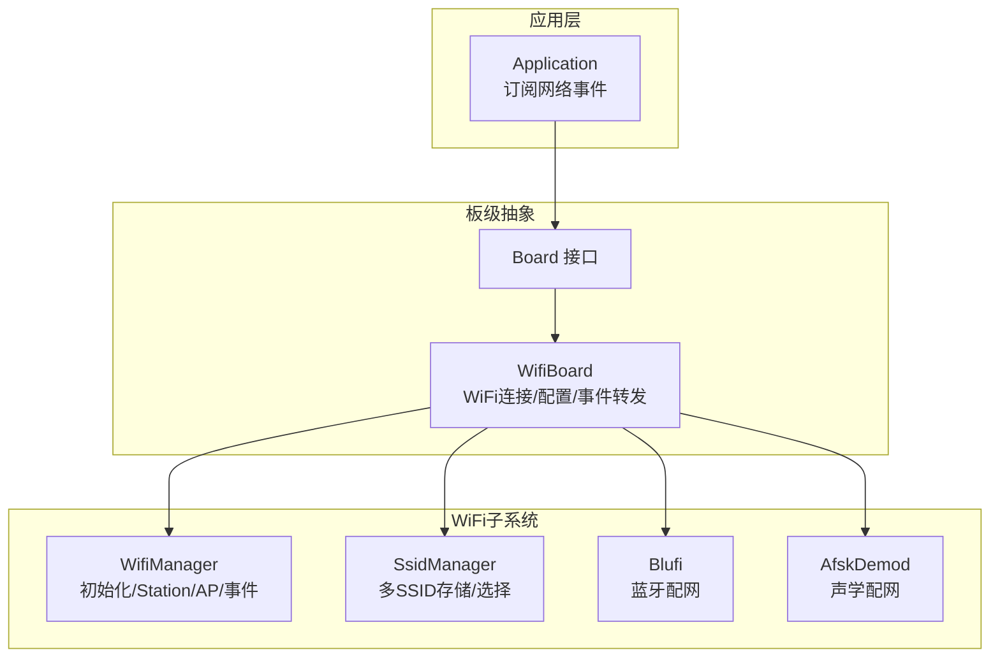
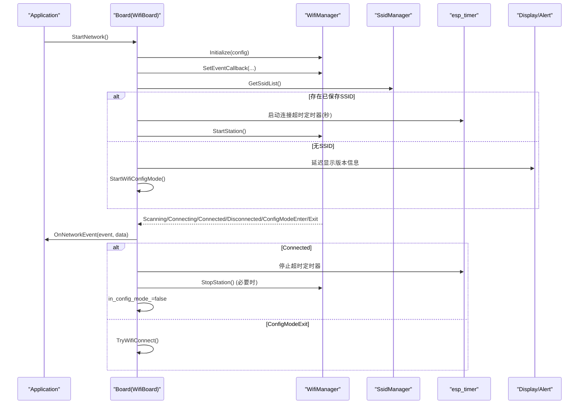
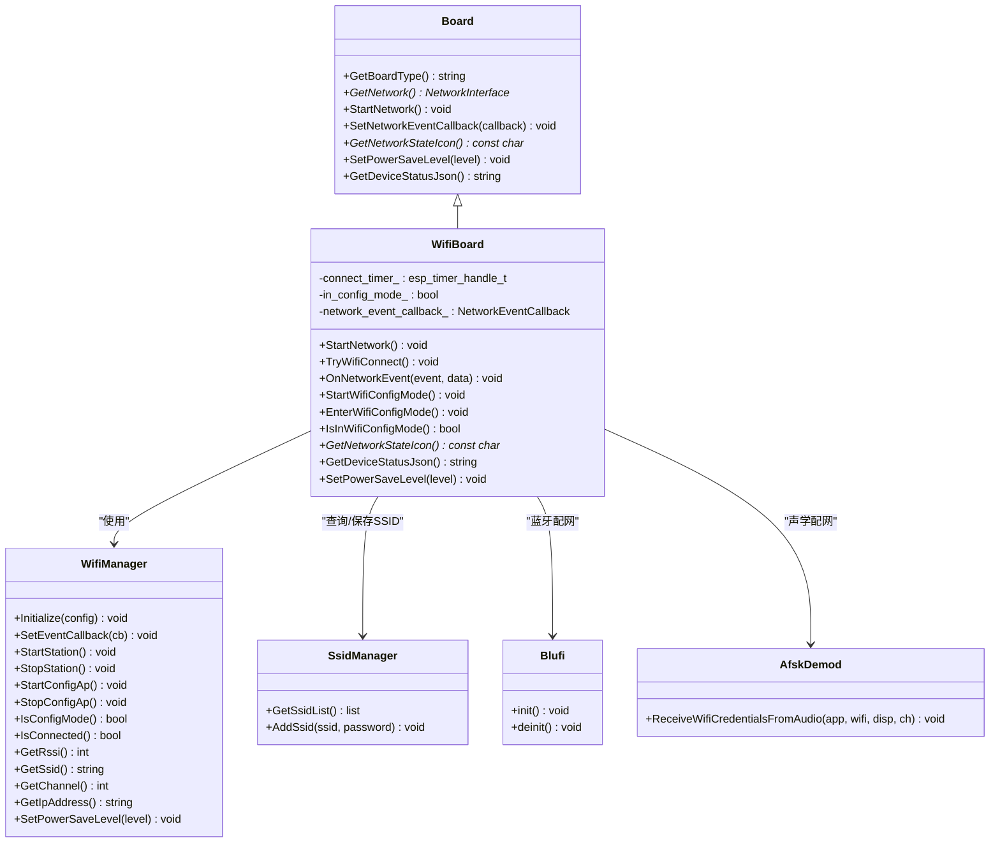
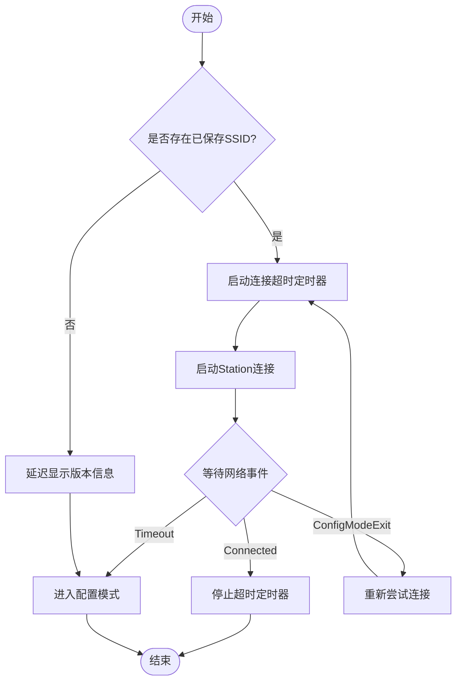
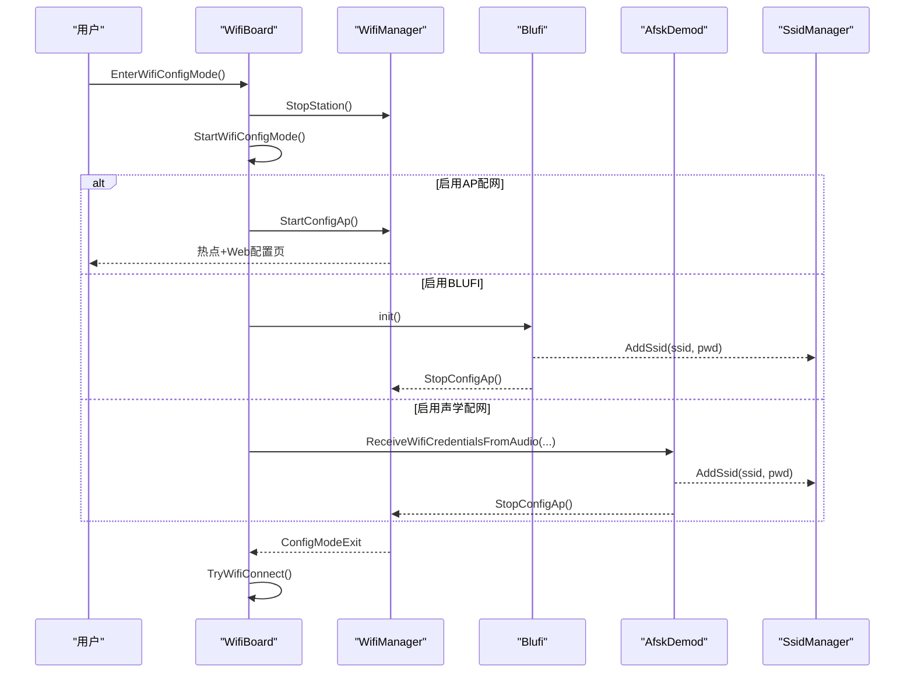
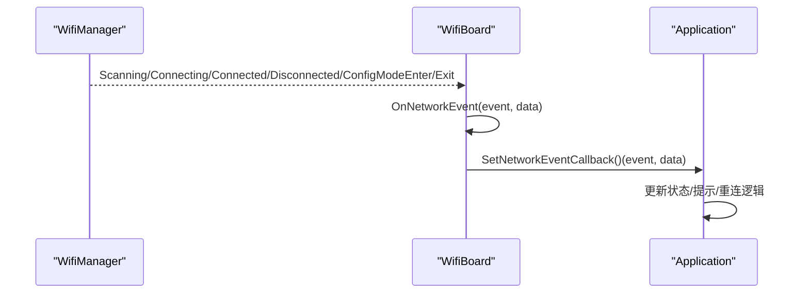
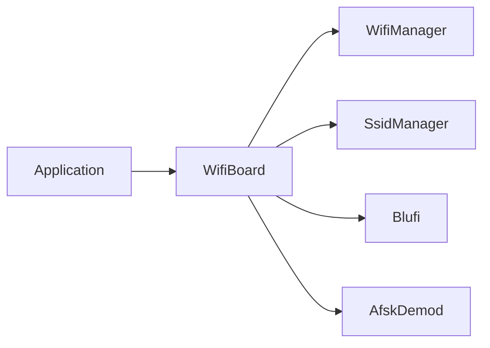

# WiFi网络接口

<cite>
**本文引用的文件**   
- [wifi_board.h](file://main/boards/common/wifi_board.h)
- [wifi_board.cc](file://main/boards/common/wifi_board.cc)
- [board.h](file://main/boards/common/board.h)
- [application.cc](file://main/application.cc)
- [blufi.cpp](file://main/boards/common/blufi.cpp)
- [afsk_demod.cc](file://main/boards/common/afsk_demod.cc)
</cite>

## 目录
1. [简介](#简介)
2. [项目结构](#项目结构)
3. [核心组件](#核心组件)
4. [架构总览](#架构总览)
5. [详细组件分析](#详细组件分析)
6. [依赖关系分析](#依赖关系分析)
7. [性能与功耗考量](#性能与功耗考量)
8. [故障排查指南](#故障排查指南)
9. [结论](#结论)
10. [附录](#附录)

## 简介
本技术文档聚焦于WiFi网络接口的实现，围绕WifiBoard类的设计与实现进行深入解析。内容涵盖：
- WiFi连接管理、配置模式处理（AP Web配置、蓝牙配网、声学配网）
- 网络事件回调机制与状态同步
- 异步启动流程、连接超时处理与自动重连策略
- 信号强度检测与网络质量评估
- 安全认证方式（WPA2/WPA3）、多SSID支持、静态IP配置的集成点说明
- 调试技巧与性能优化建议

## 项目结构
本项目采用分层与模块化组织方式，WiFi相关能力集中在common板级抽象层中，通过统一的Board接口向上提供网络接入能力。关键文件如下：
- main/boards/common/wifi_board.h/.cc：WifiBoard实现，负责WiFi生命周期、事件转发、配置模式切换、电源策略等
- main/boards/common/board.h：定义统一网络事件枚举、回调类型及Board抽象接口
- main/application.cc：应用层订阅网络事件，驱动设备状态机
- main/boards/common/blufi.cpp：蓝牙配网（ESP-BLUFI）集成
- main/boards/common/afsk_demod.cc：声学配网（音频载波传输SSID/密码）集成

图表来源
- [wifi_board.h:1-70](file://main/boards/common/wifi_board.h#L1-L70)
- [wifi_board.cc:1-358](file://main/boards/common/wifi_board.cc#L1-L358)
- [board.h:1-93](file://main/boards/common/board.h#L1-L93)
- [blufi.cpp:717-748](file://main/boards/common/blufi.cpp#L717-L748)
- [afsk_demod.cc:83-109](file://main/boards/common/afsk_demod.cc#L83-L109)

章节来源
- [wifi_board.h:1-70](file://main/boards/common/wifi_board.h#L1-L70)
- [wifi_board.cc:1-358](file://main/boards/common/wifi_board.cc#L1-L358)
- [board.h:1-93](file://main/boards/common/board.h#L1-L93)

## 核心组件
- WifiBoard：封装WiFi连接生命周期、配置模式切换、事件转发、电源策略、状态图标与设备状态JSON输出
- Board接口：定义网络事件回调、网络状态图标、电源等级设置等统一能力
- Application：订阅网络事件，驱动设备状态机（如进入/退出配网态）
- WifiManager/SsidManager：底层WiFi管理与多SSID管理（由框架提供）
- Blufi/AfskDemod：可选的蓝牙/声学配网通道

章节来源
- [wifi_board.h:1-70](file://main/boards/common/wifi_board.h#L1-L70)
- [wifi_board.cc:1-358](file://main/boards/common/wifi_board.cc#L1-L358)
- [board.h:1-93](file://main/boards/common/board.h#L1-L93)
- [application.cc:101-151](file://main/application.cc#L101-L151)

## 架构总览
下图展示从应用层到WiFi子系统的调用链路与事件流转。

图表来源
- [wifi_board.cc:52-104](file://main/boards/common/wifi_board.cc#L52-L104)
- [wifi_board.cc:106-145](file://main/boards/common/wifi_board.cc#L106-L145)
- [wifi_board.cc:151-157](file://main/boards/common/wifi_board.cc#L151-L157)
- [application.cc:101-151](file://main/application.cc#L101-L151)

## 详细组件分析

### WifiBoard类设计与实现
- 职责边界
  - 负责WiFi连接的异步启动、超时控制、配置模式切换
  - 将底层WiFi事件转换为统一NetworkEvent并通知上层
  - 提供网络状态图标、设备状态JSON、电源策略映射
- 关键成员与方法
  - connect_timer_：连接超时定时器句柄
  - in_config_mode_：当前是否处于配置模式
  - network_event_callback_：外部回调，用于向Application转发事件
  - StartNetwork()/TryWifiConnect()/OnNetworkEvent()/StartWifiConfigMode()/EnterWifiConfigMode()
  - GetNetworkStateIcon()/GetDeviceStatusJson()/SetPowerSaveLevel()

图表来源
- [wifi_board.h:1-70](file://main/boards/common/wifi_board.h#L1-L70)
- [wifi_board.cc:1-358](file://main/boards/common/wifi_board.cc#L1-L358)
- [board.h:1-93](file://main/boards/common/board.h#L1-L93)
- [blufi.cpp:717-748](file://main/boards/common/blufi.cpp#L717-L748)
- [afsk_demod.cc:83-109](file://main/boards/common/afsk_demod.cc#L83-L109)

章节来源
- [wifi_board.h:1-70](file://main/boards/common/wifi_board.h#L1-L70)
- [wifi_board.cc:1-358](file://main/boards/common/wifi_board.cc#L1-L358)
- [board.h:1-93](file://main/boards/common/board.h#L1-L93)

### 异步启动流程与超时处理
- 异步启动
  - StartNetwork()初始化WifiManager并注册事件回调，随后TryWifiConnect()决定是尝试连接还是进入配置模式
- 超时处理
  - 若存在已保存SSID，则启动一次性定时器；超时后停止Station并进入配置模式
- 自动重连策略
  - 当收到ConfigModeExit事件时，自动再次尝试连接（TryWifiConnect），形成“配置完成→自动重连”的闭环

图表来源
- [wifi_board.cc:52-104](file://main/boards/common/wifi_board.cc#L52-L104)
- [wifi_board.cc:151-157](file://main/boards/common/wifi_board.cc#L151-L157)
- [wifi_board.cc:106-145](file://main/boards/common/wifi_board.cc#L106-L145)

章节来源
- [wifi_board.cc:52-104](file://main/boards/common/wifi_board.cc#L52-L104)
- [wifi_board.cc:106-145](file://main/boards/common/wifi_board.cc#L106-L145)
- [wifi_board.cc:151-157](file://main/boards/common/wifi_board.cc#L151-L157)

### 配置模式处理（AP Web界面、蓝牙配网、声学配网）
- AP Web配置
  - 通过WifiManager.StartConfigAp()开启热点，并在提示中给出浏览器访问地址
- 蓝牙配网（BLUFI）
  - 初始化Blufi协议栈，接收手机APP下发的SSID/密码，写入SsidManager后退出配置模式
- 声学配网
  - 启动音频解码任务，从音频流中解析SSID/密码，写入SsidManager后退出配置模式

图表来源
- [wifi_board.cc:159-197](file://main/boards/common/wifi_board.cc#L159-L197)
- [wifi_board.cc:199-238](file://main/boards/common/wifi_board.cc#L199-L238)
- [blufi.cpp:717-748](file://main/boards/common/blufi.cpp#L717-L748)
- [afsk_demod.cc:83-109](file://main/boards/common/afsk_demod.cc#L83-L109)

章节来源
- [wifi_board.cc:159-197](file://main/boards/common/wifi_board.cc#L159-L197)
- [wifi_board.cc:199-238](file://main/boards/common/wifi_board.cc#L199-L238)
- [blufi.cpp:717-748](file://main/boards/common/blufi.cpp#L717-L748)
- [afsk_demod.cc:83-109](file://main/boards/common/afsk_demod.cc#L83-L109)

### 网络事件回调机制
- 事件源
  - WifiManager内部事件（扫描、连接中、已连接、断开、进入/退出配置模式）
- 事件转发
  - WifiBoard::OnNetworkEvent将底层事件映射为统一NetworkEvent，并通过SetNetworkEventCallback回调给Application
- 应用侧处理
  - Application根据事件更新UI、状态机或触发后续动作（如断线重连、提示用户）

图表来源
- [wifi_board.cc:62-83](file://main/boards/common/wifi_board.cc#L62-L83)
- [wifi_board.cc:106-145](file://main/boards/common/wifi_board.cc#L106-L145)
- [application.cc:101-151](file://main/application.cc#L101-L151)
- [board.h:19-44](file://main/boards/common/board.h#L19-L44)

章节来源
- [wifi_board.cc:62-83](file://main/boards/common/wifi_board.cc#L62-L83)
- [wifi_board.cc:106-145](file://main/boards/common/wifi_board.cc#L106-L145)
- [application.cc:101-151](file://main/application.cc#L101-L151)
- [board.h:19-44](file://main/boards/common/board.h#L19-L44)

### 信号强度检测与网络质量评估
- 信号强度
  - 通过WifiManager.GetRssi()获取RSSI值
- 质量分级
  - 图标显示：强/一般/弱三档阈值（例如≥-65dBm为强，-65~-75dBm为一般，<-75dBm为弱）
  - 设备状态JSON中包含signal字段（strong/medium/weak）

章节来源
- [wifi_board.cc:249-266](file://main/boards/common/wifi_board.cc#L249-L266)
- [wifi_board.cc:335-342](file://main/boards/common/wifi_board.cc#L335-L342)

### 高级功能集成点
- 安全认证（WPA2/WPA3）
  - 由底层WifiManager与系统WiFi栈负责，无需在应用层显式指定
- 多SSID支持
  - 通过SsidManager.AddSsid/GetSsidList进行增删查，支持多个候选SSID
- 静态IP配置
  - 通常由底层网络栈或平台配置项控制；如需固定IP，建议在构建配置或底层网络初始化处设置，避免与应用层耦合

章节来源
- [wifi_board.cc:89-104](file://main/boards/common/wifi_board.cc#L89-L104)
- [blufi.cpp:717-748](file://main/boards/common/blufi.cpp#L717-L748)
- [afsk_demod.cc:83-109](file://main/boards/common/afsk_demod.cc#L83-L109)

## 依赖关系分析
- 模块耦合
  - WifiBoard依赖WifiManager/SsidManager/Blufi/AfskDemod，但通过事件回调与状态查询解耦
- 外部依赖
  - FreeRTOS定时器、日志、显示与语言资源
- 潜在循环依赖
  - 未发现直接循环依赖；事件回调单向从底层到应用层

图表来源
- [wifi_board.cc:1-358](file://main/boards/common/wifi_board.cc#L1-L358)
- [application.cc:101-151](file://main/application.cc#L101-L151)

章节来源
- [wifi_board.cc:1-358](file://main/boards/common/wifi_board.cc#L1-L358)
- [application.cc:101-151](file://main/application.cc#L101-L151)

## 性能与功耗考量
- 连接超时
  - 合理设置超时时间，避免长时间阻塞；默认60秒可根据部署环境调整
- 电源策略
  - 通过SetPowerSaveLevel映射到WifiPowerSaveLevel，平衡吞吐与功耗
- 事件处理
  - 避免在回调中执行耗时操作，必要时调度至后台任务
- 配网体验
  - 优先使用AP Web或BLUFI，减少用户输入错误；声学配网适合无屏场景

章节来源
- [wifi_board.cc:27-28](file://main/boards/common/wifi_board.cc#L27-L28)
- [wifi_board.cc:284-299](file://main/boards/common/wifi_board.cc#L284-L299)

## 故障排查指南
- 无法连接
  - 检查是否已保存SSID；确认超时后是否进入配置模式
  - 查看日志中的Scanning/Connecting/Connected/Disconnected事件顺序
- 频繁断线
  - 关注RSSI变化与信号等级；考虑调整天线位置或信道干扰
- 配网失败
  - AP Web：确认热点名称与浏览器URL是否正确
  - BLUFI：确认手机APP权限与蓝牙配对流程
  - 声学配网：确保麦克风通道数正确且环境噪声较低
- 状态不一致
  - 核对in_config_mode_标志与WifiManager.IsConfigMode()返回值
  - 确认定时器是否被正确停止/重启

章节来源
- [wifi_board.cc:106-145](file://main/boards/common/wifi_board.cc#L106-L145)
- [wifi_board.cc:151-157](file://main/boards/common/wifi_board.cc#L151-L157)
- [wifi_board.cc:240-242](file://main/boards/common/wifi_board.cc#L240-L242)

## 结论
WifiBoard以简洁清晰的职责划分，将WiFi连接、配置模式与事件回调整合到统一的Board抽象之上，既保证了可移植性，又提供了良好的扩展点。通过定时器驱动的超时保护与配置完成后自动重连，提升了首次上电与异常恢复的用户体验。结合RSSI与信号等级评估，便于上层进行网络质量感知与告警。

## 附录
- 术语
  - RSSI：接收信号强度指示
  - SSID：无线网络名称
  - BLUFI：蓝牙低功耗配网协议
- 参考路径
  - 网络事件定义：[board.h:19-44](file://main/boards/common/board.h#L19-L44)
  - 事件回调注册与处理：[application.cc:101-151](file://main/application.cc#L101-L151)
  - 配网入口与提示：[wifi_board.cc:159-197](file://main/boards/common/wifi_board.cc#L159-L197)