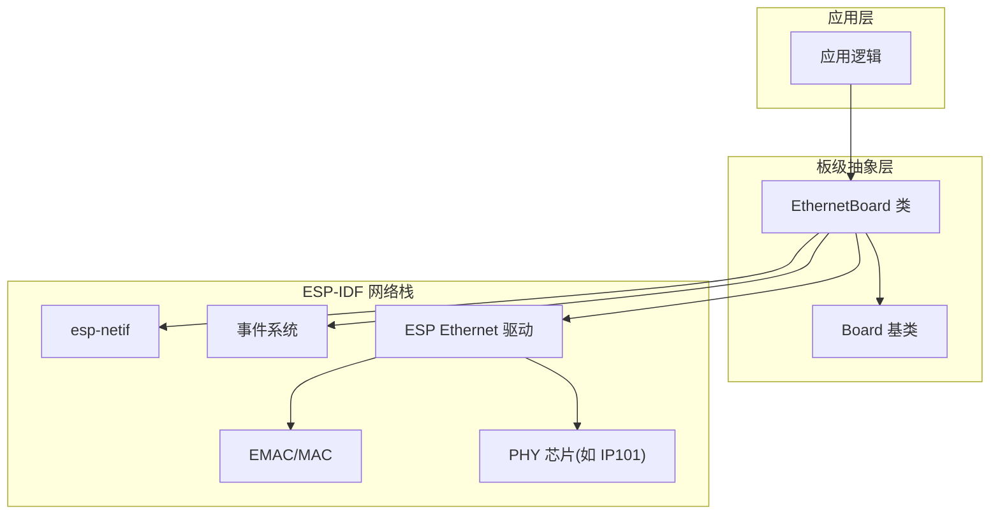
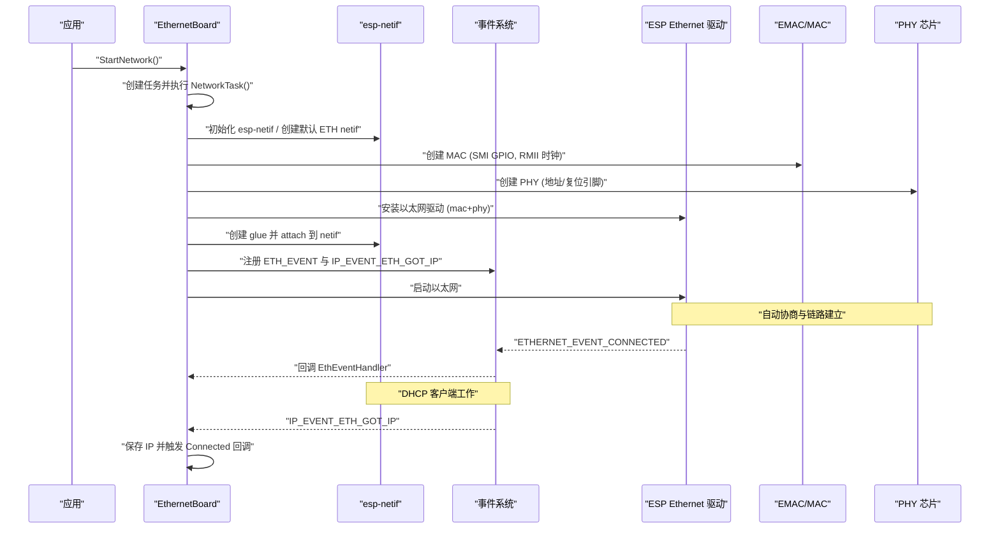
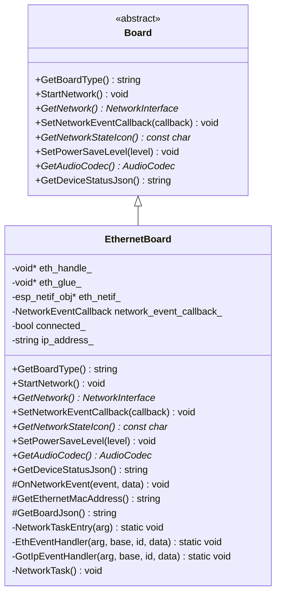
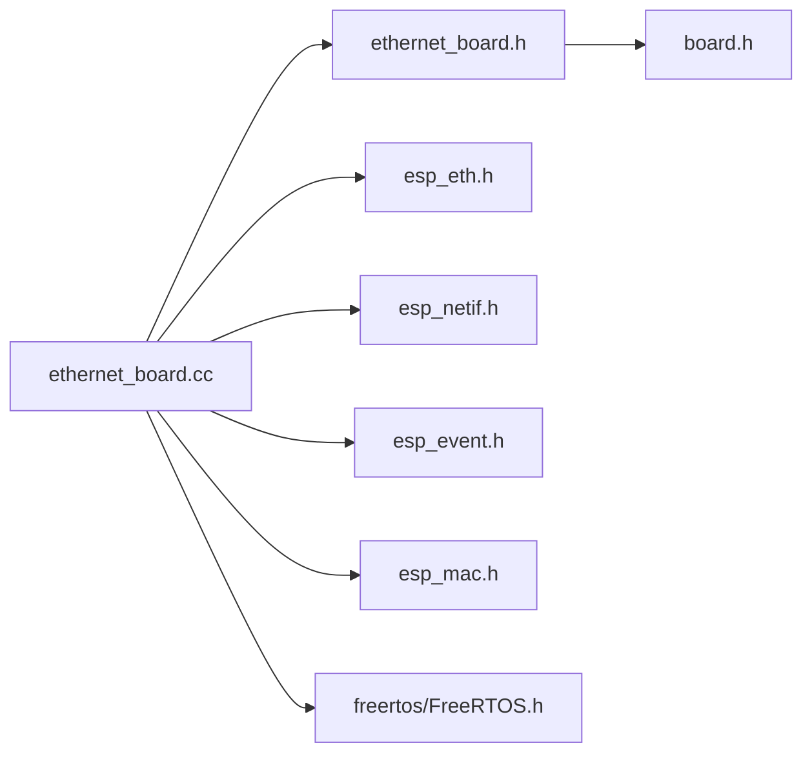

# 以太网网络接口

<cite>
**本文引用的文件列表**
- [ethernet_board.h](file://main/boards/common/ethernet_board.h)
- [ethernet_board.cc](file://main/boards/common/ethernet_board.cc)
- [sdkconfig.defaults](file://sdkconfig.defaults)
- [sdkconfig.defaults.esp32s3](file://sdkconfig.defaults.esp32s3)
</cite>

## 目录
1. [简介](#简介)
2. [项目结构](#项目结构)
3. [核心组件](#核心组件)
4. [架构总览](#架构总览)
5. [详细组件分析](#详细组件分析)
6. [依赖关系分析](#依赖关系分析)
7. [性能与调优](#性能与调优)
8. [故障排查指南](#故障排查指南)
9. [结论](#结论)
10. [附录](#附录)

## 简介
本技术文档围绕以太网网络接口的实现，重点解析 EthernetBoard 类的设计与工作流程，涵盖 PHY 初始化、MAC 配置、网络参数设置、链路状态检测、自动协商机制、DHCP 获取 IP 流程、事件回调与设备状态上报等。同时提供驱动配置项说明、中断与 DMA 相关要点、以及面向开发者的调试与性能调优建议。

## 项目结构
本项目将以太网能力封装为通用板级抽象层的一部分，位于 boards/common 目录下。EthernetBoard 继承自 Board 基类，负责以太网驱动的创建、启动、事件处理与上层网络接口暴露。

图表来源
- [ethernet_board.h:8-39](file://main/boards/common/ethernet_board.h#L8-L39)
- [ethernet_board.cc:75-151](file://main/boards/common/ethernet_board.cc#L75-L151)

章节来源
- [ethernet_board.h:1-41](file://main/boards/common/ethernet_board.h#L1-L41)
- [ethernet_board.cc:1-303](file://main/boards/common/ethernet_board.cc#L1-L303)

## 核心组件
- EthernetBoard：以太网板级实现，负责以太网驱动生命周期管理、事件注册与回调、IP 地址维护、设备状态 JSON 输出。
- ESP-IDF 网络栈：通过 esp-netif 与事件系统完成以太网接口挂载、DHCP 客户端运行与 IP 获取。
- EMAC/MAC 与 PHY：通过 SMI（MDC/MDIO）总线访问 PHY，进行自动协商与链路状态检测；DMA 缓冲由驱动内部管理与配置。

章节来源
- [ethernet_board.h:8-39](file://main/boards/common/ethernet_board.h#L8-L39)
- [ethernet_board.cc:24-55](file://main/boards/common/ethernet_board.cc#L24-L55)
- [ethernet_board.cc:75-151](file://main/boards/common/ethernet_board.cc#L75-L151)

## 架构总览
下图展示了从调用 StartNetwork 到获得 IP 的完整时序，包括 MAC/PHY 初始化、驱动安装、netif 绑定、事件注册与 DHCP 流程。

图表来源
- [ethernet_board.cc:65-151](file://main/boards/common/ethernet_board.cc#L65-L151)
- [ethernet_board.cc:153-196](file://main/boards/common/ethernet_board.cc#L153-L196)

## 详细组件分析

### EthernetBoard 类设计与职责
- 成员变量
  - 驱动句柄、glue、netif 指针用于管理底层驱动与网络接口。
  - 网络连接状态与当前 IP 字符串缓存，供 UI 或状态查询使用。
  - 网络事件回调函数指针，用于向应用层推送连接状态变化。
- 关键方法
  - StartNetwork：在独立任务中初始化网络栈、创建 MAC/PHY、安装驱动、注册事件、启动以太网。
  - OnNetworkEvent：统一的事件分发，记录日志并调用上层回调。
  - GetNetwork：返回统一的网络接口对象，供上层协议栈使用。
  - GetDeviceStatusJson：聚合音频、屏幕、电池、网络等状态信息，便于远程监控。
  - GetBoardJson：输出板卡类型、名称、网络类型、IP、MAC 等信息。

图表来源
- [ethernet_board.h:8-39](file://main/boards/common/ethernet_board.h#L8-L39)
- [ethernet_board.cc:57-221](file://main/boards/common/ethernet_board.cc#L57-L221)

章节来源
- [ethernet_board.h:8-39](file://main/boards/common/ethernet_board.h#L8-L39)
- [ethernet_board.cc:57-221](file://main/boards/common/ethernet_board.cc#L57-L221)

### PHY 芯片初始化与自动协商
- 支持通过编译选项选择具体 PHY 型号（例如 IP101），若未启用则返回空指针，导致初始化失败。
- PHY 配置包含地址与复位引脚，均来源于配置宏。
- 自动协商由 PHY 与交换机侧共同完成，驱动会在 ETHERNET_EVENT_CONNECTED 时通知链路已建立。

章节来源
- [ethernet_board.cc:24-30](file://main/boards/common/ethernet_board.cc#L24-L30)
- [ethernet_board.cc:100-119](file://main/boards/common/ethernet_board.cc#L100-L119)
- [ethernet_board.cc:153-182](file://main/boards/common/ethernet_board.cc#L153-L182)

### 以太网 MAC 配置与 RMII 接口
- MAC 配置通过 EMAC 驱动创建，指定 SMI 总线引脚（MDC/MDIO）、RMII 数据接口模式、外部时钟输入与 DMA 突发长度等。
- 根据 SoC 能力宏，可配置 RMII 数据引脚映射与时钟回环模式。
- mdc_freq_hz 设置为 0 表示采用默认频率。

章节来源
- [ethernet_board.cc:32-55](file://main/boards/common/ethernet_board.cc#L32-L55)

### 网络参数设置与 DHCP 流程
- 通过 esp-netif 创建默认以太网接口，并将驱动 glue 附加到该接口。
- 注册 ETH_EVENT 与 IP_EVENT_ETH_GOT_IP 事件处理器。
- 启动以太网后，由 DHCP 客户端自动获取 IP；当收到 GOT_IP 事件时，更新本地 IP 并触发 Connected 回调。

章节来源
- [ethernet_board.cc:75-151](file://main/boards/common/ethernet_board.cc#L75-L151)
- [ethernet_board.cc:184-196](file://main/boards/common/ethernet_board.cc#L184-L196)

### 静态 IP 配置
- 当前实现未内置静态 IP 设置入口。如需静态 IP，可在 esp-netif 创建后、启动驱动前，通过 esp-netif API 设置 IP 信息（例如设置 IP、掩码、网关）。
- 注意：若使用静态 IP，应确保不依赖 DHCP，避免等待 GOT_IP 事件。

章节来源
- [ethernet_board.cc:92-144](file://main/boards/common/ethernet_board.cc#L92-L144)

### 以太网链路状态检测与事件回调
- 链路断开/停止时会清空 IP 并标记未连接，向上层发送 Disconnected 事件。
- 链路建立时打印 MAC 地址，作为链路连通性确认。
- 上层可通过 SetNetworkEventCallback 订阅连接状态变化。

章节来源
- [ethernet_board.cc:153-182](file://main/boards/common/ethernet_board.cc#L153-L182)
- [ethernet_board.cc:198-216](file://main/boards/common/ethernet_board.cc#L198-L216)

### 中断处理与 DMA 缓冲区管理
- 中断优先级通过 EMAC 配置中的 intr_priority 字段设置。
- DMA 突发长度通过 dma_burst_len 配置，影响吞吐与 CPU 占用平衡。
- 实际中断与 DMA 缓冲分配由 ESP-IDF 驱动内部完成，上层无需直接操作。

章节来源
- [ethernet_board.cc:32-55](file://main/boards/common/ethernet_board.cc#L32-L55)

### 网络质量监控、丢包率统计与延迟测试
- 当前代码未内置以太网丢包率统计与延迟测试功能。
- 建议在应用层基于 TCP/UDP 套接字实现 ping 或自定义探测报文，结合时间戳计算往返延迟与丢包率。
- 可将结果纳入 GetDeviceStatusJson 的网络子对象中，便于远程查看。

章节来源
- [ethernet_board.cc:251-302](file://main/boards/common/ethernet_board.cc#L251-L302)

### 设备状态与板卡信息输出
- GetDeviceStatusJson：汇总音频、屏幕、电池、网络（类型、状态、IP）与芯片温度等信息。
- GetBoardJson：输出板卡类型、名称、网络类型、IP、MAC 等基础信息。

章节来源
- [ethernet_board.cc:236-245](file://main/boards/common/ethernet_board.cc#L236-L245)
- [ethernet_board.cc:251-302](file://main/boards/common/ethernet_board.cc#L251-L302)

## 依赖关系分析
- 头文件依赖
  - ethernet_board.h 依赖 board.h，定义 EthernetBoard 对 Board 的继承关系。
- 运行时依赖
  - 依赖 ESP-IDF 的 esp_eth、esp_netif、esp_event、esp_mac 等模块。
  - 依赖 FreeRTOS 任务调度以异步启动网络初始化。

图表来源
- [ethernet_board.h:1-7](file://main/boards/common/ethernet_board.h#L1-L7)
- [ethernet_board.cc:1-21](file://main/boards/common/ethernet_board.cc#L1-L21)

章节来源
- [ethernet_board.h:1-7](file://main/boards/common/ethernet_board.h#L1-L7)
- [ethernet_board.cc:1-21](file://main/boards/common/ethernet_board.cc#L1-L21)

## 性能与调优
- DMA 与中断
  - 调整 DMA 突发长度与中断优先级，在高吞吐场景下可降低 CPU 负载。
- 时钟与引脚
  - 确保 RMII 时钟源与引脚映射正确，避免信号完整性问题导致的降速或断链。
- 内存与堆
  - 合理配置 SPIRAM 与 malloc 策略，避免网络收发时的内存碎片化。
- 任务栈与事件循环
  - 保证网络任务栈大小足够，避免初始化过程中因栈溢出导致崩溃。
- 日志级别
  - 生产环境适当降低日志级别以减少开销。

章节来源
- [ethernet_board.cc:32-55](file://main/boards/common/ethernet_board.cc#L32-L55)
- [sdkconfig.defaults:18-21](file://sdkconfig.defaults#L18-L21)
- [sdkconfig.defaults.esp32s3:15-19](file://sdkconfig.defaults.esp32s3#L15-L19)

## 故障排查指南
- 无法创建 MAC/PHY
  - 检查 SMI 引脚（MDC/MDIO）与 RMII 时钟引脚是否正确配置。
  - 确认 PHY 地址与复位引脚配置宏与实际硬件一致。
- 驱动安装失败
  - 检查资源是否被其他模块占用，确认事件循环与 netif 初始化顺序。
- 链路不上或频繁断开
  - 核对网线与交换机端口，确认自动协商速率匹配。
  - 检查时钟源与布线质量。
- 无法获取 IP
  - 确认 DHCP 服务器可用，观察 GOT_IP 事件是否触发。
  - 如需静态 IP，请在 netif 上设置 IP 信息并避免依赖 DHCP。
- 状态上报异常
  - 检查 GetDeviceStatusJson 构建过程，确认 cJSON 对象创建与释放无误。

章节来源
- [ethernet_board.cc:75-151](file://main/boards/common/ethernet_board.cc#L75-L151)
- [ethernet_board.cc:153-196](file://main/boards/common/ethernet_board.cc#L153-L196)
- [ethernet_board.cc:251-302](file://main/boards/common/ethernet_board.cc#L251-L302)

## 结论
EthernetBoard 提供了完整的以太网接入能力，涵盖 PHY/MAC 初始化、驱动安装、事件处理与 DHCP 获取 IP 的全流程。其设计清晰、模块化良好，易于扩展静态 IP、网络质量监控等功能。开发者可根据实际需求调整 DMA/中断配置与日志级别，以获得更好的性能与稳定性。

## 附录

### 驱动配置选项（编译期宏）
- CONFIG_XIAOZHI_ETH_MDC_GPIO：SMI MDC 引脚号
- CONFIG_XIAOZHI_ETH_MDIO_GPIO：SMI MDIO 引脚号
- CONFIG_XIAOZHI_ETH_PHY_ADDR：PHY 地址
- CONFIG_XIAOZHI_ETH_PHY_RST_GPIO：PHY 复位引脚
- CONFIG_XIAOZHI_ETH_PHY_IP101：启用 IP101 PHY 支持

章节来源
- [ethernet_board.cc:32-55](file://main/boards/common/ethernet_board.cc#L32-L55)
- [ethernet_board.cc:24-30](file://main/boards/common/ethernet_board.cc#L24-L30)
- [ethernet_board.cc:100-104](file://main/boards/common/ethernet_board.cc#L100-L104)