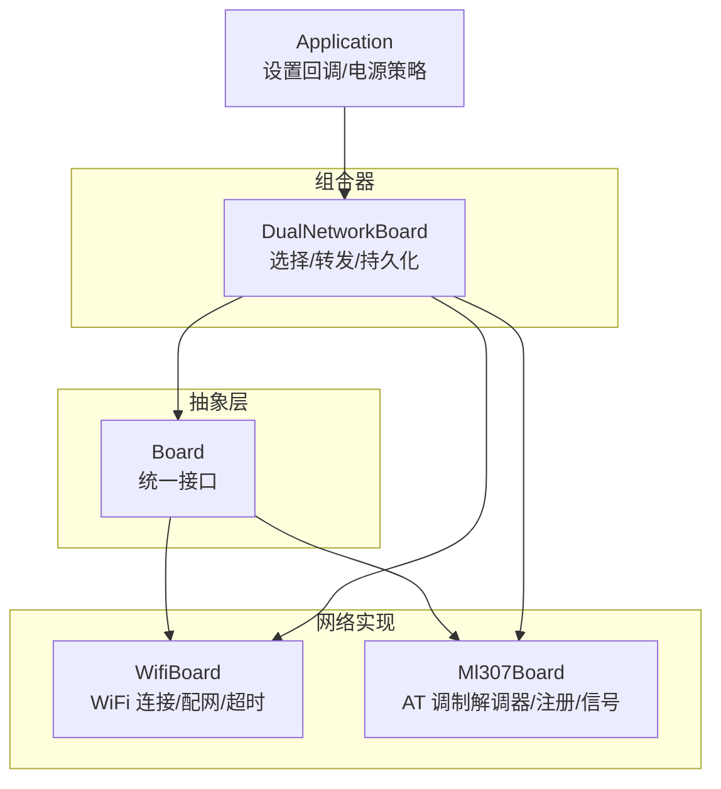
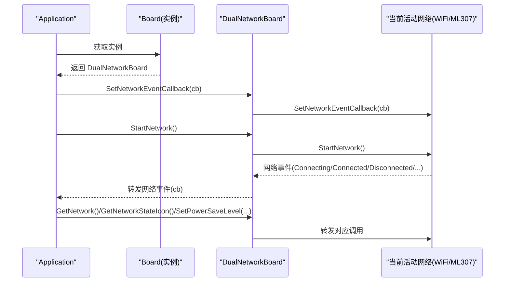
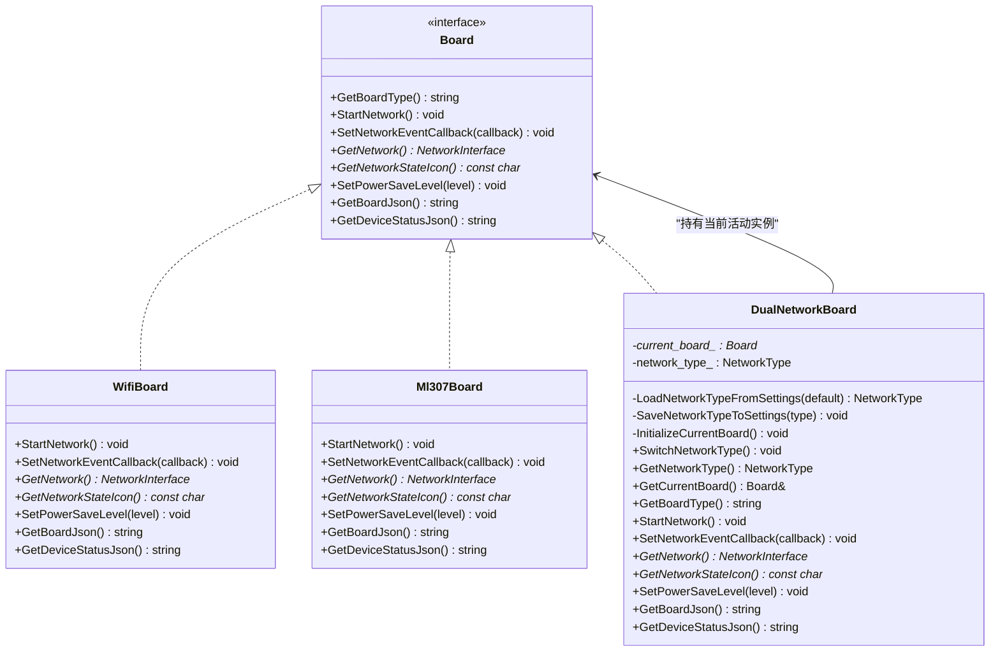
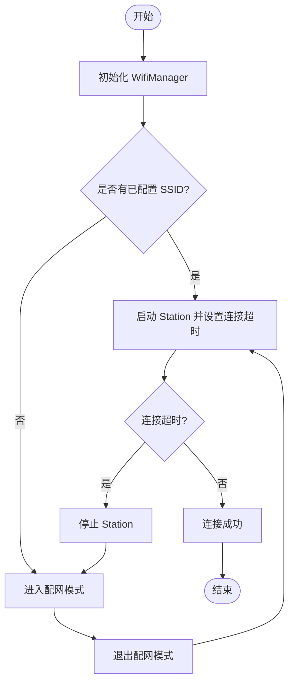
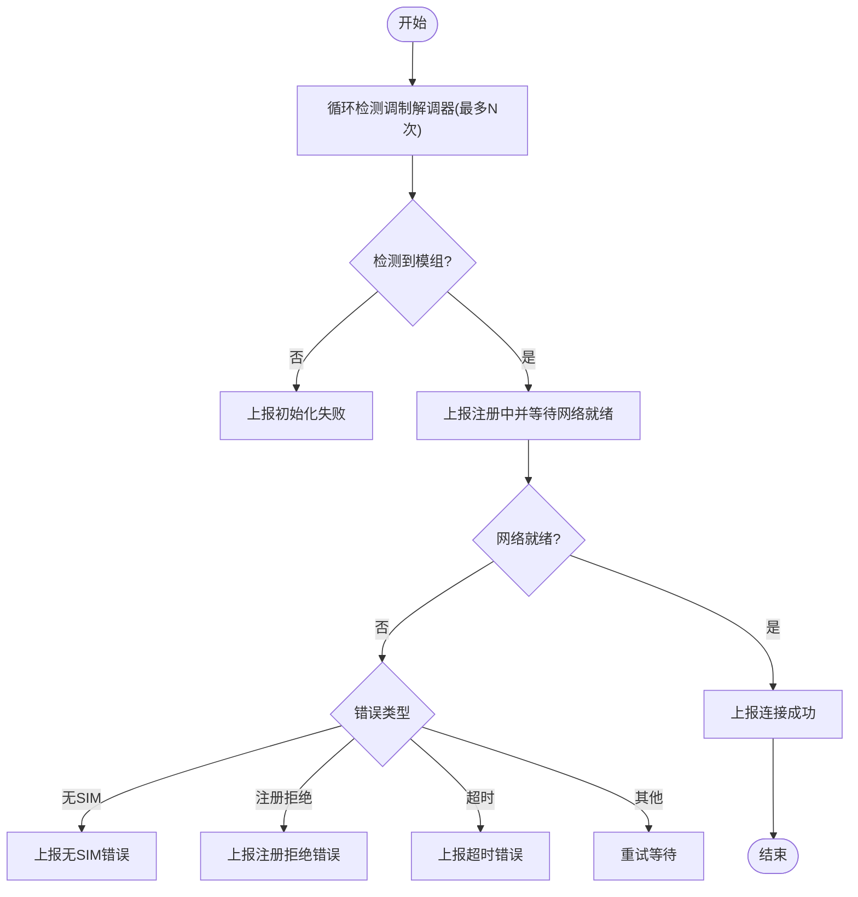
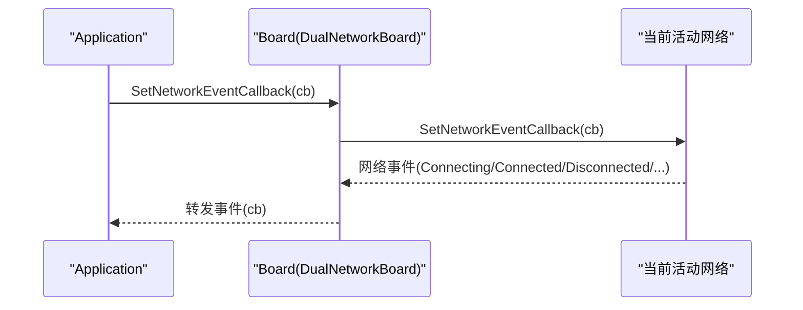
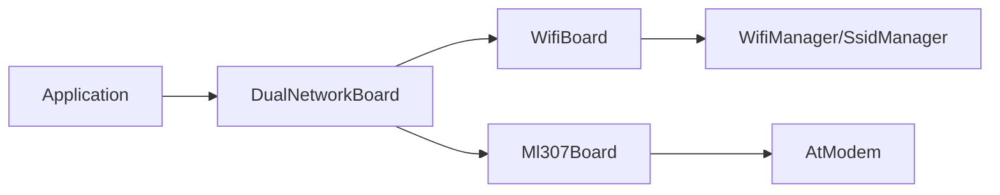

# 双网络管理

<cite>
**本文引用的文件**   
- [dual_network_board.h](file://main/boards/common/dual_network_board.h)
- [dual_network_board.cc](file://main/boards/common/dual_network_board.cc)
- [wifi_board.h](file://main/boards/common/wifi_board.h)
- [wifi_board.cc](file://main/boards/common/wifi_board.cc)
- [ml307_board.h](file://main/boards/common/ml307_board.h)
- [ml307_board.cc](file://main/boards/common/ml307_board.cc)
- [board.h](file://main/boards/common/board.h)
- [application.cc](file://main/application.cc)
</cite>

## 目录
1. [简介](#简介)
2. [项目结构](#项目结构)
3. [核心组件](#核心组件)
4. [架构总览](#架构总览)
5. [详细组件分析](#详细组件分析)
6. [依赖关系分析](#依赖关系分析)
7. [性能与资源](#性能与资源)
8. [故障排查指南](#故障排查指南)
9. [结论](#结论)
10. [附录](#附录)

## 简介
本技术文档围绕双网络管理系统，重点解析 DualNetworkBoard 类的设计与实现。该系统在 WiFi 与 4G（ML307）之间进行“当前活动网络”的选择与管理，提供：
- 启动时从持久化配置加载网络类型
- 手动切换网络并重启生效
- 将网络事件、网络接口、状态图标、电源策略等能力委托给当前活动网络板卡
- 通过统一回调机制向上层暴露网络事件

需要特别说明的是：当前代码库中的 DualNetworkBoard 采用“单活动网络 + 重启切换”的策略，并非“并发双活 + 动态无缝切换”。因此，关于“并发连接的数据路由、负载均衡、会话保持”等内容，在当前实现中并不存在；如需这些能力，需要在现有基础上扩展设计。

## 项目结构
与双网络管理直接相关的核心文件位于 boards/common 目录下，包含抽象基类 Board 以及具体网络实现 WifiBoard、Ml307Board，以及组合器 DualNetworkBoard。上层应用通过 Board 的工厂模式创建实例，并通过统一的 NetworkEventCallback 接收网络事件。

图示来源
- [board.h:1-93](file://main/boards/common/board.h#L1-L93)
- [wifi_board.h:1-70](file://main/boards/common/wifi_board.h#L1-L70)
- [ml307_board.h:1-39](file://main/boards/common/ml307_board.h#L1-L39)
- [dual_network_board.h:1-60](file://main/boards/common/dual_network_board.h#L1-L60)

章节来源
- [board.h:1-93](file://main/boards/common/board.h#L1-L93)
- [dual_network_board.h:1-60](file://main/boards/common/dual_network_board.h#L1-L60)

## 核心组件
- Board 抽象接口
  - 定义网络相关统一接口：StartNetwork、SetNetworkEventCallback、GetNetwork、GetNetworkStateIcon、SetPowerSaveLevel、GetBoardJson、GetDeviceStatusJson 等。
  - 定义统一网络事件枚举 NetworkEvent，涵盖 WiFi 扫描/连接/断开/配网模式，以及蜂窝调制解调器的检测/错误/超时等事件。
- WifiBoard
  - 基于 WifiManager 完成 WiFi 连接、超时进入配网模式、RSSI 强度图标映射、设备状态 JSON 输出等。
- Ml307Board
  - 基于 AT 调制解调器驱动，完成模组检测、网络注册等待、CSQ 信号强度映射、设备状态 JSON 输出等。
- DualNetworkBoard
  - 维护当前活动网络类型（WIFI 或 ML307），从 Settings 加载默认值，初始化对应 Board 实例，并将所有网络相关调用转发到当前活动 Board。
  - 提供 SwitchNetworkType 方法用于手动切换网络类型，写入持久化配置后触发系统重启以生效。

章节来源
- [board.h:1-93](file://main/boards/common/board.h#L1-L93)
- [wifi_board.h:1-70](file://main/boards/common/wifi_board.h#L1-L70)
- [ml307_board.h:1-39](file://main/boards/common/ml307_board.h#L1-L39)
- [dual_network_board.h:1-60](file://main/boards/common/dual_network_board.h#L1-L60)

## 架构总览
下图展示了上层应用与双网络管理的关系，以及事件流与数据流向。

图示来源
- [application.cc:101](file://main/application.cc#L101)
- [dual_network_board.cc:64-98](file://main/boards/common/dual_network_board.cc#L64-L98)
- [wifi_board.cc:52-87](file://main/boards/common/wifi_board.cc#L52-L87)
- [ml307_board.cc:134-141](file://main/boards/common/ml307_board.cc#L134-L141)

## 详细组件分析

### DualNetworkBoard 设计与实现
- 职责
  - 根据持久化配置决定当前活动网络类型（WIFI 或 ML307）。
  - 仅初始化当前活动网络对应的 Board 实例，避免不必要的资源占用。
  - 将所有网络相关 API 调用转发至当前活动 Board。
  - 提供手动切换网络类型的入口，并在切换后重启设备使新配置生效。
- 关键流程
  - 构造阶段：从 Settings 读取 network.type，映射为 NetworkType::WIFI 或 NetworkType::ML307，随后 InitializeCurrentBoard 创建对应实例。
  - 启动阶段：StartNetwork 先更新显示状态，再调用当前 Board 的 StartNetwork。
  - 事件转发：SetNetworkEventCallback 将回调保存至当前 Board，后续由该 Board 内部触发回调。
  - 切换逻辑：SwitchNetworkType 写入新的 network.type，显示提示，延时后调用 Application::Reboot 重启。
- 限制与说明
  - 当前未实现“双活并发”和“在线热切换”，切换需重启。
  - 未实现自动故障转移与智能切换算法，仅支持手动切换。

图示来源
- [board.h:1-93](file://main/boards/common/board.h#L1-L93)
- [wifi_board.h:1-70](file://main/boards/common/wifi_board.h#L1-L70)
- [ml307_board.h:1-39](file://main/boards/common/ml307_board.h#L1-L39)
- [dual_network_board.h:1-60](file://main/boards/common/dual_network_board.h#L1-L60)

章节来源
- [dual_network_board.h:1-60](file://main/boards/common/dual_network_board.h#L1-L60)
- [dual_network_board.cc:10-57](file://main/boards/common/dual_network_board.cc#L10-L57)

### WiFi 网络管理（WifiBoard）
- 启动流程
  - 初始化 WifiManager，设置统一事件回调，将底层 WiFi 事件转换为统一 NetworkEvent。
  - TryWifiConnect：若已配置 SSID，则启动连接尝试并设置超时定时器；否则进入配网模式。
- 超时与配网
  - 连接超时后停止 Station，进入配网模式（热点/Blufi/声学等，取决于编译选项）。
  - 退出配网模式后再次尝试连接。
- 状态与图标
  - 根据是否处于配网模式、是否连接、RSSI 强度返回不同图标。
- 电源策略
  - 将 PowerSaveLevel 映射到 WifiPowerSaveLevel 并下发。

图示来源
- [wifi_board.cc:52-104](file://main/boards/common/wifi_board.cc#L52-L104)
- [wifi_board.cc:151-197](file://main/boards/common/wifi_board.cc#L151-L197)

章节来源
- [wifi_board.cc:52-104](file://main/boards/common/wifi_board.cc#L52-L104)
- [wifi_board.cc:151-197](file://main/boards/common/wifi_board.cc#L151-L197)
- [wifi_board.cc:244-266](file://main/boards/common/wifi_board.cc#L244-L266)
- [wifi_board.cc:284-299](file://main/boards/common/wifi_board.cc#L284-L299)

### 4G 网络管理（Ml307Board）
- 启动流程
  - 启动后台任务执行网络初始化：检测调制解调器、注册网络、等待 ready。
  - 设置网络状态变化回调，将 modem 的 ready/disconnect 转换为统一 NetworkEvent。
- 错误处理
  - 针对无 SIM、注册拒绝、初始化失败、操作超时等错误，分别上报相应事件。
- 状态与图标
  - 根据 CSQ 信号强度返回不同图标。
- 电源策略
  - 当前未实现具体策略（占位）。

图示来源
- [ml307_board.cc:67-132](file://main/boards/common/ml307_board.cc#L67-L132)
- [ml307_board.cc:134-141](file://main/boards/common/ml307_board.cc#L134-L141)
- [ml307_board.cc:147-166](file://main/boards/common/ml307_board.cc#L147-L166)

章节来源
- [ml307_board.cc:67-132](file://main/boards/common/ml307_board.cc#L67-L132)
- [ml307_board.cc:134-141](file://main/boards/common/ml307_board.cc#L134-L141)
- [ml307_board.cc:147-166](file://main/boards/common/ml307_board.cc#L147-L166)

### 事件与回调链路
- 上层通过 Board::SetNetworkEventCallback 设置回调，DualNetworkBoard 将其转发至当前活动网络。
- WifiBoard/Ml307Board 在内部收到网络事件后，调用 OnNetworkEvent 并触发外部回调。
- Application 侧注册回调，用于处理连接/断开等状态变化。

图示来源
- [application.cc:101](file://main/application.cc#L101)
- [dual_network_board.cc:75-78](file://main/boards/common/dual_network_board.cc#L75-L78)
- [wifi_board.cc:146-149](file://main/boards/common/wifi_board.cc#L146-L149)
- [ml307_board.cc:27-29](file://main/boards/common/ml307_board.cc#L27-L29)

章节来源
- [application.cc:101](file://main/application.cc#L101)
- [dual_network_board.cc:75-78](file://main/boards/common/dual_network_board.cc#L75-L78)
- [wifi_board.cc:146-149](file://main/boards/common/wifi_board.cc#L146-L149)
- [ml307_board.cc:27-29](file://main/boards/common/ml307_board.cc#L27-L29)

## 依赖关系分析
- 耦合与内聚
  - DualNetworkBoard 对 Board 抽象低耦合，对具体网络实现高内聚（仅负责选择与转发）。
  - WifiBoard/Ml307Board 各自封装了底层细节，符合单一职责原则。
- 外部依赖
  - WifiBoard 依赖 WifiManager、SsidManager、可选 Blufi/声学配网。
  - Ml307Board 依赖 AT 调制解调器驱动（AtModem）。
- 潜在循环依赖
  - 未发现循环依赖；事件回调通过函数对象传递，避免头文件强耦合。

图示来源
- [application.cc:101](file://main/application.cc#L101)
- [dual_network_board.cc:64-98](file://main/boards/common/dual_network_board.cc#L64-L98)
- [wifi_board.cc:52-87](file://main/boards/common/wifi_board.cc#L52-L87)
- [ml307_board.cc:134-141](file://main/boards/common/ml307_board.cc#L134-L141)

章节来源
- [dual_network_board.cc:64-98](file://main/boards/common/dual_network_board.cc#L64-L98)
- [wifi_board.cc:52-87](file://main/boards/common/wifi_board.cc#L52-L87)
- [ml307_board.cc:134-141](file://main/boards/common/ml307_board.cc#L134-L141)

## 性能与资源
- 资源占用
  - 仅初始化当前活动网络，避免同时维护两套栈与任务，降低内存与功耗。
- 启动耗时
  - WiFi 连接带超时控制，超时后进入配网模式，避免长时间阻塞。
  - 4G 注册有最大重试次数与间隔，防止无限等待。
- 电源策略
  - 上层可调用 SetPowerSaveLevel，WifiBoard 会映射到 WifiPowerSaveLevel；Ml307Board 当前未实现具体策略。

章节来源
- [wifi_board.cc:284-299](file://main/boards/common/wifi_board.cc#L284-L299)
- [ml307_board.cc:181-184](file://main/boards/common/ml307_board.cc#L181-L184)

## 故障排查指南
- 常见问题定位
  - WiFi 无法连接：检查是否进入配网模式、是否存在 SSID、是否超时。
  - 4G 无法注册：查看是否检测到模组、是否无 SIM、是否注册被拒、是否超时。
- 日志与状态
  - 使用 GetBoardJson/GetDeviceStatusJson 获取网络类型、信号强度、运营商等信息。
  - 观察网络事件回调，确认 Connecting/Connected/Disconnected 等状态流转。
- 手动切换网络
  - 调用 SwitchNetworkType 写入新的网络类型并重启，重启后按新配置初始化对应网络。

章节来源
- [dual_network_board.cc:45-57](file://main/boards/common/dual_network_board.cc#L45-L57)
- [wifi_board.cc:151-197](file://main/boards/common/wifi_board.cc#L151-L197)
- [ml307_board.cc:67-132](file://main/boards/common/ml307_board.cc#L67-L132)
- [wifi_board.cc:268-282](file://main/boards/common/wifi_board.cc#L268-L282)
- [ml307_board.cc:168-179](file://main/boards/common/ml307_board.cc#L168-L179)

## 结论
- 当前 DualNetworkBoard 实现了“单活动网络 + 持久化选择 + 手动切换 + 重启生效”的双网络管理能力，满足大多数场景下的冗余需求。
- 尚未实现“并发双活、智能切换、自动故障转移、负载均衡、会话保持”等高级特性。若业务需要，可在现有框架上扩展：
  - 增加双栈并行连接与连接池管理
  - 引入健康检查与权重评分，实现自动故障转移与无缝切换
  - 在协议层实现会话保持与流量复制/分流策略
  - 完善 4G 电源策略与能耗优化

## 附录
- 网络事件枚举（节选）
  - Scanning、Connecting、Connected、Disconnected、WifiConfigModeEnter、WifiConfigModeExit
  - ModemDetecting、ModemErrorNoSim、ModemErrorRegDenied、ModemErrorInitFailed、ModemErrorTimeout
- 电源策略枚举（节选）
  - LOW_POWER、BALANCED、PERFORMANCE

章节来源
- [board.h:20-44](file://main/boards/common/board.h#L20-L44)