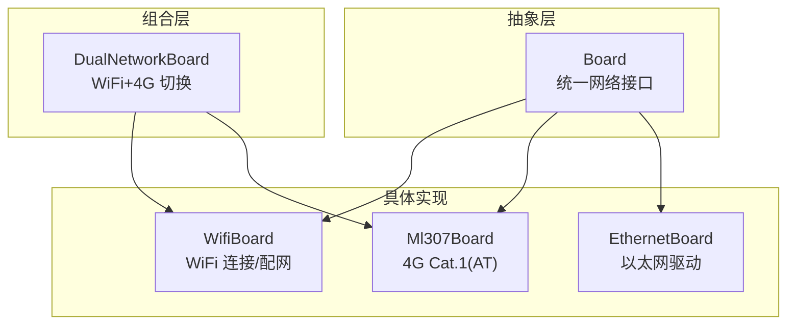
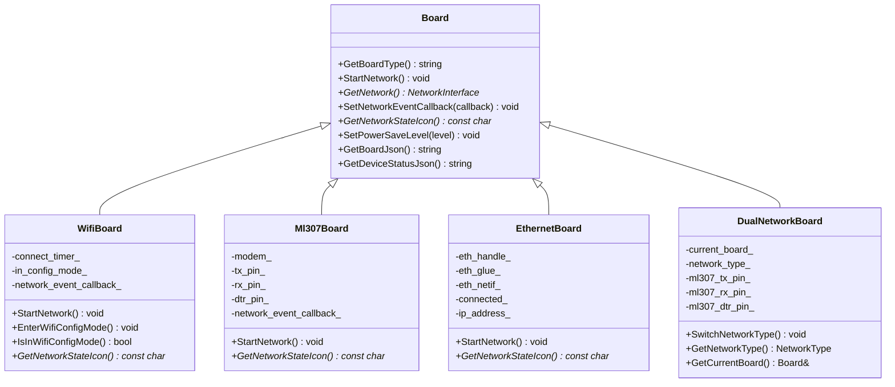
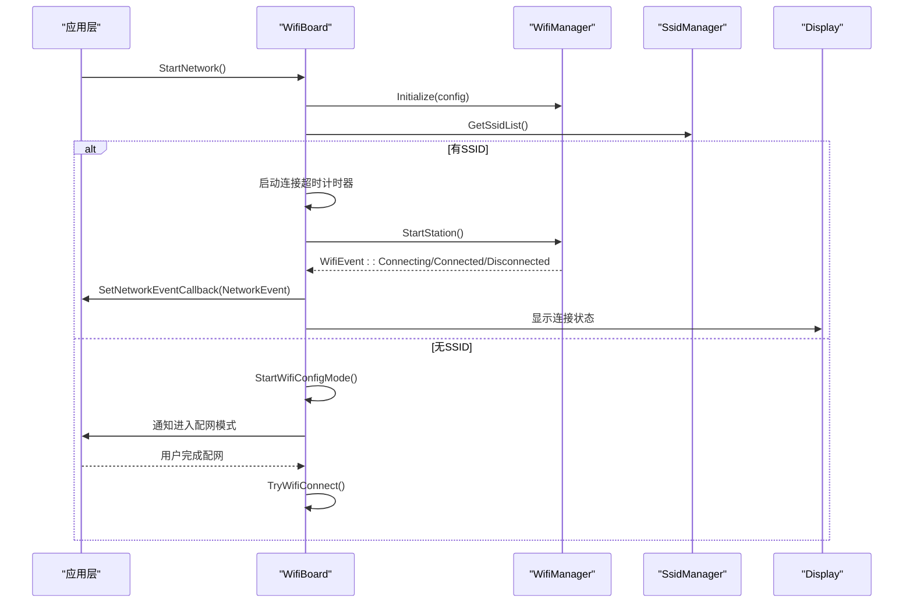
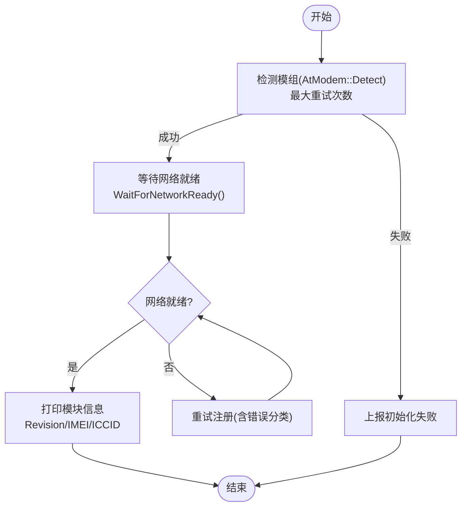
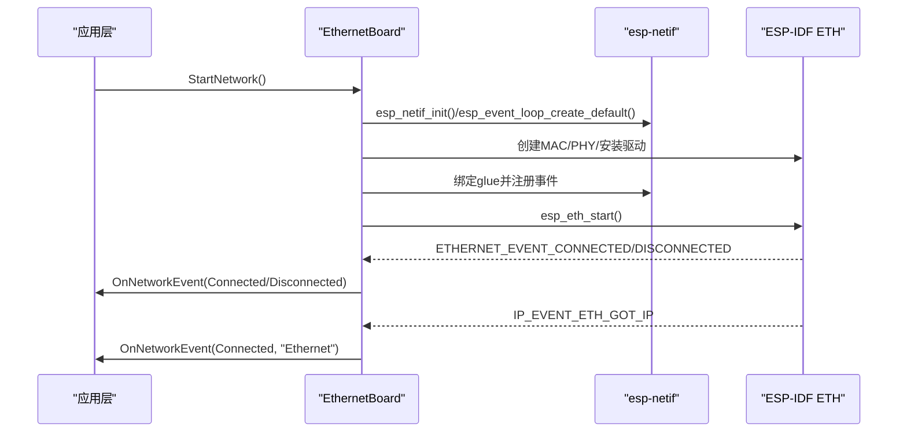
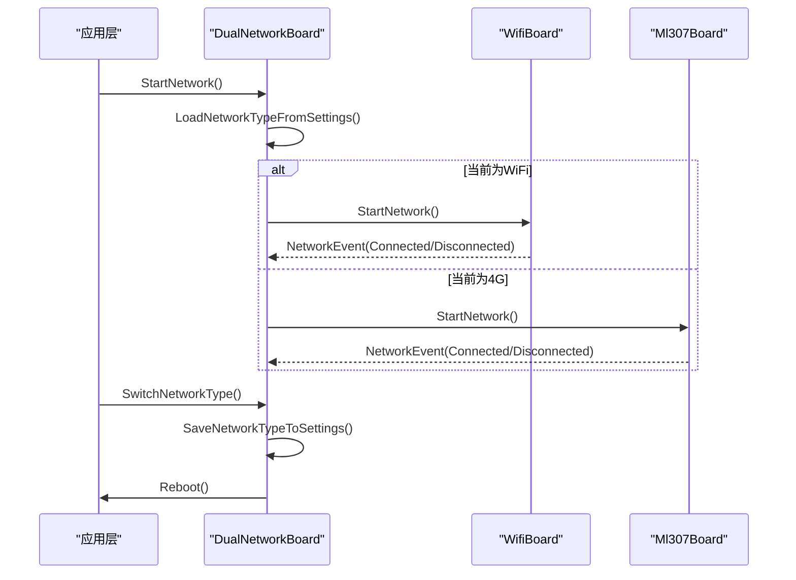
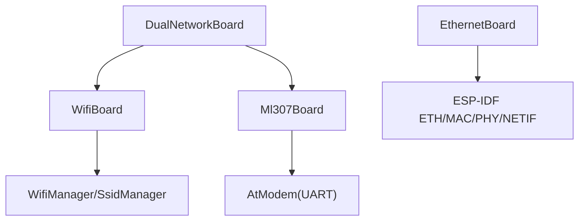

# 网络接口抽象

<cite>
**本文引用的文件**   
- [board.h](file://main/boards/common/board.h)
- [board.cc](file://main/boards/common/board.cc)
- [wifi_board.h](file://main/boards/common/wifi_board.h)
- [wifi_board.cc](file://main/boards/common/wifi_board.cc)
- [ml307_board.h](file://main/boards/common/ml307_board.h)
- [ml307_board.cc](file://main/boards/common/ml307_board.cc)
- [ethernet_board.h](file://main/boards/common/ethernet_board.h)
- [ethernet_board.cc](file://main/boards/common/ethernet_board.cc)
- [dual_network_board.h](file://main/boards/common/dual_network_board.h)
- [dual_network_board.cc](file://main/boards/common/dual_network_board.cc)
</cite>

## 目录
1. [简介](#简介)
2. [项目结构](#项目结构)
3. [核心组件](#核心组件)
4. [架构总览](#架构总览)
5. [详细组件分析](#详细组件分析)
6. [依赖关系分析](#依赖关系分析)
7. [性能考虑](#性能考虑)
8. [故障排查指南](#故障排查指南)
9. [结论](#结论)
10. [附录](#附录)

## 简介
本技术文档聚焦于“网络接口抽象层”的设计与实现，围绕 Board 抽象基类及其具体网络类型实现（WiFi、4G Cat.1、以太网）展开。文档深入解释：
- NetworkInterface 抽象与统一事件模型
- WiFi 板的连接流程与配置模式
- 4G Cat.1（ML307）模块的 AT 通信协议与注册流程
- 以太网的初始化与事件处理
- 双网络支持（WiFi+4G）的切换逻辑与重启策略
- 网络状态监控、连接事件回调、网络质量评估
- 初始化配置示例、错误处理机制、重连策略
- 性能优化建议与调试技巧
- 自定义网络接口的开发指南

## 项目结构
网络相关代码集中在 boards/common 目录下，采用“按功能分层 + 多网络实现”的组织方式：
- 抽象层：Board 基类定义统一的网络接口与事件回调
- 具体实现：WifiBoard、Ml307Board、EthernetBoard 分别对应不同物理网络
- 组合层：DualNetworkBoard 在运行时选择并代理到当前活动网络板卡

图表来源
- [board.h:49-85](file://main/boards/common/board.h#L49-L85)
- [wifi_board.h:9-67](file://main/boards/common/wifi_board.h#L9-L67)
- [ml307_board.h:9-36](file://main/boards/common/ml307_board.h#L9-L36)
- [ethernet_board.h:8-39](file://main/boards/common/ethernet_board.h#L8-L39)
- [dual_network_board.h:16-58](file://main/boards/common/dual_network_board.h#L16-L58)

章节来源
- [board.h:49-85](file://main/boards/common/board.h#L49-L85)
- [board.cc:15-23](file://main/boards/common/board.cc#L15-L23)

## 核心组件
- Board 抽象基类
  - 提供统一的网络接口：StartNetwork、GetNetwork、SetNetworkEventCallback、GetNetworkStateIcon、SetPowerSaveLevel 等
  - 定义统一网络事件枚举 NetworkEvent，涵盖扫描、连接、已连接、断开、配网进入/退出、以及蜂窝模组特定事件
  - 提供设备信息 JSON 输出能力，便于上层统一展示与诊断
- WifiBoard
  - 基于 WifiManager 管理 SSID 列表、连接与配网（热点/Blufi/声学）
  - 通过定时器控制连接超时，失败时自动进入配网模式
  - 根据 RSSI 返回信号强度图标
- Ml307Board
  - 使用 AtModem 通过 UART 与 ML307 进行 AT 命令交互
  - 独立任务完成模组检测、网络注册、状态回调
  - 基于 CSQ 指标评估信号质量
- EthernetBoard
  - 基于 ESP-IDF eth 驱动，创建 MAC/PHY/netif，注册事件处理器
  - 监听链路上下线与 IP 获取事件，更新连接状态
- DualNetworkBoard
  - 维护当前活动网络（WiFi 或 ML307），从 Settings 加载默认网络类型
  - 切换网络后持久化设置并触发系统重启以应用新网络

章节来源
- [board.h:20-44](file://main/boards/common/board.h#L20-L44)
- [board.h:49-85](file://main/boards/common/board.h#L49-L85)
- [wifi_board.h:9-67](file://main/boards/common/wifi_board.h#L9-L67)
- [ml307_board.h:9-36](file://main/boards/common/ml307_board.h#L9-L36)
- [ethernet_board.h:8-39](file://main/boards/common/ethernet_board.h#L8-L39)
- [dual_network_board.h:16-58](file://main/boards/common/dual_network_board.h#L16-L58)

## 架构总览
整体采用“抽象 + 多实现 + 组合”的架构：
- 上层仅依赖 Board 抽象与 NetworkEvent 回调
- 各网络实现内部封装底层细节（WiFi Manager、AT Modem、ESP-IDF ETH）
- DualNetworkBoard 作为组合器，屏蔽具体网络差异，向上提供一致体验

图表来源
- [board.h:49-85](file://main/boards/common/board.h#L49-L85)
- [wifi_board.h:9-67](file://main/boards/common/wifi_board.h#L9-L67)
- [ml307_board.h:9-36](file://main/boards/common/ml307_board.h#L9-L36)
- [ethernet_board.h:8-39](file://main/boards/common/ethernet_board.h#L8-L39)
- [dual_network_board.h:16-58](file://main/boards/common/dual_network_board.h#L16-L58)

## 详细组件分析

### WiFi 板网络连接流程
- 启动流程
  - 初始化 WifiManager，设置语言与 SSID 前缀
  - 注册统一事件回调，将 WifiEvent 映射为 NetworkEvent
  - 若存在已保存 SSID，则尝试连接；否则进入配网模式
- 连接与超时
  - 使用 esp_timer 设置连接超时，超时后停止 Station 并进入配网模式
- 配网模式
  - 支持热点配网、Blufi 配网、声学配网（编译选项决定）
  - 配网完成后自动尝试重新连接
- 状态与质量
  - 根据 RSSI 阈值返回不同信号图标
  - 提供 GetBoardJson 与 GetDeviceStatusJson 输出网络信息

图表来源
- [wifi_board.cc:52-104](file://main/boards/common/wifi_board.cc#L52-L104)
- [wifi_board.cc:106-145](file://main/boards/common/wifi_board.cc#L106-L145)
- [wifi_board.cc:151-197](file://main/boards/common/wifi_board.cc#L151-L197)
- [wifi_board.cc:249-266](file://main/boards/common/wifi_board.cc#L249-L266)

章节来源
- [wifi_board.h:49-67](file://main/boards/common/wifi_board.h#L49-L67)
- [wifi_board.cc:52-104](file://main/boards/common/wifi_board.cc#L52-L104)
- [wifi_board.cc:106-145](file://main/boards/common/wifi_board.cc#L106-L145)
- [wifi_board.cc:151-197](file://main/boards/common/wifi_board.cc#L151-L197)
- [wifi_board.cc:249-266](file://main/boards/common/wifi_board.cc#L249-L266)

### 4G Cat.1 模块（ML307）通信协议与流程
- 通信协议
  - 通过 UART 与 ML307 建立 AT 会话（波特率 921600）
  - 使用 AtModem 封装 AT 指令，执行模组检测、网络注册、状态查询
- 初始化流程
  - 在独立任务中循环检测模组，最多重试若干次
  - 注册网络状态变化回调，上报 Connected/Disconnected
  - 等待网络就绪，处理无 SIM、注册拒绝、超时等错误
- 质量评估
  - 读取 CSQ 值，映射为弱/一般/良好/强信号图标
- 设备信息
  - 输出模块版本、IMEI、ICCID、运营商、CSQ、注册状态等

图表来源
- [ml307_board.cc:67-132](file://main/boards/common/ml307_board.cc#L67-L132)
- [ml307_board.cc:147-166](file://main/boards/common/ml307_board.cc#L147-L166)
- [ml307_board.cc:168-179](file://main/boards/common/ml307_board.cc#L168-L179)

章节来源
- [ml307_board.h:9-36](file://main/boards/common/ml307_board.h#L9-L36)
- [ml307_board.cc:67-132](file://main/boards/common/ml307_board.cc#L67-L132)
- [ml307_board.cc:147-166](file://main/boards/common/ml307_board.cc#L147-L166)
- [ml307_board.cc:168-179](file://main/boards/common/ml307_board.cc#L168-L179)

### 以太网连接配置方式
- 初始化步骤
  - 初始化 esp-netif 与默认事件循环
  - 创建 netif、MAC、PHY，安装驱动并绑定 glue
  - 注册以太网事件与 IP 获取事件处理器
  - 启动以太网驱动
- 事件处理
  - 链路上下线事件更新 connected_ 状态并上报 Disconnected
  - 获取 IP 事件记录 IP 地址并上报 Connected
- 状态与质量
  - 根据连接状态返回信号图标（强/无信号）
- 设备信息
  - 输出网络类型、IP、MAC 等信息

图表来源
- [ethernet_board.cc:75-151](file://main/boards/common/ethernet_board.cc#L75-L151)
- [ethernet_board.cc:153-196](file://main/boards/common/ethernet_board.cc#L153-L196)
- [ethernet_board.cc:223-225](file://main/boards/common/ethernet_board.cc#L223-L225)

章节来源
- [ethernet_board.h:8-39](file://main/boards/common/ethernet_board.h#L8-L39)
- [ethernet_board.cc:75-151](file://main/boards/common/ethernet_board.cc#L75-L151)
- [ethernet_board.cc:153-196](file://main/boards/common/ethernet_board.cc#L153-L196)
- [ethernet_board.cc:223-225](file://main/boards/common/ethernet_board.cc#L223-L225)

### 双网络支持机制（WiFi+4G）切换逻辑与故障转移策略
- 默认网络选择
  - 从 Settings 的 network.type 键读取，默认值为 4G（ML307）
- 初始化与代理
  - 根据当前网络类型构造对应的 Board 实例（WifiBoard 或 Ml307Board）
  - 所有网络相关调用均转发至 current_board_
- 切换流程
  - 切换后持久化设置，显示提示，延时后调用 Application::Reboot() 重启以应用新网络
- 故障转移
  - 当前实现未包含自动故障转移；切换需显式调用 SwitchNetworkType 并重启
  - 可在上层结合网络事件与质量评估实现更智能的重路由策略

图表来源
- [dual_network_board.cc:23-43](file://main/boards/common/dual_network_board.cc#L23-L43)
- [dual_network_board.cc:45-57](file://main/boards/common/dual_network_board.cc#L45-L57)
- [dual_network_board.cc:64-73](file://main/boards/common/dual_network_board.cc#L64-L73)

章节来源
- [dual_network_board.h:16-58](file://main/boards/common/dual_network_board.h#L16-L58)
- [dual_network_board.cc:23-43](file://main/boards/common/dual_network_board.cc#L23-L43)
- [dual_network_board.cc:45-57](file://main/boards/common/dual_network_board.cc#L45-L57)
- [dual_network_board.cc:64-73](file://main/boards/common/dual_network_board.cc#L64-L73)

### 网络状态监控、连接事件回调、网络质量评估
- 统一事件模型
  - NetworkEvent 覆盖通用事件与蜂窝模组特定事件
  - 各 Board 实现内部将底层事件转换为统一事件并通过回调上报
- 质量评估
  - WiFi：依据 RSSI 阈值划分强/一般/弱
  - 4G：依据 CSQ 值划分信号等级
  - 以太网：依据链路状态判断是否连接
- 设备状态 JSON
  - 各 Board 提供 GetDeviceStatusJson，聚合音频、屏幕、电池、网络、芯片温度等

章节来源
- [board.h:20-44](file://main/boards/common/board.h#L20-L44)
- [wifi_board.cc:249-266](file://main/boards/common/wifi_board.cc#L249-L266)
- [ml307_board.cc:147-166](file://main/boards/common/ml307_board.cc#L147-L166)
- [ethernet_board.cc:223-225](file://main/boards/common/ethernet_board.cc#L223-L225)

### 网络初始化配置示例
- WiFi 初始化要点
  - 设置 SSID 前缀与语言
  - 注册事件回调，处理扫描、连接、断开、配网进入/退出
  - 若无 SSID，进入配网模式；若有 SSID，启动 Station 并等待连接
- 4G 初始化要点
  - 指定 UART TX/RX/DTR 引脚与波特率
  - 在任务中检测模组并等待网络就绪
  - 处理无 SIM、注册拒绝、超时等错误
- 以太网初始化要点
  - 配置 EMAC RMII 引脚与时钟
  - 创建 MAC/PHY/netif，安装驱动并注册事件
  - 启动驱动并等待 IP 获取

章节来源
- [wifi_board.cc:52-104](file://main/boards/common/wifi_board.cc#L52-L104)
- [ml307_board.cc:67-132](file://main/boards/common/ml307_board.cc#L67-L132)
- [ethernet_board.cc:75-151](file://main/boards/common/ethernet_board.cc#L75-L151)

### 错误处理机制与重连策略
- WiFi
  - 连接超时进入配网模式；配网成功后自动重试连接
  - 断开事件可触发上层重连逻辑
- 4G
  - 模组检测与网络注册均有最大重试次数
  - 针对无 SIM、注册拒绝、超时分别上报错误事件
- 以太网
  - 初始化失败或链路断开上报 Disconnected
  - 获取 IP 后上报 Connected

章节来源
- [wifi_board.cc:151-197](file://main/boards/common/wifi_board.cc#L151-L197)
- [ml307_board.cc:67-132](file://main/boards/common/ml307_board.cc#L67-L132)
- [ethernet_board.cc:75-151](file://main/boards/common/ethernet_board.cc#L75-151)

### 性能优化建议与调试技巧
- 性能优化
  - WiFi：合理设置连接超时与退避策略；避免频繁扫描；利用低功耗模式
  - 4G：减少 AT 命令频率；仅在必要时查询 CSQ/运营商；合理设置重试间隔
  - 以太网：确保 PHY 复位引脚与地址配置正确；避免重复初始化
- 调试技巧
  - 启用日志标签（TAG）观察关键路径
  - 使用 GetBoardJson/GetDeviceStatusJson 输出设备状态
  - 对 WiFi 使用配网模式验证网络连通性
  - 对 4G 检查 SIM 插入、运营商注册状态与 CSQ 值

章节来源
- [board.cc:70-178](file://main/boards/common/board.cc#L70-L178)
- [wifi_board.cc:268-282](file://main/boards/common/wifi_board.cc#L268-L282)
- [ml307_board.cc:168-179](file://main/boards/common/ml307_board.cc#L168-L179)
- [ethernet_board.cc:236-245](file://main/boards/common/ethernet_board.cc#L236-L245)

### 自定义网络接口开发指南
- 实现步骤
  - 继承 Board 并实现必要虚函数：GetBoardType、StartNetwork、GetNetwork、SetNetworkEventCallback、GetNetworkStateIcon、SetPowerSaveLevel、GetBoardJson、GetDeviceStatusJson
  - 定义内部事件处理函数 OnNetworkEvent，将底层事件转换为 NetworkEvent 并通过回调上报
  - 在 StartNetwork 中异步初始化网络资源，避免阻塞主流程
- 注意事项
  - 线程安全：回调可能在事件任务中触发，注意同步与锁
  - 资源管理：确保驱动卸载与句柄释放
  - 状态一致性：保持 connected_/ip_address_ 等状态与事件一致
  - 质量评估：提供合理的信号图标与状态 JSON

章节来源
- [board.h:49-85](file://main/boards/common/board.h#L49-L85)
- [wifi_board.cc:106-145](file://main/boards/common/wifi_board.cc#L106-L145)
- [ml307_board.cc:31-65](file://main/boards/common/ml307_board.cc#L31-L65)
- [ethernet_board.cc:198-216](file://main/boards/common/ethernet_board.cc#L198-L216)

## 依赖关系分析
- 组件耦合
  - DualNetworkBoard 依赖 WifiBoard 与 Ml307Board，通过组合模式屏蔽差异
  - 各 Board 实现依赖各自底层库（WifiManager、AtModem、ESP-IDF ETH）
- 外部依赖
  - WiFi：WifiManager、SsidManager、可选 Blufi/声学配网
  - 4G：AtModem（UART AT）
  - 以太网：ESP-IDF eth/mac/phy/netif/event
- 潜在循环依赖
  - 当前实现未见循环依赖；Board 抽象位于顶层，具体实现不反向依赖组合层

图表来源
- [dual_network_board.h:16-58](file://main/boards/common/dual_network_board.h#L16-L58)
- [wifi_board.cc:52-87](file://main/boards/common/wifi_board.cc#L52-L87)
- [ml307_board.cc:67-132](file://main/boards/common/ml307_board.cc#L67-L132)
- [ethernet_board.cc:75-151](file://main/boards/common/ethernet_board.cc#L75-L151)

章节来源
- [dual_network_board.h:16-58](file://main/boards/common/dual_network_board.h#L16-L58)
- [wifi_board.cc:52-87](file://main/boards/common/wifi_board.cc#L52-L87)
- [ml307_board.cc:67-132](file://main/boards/common/ml307_board.cc#L67-L132)
- [ethernet_board.cc:75-151](file://main/boards/common/ethernet_board.cc#L75-L151)

## 性能考虑
- 连接超时与重试
  - WiFi 连接超时避免长时间阻塞；4G 注册重试限制防止无限等待
- 事件驱动
  - 使用事件回调与任务解耦，降低主线程压力
- 资源占用
  - 按需查询网络质量指标（RSSI/CSQ），避免频繁 AT 命令
- 功耗管理
  - 通过 SetPowerSaveLevel 调整 WiFi 功耗级别；4G 可通过空闲态与休眠策略优化

[本节为通用指导，无需源码引用]

## 故障排查指南
- 常见问题
  - WiFi 无法连接：检查 SSID 列表与密码；确认配网模式是否正常；查看超时日志
  - 4G 无 SIM/注册拒绝：检查 SIM 卡插入与运营商套餐；查看 CSQ 与注册状态
  - 以太网无 IP：检查网线连接与 DHCP 服务器；确认 PHY 地址与复位引脚配置
- 定位方法
  - 使用 GetBoardJson/GetDeviceStatusJson 输出设备状态
  - 关注 NetworkEvent 回调中的错误事件（如 ModemErrorNoSIM、ModemErrorRegDenied）
  - 增加日志输出，跟踪关键路径（初始化、事件处理、状态变更）

章节来源
- [ml307_board.cc:31-65](file://main/boards/common/ml307_board.cc#L31-L65)
- [wifi_board.cc:106-145](file://main/boards/common/wifi_board.cc#L106-L145)
- [ethernet_board.cc:198-216](file://main/boards/common/ethernet_board.cc#L198-L216)

## 结论
该网络接口抽象层通过 Board 统一接口与 NetworkEvent 事件模型，有效屏蔽了 WiFi、4G、以太网等不同网络的实现差异。DualNetworkBoard 提供了灵活的网络切换能力，配合完善的错误处理与状态监控，为上层应用提供了稳定可靠的网络接入体验。开发者可基于此框架快速扩展新的网络类型，并在保证一致性的同时充分利用各网络的特性。

[本节为总结，无需源码引用]

## 附录
- 术语
  - NetworkInterface：网络抽象接口，供上层进行数据收发
  - NetworkEvent：统一网络事件枚举，用于跨网络类型的状态通知
  - PowerSaveLevel：功耗等级，影响网络与设备的功耗策略

[本节为概念说明，无需源码引用]