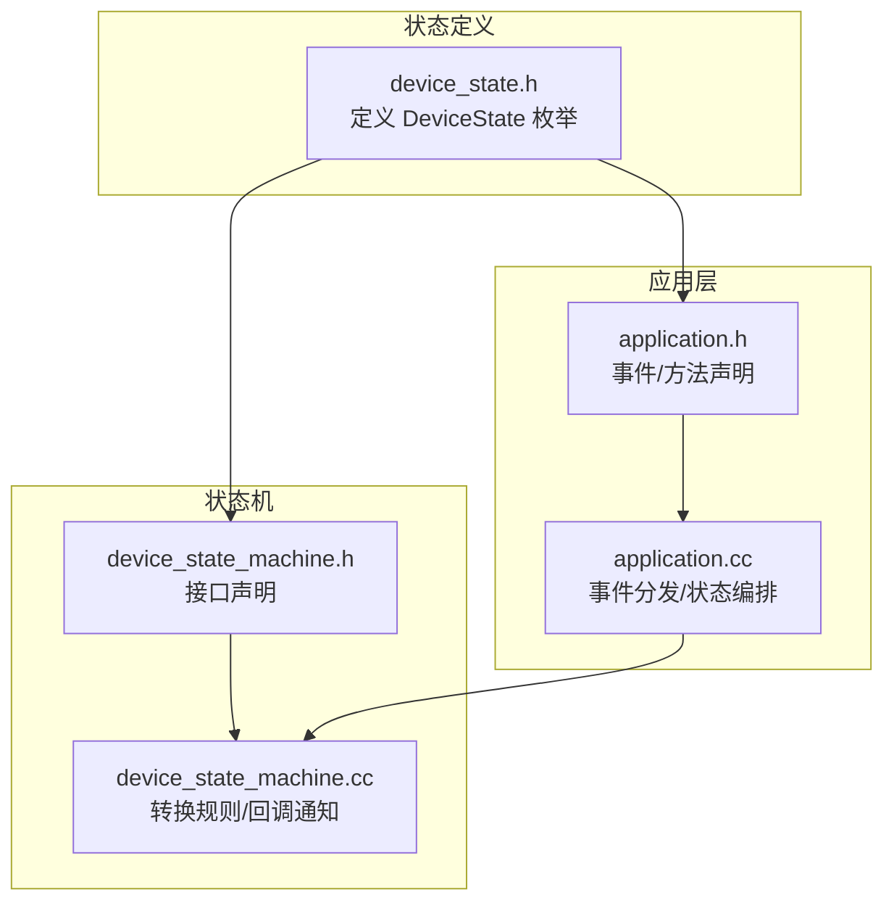
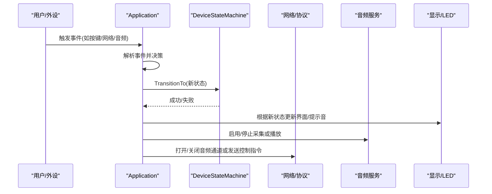
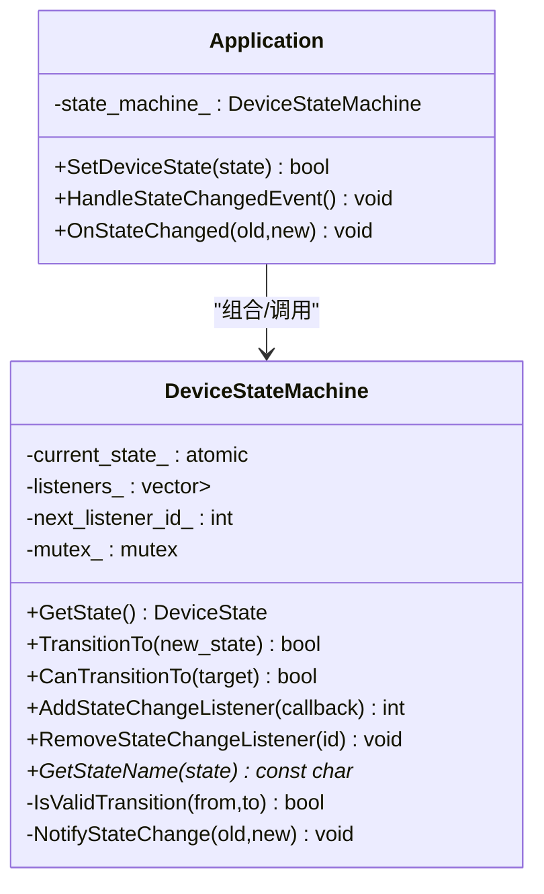
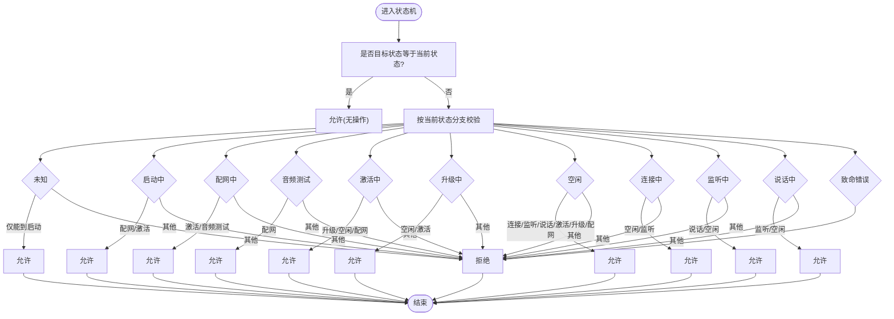
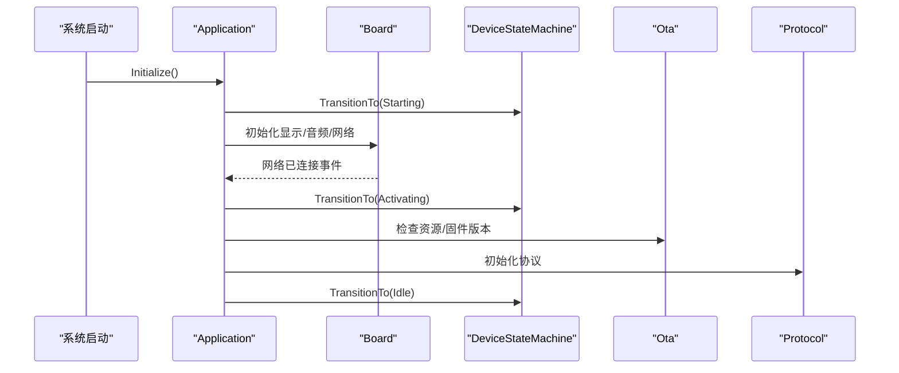
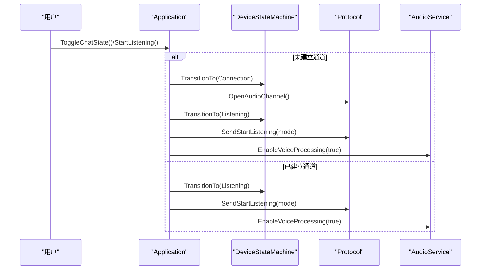
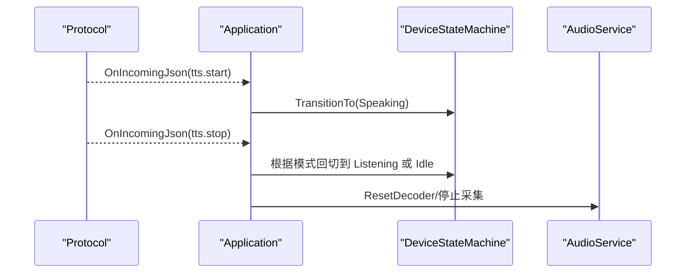
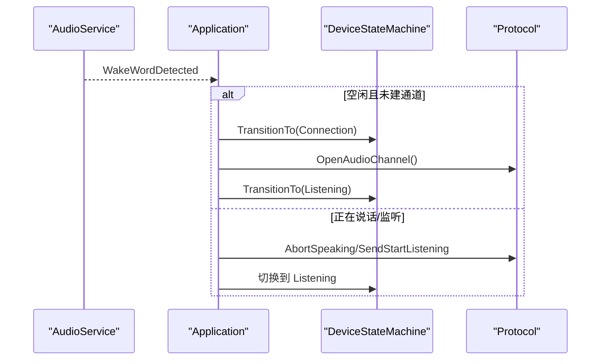
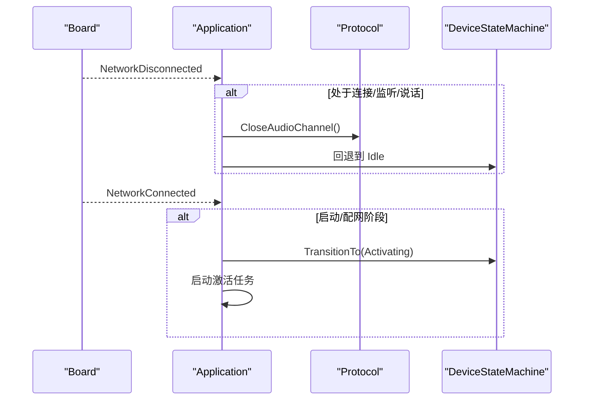
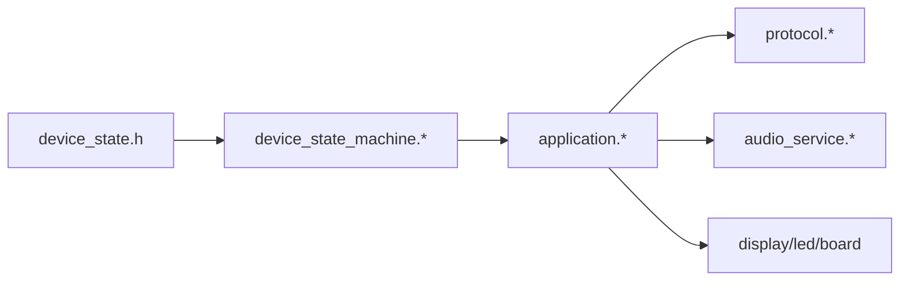

# 设备状态管理

<cite>
**本文引用的文件**   
- [device_state.h](file://main/device_state.h)
- [device_state_machine.h](file://main/device_state_machine.h)
- [device_state_machine.cc](file://main/device_state_machine.cc)
- [application.h](file://main/application.h)
- [application.cc](file://main/application.cc)
</cite>

## 目录
1. [简介](#简介)
2. [项目结构](#项目结构)
3. [核心组件](#核心组件)
4. [架构总览](#架构总览)
5. [详细组件分析](#详细组件分析)
6. [依赖关系分析](#依赖关系分析)
7. [性能与资源特性](#性能与资源特性)
8. [故障处理与自动恢复](#故障处理与自动恢复)
9. [监控与调试指南](#监控与调试指南)
10. [扩展指南：新增功能状态](#扩展指南新增功能状态)
11. [结论](#结论)

## 简介
本技术文档围绕设备状态管理系统，系统性阐述有限状态机（FSM）的设计原理、实现机制与使用方式。重点覆盖以下方面：
- 状态定义与转换规则：待机、唤醒、录音、播放、联网、升级、激活、音频自检、致命错误等
- 触发事件与处理流程：网络事件、用户交互、语音活动检测（VAD）、唤醒词、TTS/STT 消息等
- 状态持久化与重启恢复策略：结合系统初始化流程与默认状态，确保重启后进入可预期状态
- 异常状态处理与自动恢复：连接失败、协议错误、升级失败等路径的自愈逻辑
- 状态监控与调试：日志、UI 同步、回调监听、事件总线
- 扩展指南：如何以标准化方式接入新的功能状态与转换

## 项目结构
与设备状态管理直接相关的核心代码位于 main 目录下，关键文件如下：
- device_state.h：定义设备状态枚举
- device_state_machine.{h,cc}：实现线程安全的状态机，包含转换合法性校验与观察者通知
- application.{h,cc}：应用主循环与业务编排，负责将外部事件映射为状态转换，并驱动 UI、音频、协议等子系统

图表来源
- [device_state.h:1-18](file://main/device_state.h#L1-L18)
- [device_state_machine.h:1-84](file://main/device_state_machine.h#L1-L84)
- [device_state_machine.cc:1-162](file://main/device_state_machine.cc#L1-L162)
- [application.h:1-194](file://main/application.h#L1-L194)
- [application.cc:1-1132](file://main/application.cc#L1-L1132)

章节来源
- [device_state.h:1-18](file://main/device_state.h#L1-L18)
- [device_state_machine.h:1-84](file://main/device_state_machine.h#L1-L84)
- [device_state_machine.cc:1-162](file://main/device_state_machine.cc#L1-L162)
- [application.h:1-194](file://main/application.h#L1-L194)
- [application.cc:1-1132](file://main/application.cc#L1-L1132)

## 核心组件
- 设备状态枚举（DeviceState）
  - 涵盖未知、启动中、配网、空闲、连接中、监听、说话、升级、激活、音频测试、致命错误等
- 状态机（DeviceStateMachine）
  - 提供当前状态读取、目标状态切换、合法性检查、状态变更回调注册/移除、状态名获取
  - 内部维护原子状态变量、观察者列表、互斥锁，保证并发安全
- 应用控制器（Application）
  - 统一入口 Initialize/Run，基于事件组调度各类事件
  - 将网络事件、用户操作、音频事件、协议消息等转换为状态转换请求
  - 在状态变化时联动 UI、LED、音频服务与协议层

章节来源
- [device_state.h:1-18](file://main/device_state.h#L1-L18)
- [device_state_machine.h:17-81](file://main/device_state_machine.h#L17-L81)
- [device_state_machine.cc:24-162](file://main/device_state_machine.cc#L24-L162)
- [application.h:43-176](file://main/application.h#L43-L176)
- [application.cc:57-1132](file://main/application.cc#L57-L1132)

## 架构总览
整体采用“事件驱动 + 状态机”的架构：
- 事件源：网络事件、用户按键、音频 VAD、唤醒词、协议 JSON 消息、定时器等
- 事件分发：Application::Run 通过事件组等待并分发到具体处理器
- 状态机：所有显式状态变更均通过 DeviceStateMachine::TransitionTo 进行合法性校验与通知
- 副作用：状态变化回调触发 UI 更新、音频处理开关、协议通道管理等

图表来源
- [application.cc:165-259](file://main/application.cc#L165-L259)
- [device_state_machine.cc:108-131](file://main/device_state_machine.cc#L108-L131)

## 详细组件分析

### 状态机类图

图表来源
- [device_state_machine.h:17-81](file://main/device_state_machine.h#L17-L81)
- [device_state_machine.cc:24-162](file://main/device_state_machine.cc#L24-L162)
- [application.h:125-176](file://main/application.h#L125-L176)
- [application.cc:860-932](file://main/application.cc#L860-L932)

章节来源
- [device_state_machine.h:17-81](file://main/device_state_machine.h#L17-L81)
- [device_state_machine.cc:34-102](file://main/device_state_machine.cc#L34-L102)
- [application.h:125-176](file://main/application.h#L125-L176)
- [application.cc:860-932](file://main/application.cc#L860-L932)

### 状态转换规则与流程图
- 合法转换由 IsValidTransition 集中定义，遵循严格有向图约束
- 典型路径：
  - 启动 -> 配网/激活
  - 激活 -> 升级/空闲/回退配网
  - 空闲 -> 连接/监听/说话/激活/升级/配网
  - 连接 -> 空闲(失败)/监听(成功)
  - 监听 <-> 说话
  - 致命错误不可自恢复

图表来源
- [device_state_machine.cc:34-102](file://main/device_state_machine.cc#L34-L102)

章节来源
- [device_state_machine.cc:34-102](file://main/device_state_machine.cc#L34-L102)

### 关键业务流程时序

#### 1) 开机初始化与首次激活

图表来源
- [application.cc:61-163](file://main/application.cc#L61-L163)
- [application.cc:261-338](file://main/application.cc#L261-L338)
- [application.cc:398-471](file://main/application.cc#L398-L471)
- [application.cc:473-610](file://main/application.cc#L473-L610)

章节来源
- [application.cc:61-163](file://main/application.cc#L61-L163)
- [application.cc:261-338](file://main/application.cc#L261-L338)
- [application.cc:398-471](file://main/application.cc#L398-L471)
- [application.cc:473-610](file://main/application.cc#L473-L610)

#### 2) 用户发起对话（手动模式）

图表来源
- [application.cc:674-730](file://main/application.cc#L674-L730)
- [application.cc:732-763](file://main/application.cc#L732-L763)
- [application.cc:860-932](file://main/application.cc#L860-L932)

章节来源
- [application.cc:674-730](file://main/application.cc#L674-L730)
- [application.cc:732-763](file://main/application.cc#L732-L763)
- [application.cc:860-932](file://main/application.cc#L860-L932)

#### 3) TTS 播放与自动回切

图表来源
- [application.cc:521-549](file://main/application.cc#L521-L549)
- [application.cc:860-932](file://main/application.cc#L860-L932)

章节来源
- [application.cc:521-549](file://main/application.cc#L521-L549)
- [application.cc:860-932](file://main/application.cc#L860-L932)

#### 4) 唤醒词触发

图表来源
- [application.cc:780-858](file://main/application.cc#L780-L858)
- [application.cc:860-932](file://main/application.cc#L860-L932)

章节来源
- [application.cc:780-858](file://main/application.cc#L780-L858)
- [application.cc:860-932](file://main/application.cc#L860-L932)

#### 5) 网络断开与恢复

图表来源
- [application.cc:286-297](file://main/application.cc#L286-L297)
- [application.cc:261-284](file://main/application.cc#L261-L284)

章节来源
- [application.cc:286-297](file://main/application.cc#L286-L297)
- [application.cc:261-284](file://main/application.cc#L261-L284)

## 依赖关系分析
- 低耦合：状态机独立于业务细节，仅暴露最小接口；应用层通过回调订阅状态变化
- 高内聚：状态转换规则集中在 IsValidTransition，便于审计与扩展
- 并发安全：状态变量使用原子类型，观察者列表使用互斥保护
- 外部依赖：网络/协议/音频/显示/LED 均在应用层协调，不侵入状态机

图表来源
- [device_state.h:1-18](file://main/device_state.h#L1-L18)
- [device_state_machine.h:1-84](file://main/device_state_machine.h#L1-L84)
- [application.h:1-194](file://main/application.h#L1-L194)

章节来源
- [device_state.h:1-18](file://main/device_state.h#L1-L18)
- [device_state_machine.h:1-84](file://main/device_state_machine.h#L1-L84)
- [application.h:1-194](file://main/application.h#L1-L194)

## 性能与资源特性
- 事件驱动：主循环基于事件组，避免忙轮询，降低 CPU 占用
- 异步激活：激活任务在后台执行，不阻塞主循环
- 动态功耗：连接/播放期间提升性能等级，空闲/待机降低功耗
- 队列缓冲：音频发送/解码队列减少抖动影响
- 建议
  - 在状态切换前后合理设置功耗等级，避免长时间高性能运行
  - 对耗时操作（如网络 I/O）尽量放入 Schedule 或后台任务，避免阻塞主循环

[本节为通用指导，无需源码引用]

## 故障处理与自动恢复
- 网络错误
  - 协议层上报网络错误事件，应用层置位错误事件，主循环将状态复位至空闲并提示用户
- 连接失败
  - 从连接态回退到空闲态，保持可重试能力
- 升级失败
  - 升级失败后重启音频服务并回到正常态，必要时提示用户
- 致命错误
  - 状态机不允许从致命错误自恢复，需外部干预（如重启）

章节来源
- [application.cc:187-190](file://main/application.cc#L187-L190)
- [application.cc:286-297](file://main/application.cc#L286-L297)
- [application.cc:972-1022](file://main/application.cc#L972-L1022)
- [device_state_machine.cc:95-101](file://main/device_state_machine.cc#L95-L101)

## 监控与调试指南
- 状态日志
  - 每次状态变更都会输出旧/新状态名称，便于定位问题
- 状态监听
  - 通过 AddStateChangeListener 订阅状态变化，可在 UI/日志/遥测中记录
- 事件追踪
  - 主循环对各类事件进行分派，可通过打印事件位或增加断点跟踪
- UI 联动
  - 状态变化会更新状态栏、聊天消息、表情与提示音，便于直观观察
- 建议
  - 在开发阶段开启更详细的日志级别
  - 针对关键路径（连接、TTS、唤醒词）增加额外埋点

章节来源
- [device_state_machine.cc:118-131](file://main/device_state_machine.cc#L118-L131)
- [application.cc:860-932](file://main/application.cc#L860-L932)
- [application.cc:165-259](file://main/application.cc#L165-L259)

## 扩展指南：新增功能状态
若需新增功能状态（例如“视频通话”、“拍照”等），请按以下步骤标准化接入：

1. 定义新状态
   - 在设备状态枚举中追加新状态项
   - 参考路径：[device_state.h:1-18](file://main/device_state.h#L1-L18)

2. 定义转换规则
   - 在 IsValidTransition 中补充允许的入边与出边
   - 明确与其他状态的互斥关系
   - 参考路径：[device_state_machine.cc:34-102](file://main/device_state_machine.cc#L34-L102)

3. 实现状态副作用
   - 在 HandleStateChangedEvent 中为新状态添加 UI、音频、协议等副作用
   - 参考路径：[application.cc:860-932](file://main/application.cc#L860-L932)

4. 暴露触发入口
   - 在 Application 中提供便捷方法（如 StartVideoCall/StopVideoCall），内部调用 SetDeviceState
   - 参考路径：[application.h:70-116](file://main/application.h#L70-L116)、[application.cc:57-59](file://main/application.cc#L57-L59)

5. 事件与回调
   - 如需跨模块协作，使用事件组或状态监听器通知相关组件
   - 参考路径：[application.h:21-35](file://main/application.h#L21-L35)、[device_state_machine.h:47-59](file://main/device_state_machine.h#L47-L59)

6. 测试与验证
   - 编写用例覆盖所有合法/非法转换路径
   - 验证 UI/音频/协议在状态切换时的行为一致性

[本节为方法论指导，除必要参考外不展开具体实现]

## 结论
本系统通过清晰的状态枚举、严格的转换规则与线程安全的状态机实现，配合事件驱动的编排，实现了设备在多场景下的稳定运行。借助完善的回调与日志机制，开发者可以高效地进行监控与调试。按照扩展指南，新增功能状态能够以最小侵入的方式融入现有体系，保障系统的可维护性与可扩展性。