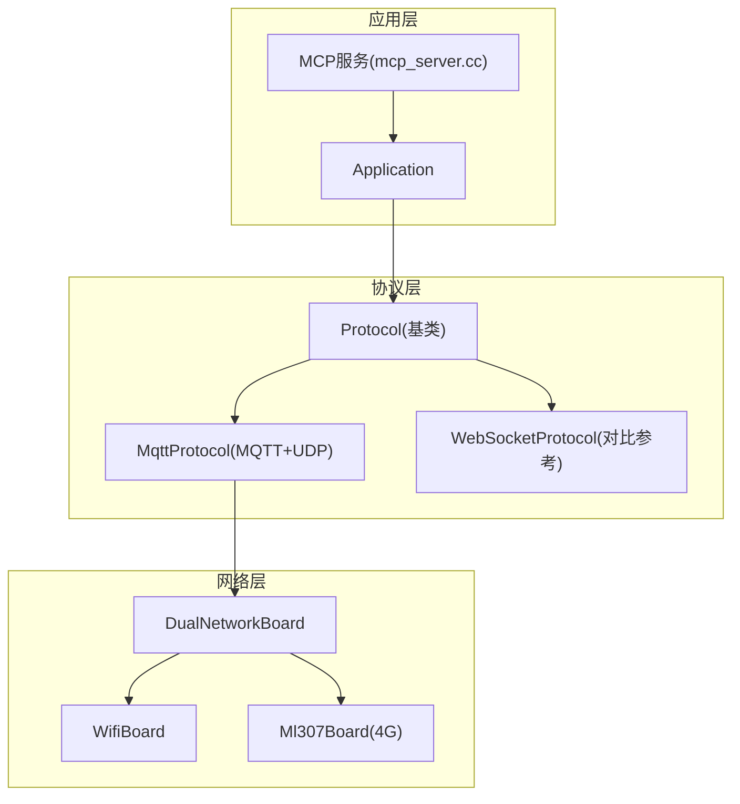
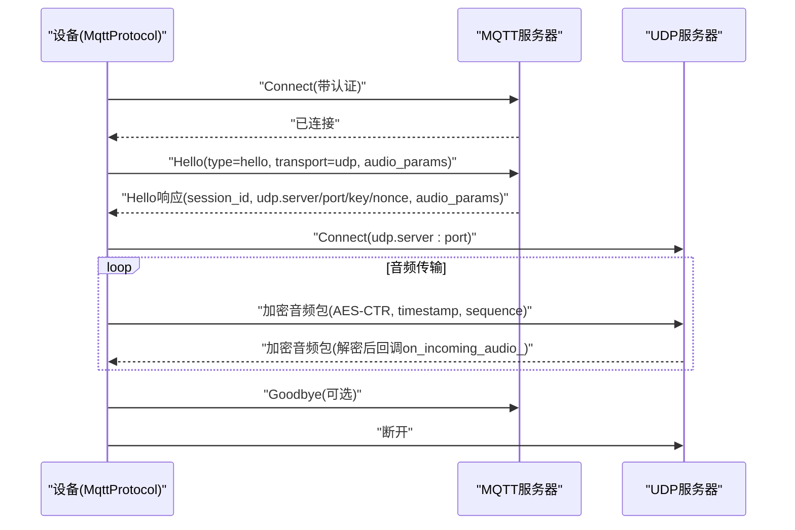
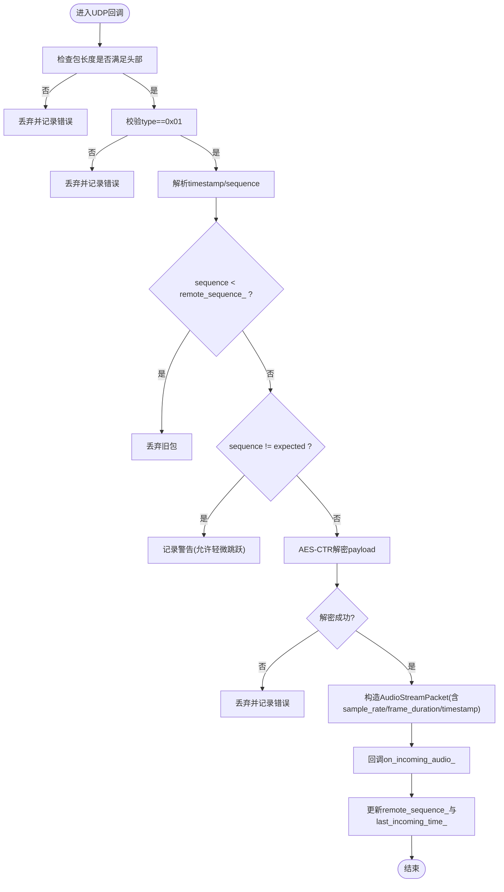
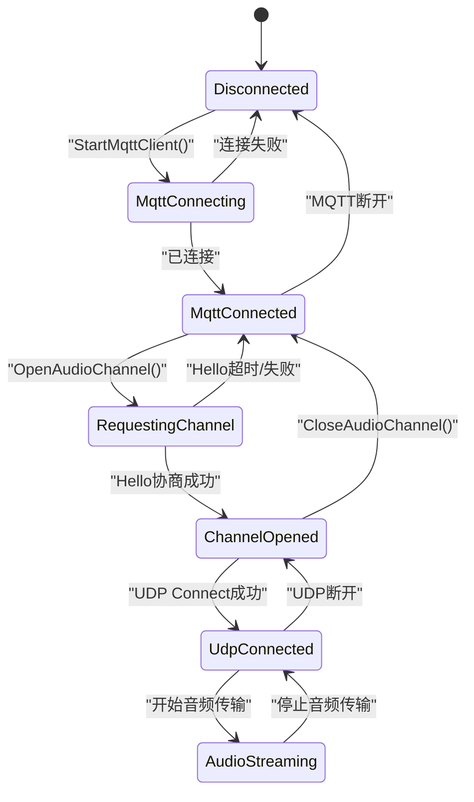
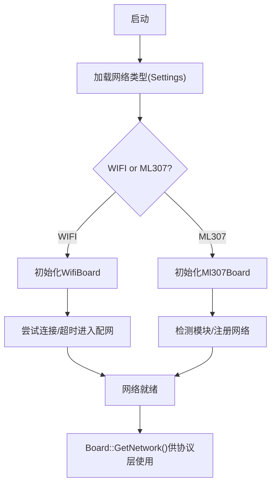

# MQTT+UDP混合协议

<cite>
**本文引用的文件**   
- [mqtt_protocol.h](file://main/protocols/mqtt_protocol.h)
- [mqtt_protocol.cc](file://main/protocols/mqtt_protocol.cc)
- [protocol.h](file://main/protocols/protocol.h)
- [websocket_protocol.cc](file://main/protocols/websocket_protocol.cc)
- [dual_network_board.cc](file://main/boards/common/dual_network_board.cc)
- [wifi_board.cc](file://main/boards/common/wifi_board.cc)
- [ml307_board.cc](file://main/boards/common/ml307_board.cc)
- [mcp_server.cc](file://main/mcp_server.cc)
- [mqtt-udp_zh.md](file://docs/mqtt-udp_zh.md)
</cite>

## 目录
1. [简介](#简介)
2. [项目结构](#项目结构)
3. [核心组件](#核心组件)
4. [架构总览](#架构总览)
5. [详细组件分析](#详细组件分析)
6. [依赖关系分析](#依赖关系分析)
7. [性能与资源优化](#性能与资源优化)
8. [网络环境适配策略](#网络环境适配策略)
9. [故障诊断与调试工具](#故障诊断与调试工具)
10. [结论](#结论)

## 简介
本技术文档围绕“MQTT+UDP混合协议”的实现与使用，系统阐述控制信令与音频流分离的架构设计。其中：
- MQTT用于控制信令、状态同步与JSON数据交换；
- UDP用于实时音频数据传输，采用AES-CTR加密，具备序列号保护与时间戳同步。

文档覆盖主题订阅发布机制、QoS选择建议、遗嘱消息配置思路；解释UDP可靠性保证、丢包处理与乱序重组策略；并给出连接池管理、消息队列优化、内存控制等工程实践。同时提供二进制帧编解码、时间戳与序列号管理说明，以及WiFi与4G差异化适配策略和调试方法。

## 项目结构
本项目将协议实现集中于 protocols 目录，设备端通过 Board 抽象获取底层网络接口（WiFi或4G），并通过 Application 调度任务。关键路径如下：
- 协议层：MqttProtocol 继承自 Protocol，封装MQTT控制通道与UDP音频通道；
- 网络层：DualNetworkBoard 在启动时根据配置选择 WifiBoard 或 Ml307Board；
- 应用层：Application 负责状态机、任务调度与协议生命周期管理；
- 文档层：docs/mqtt-udp_zh.md 提供协议规范与流程说明。



图表来源
- [mqtt_protocol.h:26-62](file://main/protocols/mqtt_protocol.h#L26-L62)
- [protocol.h:44-95](file://main/protocols/protocol.h#L44-L95)
- [dual_network_board.cc:35-43](file://main/boards/common/dual_network_board.cc#L35-L43)
- [wifi_board.cc:244-247](file://main/boards/common/wifi_board.cc#L244-L247)
- [ml307_board.cc:143-145](file://main/boards/common/ml307_board.cc#L143-L145)
- [mcp_server.cc:435-450](file://main/mcp_server.cc#L435-L450)

章节来源
- [mqtt_protocol.h:26-62](file://main/protocols/mqtt_protocol.h#L26-L62)
- [protocol.h:44-95](file://main/protocols/protocol.h#L44-L95)
- [dual_network_board.cc:35-43](file://main/boards/common/dual_network_board.cc#L35-L43)
- [wifi_board.cc:244-247](file://main/boards/common/wifi_board.cc#L244-L247)
- [ml307_board.cc:143-145](file://main/boards/common/ml307_board.cc#L143-L145)
- [mcp_server.cc:435-450](file://main/mcp_server.cc#L435-L450)

## 核心组件
- MqttProtocol：实现MQTT控制通道与UDP音频通道，包含Hello协商、AES-CTR加解密、序列号与时间戳管理、重连与超时检测。
- Protocol（基类）：定义统一接口与回调，维护会话ID、服务器采样率/帧长、最后接收时间等通用状态。
- DualNetworkBoard/WifiBoard/Ml307Board：提供统一的网络抽象，支持WiFi与4G切换与状态上报。
- MCP服务：通过Application发送MCP JSON消息，作为MQTT控制通道的一部分。

章节来源
- [mqtt_protocol.h:26-62](file://main/protocols/mqtt_protocol.h#L26-L62)
- [protocol.h:10-95](file://main/protocols/protocol.h#L10-L95)
- [dual_network_board.cc:35-43](file://main/boards/common/dual_network_board.cc#L35-L43)
- [mcp_server.cc:435-450](file://main/mcp_server.cc#L435-L450)

## 架构总览
整体采用“控制面+数据面”分离的双通道架构：
- 控制面（MQTT）：负责会话建立、能力协商、TTS/STT/MCP指令下发、Goodbye关闭；
- 数据面（UDP）：承载Opus音频流，使用AES-CTR加密，附带时间戳与序列号，保障时序与防重放。



图表来源
- [mqtt_protocol.cc:100-152](file://main/protocols/mqtt_protocol.cc#L100-L152)
- [mqtt_protocol.cc:215-295](file://main/protocols/mqtt_protocol.cc#L215-L295)
- [mqtt_protocol.cc:322-366](file://main/protocols/mqtt_protocol.cc#L322-L366)
- [mqtt-udp_zh.md:24-57](file://docs/mqtt-udp_zh.md#L24-L57)

## 详细组件分析

### MQTT控制通道
- 连接与心跳：从设置读取endpoint/client_id/username/password/keepalive/publish_topic；默认端口8883；断线后按固定间隔定时重连。
- Hello协商：客户端发送Hello请求transport=udp及音频参数；服务端返回session_id、udp地址与AES密钥/随机数、服务器端音频参数。
- 消息分发：解析type字段，hello/goodbye特殊处理，其余交由on_incoming_json_回调。
- Goodbye语义：若服务端主动发送goodbye，客户端不回复，避免乒乓。

章节来源
- [mqtt_protocol.cc:59-152](file://main/protocols/mqtt_protocol.cc#L59-L152)
- [mqtt_protocol.cc:100-132](file://main/protocols/mqtt_protocol.cc#L100-L132)
- [mqtt_protocol.cc:192-213](file://main/protocols/mqtt_protocol.cc#L192-L213)
- [mqtt-udp_zh.md:61-174](file://docs/mqtt-udp_zh.md#L61-L174)

### UDP音频通道
- 连接建立：收到Hello响应后，解析udp.server/port/key/nonce，初始化AES-CTR上下文，创建Udp实例并Connect。
- 帧格式：type(1B)+flags(1B)+payload_len(2B)+ssrc(4B)+timestamp(4B)+sequence(4B)+payload(NB)。
- 加密算法：AES-CTR，nonce由服务器提供，计数器包含timestamp与sequence信息。
- 序列号管理：发送端local_sequence_单调递增；接收端校验sequence>=remote_sequence_，丢弃旧包，记录异常但继续处理。
- 时间戳同步：timestamp随包携带，用于播放时序对齐。



图表来源
- [mqtt_protocol.cc:243-290](file://main/protocols/mqtt_protocol.cc#L243-L290)
- [mqtt_protocol.cc:166-190](file://main/protocols/mqtt_protocol.cc#L166-L190)
- [mqtt-udp_zh.md:176-224](file://docs/mqtt-udp_zh.md#L176-L224)

章节来源
- [mqtt_protocol.cc:215-295](file://main/protocols/mqtt_protocol.cc#L215-L295)
- [mqtt_protocol.cc:166-190](file://main/protocols/mqtt_protocol.cc#L166-L190)
- [mqtt-udp_zh.md:176-224](file://docs/mqtt-udp_zh.md#L176-L224)

### 状态管理与超时
- 事件组等待：OpenAudioChannel中等待服务器Hello事件，超时则置错。
- 超时检测：基于last_incoming_time_与IsTimeout()判断通道可用性。
- 状态转换：Disconnected→MqttConnecting→MqttConnected→RequestingChannel→ChannelOpened→UdpConnected→AudioStreaming。



图表来源
- [mqtt_protocol.cc:215-295](file://main/protocols/mqtt_protocol.cc#L215-L295)
- [mqtt-udp_zh.md:226-257](file://docs/mqtt-udp_zh.md#L226-L257)

章节来源
- [mqtt_protocol.cc:215-295](file://main/protocols/mqtt_protocol.cc#L215-L295)
- [mqtt-udp_zh.md:226-257](file://docs/mqtt-udp_zh.md#L226-L257)

### 二进制协议帧编解码与时间戳/序列号
- 发送侧：在nonce基础上写入payload_len、timestamp、sequence，随后AES-CTR加密payload，拼接成完整UDP包。
- 接收侧：校验头部长度与类型，解析timestamp/sequence，进行AES-CTR解密，构造AudioStreamPacket并回调上层。
- 时间戳：以毫秒为单位（与服务端约定），用于播放缓冲与抖动控制。
- 序列号：防止重放与乱序，严格拒绝过期包，对非连续包仅告警。

章节来源
- [mqtt_protocol.cc:166-190](file://main/protocols/mqtt_protocol.cc#L166-L190)
- [mqtt_protocol.cc:243-290](file://main/protocols/mqtt_protocol.cc#L243-L290)
- [protocol.h:10-15](file://main/protocols/protocol.h#L10-L15)

### 与WebSocket协议的比较（参考）
- WebSocket协议同样支持二进制音频帧，版本2/3结构不同，但不涉及AES-CTR加密与独立UDP通道。
- 适用于需要高可靠、低复杂度场景；而MQTT+UDP更适合对实时性要求更高的语音交互。

章节来源
- [websocket_protocol.cc:115-137](file://main/protocols/websocket_protocol.cc#L115-L137)
- [mqtt-udp_zh.md:346-358](file://docs/mqtt-udp_zh.md#L346-L358)

## 依赖关系分析
- MqttProtocol依赖：
  - NetworkInterface（通过Board::GetNetwork()）：CreateMqtt/CreateUdp；
  - mbedtls AES：AES-CTR加解密；
  - FreeRTOS EventGroup：等待服务器Hello；
  - esp_timer：重连定时器；
  - cJSON：JSON解析与构建。
- DualNetworkBoard依赖：
  - Settings：持久化网络类型；
  - WifiBoard/Ml307Board：具体网络实现。

```mermaid
classDiagram
class Protocol {
+server_sample_rate()
+server_frame_duration()
+session_id()
+OnIncomingAudio(cb)
+OnIncomingJson(cb)
+OnAudioChannelOpened(cb)
+OnAudioChannelClosed(cb)
+OnConnected(cb)
+OnDisconnected(cb)
+Start() bool
+OpenAudioChannel() bool
+CloseAudioChannel(send_goodbye) void
+IsAudioChannelOpened() bool
+SendAudio(packet) bool
}
class MqttProtocol {
-publish_topic_
-channel_mutex_
-mqtt_
-udp_
-aes_ctx_
-aes_nonce_
-udp_server_
-udp_port_
-local_sequence_
-remote_sequence_
-reconnect_timer_
+Start() bool
+OpenAudioChannel() bool
+CloseAudioChannel(send_goodbye) void
+IsAudioChannelOpened() bool
+SendAudio(packet) bool
-StartMqttClient(report_error) bool
-ParseServerHello(root) void
-DecodeHexString(hex) string
-SendText(text) bool
-GetHelloMessage() string
}
class DualNetworkBoard {
-network_type_
-current_board_
+StartNetwork() void
+GetNetwork() NetworkInterface*
+SetNetworkEventCallback(cb) void
}
class WifiBoard
class Ml307Board
Protocol <|-- MqttProtocol
DualNetworkBoard --> WifiBoard
DualNetworkBoard --> Ml307Board
MqttProtocol --> DualNetworkBoard : "通过Board : : GetNetwork()"
```

图表来源
- [protocol.h:44-95](file://main/protocols/protocol.h#L44-L95)
- [mqtt_protocol.h:26-62](file://main/protocols/mqtt_protocol.h#L26-L62)
- [dual_network_board.cc:35-43](file://main/boards/common/dual_network_board.cc#L35-L43)
- [wifi_board.cc:244-247](file://main/boards/common/wifi_board.cc#L244-L247)
- [ml307_board.cc:143-145](file://main/boards/common/ml307_board.cc#L143-L145)

章节来源
- [protocol.h:44-95](file://main/protocols/protocol.h#L44-L95)
- [mqtt_protocol.h:26-62](file://main/protocols/mqtt_protocol.h#L26-L62)
- [dual_network_board.cc:35-43](file://main/boards/common/dual_network_board.cc#L35-L43)

## 性能与资源优化
- 并发控制：使用互斥锁保护UDP通道读写，避免多线程竞争。
- 内存管理：动态创建/销毁网络对象，智能指针管理数据包，及时释放加密上下文。
- 网络优化：UDP连接复用，合理分包大小，序列号连续性检查减少无效处理。
- 重连策略：MQTT断线后定时重连，空闲态触发，避免忙态下频繁重试。
- 超时控制：基于最后接收时间判定通道可用性，避免僵尸连接占用资源。

章节来源
- [mqtt_protocol.cc:166-190](file://main/protocols/mqtt_protocol.cc#L166-L190)
- [mqtt_protocol.cc:36-53](file://main/protocols/mqtt_protocol.cc#L36-L53)
- [mqtt_protocol.cc:85-98](file://main/protocols/mqtt_protocol.cc#L85-L98)
- [mqtt-udp_zh.md:323-344](file://docs/mqtt-udp_zh.md#L323-L344)

## 网络环境适配策略
- WiFi与4G双模：DualNetworkBoard根据Settings中的type选择当前网络实现，支持运行时切换并重启生效。
- WiFi特性：
  - 连接超时进入配网模式；
  - 信号强度分级显示；
  - 支持多种配网方式（热点/Blufi/声学）。
- 4G特性：
  - 模块检测与网络注册重试；
  - CSQ信号等级映射；
  - 运营商信息与IMEI/ICCID上报。



图表来源
- [dual_network_board.cc:23-43](file://main/boards/common/dual_network_board.cc#L23-L43)
- [wifi_board.cc:52-104](file://main/boards/common/wifi_board.cc#L52-L104)
- [ml307_board.cc:67-132](file://main/boards/common/ml307_board.cc#L67-L132)

章节来源
- [dual_network_board.cc:23-43](file://main/boards/common/dual_network_board.cc#L23-L43)
- [wifi_board.cc:52-104](file://main/boards/common/wifi_board.cc#L52-L104)
- [ml307_board.cc:67-132](file://main/boards/common/ml307_board.cc#L67-L132)

## 故障诊断与调试工具
- MQTT调试：
  - 查看日志输出（连接、消息解析、Hello协商、Goodbye处理）；
  - 确认endpoint/port/用户名密码/keepalive/publish_topic配置正确；
  - 观察断线重连定时器是否触发。
- UDP调试：
  - 抓包验证type=0x01、timestamp/sequence字段；
  - 核对AES-CTR密钥与nonce是否与Hello响应一致；
  - 关注序列号告警与解密失败日志。
- 网络环境：
  - WiFi：检查RSSI、信道、IP分配与配网流程；
  - 4G：检查CSQ、运营商、注册状态。
- 工具链：
  - 使用串口日志与ESP-IDF工具；
  - 使用Wireshark抓取UDP流量；
  - 使用MQTT客户端订阅/发布测试控制消息。

章节来源
- [mqtt_protocol.cc:100-152](file://main/protocols/mqtt_protocol.cc#L100-L152)
- [mqtt_protocol.cc:243-290](file://main/protocols/mqtt_protocol.cc#L243-L290)
- [wifi_board.cc:339-357](file://main/boards/common/wifi_board.cc#L339-L357)
- [ml307_board.cc:247-270](file://main/boards/common/ml307_board.cc#L247-L270)

## 结论
MQTT+UDP混合协议通过控制面与数据面分离，结合AES-CTR加密与序列号/时间戳管理，在保证安全性的前提下实现了低延迟的音频传输。配合双网络适配与完善的错误处理与重连机制，可在复杂网络环境下稳定运行。建议在部署时关注防火墙规则、NAT穿透与密钥管理，并结合日志与抓包工具进行持续监控与调优。