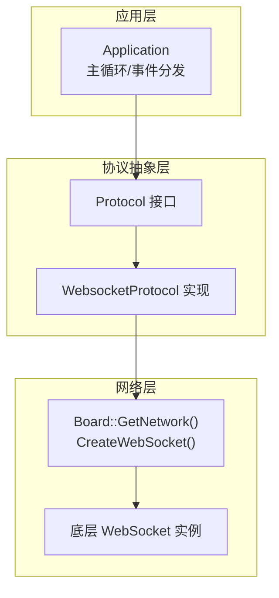
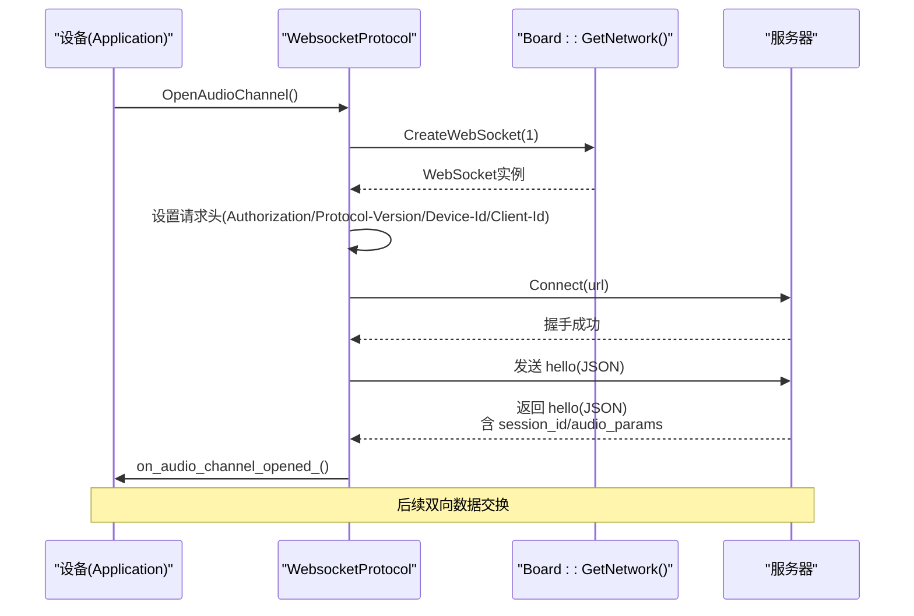
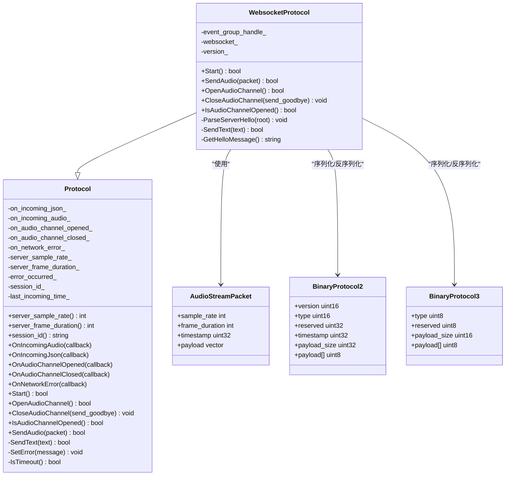
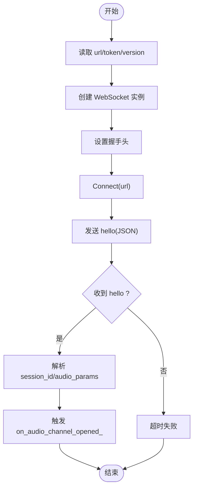
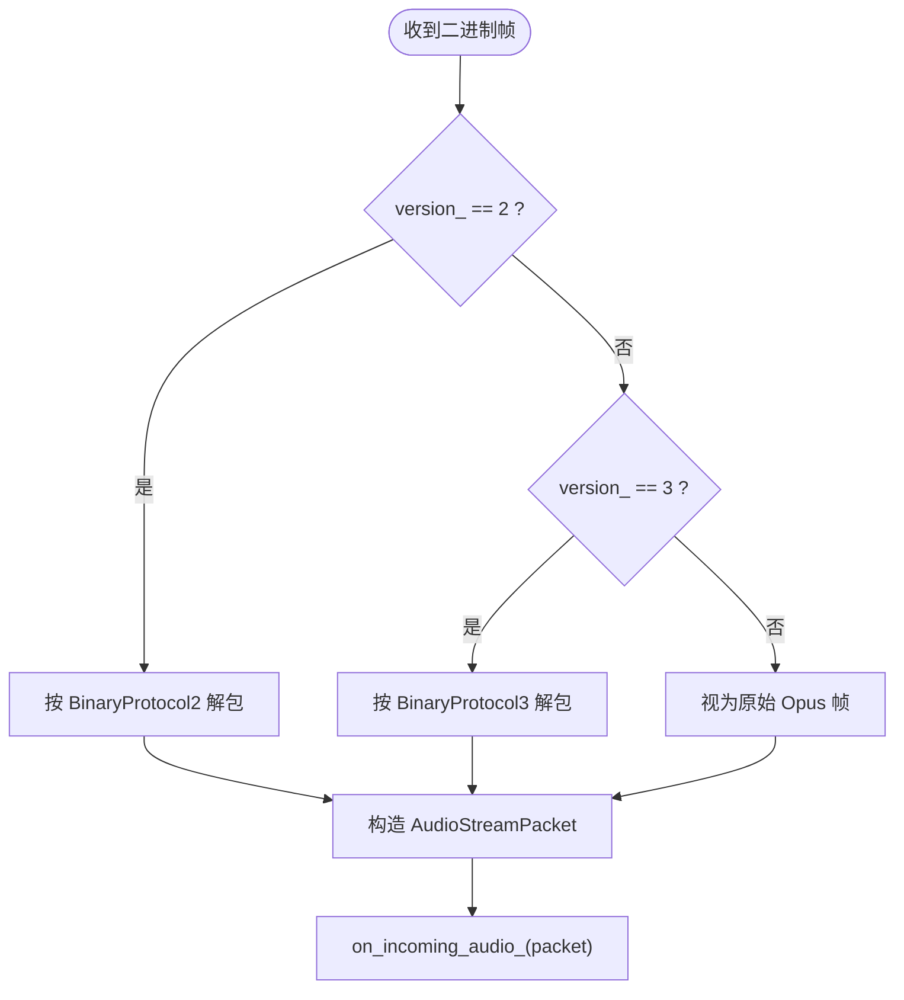
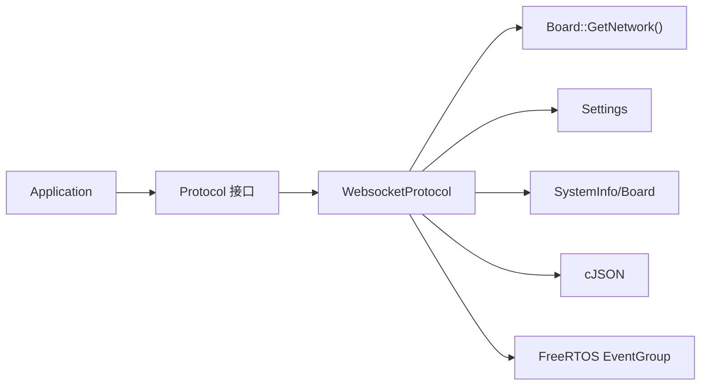

# WebSocket协议实现

<cite>
**本文引用的文件**   
- [websocket_protocol.h](file://main/protocols/websocket_protocol.h)
- [websocket_protocol.cc](file://main/protocols/websocket_protocol.cc)
- [protocol.h](file://main/protocols/protocol.h)
- [websocket.md](file://docs/websocket.md)
- [application.cc](file://main/application.cc)
</cite>

## 目录
1. [简介](#简介)
2. [项目结构](#项目结构)
3. [核心组件](#核心组件)
4. [架构总览](#架构总览)
5. [详细组件分析](#详细组件分析)
6. [依赖关系分析](#依赖关系分析)
7. [性能与优化](#性能与优化)
8. [故障排查指南](#故障排查指南)
9. [结论](#结论)
10. [附录：客户端集成要点](#附录客户端集成要点)

## 简介
本技术文档围绕设备端WebSocket协议的实现，系统性阐述全双工通信的建立、握手、消息传输机制；详细说明音频流的分帧传输、JSON控制消息的格式规范；解释心跳保活、断线重连策略与错误恢复流程；并给出扩展头使用、压缩与安全连接配置建议。同时提供客户端集成示例（连接参数、收发、异常处理），以及与云端服务器的交互协议（会话管理、状态同步）。最后包含调试方法与性能优化建议，帮助开发者快速落地与排障。

## 项目结构
本项目在“协议层”通过统一的Protocol接口抽象不同传输通道，WebSocket作为其中一种具体实现。关键位置如下：
- 协议接口定义：位于 main/protocols/protocol.h
- WebSocket实现：位于 main/protocols/websocket_protocol.{h,cc}
- 协议文档：位于 docs/websocket.md
- 应用主循环与事件分发：位于 main/application.cc

图表来源
- [websocket_protocol.h:13-32](file://main/protocols/websocket_protocol.h#L13-L32)
- [websocket_protocol.cc:83-101](file://main/protocols/websocket_protocol.cc#L83-L101)
- [protocol.h:44-95](file://main/protocols/protocol.h#L44-L95)

章节来源
- [websocket_protocol.h:1-34](file://main/protocols/websocket_protocol.h#L1-L34)
- [websocket_protocol.cc:1-255](file://main/protocols/websocket_protocol.cc#L1-L255)
- [protocol.h:1-99](file://main/protocols/protocol.h#L1-L99)
- [websocket.md:1-531](file://docs/websocket.md#L1-L531)
- [application.cc:1-200](file://main/application.cc#L1-L200)

## 核心组件
- WebsocketProtocol：实现Protocol接口的WebSocket通道，负责连接建立、握手、文本/二进制收发、版本协商、会话ID与音频参数解析等。
- Protocol接口：统一抽象音频通道生命周期、回调注册、文本发送、通用能力（如超时检测、错误上报）等。
- 二进制协议版本：v1为裸Opus帧；v2/v3为带轻量元数据的封装帧，便于时间戳、长度等元信息传递。
- JSON控制面：基于type字段分派的消息集（hello、listen、abort、tts、stt、mcp、system、alert、custom等）。

章节来源
- [websocket_protocol.h:13-32](file://main/protocols/websocket_protocol.h#L13-L32)
- [websocket_protocol.cc:28-76](file://main/protocols/websocket_protocol.cc#L28-L76)
- [protocol.h:10-31](file://main/protocols/protocol.h#L10-L31)
- [websocket.md:96-127](file://docs/websocket.md#L96-L127)

## 架构总览
WebSocket协议在设备侧以“懒连接”方式工作：仅在需要音频通道时创建连接，完成握手后进入双向数据交换阶段。上行主要为Opus编码的二进制音频帧，下行可能包含TTS音频与JSON控制消息。

图表来源
- [websocket_protocol.cc:83-201](file://main/protocols/websocket_protocol.cc#L83-L201)
- [websocket.md:16-79](file://docs/websocket.md#L16-L79)

## 详细组件分析

### 类与关系图

图表来源
- [protocol.h:44-95](file://main/protocols/protocol.h#L44-L95)
- [protocol.h:10-31](file://main/protocols/protocol.h#L10-L31)
- [websocket_protocol.h:13-32](file://main/protocols/websocket_protocol.h#L13-L32)
- [websocket_protocol.cc:28-76](file://main/protocols/websocket_protocol.cc#L28-L76)

#### 连接建立与握手流程
- 读取配置：从NVS中获取url、token、version。
- 创建WebSocket实例：通过Board::GetNetwork().CreateWebSocket(1)。
- 设置握手头：Authorization、Protocol-Version、Device-Id、Client-Id。
- 发起Connect并等待握手成功。
- 发送客户端hello（JSON），包含version、features、transport、audio_params。
- 等待服务端hello（JSON），解析session_id与audio_params，触发“音频通道已打开”回调。

图表来源
- [websocket_protocol.cc:83-201](file://main/protocols/websocket_protocol.cc#L83-L201)
- [websocket.md:16-79](file://docs/websocket.md#L16-L79)

章节来源
- [websocket_protocol.cc:83-201](file://main/protocols/websocket_protocol.cc#L83-L201)
- [websocket.md:83-93](file://docs/websocket.md#L83-L93)

#### 音频流分帧传输机制
- 上行：将Opus编码后的音频帧按当前binary protocol version打包发送。
  - v1：直接发送原始Opus字节。
  - v2：BinaryProtocol2，包含version/type/reserved/timestamp/payload_size/payload。
  - v3：BinaryProtocol3，包含type/reserved/payload_size/payload。
- 下行：接收二进制帧，按version解包，构造AudioStreamPacket并通过on_incoming_audio_回调给上层。
- 帧时长：由OPUS_FRAME_DURATION_MS决定（默认60ms），在hello中声明并在解码器初始化中使用。

图表来源
- [websocket_protocol.cc:28-58](file://main/protocols/websocket_protocol.cc#L28-L58)
- [websocket_protocol.cc:112-147](file://main/protocols/websocket_protocol.cc#L112-L147)
- [protocol.h:17-31](file://main/protocols/protocol.h#L17-L31)

章节来源
- [websocket_protocol.cc:28-58](file://main/protocols/websocket_protocol.cc#L28-L58)
- [websocket_protocol.cc:112-147](file://main/protocols/websocket_protocol.cc#L112-L147)
- [protocol.h:17-31](file://main/protocols/protocol.h#L17-L31)
- [websocket.md:96-127](file://docs/websocket.md#L96-L127)

#### JSON控制消息规范
- 文本帧承载JSON，通过type字段进行路由。
- 常用类型：
  - 设备→服务器：hello、listen、abort、wake word detected、mcp。
  - 服务器→设备：hello、stt、llm、tts(start/sentence_start/stop)、mcp、system、alert、custom。
- 关键字段：
  - type：必选，用于消息路由。
  - session_id：可选，用于会话关联。
  - audio_params：hello中协商采样率、声道、帧时长等。
- 缺失type的处理：记录日志并忽略该消息。

章节来源
- [websocket.md:129-308](file://docs/websocket.md#L129-L308)
- [websocket_protocol.cc:148-165](file://main/protocols/websocket_protocol.cc#L148-L165)

#### 心跳保活与超时检测
- 最近一次入站时间更新：每次收到数据（文本或二进制）都会刷新last_incoming_time_。
- 通道可用性判断：IsAudioChannelOpened会结合IsTimeout检查是否长时间无数据。
- 断开处理：底层OnDisconnected回调触发on_audio_channel_closed_，上层据此回到空闲或重试。

章节来源
- [websocket_protocol.cc:165-173](file://main/protocols/websocket_protocol.cc#L165-L173)
- [websocket_protocol.cc:74-76](file://main/protocols/websocket_protocol.cc#L74-L76)
- [protocol.h:86-95](file://main/protocols/protocol.h#L86-L95)

#### 断线重连与错误恢复
- 连接失败：Connect失败或hello超时，调用SetError并返回false，上层可据此提示用户并重试。
- 服务端主动断开：OnDisconnected回调触发关闭流程，上层可执行重连逻辑。
- 典型重连策略（建议）：指数退避+最大重试次数，避免雪崩；在网络断开事件中触发重连。

章节来源
- [websocket_protocol.cc:175-201](file://main/protocols/websocket_protocol.cc#L175-L201)
- [websocket.md:402-412](file://docs/websocket.md#L402-L412)

#### 扩展头与认证
- 握手头：
  - Authorization：Bearer token（若未包含空格则自动补前缀）。
  - Protocol-Version：与hello.version一致。
  - Device-Id：物理MAC地址。
  - Client-Id：软件UUID。
- 这些头可用于鉴权、审计与多路复用。

章节来源
- [websocket_protocol.cc:101-110](file://main/protocols/websocket_protocol.cc#L101-L110)
- [websocket.md:83-93](file://docs/websocket.md#L83-L93)

#### 压缩传输优化
- 代码路径未显式启用WebSocket扩展压缩（如permessage-deflate）。
- 建议在网关/代理层开启压缩以降低带宽占用；设备端保持原生Opus帧，避免重复压缩带来的CPU开销。

章节来源
- [websocket_protocol.cc:83-110](file://main/protocols/websocket_protocol.cc#L83-L110)
- [websocket.md:423-431](file://docs/websocket.md#L423-L431)

#### 安全连接配置
- 当前实现仅展示HTTP(S) URL的连接过程，未看到显式的TLS证书配置入口。
- 生产环境建议使用wss://，并在平台网络栈或反向代理处完成TLS终止与证书校验。

章节来源
- [websocket_protocol.cc:175-180](file://main/protocols/websocket_protocol.cc#L175-L180)

#### 与云端服务器的交互协议
- 会话管理：hello响应携带session_id，后续消息可携带该ID进行会话绑定。
- 状态同步：通过tts/stt/llm/alert/system等JSON消息驱动设备UI与播放状态。
- IoT控制：通过mcp类型消息承载JSON-RPC 2.0，支持工具发现与调用。

章节来源
- [websocket.md:220-308](file://docs/websocket.md#L220-L308)
- [websocket.md:443-518](file://docs/websocket.md#L443-L518)

## 依赖关系分析
- WebsocketProtocol依赖：
  - Board::GetNetwork()：创建底层WebSocket实例。
  - Settings：读取url/token/version。
  - SystemInfo/Board：获取Device-Id/Client-Id。
  - cJSON：解析/生成JSON。
  - FreeRTOS EventGroup：等待服务端hello。
- 被依赖方：
  - Application：通过Protocol回调接入业务逻辑。

图表来源
- [websocket_protocol.cc:83-110](file://main/protocols/websocket_protocol.cc#L83-L110)
- [websocket_protocol.cc:188-194](file://main/protocols/websocket_protocol.cc#L188-L194)
- [protocol.h:44-95](file://main/protocols/protocol.h#L44-L95)

章节来源
- [websocket_protocol.cc:83-110](file://main/protocols/websocket_protocol.cc#L83-L110)
- [websocket_protocol.cc:188-194](file://main/protocols/websocket_protocol.cc#L188-L194)
- [protocol.h:44-95](file://main/protocols/protocol.h#L44-L95)

## 性能与优化
- 帧时长与码率：默认60ms帧长，适合语音对话；可根据带宽与延迟需求调整。
- 二进制协议选择：
  - v1：最小开销，适合稳定链路。
  - v2：携带毫秒级时间戳，利于服务端AEC对齐。
  - v3：更精简头部，降低开销。
- 内存与拷贝：尽量复用缓冲，减少不必要的vector分配与memcpy。
- 压缩策略：优先在网关层启用压缩，设备端保持原生Opus帧，避免二次压缩。
- 并发与队列：合理设置发送/解码队列上限，避免积压导致抖动。

章节来源
- [websocket.md:423-431](file://docs/websocket.md#L423-L431)
- [websocket_protocol.cc:28-58](file://main/protocols/websocket_protocol.cc#L28-L58)

## 故障排查指南
- 无法连接：
  - 检查url/token是否正确，Authorization头是否包含Bearer前缀。
  - 查看Connect失败码与日志。
- 握手超时：
  - 确认服务端hello是否返回且transport=websocket。
  - 检查网络连通性与防火墙策略。
- 无声音/杂音：
  - 核对audio_params中的sample_rate与frame_duration是否与设备一致。
  - 检查二进制协议版本是否匹配。
- 频繁断线：
  - 关注OnDisconnected回调与IsTimeout判定。
  - 检查心跳/保活策略与网络质量。

章节来源
- [websocket_protocol.cc:175-201](file://main/protocols/websocket_protocol.cc#L175-L201)
- [websocket_protocol.cc:168-173](file://main/protocols/websocket_protocol.cc#L168-L173)
- [websocket.md:402-412](file://docs/websocket.md#L402-L412)

## 结论
本WebSocket实现以简洁清晰的握手与分帧机制，支撑了语音对话的核心链路。通过灵活的二进制协议版本与JSON控制面，兼顾了可扩展性与兼容性。配合合理的超时、断线重连与错误上报策略，可在资源受限的设备上获得稳定的实时体验。

## 附录：客户端集成要点
- 连接参数配置
  - URL：ws/wss 地址。
  - Token：Authorization头，必要时自动添加Bearer前缀。
  - Version：二进制协议版本（1/2/3）。
- 消息发送与接收
  - 文本：构建JSON，确保type字段存在。
  - 二进制：按选定版本封装Opus帧。
- 异常处理
  - 连接失败/握手超时：提示用户并重试。
  - 断线：根据策略指数退避重连。
- 与云端交互
  - 会话：保存并复用session_id。
  - 状态：监听tts/stt/llm/alert/system等消息，驱动UI与播放。
  - IoT：通过mcp承载JSON-RPC 2.0。

章节来源
- [websocket.md:83-93](file://docs/websocket.md#L83-L93)
- [websocket.md:129-308](file://docs/websocket.md#L129-L308)
- [websocket.md:443-518](file://docs/websocket.md#L443-L518)