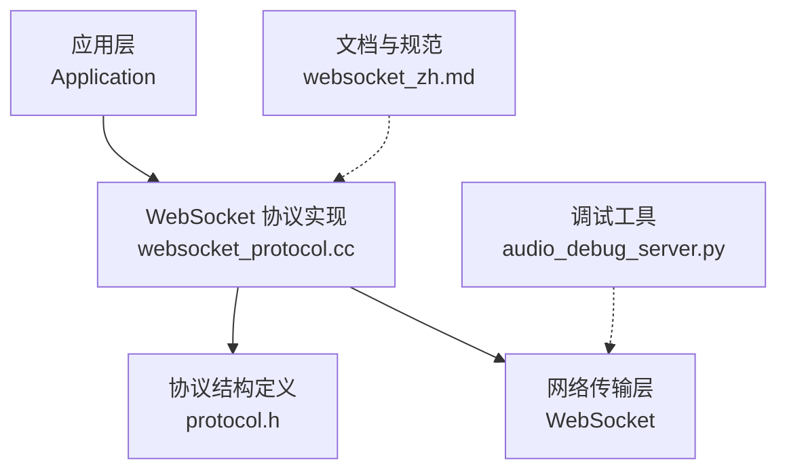
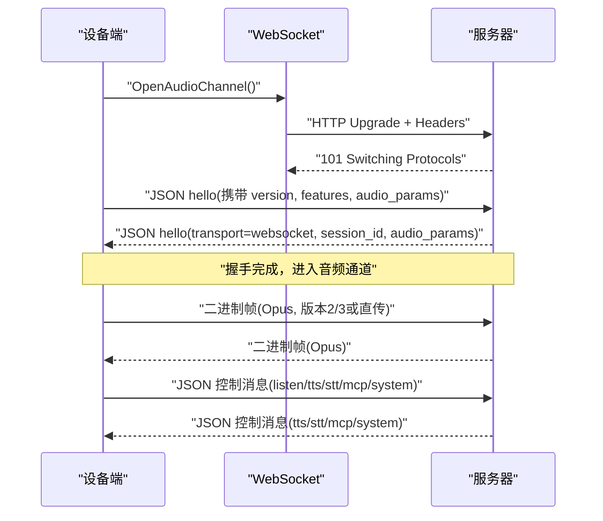
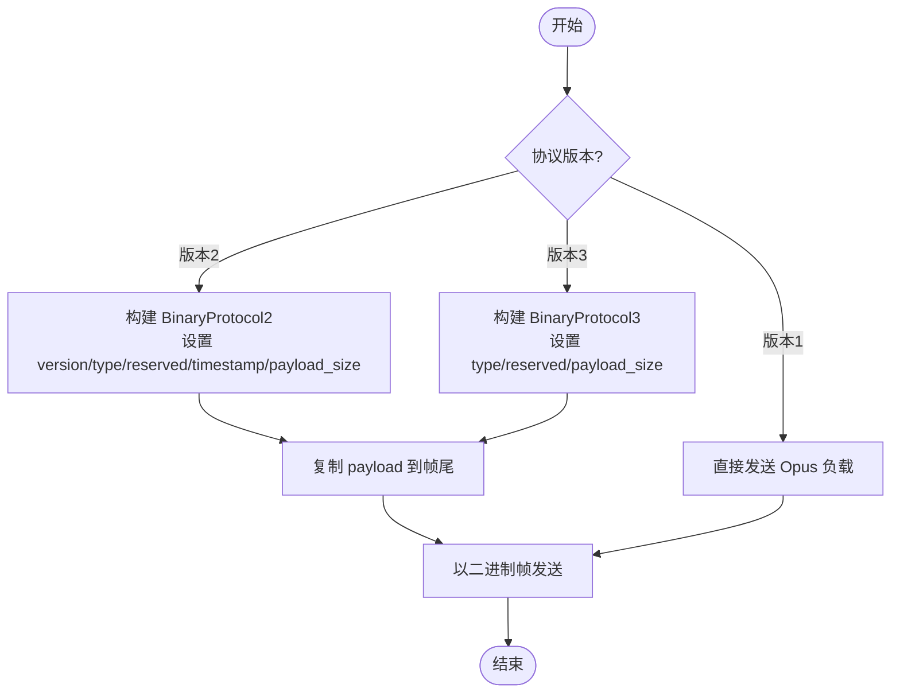
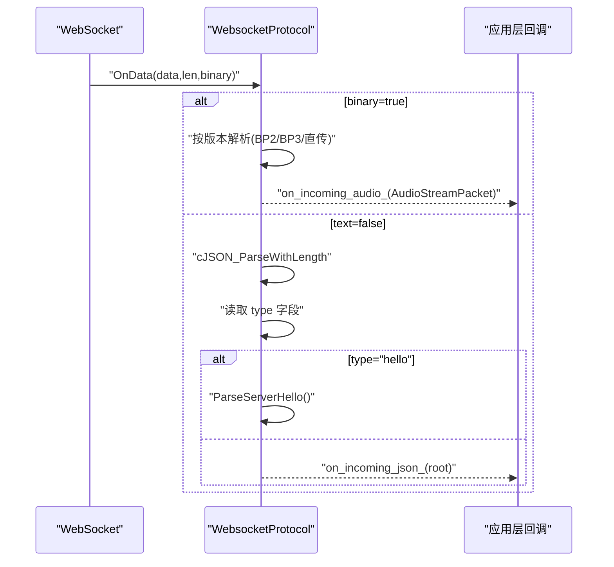
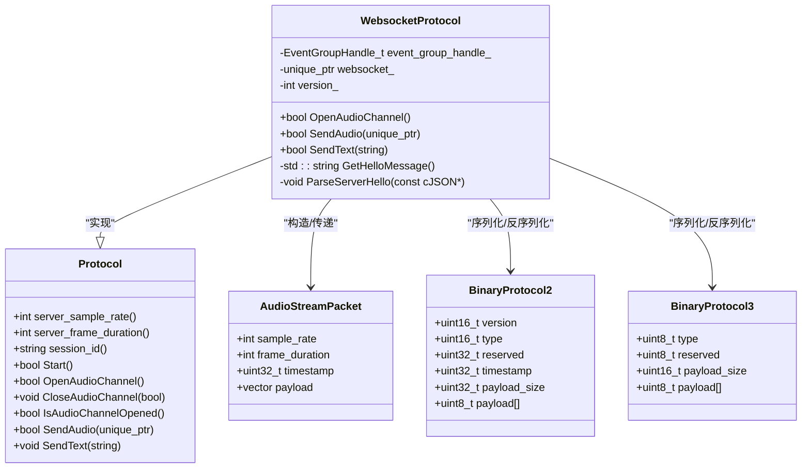

# 二进制协议格式

<cite>
**本文引用的文件**   
- [protocol.h](file://main/protocols/protocol.h)
- [websocket_protocol.cc](file://main/protocols/websocket_protocol.cc)
- [websocket_zh.md](file://docs/websocket_zh.md)
- [audio_debug_server.py](file://scripts/audio_debug_server.py)
</cite>

## 目录
1. [简介](#简介)
2. [项目结构](#项目结构)
3. [核心组件](#核心组件)
4. [架构总览](#架构总览)
5. [详细组件分析](#详细组件分析)
6. [依赖关系分析](#依赖关系分析)
7. [性能与网络特性](#性能与网络特性)
8. [故障排查指南](#故障排查指南)
9. [结论](#结论)
10. [附录：序列化/反序列化工具与抓包解析](#附录序列化反序列化工具与抓包解析)

## 简介
本文件为设备端与服务器之间基于 WebSocket 的二进制协议技术规范，聚焦 BinaryProtocol2 与 BinaryProtocol3 的数据结构定义、字段含义、字节序与对齐要求；说明消息类型标识符、负载大小计算、时间戳精度；解释 OPUS 音频数据的封装方式与 JSON 控制消息的结构；给出协议版本兼容性处理、扩展字段预留策略与校验和算法建议；并提供帧的序列化/反序列化工具函数使用说明、完整报文示例以及抓包分析与解析脚本的使用方法。

## 项目结构
与二进制协议相关的核心代码位于 main/protocols 目录，文档位于 docs 目录，辅助调试工具位于 scripts 目录。关键文件如下：
- 协议结构与接口定义：main/protocols/protocol.h
- WebSocket 协议实现（含序列化/反序列化）：main/protocols/websocket_protocol.cc
- 协议中文文档（握手、JSON 消息等）：docs/websocket_zh.md
- UDP 音频调试接收器（用于 PCM 调试）：scripts/audio_debug_server.py

图表来源
- [websocket_protocol.cc:1-255](file://main/protocols/websocket_protocol.cc#L1-L255)
- [protocol.h:1-99](file://main/protocols/protocol.h#L1-L99)
- [websocket_zh.md:1-496](file://docs/websocket_zh.md#L1-L496)
- [audio_debug_server.py:1-55](file://scripts/audio_debug_server.py#L1-L55)

章节来源
- [websocket_protocol.cc:1-255](file://main/protocols/websocket_protocol.cc#L1-L255)
- [protocol.h:1-99](file://main/protocols/protocol.h#L1-L99)
- [websocket_zh.md:1-496](file://docs/websocket_zh.md#L1-L496)
- [audio_debug_server.py:1-55](file://scripts/audio_debug_server.py#L1-L55)

## 核心组件
- AudioStreamPacket：内部音频流数据包结构，包含采样率、帧时长、时间戳与负载数据。
- BinaryProtocol2：带版本、类型、保留、毫秒级时间戳与负载大小的二进制帧头。
- BinaryProtocol3：简化版二进制帧头，仅含类型、保留与负载大小。
- WebsocketProtocol：负责建立连接、发送/接收文本与二进制帧、按版本进行序列化/反序列化。

章节来源
- [protocol.h:10-31](file://main/protocols/protocol.h#L10-L31)
- [websocket_protocol.cc:28-58](file://main/protocols/websocket_protocol.cc#L28-L58)
- [websocket_protocol.cc:112-147](file://main/protocols/websocket_protocol.cc#L112-L147)

## 架构总览
设备端通过 WebSocket 与服务器交互：
- 握手阶段：设备发送 JSON hello，服务器返回 hello 并协商 audio_params（如采样率、帧时长）。
- 音频通道：双向传输 Opus 编码的二进制帧，支持三种版本（直接 Opus、BinaryProtocol2、BinaryProtocol3）。
- 控制通道：JSON 文本帧承载 listen、tts、stt、mcp、system 等控制消息。

图表来源
- [websocket_protocol.cc:83-201](file://main/protocols/websocket_protocol.cc#L83-L201)
- [websocket_protocol.cc:203-255](file://main/protocols/websocket_protocol.cc#L203-L255)
- [websocket_zh.md:1-496](file://docs/websocket_zh.md#L1-L496)

## 详细组件分析

### 数据结构与字段语义
- AudioStreamPacket
  - sample_rate：采样率（Hz），由服务端协商后写入。
  - frame_duration：每帧时长（ms），由服务端协商后写入。
  - timestamp：时间戳（ms），在 BinaryProtocol2 中有效，用于服务器端 AEC。
  - payload：Opus 编码的音频负载。

- BinaryProtocol2（紧凑打包）
  - version：协议版本号（uint16_t），网络字节序。
  - type：消息类型（uint16_t），0 表示 OPUS，1 表示 JSON。
  - reserved：保留字段（uint32_t），应置零。
  - timestamp：时间戳（uint32_t，毫秒），网络字节序。
  - payload_size：负载长度（uint32_t，字节），网络字节序。
  - payload[]：变长负载数据。

- BinaryProtocol3（紧凑打包）
  - type：消息类型（uint8_t），0 表示 OPUS。
  - reserved：保留字段（uint8_t），应置零。
  - payload_size：负载长度（uint16_t，字节），网络字节序。
  - payload[]：变长负载数据。

字节序与对齐
- 所有多字节整数字段在网络传输时采用网络字节序（大端）。
- 结构体使用紧凑打包，无填充字节，便于跨平台一致布局。

时间戳精度
- BinaryProtocol2 的时间戳单位为毫秒，适用于服务器端 AEC 同步需求。
- BinaryProtocol3 未包含时间戳字段，若需时间同步可在上层约定或通过其他机制提供。

负载大小计算
- 二进制帧总长度 = 帧头长度 + payload_size。
- BinaryProtocol2 帧头长度为 sizeof(BinaryProtocol2)。
- BinaryProtocol3 帧头长度为 sizeof(BinaryProtocol3)。

消息类型标识符
- type=0：OPUS 音频负载。
- type=1：JSON 控制消息（仅在 BinaryProtocol2 中定义）。
- BinaryProtocol3 当前仅用于 OPUS 音频负载。

章节来源
- [protocol.h:10-31](file://main/protocols/protocol.h#L10-L31)
- [websocket_protocol.cc:33-57](file://main/protocols/websocket_protocol.cc#L33-L57)
- [websocket_protocol.cc:115-146](file://main/protocols/websocket_protocol.cc#L115-L146)
- [websocket_zh.md:95-125](file://docs/websocket_zh.md#L95-L125)

### 序列化与反序列化流程
- 发送路径（设备→服务器）
  - 根据配置选择版本：
    - 版本2：构造 BinaryProtocol2，设置 version/type/reserved/timestamp/payload_size，拷贝 payload，整体以二进制帧发送。
    - 版本3：构造 BinaryProtocol3，设置 type/reserved/payload_size，拷贝 payload，整体以二进制帧发送。
    - 版本1：直接发送 Opus 负载（无额外帧头）。
- 接收路径（服务器→设备）
  - 收到二进制帧后，按当前版本解析：
    - 版本2：将多字节字段从网络字节序转换为主机字节序，提取 timestamp 与 payload。
    - 版本3：将 payload_size 从网络字节序转换为主机字节序，提取 payload。
    - 版本1：直接将数据作为 Opus 负载。

图表来源
- [websocket_protocol.cc:28-58](file://main/protocols/websocket_protocol.cc#L28-L58)

章节来源
- [websocket_protocol.cc:28-58](file://main/protocols/websocket_protocol.cc#L28-L58)

### 反序列化与回调分发
- 收到二进制帧后，按版本解析并构造 AudioStreamPacket，调用 on_incoming_audio_ 回调。
- 收到文本帧后，解析 JSON，识别 type 字段：
  - type="hello"：执行 ParseServerHello，更新 session_id、server_sample_rate、server_frame_duration。
  - 其他类型：转发给 on_incoming_json_ 回调处理。

图表来源
- [websocket_protocol.cc:112-166](file://main/protocols/websocket_protocol.cc#L112-L166)
- [websocket_protocol.cc:203-255](file://main/protocols/websocket_protocol.cc#L203-L255)

章节来源
- [websocket_protocol.cc:112-166](file://main/protocols/websocket_protocol.cc#L112-L166)
- [websocket_protocol.cc:203-255](file://main/protocols/websocket_protocol.cc#L203-L255)

### JSON 控制消息结构
- 通用字段
  - type：消息类型字符串，如 hello、listen、abort、stt、llm、tts、mcp、system、custom。
  - session_id：会话标识（可选，握手后可由服务器下发）。
- 常见消息
  - hello（设备→服务器）：version、features、transport、audio_params（format/sample_rate/channels/frame_duration）。
  - hello（服务器→设备）：transport、session_id、audio_params。
  - listen：state=start/stop/detect，mode=auto/manual/realtime。
  - abort：reason=wake_word_detected 或其他。
  - stt：text 为识别结果。
  - tts：state=start/stop/sentence_start，text 为片段文本。
  - mcp：payload 为标准 JSON-RPC 2.0。
  - system：command=reboot 等系统指令。
  - custom：自定义内容（可选）。

章节来源
- [websocket_zh.md:128-292](file://docs/websocket_zh.md#L128-L292)
- [websocket_protocol.cc:203-255](file://main/protocols/websocket_protocol.cc#L203-L255)

### 协议版本兼容性与扩展
- 兼容性
  - 设备通过配置项 version 指定使用的二进制协议版本（1/2/3）。
  - 版本1：直接传输 Opus 负载，无元数据。
  - 版本2：引入时间戳与类型字段，适合需要 AEC 的场景。
  - 版本3：简化帧头，仅含类型与负载大小。
- 扩展字段预留
  - BinaryProtocol2 中的 reserved 字段可用于未来扩展。
  - BinaryProtocol3 中的 reserved 字段同样预留扩展空间。
  - JSON 消息可新增可选字段，但需保持向后兼容。

章节来源
- [websocket_zh.md:95-125](file://docs/websocket_zh.md#L95-L125)
- [websocket_protocol.cc:83-90](file://main/protocols/websocket_protocol.cc#L83-L90)

### 校验和算法
- 二进制协议（BinaryProtocol2/3）未内置校验和字段。
- 建议在应用层增加端到端校验（例如对 payload 计算 CRC32 或哈希值，并在 JSON 控制消息中携带校验信息）。
- 参考项目中其他模块的校验思路（如 AFSK 模块的 CalculateChecksum），可在上层协议中复用类似算法。

章节来源
- [protocol.h:17-31](file://main/protocols/protocol.h#L17-L31)
- [afsk_demod.cc:249-255](file://main/boards/common/afsk_demod.cc#L249-L255)

## 依赖关系分析
- WebsocketProtocol 依赖 protocol.h 中的结构体定义。
- 网络层通过 Board::GetInstance().GetNetwork() 创建 WebSocket 实例。
- 配置项（url、token、version）来自 Settings。
- 日志与错误处理通过 ESP_LOGE/ESP_LOGI 输出。

图表来源
- [protocol.h:44-95](file://main/protocols/protocol.h#L44-L95)
- [protocol.h:10-31](file://main/protocols/protocol.h#L10-L31)
- [websocket_protocol.cc:1-255](file://main/protocols/websocket_protocol.cc#L1-L255)

章节来源
- [protocol.h:44-95](file://main/protocols/protocol.h#L44-L95)
- [websocket_protocol.cc:1-255](file://main/protocols/websocket_protocol.cc#L1-L255)

## 性能与网络特性
- 帧大小与带宽
  - Opus 帧大小随码率变化，典型 60ms 帧在低码率下约数百字节。
  - BinaryProtocol3 帧头更小，适合高吞吐场景。
- 时间戳与延迟
  - BinaryProtocol2 的毫秒级时间戳有助于服务器端 AEC 与抖动缓冲管理。
- 重采样与播放
  - 设备端可能根据服务器下发的采样率进行重采样后再播放。
- 超时与断线
  - 握手阶段等待服务器 hello 有超时保护；断线触发关闭回调。

[本节为一般性指导，不直接分析具体文件]

## 故障排查指南
- 握手失败
  - 检查 Authorization、Protocol-Version、Device-Id、Client-Id 请求头是否正确。
  - 确认服务器返回 hello 且 transport=websocket。
- 音频无法播放
  - 核对 audio_params 中的 format/sample_rate/channels/frame_duration。
  - 确认二进制帧版本与解析逻辑一致。
- JSON 解析错误
  - 确保 type 字段存在且为字符串。
  - 记录缺失字段的日志以便定位。

章节来源
- [websocket_protocol.cc:168-194](file://main/protocols/websocket_protocol.cc#L168-L194)
- [websocket_protocol.cc:148-166](file://main/protocols/websocket_protocol.cc#L148-L166)
- [websocket_zh.md:369-406](file://docs/websocket_zh.md#L369-L406)

## 结论
本协议通过在 WebSocket 上同时传输 JSON 控制消息与 Opus 二进制音频帧，实现了灵活的语音会话控制与高效的双向音频传输。BinaryProtocol2 与 BinaryProtocol3 提供了不同复杂度与开销的帧头选项，满足从基础到高级（AEC）的不同场景需求。通过合理的版本兼容与扩展字段预留，协议具备良好的演进能力。

[本节为总结性内容，不直接分析具体文件]

## 附录：序列化/反序列化工具与抓包解析

### 序列化/反序列化工具函数使用说明
- 发送音频帧（设备→服务器）
  - 选择版本：
    - 版本2：构造 BinaryProtocol2，设置 version/type/reserved/timestamp/payload_size，拷贝 payload，整体发送。
    - 版本3：构造 BinaryProtocol3，设置 type/reserved/payload_size，拷贝 payload，整体发送。
    - 版本1：直接发送 Opus 负载。
- 接收音频帧（服务器→设备）
  - 按版本解析：
    - 版本2：将多字节字段从网络字节序转换为主机字节序，提取 timestamp 与 payload。
    - 版本3：将 payload_size 从网络字节序转换为主机字节序，提取 payload。
    - 版本1：直接作为 Opus 负载处理。

章节来源
- [websocket_protocol.cc:28-58](file://main/protocols/websocket_protocol.cc#L28-L58)
- [websocket_protocol.cc:115-146](file://main/protocols/websocket_protocol.cc#L115-L146)

### 完整协议报文示例（文本描述）
- 握手（设备→服务器）
  - JSON hello：type=hello，version=2/3，features={mcp:true,...}，transport=websocket，audio_params={format=opus,sample_rate=16000,channels=1,frame_duration=60}。
- 握手（服务器→设备）
  - JSON hello：transport=websocket，session_id=xxx，audio_params={format=opus,sample_rate=24000,frame_duration=60}。
- 控制消息（设备→服务器）
  - listen：type=listensession_id=xxx,state=start,mode=manual。
  - abort：type=abort,reason=wake_word_detected。
- 控制消息（服务器→设备）
  - stt：type=stt,text=用户说的话。
  - tts：type=tts,state=start 或 stop 或 sentence_start。
  - mcp：type=mcp,payload=jsonrpc 2.0 对象。
- 音频帧
  - 版本2：BinaryProtocol2{version,type=0,reserved=0,timestamp(ms),payload_size,Opus...}。
  - 版本3：BinaryProtocol3{type=0,reserved=0,payload_size,Opus...}。
  - 版本1：纯 Opus 字节流。

章节来源
- [websocket_zh.md:132-292](file://docs/websocket_zh.md#L132-L292)
- [websocket_protocol.cc:203-255](file://main/protocols/websocket_protocol.cc#L203-L255)

### 抓包分析与解析脚本使用方法
- 抓包工具
  - 使用 Wireshark 抓取 WebSocket 流量，过滤 ws 或 wss 端口。
  - 对于二进制帧，查看 Data 字段并按版本解析帧头与负载。
- 文本消息解析
  - 在 Wireshark 中将文本帧导出为 JSON，对照 type 字段进行分类处理。
- 音频数据验证
  - 将二进制帧的 payload 保存为 .opus 文件，使用播放器验证。
  - 如需 PCM 调试，可使用 scripts/audio_debug_server.py 接收 UDP PCM 数据并保存为 WAV 文件，便于离线分析。

章节来源
- [audio_debug_server.py:1-55](file://scripts/audio_debug_server.py#L1-L55)