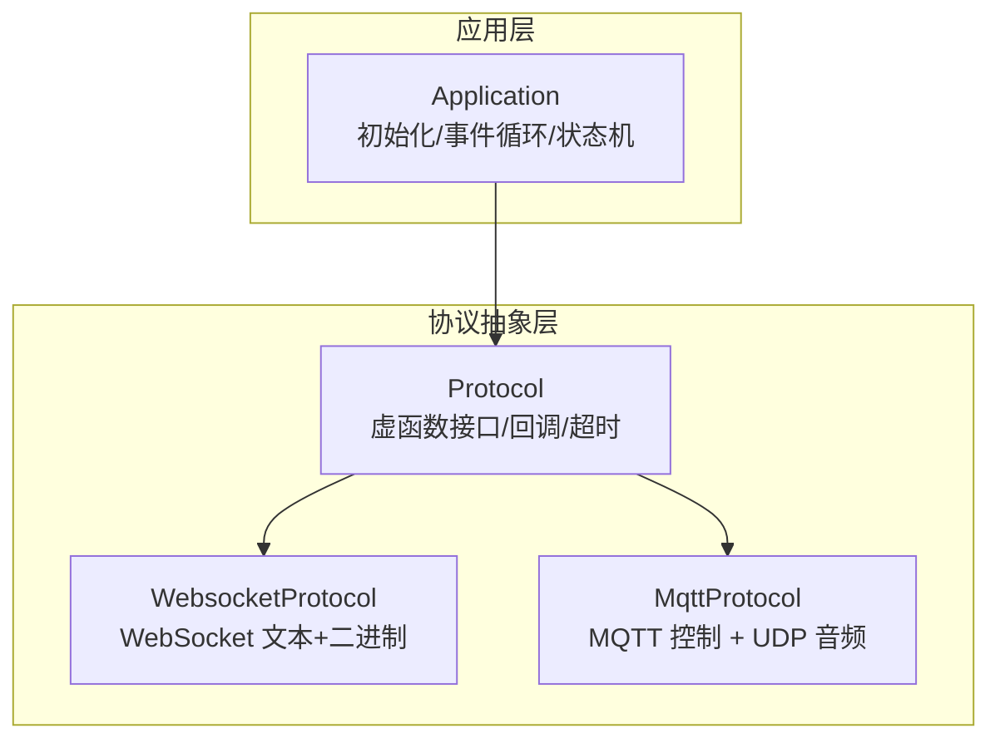
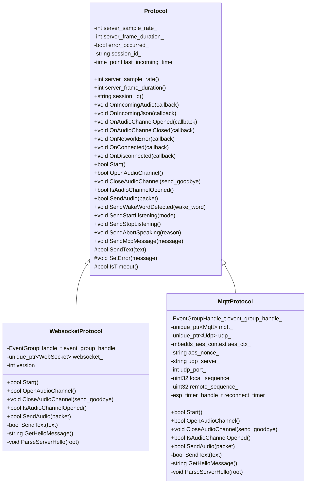
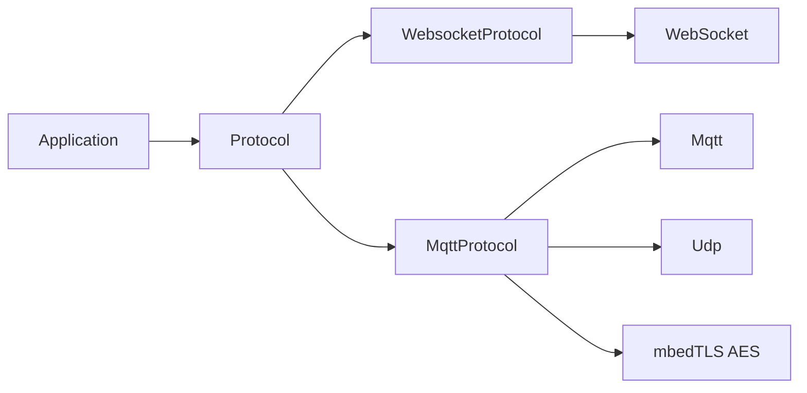

# 协议抽象层设计

<cite>
**本文引用的文件列表**
- [protocol.h](file://main/protocols/protocol.h)
- [protocol.cc](file://main/protocols/protocol.cc)
- [websocket_protocol.h](file://main/protocols/websocket_protocol.h)
- [websocket_protocol.cc](file://main/protocols/websocket_protocol.cc)
- [mqtt_protocol.h](file://main/protocols/mqtt_protocol.h)
- [mqtt_protocol.cc](file://main/protocols/mqtt_protocol.cc)
- [application.h](file://main/application.h)
- [application.cc](file://main/application.cc)
</cite>

## 目录
1. [简介](#简介)
2. [项目结构](#项目结构)
3. [核心组件](#核心组件)
4. [架构总览](#架构总览)
5. [详细组件分析](#详细组件分析)
6. [依赖关系分析](#依赖关系分析)
7. [性能与超时检测](#性能与超时检测)
8. [错误处理策略](#错误处理策略)
9. [自定义协议实现指南](#自定义协议实现指南)
10. [故障排查](#故障排查)
11. [结论](#结论)

## 简介
本技术文档聚焦于“协议抽象层”的设计与实现，围绕 Protocol 基类、回调机制、事件处理系统展开，深入解释 AudioStreamPacket 数据结构、BinaryProtocol2/3 帧格式及其使用场景，并说明监听模式(ListeningMode)与中断原因(AbortReason)的枚举设计。同时覆盖协议生命周期管理、错误处理策略、超时检测机制，并提供扩展自定义协议的实践指导与示例路径。

## 项目结构
协议抽象层位于 main/protocols 目录下，包含：
- 抽象基类与通用逻辑：protocol.h / protocol.cc
- WebSocket 传输实现：websocket_protocol.h / websocket_protocol.cc
- MQTT + UDP 音频通道实现：mqtt_protocol.h / mqtt_protocol.cc
- 应用层集成：application.h / application.cc（负责选择具体协议、注册回调、驱动状态机）

图表来源
- [application.h:43-176](file://main/application.h#L43-L176)
- [protocol.h:44-95](file://main/protocols/protocol.h#L44-L95)
- [websocket_protocol.h:13-32](file://main/protocols/websocket_protocol.h#L13-L32)
- [mqtt_protocol.h:26-62](file://main/protocols/mqtt_protocol.h#L26-L62)

章节来源
- [application.h:43-176](file://main/application.h#L43-L176)
- [application.cc:473-610](file://main/application.cc#L473-L610)
- [protocol.h:44-95](file://main/protocols/protocol.h#L44-L95)

## 核心组件
- Protocol 基类
  - 定义统一的虚函数接口：Start/OpenAudioChannel/CloseAudioChannel/SendAudio/IsAudioChannelOpened 等
  - 提供回调注册：OnIncomingAudio/OnIncomingJson/OnAudioChannelOpened/Closed/OnConnected/OnDisconnected/OnNetworkError
  - 内置会话参数：server_sample_rate_、server_frame_duration_、session_id_
  - 内置超时检测：last_incoming_time_ 与 IsTimeout()
  - 内置消息发送封装：SendWakeWordDetected/SendStartListening/SendStopListening/SendAbortSpeaking/SendMcpMessage
- 数据模型
  - AudioStreamPacket：携带采样率、帧时长、时间戳与载荷
  - BinaryProtocol2/3：二进制音频帧头，用于在 WebSocket 上高效传输 OPUS 数据
- 枚举
  - ListeningMode：自动停止/手动停止/实时（需 AEC）
  - AbortReason：无/唤醒词触发
- 具体实现
  - WebsocketProtocol：基于 WebSocket 的文本控制与二进制音频通道
  - MqttProtocol：基于 MQTT 的控制面与基于 UDP 的加密音频通道

章节来源
- [protocol.h:10-42](file://main/protocols/protocol.h#L10-L42)
- [protocol.h:44-95](file://main/protocols/protocol.h#L44-L95)
- [protocol.cc:35-90](file://main/protocols/protocol.cc#L35-L90)
- [websocket_protocol.h:13-32](file://main/protocols/websocket_protocol.h#L13-L32)
- [mqtt_protocol.h:26-62](file://main/protocols/mqtt_protocol.h#L26-L62)

## 架构总览
协议抽象层采用“面向接口编程 + 多态实现”的模式。Application 在启动阶段根据配置动态创建具体协议实例，并注册回调；上层业务仅依赖 Protocol 抽象，无需感知底层传输差异。

图表来源
- [protocol.h:44-95](file://main/protocols/protocol.h#L44-L95)
- [websocket_protocol.h:13-32](file://main/protocols/websocket_protocol.h#L13-L32)
- [mqtt_protocol.h:26-62](file://main/protocols/mqtt_protocol.h#L26-L62)

## 详细组件分析

### Protocol 基类设计与回调机制
- 虚函数接口
  - 生命周期：Start/OpenAudioChannel/CloseAudioChannel/IsAudioChannelOpened
  - 数据面：SendAudio
  - 控制面：SendWakeWordDetected/SendStartListening/SendStopListening/SendAbortSpeaking/SendMcpMessage
- 回调注册
  - 上行：OnIncomingAudio(音频包)、OnIncomingJson(JSON 消息)
  - 连接：OnConnected/OnDisconnected
  - 通道：OnAudioChannelOpened/OnAudioChannelClosed
  - 错误：OnNetworkError
- 内部状态
  - server_sample_rate_/server_frame_duration_：由服务器 hello 协商后写入
  - session_id_：会话标识
  - last_incoming_time_：最近一次收到数据的时刻，配合 IsTimeout() 做保活/超时判断
- 默认实现
  - SetError：设置错误标志并触发网络错误回调
  - IsTimeout：超过固定阈值（秒）判定为超时
  - 控制消息构造：将 Listen/Auto/Manual/Realtime/WakeWord/Abort/MCP 等语义转换为 JSON 并通过 SendText 发送

章节来源
- [protocol.h:44-95](file://main/protocols/protocol.h#L44-L95)
- [protocol.cc:35-90](file://main/protocols/protocol.cc#L35-L90)

### AudioStreamPacket 数据结构
- 字段
  - sample_rate/frame_duration：由服务器协商决定，便于解码器正确工作
  - timestamp：用于服务端 AEC 或时序对齐（不同协议版本可能为 0）
  - payload：OPUS 编码后的音频字节流
- 复杂度
  - 内存分配：payload 使用 vector<uint8_t>，拷贝开销与帧大小线性相关
  - 传递方式：通过 unique_ptr 移动语义减少拷贝

章节来源
- [protocol.h:10-15](file://main/protocols/protocol.h#L10-L15)

### BinaryProtocol2 与 BinaryProtocol3 帧格式
- BinaryProtocol2
  - 字段：version/type/reserved/timestamp/payload_size/payload[]
  - 用途：WebSocket 二进制音频帧，携带时间戳，适合服务端 AEC
  - 字节序：version/type 使用网络序（htons），timestamp/payload_size 使用网络序（htonl）
- BinaryProtocol3
  - 字段：type/reserved/payload_size/payload[]
  - 用途：简化版二进制帧，不携带时间戳
- 使用场景
  - 当协商版本为 2 时，使用 BP2；为 3 时，使用 BP3；否则直接透传原始 OPUS 负载

章节来源
- [protocol.h:17-31](file://main/protocols/protocol.h#L17-L31)
- [websocket_protocol.cc:33-57](file://main/protocols/websocket_protocol.cc#L33-L57)
- [websocket_protocol.cc:112-146](file://main/protocols/websocket_protocol.cc#L112-L146)

### 监听模式与中断原因枚举
- ListeningMode
  - kListeningModeAutoStop：自动停止（VAD 或 TTS stop 后返回空闲）
  - kListeningModeManualStop：手动停止（需要用户显式 Stop）
  - kListeningModeRealtime：实时模式（需要 AEC 支持）
- AbortReason
  - kAbortReasonNone：普通中断
  - kAbortReasonWakeWordDetected：唤醒词触发中断

章节来源
- [protocol.h:33-42](file://main/protocols/protocol.h#L33-L42)

### WebsocketProtocol 实现要点
- 握手流程
  - 打开 WebSocket，设置 Authorization/Protocol-Version/Device-Id/Client-Id 等头部
  - 发送客户端 hello（包含 transport/version/features/audio_params）
  - 等待服务器 hello，解析 session_id 与 audio_params，设置事件组位
- 音频收发
  - 发送：按版本打包 BP2/BP3 或直接发送 payload
  - 接收：二进制走 on_incoming_audio_，JSON 走 on_incoming_json_
- 通道状态
  - IsAudioChannelOpened：连接存在且未出错且未超时
- 错误处理
  - 连接失败/发送失败/超时均调用 SetError 上报

章节来源
- [websocket_protocol.h:13-32](file://main/protocols/websocket_protocol.h#L13-L32)
- [websocket_protocol.cc:83-201](file://main/protocols/websocket_protocol.cc#L83-L201)
- [websocket_protocol.cc:203-254](file://main/protocols/websocket_protocol.cc#L203-L254)

### MqttProtocol 实现要点
- 控制面（MQTT）
  - 连接 Broker，订阅/发布主题，处理 hello/goodbye 及通用 JSON 消息
  - 重连：断开后定时任务尝试重连
- 音频面（UDP）
  - 通过 hello 中的 udp/key/nonce 建立 AES-CTR 上下文
  - 发送：拼接 nonce（含长度、时间戳、序列号），AES-CTR 加密后 UDP 发送
  - 接收：校验类型/长度，解密，更新远端序列号，投递到 on_incoming_audio_
- 通道状态
  - IsAudioChannelOpened：UDP 已连接且未出错且未超时

章节来源
- [mqtt_protocol.h:26-62](file://main/protocols/mqtt_protocol.h#L26-L62)
- [mqtt_protocol.cc:59-152](file://main/protocols/mqtt_protocol.cc#L59-L152)
- [mqtt_protocol.cc:166-190](file://main/protocols/mqtt_protocol.cc#L166-L190)
- [mqtt_protocol.cc:215-295](file://main/protocols/mqtt_protocol.cc#L215-L295)
- [mqtt_protocol.cc:322-366](file://main/protocols/mqtt_protocol.cc#L322-L366)

### 应用层集成与事件循环
- 协议选择：根据 OTA 配置选择 MQTT 或 WebSocket
- 回调绑定：连接/断开、音频通道开闭、网络错误、音频/JSON 数据
- 状态机联动：tts start/stop、stt、llm emotion、mcp、system/alert 等消息驱动 UI 与设备状态
- 音频队列：主循环从音频服务取包并调用 protocol_->SendAudio

章节来源
- [application.h:43-176](file://main/application.h#L43-L176)
- [application.cc:473-610](file://main/application.cc#L473-L610)
- [application.cc:165-259](file://main/application.cc#L165-L259)

## 依赖关系分析
- Application 依赖 Protocol 抽象，运行时注入具体实现
- WebsocketProtocol 依赖网络抽象（WebSocket）、cJSON、FreeRTOS EventGroup
- MqttProtocol 依赖网络抽象（Mqtt/Udp）、cJSON、mbedTLS AES、FreeRTOS EventGroup/Timer
- 所有实现共享 Protocol 的超时与错误上报机制

图表来源
- [application.cc:473-610](file://main/application.cc#L473-L610)
- [websocket_protocol.cc:1-11](file://main/protocols/websocket_protocol.cc#L1-L11)
- [mqtt_protocol.cc:1-10](file://main/protocols/mqtt_protocol.cc#L1-L10)

章节来源
- [application.cc:473-610](file://main/application.cc#L473-L610)
- [websocket_protocol.cc:1-11](file://main/protocols/websocket_protocol.cc#L1-L11)
- [mqtt_protocol.cc:1-10](file://main/protocols/mqtt_protocol.cc#L1-L10)

## 性能与超时检测
- 超时检测
  - 每次收到数据（JSON 或音频）都会刷新 last_incoming_time_
  - IsTimeout() 比较当前时间与上次接收时间的差值，超过阈值即判定超时
- 性能考量
  - 音频发送路径尽量零拷贝：使用 unique_ptr 移动语义
  - 二进制帧避免多余序列化：BP2/BP3 直接映射到连续内存
  - MQTT 侧使用 AES-CTR 流式加解密，避免整包缓冲
- 建议
  - 合理设置服务器 frame_duration 与采样率，避免重采样失真
  - 在网络抖动环境下，关注 IsTimeout 触发频率，必要时调整上层重试策略

章节来源
- [protocol.cc:81-90](file://main/protocols/protocol.cc#L81-L90)
- [websocket_protocol.cc:112-166](file://main/protocols/websocket_protocol.cc#L112-L166)
- [mqtt_protocol.cc:243-287](file://main/protocols/mqtt_protocol.cc#L243-L287)

## 错误处理策略
- 统一入口：SetError 设置错误标志并触发 OnNetworkError 回调
- 典型错误点
  - WebSocket：连接失败、发送失败、未收到服务器 hello
  - MQTT：连接失败、发布失败、hello 超时、goodbye 处理
- 上层处理
  - Application 捕获 MAIN_EVENT_ERROR，重置状态并提示用户
  - 网络断开时关闭音频通道，避免资源泄漏

章节来源
- [protocol.cc:35-40](file://main/protocols/protocol.cc#L35-L40)
- [websocket_protocol.cc:175-194](file://main/protocols/websocket_protocol.cc#L175-L194)
- [mqtt_protocol.cc:144-152](file://main/protocols/mqtt_protocol.cc#L144-L152)
- [application.cc:493-496](file://main/application.cc#L493-L496)

## 自定义协议实现指南
- 继承 Protocol 基类
  - 必须实现：Start/OpenAudioChannel/CloseAudioChannel/IsAudioChannelOpened/SendAudio/SendText
  - 可选重写：SetError/IsTimeout（如需自定义超时策略）
- 回调注册
  - 在构造函数或初始化中注册 OnIncomingAudio/OnIncomingJson/OnAudioChannelOpened/Closed/OnConnected/OnDisconnected/OnNetworkError
- 会话参数
  - 在 hello 响应解析后更新 server_sample_rate_/server_frame_duration_/session_id_
- 控制消息
  - 复用基类的 SendStartListening/SendStopListening/SendAbortSpeaking/SendMcpMessage/SendWakeWordDetected，确保 JSON 结构与服务器一致
- 错误与超时
  - 任何异常路径调用 SetError 上报；收到数据刷新 last_incoming_time_
- 集成到应用
  - 在 Application::InitializeProtocol 中按条件创建新协议实例并注册回调
  - 若新增配置项，需在 OTA 配置中暴露开关或参数

章节来源
- [protocol.h:44-95](file://main/protocols/protocol.h#L44-L95)
- [protocol.cc:42-79](file://main/protocols/protocol.cc#L42-L79)
- [application.cc:473-610](file://main/application.cc#L473-L610)

## 故障排查
- 无法建立音频通道
  - 检查 WebSocket/MQTT 连接是否成功，确认 hello 是否收到
  - 查看 IsAudioChannelOpened 返回值与错误日志
- 音频无声或卡顿
  - 核对 server_sample_rate/frame_duration 是否与硬件匹配
  - 检查网络丢包与超时（IsTimeout）
- MQTT 音频乱序或重复
  - 检查本地/远端序列号递增逻辑，确认解密成功
- 唤醒词打断无效
  - 确认 SendAbortSpeaking 被调用且 reason 正确

章节来源
- [websocket_protocol.cc:175-201](file://main/protocols/websocket_protocol.cc#L175-L201)
- [mqtt_protocol.cc:243-287](file://main/protocols/mqtt_protocol.cc#L243-L287)
- [protocol.cc:81-90](file://main/protocols/protocol.cc#L81-L90)

## 结论
本协议抽象层以 Protocol 为核心，通过虚函数接口与回调机制解耦了上层业务与底层传输细节。AudioStreamPacket 与 BinaryProtocol2/3 提供了高效的音频数据承载方式；ListeningMode 与 AbortReason 明确了交互语义。结合超时检测与统一错误上报，系统在多种网络条件下具备良好鲁棒性。开发者可基于该抽象快速扩展新的传输协议，只需遵循接口契约与消息约定即可无缝接入应用层。