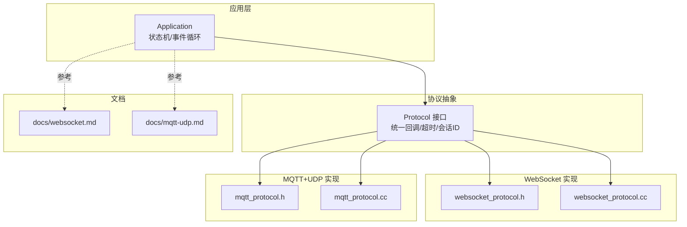
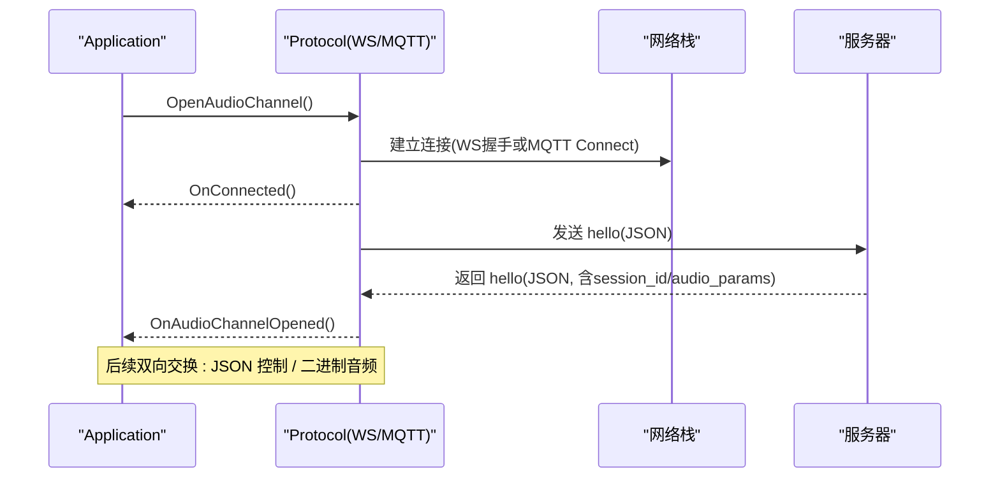
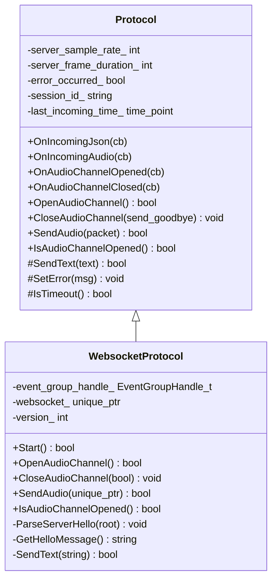
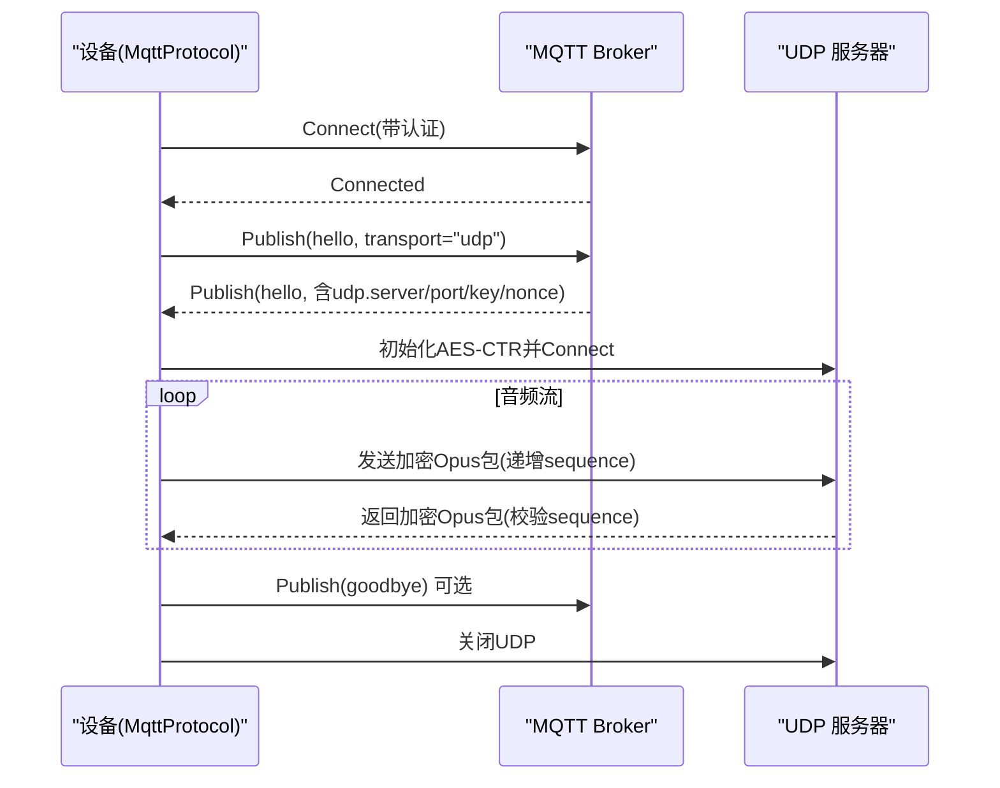
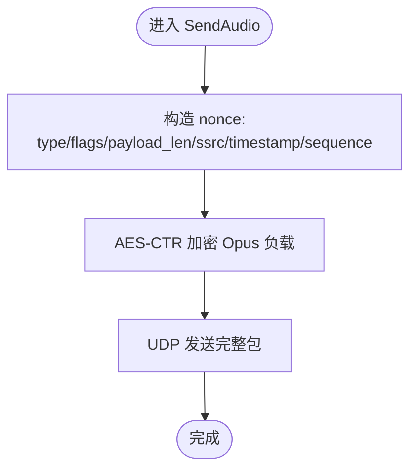
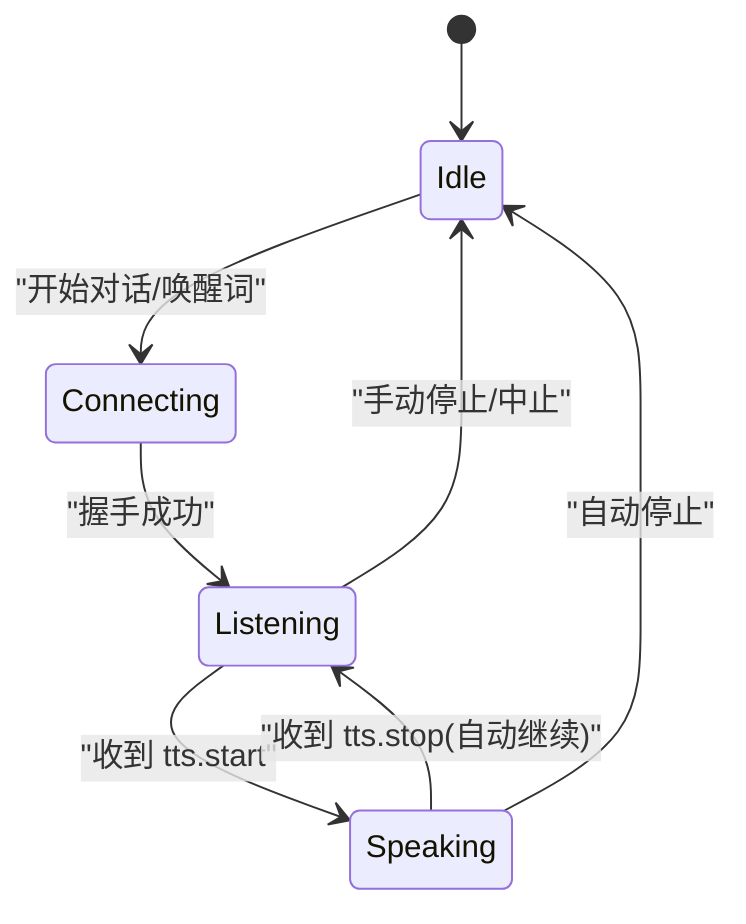
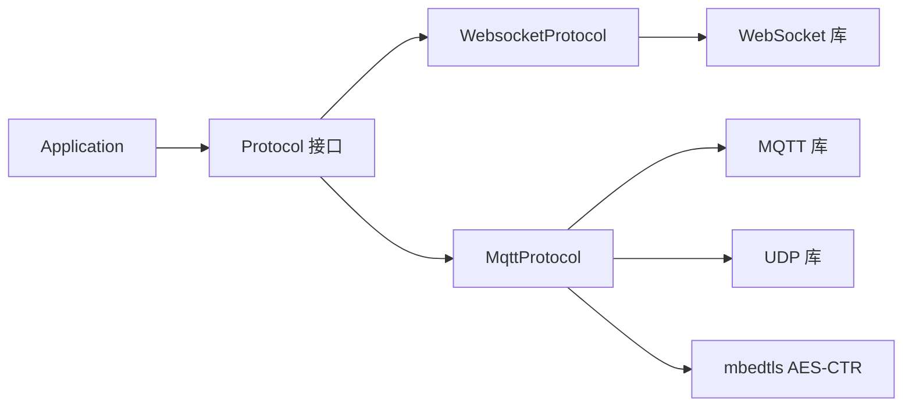

# 通信协议实现

<cite>
**本文引用的文件列表**
- [websocket.md](file://docs/websocket.md)
- [mqtt-udp.md](file://docs/mqtt-udp.md)
- [protocol.h](file://main/protocols/protocol.h)
- [protocol.cc](file://main/protocols/protocol.cc)
- [websocket_protocol.h](file://main/protocols/websocket_protocol.h)
- [websocket_protocol.cc](file://main/protocols/websocket_protocol.cc)
- [mqtt_protocol.h](file://main/protocols/mqtt_protocol.h)
- [mqtt_protocol.cc](file://main/protocols/mqtt_protocol.cc)
- [application.h](file://main/application.h)
- [application.cc](file://main/application.cc)
</cite>

## 目录
1. [简介](#简介)
2. [项目结构](#项目结构)
3. [核心组件](#核心组件)
4. [架构总览](#架构总览)
5. [详细组件分析](#详细组件分析)
6. [依赖关系分析](#依赖关系分析)
7. [性能与优化](#性能与优化)
8. [故障排查指南](#故障排查指南)
9. [安全与扩展](#安全与扩展)
10. [结论](#结论)

## 简介
本技术文档聚焦于设备端通信协议的实现，覆盖两类传输方案：
- WebSocket 全双工通道：基于文本 JSON 控制消息与二进制音频帧（Opus）的混合传输。
- MQTT + UDP 混合通道：MQTT 承载控制面，UDP 承载加密实时音频面。

文档从协议设计、二进制帧格式、连接建立、心跳保活、断线重连、音频与控制流优化、调试抓包方法、安全机制以及自定义扩展等方面展开，帮助开发者快速理解并集成或扩展协议。

## 项目结构
协议相关代码集中在 main/protocols 目录，应用层在 main/application.* 中编排协议生命周期与事件分发；协议规范说明位于 docs 目录。

图表来源
- [application.cc:473-610](file://main/application.cc#L473-L610)
- [protocol.h:44-95](file://main/protocols/protocol.h#L44-L95)
- [websocket_protocol.h:13-32](file://main/protocols/websocket_protocol.h#L13-L32)
- [websocket_protocol.cc:83-201](file://main/protocols/websocket_protocol.cc#L83-L201)
- [mqtt_protocol.h:26-62](file://main/protocols/mqtt_protocol.h#L26-L62)
- [mqtt_protocol.cc:215-295](file://main/protocols/mqtt_protocol.cc#L215-L295)

章节来源
- [application.cc:473-610](file://main/application.cc#L473-L610)
- [protocol.h:44-95](file://main/protocols/protocol.h#L44-L95)
- [websocket_protocol.h:13-32](file://main/protocols/websocket_protocol.h#L13-L32)
- [websocket_protocol.cc:83-201](file://main/protocols/websocket_protocol.cc#L83-L201)
- [mqtt_protocol.h:26-62](file://main/protocols/mqtt_protocol.h#L26-L62)
- [mqtt_protocol.cc:215-295](file://main/protocols/mqtt_protocol.cc#L215-L295)
- [websocket.md:1-531](file://docs/websocket.md#L1-L531)
- [mqtt-udp.md:1-410](file://docs/mqtt-udp.md#L1-L410)

## 核心组件
- Protocol 抽象接口：定义统一的音频/JSON 回调、连接生命周期、发送控制指令等能力，并提供默认超时检测与会话 ID 管理。
- WebsocketProtocol：基于 WebSocket 的双向通道，支持 v1/v2/v3 三种二进制音频封装。
- MqttProtocol：基于 MQTT 控制面 + UDP 数据面的混合协议，使用 AES-CTR 对音频进行端到端加密。
- Application：负责协议实例选择、事件分发、状态机驱动、音频队列调度与 UI/LED 联动。

章节来源
- [protocol.h:10-95](file://main/protocols/protocol.h#L10-L95)
- [protocol.cc:35-91](file://main/protocols/protocol.cc#L35-L91)
- [websocket_protocol.h:13-32](file://main/protocols/websocket_protocol.h#L13-L32)
- [websocket_protocol.cc:28-76](file://main/protocols/websocket_protocol.cc#L28-L76)
- [mqtt_protocol.h:26-62](file://main/protocols/mqtt_protocol.h#L26-L62)
- [mqtt_protocol.cc:166-190](file://main/protocols/mqtt_protocol.cc#L166-L190)
- [application.h:43-176](file://main/application.h#L43-L176)
- [application.cc:473-610](file://main/application.cc#L473-L610)

## 架构总览
设备启动后，Application 根据配置动态选择 WebSocket 或 MQTT+UDP 协议实例，注册回调并在主事件循环中处理网络、音频与用户交互事件。

图表来源
- [application.cc:473-610](file://main/application.cc#L473-L610)
- [websocket_protocol.cc:182-201](file://main/protocols/websocket_protocol.cc#L182-L201)
- [mqtt_protocol.cc:215-295](file://main/protocols/mqtt_protocol.cc#L215-L295)

## 详细组件分析

### WebSocket 协议
- 连接建立
  - 读取 URL、token、版本等设置，设置请求头（Authorization、Protocol-Version、Device-Id、Client-Id），发起握手。
  - 成功后发送客户端 hello（包含 version、features、transport、audio_params）。
  - 等待服务端 hello，解析 session_id 与 audio_params，触发“音频通道已打开”回调。
- 数据传输
  - 文本 JSON：用于 TTS/STT/MCP/System/Alert/Custom 等控制消息。
  - 二进制 Opus：按版本 v1/v2/v3 封装，v2/v3 携带元数据（如时间戳、负载长度）。
- 错误与断开
  - 连接失败/握手超时：上报网络错误，回到空闲态。
  - 远端断开：触发关闭回调，清理资源。

图表来源
- [protocol.h:44-95](file://main/protocols/protocol.h#L44-L95)
- [websocket_protocol.h:13-32](file://main/protocols/websocket_protocol.h#L13-L32)
- [websocket_protocol.cc:83-201](file://main/protocols/websocket_protocol.cc#L83-L201)

章节来源
- [websocket.md:1-531](file://docs/websocket.md#L1-L531)
- [websocket_protocol.cc:28-76](file://main/protocols/websocket_protocol.cc#L28-L76)
- [websocket_protocol.cc:112-166](file://main/protocols/websocket_protocol.cc#L112-L166)
- [websocket_protocol.cc:203-255](file://main/protocols/websocket_protocol.cc#L203-L255)
- [protocol.h:17-31](file://main/protocols/protocol.h#L17-L31)

#### 二进制帧结构（WebSocket）
- v1：直接发送原始 Opus 帧。
- v2：固定头部包含版本、类型、保留字段、毫秒时间戳、负载长度与负载。
- v3：轻量头部包含类型、保留字段、负载长度与负载。

章节来源
- [protocol.h:17-31](file://main/protocols/protocol.h#L17-L31)
- [websocket_protocol.cc:33-58](file://main/protocols/websocket_protocol.cc#L33-L58)
- [websocket.md:96-127](file://docs/websocket.md#L96-L127)

#### 控制消息（WebSocket）
- 设备 -> 服务器：hello、listen(start/stop/detect)、abort、mcp(payload=JSON-RPC 2.0)。
- 服务器 -> 设备：hello、stt、llm、tts(start/stop/sentence_start)、mcp、system(reboot)、alert、custom、二进制音频。

章节来源
- [websocket.md:129-308](file://docs/websocket.md#L129-L308)
- [protocol.cc:42-79](file://main/protocols/protocol.cc#L42-L79)

### MQTT + UDP 混合协议
- 控制面（MQTT）
  - 连接参数来自存储（endpoint、client_id、username/password、keepalive、publish_topic）。
  - 自动重连：断开后定时重试；收到 goodbye 时避免回发 goodbye 防止乒乓。
  - Hello 协商：设备发送 transport="udp" 的 hello，服务器返回 UDP 端点与 AES 密钥/随机数。
- 数据面（UDP）
  - 音频包格式：type/flags/payload_len/ssrc/timestamp/sequence + 加密负载。
  - 加密：AES-CTR，nonce 由服务器下发，计数器由 timestamp 与 sequence 组合生成。
  - 序列号：单调递增，接收端校验连续性，丢弃旧包，容忍小范围乱序。
- 状态与超时
  - 通过 base Protocol 的 last_incoming_time_ 做 120s 超时判定。
  - IsAudioChannelOpened 综合判断 UDP 句柄、错误标志与超时。

图表来源
- [mqtt_protocol.cc:59-152](file://main/protocols/mqtt_protocol.cc#L59-L152)
- [mqtt_protocol.cc:215-295](file://main/protocols/mqtt_protocol.cc#L215-L295)
- [mqtt-udp.md:23-58](file://docs/mqtt-udp.md#L23-L58)

章节来源
- [mqtt-udp.md:1-410](file://docs/mqtt-udp.md#L1-L410)
- [mqtt_protocol.cc:166-190](file://main/protocols/mqtt_protocol.cc#L166-L190)
- [mqtt_protocol.cc:243-287](file://main/protocols/mqtt_protocol.cc#L243-L287)
- [mqtt_protocol.cc:322-366](file://main/protocols/mqtt_protocol.cc#L322-L366)
- [protocol.cc:81-91](file://main/protocols/protocol.cc#L81-L91)

#### UDP 音频包格式与加密流程

图表来源
- [mqtt_protocol.cc:166-190](file://main/protocols/mqtt_protocol.cc#L166-L190)
- [mqtt-udp.md:203-241](file://docs/mqtt-udp.md#L203-L241)

章节来源
- [mqtt-udp.md:203-241](file://docs/mqtt-udp.md#L203-L241)
- [mqtt_protocol.cc:166-190](file://main/protocols/mqtt_protocol.cc#L166-L190)

### 应用层编排（Application）
- 协议选择：优先 MQTT，其次 WebSocket，否则回退到 MQTT。
- 事件循环：统一处理网络、音频发送、唤醒词、VAD、时钟 tick 等事件。
- 状态机：Idle/Connecting/Listening/Speaking 等状态转换，结合 AEC 模式决定监听模式。
- 回调绑定：将协议层的音频/JSON/连接事件映射到 UI、音频解码队列与系统行为。

图表来源
- [application.cc:690-730](file://main/application.cc#L690-L730)
- [application.cc:860-932](file://main/application.cc#L860-L932)
- [websocket.md:323-398](file://docs/websocket.md#L323-L398)

章节来源
- [application.cc:473-610](file://main/application.cc#L473-L610)
- [application.cc:690-730](file://main/application.cc#L690-L730)
- [application.cc:860-932](file://main/application.cc#L860-L932)
- [websocket.md:323-398](file://docs/websocket.md#L323-L398)

## 依赖关系分析
- 耦合与内聚
  - Application 仅依赖 Protocol 抽象，具体实现可替换，内聚良好。
  - WebsocketProtocol 与 MqttProtocol 分别依赖底层网络库（WebSocket/MQTT/UDP），职责清晰。
- 外部依赖
  - cJSON 用于 JSON 编解码。
  - mbedtls AES-CTR 用于 UDP 音频加密。
  - FreeRTOS 事件组与定时器用于握手同步与重连调度。
- 潜在循环依赖
  - 无直接循环引用；Application 持有 Protocol 指针，协议层不反向持有 Application。

图表来源
- [application.cc:473-610](file://main/application.cc#L473-L610)
- [mqtt_protocol.cc:166-190](file://main/protocols/mqtt_protocol.cc#L166-L190)

章节来源
- [application.cc:473-610](file://main/application.cc#L473-L610)
- [mqtt_protocol.cc:166-190](file://main/protocols/mqtt_protocol.cc#L166-L190)

## 性能与优化
- 低延迟路径
  - MQTT+UDP 分离控制与数据面，UDP 直传加密音频，降低端到端延迟。
  - WebSocket 下采用 60ms 帧长，平衡带宽与延迟。
- 并发与内存
  - MQTT 侧使用互斥保护 UDP 写入；音频包使用智能指针管理。
  - 握手与重连使用事件组与定时器，避免阻塞主循环。
- 采样率适配
  - 若服务端 sample_rate 与设备输出不一致，提示可能失真，需在上层做重采样策略。

章节来源
- [mqtt-udp.md:339-359](file://docs/mqtt-udp.md#L339-L359)
- [application.cc:504-510](file://main/application.cc#L504-L510)
- [websocket.md:310-321](file://docs/websocket.md#L310-L321)

## 故障排查指南
- 常见问题定位
  - 握手超时：检查服务器 hello 是否按时返回；确认 transport/version 匹配。
  - 连接失败：查看网络错误回调与日志，确认 URL/Broker 可达性与鉴权。
  - 音频异常：核对 Opus 帧时长、采样率、通道数；检查 UDP 序列号与解密错误。
- 关键日志点
  - 缺少 type 字段、不支持的 transport、解密失败、序列号异常等。
- 建议步骤
  - 抓包对比 hello 与 audio_params 一致性。
  - 验证 Authorization/Token 有效性。
  - 检查防火墙/NAT 对 UDP 端口开放情况。

章节来源
- [websocket.md:402-441](file://docs/websocket.md#L402-L441)
- [mqtt-udp.md:297-337](file://docs/mqtt-udp.md#L297-L337)
- [websocket_protocol.cc:160-166](file://main/protocols/websocket_protocol.cc#L160-L166)
- [mqtt_protocol.cc:243-287](file://main/protocols/mqtt_protocol.cc#L243-L287)

## 安全与扩展
- 安全通信
  - WebSocket：建议在 TLS 上运行（wss），并使用 Authorization Bearer Token 鉴权。
  - MQTT：支持 TLS（端口 8883），用户名/密码认证；UDP 音频使用 AES-CTR 加密，密钥/随机数通过 MQTT 下发。
  - 防重放：UDP 使用单调递增 sequence 与时间戳校验，丢弃过期包。
- 身份认证
  - WebSocket 握手头携带 Device-Id、Client-Id、Protocol-Version，便于服务端识别与审计。
  - MQTT 使用 client_id/username/password 进行接入控制。
- 自定义扩展
  - JSON 扩展：在 payload/custom 字段中扩展业务消息；遵循已有 type 命名空间。
  - 二进制扩展：在 v2/v3 基础上增加新的 type 值，注意大小端与对齐。
  - 新传输：实现新的 Protocol 子类，复用 Application 的事件编排与状态机。

章节来源
- [websocket.md:83-93](file://docs/websocket.md#L83-L93)
- [mqtt-udp.md:319-337](file://docs/mqtt-udp.md#L319-L337)
- [protocol.h:17-31](file://main/protocols/protocol.h#L17-L31)
- [websocket_protocol.cc:101-111](file://main/protocols/websocket_protocol.cc#L101-L111)
- [mqtt_protocol.cc:322-366](file://main/protocols/mqtt_protocol.cc#L322-L366)

## 结论
本项目提供了两套成熟的通信方案：
- WebSocket：实现简单、易于穿透，适合通用场景。
- MQTT+UDP：控制与数据面分离，具备低延迟与强加密特性，适合语音交互。

通过统一的 Protocol 抽象与 Application 编排，设备可在不同网络条件下灵活切换，同时提供完善的错误处理、超时检测与可扩展的消息体系。开发者可在此基础上按需扩展二进制帧类型、JSON 消息语义与安全策略，以满足多样化业务需求。