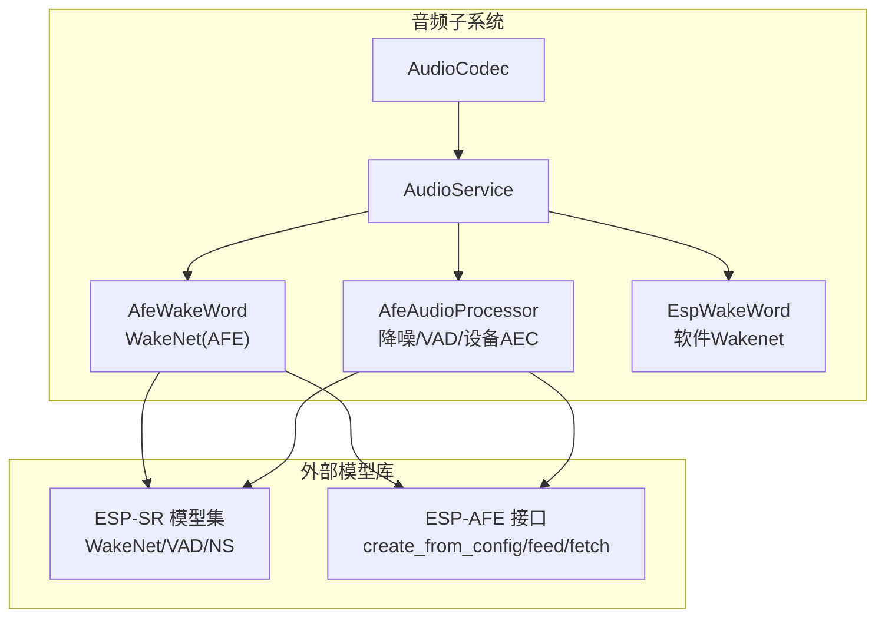
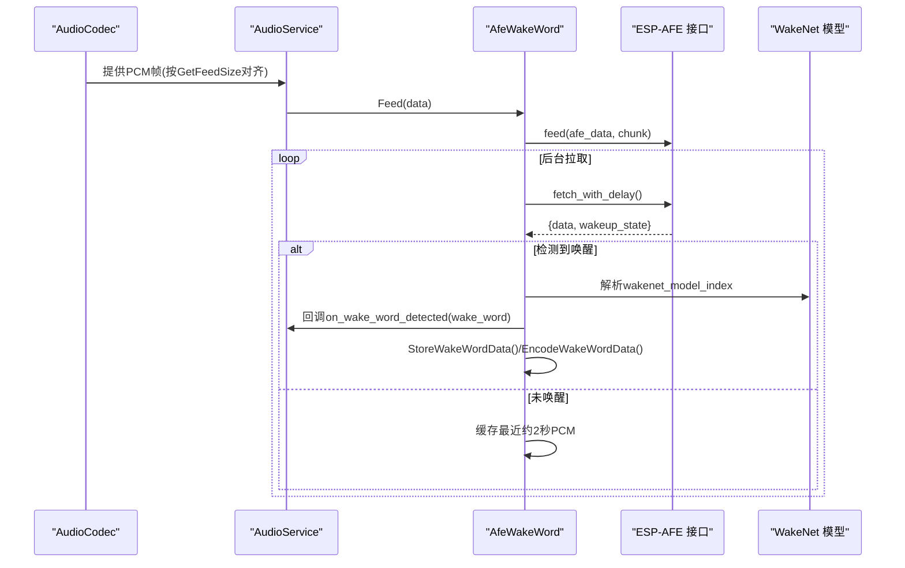
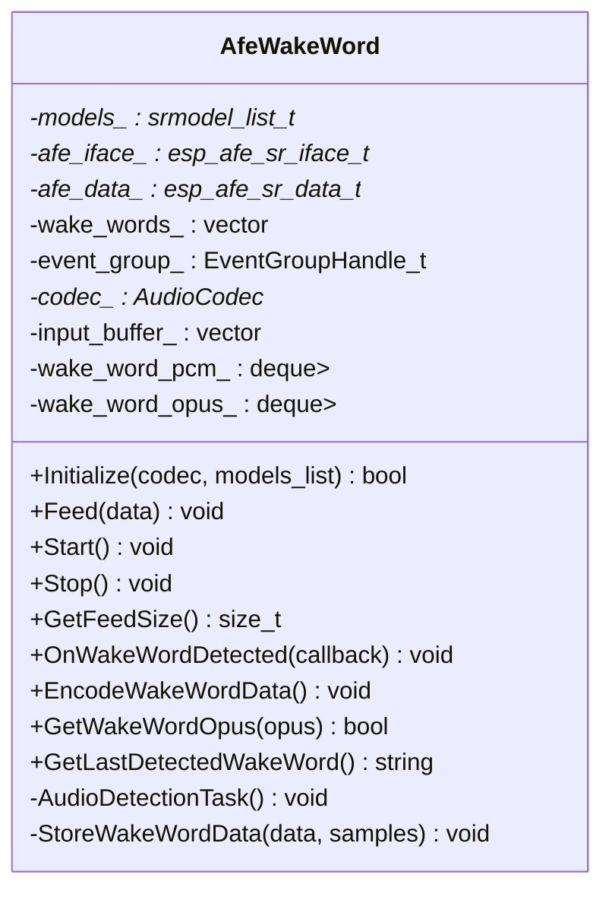
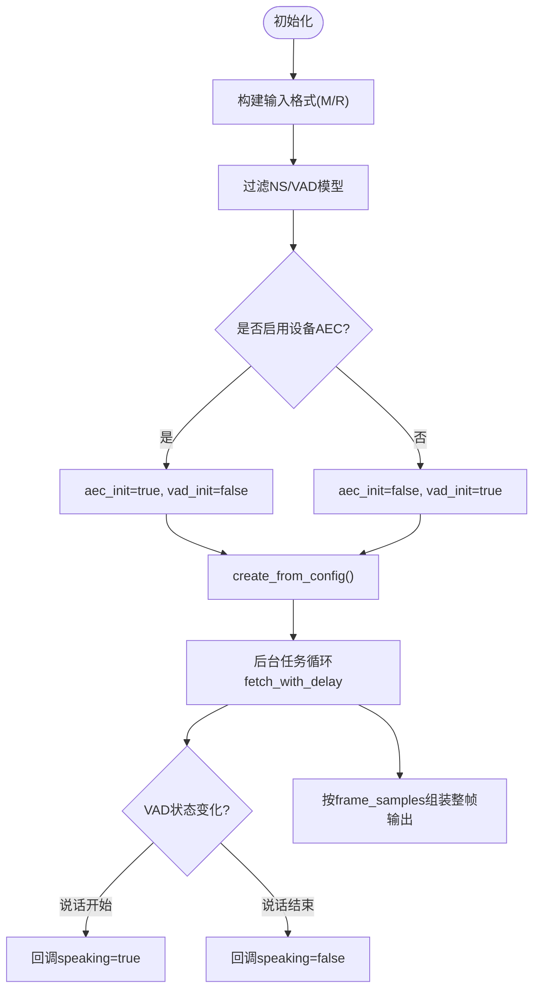
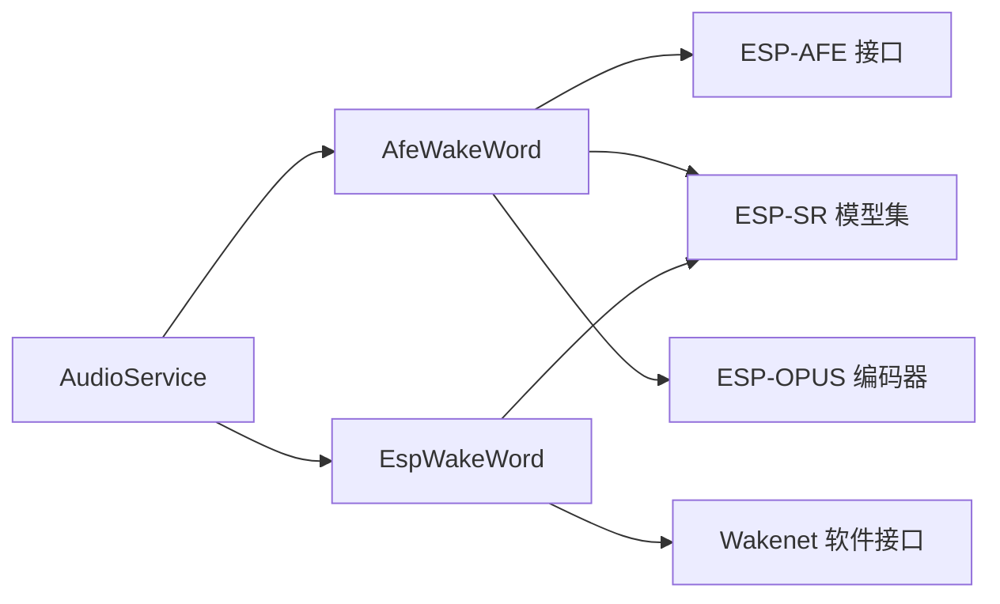

# AFE硬件加速唤醒

<cite>
**本文引用的文件**   
- [afe_wake_word.h](file://main/audio/wake_words/afe_wake_word.h)
- [afe_wake_word.cc](file://main/audio/wake_words/afe_wake_word.cc)
- [afe_audio_processor.h](file://main/audio/processors/afe_audio_processor.h)
- [afe_audio_processor.cc](file://main/audio/processors/afe_audio_processor.cc)
- [esp_wake_word.h](file://main/audio/wake_words/esp_wake_word.h)
- [esp_wake_word.cc](file://main/audio/wake_words/esp_wake_word.cc)
- [audio_service.cc](file://main/audio/audio_service.cc)
- [sdkconfig.defaults.esp32s3](file://sdkconfig.defaults.esp32s3)
- [sdkconfig.defaults.esp32p4](file://sdkconfig.defaults.esp32p4)
</cite>

## 目录
1. [简介](#简介)
2. [项目结构](#项目结构)
3. [核心组件](#核心组件)
4. [架构总览](#架构总览)
5. [详细组件分析](#详细组件分析)
6. [依赖关系分析](#依赖关系分析)
7. [性能考量](#性能考量)
8. [故障排查指南](#故障排查指南)
9. [结论](#结论)
10. [附录](#附录)

## 简介
本技术文档聚焦于前端增强（AFE）硬件加速唤醒系统，围绕 AfeWakeWord 类的实现原理、DSP/Audio Front-End 协处理调用与内存优化策略展开。同时覆盖 AFE 模块的初始化配置（音频参数、硬件资源分配、中断式数据流）、与软件唤醒方案的切换机制与兼容性、硬件平台支持与配置要求、性能基准测试方法与优化建议，以及常见硬件兼容性与驱动配置问题的排障方法。

## 项目结构
本项目将音频采集、前处理与唤醒检测解耦为独立组件：
- 唤醒层：AfeWakeWord（基于 ESP-AFE 的 WakeNet 硬件加速）与 EspWakeWord（纯软件方案）
- 语音通信前处理层：AfeAudioProcessor（降噪、VAD、可选设备端 AEC）
- 音频服务调度：AudioService（统一接入 AudioCodec，管理任务、队列与回调）
- 平台配置：ESP32S3/ESP32P4 默认 SDK 配置启用 PSRAM 与高性能选项

图表来源
- [audio_service.cc:24-36](file://main/audio/audio_service.cc#L24-L36)
- [afe_wake_word.cc:38-90](file://main/audio/wake_words/afe_wake_word.cc#L38-L90)
- [afe_audio_processor.cc:13-75](file://main/audio/processors/afe_audio_processor.cc#L13-L75)

章节来源
- [audio_service.cc:24-36](file://main/audio/audio_service.cc#L24-L36)
- [sdkconfig.defaults.esp32s3:1-32](file://sdkconfig.defaults.esp32s3#L1-L32)
- [sdkconfig.defaults.esp32p4:1-32](file://sdkconfig.defaults.esp32p4#L1-L32)

## 核心组件
- AfeWakeWord：基于 ESP-AFE 的 WakeNet 硬件加速唤醒，负责音频分块喂入、后台拉取检测结果、保存触发前后 PCM 并异步编码 Opus。
- AfeAudioProcessor：基于 ESP-AFE 的语音通信前处理，支持降噪（NS）、VAD、可选设备端 AEC，输出整帧 PCM 给上层。
- EspWakeWord：纯软件 Wakenet 实现，用于非 S3/P4 平台或降级场景。
- AudioService：根据目标芯片选择具体唤醒实现，统一管理音频任务、事件与回调。

章节来源
- [afe_wake_word.h:22-60](file://main/audio/wake_words/afe_wake_word.h#L22-L60)
- [afe_wake_word.cc:38-90](file://main/audio/wake_words/afe_wake_word.cc#L38-L90)
- [afe_audio_processor.h:17-46](file://main/audio/processors/afe_audio_processor.h#L17-L46)
- [afe_audio_processor.cc:13-75](file://main/audio/processors/afe_audio_processor.cc#L13-L75)
- [esp_wake_word.h:17-43](file://main/audio/wake_words/esp_wake_word.h#L17-L43)
- [esp_wake_word.cc:17-45](file://main/audio/wake_words/esp_wake_word.cc#L17-L45)
- [audio_service.cc:24-36](file://main/audio/audio_service.cc#L24-L36)

## 架构总览
下图展示了从音频采集到唤醒检测与结果上报的整体流程，包括 AFE 初始化、数据馈送、后台拉取、唤醒回调与可选的 Opus 编码。

图表来源
- [afe_wake_word.cc:110-161](file://main/audio/wake_words/afe_wake_word.cc#L110-L161)
- [afe_wake_word.cc:163-170](file://main/audio/wake_words/afe_wake_word.cc#L163-L170)
- [afe_wake_word.cc:172-253](file://main/audio/wake_words/afe_wake_word.cc#L172-L253)

## 详细组件分析

### AfeWakeWord 类与硬件加速实现
- 初始化流程
  - 加载模型列表，筛选 WakeNet 模型名称，解析可识别热词集合。
  - 构造 AFE 配置：输入通道格式（主麦克风+参考通道），工作模式为高吞吐；开启 AEC（若硬件支持参考通道）；设置内存分配优先使用 PSRAM；指定 AFE 运行核心与优先级。
  - 通过 esp_afe_handle_from_config 获取接口指针，再 create_from_config 创建实例。
  - 启动后台检测任务，循环等待事件标志位后拉取结果。
- 数据馈送与拉取
  - Feed 将 PCM 累积至内部缓冲，按 get_feed_chunksize × input_channels 对齐后喂入 AFE。
  - 后台任务以 fetch_with_delay 阻塞拉取，返回包含 data、data_size、wakeup_state 等字段的结构体。
  - 当 wakeup_state 为已检测时，停止检测、记录热词索引对应的词名，并通过回调通知上层。
- 唤醒片段捕获与编码
  - 每次 fetch 返回的 data 被存入环形队列，保留约 2 秒 PCM 数据（按 30ms 帧累计）。
  - 触发后启动一次性静态任务，使用 ESP OPUS 编码器将 PCM 打包为 Opus 包，通过条件变量通知上层消费。
- 内存与线程优化
  - 大量中间缓冲与任务栈采用 heap_caps_malloc(MALLOC_CAP_SPIRAM) 分配，降低内部 RAM 压力。
  - 使用互斥量与条件变量保护唤醒片段队列与 Opus 队列，避免竞争。
  - 后台任务使用 EventGroup 控制启停，Stop 时 reset_buffer 清空 AFE 状态。

图表来源
- [afe_wake_word.h:22-60](file://main/audio/wake_words/afe_wake_word.h#L22-L60)
- [afe_wake_word.cc:38-90](file://main/audio/wake_words/afe_wake_word.cc#L38-L90)
- [afe_wake_word.cc:110-161](file://main/audio/wake_words/afe_wake_word.cc#L110-L161)
- [afe_wake_word.cc:163-170](file://main/audio/wake_words/afe_wake_word.cc#L163-L170)
- [afe_wake_word.cc:172-253](file://main/audio/wake_words/afe_wake_word.cc#L172-L253)

章节来源
- [afe_wake_word.h:22-60](file://main/audio/wake_words/afe_wake_word.h#L22-L60)
- [afe_wake_word.cc:38-90](file://main/audio/wake_words/afe_wake_word.cc#L38-L90)
- [afe_wake_word.cc:110-161](file://main/audio/wake_words/afe_wake_word.cc#L110-L161)
- [afe_wake_word.cc:163-170](file://main/audio/wake_words/afe_wake_word.cc#L163-L170)
- [afe_wake_word.cc:172-253](file://main/audio/wake_words/afe_wake_word.cc#L172-L253)

### AfeAudioProcessor 语音通信前处理
- 初始化
  - 根据输入通道数构建输入格式字符串（主声道 M 与参考 R）。
  - 过滤 NS 与 VAD 模型名，按需启用降噪与 VAD；AGC 关闭；内存分配优先 PSRAM。
  - 编译期开关 CONFIG_USE_DEVICE_AEC 决定启用设备端 AEC 还是软件 VAD。
  - 创建 AFE 实例并启动“音频通信”任务，周期性拉取处理后的 PCM。
- 数据处理
  - Feed 将 PCM 累积并按 AFE 要求的分块大小喂入。
  - 后台任务拉取结果，转发 VAD 状态变化回调，并将整帧 PCM 推送给上层。
- 动态切换 AEC/VAD
  - EnableDeviceAec(true)：禁用 VAD，启用设备端 AEC（需硬件支持且编译开启）。
  - EnableDeviceAec(false)：禁用 AEC，重新启用 VAD。

图表来源
- [afe_audio_processor.cc:13-75](file://main/audio/processors/afe_audio_processor.cc#L13-L75)
- [afe_audio_processor.cc:135-187](file://main/audio/processors/afe_audio_processor.cc#L135-L187)
- [afe_audio_processor.cc:189-201](file://main/audio/processors/afe_audio_processor.cc#L189-L201)

章节来源
- [afe_audio_processor.h:17-46](file://main/audio/processors/afe_audio_processor.h#L17-L46)
- [afe_audio_processor.cc:13-75](file://main/audio/processors/afe_audio_processor.cc#L13-L75)
- [afe_audio_processor.cc:135-187](file://main/audio/processors/afe_audio_processor.cc#L135-L187)
- [afe_audio_processor.cc:189-201](file://main/audio/processors/afe_audio_processor.cc#L189-L201)

### 软件唤醒方案 EspWakeWord（兼容路径）
- 在非 S3/P4 平台或降级场景下，AudioService 会实例化 EspWakeWord。
- 该实现直接调用 wakenet 软件接口 detect，逐块检测，发现热词后回调上层。
- 不提供 Opus 编码能力（占位实现）。

章节来源
- [esp_wake_word.h:17-43](file://main/audio/wake_words/esp_wake_word.h#L17-L43)
- [esp_wake_word.cc:17-45](file://main/audio/wake_words/esp_wake_word.cc#L17-L45)
- [esp_wake_word.cc:62-96](file://main/audio/wake_words/esp_wake_word.cc#L62-L96)

### 唤醒方案切换与兼容性
- 目标芯片判断：在 S3 或 P4 上优先使用 AfeWakeWord，否则回退到 EspWakeWord。
- 运行时查询：AudioService::IsAfeWakeWord 可用于判断当前是否为 AFE 硬件加速路径。
- 上层可根据 IsAfeWakeWord 的结果决定是否启用特定功能（如 Opus 编码、设备端 AEC 等）。

章节来源
- [audio_service.cc:24-36](file://main/audio/audio_service.cc#L24-L36)
- [audio_service.cc:713-734](file://main/audio/audio_service.cc#L713-L734)

## 依赖关系分析
- 组件耦合
  - AfeWakeWord 强依赖 ESP-AFE 接口与 ESP-SR 模型集；对 AudioCodec 仅做输入通道与参考通道信息读取。
  - AfeAudioProcessor 同样依赖 ESP-AFE 与模型集，但面向语音通信前处理。
  - AudioService 作为装配器，依据编译期与运行期配置选择具体实现。
- 外部依赖
  - ESP-AFE：提供 create_from_config、feed、fetch_with_delay、reset_buffer、enable/disable_vad/aec 等能力。
  - ESP-SR：提供模型加载、过滤与热词解析。
  - ESP-OPUS：用于唤醒片段编码。
- 潜在环路与风险
  - 无直接循环依赖；注意 Stop/Feed 并发下的 TOCTOU 防护已在实现中通过锁与事件组检查规避。

图表来源
- [audio_service.cc:24-36](file://main/audio/audio_service.cc#L24-L36)
- [afe_wake_word.cc:38-90](file://main/audio/wake_words/afe_wake_word.cc#L38-L90)
- [esp_wake_word.cc:17-45](file://main/audio/wake_words/esp_wake_word.cc#L17-L45)

章节来源
- [audio_service.cc:24-36](file://main/audio/audio_service.cc#L24-L36)
- [afe_wake_word.cc:38-90](file://main/audio/wake_words/afe_wake_word.cc#L38-L90)
- [esp_wake_word.cc:17-45](file://main/audio/wake_words/esp_wake_word.cc#L17-L45)

## 性能考量
- CPU 占用率降低
  - AFE 将降噪、VAD、WakeNet 推理卸载至专用 DSP/加速器，显著降低主核负载。
  - 后台任务以事件驱动拉取，避免忙轮询，减少上下文切换开销。
- 功耗优化
  - 使用 PSRAM 承载大缓冲与任务栈，释放内部 RAM 以降低主核活动频率与功耗。
  - 仅在需要时启动一次性编码任务，缩短高功耗阶段。
- 响应延迟改善
  - 固定分块大小与阻塞拉取确保端到端延迟稳定；检测到唤醒后立即回调，减少额外处理链路。
- 内存优化策略
  - 输入缓冲按 AFE 分块对齐，避免频繁拷贝。
  - 唤醒片段队列限制长度（约 2 秒），防止内存膨胀。
  - 关键对象（任务栈、缓冲区）显式分配至 PSRAM，提升稳定性。

[本节为通用性能讨论，不直接分析具体文件]

## 故障排查指南
- 无法加载模型
  - 现象：初始化失败，日志提示模型加载错误。
  - 排查：确认模型路径与模型集是否正确；检查 ESP-SR 模型是否包含对应 WakeNet/VAD/NS 模型。
  - 相关位置：模型初始化与校验逻辑。
- 唤醒无回调
  - 现象：Feed 正常但无唤醒回调。
  - 排查：确认 Start 已调用；检查事件组标志位；确认 GetFeedSize 与输入分块对齐；查看 fetch 返回值与 ret_value。
- 内存不足或崩溃
  - 现象：PSRAM 分配失败或堆溢出。
  - 排查：检查 SPIRAM 配置与容量；确认任务栈与缓冲是否分配至 PSRAM；适当减小缓冲或帧长。
- 设备端 AEC 不可用
  - 现象：EnableDeviceAec(true) 报错或不生效。
  - 排查：确认编译开关 CONFIG_USE_DEVICE_AEC 已启用；硬件需提供参考通道；必要时回退至软件 VAD。
- 平台不支持 AFE 唤醒
  - 现象：IsAfeWakeWord 返回 false。
  - 排查：确认目标芯片为 ESP32S3 或 ESP32P4；否则自动回退至软件唤醒。

章节来源
- [afe_wake_word.cc:38-51](file://main/audio/wake_words/afe_wake_word.cc#L38-L51)
- [afe_wake_word.cc:110-161](file://main/audio/wake_words/afe_wake_word.cc#L110-L161)
- [afe_audio_processor.cc:189-201](file://main/audio/processors/afe_audio_processor.cc#L189-L201)
- [audio_service.cc:713-734](file://main/audio/audio_service.cc#L713-L734)

## 结论
AfeWakeWord 借助 ESP-AFE 与 ESP-SR 模型集实现了高效的硬件加速唤醒，结合 PSRAM 内存优化与事件驱动的任务模型，在保证低延迟的同时显著降低 CPU 占用与功耗。对于非 S3/P4 平台，系统自动回退至软件唤醒方案，保证跨平台兼容。上层可通过 IsAfeWakeWord 进行差异化适配，并在需要时启用设备端 AEC 或 Opus 编码等功能。

[本节为总结性内容，不直接分析具体文件]

## 附录

### 硬件平台支持与配置要求
- 支持平台
  - ESP32S3：默认启用 SPIRAM、较高时钟频率与缓存配置，适合 AFE 加速。
  - ESP32P4：更高主频与 PSRAM 带宽，适合更复杂的前处理与多路音频。
- 关键配置项
  - SPIRAM 启用与速度配置（Octal/200MHz 等）
  - 模型配置宏（例如 WakeNet 热词模型）
  - 编译期开关：CONFIG_USE_AUDIO_PROCESSOR、CONFIG_USE_DEVICE_AEC
- 参考默认配置
  - ESP32S3 默认配置示例
  - ESP32P4 默认配置示例

章节来源
- [sdkconfig.defaults.esp32s3:1-32](file://sdkconfig.defaults.esp32s3#L1-L32)
- [sdkconfig.defaults.esp32p4:1-32](file://sdkconfig.defaults.esp32p4#L1-L32)

### 性能基准测试方法与监控工具
- 测试方法
  - 固定环境噪声与距离，统计单位时间内唤醒成功率与误报率。
  - 测量端到端延迟：从发声到 on_wake_word_detected 回调的时间差。
  - 对比 AFE 与软件方案在相同条件下的 CPU 占用与功耗差异。
- 监控指标
  - 任务运行时间、事件等待次数、PSRAM 分配/释放统计。
  - 编码耗时与包数量（Opus 编码任务日志）。
- 工具建议
  - ESP-IDF Profiling 与 FreeRTOS 运行时统计
  - 串口日志分析（ESP_LOGI/ESP_LOGE）
  - 功耗仪与电流采样

[本节为通用指导，不直接分析具体文件]