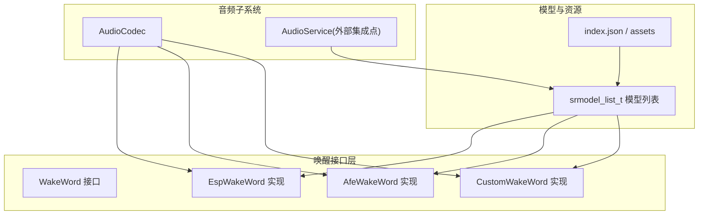
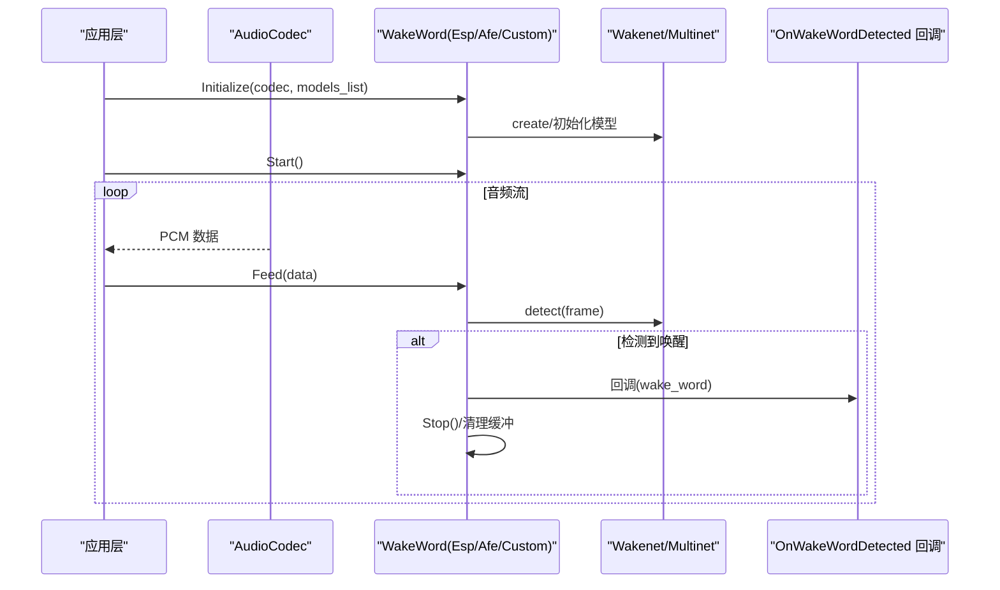
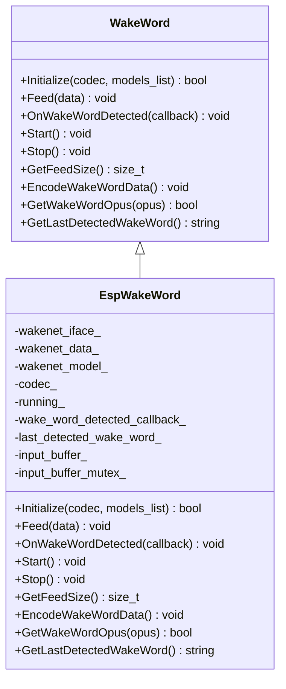
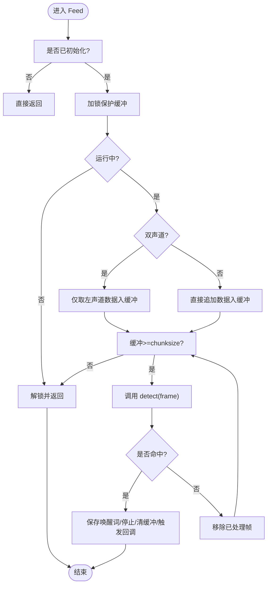

# ESP官方唤醒引擎

<cite>
**本文引用的文件**   
- [esp_wake_word.h](file://main/audio/wake_words/esp_wake_word.h)
- [esp_wake_word.cc](file://main/audio/wake_words/esp_wake_word.cc)
- [wake_word.h](file://main/audio/wake_word.h)
- [afe_wake_word.cc](file://main/audio/wake_words/afe_wake_word.cc)
- [custom_wake_word.cc](file://main/audio/wake_words/custom_wake_word.cc)
- [assets.cc](file://main/assets.cc)
- [assets.h](file://main/assets.h)
- [Kconfig.projbuild](file://main/Kconfig.projbuild)
</cite>

## 目录
1. [简介](#简介)
2. [项目结构](#项目结构)
3. [核心组件](#核心组件)
4. [架构总览](#架构总览)
5. [详细组件分析](#详细组件分析)
6. [依赖关系分析](#依赖关系分析)
7. [性能与内存优化](#性能与内存优化)
8. [故障排查指南](#故障排查指南)
9. [结论](#结论)
10. [附录：使用示例与最佳实践](#附录使用示例与最佳实践)

## 简介
本技术文档聚焦于ESP官方语音唤醒引擎在工程中的实现，重点解析 EspWakeWord 类的设计与工作流程，包括模型加载机制、音频数据流处理、唤醒检测算法、回调注册与触发流程。同时说明 srmodel_list_t 模型列表的配置方法、支持的预训练唤醒词模型及其特性，并给出完整的初始化、启动、停止流程与常见问题解决方案。

## 项目结构
本项目将唤醒能力抽象为统一接口 WakeWord，并提供多种具体实现：
- EspWakeWord：基于 Wakenet 的轻量级唤醒实现（单通道或双声道左声道抽取）
- AfeWakeWord：基于 AFE 的前端增强+唤醒链路，支持AEC与更高性能模式
- CustomWakeWord：基于 Multinet 的自定义命令词识别

图表来源
- [esp_wake_word.h:17-43](file://main/audio/wake_words/esp_wake_word.h#L17-L43)
- [wake_word.h:11-24](file://main/audio/wake_word.h#L11-L24)
- [assets.cc:71-119](file://main/assets.cc#L71-L119)

章节来源
- [esp_wake_word.h:17-43](file://main/audio/wake_words/esp_wake_word.h#L17-L43)
- [wake_word.h:11-24](file://main/audio/wake_word.h#L11-L24)
- [assets.cc:71-119](file://main/assets.cc#L71-L119)

## 核心组件
- WakeWord 接口：定义统一的初始化、数据馈入、回调注册、启停、缓冲大小查询与编码接口
- EspWakeWord：Wakenet 唤醒实现，负责模型创建、帧块检测、回调触发
- AfeWakeWord：AFE 前端+唤醒任务线程，支持AEC、OPUS编码唤醒片段
- CustomWakeWord：Multinet 自定义命令词识别，支持阈值、语言、命令集配置
- Assets：从 index.json 加载 srmodels.bin，生成 srmodel_list_t 并注入 AudioService

章节来源
- [wake_word.h:11-24](file://main/audio/wake_word.h#L11-L24)
- [esp_wake_word.h:17-43](file://main/audio/wake_words/esp_wake_word.h#L17-L43)
- [afe_wake_word.cc:38-90](file://main/audio/wake_words/afe_wake_word.cc#L38-L90)
- [custom_wake_word.cc:85-129](file://main/audio/wake_words/custom_wake_word.cc#L85-L129)
- [assets.cc:71-119](file://main/assets.cc#L71-L119)

## 架构总览
下图展示了从音频采集到唤醒检测的关键调用链路与数据流向。

图表来源
- [esp_wake_word.cc:17-45](file://main/audio/wake_words/esp_wake_word.cc#L17-L45)
- [esp_wake_word.cc:62-96](file://main/audio/wake_words/esp_wake_word.cc#L62-L96)
- [afe_wake_word.cc:110-161](file://main/audio/wake_words/afe_wake_word.cc#L110-L161)
- [custom_wake_word.cc:146-200](file://main/audio/wake_words/custom_wake_word.cc#L146-L200)

## 详细组件分析

### EspWakeWord 类详解
- 设计目标：以最小开销完成 Wakenet 唤醒检测，适配单/双声道输入，提供简单可靠的回调机制
- 关键成员
  - wakenet_iface_/wakenet_data_：Wakenet 接口与实例句柄
  - wakenet_model_：srmodel_list_t 指向的模型集合
  - codec_：音频采集接口
  - input_buffer_：输入PCM缓冲，按 chunksize 切分送入检测
  - wake_word_detected_callback_：唤醒回调函数
- 生命周期
  - 构造/析构：析构时销毁模型实例并释放模型资源
  - Initialize：选择模型、创建实例、获取采样率与chunksize
  - Start/Stop：控制运行状态与清空缓冲
  - Feed：累积PCM并按chunksize循环检测，命中后触发回调并停止
  - GetFeedSize：返回模型期望的每帧样本数
  - EncodeWakeWordData/GetWakeWordOpus：当前为空实现（由其他实现提供完整编码）

图表来源
- [wake_word.h:11-24](file://main/audio/wake_word.h#L11-L24)
- [esp_wake_word.h:17-43](file://main/audio/wake_words/esp_wake_word.h#L17-L43)

#### Initialize() 参数与行为
- 参数
  - codec：音频采集对象，用于获取输入声道数
  - models_list：可选；若为空则默认从“model”分区加载
- 行为要点
  - 若未传入模型列表，则通过 esp_srmodel_init("model") 加载
  - 校验模型数量与有效性，取首个可用模型
  - 通过模型名获取 iface 并 create 实例，记录采样率与chunksize
- 失败路径
  - 模型加载失败或数量为-1/0时返回false并记录错误日志

章节来源
- [esp_wake_word.cc:17-45](file://main/audio/wake_words/esp_wake_word.cc#L17-L45)

#### Feed() 音频数据处理流程
- 双声道处理：当输入为立体声时仅取左声道数据
- 缓冲策略：将新数据追加至 input_buffer_，按 chunksize 循环检测
- 检测与回调：detect 返回值大于0表示命中，保存最后唤醒词、停止运行、清空缓冲并触发回调
- 并发安全：使用互斥锁保护缓冲与运行状态检查，避免TOCTOU竞态

图表来源
- [esp_wake_word.cc:62-96](file://main/audio/wake_words/esp_wake_word.cc#L62-L96)

章节来源
- [esp_wake_word.cc:62-96](file://main/audio/wake_words/esp_wake_word.cc#L62-L96)

#### OnWakeWordDetected 回调注册与使用
- 注册：通过 OnWakeWordDetected 设置回调函数
- 触发：在 Feed 检测到唤醒后，内部置 running_=false、清空缓冲并调用回调
- 注意：回调执行期间应避免阻塞，以免阻塞音频处理线程

章节来源
- [esp_wake_word.cc:47-49](file://main/audio/wake_words/esp_wake_word.cc#L47-L49)
- [esp_wake_word.cc:84-92](file://main/audio/wake_words/esp_wake_word.cc#L84-L92)

#### GetFeedSize() 缓冲区管理策略
- 返回模型要求的每帧样本数（chunksize），供上层按固定帧长喂入
- 若未初始化则返回0

章节来源
- [esp_wake_word.cc:98-103](file://main/audio/wake_words/esp_wake_word.cc#L98-L103)

#### EncodeWakeWordData() 与 GetWakeWordOpus()
- EspWakeWord 中这两个方法为空实现，不提供唤醒片段编码功能
- 如需编码，可参考 AfeWakeWord/CustomWakeWord 的实现

章节来源
- [esp_wake_word.cc:105-110](file://main/audio/wake_words/esp_wake_word.cc#L105-L110)

### AfeWakeWord 与 CustomWakeWord 对比（扩展阅读）
- AfeWakeWord
  - 基于 AFE 前端，支持AEC与高性能模式，独立检测线程
  - 提供完整的唤醒片段PCM缓存与OPUS编码流程
- CustomWakeWord
  - 基于 Multinet，支持自定义命令词、阈值、语言等配置
  - 同样提供唤醒片段PCM缓存与OPUS编码流程

章节来源
- [afe_wake_word.cc:38-90](file://main/audio/wake_words/afe_wake_word.cc#L38-L90)
- [afe_wake_word.cc:110-161](file://main/audio/wake_words/afe_wake_word.cc#L110-L161)
- [custom_wake_word.cc:85-129](file://main/audio/wake_words/custom_wake_word.cc#L85-L129)
- [custom_wake_word.cc:146-200](file://main/audio/wake_words/custom_wake_word.cc#L146-L200)

## 依赖关系分析
- 模型加载与注入
  - Assets 从 index.json 读取 srmodels 字段，加载 srmodels.bin 得到 srmodel_list_t
  - 通过 AudioService.SetModelsList 注入到音频服务，供各唤醒实现使用
- 编译期开关
  - Kconfig 提供 USE_AFE_WAKE_WORD、USE_CUSTOM_WAKE_WORD 等选项，影响构建产物与默认行为

图表来源
- [assets.cc:71-119](file://main/assets.cc#L71-L119)
- [assets.h:85-86](file://main/assets.h#L85-L86)

章节来源
- [assets.cc:71-119](file://main/assets.cc#L71-L119)
- [assets.h:85-86](file://main/assets.h#L85-L86)
- [Kconfig.projbuild:864-902](file://main/Kconfig.projbuild#L864-L902)

## 性能与内存优化
- 模型选择
  - 优先选择体积较小且精度满足需求的 Wakenet 模型；多模型存在时默认使用第一个
  - 若需AEC与更强抗噪能力，启用 AfeWakeWord（需S3/P4+PSRAM）
- 采样与帧长
  - 根据 GetFeedSize() 返回的 chunksize 喂入数据，避免频繁拷贝与碎片化
- 双声道处理
  - 仅在需要时抽取左声道，减少一半计算量
- 线程与任务
  - AfeWakeWord 使用独立检测线程，避免阻塞主音频路径
- 内存分配
  - 大对象尽量分配至SPIRAM（如编码器栈/缓冲），降低内部RAM压力
- 阈值与灵敏度
  - 自定义唤醒词可通过阈值调节灵敏度；过小易误报，过大易漏报

[本节为通用建议，不直接分析具体文件]

## 故障排查指南
- 模型加载失败
  - 现象：Initialize 返回 false，日志提示无法初始化模型
  - 排查：确认 index.json 中 srmodels 字段正确、srmodels.bin 存在且可读；检查分区挂载与权限
  - 相关代码路径：[assets.cc:71-119](file://main/assets.cc#L71-L119)、[esp_wake_word.cc:17-45](file://main/audio/wake_words/esp_wake_word.cc#L17-L45)
- 无可用模型
  - 现象：num==0 或 -1
  - 排查：确保至少一个有效模型被加载；必要时显式传入 models_list
  - 相关代码路径：[esp_wake_word.cc:26-35](file://main/audio/wake_words/esp_wake_word.cc#L26-L35)
- 识别精度低
  - 调整阈值（自定义唤醒词）、改善麦克风安装位置与环境噪声、启用AEC（AfeWakeWord）
  - 相关代码路径：[custom_wake_word.cc:118-129](file://main/audio/wake_words/custom_wake_word.cc#L118-L129)
- 回调未触发
  - 检查是否在 Start 之后持续 Feed 数据；确认双声道情况下是否正确抽取左声道
  - 相关代码路径：[esp_wake_word.cc:62-96](file://main/audio/wake_words/esp_wake_word.cc#L62-L96)

章节来源
- [assets.cc:71-119](file://main/assets.cc#L71-L119)
- [esp_wake_word.cc:17-45](file://main/audio/wake_words/esp_wake_word.cc#L17-L45)
- [esp_wake_word.cc:62-96](file://main/audio/wake_words/esp_wake_word.cc#L62-L96)
- [custom_wake_word.cc:118-129](file://main/audio/wake_words/custom_wake_word.cc#L118-L129)

## 结论
EspWakeWord 提供了简洁高效的 Wakenet 唤醒能力，配合 srmodel_list_t 模型列表与 Assets 的资源管理机制，可在不同硬件平台上快速部署。对于更复杂的场景（AEC、自定义命令词、唤醒片段编码），可分别选用 AfeWakeWord 与 CustomWakeWord。通过合理的模型选择、帧长对齐与内存分配策略，可在功耗与性能之间取得良好平衡。

[本节为总结性内容，不直接分析具体文件]

## 附录：使用示例与最佳实践
以下为典型使用步骤（以伪代码形式描述，便于理解整体流程）：
- 准备模型
  - 在 index.json 中指定 srmodels 字段指向 srmodels.bin
  - 通过 Assets.LoadSrmodelsFromIndex 加载并注入 AudioService
- 初始化唤醒
  - 创建 EspWakeWord 实例
  - 调用 Initialize(codec, models_list)，其中 models_list 可为空以自动加载
- 注册回调
  - 调用 OnWakeWordDetected 设置回调函数，用于接收唤醒结果
- 启动与喂入数据
  - 调用 Start 启动检测
  - 在主循环中按 GetFeedSize() 返回的帧长持续调用 Feed(data)
- 停止与清理
  - 在回调中或业务逻辑中调用 Stop 停止检测
  - 析构时自动释放模型资源

章节来源
- [assets.cc:71-119](file://main/assets.cc#L71-L119)
- [esp_wake_word.h:22-30](file://main/audio/wake_words/esp_wake_word.h#L22-L30)
- [esp_wake_word.cc:17-45](file://main/audio/wake_words/esp_wake_word.cc#L17-L45)
- [esp_wake_word.cc:62-96](file://main/audio/wake_words/esp_wake_word.cc#L62-L96)