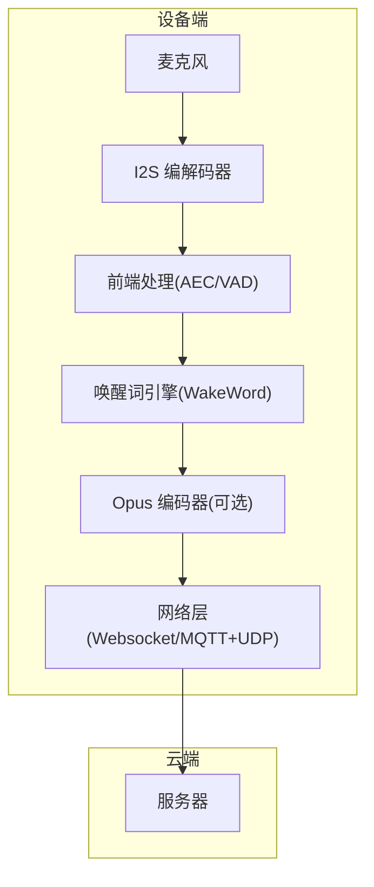
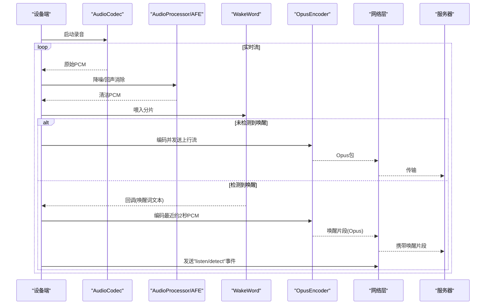
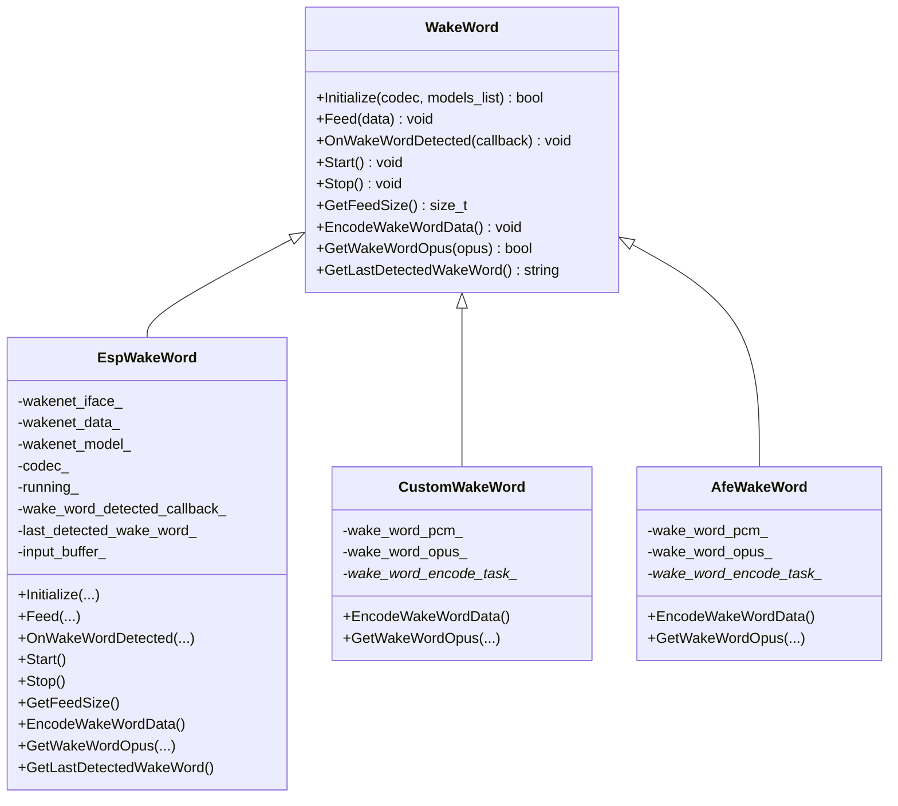
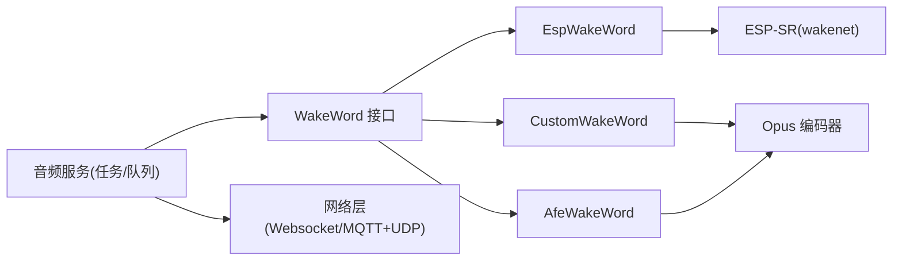

# 唤醒词数据采集

<cite>
**本文引用的文件**   
- [README.md](file://README.md)
- [音频服务架构说明](file://main/audio/README.md)
- [WebSocket 协议文档](file://docs/websocket.md)
- [唤醒词接口定义](file://main/audio/wake_word.h)
- [ESP 唤醒词实现](file://main/audio/wake_words/esp_wake_word.cc)
- [自定义唤醒词实现](file://main/audio/wake_words/custom_wake_word.cc)
- [AFE 唤醒词实现](file://main/audio/wake_words/afe_wake_word.cc)
- [声学检查工具说明](file://scripts/acoustic_check/readme.md)
</cite>

## 目录
1. [简介](#简介)
2. [项目结构](#项目结构)
3. [核心组件](#核心组件)
4. [架构总览](#架构总览)
5. [详细组件分析](#详细组件分析)
6. [依赖关系分析](#依赖关系分析)
7. [性能与质量考量](#性能与质量考量)
8. [故障排查指南](#故障排查指南)
9. [结论](#结论)
10. [附录](#附录)

## 简介
本指南面向在 ESP32 平台上进行“唤醒词”数据采集与标注的工程团队，目标是提供一套可落地的采集规范、质量控制方法与自动化方案。内容覆盖正负样本收集标准、音频格式与标注规范、多场景采集策略、数据质量检查、常见问题（数据不足、不平衡、环境差异）以及工具推荐与自动化流水线设计。

## 项目结构
本项目为基于 ESP-IDF 的语音交互固件，包含设备端音频链路、唤醒词检测、网络通信与资源打包等模块。与唤醒词数据采集直接相关的代码与脚本主要位于：
- 音频服务与任务模型：main/audio/README.md
- 唤醒词抽象与实现：main/audio/wake_word.h、main/audio/wake_words/*.cc
- 设备到服务器的音频参数与唤醒事件：docs/websocket.md
- 声学调试与波形/频谱可视化：scripts/acoustic_check/*

图示来源
- [音频服务架构说明](file://main/audio/README.md)
- [WebSocket 协议文档](file://docs/websocket.md)

章节来源
- [README.md](file://README.md)
- [音频服务架构说明](file://main/audio/README.md)

## 核心组件
- 音频服务与任务模型
  - 输入任务负责从编解码器读取 PCM，喂给唤醒词或前端处理器；输出任务负责播放；编码任务负责 Opus 编解码与队列调度。
- 唤醒词接口与实现
  - WakeWord 抽象类定义了初始化、数据馈入、回调、开始/停止、分片大小、唤醒片段编码与获取等能力。
  - EspWakeWord 使用 ESP-SR 的 wakenet 模型进行本地唤醒；Custom/Afe 实现支持将唤醒片段编码为 Opus 以便上传做声纹验证。
- 设备-服务器通信
  - Hello 消息声明音频参数（如采样率、帧时长），Listen/detect 消息用于上报唤醒事件，并可附带唤醒片段音频。

章节来源
- [音频服务架构说明](file://main/audio/README.md)
- [唤醒词接口定义](file://main/audio/wake_word.h)
- [ESP 唤醒词实现](file://main/audio/wake_words/esp_wake_word.cc)
- [自定义唤醒词实现](file://main/audio/wake_words/custom_wake_word.cc)
- [AFE 唤醒词实现](file://main/audio/wake_words/afe_wake_word.cc)
- [WebSocket 协议文档](file://docs/websocket.md)

## 架构总览
下图展示从采集到云端处理的端到端流程，突出唤醒词触发与后续声纹校验的数据路径。

图示来源
- [音频服务架构说明](file://main/audio/README.md)
- [ESP 唤醒词实现](file://main/audio/wake_words/esp_wake_word.cc)
- [自定义唤醒词实现](file://main/audio/wake_words/custom_wake_word.cc)
- [WebSocket 协议文档](file://docs/websocket.md)

## 详细组件分析

### 唤醒词接口与实现
- WakeWord 抽象类
  - 职责：统一初始化、数据馈入、回调注册、运行控制、分片大小查询、唤醒片段编码与获取、最后识别结果访问。
- EspWakeWord
  - 基于 ESP-SR 的 wakenet 模型，按模型要求的 chunksize 消费输入缓冲，触发后回调唤醒词名称。
- Custom/Afe 唤醒词
  - 在检测到唤醒后，维护最近约 2 秒的 PCM 缓存，并在独立线程中将其编码为 Opus，供上层取用并上传。

图示来源
- [唤醒词接口定义](file://main/audio/wake_word.h)
- [ESP 唤醒词实现](file://main/audio/wake_words/esp_wake_word.cc)
- [自定义唤醒词实现](file://main/audio/wake_words/custom_wake_word.cc)
- [AFE 唤醒词实现](file://main/audio/wake_words/afe_wake_word.cc)

章节来源
- [唤醒词接口定义](file://main/audio/wake_word.h)
- [ESP 唤醒词实现](file://main/audio/wake_words/esp_wake_word.cc)
- [自定义唤醒词实现](file://main/audio/wake_words/custom_wake_word.cc)
- [AFE 唤醒词实现](file://main/audio/wake_words/afe_wake_word.cc)

### 设备-服务器交互与音频参数
- Hello 消息声明设备音频参数（例如采样率、声道数、帧时长）。
- Listen/detect 消息用于上报唤醒事件，可在该事件前上传一段 Opus 格式的唤醒片段，便于服务端进行声纹验证。

章节来源
- [WebSocket 协议文档](file://docs/websocket.md)

### 采集与标注规范

#### 音频格式要求
- 采样率：设备侧默认以 16kHz 作为唤醒与上行语音采样率；下行 TTS 可能使用 24kHz。
- 位深：设备侧内部为 16-bit PCM 流。
- 文件格式：设备端采用 Opus 封装的音频包进行网络传输；离线归档建议保存为 WAV（16kHz/16bit/单声道）或 OPUS 文件，便于回放与标注。
- 帧时长：设备端默认 60ms 一帧（可通过配置调整）。

章节来源
- [WebSocket 协议文档](file://docs/websocket.md)
- [音频服务架构说明](file://main/audio/README.md)

#### 正样本与负样本收集标准
- 正样本（含唤醒词）
  - 说话人多样性：覆盖不同性别、年龄、方言口音、语速与音量等级。
  - 距离与角度：近场（贴近）、中距（桌面/床头柜）、远场（2-3米），多角度（正面、侧面、背向）。
  - 语句长度：短促、正常、拖音、连读、重复唤醒词。
  - 背景噪声：安静室内、空调/风扇、键盘敲击、电视/音乐、街道车流、地铁/公交、餐厅、商场等。
  - 设备状态：开机冷启动、休眠唤醒、低电量、Wi-Fi/4G 弱网。
- 负样本（非唤醒词）
  - 日常对话、相似发音但不命中、笑声/咳嗽/清嗓、宠物叫声、家电提示音、新闻播报、短视频语音等。
  - 多人对话与重叠语音、电话串扰、回声与混响环境。
- 环境与硬件差异
  - 不同板卡/麦克风/编解码器组合（如 INMP441、ES8311、ES7210 等）需分别采集，确保泛化性。
  - 参考声学检查记录中的设备表现差异，针对性补充数据。

章节来源
- [声学检查工具说明](file://scripts/acoustic_check/readme.md)

#### 数据标注规范
- 标签字段建议
  - 文件名/ID、时间戳、设备型号、麦克风/编解码器、录制位置/距离、环境类型、说话人性别/年龄、是否含唤醒词、唤醒词文本、信噪比估计、是否重叠语音、是否回声、是否截断。
- 标注粒度
  - 文件级：是否正样本、环境类别、说话人属性。
  - 片段级（可选）：唤醒词起止时间、重叠语音段、噪声段。
- 一致性
  - 制定标注手册与样例集，双人交叉校验，定期抽检与复标。

[本节为通用规范说明，不直接分析具体文件]

### 不同场景下的采集策略
- 室内安静环境
  - 目标：建立高质量基线数据集，提升小 SNR 下的召回。
  - 要点：关闭空调/风扇，避免强反射面，保持固定距离与角度。
- 嘈杂环境
  - 目标：增强鲁棒性与抗干扰能力。
  - 要点：叠加多种噪声源（白噪、人声、媒体音），覆盖不同频段与动态范围。
- 多人对话/重叠语音
  - 目标：降低误唤醒率。
  - 要点：引入多人同时说话、打断、插话、远距离旁听等复杂场景。
- 移动与远场
  - 目标：提升远场与动态场景稳定性。
  - 要点：走动、转身、遮挡麦克风、手持设备抖动等。

[本节为通用策略说明，不直接分析具体文件]

### 数据质量控制方法
- 音频质量检查
  - 时域/频域可视化：使用项目内声学检查 GUI 查看波形与频谱，评估底噪、削波、丢包与频率分布。
  - 指标阈值：峰值不超过 0dBFS，平均能量不低于下限，SNR 满足最低要求。
- 时长验证
  - 唤醒片段：保留约 2 秒上下文（设备端实现会缓存最近约 2 秒 PCM 再编码）。
  - 会话片段：按业务需求设定最小/最大时长，剔除过短或异常长片段。
- 重复检测
  - 指纹/哈希去重：对相同或高度相似的片段进行合并，减少冗余。
  - 说话人聚类：同一说话人多条相似样本可做聚合统计。
- 标注一致性
  - 双人盲审、Kappa 系数评估、争议样本仲裁机制。

章节来源
- [声学检查工具说明](file://scripts/acoustic_check/readme.md)
- [自定义唤醒词实现](file://main/audio/wake_words/custom_wake_word.cc)

### 常见问题与对策
- 数据不足
  - 策略：主动扩充负样本与难例；利用数据增强（加噪、混响、变速变调、随机裁剪拼接）；跨设备/跨环境补齐。
- 数据不平衡
  - 策略：分层抽样与加权训练；困难样本挖掘；在线学习增量更新。
- 环境差异
  - 策略：按设备/房间/噪声类型分层构建数据集；部署前进行环境迁移测试与回退策略。
- 误唤醒/漏唤醒
  - 策略：增加负样本多样性；优化阈值与二次确认（如声纹/意图判别）；结合 VAD/AEC 提升前端质量。

[本节为通用问题与对策说明，不直接分析具体文件]

### 数据采集工具与自动化方案
- 采集工具
  - 设备端：启用设备端录音与唤醒片段编码，通过 WebSocket/MQTT+UDP 将 Opus 流与事件上报至服务器。
  - 客户端/PC：使用项目提供的声学检查 GUI 进行实时监听与保存，辅助定位噪声与丢包问题。
- 自动化流水线
  - 设备端：定时/事件触发采集 -> 本地质检（时长、峰值、静音段）-> 上传 -> 云端入库。
  - 云端：自动解析 Hello/Lisen/detect 消息，关联音频片段与会话元数据 -> 存储与索引 -> 标注平台分发 -> 审核与版本管理。
  - 持续集成：每批次数据生成统计报告（分布、质量、重复度），驱动模型迭代与阈值调优。

章节来源
- [WebSocket 协议文档](file://docs/websocket.md)
- [音频服务架构说明](file://main/audio/README.md)
- [声学检查工具说明](file://scripts/acoustic_check/readme.md)

## 依赖关系分析
- 组件耦合
  - 音频服务任务与队列是唤醒词与网络传输的基础；唤醒词实现依赖 ESP-SR 模型与 Opus 编码库。
- 外部依赖
  - ESP-SR（wakenet 模型）、Opus 编解码、网络栈（Websocket/MQTT+UDP）。
- 潜在循环依赖
  - 当前实现以接口解耦，未见明显循环依赖风险。

图示来源
- [音频服务架构说明](file://main/audio/README.md)
- [ESP 唤醒词实现](file://main/audio/wake_words/esp_wake_word.cc)
- [自定义唤醒词实现](file://main/audio/wake_words/custom_wake_word.cc)
- [AFE 唤醒词实现](file://main/audio/wake_words/afe_wake_word.cc)
- [WebSocket 协议文档](file://docs/websocket.md)

章节来源
- [音频服务架构说明](file://main/audio/README.md)
- [WebSocket 协议文档](file://docs/websocket.md)

## 性能与质量考量
- 实时性
  - 输入/输出/编码三任务并行，保证低延迟；唤醒片段编码在独立线程执行，避免阻塞主链路。
- 内存与功耗
  - 空闲时自动关闭 ADC/DAC 通道以降低功耗；唤醒片段缓存约 2 秒，注意内存占用。
- 带宽与码率
  - 上行默认 16kHz/单声道，帧时长 60ms；可根据网络状况调整码率与帧长。
- 质量保障
  - 前端 AEC/VAD 提升信噪比；设备端自检与云端质检双保险。

章节来源
- [音频服务架构说明](file://main/audio/README.md)
- [WebSocket 协议文档](file://docs/websocket.md)

## 故障排查指南
- 无法唤醒或误唤醒频繁
  - 检查设备 Hello 参数是否与服务器一致；核对采样率、帧时长、声道数。
  - 观察声学检查 GUI 的频谱与波形，确认是否存在削波、底噪过高或丢包。
- 唤醒片段缺失或不可用
  - 确认唤醒实现是否调用 EncodeWakeWordData 与 GetWakeWordOpus；检查缓存窗口与编码任务是否正常退出。
- 网络传输异常
  - 核查 Listen/detect 事件是否按时上报；确认 Opus 包序列完整，无乱序与丢失。

章节来源
- [WebSocket 协议文档](file://docs/websocket.md)
- [ESP 唤醒词实现](file://main/audio/wake_words/esp_wake_word.cc)
- [自定义唤醒词实现](file://main/audio/wake_words/custom_wake_word.cc)
- [声学检查工具说明](file://scripts/acoustic_check/readme.md)

## 结论
通过统一的采集规范、严格的标注与质量控制、以及设备端与云端的协同自动化，可以显著提升唤醒词的召回与鲁棒性。建议在工程落地中优先完善数据治理与评测体系，再以数据驱动的方式持续优化模型与阈值。

[本节为总结性内容，不直接分析具体文件]

## 附录
- 术语
  - 正样本：包含目标唤醒词的音频片段。
  - 负样本：不包含目标唤醒词的音频片段。
  - 难例：易导致误唤醒或漏唤醒的复杂场景样本。
- 参考
  - 设备端音频参数与事件定义见 WebSocket 协议文档。
  - 声学检查工具使用说明见 scripts/acoustic_check/readme.md。

[本节为补充信息，不直接分析具体文件]