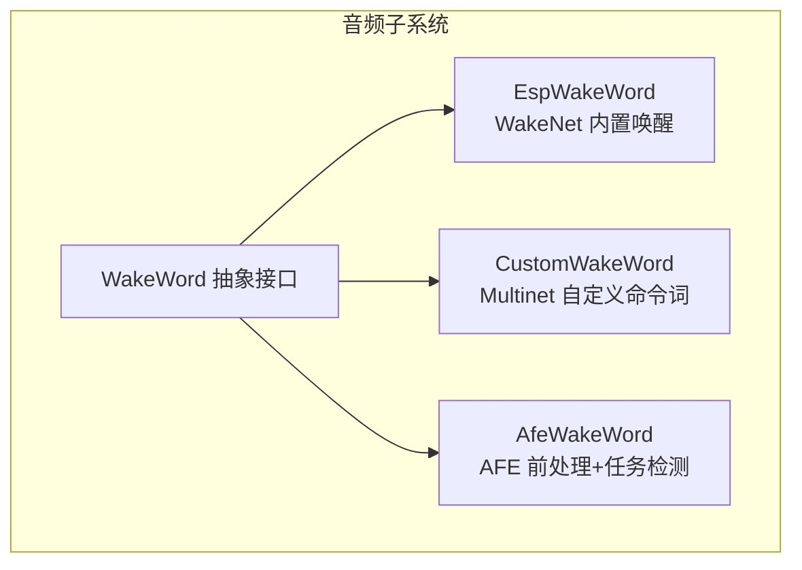
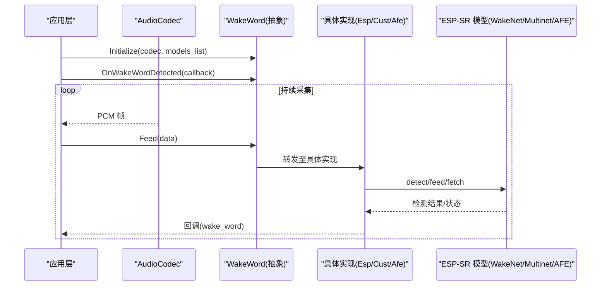
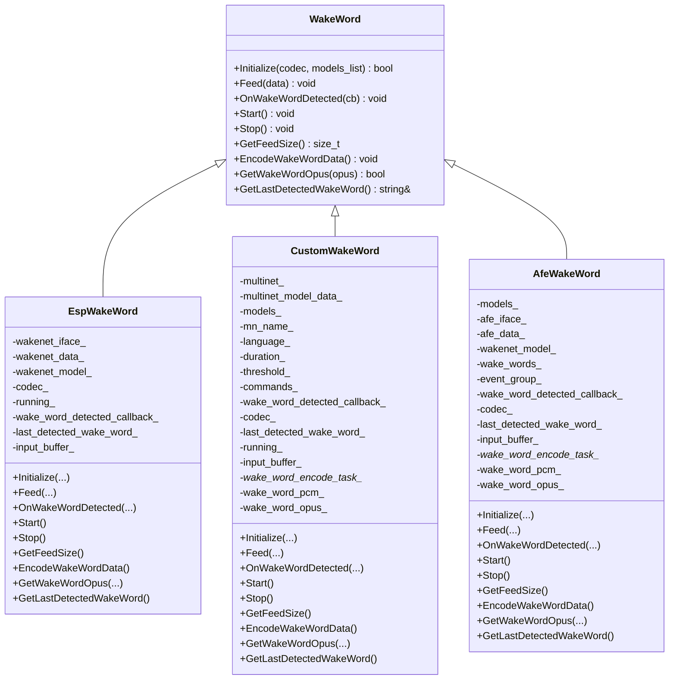
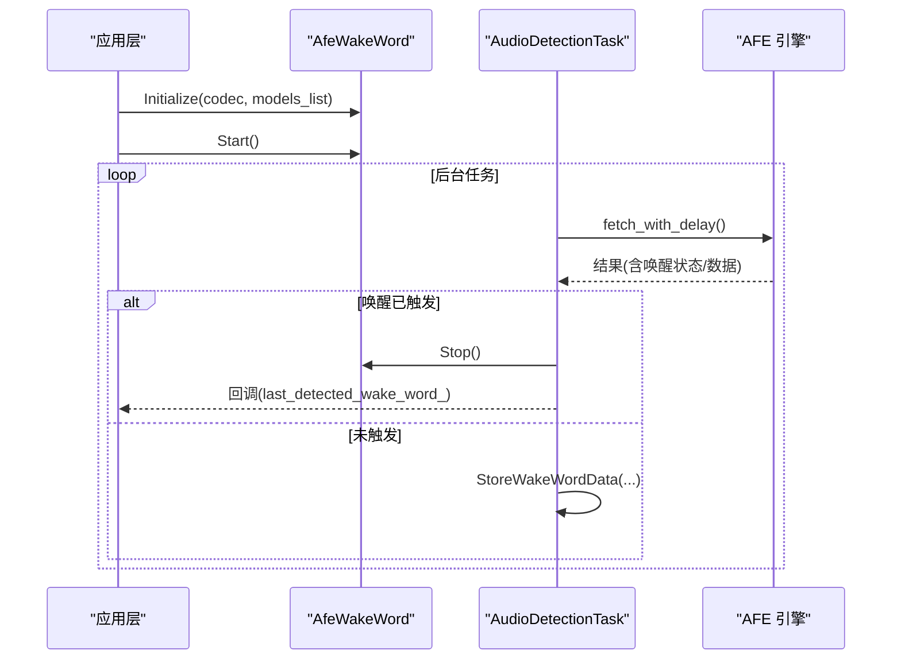
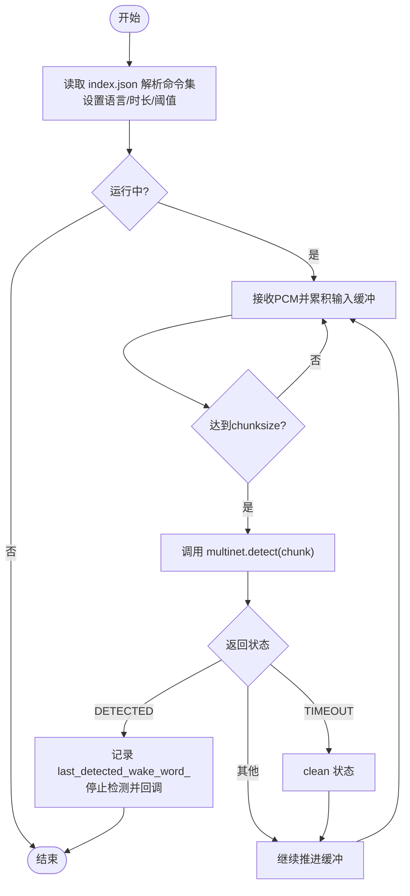
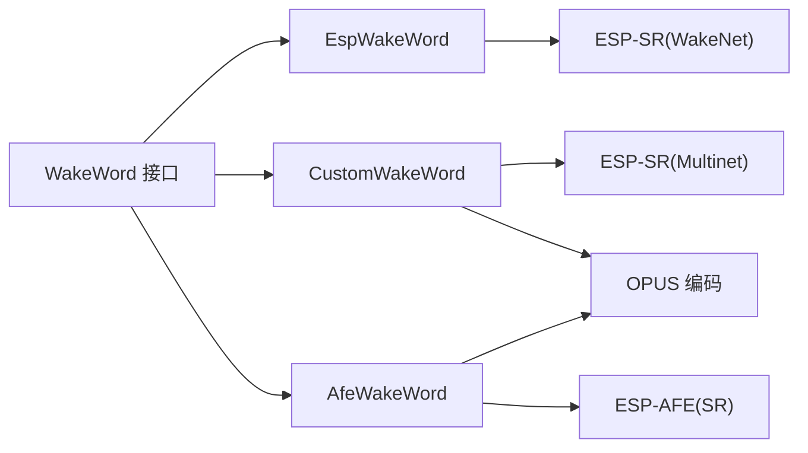

# 唤醒词设计最佳实践

<cite>
**本文引用的文件**   
- [main/audio/wake_word.h](file://main/audio/wake_word.h)
- [main/audio/wake_words/esp_wake_word.h](file://main/audio/wake_words/esp_wake_word.h)
- [main/audio/wake_words/esp_wake_word.cc](file://main/audio/wake_words/esp_wake_word.cc)
- [main/audio/wake_words/custom_wake_word.h](file://main/audio/wake_words/custom_wake_word.h)
- [main/audio/wake_words/custom_wake_word.cc](file://main/audio/wake_words/custom_wake_word.cc)
- [main/audio/wake_words/afe_wake_word.h](file://main/audio/wake_words/afe_wake_word.h)
- [main/audio/wake_words/afe_wake_word.cc](file://main/audio/wake_words/afe_wake_word.cc)
- [README.md](file://README.md)
</cite>

## 目录
1. [引言](#引言)
2. [项目结构](#项目结构)
3. [核心组件](#核心组件)
4. [架构总览](#架构总览)
5. [详细组件分析](#详细组件分析)
6. [依赖关系分析](#依赖关系分析)
7. [性能考量](#性能考量)
8. [故障排查指南](#故障排查指南)
9. [结论](#结论)
10. [附录](#附录)

## 引言
本指南面向语音交互产品的设计与工程团队，聚焦“唤醒词设计与命名”的最佳实践。结合仓库中离线唤醒实现（ESP-SR WakeNet、Multinet、Afe）的接口与行为，给出从语音学特性、场景适配、区分度设计、多语言与文化适配，到测试评估与常见问题解决的系统化建议。

## 项目结构
本项目在音频子系统内提供统一的唤醒词抽象接口，并包含三类典型实现：
- 统一抽象层：WakeWord 接口定义
- 内置唤醒实现：基于 ESP-SR WakeNet 的 EspWakeWord
- 自定义命令词实现：基于 Multinet 的 CustomWakeWord
- 前端增强型实现：基于 AFE 的 AfeWakeWord（含前处理与任务化检测）

图表来源
- [main/audio/wake_word.h:1-26](file://main/audio/wake_word.h#L1-L26)
- [main/audio/wake_words/esp_wake_word.h:17-43](file://main/audio/wake_words/esp_wake_word.h#L17-L43)
- [main/audio/wake_words/custom_wake_word.h:20-34](file://main/audio/wake_words/custom_wake_word.h#L20-L34)
- [main/audio/wake_words/afe_wake_word.h:22-35](file://main/audio/wake_words/afe_wake_word.h#L22-L35)

章节来源
- [README.md:23-37](file://README.md#L23-L37)
- [main/audio/wake_word.h:1-26](file://main/audio/wake_word.h#L1-L26)

## 核心组件
- WakeWord 抽象接口
  - 职责：定义初始化、数据喂入、回调注册、启停、分片大小查询、唤醒片段编码与获取等统一方法。
  - 关键方法：Initialize、Feed、OnWakeWordDetected、Start、Stop、GetFeedSize、EncodeWakeWordData、GetWakeWordOpus、GetLastDetectedWakeWord。
- EspWakeWord（内置唤醒）
  - 基于 ESP-SR WakeNet 模型；按固定 chunksize 推进检测；检测到后通过回调上报最后识别到的唤醒词。
- CustomWakeWord（自定义命令词）
  - 基于 Multinet；支持从 index.json 解析命令集；可配置阈值与显示文本；支持将唤醒片段编码为 Opus 供后续使用。
- AfeWakeWord（前端增强）
  - 基于 AFE 构建高保真 SR 链路；独立任务进行 fetch 与唤醒判定；同样支持唤醒片段缓存与 Opus 编码。

章节来源
- [main/audio/wake_word.h:11-24](file://main/audio/wake_word.h#L11-L24)
- [main/audio/wake_words/esp_wake_word.cc:17-44](file://main/audio/wake_words/esp_wake_word.cc#L17-L44)
- [main/audio/wake_words/esp_wake_word.cc:84-96](file://main/audio/wake_words/esp_wake_word.cc#L84-L96)
- [main/audio/wake_words/custom_wake_word.cc:85-129](file://main/audio/wake_words/custom_wake_word.cc#L85-L129)
- [main/audio/wake_words/custom_wake_word.cc:146-200](file://main/audio/wake_words/custom_wake_word.cc#L146-L200)
- [main/audio/wake_words/afe_wake_word.cc:38-90](file://main/audio/wake_words/afe_wake_word.cc#L38-L90)
- [main/audio/wake_words/afe_wake_word.cc:135-161](file://main/audio/wake_words/afe_wake_word.cc#L135-L161)

## 架构总览
唤醒流程总体路径：音频采集 → 统一 Feed 接口 → 具体实现内部缓冲与分块 → 模型推理 → 触发回调 → 上层业务处理。

图表来源
- [main/audio/wake_word.h:15-23](file://main/audio/wake_word.h#L15-L23)
- [main/audio/wake_words/esp_wake_word.cc:84-96](file://main/audio/wake_words/esp_wake_word.cc#L84-L96)
- [main/audio/wake_words/custom_wake_word.cc:171-193](file://main/audio/wake_words/custom_wake_word.cc#L171-L193)
- [main/audio/wake_words/afe_wake_word.cc:135-161](file://main/audio/wake_words/afe_wake_word.cc#L135-L161)

## 详细组件分析

### 类关系与职责

图表来源
- [main/audio/wake_word.h:11-24](file://main/audio/wake_word.h#L11-L24)
- [main/audio/wake_words/esp_wake_word.h:17-43](file://main/audio/wake_words/esp_wake_word.h#L17-L43)
- [main/audio/wake_words/custom_wake_word.h:20-69](file://main/audio/wake_words/custom_wake_word.h#L20-L69)
- [main/audio/wake_words/afe_wake_word.h:22-60](file://main/audio/wake_words/afe_wake_word.h#L22-L60)

章节来源
- [main/audio/wake_word.h:11-24](file://main/audio/wake_word.h#L11-L24)
- [main/audio/wake_words/esp_wake_word.h:17-43](file://main/audio/wake_words/esp_wake_word.h#L17-L43)
- [main/audio/wake_words/custom_wake_word.h:20-69](file://main/audio/wake_words/custom_wake_word.h#L20-L69)
- [main/audio/wake_words/afe_wake_word.h:22-60](file://main/audio/wake_words/afe_wake_word.h#L22-L60)

### 唤醒流程时序（以 AfeWakeWord 为例）

图表来源
- [main/audio/wake_words/afe_wake_word.cc:38-90](file://main/audio/wake_words/afe_wake_word.cc#L38-L90)
- [main/audio/wake_words/afe_wake_word.cc:135-161](file://main/audio/wake_words/afe_wake_word.cc#L135-L161)
- [main/audio/wake_words/afe_wake_word.cc:163-170](file://main/audio/wake_words/afe_wake_word.cc#L163-L170)

章节来源
- [main/audio/wake_words/afe_wake_word.cc:38-90](file://main/audio/wake_words/afe_wake_word.cc#L38-L90)
- [main/audio/wake_words/afe_wake_word.cc:135-161](file://main/audio/wake_words/afe_wake_word.cc#L135-L161)

### 自定义命令词流程（CustomWakeWord）

图表来源
- [main/audio/wake_words/custom_wake_word.cc:85-129](file://main/audio/wake_words/custom_wake_word.cc#L85-L129)
- [main/audio/wake_words/custom_wake_word.cc:146-200](file://main/audio/wake_words/custom_wake_word.cc#L146-L200)

章节来源
- [main/audio/wake_words/custom_wake_word.cc:85-129](file://main/audio/wake_words/custom_wake_word.cc#L85-L129)
- [main/audio/wake_words/custom_wake_word.cc:146-200](file://main/audio/wake_words/custom_wake_word.cc#L146-L200)

## 依赖关系分析
- 外部依赖
  - ESP-SR 库：WakeNet、Multinet、AFE 相关头文件与模型列表接口。
  - FreeRTOS：事件组、任务、静态任务/栈分配。
  - OPUS 编码器：用于将唤醒片段编码为 Opus 包。
- 内部耦合
  - 所有实现均依赖 AudioCodec 提供的采样率、声道数、参考通道等能力。
  - 统一 WakeWord 接口屏蔽了不同实现的差异，便于上层替换或扩展。

图表来源
- [main/audio/wake_words/esp_wake_word.h:1-15](file://main/audio/wake_words/esp_wake_word.h#L1-L15)
- [main/audio/wake_words/custom_wake_word.h:1-18](file://main/audio/wake_words/custom_wake_word.h#L1-L18)
- [main/audio/wake_words/afe_wake_word.h:1-20](file://main/audio/wake_words/afe_wake_word.h#L1-L20)

章节来源
- [main/audio/wake_words/esp_wake_word.h:1-15](file://main/audio/wake_words/esp_wake_word.h#L1-L15)
- [main/audio/wake_words/custom_wake_word.h:1-18](file://main/audio/wake_words/custom_wake_word.h#L1-L18)
- [main/audio/wake_words/afe_wake_word.h:1-20](file://main/audio/wake_words/afe_wake_word.h#L1-L20)

## 性能考量
- 分片与延迟
  - 各实现通过 GetFeedSize 暴露所需分片大小，避免频繁小帧导致开销过大。
  - AfeWakeWord 采用独立任务拉取与处理，降低主循环阻塞风险。
- 内存与任务栈
  - CustomWakeWord/AfeWakeWord 使用静态任务与 SPIRAM 栈以降低堆碎片风险。
- 编码开销
  - 唤醒片段编码为 Opus 时，采用一次性批量编码并在完成后通知，减少锁竞争与上下文切换。

章节来源
- [main/audio/wake_words/esp_wake_word.cc:98-103](file://main/audio/wake_words/esp_wake_word.cc#L98-L103)
- [main/audio/wake_words/custom_wake_word.cc:218-293](file://main/audio/wake_words/custom_wake_word.cc#L218-L293)
- [main/audio/wake_words/afe_wake_word.cc:172-253](file://main/audio/wake_words/afe_wake_word.cc#L172-L253)

## 故障排查指南
- 模型加载失败
  - 现象：初始化日志提示未找到模型或模型数量为异常值。
  - 排查：确认模型路径与 index.json 是否完整；检查多模型时的选择逻辑。
- 无唤醒回调
  - 现象：Feed 正常但从未触发回调。
  - 排查：确认 Start/Stop 状态；检查回调是否注册；核对 GetFeedSize 与输入帧对齐。
- 误触发/漏触发
  - 现象：环境噪声下误触发，或弱信号下漏触发。
  - 排查：调整阈值（如 Multinet 的 threshold）；优化麦克风布局与降噪；必要时启用 AFE 前处理。
- 编码失败
  - 现象：EncodeWakeWordData 后无法获取 Opus 数据。
  - 排查：检查编码器创建与帧尺寸计算；确认条件变量等待与队列非空判断。

章节来源
- [main/audio/wake_words/esp_wake_word.cc:26-35](file://main/audio/wake_words/esp_wake_word.cc#L26-L35)
- [main/audio/wake_words/custom_wake_word.cc:101-116](file://main/audio/wake_words/custom_wake_word.cc#L101-L116)
- [main/audio/wake_words/afe_wake_word.cc:48-51](file://main/audio/wake_words/afe_wake_word.cc#L48-L51)
- [main/audio/wake_words/custom_wake_word.cc:295-303](file://main/audio/wake_words/custom_wake_word.cc#L295-L303)
- [main/audio/wake_words/afe_wake_word.cc:255-263](file://main/audio/wake_words/afe_wake_word.cc#L255-L263)

## 结论
本指南结合仓库中的唤醒实现，总结了唤醒词设计的系统性方法：从语音学特性、场景适配、区分度策略、多语言与文化适配，到测试评估与问题定位。建议在工程中优先采用统一 WakeWord 接口，按需选择内置唤醒、自定义命令词或 AFE 增强方案，并通过阈值与数据流调优达成低误触、低漏触与良好用户体验。

## 附录

### 一、语音学特性与命名规范（通用建议）
- 音节数量
  - 推荐 2–4 个音节，兼顾易说性与区分度；过长增加误判概率，过短易混淆。
- 重音位置
  - 明确首音节或第二音节重读，形成稳定声学轮廓，利于模型特征提取。
- 发音清晰度
  - 避免连续同韵母或近音组合；尽量包含清晰的辅音-元音交替，提升信噪比。
- 长度与时序
  - 控制整体时长在 0.5–1.5 秒区间，匹配模型分片窗口，减少边界效应。
- 语义与品牌契合
  - 名称应简短、顺口、具辨识度，避免与常用词汇或指令高度相似。

### 二、场景化设计建议
- 智能家居
  - 安静室内为主，允许稍长唤醒词；注意与家电控制指令区分，避免“开灯/关灯”等日常用语混入。
- 车载系统
  - 强噪声、远场、风噪与路噪显著；建议更短、更强重音、更多爆破音；避免与导航/媒体常用短语冲突。
- 工业设备
  - 背景噪声大且频谱复杂；优先选用带清晰瞬态起始的音节组合，必要时启用 AFE 前处理与更高阈值。

### 三、区分度设计与防误触发
- 最小对立对原则
  - 确保候选唤醒词之间至少在一个音素或重音位置上存在明显差异。
- 跨域隔离
  - 将唤醒词与功能指令、播报文案、广告语等在音系层面做隔离。
- 阈值与回退
  - 动态阈值调节；当置信度接近边界时引入二次确认（如按键或屏幕确认）。

### 四、多语言与文化适配
- 语言模型与词典
  - 根据目标市场选择对应语言的多语种模型与命令集；注意本地化拼写与变体。
- 文化禁忌与偏好
  - 避免敏感词、谐音歧义；尊重当地发音习惯与称呼礼仪。
- 用户群体差异
  - 儿童/老年用户群体需更简单、更响亮的音节组合。

### 五、测试与评估方法
- 实验室评测
  - 标准信噪比下的召回率/误报率曲线；不同距离与角度的灵敏度矩阵。
- 现场评测
  - 真实环境（客厅/车内/车间）长期驻留测试；覆盖昼夜时段与人群多样性。
- 用户接受度
  - 记忆度、易说性、自然度问卷；A/B 对比不同候选词的用户偏好。
- 回归与版本管理
  - 建立基准数据集与自动化脚本，每次模型/阈值变更自动回归。

### 六、常见问题与对策
- 难以记忆
  - 缩短音节、强化重音、加入品牌元素；配合视觉/听觉反馈加深记忆。
- 发音困难
  - 避免复杂辅音簇；提供示范音频与跟读引导。
- 易混淆
  - 扩大音系差异；引入二次确认；在 UI 上显式展示当前激活的唤醒词。