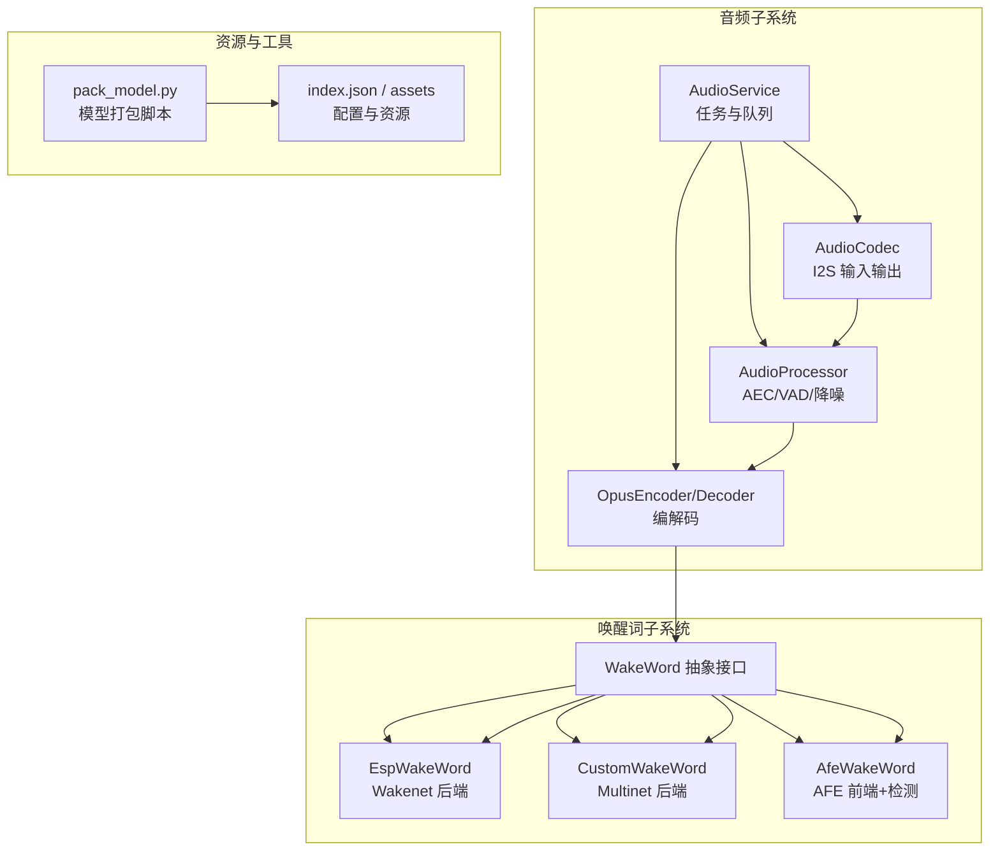
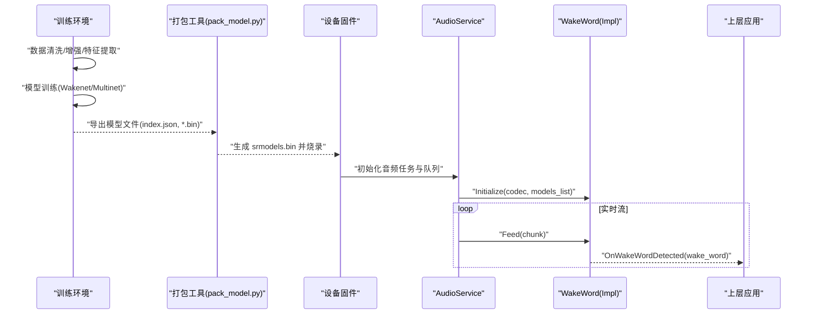
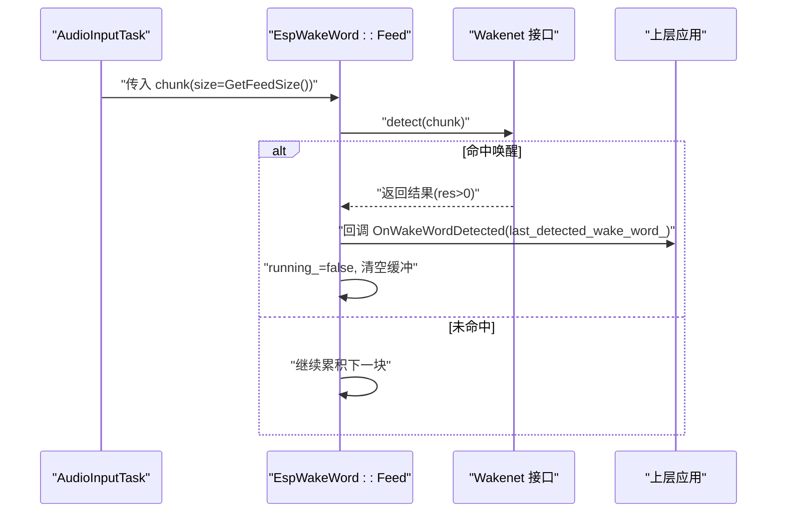
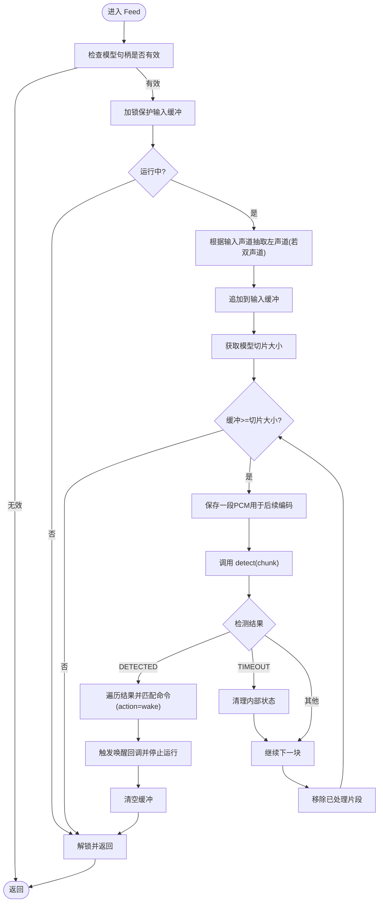
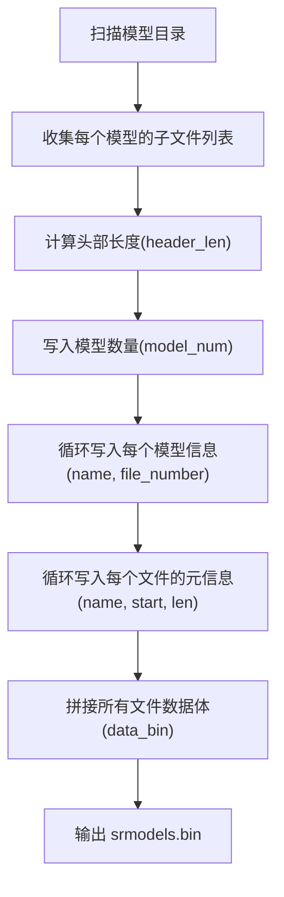
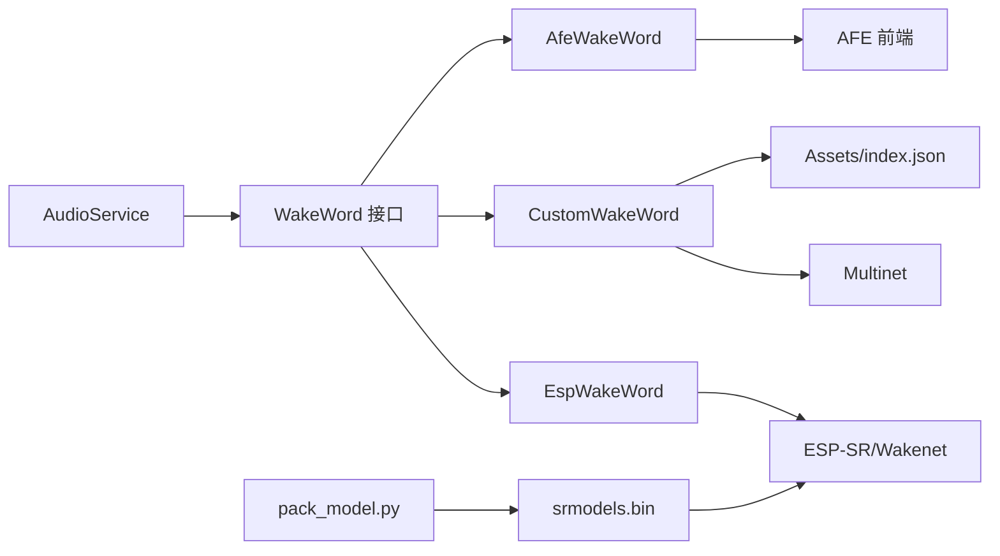

# 模型训练流程

<cite>
**本文引用的文件**   
- [README.md](file://README.md)
- [audio README.md](file://main\audio\README.md)
- [wake_word.h](file://main\audio\wake_word.h)
- [esp_wake_word.h](file://main\audio\wake_words\esp_wake_word.h)
- [esp_wake_word.cc](file://main\audio\wake_words\esp_wake_word.cc)
- [custom_wake_word.h](file://main\audio\wake_words\custom_wake_word.h)
- [custom_wake_word.cc](file://main\audio\wake_words\custom_wake_word.cc)
- [afe_wake_word.h](file://main\audio\wake_words\afe_wake_word.h)
- [pack_model.py](file://scripts\spiffs_assets\pack_model.py)
</cite>

## 目录
1. [简介](#简介)
2. [项目结构](#项目结构)
3. [核心组件](#核心组件)
4. [架构总览](#架构总览)
5. [详细组件分析](#详细组件分析)
6. [依赖关系分析](#依赖关系分析)
7. [性能与参数调优](#性能与参数调优)
8. [评估与验证方法](#评估与验证方法)
9. [监控与调试指南](#监控与调试指南)
10. [常见问题排查](#常见问题排查)
11. [结论](#结论)

## 简介
本文件面向在 ESP32 平台上进行“自定义唤醒词”训练的工程师，提供从数据预处理、特征提取、模型选择与打包，到端侧推理与部署的完整工作流程说明。结合仓库中音频服务与唤醒词模块的实现，文档将解释：
- 数据清洗与特征工程要点（采样率、声道、分帧/切片）
- 模型架构与接口（WakeWord 抽象、EspWakeWord、CustomWakeWord、AfeWakeWord）
- 训练相关参数的影响（学习率、批次大小、训练轮数等）
- 评估指标与验证方法（准确率、召回率、误报率等）
- 训练过程监控与调试（损失曲线、梯度检查、过拟合检测）
- 常见问题定位与优化建议（不稳定、收敛慢、性能不达标）

## 项目结构
本项目围绕音频采集、处理与唤醒词识别构建。关键路径包括：
- 音频服务与任务调度：负责麦克风采集、前处理、编码/解码与播放
- 唤醒词抽象与实现：统一 WakeWord 接口，提供多种后端（ESP SR、Multinet、AFE）
- 模型打包工具：将多模型文件打包为二进制，便于烧录与加载



图表来源
- [audio README.md:1-88](file://main\audio\README.md#L1-L88)
- [wake_word.h:1-26](file://main\audio\wake_word.h#L1-L26)
- [esp_wake_word.h:1-46](file://main\audio\wake_words\esp_wake_word.h#L1-L46)
- [custom_wake_word.h:1-72](file://main\audio\wake_words\custom_wake_word.h#L1-L72)
- [afe_wake_word.h:1-63](file://main\audio\wake_words\afe_wake_word.h#L1-L63)
- [pack_model.py:1-124](file://scripts\spiffs_assets\pack_model.py#L1-L124)

章节来源
- [README.md:1-173](file://README.md#L1-L173)
- [audio README.md:1-88](file://main\audio\README.md#L1-L88)

## 核心组件
- 音频服务与任务模型
  - AudioInputTask：从 AudioCodec 读取 PCM，按状态喂给 WakeWord 或 AudioProcessor
  - OpusCodecTask：执行 PCM→Opus 编码与反向解码，维护发送/播放队列
  - AudioOutputTask：从播放队列取 PCM 并写入 Codec 驱动扬声器
- 唤醒词抽象与实现
  - WakeWord：定义 Initialize/Feed/Start/Stop/GetFeedSize/EncodeWakeWordData/GetWakeWordOpus 等接口
  - EspWakeWord：基于 ESP-SR Wakenet 的轻量级唤醒后端
  - CustomWakeWord：基于 Multinet 的多命令/自定义唤醒词后端，支持阈值、语言、时长等配置
  - AfeWakeWord：基于 AFE 的前端增强与唤醒检测，具备独立编码任务
- 模型打包与资源管理
  - pack_model.py：将多个模型文件打包为 srmodels.bin，供运行时 esp_srmodel_init 加载

章节来源
- [audio README.md:1-88](file://main\audio\README.md#L1-L88)
- [wake_word.h:1-26](file://main\audio\wake_word.h#L1-L26)
- [esp_wake_word.h:1-46](file://main\audio\wake_words\esp_wake_word.h#L1-L46)
- [custom_wake_word.h:1-72](file://main\audio\wake_words\custom_wake_word.h#L1-L72)
- [afe_wake_word.h:1-63](file://main\audio\wake_words\afe_wake_word.h#L1-L63)
- [pack_model.py:1-124](file://scripts\spiffs_assets\pack_model.py#L1-L124)

## 架构总览
唤醒词训练与部署的整体流程如下：
- 训练阶段（离线）：数据采集与标注 → 数据清洗与增强 → 特征提取（如 MFCC/滤波器组）→ 模型训练（Wakenet/Multinet）→ 模型导出与校验
- 打包阶段（离线）：使用 pack_model.py 将模型与索引打包为 srmodels.bin
- 部署阶段（在线）：设备启动时通过 esp_srmodel_init 加载模型；AudioInputTask 持续采集 PCM，按 GetFeedSize 切块喂入 WakeWord；检测到唤醒后回调上层应用



图表来源
- [pack_model.py:41-124](file://scripts\spiffs_assets\pack_model.py#L41-L124)
- [esp_wake_word.cc:17-43](file://main\audio\wake_words\esp_wake_word.cc#L17-L43)
- [audio README.md:22-80](file://main\audio\README.md#L22-L80)

## 详细组件分析

### 类与接口关系（WakeWord 体系）
```mermaid
classDiagram
class WakeWord {
+bool Initialize(AudioCodec*, srmodel_list_t*)
+void Feed(vector<int16_t>)
+void OnWakeWordDetected(function<void(string)>)
+void Start()
+void Stop()
+size_t GetFeedSize()
+void EncodeWakeWordData()
+bool GetWakeWordOpus(vector<uint8_t>&)
+const string& GetLastDetectedWakeWord() const
}
class EspWakeWord {
-esp_wn_iface_t* wakenet_iface_
-model_iface_data_t* wakenet_data_
-srmodel_list_t* wakenet_model_
-AudioCodec* codec_
-atomic<bool> running_
-function<void(string)> wake_word_detected_callback_
-string last_detected_wake_word_
-vector<int16_t> input_buffer_
+bool Initialize(...)
+void Feed(...)
+size_t GetFeedSize()
}
class CustomWakeWord {
-esp_mn_iface_t* multinet_
-model_iface_data_t* multinet_model_data_
-srmodel_list_t* models_
-char* mn_name_
-string language_
-int duration_
-float threshold_
-deque<Command> commands_
-TaskHandle_t wake_word_encode_task_
-deque<vector<int16_t>> wake_word_pcm_
-deque<vector<uint8_t>> wake_word_opus_
+bool Initialize(...)
+void Feed(...)
+size_t GetFeedSize()
+void EncodeWakeWordData()
+bool GetWakeWordOpus(vector<uint8_t>&)
}
class AfeWakeWord {
-srmodel_list_t* models_
-const esp_afe_sr_iface_t* afe_iface_
-esp_afe_sr_data_t* afe_data_
-char* wakenet_model_
-EventGroupHandle_t event_group_
-TaskHandle_t wake_word_encode_task_
-deque<vector<int16_t>> wake_word_pcm_
-deque<vector<uint8_t>> wake_word_opus_
+bool Initialize(...)
+void Feed(...)
+void EncodeWakeWordData()
+bool GetWakeWordOpus(vector<uint8_t>&)
}
WakeWord <|-- EspWakeWord
WakeWord <|-- CustomWakeWord
WakeWord <|-- AfeWakeWord
```

图表来源
- [wake_word.h:11-24](file://main\audio\wake_word.h#L11-L24)
- [esp_wake_word.h:17-43](file://main\audio\wake_words\esp_wake_word.h#L17-L43)
- [custom_wake_word.h:20-69](file://main\audio\wake_words\custom_wake_word.h#L20-L69)
- [afe_wake_word.h:22-60](file://main\audio\wake_words\afe_wake_word.h#L22-L60)

章节来源
- [wake_word.h:1-26](file://main\audio\wake_word.h#L1-L26)
- [esp_wake_word.h:1-46](file://main\audio\wake_words\esp_wake_word.h#L1-L46)
- [custom_wake_word.h:1-72](file://main\audio\wake_words\custom_wake_word.h#L1-L72)
- [afe_wake_word.h:1-63](file://main\audio\wake_words\afe_wake_word.h#L1-L63)

### 数据流与推理时序（以 EspWakeWord 为例）


图表来源
- [esp_wake_word.cc:17-43](file://main\audio\wake_words\esp_wake_word.cc#L17-L43)
- [esp_wake_word.cc:84-96](file://main\audio\wake_words\esp_wake_word.cc#L84-L96)
- [esp_wake_word.h:22-30](file://main\audio\wake_words\esp_wake_word.h#L22-L30)

章节来源
- [esp_wake_word.cc:1-110](file://main\audio\wake_words\esp_wake_word.cc#L1-L110)
- [esp_wake_word.h:1-46](file://main\audio\wake_words\esp_wake_word.h#L1-L46)

### 复杂逻辑流程图（CustomWakeWord 检测与缓存）


图表来源
- [custom_wake_word.cc:146-200](file://main\audio\wake_words\custom_wake_word.cc#L146-L200)
- [custom_wake_word.h:47-69](file://main\audio\wake_words\custom_wake_word.h#L47-L69)

章节来源
- [custom_wake_word.cc:1-211](file://main\audio\wake_words\custom_wake_word.cc#L1-L211)
- [custom_wake_word.h:1-72](file://main\audio\wake_words\custom_wake_word.h#L1-L72)

### 模型打包流程（pack_model.py）


图表来源
- [pack_model.py:41-124](file://scripts\spiffs_assets\pack_model.py#L41-L124)

章节来源
- [pack_model.py:1-124](file://scripts\spiffs_assets\pack_model.py#L1-L124)

## 依赖关系分析
- 模块耦合
  - AudioService 与 WakeWord 解耦：通过统一接口与 GetFeedSize 约定切片大小，避免强耦合
  - 不同 WakeWord 实现共享相同生命周期管理（Initialize/Start/Stop），便于替换与扩展
- 外部依赖
  - ESP-SR/Wakenet/Multinet/Audio Front-End：由 esp_srmodel_init 与对应 iface 提供
  - 资源加载：assets/index.json 与打包后的 srmodels.bin
- 潜在风险
  - 多线程访问输入缓冲需互斥保护（已在 CustomWakeWord 中使用 mutex）
  - 任务栈与静态内存分配需合理设置，避免堆碎片与溢出



图表来源
- [wake_word.h:11-24](file://main\audio\wake_word.h#L11-L24)
- [esp_wake_word.cc:17-43](file://main\audio\wake_words\esp_wake_word.cc#L17-L43)
- [custom_wake_word.cc:37-50](file://main\audio\wake_words\custom_wake_word.cc#L37-L50)
- [pack_model.py:41-124](file://scripts\spiffs_assets\pack_model.py#L41-L124)

章节来源
- [wake_word.h:1-26](file://main\audio\wake_word.h#L1-L26)
- [esp_wake_word.cc:1-110](file://main\audio\wake_words\esp_wake_word.cc#L1-L110)
- [custom_wake_word.cc:1-211](file://main\audio\wake_words\custom_wake_word.cc#L1-L211)
- [pack_model.py:1-124](file://scripts\spiffs_assets\pack_model.py#L1-L124)

## 性能与参数调优
- 采样率与切片大小
  - 各后端通过 get_samp_rate/get_samp_chunksize 暴露所需采样率与切片大小，需确保上游 AudioInputTask 按该尺寸喂入
- 阈值与超时
  - CustomWakeWord 支持 threshold/duration 等配置，影响误报与漏报平衡
- 线程与队列
  - 合理的队列深度与任务优先级可降低延迟与丢包
- 资源占用
  - 注意任务栈与静态缓冲区大小，避免频繁动态分配

章节来源
- [esp_wake_word.cc:40-43](file://main\audio\wake_words\esp_wake_word.cc#L40-L43)
- [custom_wake_word.h:47-49](file://main\audio\wake_words\custom_wake_word.h#L47-L49)
- [audio README.md:14-21](file://main\audio\README.md#L14-L21)

## 评估与验证方法
- 指标定义
  - 准确率（Precision）、召回率（Recall）、F1、误报率（False Alarm Rate）、漏报率（Missed Detection Rate）
- 测试集设计
  - 覆盖不同说话人、噪声场景、距离与角度，保证分布代表性
- 评估流程
  - 离线批测：批量回放录音，统计命中/误报
  - 在线压测：长时间运行记录事件日志，统计单位时间误报次数
- 可视化与报告
  - 混淆矩阵、ROC/PR 曲线、误报时段分布图

[本节为通用方法论，不直接分析具体代码文件]

## 监控与调试指南
- 日志与断点
  - 利用 ESP_LOGI/ESP_LOGE 输出关键路径（模型加载、检测状态、回调触发）
- 损失与梯度（训练阶段）
  - 绘制训练/验证损失曲线，观察过拟合与欠拟合
  - 梯度范数与梯度爆炸/消失检查（如梯度裁剪）
- 在线诊断
  - 记录唤醒事件前后若干秒音频片段，辅助定位误报原因
  - 监控任务队列长度与 CPU 占用，避免阻塞

章节来源
- [esp_wake_word.cc:26-43](file://main\audio\wake_words\esp_wake_word.cc#L26-L43)
- [custom_wake_word.cc:173-193](file://main\audio\wake_words\custom_wake_word.cc#L173-L193)

## 常见问题排查
- 训练不稳定
  - 现象：损失震荡、发散
  - 排查：降低学习率、增加正则化、检查数据质量与标签一致性
- 收敛缓慢
  - 现象：训练步数过多仍无改善
  - 排查：调整学习率调度、增大批次大小（受显存限制）、检查特征归一化
- 性能不达标（高误报/低召回）
  - 现象：误唤醒频繁或漏唤醒
  - 排查：提高阈值、增加负样本、扩充正样本多样性、引入噪声增强
- 端侧问题
  - 现象：无法加载模型、检测无响应
  - 排查：确认 srmodels.bin 路径与 index.json 正确；检查 Initialize 返回值与日志；核对 GetFeedSize 与输入切片一致

章节来源
- [esp_wake_word.cc:26-35](file://main\audio\wake_words\esp_wake_word.cc#L26-L35)
- [custom_wake_word.cc:146-200](file://main\audio\wake_words\custom_wake_word.cc#L146-L200)

## 结论
通过在 ESP32 平台集成统一的 WakeWord 抽象与多种后端实现，配合完善的音频任务流水线与模型打包工具，可高效完成自定义唤醒词的训练与部署。建议在训练阶段重视数据质量与增强策略，在部署阶段关注切片对齐、阈值与资源占用，并通过系统化的评估与监控手段持续提升稳定性与鲁棒性。