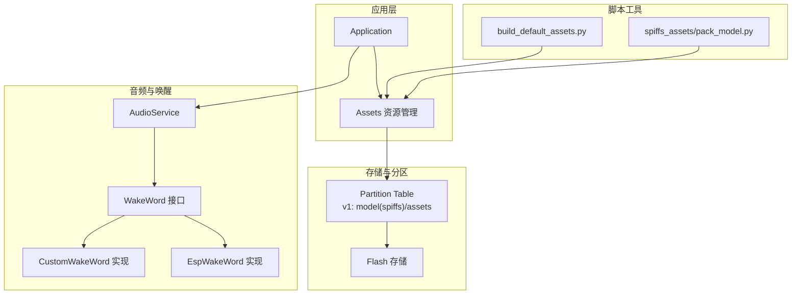
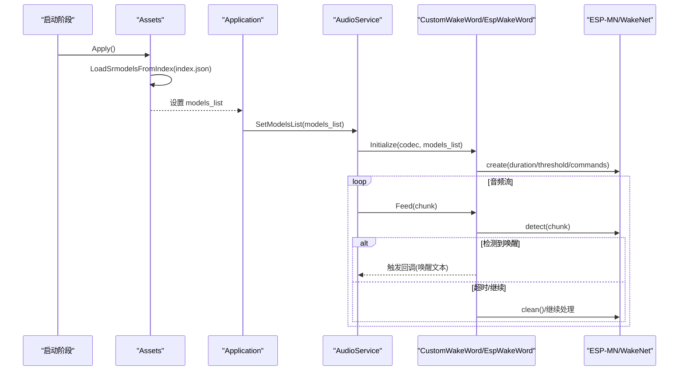
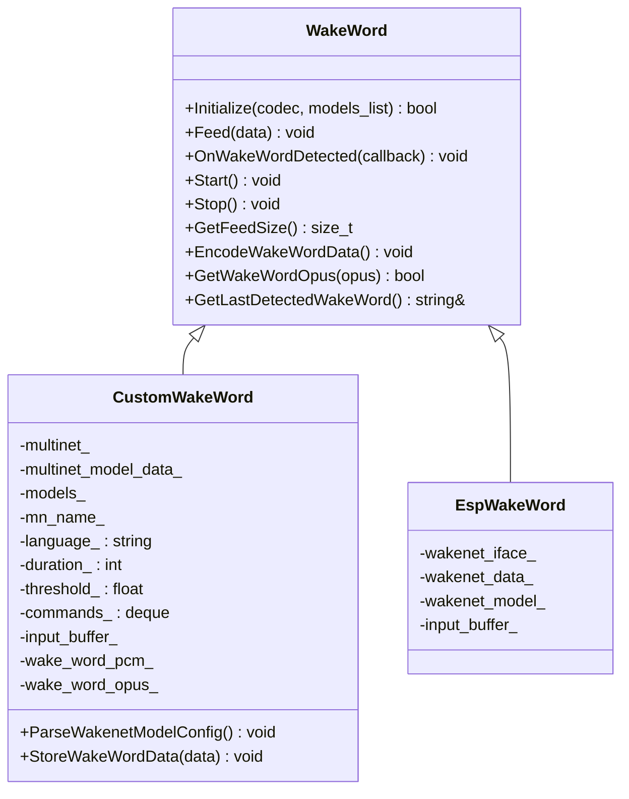
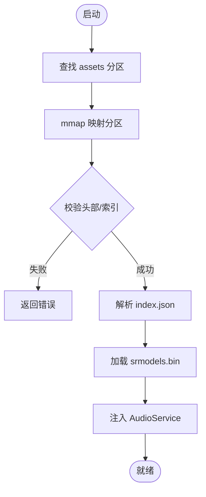
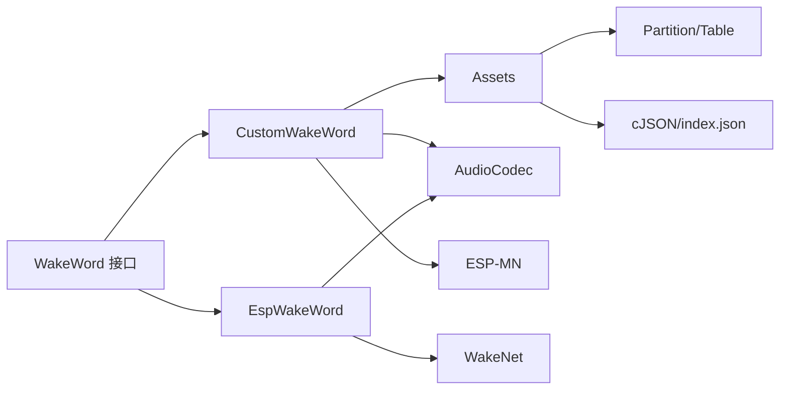

# 模型部署与集成

<cite>
**本文引用的文件**   
- [custom_wake_word.h](file://main/audio/wake_words/custom_wake_word.h)
- [custom_wake_word.cc](file://main/audio/wake_words/custom_wake_word.cc)
- [esp_wake_word.h](file://main/audio/wake_words/esp_wake_word.h)
- [esp_wake_word.cc](file://main/audio/wake_words/esp_wake_word.cc)
- [wake_word.h](file://main/audio/wake_word.h)
- [assets.h](file://main/assets.h)
- [assets.cc](file://main/assets.cc)
- [16m_custom_wakeword.csv](file://partitions/v1/16m_custom_wakeword.csv)
- [build_default_assets.py](file://scripts/build_default_assets.py)
- [pack_model.py](file://scripts/spiffs_assets/pack_model.py)
</cite>

## 目录
1. [简介](#简介)
2. [项目结构](#项目结构)
3. [核心组件](#核心组件)
4. [架构总览](#架构总览)
5. [详细组件分析](#详细组件分析)
6. [依赖关系分析](#依赖关系分析)
7. [性能考虑](#性能考虑)
8. [故障排查指南](#故障排查指南)
9. [结论](#结论)
10. [附录](#附录)

## 简介
本指南面向在 ESP32 设备上部署自定义唤醒词（Custom Wake Word）的工程师，覆盖从模型打包、分区配置、运行时加载到参数调优、版本管理与测试验证的全流程。重点围绕 CustomWakeWord 类及其与资源系统（Assets）、音频服务（AudioService）和底层语音识别库（ESP-MN/WakeNet）的集成方式，提供可操作的步骤与最佳实践。

## 项目结构
本项目将自定义唤醒词能力封装为 WakeWord 接口的两个实现：内置的 EspWakeWord 与可扩展的 CustomWakeWord。模型与资源通过 Assets 子系统统一加载，支持从内置 assets 分区或外部下载更新。

图表来源
- [assets.cc:71-119](file://main/assets.cc#L71-L119)
- [custom_wake_word.cc:85-129](file://main/audio/wake_words/custom_wake_word.cc#L85-L129)
- [esp_wake_word.cc:17-44](file://main/audio/wake_words/esp_wake_word.cc#L17-L44)
- [16m_custom_wakeword.csv:1-8](file://partitions/v1/16m_custom_wakeword.csv#L1-L8)
- [build_default_assets.py:57-200](file://scripts/build_default_assets.py#L57-L200)
- [pack_model.py:40-118](file://scripts/spiffs_assets/pack_model.py#L40-L118)

章节来源
- [assets.h:23-89](file://main/assets.h#L23-L89)
- [assets.cc:71-119](file://main/assets.cc#L71-L119)
- [wake_word.h:11-26](file://main/audio/wake_word.h#L11-L26)
- [custom_wake_word.h:20-71](file://main/audio/wake_words/custom_wake_word.h#L20-L71)
- [esp_wake_word.h:17-45](file://main/audio/wake_words/esp_wake_word.h#L17-L45)
- [16m_custom_wakeword.csv:1-8](file://partitions/v1/16m_custom_wakeword.csv#L1-L8)

## 核心组件
- WakeWord 接口：定义统一的初始化、数据馈送、回调注册、启停、帧大小查询、唤醒片段编码与获取等能力。
- CustomWakeWord：基于 ESP-MN 的多命令词识别实现，支持语言、阈值、检测时长、指令集等配置；具备唤醒片段 PCM 缓存与 OPUS 编码任务。
- EspWakeWord：基于 ESP-WakeNet 的轻量唤醒实现，适合固定唤醒词场景。
- Assets：负责资源分区映射、index.json 解析、srmodels.bin 加载与下发更新，并将模型列表注入 AudioService。

章节来源
- [wake_word.h:11-26](file://main/audio/wake_word.h#L11-L26)
- [custom_wake_word.h:20-71](file://main/audio/wake_words/custom_wake_word.h#L20-L71)
- [custom_wake_word.cc:85-129](file://main/audio/wake_words/custom_wake_word.cc#L85-L129)
- [esp_wake_word.h:17-45](file://main/audio/wake_words/esp_wake_word.h#L17-L45)
- [esp_wake_word.cc:17-44](file://main/audio/wake_words/esp_wake_word.cc#L17-L44)
- [assets.h:23-89](file://main/assets.h#L23-L89)
- [assets.cc:71-119](file://main/assets.cc#L71-L119)

## 架构总览
下图展示从资源加载到唤醒识别的关键调用链与数据流。

图表来源
- [assets.cc:71-119](file://main/assets.cc#L71-L119)
- [custom_wake_word.cc:85-129](file://main/audio/wake_words/custom_wake_word.cc#L85-L129)
- [esp_wake_word.cc:17-44](file://main/audio/wake_words/esp_wake_word.cc#L17-L44)

## 详细组件分析

### CustomWakeWord 类与配置
- 初始化流程
  - 若未传入 models_list，则默认使用“model”路径并可通过编译宏配置默认唤醒词与阈值。
  - 若传入 models_list，则从 index.json 解析 multinet_model 的配置项（language、duration、threshold、commands），再创建多命令识别实例。
- 关键配置项
  - language：语言标识，用于筛选匹配的 multinet 模型。
  - duration：检测窗口时长（毫秒）。
  - threshold：检测阈值（0~1），影响误报/漏报平衡。
  - commands：指令数组，包含 command/text/action 字段，action 为 “wake” 时触发唤醒回调。
- 运行期行为
  - Feed 按 chunksize 分片送入识别器，维护输入缓冲与双声道左声道抽取逻辑。
  - 检测到唤醒后清理状态并回调上层；超时亦会清理状态。
  - 提供 EncodeWakeWordData 异步编码最近约 2 秒 PCM 为 OPUS，并通过 GetWakeWordOpus 阻塞等待结果。

图表来源
- [wake_word.h:11-26](file://main/audio/wake_word.h#L11-L26)
- [custom_wake_word.h:20-71](file://main/audio/wake_words/custom_wake_word.h#L20-L71)
- [esp_wake_word.h:17-45](file://main/audio/wake_words/esp_wake_word.h#L17-L45)

章节来源
- [custom_wake_word.h:20-71](file://main/audio/wake_words/custom_wake_word.h#L20-L71)
- [custom_wake_word.cc:37-129](file://main/audio/wake_words/custom_wake_word.cc#L37-L129)
- [custom_wake_word.cc:146-207](file://main/audio/wake_words/custom_wake_word.cc#L146-L207)
- [custom_wake_word.cc:209-303](file://main/audio/wake_words/custom_wake_word.cc#L209-L303)
- [esp_wake_word.cc:17-44](file://main/audio/wake_words/esp_wake_word.cc#L17-L44)

### 模型资源与运行时加载机制
- 资源分区与映射
  - v1 分区表提供 model（spiffs）与 ota 分区；assets 分区由运行时策略选择并 mmap 映射，校验头部与文件索引。
- index.json 与 srmodels.bin
  - Assets 读取 index.json，解析 srmodels 字段指向的二进制包，调用底层加载函数生成 srmodel_list，并注入 AudioService。
- 动态更新
  - 支持从网络下载新资源包，擦写指定扇区并写入头信息，完成后重新初始化分区映射。

图表来源
- [assets.cc:130-185](file://main/assets.cc#L130-L185)
- [assets.cc:71-119](file://main/assets.cc#L71-L119)
- [assets.cc:428-615](file://main/assets.cc#L428-L615)
- [16m_custom_wakeword.csv:1-8](file://partitions/v1/16m_custom_wakeword.csv#L1-L8)

章节来源
- [assets.h:23-89](file://main/assets.h#L23-L89)
- [assets.cc:71-119](file://main/assets.cc#L71-L119)
- [assets.cc:130-185](file://main/assets.cc#L130-L185)
- [assets.cc:428-615](file://main/assets.cc#L428-L615)
- [16m_custom_wakeword.csv:1-8](file://partitions/v1/16m_custom_wakeword.csv#L1-L8)

### 模型打包格式与构建流程
- 打包产物
  - 最终产物为 srmodels.bin，内含 wakenet/multinet 模型及元数据，供运行时加载。
- 构建脚本
  - build_default_assets.py 负责收集模型、生成 srmodels.bin 并放入 assets 目录。
  - spiffs_assets/pack_model.py 提供 pack_models 工具，输出 srmodels.bin。
- 压缩与量化
  - 脚本侧对模型进行打包与必要的预处理；具体压缩/量化策略由上游模型构建管线决定，此处以打包与分发为主。

图表来源
- [build_default_assets.py:57-200](file://scripts/build_default_assets.py#L57-L200)
- [pack_model.py:40-118](file://scripts/spiffs_assets/pack_model.py#L40-L118)

章节来源
- [build_default_assets.py:57-200](file://scripts/build_default_assets.py#L57-L200)
- [pack_model.py:40-118](file://scripts/spiffs_assets/pack_model.py#L40-L118)

### 模型路径配置与运行时加载
- 默认路径
  - 当未显式传入 models_list 时，内部使用“model”作为模型根路径进行初始化。
- 自定义路径
  - 通过传入 srmodel_list 指针，可直接使用已加载的模型集合，避免重复初始化。
- 运行时加载
  - Assets 在 Apply 阶段解析 index.json 并加载 srmodels.bin，随后将模型列表注入 AudioService，供唤醒模块使用。

章节来源
- [custom_wake_word.cc:85-129](file://main/audio/wake_words/custom_wake_word.cc#L85-L129)
- [esp_wake_word.cc:17-44](file://main/audio/wake_words/esp_wake_word.cc#L17-L44)
- [assets.cc:71-119](file://main/assets.cc#L71-L119)

### 内存管理与资源分配策略
- 输入缓冲与线程安全
  - Feed 中使用互斥锁保护输入缓冲，避免与 Stop 并发竞争；双声道输入自动抽取左声道。
- 唤醒片段编码任务
  - 使用静态任务与堆外栈（SPIRAM）降低主内存压力；OPUS 编码器在独立任务中批量编码，结果通过条件变量通知消费端。
- 资源释放
  - 析构时销毁识别器句柄、释放任务栈与缓冲区、反初始化模型列表，确保无泄漏。

章节来源
- [custom_wake_word.cc:146-207](file://main/audio/wake_words/custom_wake_word.cc#L146-L207)
- [custom_wake_word.cc:218-303](file://main/audio/wake_words/custom_wake_word.cc#L218-L303)
- [custom_wake_word.cc:18-35](file://main/audio/wake_words/custom_wake_word.cc#L18-L35)

### 模型版本管理与更新机制
- 版本检查
  - Application 周期性检查新版本，失败重试并提示用户。
- 资源更新
  - Assets.Download 支持从 HTTP 拉取新资源包，校验长度与扇区边界，擦写并写入头信息，完成后重新初始化分区映射。
- 兼容性
  - index.json 中的 version 字段用于限制兼容范围，超出版本上限将拒绝加载。

章节来源
- [application.cc:398-424](file://main/application.cc#L398-L424)
- [assets.cc:428-615](file://main/assets.cc#L428-L615)
- [assets.cc:214-236](file://main/assets.cc#L214-L236)

### 部署后的测试验证方法
- 识别准确率测试
  - 构造不同噪声环境与语速样本，统计唤醒命中率与误报率；调整 threshold 与 duration 以平衡性能。
- 响应时间测试
  - 记录从 Feed 首帧到回调触发的耗时，评估端到端延迟；关注 chunksize 与任务调度开销。
- 内存占用分析
  - 观察输入缓冲、PCM 队列与 OPUS 编码任务的内存峰值；必要时增大 SPIRAM 或减小缓存窗口。
- 稳定性测试
  - 长时间运行下监控状态清理（clean）与超时分支，确保无状态残留导致的误触发。

[本节为通用指导，不直接分析具体文件]

## 依赖关系分析
- 组件耦合
  - CustomWakeWord/EspWakeWord 均依赖 AudioCodec 获取采样率与通道数；CustomWakeWord 额外依赖 Assets 解析 index.json。
  - Assets 依赖分区表与文件系统（mmap），并通过 Application/AudioService 暴露模型列表。
- 外部依赖
  - ESP-IDF 分区与闪存 API、cJSON 解析、ESP-MN/WakeNet 接口。
- 潜在循环依赖
  - 当前设计通过接口解耦，未见明显循环依赖。

图表来源
- [wake_word.h:11-26](file://main/audio/wake_word.h#L11-L26)
- [custom_wake_word.cc:85-129](file://main/audio/wake_words/custom_wake_word.cc#L85-L129)
- [esp_wake_word.cc:17-44](file://main/audio/wake_words/esp_wake_word.cc#L17-L44)
- [assets.cc:71-119](file://main/assets.cc#L71-L119)

章节来源
- [wake_word.h:11-26](file://main/audio/wake_word.h#L11-L26)
- [custom_wake_word.cc:85-129](file://main/audio/wake_words/custom_wake_word.cc#L85-L129)
- [esp_wake_word.cc:17-44](file://main/audio/wake_words/esp_wake_word.cc#L17-L44)
- [assets.cc:71-119](file://main/assets.cc#L71-L119)

## 性能考虑
- 阈值与时长权衡
  - 提高 threshold 可降低误报但可能增加漏报；增大 duration 有助于复杂环境下的召回，但会增加延迟与内存占用。
- 分块大小与吞吐
  - 根据模型 chunksize 对齐输入，减少拷贝与上下文切换；合理设置音频采集频率与缓冲深度。
- 编码任务优化
  - 将 OPUS 编码置于独立任务并使用 SPIRAM 栈，避免阻塞主循环；控制 PCM 缓存窗口大小以降低峰值内存。
- 资源映射与 I/O
  - 优先使用 mmap 访问资源，避免频繁磁盘 I/O；更新资源时注意扇区对齐与擦写次数。

[本节为通用指导，不直接分析具体文件]

## 故障排查指南
- 模型过大导致加载失败
  - 现象：LoadSrmodelsFromIndex 报错或无法加载 srmodels.bin。
  - 排查：确认 assets 分区容量足够；检查 index.json 中 srmodels 字段是否正确；核对打包产物完整性。
- 找不到模型或语言不匹配
  - 现象：multinet 过滤失败或回退到任意模型。
  - 排查：检查 index.json 中 multinet_model.language 是否与可用模型一致；确认 mn_name_ 非空。
- 识别延迟高
  - 现象：从 Feed 到回调耗时较长。
  - 排查：检查 chunksize 与输入缓冲增长速率；确认未在回调中进行重计算；适当降低 duration 或 threshold。
- 内存不足或崩溃
  - 现象：编码任务栈分配失败或 OOM。
  - 排查：增大 SPIRAM 或减小 PCM 缓存窗口；确认任务栈与缓冲区释放路径正确。
- 资源更新失败
  - 现象：Download 过程中擦写或写入失败。
  - 排查：检查网络连通性与文件大小；确认分区大小与扇区边界；查看日志中的错误码。

章节来源
- [assets.cc:71-119](file://main/assets.cc#L71-L119)
- [assets.cc:428-615](file://main/assets.cc#L428-L615)
- [custom_wake_word.cc:85-129](file://main/audio/wake_words/custom_wake_word.cc#L85-L129)
- [custom_wake_word.cc:218-303](file://main/audio/wake_words/custom_wake_word.cc#L218-L303)

## 结论
通过在 ESP32 上采用 Assets 统一管理模型资源、结合 CustomWakeWord 的灵活配置与 ESP-MN 的高效识别，可实现稳定可靠的自定义唤醒词方案。建议在生产环境中严格把控模型打包质量、合理设置阈值与时长、并进行全面的准确性与性能测试，以获得最佳用户体验。

[本节为总结性内容，不直接分析具体文件]

## 附录
- 常用配置项参考
  - language：字符串，如 "cn"。
  - duration：整数，单位毫秒。
  - threshold：浮点，范围 0~1。
  - commands：数组，每项含 command/text/action。
- 分区表示例
  - v1 分区表包含 model（spiffs）与 ota 分区，便于存放模型与 OTA 升级。

章节来源
- [custom_wake_word.cc:37-82](file://main/audio/wake_words/custom_wake_word.cc#L37-L82)
- [16m_custom_wakeword.csv:1-8](file://partitions/v1/16m_custom_wakeword.csv#L1-L8)