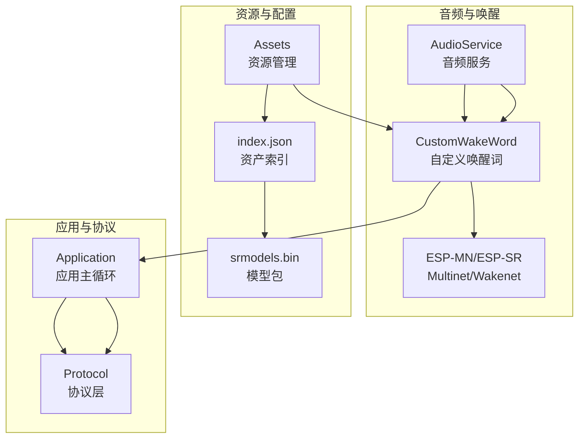
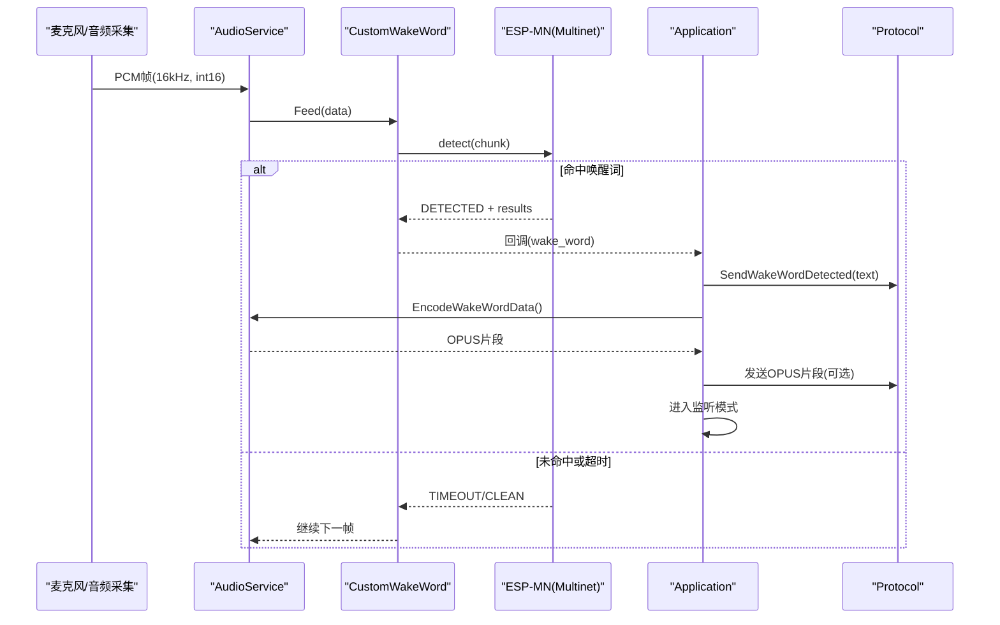
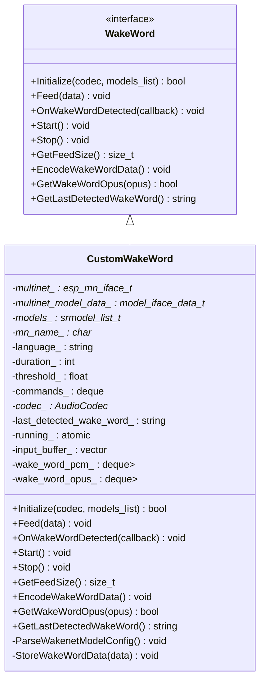
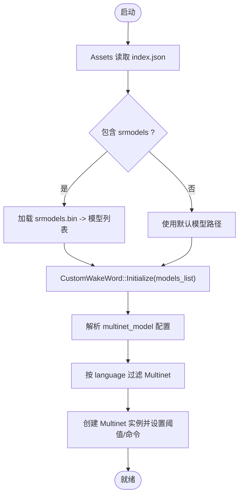
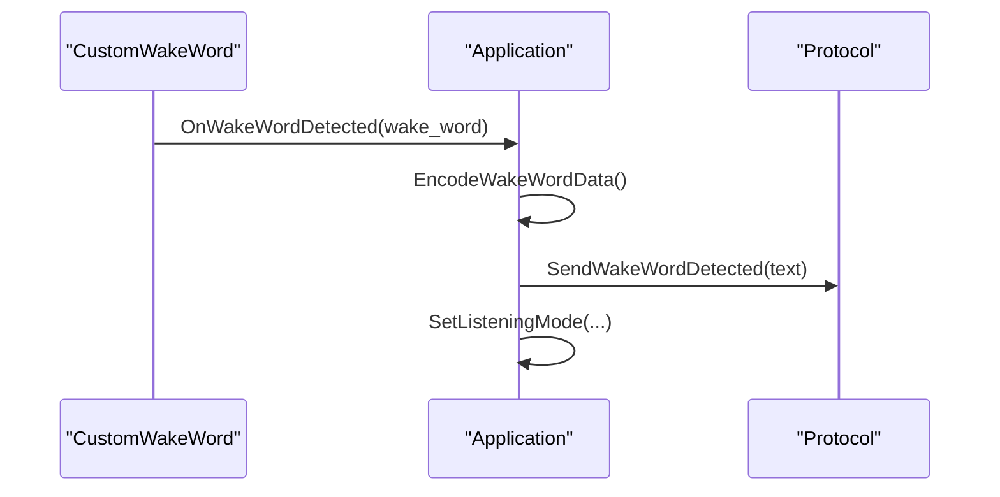
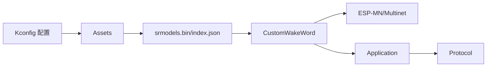
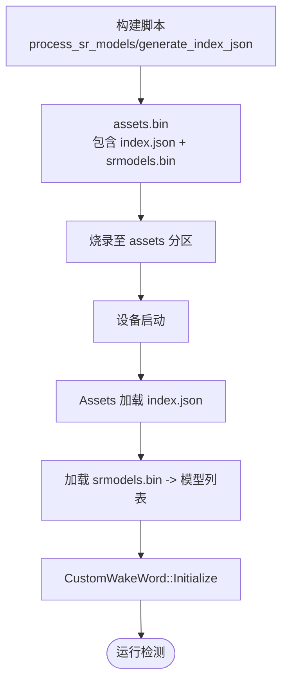

# 自定义唤醒词

<cite>
**本文引用的文件**   
- [custom_wake_word.h](file://main\audio\wake_words\custom_wake_word.h)
- [custom_wake_word.cc](file://main\audio\wake_words\custom_wake_word.cc)
- [wake_word.h](file://main\audio\wake_word.h)
- [assets.cc](file://main\assets.cc)
- [build_default_assets.py](file://scripts\build_default_assets.py)
- [Kconfig.projbuild](file://main\Kconfig.projbuild)
- [application.cc](file://main\application.cc)
- [protocol.cc](file://main\protocols\protocol.cc)
</cite>

## 目录
1. [简介](#简介)
2. [项目结构](#项目结构)
3. [核心组件](#核心组件)
4. [架构总览](#架构总览)
5. [详细组件分析](#详细组件分析)
6. [依赖关系分析](#依赖关系分析)
7. [性能与资源考量](#性能与资源考量)
8. [训练数据准备规范](#训练数据准备规范)
9. [模型训练流程](#模型训练流程)
10. [部署与运行时加载](#部署与运行时加载)
11. [唤醒词命名规范与最佳实践](#唤醒词命名规范与最佳实践)
12. [工具使用与调试技巧](#工具使用与调试技巧)
13. [常见问题排查](#常见问题排查)
14. [结论](#结论)
15. [附录：配置项与字段说明](#附录配置项与字段说明)

## 简介
本指南面向希望在 ESP32 设备上集成“自定义唤醒词”的开发者，围绕 CustomWakeWord 类的架构设计与实现原理，系统讲解从训练数据准备、模型训练、打包到设备端部署与运行时的完整链路。文档同时提供唤醒词命名规范、性能评估方法以及常见问题的定位思路，帮助你在不同场景下获得稳定可靠的唤醒体验。

## 项目结构
本项目将自定义唤醒词能力封装在 audio/wake_words 模块中，并通过 assets 子系统完成模型与配置的加载，最终由应用层协调音频采集、唤醒检测与网络交互。

图示来源
- [custom_wake_word.cc:84-129](file://main\audio\wake_words\custom_wake_word.cc#L84-L129)
- [assets.cc:71-119](file://main\assets.cc#L71-L119)
- [application.cc:781-858](file://main\application.cc#L781-L858)
- [protocol.cc:51-55](file://main\protocols\protocol.cc#L51-L55)

章节来源
- [custom_wake_word.h:20-69](file://main\audio\wake_words\custom_wake_word.h#L20-L69)
- [custom_wake_word.cc:84-129](file://main\audio\wake_words\custom_wake_word.cc#L84-L129)
- [assets.cc:71-119](file://main\assets.cc#L71-L119)
- [application.cc:781-858](file://main\application.cc#L781-L858)
- [protocol.cc:51-55](file://main\protocols\protocol.cc#L51-L55)

## 核心组件
- WakeWord 抽象接口：定义统一的初始化、数据喂入、回调注册、启停、分块大小查询、唤醒片段编码与获取等能力。
- CustomWakeWord：基于 ESP-MN（Multinet）实现的自定义唤醒词识别器，支持从 index.json 动态读取语言、阈值、命令集等配置，并在检测到目标唤醒词后触发回调。
- Assets：负责从 assets 分区加载 srmodels.bin 与 index.json，并将模型列表注入 AudioService，供唤醒模块使用。
- Application/Protocol：应用层在唤醒事件发生后进行状态切换、可选地发送唤醒片段与文本，并进入监听模式。

章节来源
- [wake_word.h:11-24](file://main\audio\wake_word.h#L11-L24)
- [custom_wake_word.h:20-69](file://main\audio\wake_words\custom_wake_word.h#L20-L69)
- [custom_wake_word.cc:84-129](file://main\audio\wake_words\custom_wake_word.cc#L84-L129)
- [assets.cc:71-119](file://main\assets.cc#L71-L119)
- [application.cc:781-858](file://main\application.cc#L781-L858)
- [protocol.cc:51-55](file://main\protocols\protocol.cc#L51-L55)

## 架构总览
下图展示了从音频输入到唤醒触发的端到端流程，包括模型加载、实时推理、回调与应用侧处理。

图示来源
- [custom_wake_word.cc:146-200](file://main\audio\wake_words\custom_wake_word.cc#L146-L200)
- [application.cc:781-858](file://main\application.cc#L781-L858)
- [protocol.cc:51-55](file://main\protocols\protocol.cc#L51-L55)

## 详细组件分析

### CustomWakeWord 类设计
- 继承自 WakeWord 接口，统一了唤醒模块的调用方式。
- 内部维护 Multinet 实例、模型列表、命令集、阈值、语言、分块大小、输入缓冲与唤醒片段缓存。
- 通过 index.json 解析 multinet_model 配置，支持多命令与动作（如 wake）。
- 检测到唤醒词后，停止检测、清理缓冲、触发回调，并提供 OPUS 编码任务以提取唤醒片段。

图示来源
- [wake_word.h:11-24](file://main\audio\wake_word.h#L11-L24)
- [custom_wake_word.h:20-69](file://main\audio\wake_words\custom_wake_word.h#L20-L69)

章节来源
- [custom_wake_word.h:20-69](file://main\audio\wake_words\custom_wake_word.h#L20-L69)
- [custom_wake_word.cc:37-82](file://main\audio\wake_words\custom_wake_word.cc#L37-L82)
- [custom_wake_word.cc:84-129](file://main\audio\wake_words\custom_wake_word.cc#L84-L129)
- [custom_wake_word.cc:146-200](file://main\audio\wake_words\custom_wake_word.cc#L146-L200)
- [custom_wake_word.cc:209-303](file://main\audio\wake_words\custom_wake_word.cc#L209-L303)

### 模型与配置加载流程
- Assets 从 assets 分区读取 index.json，解析出 srmodels 文件名，加载 srmodels.bin 得到模型列表，并注入 AudioService。
- CustomWakeWord::Initialize 根据是否传入外部模型列表决定加载默认模型或解析 index.json 中的 multinet_model 配置（语言、时长、阈值、命令集）。
- 若未找到指定语言的 Multinet，会回退到任意可用模型；否则返回失败并提示参考文档。

图示来源
- [assets.cc:71-119](file://main\assets.cc#L71-L119)
- [custom_wake_word.cc:84-129](file://main\audio\wake_words\custom_wake_word.cc#L84-L129)
- [custom_wake_word.cc:37-82](file://main\audio\wake_words\custom_wake_word.cc#L37-L82)

章节来源
- [assets.cc:71-119](file://main\assets.cc#L71-L119)
- [custom_wake_word.cc:84-129](file://main\audio\wake_words\custom_wake_word.cc#L84-L129)

### 唤醒检测与回调处理
- Feed 将 PCM 数据按 Multinet 所需分块大小送入 detect，命中时记录最后唤醒词、停止检测、清空缓冲并触发回调。
- Application 收到回调后，可选择编码并发送唤醒片段，随后进入监听模式。
- Protocol 发送“检测到唤醒词”的状态消息给服务器。

图示来源
- [custom_wake_word.cc:146-200](file://main\audio\wake_words\custom_wake_word.cc#L146-L200)
- [application.cc:781-858](file://main\application.cc#L781-L858)
- [protocol.cc:51-55](file://main\protocols\protocol.cc#L51-L55)

章节来源
- [custom_wake_word.cc:146-200](file://main\audio\wake_words\custom_wake_word.cc#L146-L200)
- [application.cc:781-858](file://main\application.cc#L781-L858)
- [protocol.cc:51-55](file://main\protocols\protocol.cc#L51-L55)

## 依赖关系分析
- CustomWakeWord 依赖 ESP-MN/ESP-SR 接口与模型列表。
- Assets 依赖 assets 分区与 index.json/srmodels.bin。
- Application 依赖 AudioService 与 Protocol，协调唤醒后的状态机与网络交互。
- Kconfig 提供编译期开关与参数（是否启用自定义唤醒词、阈值、显示文本等）。

图示来源
- [Kconfig.projbuild:870-902](file://main\Kconfig.projbuild#L870-L902)
- [assets.cc:71-119](file://main\assets.cc#L71-L119)
- [custom_wake_word.cc:84-129](file://main\audio\wake_words\custom_wake_word.cc#L84-L129)
- [application.cc:781-858](file://main\application.cc#L781-L858)
- [protocol.cc:51-55](file://main\protocols\protocol.cc#L51-L55)

章节来源
- [Kconfig.projbuild:870-902](file://main\Kconfig.projbuild#L870-L902)
- [assets.cc:71-119](file://main\assets.cc#L71-L119)
- [custom_wake_word.cc:84-129](file://main\audio\wake_words\custom_wake_word.cc#L84-L129)
- [application.cc:781-858](file://main\application.cc#L781-L858)
- [protocol.cc:51-55](file://main\protocols\protocol.cc#L51-L55)

## 性能与资源考量
- 内存与栈空间：编码任务使用静态任务与堆分配，需确保 PSRAM 可用且容量足够。
- 分块大小：依据 Multinet 的 get_samp_chunksize 计算，避免过大导致延迟或过小导致频繁调用。
- 阈值与灵敏度：阈值越小越敏感，误报可能增加；建议结合场景调优。
- 功耗与休眠：进入低功耗时可关闭唤醒检测，退出后再恢复。

章节来源
- [custom_wake_word.cc:217-293](file://main\audio\wake_words\custom_wake_word.cc#L217-L293)
- [custom_wake_word.cc:146-200](file://main\audio\wake_words\custom_wake_word.cc#L146-L200)
- [Kconfig.projbuild:892-898](file://main\Kconfig.projbuild#L892-L898)

## 训练数据准备规范
为保证 Multinet 对自定义唤醒词的识别效果，建议遵循以下规范：
- 正样本（目标唤醒词）
  - 数量：建议每个发音人至少 20–50 条，覆盖不同语速、距离、角度与背景噪声环境。
  - 内容：仅包含目标唤醒词，前后留白约 0.5–1 秒，便于模型捕捉上下文特征。
  - 格式：采样率 16kHz，单声道，PCM 16bit（int16），无压缩。
  - 标注：为每条正样本生成对应的拼音或英文拼写（与 index.json 中 command 一致）。
- 负样本（非目标语音）
  - 类型：日常对话、噪音、音乐、其他唤醒词、相似音词汇等。
  - 数量：建议为正样本的 3–5 倍，覆盖多样化场景。
  - 格式：同正样本。
  - 标注：无需与 command 匹配，但需保证不包含目标唤醒词片段。
- 标注规范
  - 所有正样本的标注应与 index.json 中 commands[].command 完全一致（大小写、空格、标点需严格匹配）。
  - 若使用中文，建议使用拼音序列（空格分隔），与 Kconfig 默认示例保持一致风格。

[本节为通用指导，不直接分析具体代码文件]

## 模型训练流程
- 数据预处理
  - 统一采样率与声道数，裁剪静音段，归一化音量。
  - 生成标签文件（正样本对应 command，负样本为空或忽略）。
- 模型训练
  - 使用 ESP-SR 提供的 Multinet 训练脚本与工具链，输入正负样本与标注。
  - 选择合适模型版本（如 mn5/mn6/mn7 系列），根据芯片能力与内存限制选择量化版本。
- 模型优化
  - 调整阈值（CONFIG_CUSTOM_WAKE_WORD_THRESHOLD）平衡召回与误报。
  - 扩充负样本以提升鲁棒性，减少误触发。
  - 针对特定场景（车载、室内、户外）补充数据，提升泛化能力。
- 导出与验证
  - 导出模型目录（含权重与配置文件），在测试集上评估准确率与误报率。
  - 在目标硬件上进行端到端验证，观察延迟与资源占用。

[本节为通用指导，不直接分析具体代码文件]

## 部署与运行时加载
- 模型打包
  - 使用构建脚本将 wakenet 与 multinet 模型合并为 srmodels.bin，并生成 index.json 指向该文件。
  - 脚本会根据 sdkconfig 自动选择模型集合与语言，输出 assets.bin 并写入分区。
- 路径配置
  - index.json 中 srmodels 字段指定模型包文件名。
  - multinet_model 字段可包含 language、duration、threshold、commands 等运行时参数。
- 运行时加载
  - 启动时 Assets 加载 index.json 与 srmodels.bin，得到模型列表并注入 AudioService。
  - CustomWakeWord::Initialize 根据是否传入模型列表决定加载策略，并解析 multinet_model 配置。
  - 若未找到指定语言 Multinet，则回退到任意可用模型；否则报错并提示参考文档。

图示来源
- [build_default_assets.py:157-202](file://scripts\build_default_assets.py#L157-L202)
- [build_default_assets.py:296-322](file://scripts\build_default_assets.py#L296-L322)
- [assets.cc:71-119](file://main\assets.cc#L71-L119)
- [custom_wake_word.cc:84-129](file://main\audio\wake_words\custom_wake_word.cc#L84-L129)

章节来源
- [build_default_assets.py:157-202](file://scripts\build_default_assets.py#L157-L202)
- [build_default_assets.py:296-322](file://scripts\build_default_assets.py#L296-L322)
- [assets.cc:71-119](file://main\assets.cc#L71-L119)
- [custom_wake_word.cc:84-129](file://main\audio\wake_words\custom_wake_word.cc#L84-L129)

## 唤醒词命名规范与最佳实践
- 命名规范
  - 中文场景建议使用拼音序列，单词间用空格分隔（例如：小土豆 -> xiao tu dou）。
  - 英文场景建议使用简短、易发音的词组，避免与常用词混淆。
  - 避免过长或过于相似的唤醒词，降低误报与漏报风险。
- 最佳实践
  - 在 index.json 的 commands 中，command 字段必须与训练标注一致；text 字段用于显示与上报；action 字段可设为 wake 以触发后续流程。
  - 阈值建议从 20% 起步，逐步下调以提高召回，再上调以降低误报。
  - 为不同场景（安静/嘈杂）分别训练或微调，提高鲁棒性。

章节来源
- [Kconfig.projbuild:878-898](file://main\Kconfig.projbuild#L878-L898)
- [custom_wake_word.cc:37-82](file://main\audio\wake_words\custom_wake_word.cc#L37-L82)

## 工具使用与调试技巧
- 构建与打包
  - 使用 build_default_assets.py 自动处理模型与字体等资源，生成 assets.bin 与 index.json。
  - 检查生成的 index.json 中 srmodels 与 multinet_model 字段是否正确。
- 日志与断点
  - 关注 CustomWakeWord 的日志输出，确认模型加载、命令注册、检测状态与超时情况。
  - 在 Feed/detect 处添加断点，验证分块大小与输入缓冲是否符合预期。
- 在线调试
  - 开启 CONFIG_SEND_WAKE_WORD_DATA，可在检测到唤醒词后发送 OPUS 片段，便于云端复现与分析。
  - 使用 Protocol 的 SendWakeWordDetected 消息核对 text 字段是否与期望一致。

章节来源
- [build_default_assets.py:296-322](file://scripts\build_default_assets.py#L296-L322)
- [custom_wake_word.cc:146-200](file://main\audio\wake_words\custom_wake_word.cc#L146-L200)
- [application.cc:844-858](file://main\application.cc#L844-L858)
- [protocol.cc:51-55](file://main\protocols\protocol.cc#L51-L55)

## 常见问题排查
- 训练数据不足
  - 现象：召回率低、误报高。
  - 解决：扩充正样本多样性，增加负样本覆盖，重新训练并调优阈值。
- 模型过拟合
  - 现象：在训练集表现好，但在真实场景误报/漏报严重。
  - 解决：引入更多噪声与干扰样本，采用数据增强，适当正则化。
- 识别率低
  - 现象：正常环境下也频繁漏检。
  - 解决：检查音频采集质量（采样率、声道、增益），确认 Multinet 语言与命令匹配，调整阈值。
- 模型加载失败
  - 现象：Initialize 返回 false，提示未找到 Multinet。
  - 解决：确认 index.json 中 multinet_model.language 与模型名称一致，或允许回退到任意模型。
- 资源不足
  - 现象：编码任务或模型加载失败。
  - 解决：确保 PSRAM 可用，增大任务栈，减少非必要资源占用。

章节来源
- [custom_wake_word.cc:84-129](file://main\audio\wake_words\custom_wake_word.cc#L84-L129)
- [custom_wake_word.cc:217-293](file://main\audio\wake_words\custom_wake_word.cc#L217-L293)
- [assets.cc:71-119](file://main\assets.cc#L71-L119)

## 结论
通过 CustomWakeWord 与 Assets 子系统的协同，项目实现了灵活的自定义唤醒词能力。借助规范的训练数据、合理的模型选型与阈值调优，以及完善的部署与调试流程，可以在多种场景下获得稳定高效的唤醒体验。建议在产品化前进行充分的场景化测试与回归验证，确保召回率与误报率满足业务要求。

[本节为总结性内容，不直接分析具体代码文件]

## 附录：配置项与字段说明
- Kconfig 配置项
  - USE_CUSTOM_WAKE_WORD：启用 Multinet 自定义唤醒词（需要 S3/P4 与 PSRAM）。
  - CUSTOM_WAKE_WORD：自定义唤醒词（拼音序列，空格分隔）。
  - CUSTOM_WAKE_WORD_DISPLAY：唤醒后显示的文本。
  - CUSTOM_WAKE_WORD_THRESHOLD：阈值百分比（1–99，越小越敏感）。
  - SEND_WAKE_WORD_DATA：是否发送唤醒片段数据。
- index.json 关键字段
  - version：资产版本。
  - srmodels：模型包文件名（srmodels.bin）。
  - multinet_model：
    - language：语言标识（cn/en）。
    - duration：检测窗口时长（毫秒）。
    - threshold：检测阈值（0–1）。
    - commands：命令数组，每项包含 command、text、action。

章节来源
- [Kconfig.projbuild:870-902](file://main\Kconfig.projbuild#L870-L902)
- [build_default_assets.py:296-322](file://scripts\build_default_assets.py#L296-L322)
- [custom_wake_word.cc:37-82](file://main\audio\wake_words\custom_wake_word.cc#L37-L82)