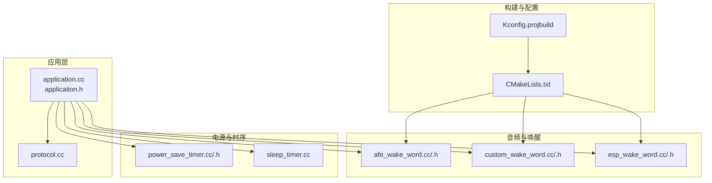
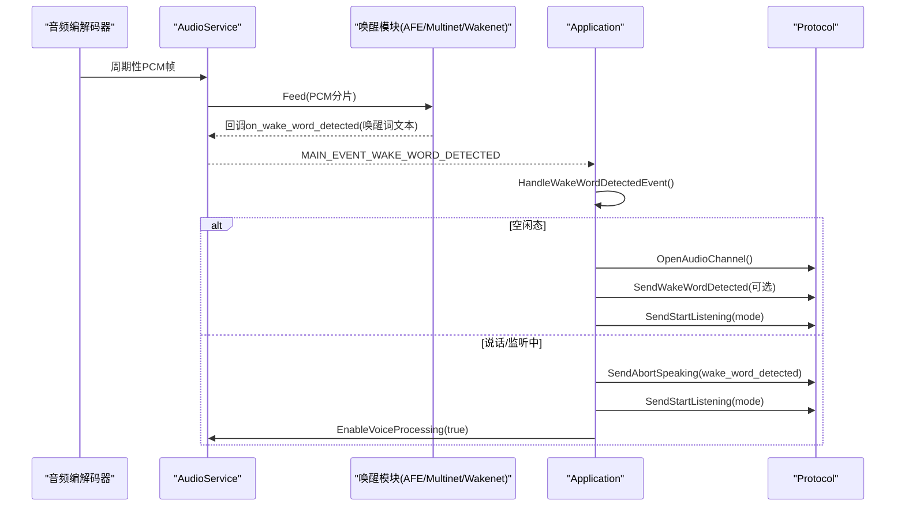
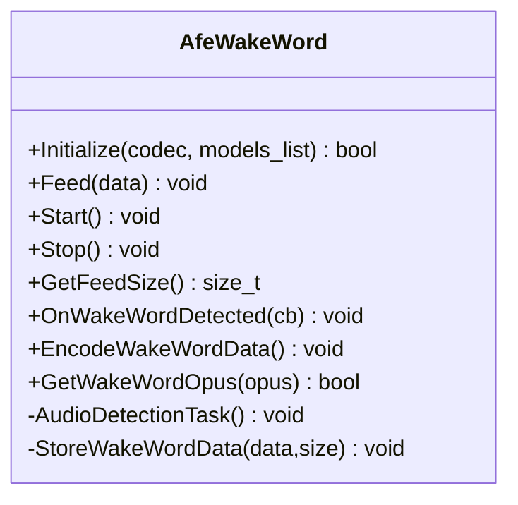
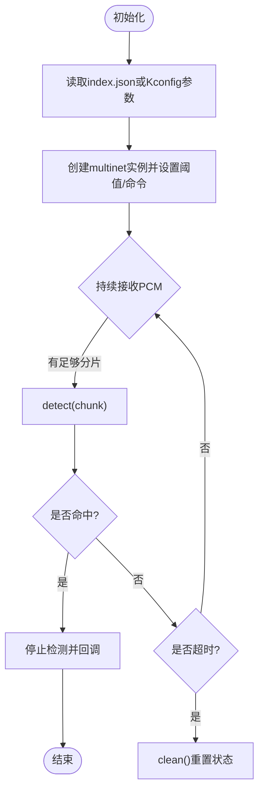
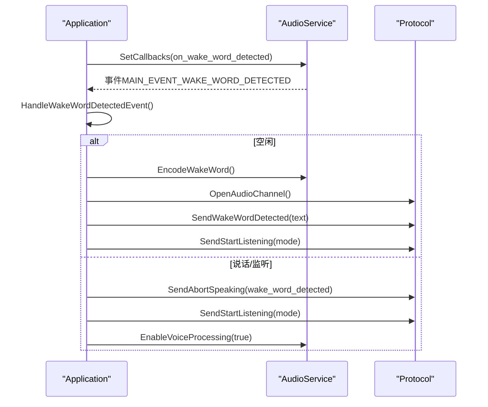
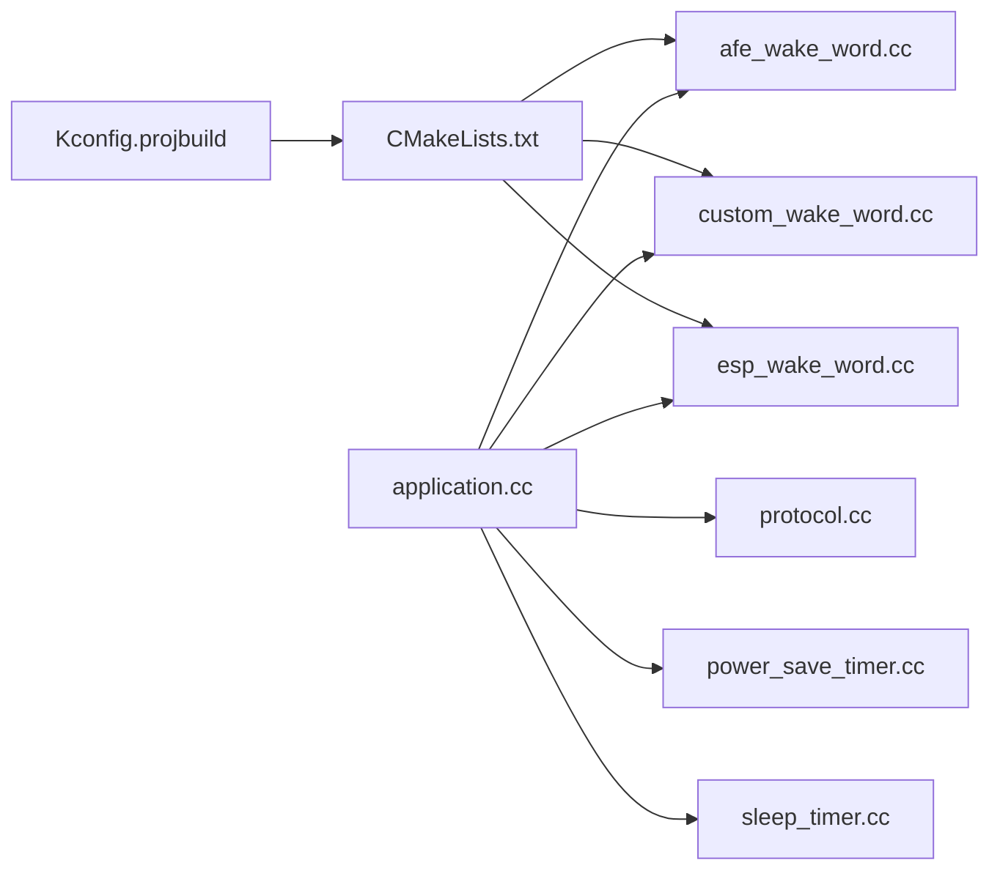

# 语音唤醒检测

<cite>
**本文引用的文件**   
- [README.md](file://README.md)
- [Kconfig.projbuild](file://main/Kconfig.projbuild)
- [CMakeLists.txt](file://main/CMakeLists.txt)
- [application.cc](file://main/application.cc)
- [application.h](file://main/application.h)
- [protocol.cc](file://main/protocols/protocol.cc)
- [afe_wake_word.h](file://main/audio/wake_words/afe_wake_word.h)
- [afe_wake_word.cc](file://main/audio/wake_words/afe_wake_word.cc)
- [custom_wake_word.h](file://main/audio/wake_words/custom_wake_word.h)
- [custom_wake_word.cc](file://main/audio/wake_words/custom_wake_word.cc)
- [esp_wake_word.h](file://main/audio/wake_words/esp_wake_word.h)
- [esp_wake_word.cc](file://main/audio/wake_words/esp_wake_word.cc)
- [power_save_timer.h](file://main/boards/common/power_save_timer.h)
- [power_save_timer.cc](file://main/boards/common/power_save_timer.cc)
- [sleep_timer.cc](file://main/boards/common/sleep_timer.cc)
</cite>

## 目录
1. [简介](#简介)
2. [项目结构](#项目结构)
3. [核心组件](#核心组件)
4. [架构总览](#架构总览)
5. [详细组件分析](#详细组件分析)
6. [依赖关系分析](#依赖关系分析)
7. [性能与功耗优化](#性能与功耗优化)
8. [故障排查指南](#故障排查指南)
9. [结论](#结论)
10. [附录](#附录)

## 简介
本技术文档围绕 ESP-SR 引擎在设备端的集成与配置，系统阐述 AFE（前端增强）唤醒、自定义唤醒词（Multinet）以及基础 Wakenet 的实现差异与选择策略；深入解析唤醒触发链路、误报控制、功耗管理策略，并提供模型对比与调试建议。文档面向希望将离线语音唤醒能力落地到 ESP32 系列设备的工程师与产品团队。

## 项目结构
本项目采用分层模块化组织：应用层（Application）、音频服务与唤醒模块（audio/wake_words）、协议层（protocols）、电源与时序管理（boards/common），并通过 Kconfig 与 CMake 进行编译期特性开关与源文件选择。

图表来源
- [application.cc:61-86](file://main/application.cc#L61-L86)
- [application.cc:781-845](file://main/application.cc#L781-L845)
- [protocol.cc:44-74](file://main/protocols/protocol.cc#L44-L74)
- [afe_wake_word.cc:38-90](file://main/audio/wake_words/afe_wake_word.cc#L38-L90)
- [custom_wake_word.cc:85-129](file://main/audio/wake_words/custom_wake_word.cc#L85-L129)
- [esp_wake_word.cc:17-45](file://main/audio/wake_words/esp_wake_word.cc#L17-L45)
- [power_save_timer.cc:62-132](file://main/boards/common/power_save_timer.cc#L62-L132)
- [sleep_timer.cc:66-84](file://main/boards/common/sleep_timer.cc#L66-L84)
- [Kconfig.projbuild:864-902](file://main/Kconfig.projbuild#L864-L902)
- [CMakeLists.txt:885-893](file://main/CMakeLists.txt#L885-L893)

章节来源
- [README.md:23-37](file://README.md#L23-L37)
- [Kconfig.projbuild:864-902](file://main/Kconfig.projbuild#L864-L902)
- [CMakeLists.txt:885-893](file://main/CMakeLists.txt#L885-L893)

## 核心组件
- 唤醒实现抽象与具体实现
  - WakeWord 接口：统一 Feed/Start/Stop/OnWakeWordDetected/GetFeedSize/EncodeWakeWordData/GetWakeWordOpus 等能力。
  - AfeWakeWord：基于 ESP-SR AFE 的 Wakenet 方案，支持 AEC（回声消除）与多通道输入，提供唤醒片段 PCM 缓存与 OPUS 编码任务。
  - CustomWakeWord：基于 Multinet 的自定义唤醒词识别，支持从 index.json 或 Kconfig 注入命令集与阈值，具备超时清理与结果回调。
  - EspWakeWord：轻量级 Wakenet 实现，适用于资源受限平台。
- 应用编排
  - Application：注册音频回调、处理唤醒事件、连接服务器、发送“开始监听”指令、在监听中按配置决定是否继续唤醒检测。
- 协议交互
  - Protocol：封装 listen/detect/start/stop/mcp 等消息，支持在检测到唤醒时上报并进入相应状态机流转。
- 电源与时序
  - PowerSaveTimer/SleepTimer：空闲降频/休眠、唤醒后恢复音频输入与唤醒检测，避免长时间占用 CPU。

章节来源
- [afe_wake_word.h:22-60](file://main/audio/wake_words/afe_wake_word.h#L22-L60)
- [custom_wake_word.h:20-69](file://main/audio/wake_words/custom_wake_word.h#L20-L69)
- [esp_wake_word.h:17-43](file://main/audio/wake_words/esp_wake_word.h#L17-L43)
- [application.cc:76-86](file://main/application.cc#L76-L86)
- [application.cc:781-845](file://main/application.cc#L781-L845)
- [protocol.cc:44-74](file://main/protocols/protocol.cc#L44-L74)
- [power_save_timer.h:8-34](file://main/boards/common/power_save_timer.h#L8-L34)
- [power_save_timer.cc:62-132](file://main/boards/common/power_save_timer.cc#L62-L132)
- [sleep_timer.cc:66-84](file://main/boards/common/sleep_timer.cc#L66-L84)

## 架构总览
下图展示从音频采集到唤醒检测、再到应用状态切换与协议交互的整体流程。

图表来源
- [application.cc:76-86](file://main/application.cc#L76-L86)
- [application.cc:781-845](file://main/application.cc#L781-L845)
- [protocol.cc:44-74](file://main/protocols/protocol.cc#L44-L74)

## 详细组件分析

### AFE 唤醒（Wakenet + AFE）
- 关键特性
  - 通过 AFE 初始化获取 feed/fetch chunksize，按块喂入音频数据。
  - 支持参考通道（AEC）开启，提升在有回音场景下的鲁棒性。
  - 内部维护约 2 秒的唤醒片段 PCM，并在独立线程中批量编码为 OPUS 包，供上层发送。
- 运行流程
  - Initialize：加载模型列表，解析 wake words，创建 AFE 实例，启动检测任务。
  - Feed：缓冲输入并按 AFE 要求的 chunksize 喂入。
  - AudioDetectionTask：fetch_with_delay 等待结果，记录唤醒片段，触发回调。
  - EncodeWakeWordData/GetWakeWordOpus：异步编码并队列化输出。
- 适用场景
  - 需要 AEC 与更强抗噪能力的 S3/P4 平台，且具备 PSRAM。

图表来源
- [afe_wake_word.h:22-60](file://main/audio/wake_words/afe_wake_word.h#L22-L60)
- [afe_wake_word.cc:38-90](file://main/audio/wake_words/afe_wake_word.cc#L38-L90)
- [afe_wake_word.cc:135-161](file://main/audio/wake_words/afe_wake_word.cc#L135-L161)
- [afe_wake_word.cc:172-263](file://main/audio/wake_words/afe_wake_word.cc#L172-L263)

章节来源
- [afe_wake_word.cc:38-90](file://main/audio/wake_words/afe_wake_word.cc#L38-L90)
- [afe_wake_word.cc:135-161](file://main/audio/wake_words/afe_wake_word.cc#L135-L161)
- [afe_wake_word.cc:172-263](file://main/audio/wake_words/afe_wake_word.cc#L172-L263)

### 自定义唤醒词（Multinet）
- 关键特性
  - 支持从 index.json 动态读取语言、时长、阈值与命令集；也支持 Kconfig 静态注入。
  - 设置检测阈值、命令更新、超时清理，避免长时占用状态。
  - 同样维护唤醒片段 PCM 并进行 OPUS 编码。
- 运行流程
  - Initialize：加载模型，过滤指定语言的 multinet，创建实例并设置阈值与命令。
  - Feed：按采样分片喂入，调用 detect，若命中则停止检测并回调。
  - EncodeWakeWordData/GetWakeWordOpus：与 AFE 类似，异步编码。
- 适用场景
  - 需要灵活定义唤醒词与行为（如不同动作）的产品形态。

图表来源
- [custom_wake_word.cc:37-82](file://main/audio/wake_words/custom_wake_word.cc#L37-L82)
- [custom_wake_word.cc:85-129](file://main/audio/wake_words/custom_wake_word.cc#L85-L129)
- [custom_wake_word.cc:146-200](file://main/audio/wake_words/custom_wake_word.cc#L146-L200)
- [custom_wake_word.cc:218-293](file://main/audio/wake_words/custom_wake_word.cc#L218-L293)

章节来源
- [custom_wake_word.cc:37-82](file://main/audio/wake_words/custom_wake_word.cc#L37-L82)
- [custom_wake_word.cc:85-129](file://main/audio/wake_words/custom_wake_word.cc#L85-L129)
- [custom_wake_word.cc:146-200](file://main/audio/wake_words/custom_wake_word.cc#L146-L200)
- [custom_wake_word.cc:218-293](file://main/audio/wake_words/custom_wake_word.cc#L218-L293)

### 基础 Wakenet（EspWakeWord）
- 关键特性
  - 直接加载 wakenet 模型，按固定 chunksize 检测，返回命中词名。
  - 无唤醒片段编码能力（占位实现）。
- 适用场景
  - 资源受限平台（如 C3/C5/C6 或带 PSRAM 的 ESP32），无需 AFE 与复杂功能。

章节来源
- [esp_wake_word.cc:17-45](file://main/audio/wake_words/esp_wake_word.cc#L17-L45)
- [esp_wake_word.cc:62-96](file://main/audio/wake_words/esp_wake_word.cc#L62-L96)

### 应用侧唤醒处理与协议交互
- 唤醒事件处理
  - 在空闲态：编码唤醒片段（可选）、打开音频通道、上报“检测到唤醒词”、发送“开始监听”。
  - 在说话/监听中：中断当前播放/监听，清空发送队列，重新进入监听模式，必要时再次启用唤醒检测。
- 监听中是否继续唤醒
  - 由 Kconfig 选项控制，可在监听期间保持唤醒以支持打断。

图表来源
- [application.cc:76-86](file://main/application.cc#L76-L86)
- [application.cc:781-845](file://main/application.cc#L781-L845)
- [protocol.cc:44-74](file://main/protocols/protocol.cc#L44-L74)

章节来源
- [application.cc:781-845](file://main/application.cc#L781-L845)
- [protocol.cc:44-74](file://main/protocols/protocol.cc#L44-L74)

## 依赖关系分析
- 编译期选择
  - Kconfig 提供 USE_AFE_WAKE_WORD、USE_CUSTOM_WAKE_WORD 等开关，决定使用哪类唤醒实现。
  - CMake 根据目标芯片与配置，自动添加对应唤醒源文件。
- 运行时耦合
  - Application 通过 AudioService 回调与唤醒模块解耦；唤醒模块仅负责检测与回调。
  - 电源管理模块在空闲时关闭音频输入与唤醒检测，降低功耗；唤醒后恢复。

图表来源
- [Kconfig.projbuild:864-902](file://main/Kconfig.projbuild#L864-L902)
- [CMakeLists.txt:885-893](file://main/CMakeLists.txt#L885-L893)
- [application.cc:781-845](file://main/application.cc#L781-L845)
- [power_save_timer.cc:62-132](file://main/boards/common/power_save_timer.cc#L62-L132)
- [sleep_timer.cc:66-84](file://main/boards/common/sleep_timer.cc#L66-L84)

章节来源
- [Kconfig.projbuild:864-902](file://main/Kconfig.projbuild#L864-L902)
- [CMakeLists.txt:885-893](file://main/CMakeLists.txt#L885-L893)

## 性能与功耗优化
- 模型与算法选择
  - AFE+Wakenet：适合高噪声/强回音环境，需 S3/P4+PSRAM。
  - Multinet：适合可定制唤醒词与行为，需 S3/P4+PSRAM。
  - 基础 Wakenet：适合低功耗/低成本平台。
- 参数调优
  - 自定义阈值：通过 Kconfig 调整灵敏度（越小越敏感，误报风险上升）。
  - 监听中唤醒：可通过配置在监听期间保持唤醒，便于打断但增加功耗。
  - AEC 开关：结合硬件参考通道开启，改善回音干扰。
- 功耗策略
  - 空闲降频与休眠：PowerSaveTimer/SleepTimer 在空闲时降低 CPU 频率、关闭音频输入与唤醒检测；唤醒后恢复。
  - 连接前性能模式：检测到唤醒后切换到高性能模式以降低网络握手延迟。
- 内存与任务栈
  - 唤醒片段编码任务使用 SPIRAM 分配栈，避免内部 RAM 压力。

章节来源
- [Kconfig.projbuild:892-916](file://main/Kconfig.projbuild#L892-L916)
- [application.cc:826-845](file://main/application.cc#L826-L845)
- [power_save_timer.cc:62-132](file://main/boards/common/power_save_timer.cc#L62-L132)
- [sleep_timer.cc:66-84](file://main/boards/common/sleep_timer.cc#L66-L84)

## 故障排查指南
- 无法检测到唤醒词
  - 检查是否选择了正确的唤醒实现（Kconfig/CMake）。
  - 确认模型已正确加载（日志打印模型名称与数量）。
  - 对于 Multinet，检查 index.json 或 Kconfig 中的命令与阈值配置。
- 误报率高
  - 提高 Multinet 阈值或减少命令集合。
  - 开启 AEC（若硬件支持）并使用 AFE 方案。
- 漏报/灵敏度不足
  - 适当降低阈值（注意误报权衡）。
  - 确保麦克风采集质量与距离合适。
- 监听中无法打断
  - 启用“监听中唤醒检测”配置项。
- 功耗异常
  - 检查空闲时是否进入省电模式（关闭音频输入与唤醒检测）。
  - 确认唤醒后是否恢复到高性能模式。

章节来源
- [custom_wake_word.cc:37-82](file://main/audio/wake_words/custom_wake_word.cc#L37-L82)
- [custom_wake_word.cc:85-129](file://main/audio/wake_words/custom_wake_word.cc#L85-L129)
- [afe_wake_word.cc:38-90](file://main/audio/wake_words/afe_wake_word.cc#L38-L90)
- [Kconfig.projbuild:892-916](file://main/Kconfig.projbuild#L892-L916)
- [power_save_timer.cc:62-132](file://main/boards/common/power_save_timer.cc#L62-L132)

## 结论
本项目提供了三种唤醒路径以满足不同平台与产品需求：AFE+Wakenet 强调抗噪与回音抑制，Multinet 强调可定制性与灵活性，基础 Wakenet 强调低资源消耗。通过 Kconfig 与 CMake 的组合，开发者可按需裁剪与部署。配合电源与时序管理，可实现良好的唤醒体验与功耗平衡。

## 附录
- 快速上手
  - 选择目标芯片与唤醒方案（Kconfig）。
  - 准备模型与资源（内置或 assets/index.json）。
  - 编译烧录并观察日志，验证唤醒回调与协议交互。
- 相关说明
  - 项目 README 概述了离线语音唤醒与多端通信能力。

章节来源
- [README.md:23-37](file://README.md#L23-L37)