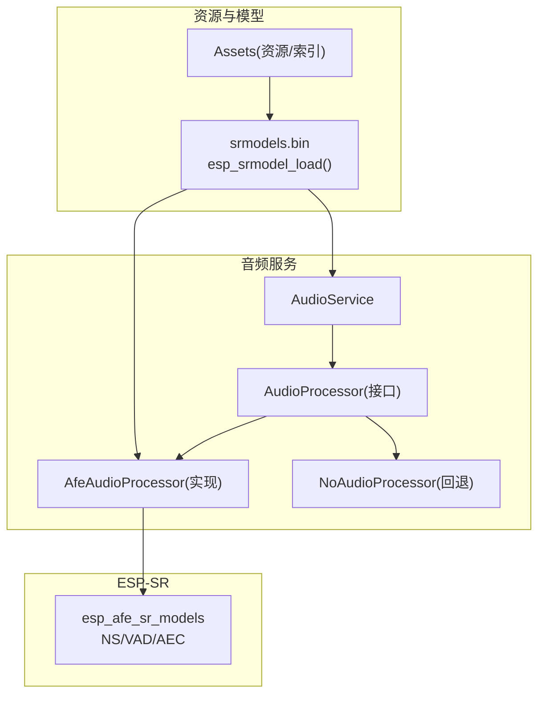
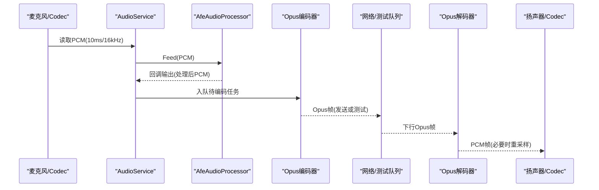
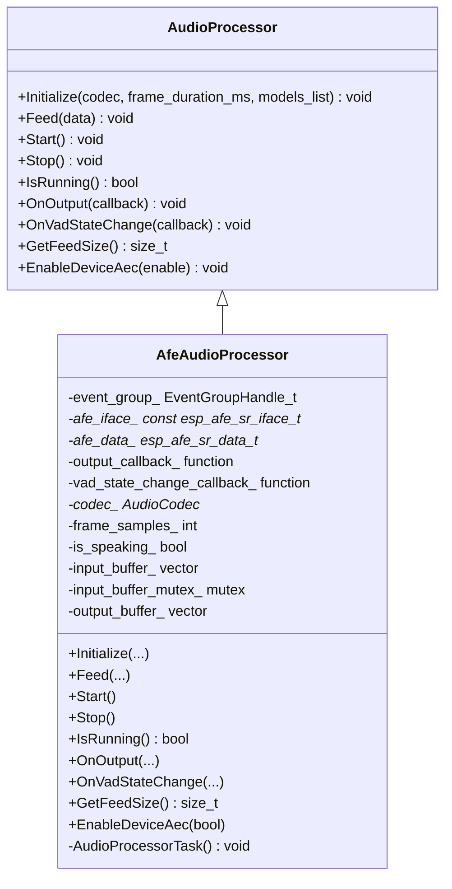
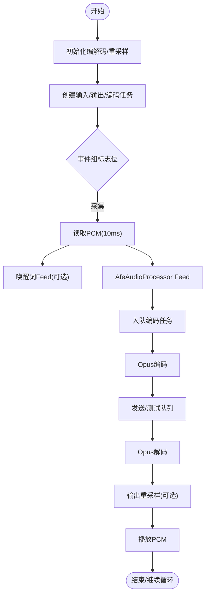
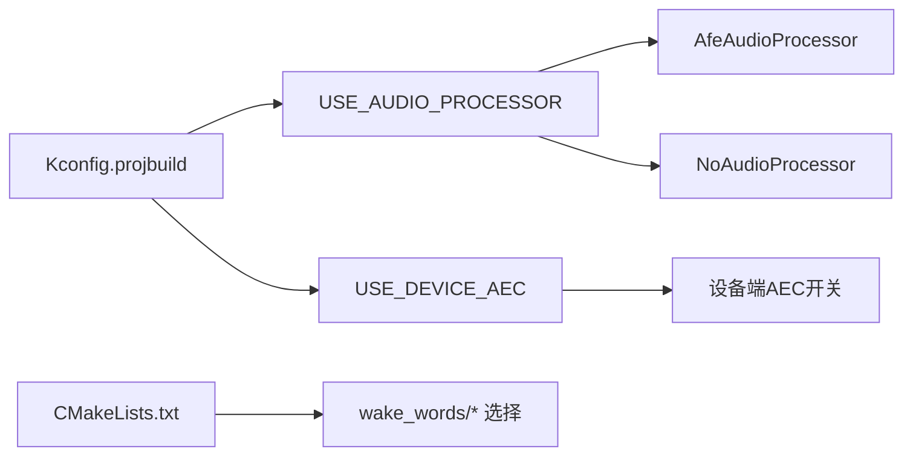

# AFE音频处理器

<cite>
**本文引用的文件**
- [afe_audio_processor.h](file://main/audio/processors/afe_audio_processor.h)
- [afe_audio_processor.cc](file://main/audio/processors/afe_audio_processor.cc)
- [audio_processor.h](file://main/audio/audio_processor.h)
- [audio_service.h](file://main/audio/audio_service.h)
- [audio_service.cc](file://main/audio/audio_service.cc)
- [assets.h](file://main/assets.h)
- [assets.cc](file://main/assets.cc)
- [Kconfig.projbuild](file://main/Kconfig.projbuild)
- [CMakeLists.txt](file://main/CMakeLists.txt)
</cite>

## 目录
1. [简介](#简介)
2. [项目结构](#项目结构)
3. [核心组件](#核心组件)
4. [架构总览](#架构总览)
5. [详细组件分析](#详细组件分析)
6. [依赖关系分析](#依赖关系分析)
7. [性能与优化](#性能与优化)
8. [故障排查指南](#故障排查指南)
9. [结论](#结论)
10. [附录](#附录)

## 简介
本技术文档围绕基于 ESP-SR 的硬件加速语音前端（AFE）实现，系统性阐述回声消除（AEC）、自动增益控制（AGC）、噪声抑制（NS）等算法在工程中的集成方式，重点解析 AfeAudioProcessor 类的初始化流程、配置参数与模型加载机制。文档同时覆盖事件组管理、任务调度策略、音频处理链路搭建示例与调试方法，并给出不同芯片平台的适配注意事项与内存/实时性保障建议。

## 项目结构
本项目将 AFE 音频处理封装为可插拔的 AudioProcessor 抽象层，默认启用 AfeAudioProcessor 以调用 esp_afe_sr_models 提供的 NS/VAD/AEC 等能力；当未启用时回退到 NoAudioProcessor 直通路径。资源侧通过 assets 模块从分区或网络加载 srmodels.bin，并在应用启动后注入到 AudioService，供 AfeAudioProcessor 与唤醒词模块使用。

图表来源
- [audio_service.h:105-195](file://main/audio/audio_service.h#L105-L195)
- [audio_service.cc:95-123](file://main/audio/audio_service.cc#L95-L123)
- [assets.cc:71-119](file://main/assets.cc#L71-L119)
- [afe_audio_processor.h:17-46](file://main/audio/processors/afe_audio_processor.h#L17-L46)

章节来源
- [audio_service.h:105-195](file://main/audio/audio_service.h#L105-L195)
- [audio_service.cc:95-123](file://main/audio/audio_service.cc#L95-L123)
- [assets.cc:71-119](file://main/assets.cc#L71-L119)
- [afe_audio_processor.h:17-46](file://main/audio/processors/afe_audio_processor.h#L17-L46)

## 核心组件
- AudioProcessor 接口：定义统一的音频处理生命周期与回调接口，屏蔽底层差异。
- AfeAudioProcessor：基于 ESP-SR 的 AFE 实现，提供 NS/VAD/AEC 等能力，内部维护输入/输出缓冲与独立处理任务。
- AudioService：编排音频采集、编码、解码、播放与处理链路的任务调度中心，负责事件组与队列协调。
- Assets：资源与模型加载器，支持从内置分区或网络下载并应用资源包，包含 srmodels.bin 的加载与分发。

章节来源
- [audio_processor.h:11-24](file://main/audio/audio_processor.h#L11-L24)
- [afe_audio_processor.h:17-46](file://main/audio/processors/afe_audio_processor.h#L17-L46)
- [audio_service.h:105-195](file://main/audio/audio_service.h#L105-L195)
- [assets.h:23-89](file://main/assets.h#L23-L89)

## 架构总览
整体数据流遵循“采集 -> 预处理(AFE) -> 编码(Opus) -> 发送/本地测试”和“接收 -> 解码(Opus) -> 重采样 -> 播放”的双向链路。AfeAudioProcessor 作为可选增强节点，运行于独立任务中，通过事件组与主音频任务协同。

图表来源
- [audio_service.cc:230-288](file://main/audio/audio_service.cc#L230-L288)
- [audio_service.cc:327-446](file://main/audio/audio_service.cc#L327-L446)
- [afe_audio_processor.cc:135-187](file://main/audio/processors/afe_audio_processor.cc#L135-L187)

## 详细组件分析

### AfeAudioProcessor 类分析
AfeAudioProcessor 实现了 AudioProcessor 接口，内部持有 ESP-SR AFE 句柄与数据指针，采用事件组驱动的任务循环进行 fetch_with_delay 阻塞式取帧，并通过回调将完整帧按 frame_samples_ 对齐输出。

图表来源
- [audio_processor.h:11-24](file://main/audio/audio_processor.h#L11-L24)
- [afe_audio_processor.h:17-46](file://main/audio/processors/afe_audio_processor.h#L17-L46)

#### 初始化流程与配置要点
- 计算每帧样本数：根据 frame_duration_ms 与 16kHz 采样率推导。
- 构建输入通道格式字符串：依据 codec_->input_channels() 与参考通道数量生成 'M'/'R' 序列。
- 模型选择：若外部传入 models_list 则直接使用，否则通过 esp_srmodel_init("model") 加载。
- AFE 配置：
  - 模式：AFE_TYPE_VC，高性能模式。
  - AEC：根据 CONFIG_USE_DEVICE_AEC 决定设备端 AEC 是否启用。
  - VAD：默认启用，可设置最小噪声时长。
  - NS：若存在 NS 模型则启用网络模式降噪。
  - AGC：当前关闭。
  - 内存分配：优先 PSRAM。
- 创建 AFE 句柄与数据对象，并启动独立处理任务。

章节来源
- [afe_audio_processor.cc:13-75](file://main/audio/processors/afe_audio_processor.cc#L13-L75)
- [Kconfig.projbuild:917-928](file://main/Kconfig.projbuild#L917-L928)

#### 数据处理与输出对齐
- Feed：将上层输入的 PCM 追加至输入缓冲，按 afe_iface_->get_feed_chunksize() 对齐喂入 AFE。
- 任务循环：阻塞等待事件组标志位，fetch_with_delay 获取处理结果，更新 VAD 状态并回调；累积输出缓冲，按 frame_samples_ 切分整帧回调给上层。
- 停止：清除运行标志并重置 AFE 缓冲区，清空输入缓冲。

章节来源
- [afe_audio_processor.cc:84-125](file://main/audio/processors/afe_audio_processor.cc#L84-L125)
- [afe_audio_processor.cc:135-187](file://main/audio/processors/afe_audio_processor.cc#L135-L187)

#### 设备端 AEC 动态切换
- EnableDeviceAec：在支持的设备端 AEC 平台下，可动态禁用 VAD 并启用 AEC；否则记录错误日志。

章节来源
- [afe_audio_processor.cc:189-201](file://main/audio/processors/afe_audio_processor.cc#L189-L201)

### AudioService 任务与链路编排
AudioService 负责：
- 初始化编解码器与重采样器。
- 创建输入/输出/编码任务，并通过事件组控制各阶段运行状态。
- 将 AfeAudioProcessor 的输出接入编码队列，将 VAD 变化回调向上层暴露。
- 管理 Opus 编码/解码、播放队列与时间戳队列（用于服务器端 AEC）。

图表来源
- [audio_service.cc:125-167](file://main/audio/audio_service.cc#L125-L167)
- [audio_service.cc:230-288](file://main/audio/audio_service.cc#L230-L288)
- [audio_service.cc:327-446](file://main/audio/audio_service.cc#L327-L446)

章节来源
- [audio_service.h:105-195](file://main/audio/audio_service.h#L105-L195)
- [audio_service.cc:125-167](file://main/audio/audio_service.cc#L125-L167)
- [audio_service.cc:230-288](file://main/audio/audio_service.cc#L230-L288)
- [audio_service.cc:327-446](file://main/audio/audio_service.cc#L327-L446)

### 模型加载与分发（esp_afe_sr_models）
- 资源加载：Assets 从 assets 分区或网络下载 index.json 与 srmodels.bin，调用 srmodel_load 生成 srmodel_list_t。
- 分发：通过 Application::GetInstance().GetAudioService().SetModelsList(models_list) 将模型列表注入到 AudioService。
- 使用：AfeAudioProcessor 与唤醒词模块在 Initialize 时接收该模型列表，并按需筛选 NS/VAD/WakeNet 等子模型。

章节来源
- [assets.cc:71-119](file://main/assets.cc#L71-L119)
- [audio_service.cc:700-726](file://main/audio/audio_service.cc#L700-L726)
- [afe_audio_processor.cc:30-35](file://main/audio/processors/afe_audio_processor.cc#L30-L35)

## 依赖关系分析
- 编译期开关：
  - USE_AUDIO_PROCESSOR：仅在 ESP32S3/ESP32P4 且启用 SPIRAM 时可用。
  - USE_DEVICE_AEC：受限于特定板型，决定是否启用设备端 AEC。
- 源文件选择：
  - CMakeLists 根据目标芯片选择唤醒词实现（AfeWakeWord/CustomWakeWord 或 EspWakeWord）。
- 运行时依赖：
  - AfeAudioProcessor 依赖 esp_afe_sr_models 接口与模型列表。
  - AudioService 依赖 Opus 编解码与重采样库。

图表来源
- [Kconfig.projbuild:917-928](file://main/Kconfig.projbuild#L917-L928)
- [CMakeLists.txt:885-893](file://main/CMakeLists.txt#L885-L893)

章节来源
- [Kconfig.projbuild:917-928](file://main/Kconfig.projbuild#L917-L928)
- [CMakeLists.txt:885-893](file://main/CMakeLists.txt#L885-L893)

## 性能与优化
- 内存分配：
  - AFE 配置优先 PSRAM，降低 SRAM 压力，适合复杂 NS/VAD/AEC 模型。
  - 唤醒词编码任务栈与静态任务块也分配在 PSRAM，避免堆碎片。
- 任务优先级与核心绑定：
  - 输入任务高优先级并固定核心，确保低延迟采集。
  - 编码任务较大栈空间，保证 Opus 编码稳定。
- 缓冲与对齐：
  - Feed 与 Fetch 严格对齐 AFE 的 chunksize，避免越界与丢帧。
  - 输出缓冲按 frame_samples_ 切分整帧，减少上层处理抖动。
- 实时性保障：
  - 事件组驱动的任务间同步，避免忙轮询。
  - 输入/输出任务对 Codec 的启停做幂等保护，结合定时器空闲检测降低功耗。
- 平台差异：
  - ESP32S3/ESP32P4 支持 AFE 唤醒词与更丰富的模型集；其他平台回退到轻量方案。
  - 设备端 AEC 仅部分板型支持，需在 Kconfig 中显式开启。

章节来源
- [afe_audio_processor.cc:40-58](file://main/audio/processors/afe_audio_processor.cc#L40-L58)
- [audio_service.cc:131-167](file://main/audio/audio_service.cc#L131-L167)
- [audio_service.cc:682-698](file://main/audio/audio_service.cc#L682-L698)
- [Kconfig.projbuild:917-928](file://main/Kconfig.projbuild#L917-L928)

## 故障排查指南
- 模型加载失败：
  - 检查 assets 分区是否存在 index.json 与 srmodels.bin，确认校验与大小匹配。
  - 查看日志中关于 srmodels.bin 加载失败的提示。
- AFE 初始化异常：
  - 确认输入通道格式字符串与参考通道配置一致。
  - 检查 NS/VAD/AEC 模型名称过滤结果是否为空。
- 任务无输出：
  - 核对事件组标志位是否正确设置/清除。
  - 检查 feed/fetch 的 chunksize 与输入数据长度是否对齐。
- 设备端 AEC 不可用：
  - 确认 Kconfig 已启用 USE_DEVICE_AEC 且目标板型在允许列表中。
- 功耗与卡顿：
  - 观察音频电源定时器是否因长时间无 I/O 关闭了 Codec 输入/输出。
  - 调整 OPUS 帧长与队列上限，平衡延迟与稳定性。

章节来源
- [assets.cc:71-119](file://main/assets.cc#L71-L119)
- [afe_audio_processor.cc:13-75](file://main/audio/processors/afe_audio_processor.cc#L13-L75)
- [audio_service.cc:682-698](file://main/audio/audio_service.cc#L682-L698)

## 结论
AfeAudioProcessor 在 AudioService 的统一编排下，借助 ESP-SR 的硬件加速能力实现了 NS/VAD/AEC 等关键前处理功能。通过资源模块集中加载模型、事件组与多任务协作、以及严格的缓冲对齐策略，系统在多种芯片平台上保持了良好的实时性与稳定性。合理配置 Kconfig 与模型集，可在不同场景下取得最佳效果。

## 附录

### 事件组与任务调度速查
- 主要事件位：
  - 音频测试运行、唤醒词运行、音频处理器运行、播放队列非空等。
- 任务划分：
  - 输入任务：采集与喂入唤醒词/处理器。
  - 输出任务：播放 PCM。
  - 编码任务：Opus 编解码与队列管理。

章节来源
- [audio_service.h:50-63](file://main/audio/audio_service.h#L50-L63)
- [audio_service.cc:125-167](file://main/audio/audio_service.cc#L125-L167)

### 音频处理链路搭建示例（步骤）
- 准备资源：
  - 在 assets 分区中包含 index.json 与 srmodels.bin，或通过 OTA 下载。
- 应用启动：
  - 调用 Assets::Apply 加载资源，触发 LoadSrmodelsFromIndex，并将模型列表注入 AudioService。
- 启用语音处理：
  - 调用 AudioService::EnableVoiceProcessing(true)，内部会初始化 AfeAudioProcessor 并启动相关任务。
- 回调注册：
  - 通过 OnOutput 与 OnVadStateChange 获取处理后 PCM 与说话状态。
- 设备端 AEC：
  - 在支持的板型上调用 AudioService::EnableDeviceAec(true) 动态切换。

章节来源
- [assets.cc:214-236](file://main/assets.cc#L214-L236)
- [audio_service.cc:579-604](file://main/audio/audio_service.cc#L579-L604)
- [audio_service.cc:619-627](file://main/audio/audio_service.cc#L619-L627)