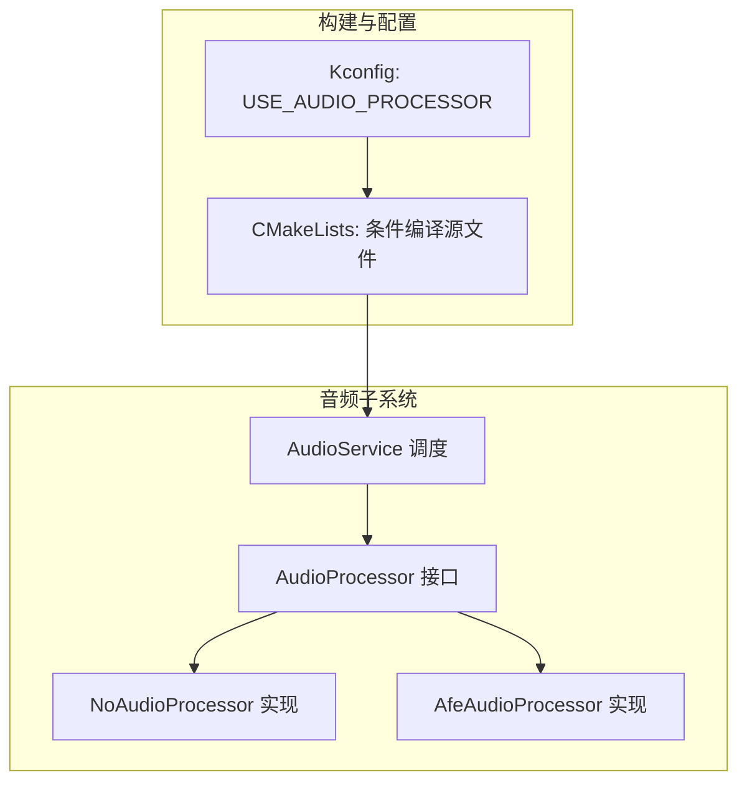
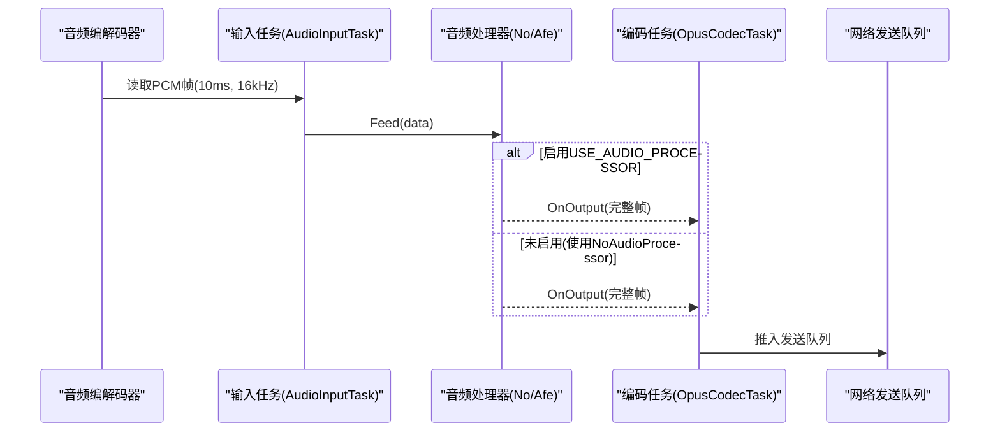
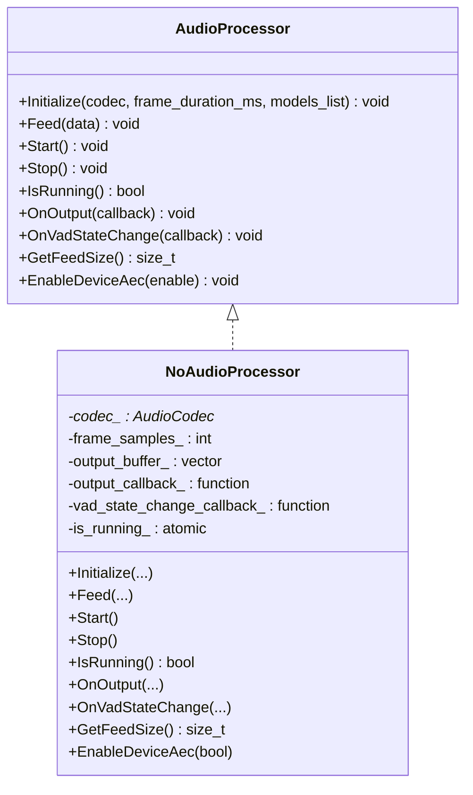
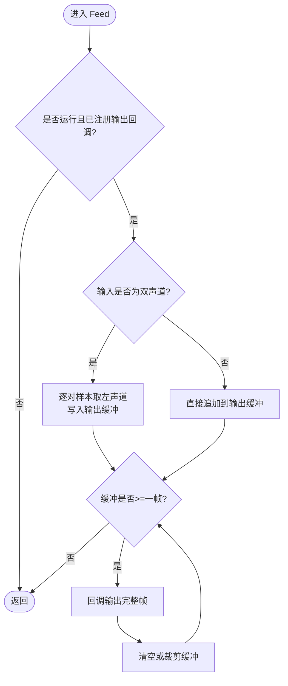
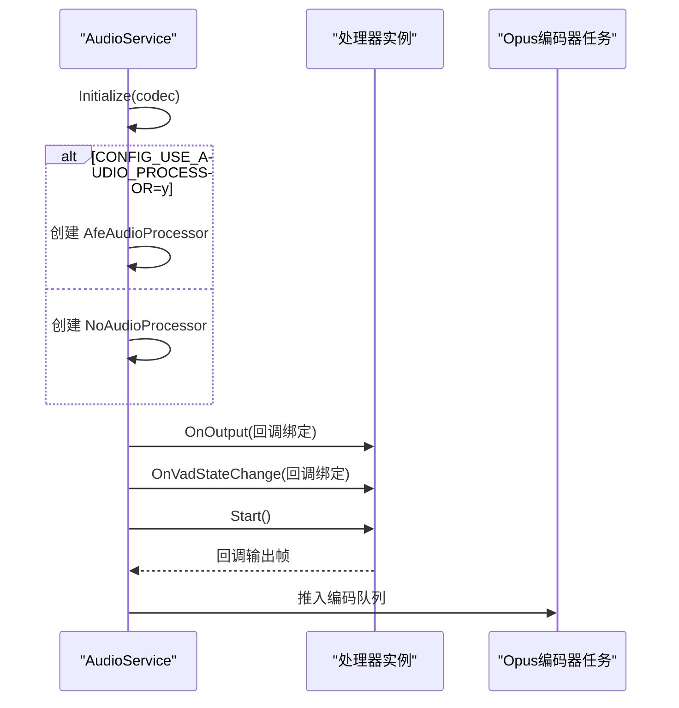
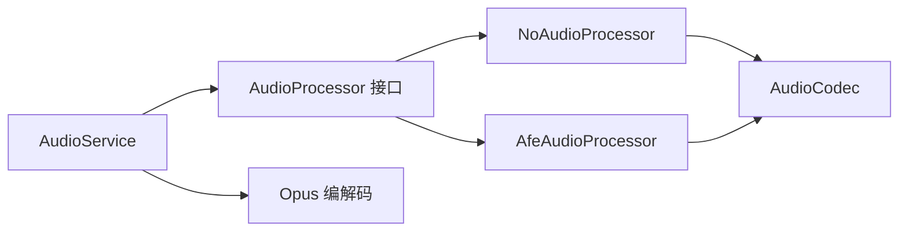

# 空音频处理器

<cite>
**本文引用的文件列表**
- [no_audio_processor.h](file://main/audio/processors/no_audio_processor.h)
- [no_audio_processor.cc](file://main/audio/processors/no_audio_processor.cc)
- [audio_processor.h](file://main/audio/audio_processor.h)
- [audio_service.cc](file://main/audio/audio_service.cc)
- [CMakeLists.txt](file://main/CMakeLists.txt)
- [Kconfig.projbuild](file://main/Kconfig.projbuild)
</cite>

## 目录
1. [简介](#简介)
2. [项目结构](#项目结构)
3. [核心组件](#核心组件)
4. [架构总览](#架构总览)
5. [详细组件分析](#详细组件分析)
6. [依赖分析](#依赖分析)
7. [性能考量](#性能考量)
8. [故障排查指南](#故障排查指南)
9. [结论](#结论)
10. [附录](#附录)

## 简介
本技术文档聚焦于“空音频处理器”NoAudioProcessor，解释其作为占位符实现的设计目的与使用场景。该处理器在硬件平台不支持高级音频处理（如降噪、回声消除、VAD）时提供基础功能：将麦克风输入按帧透传至上层编码链路，同时保持接口一致性与系统可运行性。文档涵盖其在不同平台的适配作用、轻量级特性（最小内存与CPU开销）、选择策略、开发阶段与部署环境的使用指南，并给出基于源码的对比分析与基准建议。

## 项目结构
NoAudioProcessor位于音频处理子系统，遵循统一的AudioProcessor抽象接口；AudioService根据编译配置动态选择具体实现。

图表来源
- [audio_processor.h:11-24](file://main/audio/audio_processor.h#L11-L24)
- [no_audio_processor.h:11-33](file://main/audio/processors/no_audio_processor.h#L11-L33)
- [audio_service.cc:95-99](file://main/audio/audio_service.cc#L95-L99)
- [CMakeLists.txt:882-887](file://main/CMakeLists.txt#L882-L887)
- [Kconfig.projbuild:917-922](file://main/Kconfig.projbuild#L917-L922)

章节来源
- [audio_processor.h:11-24](file://main/audio/audio_processor.h#L11-L24)
- [no_audio_processor.h:11-33](file://main/audio/processors/no_audio_processor.h#L11-L33)
- [audio_service.cc:95-99](file://main/audio/audio_service.cc#L95-L99)
- [CMakeLists.txt:882-887](file://main/CMakeLists.txt#L882-L887)
- [Kconfig.projbuild:917-922](file://main/Kconfig.projbuild#L917-L922)

## 核心组件
- AudioProcessor 接口：定义初始化、数据馈送、启停、回调注册、帧大小查询、设备AEC开关等统一方法。
- NoAudioProcessor：轻量占位实现，不做复杂算法处理，仅做必要的通道转换与分帧输出。
- AudioService：运行时根据配置创建具体处理器实例，并将输入任务与编码器任务串联。

章节来源
- [audio_processor.h:11-24](file://main/audio/audio_processor.h#L11-L24)
- [no_audio_processor.h:11-33](file://main/audio/processors/no_audio_processor.h#L11-L33)
- [audio_service.cc:95-99](file://main/audio/audio_service.cc#L95-L99)

## 架构总览
下图展示从输入采集到编码发送的关键路径，以及NoAudioProcessor在其中的位置。

图表来源
- [audio_service.cc:230-288](file://main/audio/audio_service.cc#L230-L288)
- [audio_service.cc:327-446](file://main/audio/audio_service.cc#L327-L446)
- [no_audio_processor.cc:12-37](file://main/audio/processors/no_audio_processor.cc#L12-L37)

## 详细组件分析

### NoAudioProcessor 类设计
NoAudioProcessor实现AudioProcessor接口，提供最小化处理的音频通路。关键要点：
- 初始化：记录codec指针、计算每帧采样数、预分配输出缓冲。
- Feed：若为双声道则转换为单声道，累积到输出缓冲，达到一帧长度即回调输出。
- Start/Stop：控制运行状态与清理缓冲。
- IsRunning：返回运行标志。
- OnOutput/OnVadStateChange：注册回调，无实际VAD逻辑。
- GetFeedSize：返回期望的输入帧大小（由初始化时的frame_duration_ms推导）。
- EnableDeviceAec：不支持时打印日志提示。

图表来源
- [audio_processor.h:11-24](file://main/audio/audio_processor.h#L11-L24)
- [no_audio_processor.h:11-33](file://main/audio/processors/no_audio_processor.h#L11-L33)

章节来源
- [no_audio_processor.h:11-33](file://main/audio/processors/no_audio_processor.h#L11-L33)
- [no_audio_processor.cc:6-72](file://main/audio/processors/no_audio_processor.cc#L6-L72)

### 数据处理流程（Feed 分帧与通道转换）
NoAudioProcessor在Feed中完成两件事：
- 双声道转单声道：取左声道样本，降低后续处理带宽。
- 分帧输出：当累积样本达到一帧长度时，触发回调输出完整帧。

图表来源
- [no_audio_processor.cc:12-37](file://main/audio/processors/no_audio_processor.cc#L12-L37)

章节来源
- [no_audio_processor.cc:12-37](file://main/audio/processors/no_audio_processor.cc#L12-L37)

### 与 AudioService 的集成
AudioService在初始化时根据配置决定使用哪种处理器：
- 若启用USE_AUDIO_PROCESSOR：创建AfeAudioProcessor。
- 否则：创建NoAudioProcessor。
随后将处理器的输出回调接入编码任务，形成“输入→处理→编码→发送”的流水线。

图表来源
- [audio_service.cc:95-110](file://main/audio/audio_service.cc#L95-L110)
- [audio_service.cc:125-167](file://main/audio/audio_service.cc#L125-L167)

章节来源
- [audio_service.cc:95-110](file://main/audio/audio_service.cc#L95-L110)
- [audio_service.cc:125-167](file://main/audio/audio_service.cc#L125-L167)

### 构建与配置选择
- Kconfig选项USE_AUDIO_PROCESSOR：默认开启，但依赖ESP32S3/P4与SPIRAM。
- CMakeLists根据该选项决定是否包含AfeAudioProcessor或NoAudioProcessor源文件。
- 当目标芯片不满足依赖或用户关闭该选项时，自动回退到NoAudioProcessor。

章节来源
- [Kconfig.projbuild:917-922](file://main/Kconfig.projbuild#L917-L922)
- [CMakeLists.txt:882-887](file://main/CMakeLists.txt#L882-L887)

## 依赖分析
- 内部依赖
  - NoAudioProcessor依赖AudioProcessor接口与AudioCodec能力（采样率、声道数）。
  - AudioService负责生命周期管理与任务编排。
- 外部依赖
  - ESP-IDF定时器与事件组用于任务调度与电源管理。
  - Opus编解码库用于压缩与播放。
- 耦合与内聚
  - NoAudioProcessor与上层解耦良好，仅通过回调传递数据，内聚度高。
  - AudioService集中了资源管理，便于在不同处理器间切换。

图表来源
- [audio_service.cc:95-110](file://main/audio/audio_service.cc#L95-L110)
- [no_audio_processor.h:11-33](file://main/audio/processors/no_audio_processor.h#L11-L33)
- [audio_processor.h:11-24](file://main/audio/audio_processor.h#L11-L24)

章节来源
- [audio_service.cc:95-110](file://main/audio/audio_service.cc#L95-L110)
- [no_audio_processor.h:11-33](file://main/audio/processors/no_audio_processor.h#L11-L33)
- [audio_processor.h:11-24](file://main/audio/audio_processor.h#L11-L24)

## 性能考量
本节基于源码行为进行定性分析，并提供可复现的基准建议。

- 内存占用
  - NoAudioProcessor仅维护一个固定大小的输出缓冲（按帧大小预留），无额外模型或大型缓冲区，内存足迹极小。
  - 相较之下，AfeAudioProcessor通常引入更复杂的内部缓冲与可能的DSP上下文，内存占用更高。
- CPU消耗
  - NoAudioProcessor主要执行简单的通道转换与拷贝，运算量极低。
  - AfeAudioProcessor涉及降噪、回声消除、VAD等算法，CPU占用显著增加。
- 实时性与延迟
  - NoAudioProcessor路径短、无阻塞算法，端到端延迟更低。
  - AfeAudioProcessor可能因算法窗口与线程调度带来额外延迟。
- 功耗
  - 低CPU与少内存访问意味着更低的功耗，适合低功耗设备或电池供电场景。

基准测试建议（可在设备上复现）
- 指标
  - 平均CPU占用率（空闲负载与通话负载）
  - 内存峰值与常驻占用（堆/栈）
  - 端到端延迟（从输入到编码完成）
  - 丢包/卡顿统计（编码队列溢出次数）
- 方法
  - 在同一硬件与固件版本下，分别以USE_AUDIO_PROCESSOR=y与=n构建，采集上述指标。
  - 使用ESP-IDF Profiler或FreeRTOS任务统计获取CPU占用。
  - 使用heap_caps_get_free_size与portGET_HEAP_SIZE估算内存变化。
  - 在输入任务与编码任务处打点测量延迟。
- 预期结果
  - NoAudioProcessor在CPU与内存上明显低于AfeAudioProcessor，延迟更低，但在嘈杂环境语音质量较差。

章节来源
- [no_audio_processor.cc:6-72](file://main/audio/processors/no_audio_processor.cc#L6-L72)
- [audio_service.cc:230-288](file://main/audio/audio_service.cc#L230-L288)
- [audio_service.cc:327-446](file://main/audio/audio_service.cc#L327-L446)

## 故障排查指南
- 现象：启用设备侧AEC无效
  - 原因：NoAudioProcessor不支持设备侧AEC，调用时会记录错误日志。
  - 解决：切换到AfeAudioProcessor并确保硬件支持（ESP32S3/P4+SPIRAM）。
- 现象：无声或只有单声道
  - 检查：确认输入声道数与转换逻辑；NoAudioProcessor会将双声道转为单声道（取左声道）。
- 现象：卡顿或队列溢出
  - 检查：编码任务是否能及时消费；适当调整队列上限或降低帧率。
- 现象：无法编译或链接失败
  - 检查：Kconfig选项与CMakeLists是否正确包含对应源文件；目标芯片是否满足依赖。

章节来源
- [no_audio_processor.cc:67-71](file://main/audio/processors/no_audio_processor.cc#L67-L71)
- [no_audio_processor.cc:17-24](file://main/audio/processors/no_audio_processor.cc#L17-L24)
- [audio_service.cc:327-446](file://main/audio/audio_service.cc#L327-L446)
- [CMakeLists.txt:882-887](file://main/CMakeLists.txt#L882-L887)
- [Kconfig.projbuild:917-922](file://main/Kconfig.projbuild#L917-L922)

## 结论
NoAudioProcessor作为轻量占位实现，在不支持或不启用高级音频处理的平台上提供了稳定、低资源消耗的音频通路。它确保系统具备一致的接口与基本功能，适用于以下场景：
- 低端或受限硬件平台（无PSRAM或不满足依赖）
- 仅需透传音频、无需降噪/VAD的应用
- 开发与调试阶段快速验证链路
- 低功耗与低延迟优先的部署环境

当需要更好的语音质量与抗噪能力时，应启用USE_AUDIO_PROCESSOR并使用AfeAudioProcessor。

## 附录

### 何时选择空处理器 vs 完整处理器
- 选择NoAudioProcessor的条件
  - 目标芯片不满足依赖（非ESP32S3/P4或缺少SPIRAM）
  - 应用对语音质量要求不高，侧重低资源与低延迟
  - 快速原型验证或回归测试
- 选择AfeAudioProcessor的条件
  - 需要降噪、回声消除、VAD等增强功能
  - 设备具备足够算力与内存
  - 对语音质量有较高要求

章节来源
- [Kconfig.projbuild:917-922](file://main/Kconfig.projbuild#L917-L922)
- [CMakeLists.txt:882-887](file://main/CMakeLists.txt#L882-L887)
- [audio_service.cc:95-110](file://main/audio/audio_service.cc#L95-L110)