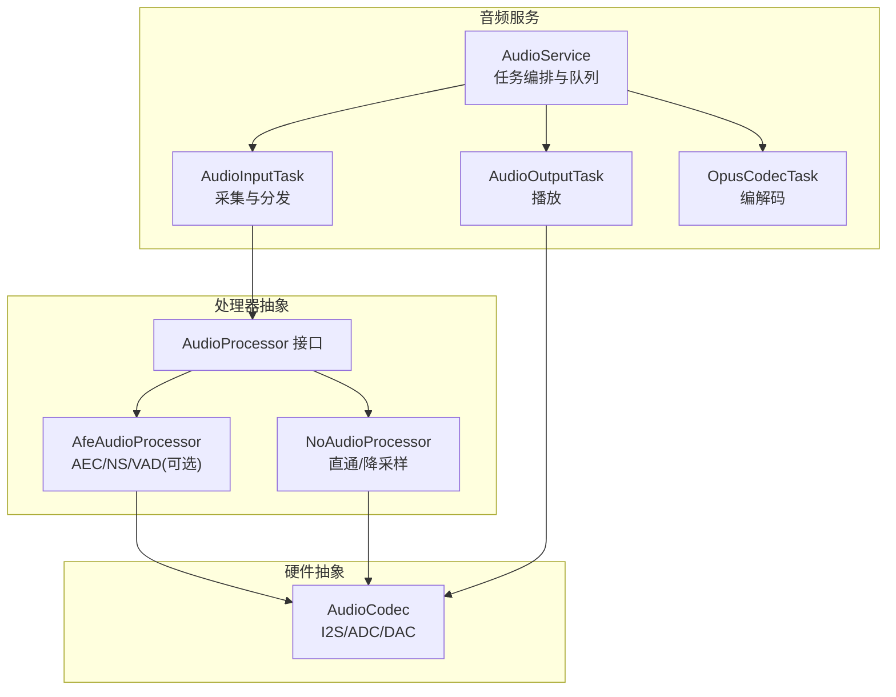
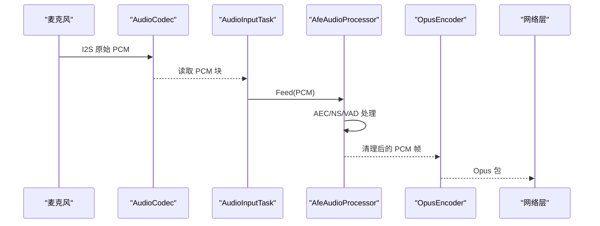
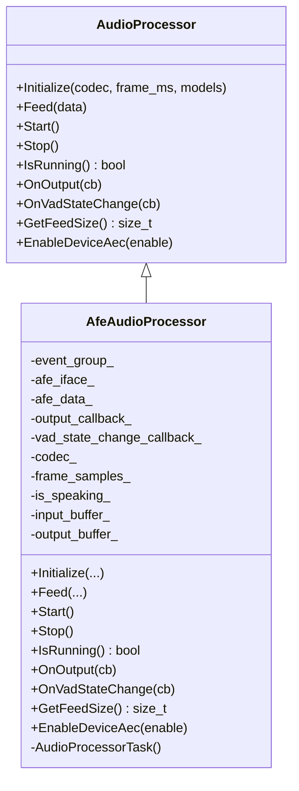
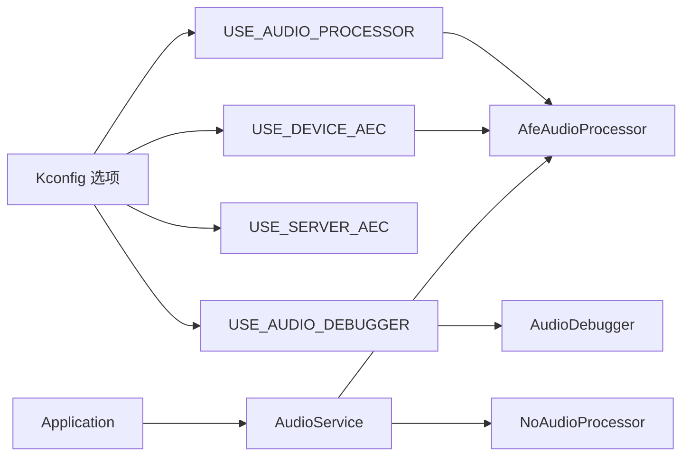

# 音频处理器

<cite>
**本文引用的文件**   
- [main/audio/README.md](file://main/audio/README.md)
- [main/audio/audio_processor.h](file://main/audio/audio_processor.h)
- [main/audio/processors/afe_audio_processor.h](file://main/audio/processors/afe_audio_processor.h)
- [main/audio/processors/afe_audio_processor.cc](file://main/audio/processors/afe_audio_processor.cc)
- [main/audio/processors/no_audio_processor.h](file://main/audio/processors/no_audio_processor.h)
- [main/audio/processors/no_audio_processor.cc](file://main/audio/processors/no_audio_processor.cc)
- [main/audio/processors/audio_debugger.h](file://main/audio/processors/audio_debugger.h)
- [main/audio/processors/audio_debugger.cc](file://main/audio/processors/audio_debugger.cc)
- [main/Kconfig.projbuild](file://main/Kconfig.projbuild)
- [main/application.cc](file://main/application.cc)
- [main/protocols/protocol.h](file://main/protocols/protocol.h)
</cite>

## 目录
1. [简介](#简介)
2. [项目结构](#项目结构)
3. [核心组件](#核心组件)
4. [架构总览](#架构总览)
5. [详细组件分析](#详细组件分析)
6. [依赖关系分析](#依赖关系分析)
7. [性能与延迟优化](#性能与延迟优化)
8. [调试与日志分析](#调试与日志分析)
9. [常见问题与排障](#常见问题与排障)
10. [结论](#结论)
11. [附录：配置与参数调优](#附录配置与参数调优)

## 简介
本技术文档聚焦于音频处理模块，覆盖回声消除（AEC）、自动增益控制（AGC）、噪声抑制（NS）等算法的实现原理与集成方式；详解 AFE 音频前端的硬件加速能力与可配置项；提供音频质量增强参数的调优方法、音频调试器的使用与日志分析技巧；并给出不同处理器的性能对比与选型建议，以及音频链路搭建与优化策略。

## 项目结构
音频子系统采用模块化设计，围绕 AudioService 组织输入、处理、编码/解码与输出任务，并通过统一的 AudioProcessor 接口对接多种后端实现（如基于 ESP-ADF AFE 的 AfeAudioProcessor 和无处理的直通 NoAudioProcessor）。

图示来源
- [main/audio/README.md:1-88](file://main/audio/README.md#L1-L88)

章节来源
- [main/audio/README.md:1-88](file://main/audio/README.md#L1-L88)

## 核心组件
- AudioProcessor 接口：定义统一初始化、数据馈入、启停、回调注册、VAD 状态回调、帧长适配与设备端 AEC 开关等能力。
- AfeAudioProcessor：基于 ESP-ADF AFE 的前端处理实现，支持 AEC、NS、VAD 等，内部维护独立任务进行 feed/fetch 循环，按帧聚合输出。
- NoAudioProcessor：轻量直通实现，负责双声道转单声道与按帧切分，便于在无 AFE 或禁用处理时使用。
- AudioDebugger：可选 UDP 音频调试器，将 PCM 流发送至主机用于离线分析。

章节来源
- [main/audio/audio_processor.h:1-27](file://main/audio/audio_processor.h#L1-L27)
- [main/audio/processors/afe_audio_processor.h:1-48](file://main/audio/processors/afe_audio_processor.h#L1-L48)
- [main/audio/processors/afe_audio_processor.cc:1-202](file://main/audio/processors/afe_audio_processor.cc#L1-L202)
- [main/audio/processors/no_audio_processor.h:1-35](file://main/audio/processors/no_audio_processor.h#L1-L35)
- [main/audio/processors/no_audio_processor.cc:1-72](file://main/audio/processors/no_audio_processor.cc#L1-L72)
- [main/audio/processors/audio_debugger.h:1-22](file://main/audio/processors/audio_debugger.h#L1-22)
- [main/audio/processors/audio_debugger.cc:1-68](file://main/audio/processors/audio_debugger.cc#L1-68)

## 架构总览
音频链路包含上行（麦克风→处理→编码→网络）与下行（网络→解码→播放）两条路径。AfeAudioProcessor 在设备侧完成降噪、回声消除与语音活动检测，并将结果以固定帧长度输出给上层编码器。

图示来源
- [main/audio/README.md:22-56](file://main/audio/README.md#L22-L56)
- [main/audio/processors/afe_audio_processor.cc:135-186](file://main/audio/processors/afe_audio_processor.cc#L135-L186)

## 详细组件分析

### AfeAudioProcessor（基于 ESP-ADF AFE）
- 功能要点
  - 通过 afe_config_init 构建 AFE 配置，选择输入通道格式（主声/M、参考/R），设置 AEC 模式、VAD 模式与最小噪声时长。
  - 根据是否启用 CONFIG_USE_DEVICE_AEC 决定设备端 AEC 与 VAD 的初始化组合。
  - 内部创建独立任务执行 fetch_with_delay 循环，结合事件组控制运行状态。
  - 对输出进行帧对齐，按 frame_samples_ 聚合后通过回调输出。
  - 运行时可通过 EnableDeviceAec 动态切换 AEC/VAD 能力。
- 关键流程
  - Initialize：解析模型列表、构造 afe_config_t、创建 AFE 实例与任务。
  - Feed：将输入缓冲累积到 chunk_size 后喂入 AFE。
  - AudioProcessorTask：等待事件、拉取处理结果、上报 VAD 状态变化、按帧输出。
  - EnableDeviceAec：在已编译支持设备端 AEC 时启用/关闭 AEC 并相应切换 VAD。

图示来源
- [main/audio/audio_processor.h:11-24](file://main/audio/audio_processor.h#L11-L24)
- [main/audio/processors/afe_audio_processor.h:17-46](file://main/audio/processors/afe_audio_processor.h#L17-L46)
- [main/audio/processors/afe_audio_processor.cc:13-75](file://main/audio/processors/afe_audio_processor.cc#L13-L75)
- [main/audio/processors/afe_audio_processor.cc:135-186](file://main/audio/processors/afe_audio_processor.cc#L135-L186)
- [main/audio/processors/afe_audio_processor.cc:189-201](file://main/audio/processors/afe_audio_processor.cc#L189-L201)

章节来源
- [main/audio/processors/afe_audio_processor.h:1-48](file://main/audio/processors/afe_audio_processor.h#L1-48)
- [main/audio/processors/afe_audio_processor.cc:1-202](file://main/audio/processors/afe_audio_processor.cc#L1-202)

### NoAudioProcessor（直通/降采样）
- 功能要点
  - 若输入为双声道则转换为单声道，否则直接透传。
  - 按 frame_samples_ 聚合完整帧后回调输出。
  - 无 AEC/NS/VAD 能力，EnableDeviceAec 仅记录不支持日志。
- 适用场景
  - 无需前端处理、仅需简单下采样的低功耗或低复杂度场景。

章节来源
- [main/audio/processors/no_audio_processor.h:1-35](file://main/audio/processors/no_audio_processor.h#L1-35)
- [main/audio/processors/no_audio_processor.cc:1-72](file://main/audio/processors/no_audio_processor.cc#L1-72)

### AudioDebugger（UDP 音频调试）
- 功能要点
  - 通过配置项启用，初始化 UDP Socket 并解析服务器地址 IP:PORT。
  - Feed 将 PCM 数据发送到指定主机，便于上位机工具进行波形/频谱分析。
- 使用建议
  - 仅在调试阶段开启，避免影响实时性与功耗。

章节来源
- [main/audio/processors/audio_debugger.h:1-22](file://main/audio/processors/audio_debugger.h#L1-22)
- [main/audio/processors/audio_debugger.cc:1-68](file://main/audio/processors/audio_debugger.cc#L1-68)

### 应用层 AEC 模式切换
- Application 暴露 SetAecMode 接口，支持关闭、服务端 AEC、设备端 AEC 三种模式，并在切换时关闭当前音频通道以确保生效。
- 默认监听模式会根据 AEC 模式选择自动停止或实时模式。

章节来源
- [main/application.cc:1090-1115](file://main/application.cc#L1090-L1115)
- [main/application.cc:1090-1115](file://main/application.cc#L1090-L1115)

## 依赖关系分析
- 编译期开关
  - USE_AUDIO_PROCESSOR：启用 AFE 相关处理（需 ESP32S3/P4 且 SPIRAM）。
  - USE_DEVICE_AEC：启用设备端 AEC（需要干净的扬声器参考路径与声学隔离）。
  - USE_SERVER_AEC：启用服务端 AEC（不稳定，需服务端支持）。
  - USE_AUDIO_DEBUGGER：启用 UDP 音频调试。
- 运行时耦合
  - AfeAudioProcessor 依赖 ESP-ADF AFE 接口与模型资源。
  - Application 通过 AudioService 调用处理器能力，并根据 AEC 模式调整行为。

图示来源
- [main/Kconfig.projbuild:917-950](file://main/Kconfig.projbuild#L917-L950)
- [main/Kconfig.projbuild:974-979](file://main/Kconfig.projbuild#L974-L979)
- [main/application.cc:1090-1115](file://main/application.cc#L1090-L1115)

章节来源
- [main/Kconfig.projbuild:917-950](file://main/Kconfig.projbuild#L917-L950)
- [main/Kconfig.projbuild:974-979](file://main/Kconfig.projbuild#L974-L979)

## 性能与延迟优化
- 帧大小与延迟
  - AfeAudioProcessor 按 frame_samples_ 聚合输出，frame_samples_ = frame_duration_ms * 16000 / 1000。减小 frame_duration_ms 可降低端到端延迟，但会增加 CPU 与网络开销。
- 内存分配
  - AFE 配置中可选择 PSRAM 分配模式以降低 SRAM 压力，适合复杂模型与较大缓冲区场景。
- 任务调度
  - AfeAudioProcessor 内部任务优先级与阻塞式 fetch_with_delay 配合事件组，确保稳定吞吐；应避免上层回调耗时过长导致队列堆积。
- 双声道转单声道
  - NoAudioProcessor 在双声道输入时做降采样至单声道，减少后续处理量。
- 参考路径与声学隔离
  - 设备端 AEC 效果高度依赖清晰的扬声器参考信号与良好的声学隔离，硬件布局不当会导致残余回声或失真。

章节来源
- [main/audio/processors/afe_audio_processor.cc:13-75](file://main/audio/processors/afe_audio_processor.cc#L13-L75)
- [main/audio/processors/afe_audio_processor.cc:135-186](file://main/audio/processors/afe_audio_processor.cc#L135-L186)
- [main/audio/processors/no_audio_processor.cc:12-36](file://main/audio/processors/no_audio_processor.cc#L12-L36)
- [main/Kconfig.projbuild:924-936](file://main/Kconfig.projbuild#L924-L936)

## 调试与日志分析
- 启用音频调试器
  - 在配置中启用 USE_AUDIO_DEBUGGER，并设置 AUDIO_DEBUG_UDP_SERVER 为“IP:PORT”。
  - 设备启动后会尝试连接该地址，成功时将 PCM 数据通过 UDP 发送。
- 日志定位
  - 关注 AfeAudioProcessor 的任务启动、feed/fetch 尺寸、错误码与 VAD 状态变更日志。
  - 调试器发送失败会记录目标地址与 errno，便于排查网络连通性。
- 分析方法
  - 使用上位机工具接收 UDP PCM，观察波形、频谱与信噪比变化，验证 NS/AEC 效果。
  - 结合 VAD 状态回调，判断说话起止点是否与预期一致。

章节来源
- [main/Kconfig.projbuild:945-949](file://main/Kconfig.projbuild#L945-L949)
- [main/Kconfig.projbuild:974-979](file://main/Kconfig.projbuild#L974-L979)
- [main/audio/processors/audio_debugger.cc:16-42](file://main/audio/processors/audio_debugger.cc#L16-L42)
- [main/audio/processors/audio_debugger.cc:54-66](file://main/audio/processors/audio_debugger.cc#L54-L66)
- [main/audio/processors/afe_audio_processor.cc:135-186](file://main/audio/processors/afe_audio_processor.cc#L135-L186)

## 常见问题与排障
- 设备端 AEC 无效或引入失真
  - 检查是否启用 CONFIG_USE_DEVICE_AEC，并确保扬声器参考路径干净、麦克风和扬声器物理隔离良好。
  - 确认 AfeAudioProcessor::EnableDeviceAec 被正确调用，且在切换 AEC 模式后关闭了音频通道。
- 回声未消除或残留严重
  - 评估环境混响与音量，适当降低扬声器音量或增加声学隔离。
  - 若设备端 AEC 不可用，考虑使用服务端 AEC（需服务端支持）。
- 延迟过高
  - 减小 frame_duration_ms，降低处理链路的帧累积时间。
  - 检查上层回调是否耗时过长，必要时异步化或精简处理逻辑。
- 噪声过大
  - 启用 NS 模型（需在模型列表中提供 NS 模型），并合理设置 AFE 的 NS 模式。
  - 注意 AGC 默认关闭，如需自动增益可在上层或外部链路中补充。
- 无法进入睡眠或唤醒异常
  - 检查协议通道是否关闭、AudioService 是否空闲，避免后台任务占用导致休眠失败。

章节来源
- [main/application.cc:1090-1115](file://main/application.cc#L1090-L1115)
- [main/audio/processors/afe_audio_processor.cc:189-201](file://main/audio/processors/afe_audio_processor.cc#L189-L201)
- [main/Kconfig.projbuild:924-936](file://main/Kconfig.projbuild#L924-L936)

## 结论
本模块通过统一的 AudioProcessor 接口屏蔽底层差异，既能在 ESP-ADF AFE 上启用高性能的 AEC/NS/VAD，也能在无 AFE 环境下快速部署直通链路。借助 Kconfig 开关与应用层 AEC 模式管理，用户可根据硬件条件与场景需求灵活选择最优方案。配合音频调试器与完善的日志体系，可高效定位问题并完成参数调优。

## 附录：配置与参数调优
- 关键配置项
  - USE_AUDIO_PROCESSOR：启用 AFE 处理（ESP32S3/P4 + SPIRAM）。
  - USE_DEVICE_AEC：启用设备端 AEC（需清晰参考路径与声学隔离）。
  - USE_SERVER_AEC：启用服务端 AEC（不稳定，需服务端支持）。
  - USE_AUDIO_DEBUGGER：启用 UDP 音频调试。
  - AUDIO_DEBUG_UDP_SERVER：调试器目标地址，格式“IP:PORT”。
- AFE 参数建议
  - AEC 模式：VOIP_HIGH_PERF（兼顾音质与算力）。
  - VAD 模式：VAD_MODE_0，最小噪声时长 100ms（可按环境微调）。
  - NS 模型：提供 NS 模型并启用 AFE_NS_MODE_NET。
  - AGC：默认关闭，如需自动增益请在上层或外部链路中补充。
- 帧长与延迟权衡
  - frame_duration_ms 越小，延迟越低，但 CPU/网络开销越大；建议在 20–40ms 范围内测试平衡点。
- 处理器选择指南
  - 有 AFE 与 PSRAM：优先 AfeAudioProcessor，获得更好的 AEC/NS/VAD 效果。
  - 资源受限或无需前端处理：使用 NoAudioProcessor，降低功耗与复杂度。
  - 需要离线分析：启用 AudioDebugger，将 PCM 流导出至上位机。

章节来源
- [main/Kconfig.projbuild:917-950](file://main/Kconfig.projbuild#L917-L950)
- [main/Kconfig.projbuild:974-979](file://main/Kconfig.projbuild#L974-L979)
- [main/audio/processors/afe_audio_processor.cc:37-65](file://main/audio/processors/afe_audio_processor.cc#L37-L65)
- [main/audio/processors/afe_audio_processor.cc:13-75](file://main/audio/processors/afe_audio_processor.cc#L13-L75)