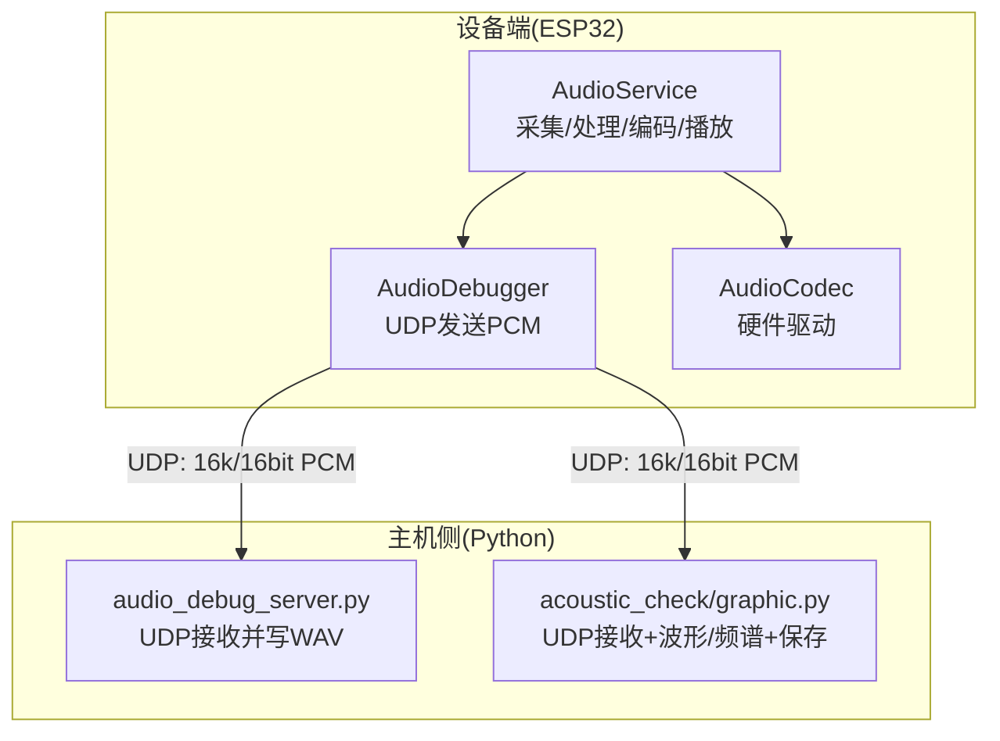
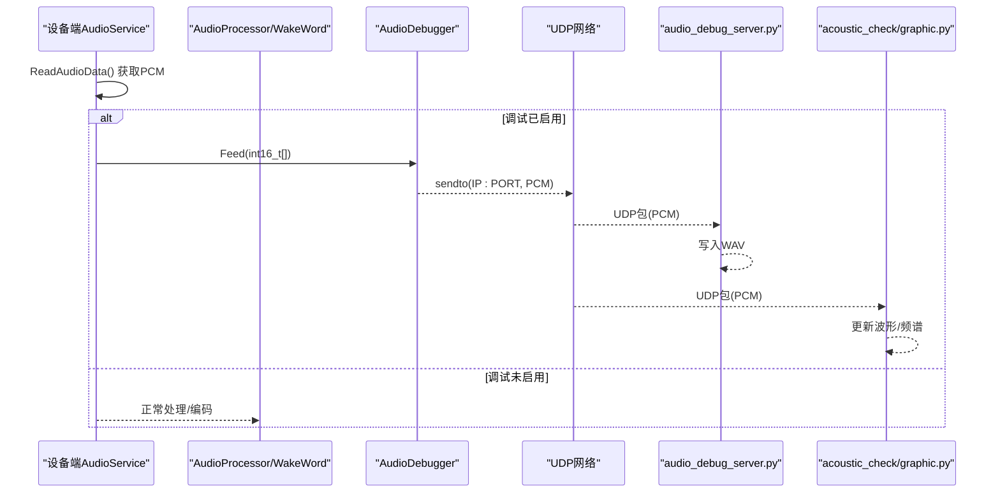
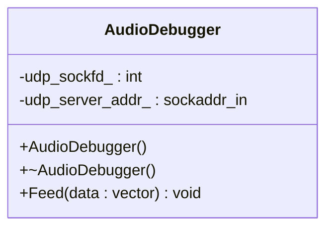
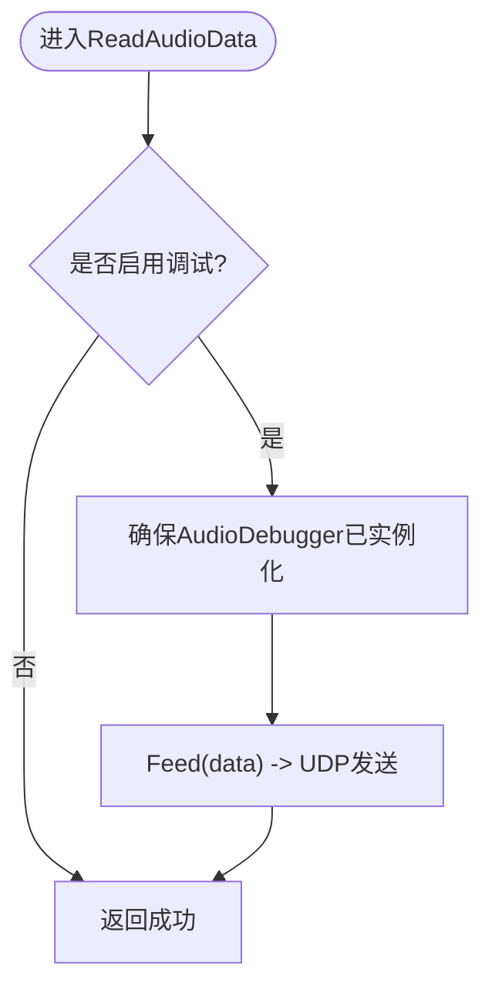
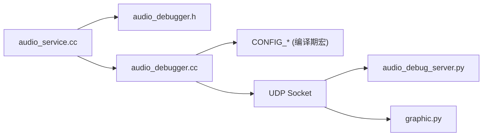

# 音频调试器

<cite>
**本文引用的文件**   
- [audio_debugger.h](file://main/audio/processors/audio_debugger.h)
- [audio_debugger.cc](file://main/audio/processors/audio_debugger.cc)
- [audio_service.h](file://main/audio/audio_service.h)
- [audio_service.cc](file://main/audio/audio_service.cc)
- [audio_debug_server.py](file://scripts/audio_debug_server.py)
- [graphic.py](file://scripts/acoustic_check/graphic.py)
- [main.py](file://scripts/acoustic_check/main.py)
</cite>

## 目录
1. [简介](#简介)
2. [项目结构](#项目结构)
3. [核心组件](#核心组件)
4. [架构总览](#架构总览)
5. [详细组件分析](#详细组件分析)
6. [依赖关系分析](#依赖关系分析)
7. [性能与资源考量](#性能与资源考量)
8. [故障诊断指南](#故障诊断指南)
9. [结论](#结论)
10. [附录：配置与使用清单](#附录配置与使用清单)

## 简介
本文件面向开发者，系统化说明本项目中的“音频调试器”能力与使用方法。该调试器通过 UDP 将设备端采集的原始 PCM 数据实时发送到主机侧工具，用于：
- 音频流监控（实时监听）
- 波形可视化（时域显示）
- 频谱分析（频域显示）
- 质量评估（结合日志、统计与离线回放）

同时提供生产环境下的选择性启用策略，以在可观测性与性能之间取得平衡。

## 项目结构
与音频调试相关的代码主要分布在以下位置：
- 设备端（ESP-IDF）：
  - 音频服务层负责采集、处理、编码与播放，并在开启调试功能时将原始 PCM 数据转发至调试器模块。
  - 调试器模块封装 UDP 发送逻辑，按配置地址向主机发送 PCM。
- 主机侧（Python）：
  - 简易 UDP 接收并保存为 WAV 的工具脚本。
  - 基于 Qt + Matplotlib 的实时监听与绘图工具，支持时域波形与频谱展示，并可保存音频。

图表来源
- [audio_service.cc:218-225](file://main/audio/audio_service.cc#L218-L225)
- [audio_debugger.cc:16-42](file://main/audio/processors/audio_debugger.cc#L16-L42)
- [audio_debug_server.py:11-43](file://scripts/audio_debug_server.py#L11-L43)
- [graphic.py:23-44](file://scripts/acoustic_check/graphic.py#L23-L44)

章节来源
- [audio_service.h:105-195](file://main/audio/audio_service.h#L105-L195)
- [audio_service.cc:184-228](file://main/audio/audio_service.cc#L184-L228)
- [audio_debugger.h:10-22](file://main/audio/processors/audio_debugger.h#L10-L22)
- [audio_debugger.cc:1-68](file://main/audio/processors/audio_debugger.cc#L1-L68)
- [audio_debug_server.py:1-55](file://scripts/audio_debug_server.py#L1-L55)
- [graphic.py:1-444](file://scripts/acoustic_check/graphic.py#L1-L444)

## 核心组件
- AudioDebugger（设备端）
  - 职责：创建 UDP Socket，解析配置的服务器地址，周期性将 PCM 帧发送至主机。
  - 关键接口：Feed(data)，构造 sockaddr_in，sendto 发送 int16_t 数据。
- AudioService（设备端）
  - 职责：音频输入任务读取 PCM，必要时重采样；在开启调试开关后，调用 AudioDebugger::Feed 发送原始 PCM。
  - 集成点：ReadAudioData 中插入调试转发逻辑。
- audio_debug_server.py（主机端）
  - 职责：UDP 监听默认端口 8000，将收到的字节流写入 WAV 文件，便于后续离线分析。
- acoustic_check/graphic.py（主机端）
  - 职责：异步 UDP 接收，维护环形缓冲，绘制时域波形与频谱，并提供保存 WAV 功能。

章节来源
- [audio_debugger.h:10-22](file://main/audio/processors/audio_debugger.h#L10-L22)
- [audio_debugger.cc:16-68](file://main/audio/processors/audio_debugger.cc#L16-L68)
- [audio_service.cc:218-225](file://main/audio/audio_service.cc#L218-L225)
- [audio_debug_server.py:11-43](file://scripts/audio_debug_server.py#L11-L43)
- [graphic.py:23-44](file://scripts/acoustic_check/graphic.py#L23-L44)

## 架构总览
下图展示了从采集到可视化的端到端流程，包括设备端任务、编码器、调试通道以及主机侧两种接收方式（纯记录或可视化）。

图表来源
- [audio_service.cc:218-225](file://main/audio/audio_service.cc#L218-L225)
- [audio_debugger.cc:54-66](file://main/audio/processors/audio_debugger.cc#L54-L66)
- [audio_debug_server.py:25-43](file://scripts/audio_debug_server.py#L25-L43)
- [graphic.py:32-44](file://scripts/acoustic_check/graphic.py#L32-L44)

## 详细组件分析

### 设备端：AudioDebugger 类
- 设计要点
  - 仅在编译期宏 CONFIG_USE_AUDIO_DEBUGGER 启用时生成相关代码，避免对非调试构建产生开销。
  - 构造函数解析配置项 CONFIG_AUDIO_DEBUG_UDP_SERVER（格式 IP:PORT），初始化 UDP 套接字与目标地址。
  - Feed 方法直接发送整型 PCM 数据块，不附加额外协议头，简化主机侧解析。
- 错误处理
  - 创建 Socket 失败、地址格式非法、发送失败均输出相应日志，便于定位问题。
- 生命周期
  - 析构函数确保关闭 UDP 套接字，防止资源泄漏。

图表来源
- [audio_debugger.h:10-22](file://main/audio/processors/audio_debugger.h#L10-L22)
- [audio_debugger.cc:16-52](file://main/audio/processors/audio_debugger.cc#L16-L52)
- [audio_debugger.cc:54-66](file://main/audio/processors/audio_debugger.cc#L54-L66)

章节来源
- [audio_debugger.h:10-22](file://main/audio/processors/audio_debugger.h#L10-L22)
- [audio_debugger.cc:1-68](file://main/audio/processors/audio_debugger.cc#L1-L68)

### 设备端：AudioService 集成点
- 集成位置
  - 在读取音频数据后，若调试宏启用，则实例化 AudioDebugger 并调用 Feed 发送 PCM。
- 线程模型
  - 音频输入任务循环读取 PCM，必要时进行重采样；调试路径与正常处理路径并行存在，互不影响。
- 性能影响
  - 仅当宏启用时才执行 UDP 发送；否则完全无额外开销。

图表来源
- [audio_service.cc:218-225](file://main/audio/audio_service.cc#L218-L225)

章节来源
- [audio_service.cc:184-228](file://main/audio/audio_service.cc#L184-L228)

### 主机端：UDP 接收与WAV保存（脚本）
- 功能
  - 绑定本地 8000 端口，持续接收 UDP 数据包，将二进制 PCM 写入 WAV 文件。
  - 支持命令行参数设置采样率与声道数，默认 16kHz、双声道。
- 使用建议
  - 适合快速录制与离线分析，无需图形界面。
  - 注意与设备端采样率、声道数保持一致，否则回放会异常。

章节来源
- [audio_debug_server.py:11-43](file://scripts/audio_debug_server.py#L11-L43)
- [audio_debug_server.py:46-55](file://scripts/audio_debug_server.py#L46-L55)

### 主机端：实时监听与可视化（GUI）
- 功能
  - 基于 asyncio 的 UDP 服务端，接收 PCM 并推入队列。
  - 定时刷新 Matplotlib 子图：上图为时域波形，下图为频谱（FFT）。
  - 支持保存当前缓存为 WAV 文件，便于进一步分析。
- 关键点
  - 使用固定时间窗口限制绘图数据量，避免内存增长。
  - 自动缩放坐标轴范围，提升可读性。
  - 可选 AFSK 解码（与音频调试无关，但随同工具提供）。

章节来源
- [graphic.py:23-44](file://scripts/acoustic_check/graphic.py#L23-L44)
- [graphic.py:118-183](file://scripts/acoustic_check/graphic.py#L118-L183)
- [graphic.py:402-423](file://scripts/acoustic_check/graphic.py#L402-L423)
- [main.py:1-19](file://scripts/acoustic_check/main.py#L1-L19)

## 依赖关系分析
- 编译期依赖
  - 设备端通过 CONFIG_USE_AUDIO_DEBUGGER 控制是否包含调试代码。
  - 服务器地址由 CONFIG_AUDIO_DEBUG_UDP_SERVER 提供。
- 运行时依赖
  - 设备端需要可用的 UDP 网络栈与正确的 IP:PORT 配置。
  - 主机端 Python 环境需安装对应库（如 PyQt6、matplotlib、numpy、qasync 等，具体见脚本导入）。

图表来源
- [audio_service.cc:218-225](file://main/audio/audio_service.cc#L218-L225)
- [audio_debugger.cc:1-11](file://main/audio/processors/audio_debugger.cc#L1-L11)
- [audio_debug_server.py:1-10](file://scripts/audio_debug_server.py#L1-L10)
- [graphic.py:1-20](file://scripts/acoustic_check/graphic.py#L1-L20)

章节来源
- [audio_service.cc:218-225](file://main/audio/audio_service.cc#L218-L225)
- [audio_debugger.cc:1-11](file://main/audio/processors/audio_debugger.cc#L1-L11)

## 性能与资源考量
- 构建开关
  - 仅在启用 CONFIG_USE_AUDIO_DEBUGGER 时才会创建 UDP 套接字与发送数据，避免对非调试版本造成任何额外开销。
- 网络与CPU
  - 发送频率取决于音频帧大小与采样率；建议在稳定局域网内使用，避免丢包导致主机侧卡顿。
- 内存占用
  - 主机侧 GUI 使用固定长度队列限制内存增长；脚本版仅顺序写入磁盘，内存占用较低。
- 功耗管理
  - 设备端音频服务具备空闲检测与电源状态管理，调试功能本身不改变此机制。

[本节为通用指导，不直接分析具体文件]

## 故障诊断指南
- 无法收到数据
  - 检查设备端 CONFIG_AUDIO_DEBUG_UDP_SERVER 是否为合法 IP:PORT 格式。
  - 确认主机防火墙允许 UDP 8000 端口通信。
  - 观察设备端日志是否有“Failed to create UDP socket”或“Invalid server address”提示。
- 声音失真或速度异常
  - 核对主机侧采样率与声道数是否与设备端一致（默认 16kHz、单声道或双声道）。
  - 使用 GUI 工具的保存功能导出 WAV，再用标准播放器验证。
- 延迟感知明显
  - 调整主机侧绘图刷新间隔与时间窗口，减少计算压力。
  - 降低网络负载，避免与其他高带宽应用共享同一链路。
- 内存泄漏或界面卡顿
  - 确认 GUI 工具的时间窗口与队列长度合理；必要时重启工具释放资源。
  - 长时间运行后，检查系统内存与 CPU 占用情况。

章节来源
- [audio_debugger.cc:34-41](file://main/audio/processors/audio_debugger.cc#L34-L41)
- [audio_debugger.cc:59-63](file://main/audio/processors/audio_debugger.cc#L59-L63)
- [graphic.py:118-183](file://scripts/acoustic_check/graphic.py#L118-L183)
- [audio_debug_server.py:25-43](file://scripts/audio_debug_server.py#L25-L43)

## 结论
本项目提供的音频调试器以最小侵入的方式实现了设备端 PCM 数据的 UDP 透传，配合主机侧两类工具（轻量脚本与可视化 GUI），覆盖了从实时监听到离线分析的完整链路。通过编译期宏控制，可在生产环境中按需启用，兼顾性能与可观测性。

[本节为总结性内容，不直接分析具体文件]

## 附录：配置与使用清单
- 设备端配置
  - 启用调试：在配置中启用 CONFIG_USE_AUDIO_DEBUGGER。
  - 设置服务器地址：配置 CONFIG_AUDIO_DEBUG_UDP_SERVER 为“IP:PORT”，例如“192.168.1.100:8000”。
- 主机端启动
  - 脚本模式：运行 scripts/audio_debug_server.py，指定采样率与声道数（默认 16000Hz、2 声道）。
  - GUI 模式：运行 scripts/acoustic_check/main.py，点击“开始监听”，选择地址与端口（默认 0.0.0.0:8000），即可看到波形与频谱，并可保存 WAV。
- 注意事项
  - 保持设备端与主机端采样率、声道数一致。
  - 在生产环境仅临时启用调试功能，测试完成后关闭以避免性能损耗。

章节来源
- [audio_debugger.cc:20-33](file://main/audio/processors/audio_debugger.cc#L20-L33)
- [audio_debug_server.py:46-55](file://scripts/audio_debug_server.py#L46-L55)
- [graphic.py:206-215](file://scripts/acoustic_check/graphic.py#L206-L215)