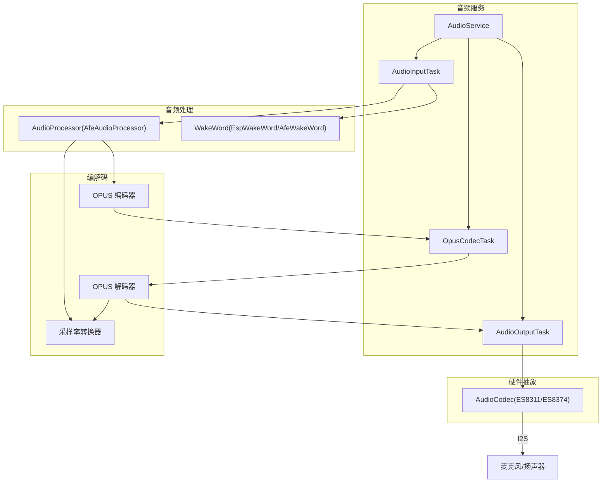
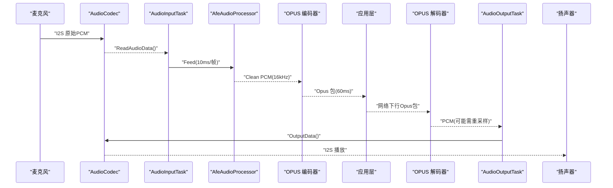
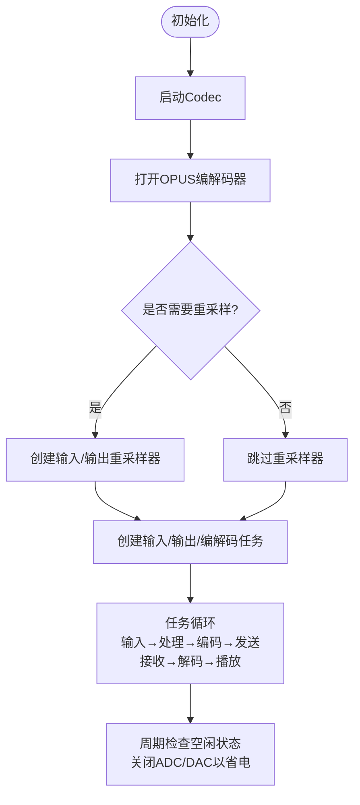
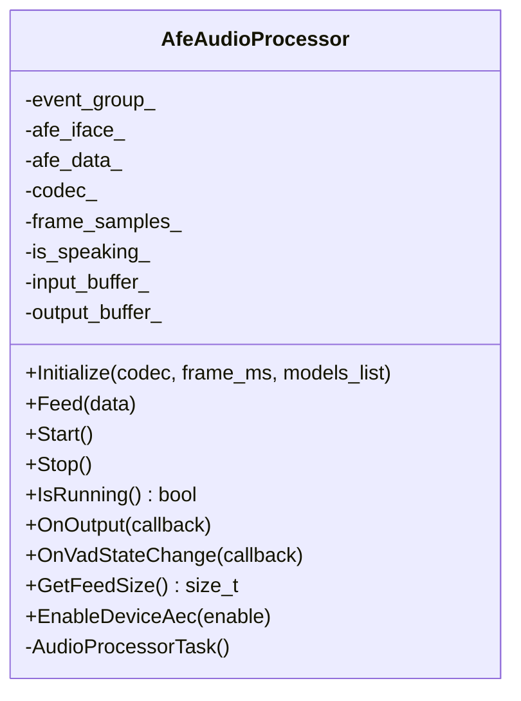
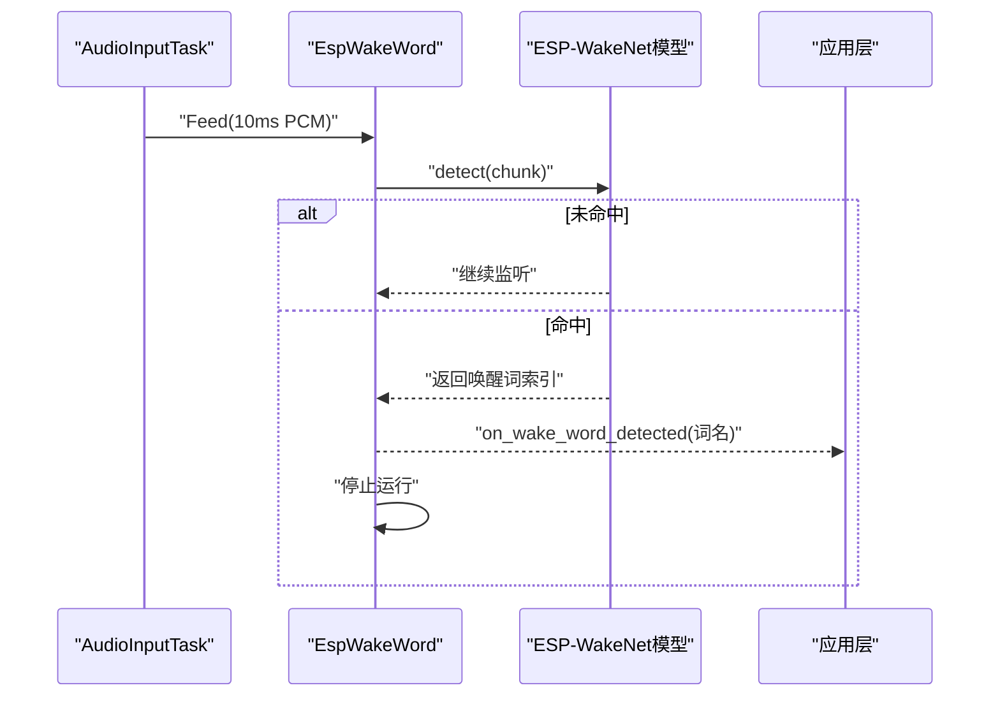
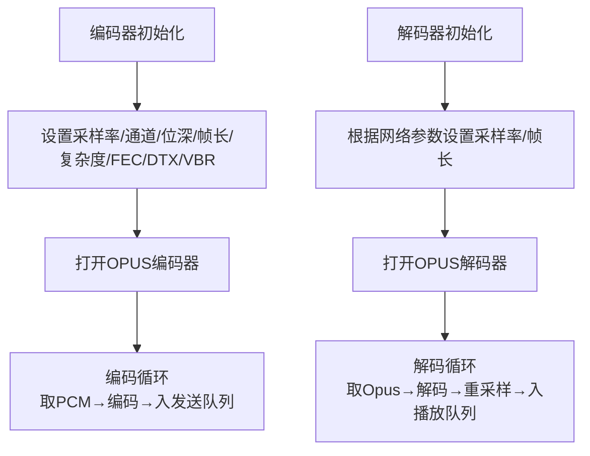
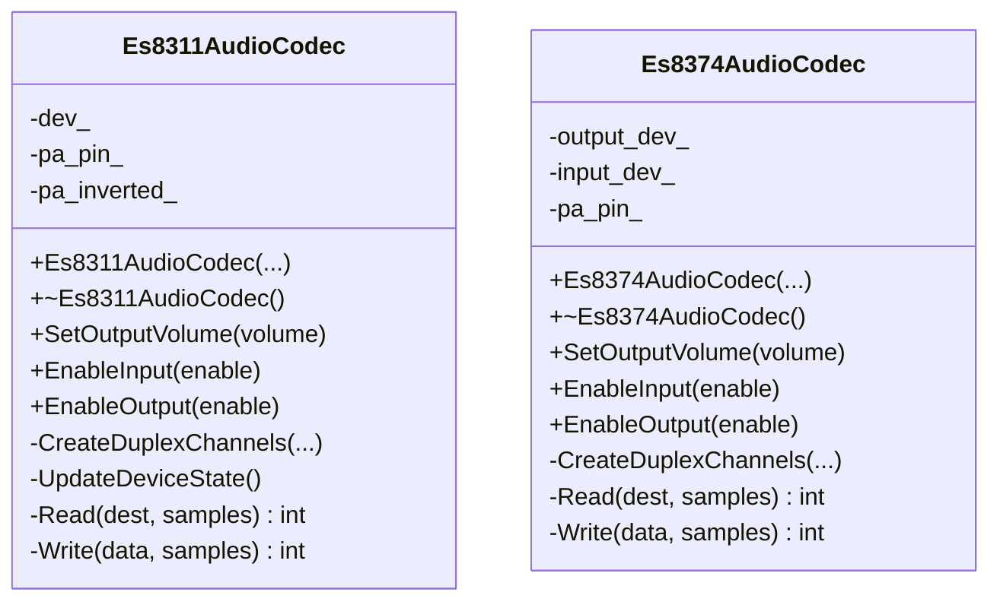
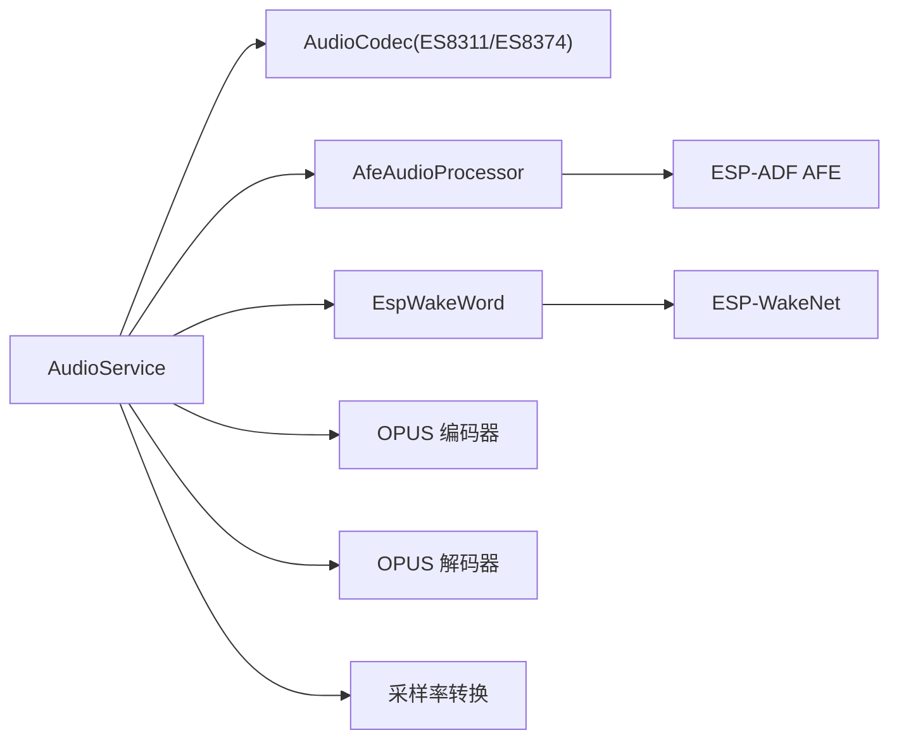

# 音频处理系统

<cite>
**本文引用的文件**   
- [README.md](file://README.md)
- [audio_service.h](file://main\audio\audio_service.h)
- [audio_service.cc](file://main\audio\audio_service.cc)
- [audio/README.md](file://main\audio\README.md)
- [es8311_audio_codec.h](file://main\audio\codecs\es8311_audio_codec.h)
- [es8311_audio_codec.cc](file://main\audio\codecs\es8311_audio_codec.cc)
- [es8374_audio_codec.h](file://main\audio\codecs\es8374_audio_codec.h)
- [es8374_audio_codec.cc](file://main\audio\codecs\es8374_audio_codec.cc)
- [afe_audio_processor.h](file://main\audio\processors\afe_audio_processor.h)
- [afe_audio_processor.cc](file://main\audio\processors\afe_audio_processor.cc)
- [esp_wake_word.h](file://main\audio\wake_words\esp_wake_word.h)
- [esp_wake_word.cc](file://main\audio\wake_words\esp_wake_word.cc)
</cite>

## 目录
1. [简介](#简介)
2. [项目结构](#项目结构)
3. [核心组件](#核心组件)
4. [架构总览](#架构总览)
5. [详细组件分析](#详细组件分析)
6. [依赖关系分析](#依赖关系分析)
7. [性能与延迟优化](#性能与延迟优化)
8. [调试与日志分析](#调试与日志分析)
9. [常见问题与排障](#常见问题与排障)
10. [结论](#结论)

## 简介
本技术文档围绕音频采集、预处理、编码、传输的完整流水线展开，重点说明离线语音唤醒机制（ESP-SR 引擎集成、唤醒词训练与部署）、回声消除（AEC）、自动增益控制（AGC）、噪声抑制（NS）等音频增强算法的实现与配置，并给出 OPUS 编解码器配置与优化建议。同时提供不同音频编解码芯片（如 ES8311、ES8374）的适配要点、音频调试工具与日志分析方法，以及针对延迟与音质的优化策略。

## 项目结构
本项目采用模块化设计，音频子系统位于 main/audio 下，包含：
- 音频服务 AudioService：统一编排输入/输出任务、队列、编码器/解码器、唤醒与处理器
- 硬件抽象层 AudioCodec：对 I2S/Codec 驱动的统一封装，支持多芯片
- 音频处理器 AudioProcessor：默认实现 AfeAudioProcessor，基于 ESP-ADF AFE 提供 AEC/NS/VAD 等能力
- 唤醒模块 WakeWord：支持 ESP-WakeNet/Audio Front-End 唤醒模型
- 编解码与重采样：OPUS 编解码与采样率转换

图表来源
- [audio_service.h:105-195](file://main\audio\audio_service.h#L105-L195)
- [audio_service.cc:125-167](file://main\audio\audio_service.cc#L125-L167)
- [afe_audio_processor.h:17-48](file://main\audio\processors\afe_audio_processor.h#L17-L48)
- [es8311_audio_codec.h:13-42](file://main\audio\codecs\es8311_audio_codec.h#L13-L42)
- [es8374_audio_codec.h:13-41](file://main\audio\codecs\es8374_audio_codec.h#L13-L41)

章节来源
- [audio/README.md:1-88](file://main\audio\README.md#L1-L88)
- [audio_service.h:105-195](file://main\audio\audio_service.h#L105-L195)

## 核心组件
- AudioService：负责初始化 Codec、创建 FreeRTOS 任务、管理队列与事件组、协调唤醒与语音处理、OPUS 编解码与重采样、电源管理与回调通知。
- AudioCodec：对具体芯片（ES8311/ES8374 等）的 I2S/Codec 驱动进行统一封装，提供 Read/Write、音量控制、输入输出使能、双工与参考通道标志等能力。
- AfeAudioProcessor：基于 ESP-ADF AFE 的语音前端，支持 AEC、NS、VAD，可配置内存分配模式与高性能模式；通过事件循环拉取处理结果并按帧输出。
- EspWakeWord：基于 ESP-WakeNet 的离线唤醒实现，加载模型、按块检测、触发回调并停止运行。
- OPUS 编解码与重采样：使用 esp_opus_enc/dec 接口，结合 esp_ae_rate_cvt 完成输入/输出采样率对齐。

章节来源
- [audio_service.h:105-195](file://main\audio\audio_service.h#L105-L195)
- [audio_service.cc:62-123](file://main\audio\audio_service.cc#L62-L123)
- [afe_audio_processor.h:17-48](file://main\audio\processors\afe_audio_processor.h#L17-L48)
- [esp_wake_word.h:17-46](file://main\audio\wake_words\esp_wake_word.h#L17-L46)

## 架构总览
整体数据流分为上行（采集→处理→编码→发送）与下行（接收→解码→播放）。关键线程模型为三个任务并行协作：
- AudioInputTask：从 Codec 读取 PCM，分发给唤醒或语音处理器
- OpusCodecTask：执行编码/解码，维护发送/播放队列
- AudioOutputTask：从播放队列取出 PCM 写入 Codec 播放

图表来源
- [audio_service.cc:230-288](file://main\audio\audio_service.cc#L230-L288)
- [audio_service.cc:327-446](file://main\audio\audio_service.cc#L327-L446)
- [audio_service.cc:290-325](file://main\audio\audio_service.cc#L290-L325)

## 详细组件分析

### 音频服务 AudioService
职责与关键点
- 初始化阶段：启动 Codec、打开 OPUS 编解码器、按需创建输入/输出重采样器、注册回调（VAD 变化、发送队列可用等）
- 任务调度：创建输入/输出/编解码任务，使用事件组与条件变量协调
- 上行链路：ReadAudioData → 可选重采样 → 唤醒/处理器 → 编码 → 发送队列
- 下行链路：解码队列 → 解码 → 可选重采样 → 播放队列 → 输出
- 电源管理：空闲超时关闭 ADC/DAC，降低功耗
- 设备 AEC 开关：动态启用/禁用设备端 AEC（需编译选项支持）

图表来源
- [audio_service.cc:62-123](file://main\audio\audio_service.cc#L62-L123)
- [audio_service.cc:125-167](file://main\audio\audio_service.cc#L125-L167)
- [audio_service.cc:682-698](file://main\audio\audio_service.cc#L682-L698)

章节来源
- [audio_service.h:105-195](file://main\audio\audio_service.h#L105-L195)
- [audio_service.cc:62-123](file://main\audio\audio_service.cc#L62-L123)
- [audio_service.cc:125-167](file://main\audio\audio_service.cc#L125-L167)
- [audio_service.cc:230-288](file://main\audio\audio_service.cc#L230-L288)
- [audio_service.cc:290-325](file://main\audio\audio_service.cc#L290-L325)
- [audio_service.cc:327-446](file://main\audio\audio_service.cc#L327-L446)
- [audio_service.cc:682-698](file://main\audio\audio_service.cc#L682-L698)

### 音频处理器 AfeAudioProcessor（AEC/NS/VAD）
功能特性
- 基于 ESP-ADF AFE，支持 AEC、NS、VAD
- 根据模型列表动态选择 NS/VAD 模型，支持高性能与 PSRAM 分配模式
- 支持设备端 AEC 开关（编译期宏 CONFIG_USE_DEVICE_AEC）
- 将处理后的干净语音按帧输出，并上报 VAD 状态变化

图表来源
- [afe_audio_processor.h:17-48](file://main\audio\processors\afe_audio_processor.h#L17-L48)
- [afe_audio_processor.cc:13-75](file://main\audio\processors\afe_audio_processor.cc#L13-L75)
- [afe_audio_processor.cc:135-187](file://main\audio\processors\afe_audio_processor.cc#L135-L187)
- [afe_audio_processor.cc:189-201](file://main\audio\processors\afe_audio_processor.cc#L189-L201)

章节来源
- [afe_audio_processor.h:17-48](file://main\audio\processors\afe_audio_processor.h#L17-L48)
- [afe_audio_processor.cc:13-75](file://main\audio\processors\afe_audio_processor.cc#L13-L75)
- [afe_audio_processor.cc:135-187](file://main\audio\processors\afe_audio_processor.cc#L135-L187)
- [afe_audio_processor.cc:189-201](file://main\audio\processors\afe_audio_processor.cc#L189-L201)

### 离线语音唤醒 EspWakeWord（ESP-SR）
工作原理
- 初始化时加载唤醒模型（ESP-WakeNet），获取采样率与 chunksize
- Feed 阶段累积输入缓冲，按 chunksize 调用 detect 检测
- 检测到唤醒词后记录名称、停止运行并触发回调
- 支持双声道输入时抽取单声道数据

图表来源
- [esp_wake_word.cc:17-45](file://main\audio\wake_words\esp_wake_word.cc#L17-L45)
- [esp_wake_word.cc:62-96](file://main\audio\wake_words\esp_wake_word.cc#L62-L96)
- [audio_service.cc:549-577](file://main\audio\audio_service.cc#L549-L577)

章节来源
- [esp_wake_word.h:17-46](file://main\audio\wake_words\esp_wake_word.h#L17-L46)
- [esp_wake_word.cc:17-45](file://main\audio\wake_words\esp_wake_word.cc#L17-L45)
- [esp_wake_word.cc:62-96](file://main\audio\wake_words\esp_wake_word.cc#L62-L96)
- [audio_service.cc:549-577](file://main\audio\audio_service.cc#L549-L577)

### 音频编解码与重采样（OPUS）
配置与优化
- 编码器：16kHz 单声道 16bit，帧长 60ms，启用 DTX/VBR，比特率自适应
- 解码器：根据网络侧参数动态设置采样率与帧长，必要时进行重采样到 Codec 输出采样率
- 重采样：输入/输出分别独立重采样器，避免跨阶段缓存污染

图表来源
- [audio_service.h:65-76](file://main\audio\audio_service.h#L65-L76)
- [audio_service.cc:62-84](file://main\audio\audio_service.cc#L62-L84)
- [audio_service.cc:448-482](file://main\audio\audio_service.cc#L448-L482)
- [audio_service.cc:327-446](file://main\audio\audio_service.cc#L327-L446)

章节来源
- [audio_service.h:65-76](file://main\audio\audio_service.h#L65-L76)
- [audio_service.cc:62-84](file://main\audio\audio_service.cc#L62-L84)
- [audio_service.cc:448-482](file://main\audio\audio_service.cc#L448-L482)
- [audio_service.cc:327-446](file://main\audio\audio_service.cc#L327-L446)

### 硬件适配：ES8311/ES8374 音频编解码芯片
通用要点
- 均通过 I2S 全双工通道与 ESP32 通信，I2C 控制寄存器
- 支持 PA 引脚控制、输入增益与输出音量调节
- 在 EnableInput/EnableOutput 中动态 open/close 设备节点，减少功耗

差异点
- ES8311：使用单一 esp_codec_dev_handle 管理 IN/OUT，支持 duplex 标志
- ES8374：分别创建 output_dev_ 与 input_dev_，更细粒度控制

图表来源
- [es8311_audio_codec.h:13-42](file://main\audio\codecs\es8311_audio_codec.h#L13-L42)
- [es8311_audio_codec.cc:7-59](file://main\audio\codecs\es8311_audio_codec.cc#L7-L59)
- [es8311_audio_codec.cc:70-98](file://main\audio\codecs\es8311_audio_codec.cc#L70-L98)
- [es8311_audio_codec.cc:100-156](file://main\audio\codecs\es8311_audio_codec.cc#L100-L156)
- [es8374_audio_codec.h:13-41](file://main\audio\codecs\es8374_audio_codec.h#L13-L41)
- [es8374_audio_codec.cc:7-62](file://main\audio\codecs\es8374_audio_codec.cc#L7-L62)
- [es8374_audio_codec.cc:76-132](file://main\audio\codecs\es8374_audio_codec.cc#L76-L132)

章节来源
- [es8311_audio_codec.h:13-42](file://main\audio\codecs\es8311_audio_codec.h#L13-L42)
- [es8311_audio_codec.cc:7-59](file://main\audio\codecs\es8311_audio_codec.cc#L7-L59)
- [es8311_audio_codec.cc:70-98](file://main\audio\codecs\es8311_audio_codec.cc#L70-L98)
- [es8311_audio_codec.cc:100-156](file://main\audio\codecs\es8311_audio_codec.cc#L100-L156)
- [es8374_audio_codec.h:13-41](file://main\audio\codecs\es8374_audio_codec.h#L13-L41)
- [es8374_audio_codec.cc:7-62](file://main\audio\codecs\es8374_audio_codec.cc#L7-L62)
- [es8374_audio_codec.cc:76-132](file://main\audio\codecs\es8374_audio_codec.cc#L76-L132)

## 依赖关系分析
- AudioService 依赖 AudioCodec、AudioProcessor、WakeWord、OPUS 编解码与重采样库
- AfeAudioProcessor 依赖 ESP-ADF AFE 与模型列表（NS/VAD/AEC）
- EspWakeWord 依赖 ESP-WakeNet 模型与接口
- 各 Codec 实现依赖 ESP-IDF I2S 与 esp_codec_dev 驱动

图表来源
- [audio_service.h:105-195](file://main\audio\audio_service.h#L105-L195)
- [afe_audio_processor.h:17-48](file://main\audio\processors\afe_audio_processor.h#L17-L48)
- [esp_wake_word.h:17-46](file://main\audio\wake_words\esp_wake_word.h#L17-L46)

章节来源
- [audio_service.h:105-195](file://main\audio\audio_service.h#L105-L195)
- [afe_audio_processor.h:17-48](file://main\audio\processors\afe_audio_processor.h#L17-L48)
- [esp_wake_word.h:17-46](file://main\audio\wake_words\esp_wake_word.h#L17-L46)

## 性能与延迟优化
- 帧长与码率：编码器默认 60ms 帧长，兼顾低延迟与压缩效率；可根据网络质量调整帧长与是否启用 FEC/DTX/VBR
- 重采样路径：仅在输入/输出采样率不匹配时启用，避免不必要的 CPU 开销
- 任务栈与优先级：输入/输出/编解码任务分别设置合适栈大小与优先级，确保实时性
- 队列长度限制：发送/播放队列上限防止积压导致延迟抖动
- 电源管理：空闲超时关闭 ADC/DAC，降低功耗；双工场景注意 TX 时钟保持以避免 RX 卡死
- 缓冲区复用：处理器内部预分配输出缓冲，减少频繁分配带来的抖动

章节来源
- [audio_service.h:39-48](file://main\audio\audio_service.h#L39-L48)
- [audio_service.cc:327-446](file://main\audio\audio_service.cc#L327-L446)
- [audio_service.cc:682-698](file://main\audio\audio_service.cc#L682-L698)

## 调试与日志分析
- 内置调试：当启用音频调试宏时，AudioService 会将原始 PCM 喂入调试器，便于离线回放与分析
- 关键日志标签：AudioService、AfeAudioProcessor、Es8311AudioCodec、Es8374AudioCodec、EspWakeWord
- 常用断点位置：
  - 输入任务：ReadAudioData 与 Feed 调用处
  - 编解码任务：编码/解码返回值与错误码
  - 处理器任务：fetch_with_delay 返回与 VAD 状态切换
  - 唤醒模块：detect 返回值与唤醒词名称
- 外部工具：可使用脚本工具对 OGG/PCM 进行转换与可视化分析（仓库 scripts 目录下相关脚本）

章节来源
- [audio_service.cc:219-226](file://main\audio\audio_service.cc#L219-L226)
- [audio_service.cc:230-288](file://main\audio\audio_service.cc#L230-L288)
- [audio_service.cc:327-446](file://main\audio\audio_service.cc#L327-L446)
- [afe_audio_processor.cc:135-187](file://main\audio\processors\afe_audio_processor.cc#L135-L187)
- [esp_wake_word.cc:62-96](file://main\audio\wake_words\esp_wake_word.cc#L62-L96)

## 常见问题与排障
- 无声音/无声播放
  - 检查 Output 使能与 PA 引脚电平控制
  - 确认解码器采样率与 Codec 输出采样率一致，必要时启用输出重采样
- 录音无声/底噪大
  - 检查输入增益与是否启用 NS/VAD
  - 若存在回音，启用设备端 AEC（需编译选项支持）
- 唤醒不灵敏
  - 确认模型已正确加载且数量大于 0
  - 检查输入通道数与 Feed 数据格式（双声道需抽取左声道）
- 延迟高/卡顿
  - 检查队列长度与任务优先级
  - 适当减小帧长或关闭不必要的处理模块（如 AGC/NS）
- 功耗异常
  - 确认空闲超时关闭逻辑生效，双工模式下 TX 时钟保持

章节来源
- [audio_service.cc:682-698](file://main\audio\audio_service.cc#L682-L698)
- [es8374_audio_codec.cc:160-186](file://main\audio\codecs\es8374_audio_codec.cc#L160-L186)
- [esp_wake_word.cc:62-96](file://main\audio\wake_words\esp_wake_word.cc#L62-L96)
- [afe_audio_processor.cc:189-201](file://main\audio\processors\afe_audio_processor.cc#L189-L201)

## 结论
本音频处理系统以 AudioService 为核心，整合了硬件抽象、语音前端、离线唤醒与 OPUS 编解码，形成低延迟、可扩展的端到端语音链路。通过合理的任务划分、队列限流与电源管理，可在资源受限的 ESP32 平台上实现稳定的语音交互体验。针对不同芯片（ES8311/ES8374）的适配方案清晰，便于快速移植与定制。借助内置调试与日志体系，可有效定位问题并进行持续优化。