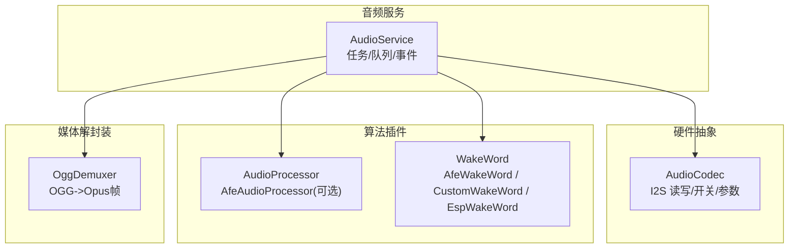
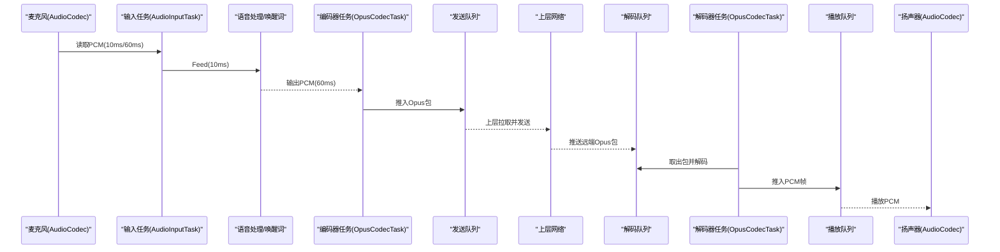
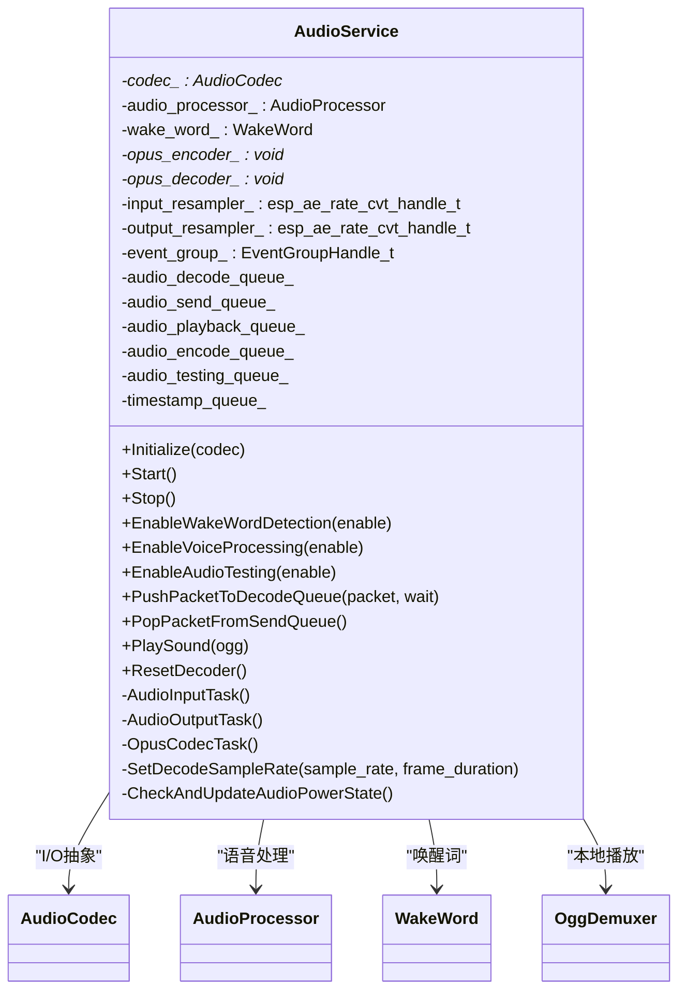
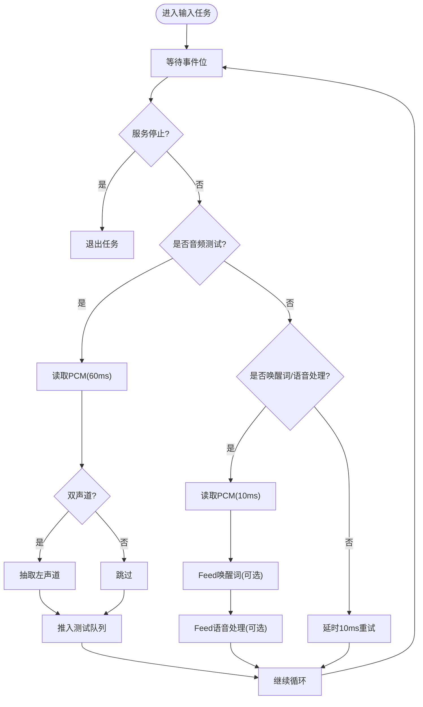
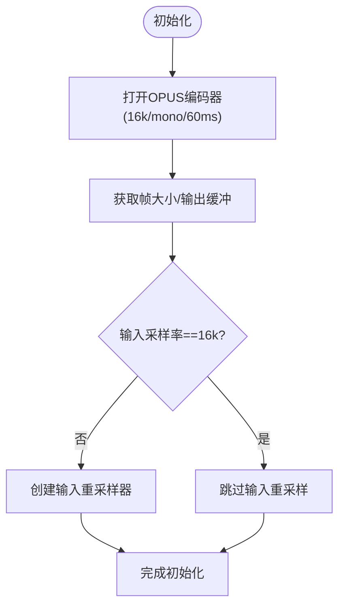
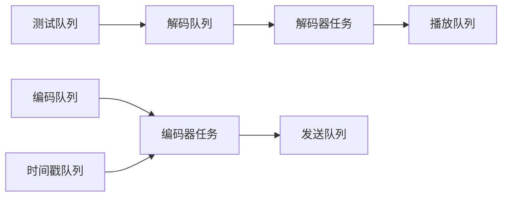
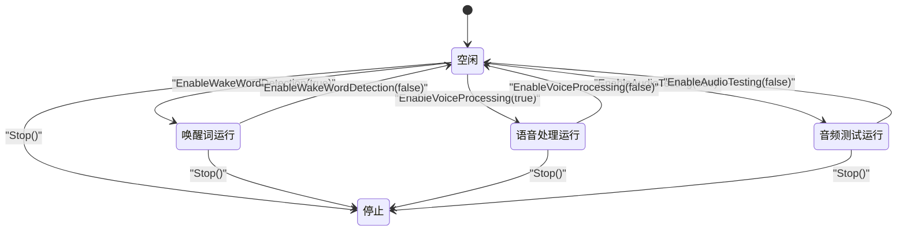
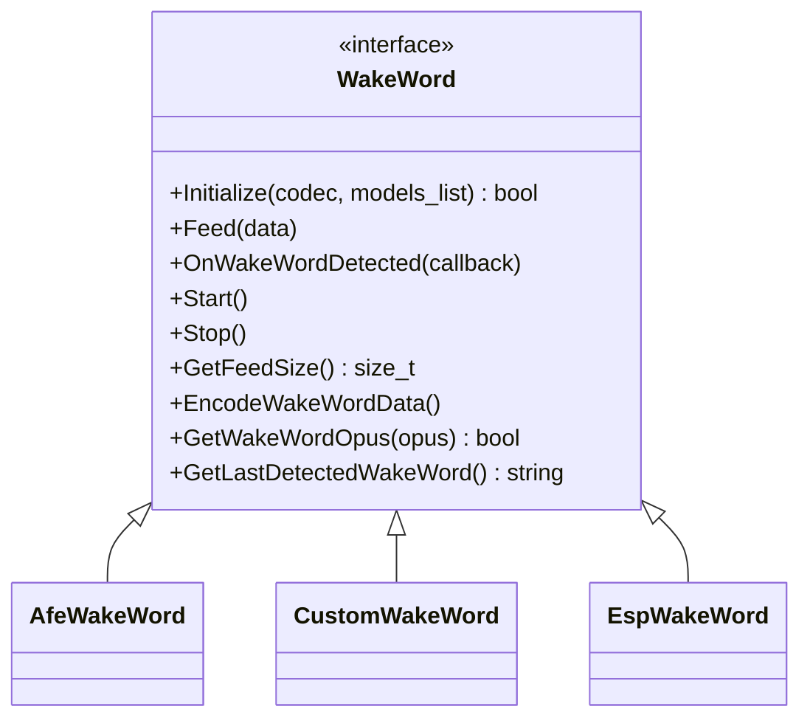
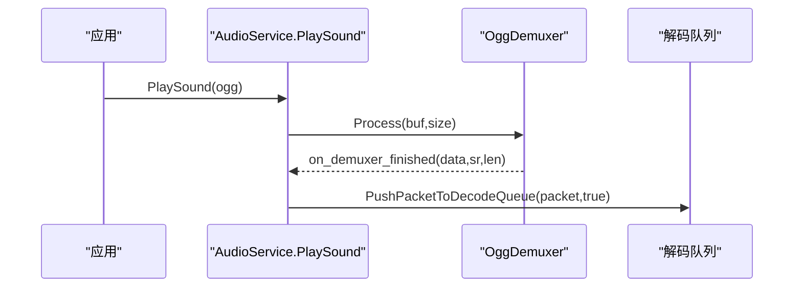
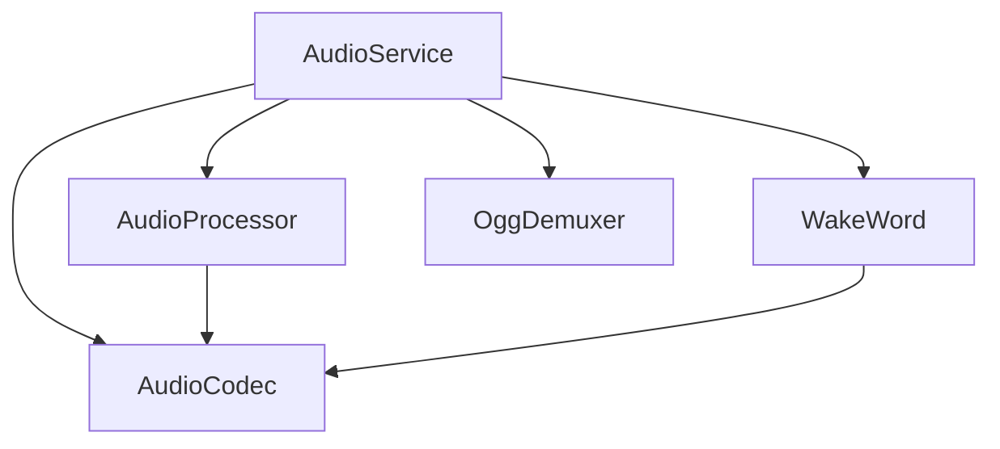

# 音频服务核心

<cite>
**本文引用的文件**   
- [audio_service.h](file://main/audio/audio_service.h)
- [audio_service.cc](file://main/audio/audio_service.cc)
- [audio_codec.h](file://main/audio/audio_codec.h)
- [audio_processor.h](file://main/audio/audio_processor.h)
- [afe_audio_processor.h](file://main/audio/processors/afe_audio_processor.h)
- [wake_word.h](file://main/audio/wake_word.h)
- [afe_wake_word.h](file://main/audio/wake_words/afe_wake_word.h)
- [custom_wake_word.h](file://main/audio/wake_words/custom_wake_word.h)
- [esp_wake_word.h](file://main/audio/wake_words/esp_wake_word.h)
- [ogg_demuxer.h](file://main/audio/demuxer/ogg_demuxer.h)
</cite>

## 目录
1. [简介](#简介)
2. [项目结构](#项目结构)
3. [核心组件](#核心组件)
4. [架构总览](#架构总览)
5. [详细组件分析](#详细组件分析)
6. [依赖关系分析](#依赖关系分析)
7. [性能与实时性](#性能与实时性)
8. [故障排查指南](#故障排查指南)
9. [结论](#结论)
10. [附录：最佳实践与调试统计](#附录最佳实践与调试统计)

## 简介
本文件面向嵌入式端（ESP32 系列）的音频服务核心，围绕 AudioService 类展开，系统性阐述其任务调度、队列管理、事件处理、输入输出并行架构、OPUS 编解码集成、数据流与内存优化、实时性保障、生命周期与错误恢复机制，以及调试统计与延迟优化策略。文档力求在保持技术深度的同时，提供清晰的可视化图示与可操作的排障建议。

## 项目结构
音频服务位于 main/audio 目录下，采用“服务编排 + 插件化处理器/唤醒词”的分层设计：
- 服务编排：AudioService 负责 I/O 任务、编解码任务、队列与事件协调
- 硬件抽象：AudioCodec 封装 I2S 读写、双工能力、采样率/通道等属性
- 算法插件：AudioProcessor（如 AFE 语音增强/AEC/VAD）与 WakeWord（多种实现）通过回调接入
- 解封装：OggDemuxer 用于本地 OGG/Opus 片段播放

图表来源
- [audio_service.h:105-195](file://main/audio/audio_service.h#L105-L195)
- [audio_codec.h:17-59](file://main/audio/audio_codec.h#L17-L59)
- [afe_audio_processor.h:17-46](file://main/audio/processors/afe_audio_processor.h#L17-L46)
- [wake_word.h:11-24](file://main/audio/wake_word.h#L11-L24)
- [ogg_demuxer.h:9-61](file://main/audio/demuxer/ogg_demuxer.h#L9-L61)

章节来源
- [audio_service.h:105-195](file://main/audio/audio_service.h#L105-L195)
- [audio_codec.h:17-59](file://main/audio/audio_codec.h#L17-L59)

## 核心组件
- AudioService：音频服务主类，维护三任务模型（输入、输出、编解码），管理多队列与事件组，协调唤醒词与语音处理插件，封装 OPUS 编解码与重采样。
- AudioCodec：硬件 I/O 抽象，提供输入/输出使能、数据读写、双工与采样率/通道信息。
- AudioProcessor：语音处理插件接口，典型实现为 AfeAudioProcessor，支持 AEC、VAD、降噪等。
- WakeWord：唤醒词检测插件接口，包含 AfeWakeWord、CustomWakeWord、EspWakeWord 三种实现。
- OggDemuxer：轻量 OGG 解封装器，将 OGG 流拆分为 Opus 帧供解码播放。

章节来源
- [audio_service.h:105-195](file://main/audio/audio_service.h#L105-L195)
- [audio_codec.h:17-59](file://main/audio/audio_codec.h#L17-L59)
- [audio_processor.h:11-24](file://main/audio/audio_processor.h#L11-L24)
- [afe_audio_processor.h:17-46](file://main/audio/processors/afe_audio_processor.h#L17-L46)
- [wake_word.h:11-24](file://main/audio/wake_word.h#L11-L24)
- [afe_wake_word.h:22-60](file://main/audio/wake_words/afe_wake_word.h#L22-L60)
- [custom_wake_word.h:20-69](file://main/audio/wake_words/custom_wake_word.h#L20-L69)
- [esp_wake_word.h:17-43](file://main/audio/wake_words/esp_wake_word.h#L17-L43)
- [ogg_demuxer.h:9-61](file://main/audio/demuxer/ogg_demuxer.h#L9-L61)

## 架构总览
AudioService 采用“生产者-消费者”的多队列流水线：
- 上行链路（采集→编码→发送）：麦克风 → 预处理/唤醒词 → 编码器 → 发送队列 → 网络
- 下行链路（接收→解码→播放）：网络 → 解码队列 → 解码器 → 播放队列 → 扬声器
- 测试链路：采集 → 编码 → 测试队列 → 回放（用于离线自检）

图表来源
- [audio_service.cc:230-288](file://main/audio/audio_service.cc#L230-L288)
- [audio_service.cc:327-446](file://main/audio/audio_service.cc#L327-L446)
- [audio_service.cc:290-325](file://main/audio/audio_service.cc#L290-L325)

章节来源
- [audio_service.cc:230-288](file://main/audio/audio_service.cc#L230-L288)
- [audio_service.cc:290-325](file://main/audio/audio_service.cc#L290-L325)
- [audio_service.cc:327-446](file://main/audio/audio_service.cc#L327-L446)

## 详细组件分析

### AudioService 设计与实现
- 任务模型
  - 输入任务：按事件位驱动，分别执行唤醒词/语音处理/音频测试路径；统一从 AudioCodec 读取 PCM，必要时进行降采样/单声道抽取。
  - 输出任务：阻塞等待播放队列，调用 AudioCodec 输出 PCM，并记录时间戳用于服务器 AEC。
  - 编解码任务：高优先级，负责解码网络包到播放队列、编码本地 PCM 到发送/测试队列。
- 队列与同步
  - 使用互斥量+条件变量保护多队列（解码、发送、播放、编码、测试）。
  - 关键常量控制队列深度与并发度，避免溢出与抖动。
- 事件系统
  - 使用 FreeRTOS EventGroup 标志位控制输入任务的分支行为（唤醒词运行、语音处理运行、音频测试运行）。
- 编解码与重采样
  - 初始化时打开 OPUS 编解码器，计算帧大小与输出缓冲。
  - 根据 Codec 输入/输出采样率动态创建/重置重采样器。
  - 解码路径支持动态切换目标采样率与帧时长，必要时重建解码器与输出重采样器。
- 唤醒词与语音处理
  - 通过 SetModelsList 选择具体实现（AfeWakeWord/CustomWakeWord/EspWakeWord）。
  - 启用/禁用功能时，会重置输入重采样器以清除缓存，防止不同 feed size 切换导致的溢出。
- 电源与时钟管理
  - 周期性定时器检查最近输入/输出时间，超过阈值自动关闭对应 I/O，降低功耗。
  - 全双工场景下谨慎关闭 TX 时钟，避免某些板卡 RX 停滞。
- 调试与统计
  - 统计输入/解码/编码/播放计数，便于定位瓶颈。
  - 可选音频调试模块可注入原始 PCM 数据。

图表来源
- [audio_service.h:105-195](file://main/audio/audio_service.h#L105-L195)
- [audio_service.cc:62-123](file://main/audio/audio_service.cc#L62-L123)
- [audio_service.cc:125-167](file://main/audio/audio_service.cc#L125-L167)
- [audio_service.cc:448-482](file://main/audio/audio_service.cc#L448-L482)
- [audio_service.cc:682-698](file://main/audio/audio_service.cc#L682-L698)

章节来源
- [audio_service.h:105-195](file://main/audio/audio_service.h#L105-L195)
- [audio_service.cc:62-123](file://main/audio/audio_service.cc#L62-L123)
- [audio_service.cc:125-167](file://main/audio/audio_service.cc#L125-L167)
- [audio_service.cc:230-288](file://main/audio/audio_service.cc#L230-L288)
- [audio_service.cc:290-325](file://main/audio/audio_service.cc#L290-L325)
- [audio_service.cc:327-446](file://main/audio/audio_service.cc#L327-L446)
- [audio_service.cc:448-482](file://main/audio/audio_service.cc#L448-L482)
- [audio_service.cc:682-698](file://main/audio/audio_service.cc#L682-L698)

### 音频输入输出任务与并行架构
- 输入任务
  - 依据事件位决定走唤醒词或语音处理路径；音频测试模式直接编码至测试队列。
  - 对双声道输入做左声道抽取，保证后续处理为单声道。
- 输出任务
  - 从播放队列取 PCM 帧写入 I2S；若输出未开启则按需开启，并更新最后输出时间。
- 编解码任务
  - 优先处理解码路径，确保播放流畅；其次处理编码路径，限制发送队列长度。
  - 解码后可能触发输出重采样，以匹配硬件输出采样率。

图表来源
- [audio_service.cc:230-288](file://main/audio/audio_service.cc#L230-L288)

章节来源
- [audio_service.cc:230-288](file://main/audio/audio_service.cc#L230-L288)
- [audio_service.cc:290-325](file://main/audio/audio_service.cc#L290-L325)
- [audio_service.cc:327-446](file://main/audio/audio_service.cc#L327-L446)

### OPUS 编解码器集成与配置
- 编码器
  - 固定 16kHz、单声道、16bit，帧长 60ms，启用 VBR、DTX，应用模式为音频。
  - 获取每帧 PCM 样本数与最大输出缓冲大小，用于分配临时缓冲区。
- 解码器
  - 初始按输出采样率与 60ms 帧长打开；支持运行时动态切换采样率/帧长，必要时重建解码器与输出重采样器。
- 重采样
  - 输入重采样：当 Codec 输入采样率非 16kHz 时使用，确保喂给处理器的帧长为 10ms。
  - 输出重采样：当解码采样率与硬件输出不一致时使用，确保 I2S 播放稳定。

图表来源
- [audio_service.cc:62-123](file://main/audio/audio_service.cc#L62-L123)
- [audio_service.cc:448-482](file://main/audio/audio_service.cc#L448-L482)

章节来源
- [audio_service.cc:62-123](file://main/audio/audio_service.cc#L62-L123)
- [audio_service.cc:448-482](file://main/audio/audio_service.cc#L448-L482)

### 音频数据流管理与队列机制
- 队列定义
  - 解码队列：存放来自网络的 Opus 包
  - 发送队列：存放已编码的 Opus 包，供上层拉取发送
  - 播放队列：存放待播放的 PCM 帧
  - 编码队列：存放待编码的 PCM 任务
  - 测试队列：存放测试路径的 Opus 包
- 容量与背压
  - 通过常量限制各队列最大长度，结合条件变量实现阻塞式生产/消费，避免内存暴涨与丢帧。
- 时间戳对齐（服务器 AEC）
  - 输出任务记录播放时间戳，编码任务从时间戳队列中取出并绑定到发送包，便于服务端回声消除。

图表来源
- [audio_service.h:163-176](file://main/audio/audio_service.h#L163-L176)
- [audio_service.cc:484-504](file://main/audio/audio_service.cc#L484-L504)
- [audio_service.cc:506-518](file://main/audio/audio_service.cc#L506-L518)
- [audio_service.cc:520-529](file://main/audio/audio_service.cc#L520-L529)

章节来源
- [audio_service.h:163-176](file://main/audio/audio_service.h#L163-L176)
- [audio_service.cc:484-504](file://main/audio/audio_service.cc#L484-L504)
- [audio_service.cc:506-518](file://main/audio/audio_service.cc#L506-L518)
- [audio_service.cc:520-529](file://main/audio/audio_service.cc#L520-L529)

### 事件处理系统与生命周期管理
- 事件位
  - 音频测试运行、唤醒词运行、语音处理运行、播放队列非空等标志位控制输入任务分支。
- 启动/停止
  - Start 创建三个任务并启动周期定时器；Stop 清理队列、设置停止标志并通知所有等待者。
- 动态启停
  - EnableWakeWordDetection/EnableVoiceProcessing/EnableAudioTesting 通过事件位与内部状态机控制工作模式。
- 解码器复位
  - ResetDecoder 清空相关队列并重置解码器状态，用于会话切换或异常恢复。

图表来源
- [audio_service.cc:125-167](file://main/audio/audio_service.cc#L125-L167)
- [audio_service.cc:169-182](file://main/audio/audio_service.cc#L169-L182)
- [audio_service.cc:549-617](file://main/audio/audio_service.cc#L549-L617)
- [audio_service.cc:668-680](file://main/audio/audio_service.cc#L668-L680)

章节来源
- [audio_service.cc:125-167](file://main/audio/audio_service.cc#L125-L167)
- [audio_service.cc:169-182](file://main/audio/audio_service.cc#L169-L182)
- [audio_service.cc:549-617](file://main/audio/audio_service.cc#L549-L617)
- [audio_service.cc:668-680](file://main/audio/audio_service.cc#L668-L680)

### 唤醒词与语音处理插件
- 插件选择
  - 根据模型列表前缀选择 AfeWakeWord、CustomWakeWord 或 EspWakeWord。
- 回调与输出
  - 唤醒词检测到结果通过回调上报；语音处理通过 OnOutput 回调将处理后的 PCM 送入编码队列。
- 设备 AEC
  - 通过 EnableDeviceAec 控制底层 AEC 开关，需先初始化语音处理模块。

图表来源
- [wake_word.h:11-24](file://main/audio/wake_word.h#L11-L24)
- [afe_wake_word.h:22-60](file://main/audio/wake_words/afe_wake_word.h#L22-L60)
- [custom_wake_word.h:20-69](file://main/audio/wake_words/custom_wake_word.h#L20-L69)
- [esp_wake_word.h:17-43](file://main/audio/wake_words/esp_wake_word.h#L17-L43)

章节来源
- [audio_service.cc:700-726](file://main/audio/audio_service.cc#L700-L726)
- [wake_word.h:11-24](file://main/audio/wake_word.h#L11-L24)
- [afe_wake_word.h:22-60](file://main/audio/wake_words/afe_wake_word.h#L22-L60)
- [custom_wake_word.h:20-69](file://main/audio/wake_words/custom_wake_word.h#L20-L69)
- [esp_wake_word.h:17-43](file://main/audio/wake_words/esp_wake_word.h#L17-L43)

### 本地播放与 OGG 解封装
- PlaySound 流程
  - 构造 OggDemuxer，注册解封装完成回调；将每个 Opus 帧打包为 AudioStreamPacket 推入解码队列。
- 解封装器
  - 基于状态机解析 OGG 页头、段表与数据体，使用固定缓冲区避免频繁分配。

图表来源
- [audio_service.cc:633-654](file://main/audio/audio_service.cc#L633-L654)
- [ogg_demuxer.h:42-61](file://main/audio/demuxer/ogg_demuxer.h#L42-L61)

章节来源
- [audio_service.cc:633-654](file://main/audio/audio_service.cc#L633-L654)
- [ogg_demuxer.h:42-61](file://main/audio/demuxer/ogg_demuxer.h#L42-L61)

## 依赖关系分析
- 低耦合接口
  - AudioService 仅依赖 AudioCodec、AudioProcessor、WakeWord 的抽象接口，便于替换实现。
- 外部库
  - ESP-IDF 的 OPUS 编解码 API、重采样库、FreeRTOS 任务/事件/定时器。
- 潜在循环依赖
  - 当前无直接循环依赖；插件通过回调与队列交互，避免反向引用。

图表来源
- [audio_service.h:105-195](file://main/audio/audio_service.h#L105-L195)
- [audio_codec.h:17-59](file://main/audio/audio_codec.h#L17-L59)
- [audio_processor.h:11-24](file://main/audio/audio_processor.h#L11-L24)
- [wake_word.h:11-24](file://main/audio/wake_word.h#L11-L24)
- [ogg_demuxer.h:9-61](file://main/audio/demuxer/ogg_demuxer.h#L9-L61)

章节来源
- [audio_service.h:105-195](file://main/audio/audio_service.h#L105-L195)
- [audio_codec.h:17-59](file://main/audio/audio_codec.h#L17-L59)
- [audio_processor.h:11-24](file://main/audio/audio_processor.h#L11-L24)
- [wake_word.h:11-24](file://main/audio/wake_word.h#L11-L24)
- [ogg_demuxer.h:9-61](file://main/audio/demuxer/ogg_demuxer.h#L9-L61)

## 性能与实时性
- 任务优先级
  - 编解码任务优先级高于 I/O 任务，确保编解码及时吞吐，减少端到端延迟。
- 队列容量
  - 解码/发送/播放/编码队列均有限制，配合条件变量实现背压，避免突发导致抖动。
- 帧长与码率
  - 默认 60ms 帧长，平衡延迟与压缩效率；VBR 自适应码率，DTX 抑制静音带宽占用。
- 重采样复杂度
  - 输入/输出重采样器仅在采样率不匹配时启用，且使用速度优先配置，降低 CPU 开销。
- 电源与时钟
  - 长时间无 I/O 自动关闭输入/输出，降低功耗；全双工场景保留 TX 时钟避免 RX 停滞。

[本节为通用性能讨论，无需特定文件来源]

## 故障排查指南
- 常见问题
  - 解码失败：检查解码器是否成功打开、输入包长度是否为整帧、目标采样率/帧长是否与解码器一致。
  - 编码失败：确认输入 PCM 帧大小等于编码器期望值，编码器已正确初始化。
  - 播放卡顿：检查播放队列是否长期为空或过长，调整上层拉取频率与网络抖动容忍。
  - 唤醒词无响应：确认唤醒词已初始化、输入重采样器已 reset、事件位已置位。
- 日志与断点
  - 关注编解码返回码与队列满/空告警；在条件变量等待处加断点观察唤醒条件。
- 恢复策略
  - 使用 ResetDecoder 清空队列并重置解码器；必要时重启服务以释放资源。

章节来源
- [audio_service.cc:384-391](file://main/audio/audio_service.cc#L384-L391)
- [audio_service.cc:434-440](file://main/audio/audio_service.cc#L434-L440)
- [audio_service.cc:668-680](file://main/audio/audio_service.cc#L668-L680)

## 结论
AudioService 通过清晰的任务划分、严格的队列边界与事件驱动，实现了稳定的上下行音频流水线。OPUS 编解码与重采样在嵌入式平台上兼顾了质量与实时性；插件化的唤醒词与语音处理提升了可扩展性。配合完善的生命周期管理与电源策略，系统在低功耗与高性能之间取得良好平衡。

[本节为总结性内容，无需特定文件来源]

## 附录：最佳实践与调试统计
- 延迟优化
  - 合理设置帧长（如 60ms）与队列上限；在网络侧尽量小步拉取发送队列，避免积压。
  - 解码后立即重采样到硬件采样率，减少播放阶段额外处理。
- 缓冲区管理
  - 使用固定大小缓冲区与对象池（如 OGG 解封装器）减少动态分配；避免跨任务大对象拷贝。
- 调试统计
  - 利用内置计数器统计输入/解码/编码/播放次数，结合时间戳估算端到端延迟。
  - 在关键路径打点（如解码开始/结束、播放开始/结束），绘制延迟分布直方图。
- 回退与容错
  - 网络丢包时允许解码器恢复；队列满时上层应暂停写入或丢弃旧包。
  - 长时间无活动自动关闭 I/O，有活动时再按需开启，节省功耗。

章节来源
- [audio_service.cc:215-228](file://main/audio/audio_service.cc#L215-L228)
- [audio_service.cc:311-322](file://main/audio/audio_service.cc#L311-L322)
- [audio_service.cc:682-698](file://main/audio/audio_service.cc#L682-L698)