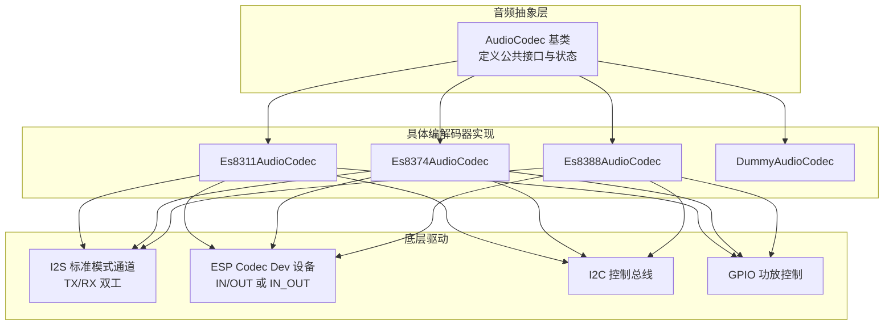
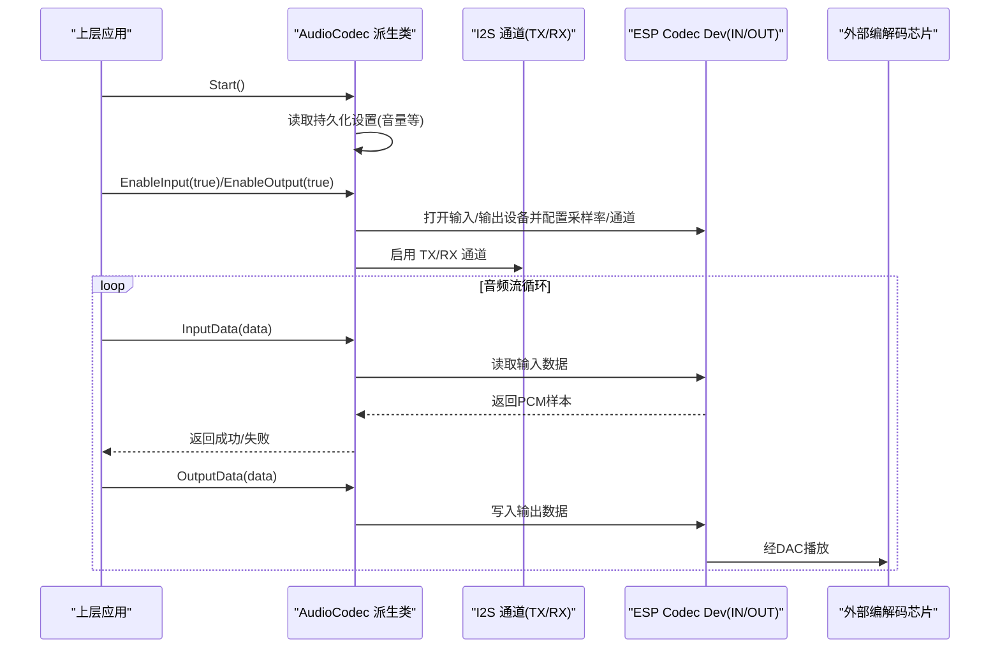
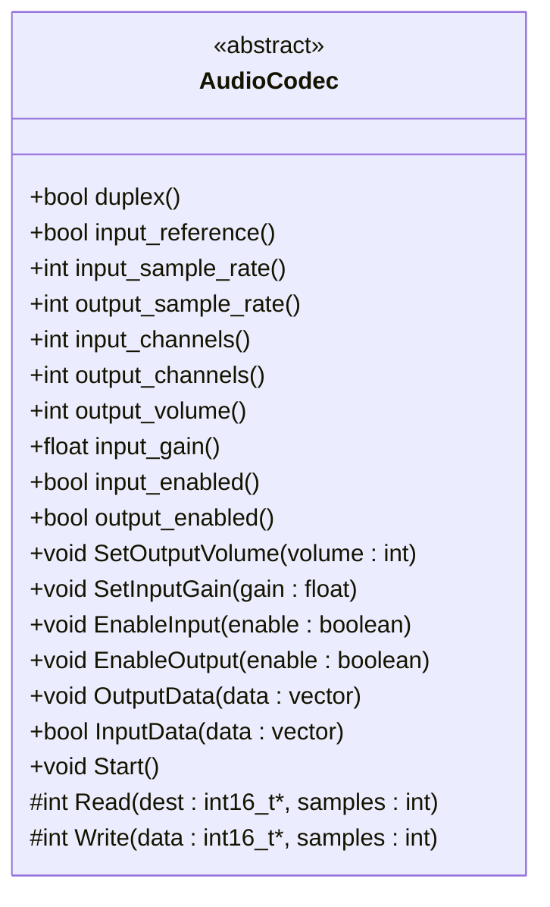
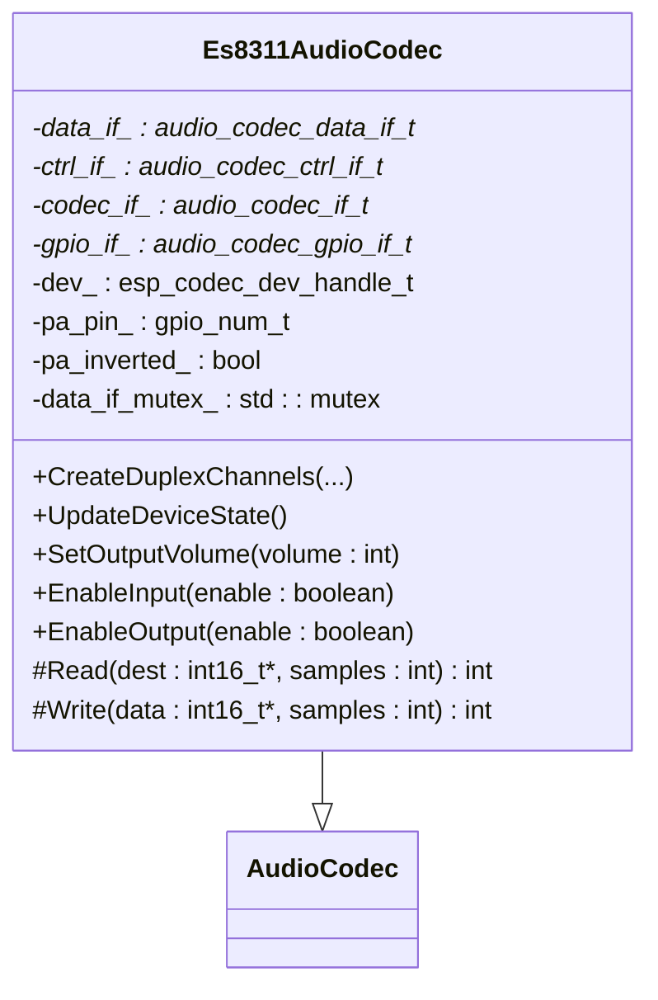
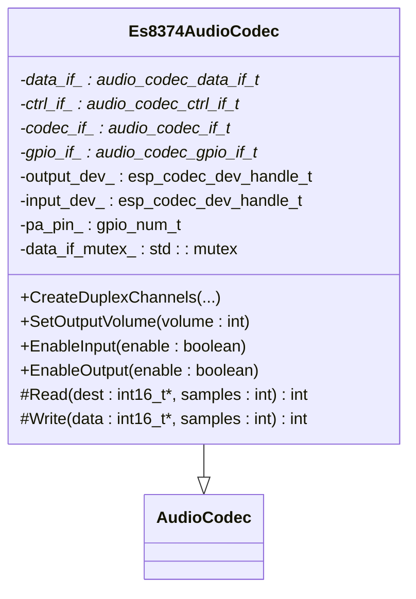
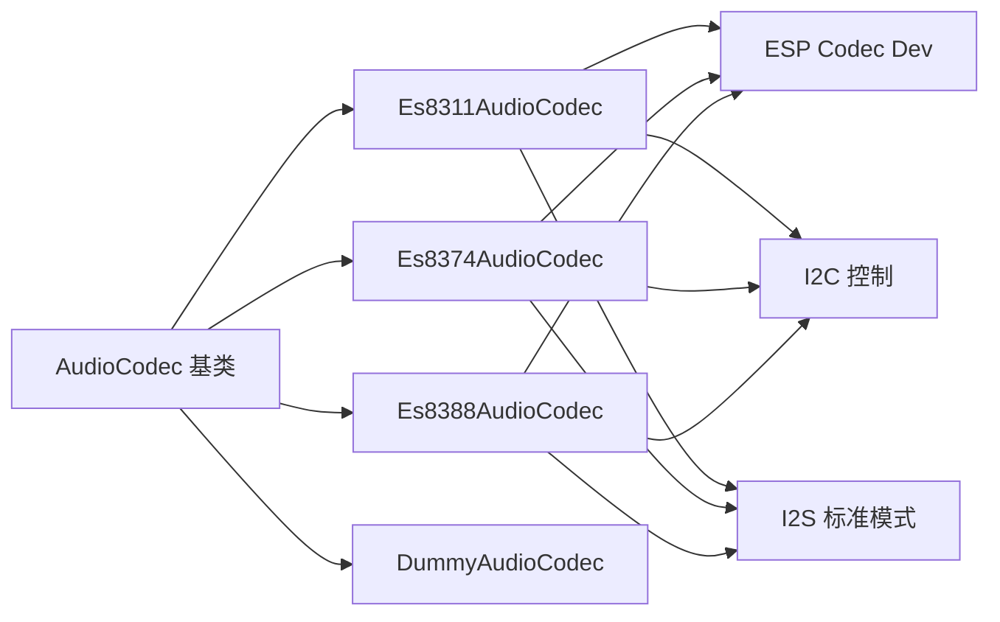

# AudioCodec抽象接口

<cite>
**本文引用的文件列表**
- [audio_codec.h](file://main/audio/audio_codec.h)
- [audio_codec.cc](file://main/audio/audio_codec.cc)
- [es8311_audio_codec.h](file://main/audio/codecs/es8311_audio_codec.h)
- [es8311_audio_codec.cc](file://main/audio/codecs/es8311_audio_codec.cc)
- [es8374_audio_codec.h](file://main/audio/codecs/es8374_audio_codec.h)
- [es8374_audio_codec.cc](file://main/audio/codecs/es8374_audio_codec.cc)
- [es8388_audio_codec.h](file://main/audio/codecs/es8388_audio_codec.h)
- [es8388_audio_codec.cc](file://main/audio/codecs/es8388_audio_codec.cc)
- [dummy_audio_codec.h](file://main/audio/codecs/dummy_audio_codec.h)
- [dummy_audio_codec.cc](file://main/audio/codecs/dummy_audio_codec.cc)
</cite>

## 目录
1. [简介](#简介)
2. [项目结构](#项目结构)
3. [核心组件](#核心组件)
4. [架构总览](#架构总览)
5. [详细组件分析](#详细组件分析)
6. [依赖关系分析](#依赖关系分析)
7. [性能考量](#性能考量)
8. [故障排查指南](#故障排查指南)
9. [结论](#结论)
10. [附录：新编解码器适配开发指南](#附录新编解码器适配开发指南)

## 简介
本文件围绕 AudioCodec 抽象接口进行系统化技术文档编写，重点阐述基类设计理念、虚函数接口规范与实现机制，覆盖 I2S 音频接口初始化流程、DMA 缓冲区配置、双工模式支持，以及输入输出采样率、通道数、音量控制等关键参数管理。同时提供新编解码器的完整适配指南，包括必须实现的纯虚函数 Read 和 Write，并给出错误处理、资源管理与性能优化的最佳实践。

## 项目结构
AudioCodec 抽象层位于 main/audio 目录下，具体硬件驱动实现位于 main/audio/codecs 子目录中。基类定义公共接口与通用行为，各具体编解码器（如 ES8311、ES8374、ES8388）继承该基类，完成底层 I2S/ESP Codec Dev 的初始化与数据通路对接。Dummy 编解码器用于无硬件环境下的测试与仿真。

图表来源
- [audio_codec.h:17-59](file://main/audio/audio_codec.h#L17-L59)
- [es8311_audio_codec.h:13-40](file://main/audio/codecs/es8311_audio_codec.h#L13-L40)
- [es8374_audio_codec.h:13-39](file://main/audio/codecs/es8374_audio_codec.h#L13-L39)
- [es8388_audio_codec.h:12-38](file://main/audio/codecs/es8388_audio_codec.h#L12-L38)
- [dummy_audio_codec.h:6-14](file://main/audio/codecs/dummy_audio_codec.h#L6-L14)

章节来源
- [audio_codec.h:17-59](file://main/audio/audio_codec.h#L17-L59)
- [audio_codec.cc:17-68](file://main/audio/audio_codec.cc#L17-L68)

## 核心组件
AudioCodec 基类定义了统一的音频编解码抽象接口，屏蔽不同硬件差异，向上层提供一致的输入输出能力。其设计要点如下：
- 统一的数据访问接口：OutputData/InputData 以 int16_t 向量形式读写帧数据。
- 运行时控制接口：SetOutputVolume/SetInputGain/EnableInput/EnableOutput 控制音量、增益与通道开关。
- 生命周期接口：Start 启动编解码器，子类可在此加载持久化设置或执行一次性初始化。
- 纯虚函数扩展点：Read/Write 由具体编解码器实现，负责底层 I2S/Codec Dev 的数据收发。
- 状态与参数：duplex/input_reference/input_sample_rate/output_sample_rate/input_channels/output_channels/output_volume/input_gain/input_enabled/output_enabled 等属性贯穿上层逻辑。

章节来源
- [audio_codec.h:17-59](file://main/audio/audio_codec.h#L17-L59)
- [audio_codec.cc:17-68](file://main/audio/audio_codec.cc#L17-L68)

## 架构总览
AudioCodec 通过 I2S 标准模式创建 TX/RX 双工通道，使用 ESP Codec Dev 封装对具体编解码芯片的控制与数据路径。具体实现类在 EnableInput/EnableOutput 时按需打开/关闭 esp_codec_dev 实例，并在 Read/Write 中调用底层 read/write 完成数据搬运。

图表来源
- [audio_codec.cc:29-38](file://main/audio/audio_codec.cc#L29-L38)
- [es8311_audio_codec.cc:100-156](file://main/audio/codecs/es8311_audio_codec.cc#L100-L156)
- [es8311_audio_codec.cc:190-202](file://main/audio/codecs/es8311_audio_codec.cc#L190-L202)
- [es8374_audio_codec.cc:76-132](file://main/audio/codecs/es8374_audio_codec.cc#L76-L132)
- [es8374_audio_codec.cc:188-200](file://main/audio/codecs/es8374_audio_codec.cc#L188-L200)
- [es8388_audio_codec.cc:85-137](file://main/audio/codecs/es8388_audio_codec.cc#L85-L137)
- [es8388_audio_codec.cc:208-221](file://main/audio/codecs/es8388_audio_codec.cc#L208-L221)

## 详细组件分析

### AudioCodec 基类设计与接口规范
- 数据访问
  - OutputData：将上层提供的 PCM 帧转发到 Write。
  - InputData：调用 Read 获取 PCM 帧，并根据返回样本数判断是否成功。
- 控制接口
  - SetOutputVolume：更新输出音量并持久化保存；具体实现可在运行期同步到底层寄存器。
  - SetInputGain：更新输入增益；具体实现需在下一次打开输入设备时生效。
  - EnableInput/EnableOutput：切换输入/输出使能，具体实现会打开/关闭 esp_codec_dev 并控制 PA 引脚。
- 生命周期
  - Start：从 Settings 加载输出音量默认值并进行校验，记录日志。
- 纯虚函数
  - Read/Write：必须由派生类实现，负责底层数据读写。

图表来源
- [audio_codec.h:17-59](file://main/audio/audio_codec.h#L17-L59)
- [audio_codec.cc:17-68](file://main/audio/audio_codec.cc#L17-L68)

章节来源
- [audio_codec.h:17-59](file://main/audio/audio_codec.h#L17-L59)
- [audio_codec.cc:17-68](file://main/audio/audio_codec.cc#L17-L68)

### Es8311AudioCodec 实现要点
- 双工模式：构造函数中设置 duplex_=true，input_channels_=1，并断言输入输出采样率一致。
- I2S 通道：CreateDuplexChannels 使用 I2S_NUM_0 主模式，配置 MCLK/BCLK/WS/DIN/DOUT，开启 TX/RX。
- 设备对象：使用单一 esp_codec_dev_handle_t 表示 IN_OUT 模式，EnableInput/EnableOutput 时根据状态打开/关闭设备。
- 音量与增益：SetOutputVolume 直接调用底层设置；EnableInput 时设置输入增益。
- 数据通路：Read/Write 在对应通道使能时调用底层 read/write。

图表来源
- [es8311_audio_codec.h:13-40](file://main/audio/codecs/es8311_audio_codec.h#L13-L40)
- [es8311_audio_codec.cc:7-59](file://main/audio/codecs/es8311_audio_codec.cc#L7-L59)
- [es8311_audio_codec.cc:70-98](file://main/audio/codecs/es8311_audio_codec.cc#L70-L98)
- [es8311_audio_codec.cc:100-156](file://main/audio/codecs/es8311_audio_codec.cc#L100-L156)
- [es8311_audio_codec.cc:158-202](file://main/audio/codecs/es8311_audio_codec.cc#L158-L202)

章节来源
- [es8311_audio_codec.h:13-40](file://main/audio/codecs/es8311_audio_codec.h#L13-L40)
- [es8311_audio_codec.cc:7-59](file://main/audio/codecs/es8311_audio_codec.cc#L7-L59)
- [es8311_audio_codec.cc:70-98](file://main/audio/codecs/es8311_audio_codec.cc#L70-L98)
- [es8311_audio_codec.cc:100-156](file://main/audio/codecs/es8311_audio_codec.cc#L100-L156)
- [es8311_audio_codec.cc:158-202](file://main/audio/codecs/es8311_audio_codec.cc#L158-L202)

### Es8374AudioCodec 实现要点
- 独立设备对象：分别维护 output_dev_ 与 input_dev_，EnableInput/EnableOutput 各自打开/关闭对应设备。
- I2S 通道：与 ES8311 类似，使用 I2S_NUM_0 主模式，配置时钟与槽位。
- 音量与增益：SetOutputVolume 直接设置输出音量；EnableInput 时设置输入增益。
- 数据通路：Read/Write 在对应通道使能时调用底层 read/write。

图表来源
- [es8374_audio_codec.h:13-39](file://main/audio/codecs/es8374_audio_codec.h#L13-L39)
- [es8374_audio_codec.cc:7-62](file://main/audio/codecs/es8374_audio_codec.cc#L7-L62)
- [es8374_audio_codec.cc:76-132](file://main/audio/codecs/es8374_audio_codec.cc#L76-L132)
- [es8374_audio_codec.cc:134-200](file://main/audio/codecs/es8374_audio_codec.cc#L134-L200)

章节来源
- [es8374_audio_codec.h:13-39](file://main/audio/codecs/es8374_audio_codec.h#L13-L39)
- [es8374_audio_codec.cc:7-62](file://main/audio/codecs/es8374_audio_codec.cc#L7-L62)
- [es8374_audio_codec.cc:76-132](file://main/audio/codecs/es8374_audio_codec.cc#L76-L132)
- [es8374_audio_codec.cc:134-200](file://main/audio/codecs/es8374_audio_codec.cc#L134-L200)

### Es8388AudioCodec 实现要点
- 参考输入支持：input_reference_ 控制是否启用参考通道，影响 input_channels_ 与输入设备 channel_mask。
- 独立设备对象：output_dev_ 与 input_dev_ 分别管理，EnableInput/EnableOutput 各自打开/关闭。
- 寄存器微调：输出时设置模拟输出音量寄存器为 0dB；输入参考模式下通过 ctrl_if 写寄存器配置增益。
- 数据通路：Read/Write 在对应通道使能时调用底层 read/write。

图表来源
- [es8388_audio_codec.h:12-38](file://main/audio/codecs/es8388_audio_codec.h#L12-L38)
- [es8388_audio_codec.cc:7-71](file://main/audio/codecs/es8388_audio_codec.cc#L7-L71)
- [es8388_audio_codec.cc:85-137](file://main/audio/codecs/es8388_audio_codec.cc#L85-L137)
- [es8388_audio_codec.cc:139-221](file://main/audio/codecs/es8388_audio_codec.cc#L139-L221)

章节来源
- [es8388_audio_codec.h:12-38](file://main/audio/codecs/es8388_audio_codec.h#L12-L38)
- [es8388_audio_codec.cc:7-71](file://main/audio/codecs/es8388_audio_codec.cc#L7-L71)
- [es8388_audio_codec.cc:85-137](file://main/audio/codecs/es8388_audio_codec.cc#L85-L137)
- [es8388_audio_codec.cc:139-221](file://main/audio/codecs/es8388_audio_codec.cc#L139-L221)

### DummyAudioCodec 实现要点
- 用于无硬件环境的测试与仿真，不实际读写 I2S/Codec Dev。
- Read/Write 直接返回 0，表示无数据可用或不进行传输。

章节来源
- [dummy_audio_codec.h:6-14](file://main/audio/codecs/dummy_audio_codec.h#L6-L14)
- [dummy_audio_codec.cc:1-21](file://main/audio/codecs/dummy_audio_codec.cc#L1-L21)

## 依赖关系分析
- 基类依赖
  - FreeRTOS 事件组与 I2S 标准模式头文件。
  - board.h 与 settings.h 用于板级信息与持久化设置。
- 具体实现依赖
  - ESP Codec Dev 及其默认接口（i2s/i2c/gpio）。
  - I2C 主控句柄与地址、GPIO 功放控制引脚。
- 耦合与内聚
  - 基类仅暴露高层接口，具体实现内部细节被良好封装，内聚性高。
  - 各实现之间通过相同基类接口解耦，便于替换与扩展。

图表来源
- [audio_codec.h:17-59](file://main/audio/audio_codec.h#L17-L59)
- [es8311_audio_codec.cc:7-59](file://main/audio/codecs/es8311_audio_codec.cc#L7-L59)
- [es8374_audio_codec.cc:7-62](file://main/audio/codecs/es8374_audio_codec.cc#L7-L62)
- [es8388_audio_codec.cc:7-71](file://main/audio/codecs/es8388_audio_codec.cc#L7-L71)

章节来源
- [audio_codec.h:17-59](file://main/audio/audio_codec.h#L17-L59)
- [audio_codec.cc:17-68](file://main/audio/audio_codec.cc#L17-L68)

## 性能考量
- DMA 缓冲与帧大小
  - 基类定义 AUDIO_CODEC_DMA_DESC_NUM=6、AUDIO_CODEC_DMA_FRAME_NUM=240，作为默认 DMA 描述符数量与每帧样本数，兼顾吞吐与延迟。
- I2S 时钟与对齐
  - 使用 I2S_MCLK_MULTIPLE_256 与 16bit 数据位宽，slot_mode 为立体声但单声道数据按双槽发送，确保与多数编解码芯片兼容。
- 设备打开/关闭策略
  - ES8311 采用 IN_OUT 单设备，减少重复配置开销；ES8374/ES8388 采用独立 IN/OUT 设备，便于精细控制。
- 锁保护
  - 具体实现在 EnableInput/EnableOutput 中使用互斥锁保护 data_if 相关操作，避免并发冲突。
- 功耗与静音
  - 未使能通道时关闭 esp_codec_dev，降低功耗；部分实现通过 PA 引脚控制功放电源。

章节来源
- [audio_codec.h:14-16](file://main/audio/audio_codec.h#L14-L16)
- [es8311_audio_codec.cc:100-156](file://main/audio/codecs/es8311_audio_codec.cc#L100-L156)
- [es8374_audio_codec.cc:76-132](file://main/audio/codecs/es8374_audio_codec.cc#L76-L132)
- [es8388_audio_codec.cc:85-137](file://main/audio/codecs/es8388_audio_codec.cc#L85-L137)

## 故障排查指南
- 启动阶段
  - 检查 Start 是否正确加载输出音量，若小于等于 0 会被重置为默认值并记录警告日志。
- 通道使能
  - EnableInput/EnableOutput 应成对调用，确保输入输出设备正确打开/关闭；注意 PA 引脚电平变化。
- 数据读写
  - InputData 返回 false 表示未读到有效样本，需检查输入使能与底层 read 返回值。
  - OutputData 未产生声音时，确认输出使能与底层 write 是否被调用。
- 寄存器与增益
  - ES8388 参考输入模式需通过 ctrl_if 写寄存器配置增益；输出时需设置模拟输出音量寄存器。
- 错误处理
  - 大量使用 ESP_ERROR_CHECK 与 ESP_ERROR_CHECK_WITHOUT_ABORT，出现异常时应查看日志 TAG 定位问题。

章节来源
- [audio_codec.cc:29-46](file://main/audio/audio_codec.cc#L29-L46)
- [es8311_audio_codec.cc:158-202](file://main/audio/codecs/es8311_audio_codec.cc#L158-L202)
- [es8374_audio_codec.cc:134-200](file://main/audio/codecs/es8374_audio_codec.cc#L134-L200)
- [es8388_audio_codec.cc:139-221](file://main/audio/codecs/es8388_audio_codec.cc#L139-L221)

## 结论
AudioCodec 抽象接口通过清晰的虚函数契约与通用的状态管理，屏蔽了不同编解码芯片的差异，提供了稳定的输入输出能力。具体实现基于 ESP Codec Dev 与 I2S 标准模式，合理配置 DMA 缓冲与时钟，支持双工模式与参考输入。遵循本文档的适配指南与最佳实践，可快速集成新的编解码器并保持系统的一致性与可维护性。

## 附录：新编解码器适配开发指南
- 必要步骤
  - 新建派生类继承 AudioCodec，声明并实现纯虚函数 Read/Write。
  - 在构造函数中设置 duplex_/input_reference_/input_channels_/input_sample_rate_/output_sample_rate_/input_gain_ 等参数。
  - 实现 CreateDuplexChannels：使用 i2s_new_channel 创建 TX/RX 双工通道，配置 I2S 标准模式（MCLK/BCLK/WS/DIN/DOUT），并启用通道。
  - 初始化 ESP Codec Dev 接口：创建 data_if(ctrl_if/gpio_if)，构造 codec_if（如 es83xx_codec_new），必要时创建独立的 input_dev_ 与 output_dev_。
  - 实现 SetOutputVolume：在运行期调用底层设置输出音量，并调用基类方法更新状态。
  - 实现 EnableInput/EnableOutput：根据使能状态打开/关闭 esp_codec_dev，设置采样率、通道数、增益与 PA 引脚电平。
  - 实现 Read/Write：在对应通道使能时调用 esp_codec_dev_read/write，返回样本数。
- 关键参数管理
  - 输入输出采样率：通常要求一致，构造函数中可做断言校验。
  - 通道数：普通模式为单声道，参考输入模式为双声道，需在 open 时设置 channel/channel_mask。
  - 音量与增益：输出音量可通过 API 实时调整；输入增益在打开输入设备时设置。
- 错误处理与资源管理
  - 所有底层调用建议使用 ESP_ERROR_CHECK 或 ESP_ERROR_CHECK_WITHOUT_ABORT，并记录日志以便定位。
  - 析构函数中释放 esp_codec_dev、data_if、ctrl_if、gpio_if、codec_if 等资源。
  - 使用互斥锁保护并发访问，避免在数据路径中发生竞态条件。
- 性能优化建议
  - 合理配置 DMA 描述符与帧大小，平衡吞吐与延迟。
  - 仅在需要时打开 esp_codec_dev，减少不必要的配置开销。
  - 避免在高频路径中进行动态内存分配，尽量复用缓冲区。
- 验证与测试
  - 使用 DummyAudioCodec 在无硬件环境下验证上层逻辑。
  - 在真实硬件上验证输入输出通路、音量调节、PA 控制与参考输入功能。

章节来源
- [audio_codec.h:17-59](file://main/audio/audio_codec.h#L17-L59)
- [audio_codec.cc:17-68](file://main/audio/audio_codec.cc#L17-L68)
- [es8311_audio_codec.cc:7-59](file://main/audio/codecs/es8311_audio_codec.cc#L7-L59)
- [es8374_audio_codec.cc:7-62](file://main/audio/codecs/es8374_audio_codec.cc#L7-L62)
- [es8388_audio_codec.cc:7-71](file://main/audio/codecs/es8388_audio_codec.cc#L7-L71)
- [dummy_audio_codec.cc:1-21](file://main/audio/codecs/dummy_audio_codec.cc#L1-L21)