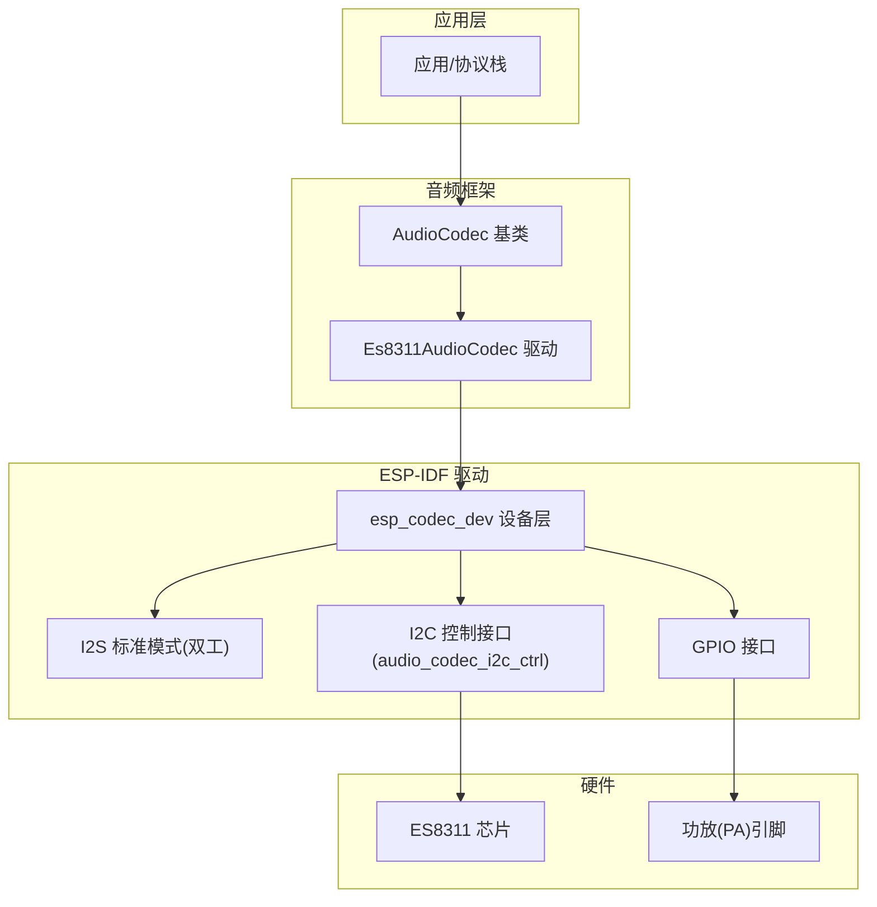
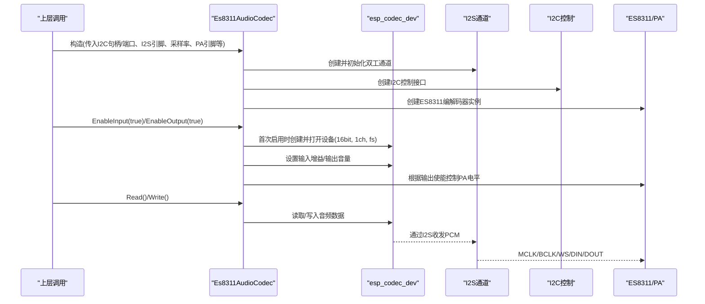
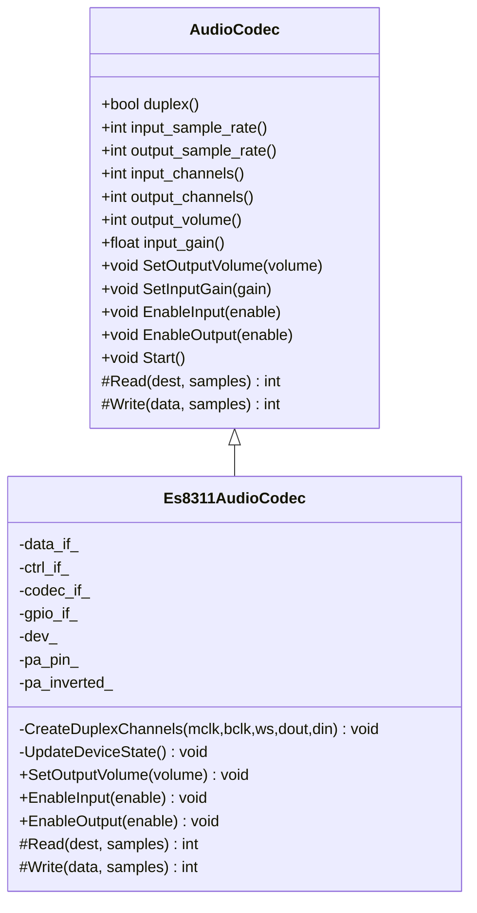
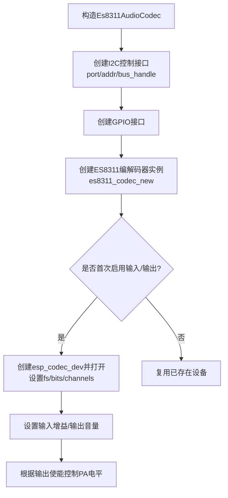
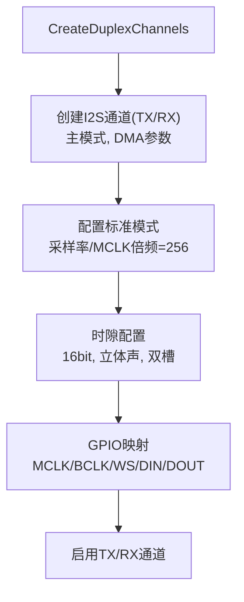
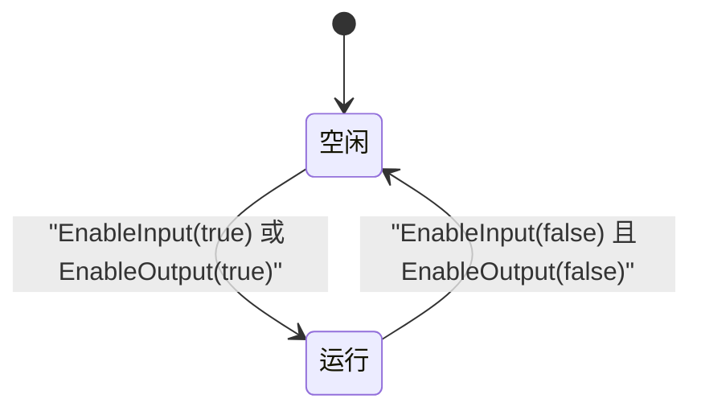
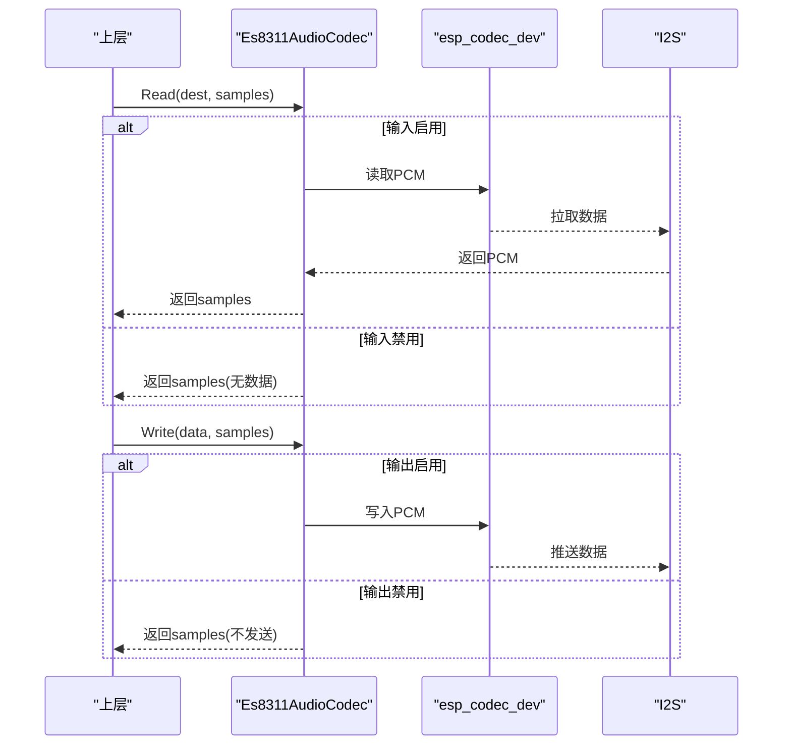
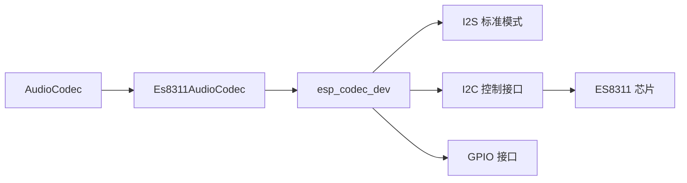

# ES8311音频编解码器

<cite>
**本文引用的文件**   
- [es8311_audio_codec.h](file://main/audio/codecs/es8311_audio_codec.h)
- [es8311_audio_codec.cc](file://main/audio/codecs/es8311_audio_codec.cc)
- [audio_codec.h](file://main/audio/audio_codec.h)
- [audio_codec.cc](file://main/audio/audio_codec.cc)
- [i2c_device.h](file://main/boards/common/i2c_device.h)
- [i2c_device.cc](file://main/boards/common/i2c_device.cc)
- [custom-board_zh.md](file://docs/custom-board_zh.md)
</cite>

## 目录
1. [简介](#简介)
2. [项目结构](#项目结构)
3. [核心组件](#核心组件)
4. [架构总览](#架构总览)
5. [详细组件分析](#详细组件分析)
6. [依赖关系分析](#依赖关系分析)
7. [性能与功耗考量](#性能与功耗考量)
8. [故障排查指南](#故障排查指南)
9. [结论](#结论)
10. [附录：配置示例与调试技巧](#附录配置示例与调试技巧)

## 简介
本文件面向ES8311音频编解码器的驱动实现，聚焦于I2C控制初始化、I2S数据通道建立、ADC/DAC路径与音量/增益控制、时钟与采样率设置、单声道/立体声模式切换、以及常见问题定位与优化建议。文档基于仓库中ES8311驱动源码与通用音频框架进行解读，帮助读者快速理解并正确集成ES8311到ESP32平台项目中。

## 项目结构
ES8311驱动位于音频编解码器模块下，遵循统一的AudioCodec抽象接口，并通过ESP-IDF的esp_codec_dev与i2s_std驱动完成底层硬件交互。I2C设备访问通过通用I2C封装提供。

图表来源
- [es8311_audio_codec.h:13-40](file://main/audio/codecs/es8311_audio_codec.h#L13-L40)
- [es8311_audio_codec.cc:22-58](file://main/audio/codecs/es8311_audio_codec.cc#L22-L58)
- [audio_codec.h:17-59](file://main/audio/audio_codec.h#L17-L59)

章节来源
- [es8311_audio_codec.h:1-42](file://main/audio/codecs/es8311_audio_codec.h#L1-L42)
- [es8311_audio_codec.cc:1-202](file://main/audio/codecs/es8311_audio_codec.cc#L1-L202)
- [audio_codec.h:1-62](file://main/audio/audio_codec.h#L1-L62)
- [audio_codec.cc:1-68](file://main/audio/audio_codec.cc#L1-L68)
- [i2c_device.h:1-19](file://main/boards/common/i2c_device.h#L1-L19)
- [i2c_device.cc:1-35](file://main/boards/common/i2c_device.cc#L1-L35)

## 核心组件
- Es8311AudioCodec：实现具体ES8311驱动的初始化、I2S双工通道创建、设备状态管理、输入输出开关、音量与增益控制、读写数据流等。
- AudioCodec：定义统一音频编解码器接口，包含音量、增益、使能、开始、数据读写等通用能力。
- esp_codec_dev：对具体编解码器（如ES8311）的统一设备抽象，负责打开/关闭、参数设置、数据读写。
- I2C控制接口：通过audio_codec_new_i2c_ctrl建立与ES8311的寄存器通信。
- I2S标准模式：配置MCLK/BCLK/WS/DIN/DOUT，形成全双工数据通路。

章节来源
- [es8311_audio_codec.h:13-40](file://main/audio/codecs/es8311_audio_codec.h#L13-L40)
- [es8311_audio_codec.cc:70-98](file://main/audio/codecs/es8311_audio_codec.cc#L70-L98)
- [audio_codec.h:17-59](file://main/audio/audio_codec.h#L17-L59)

## 架构总览
ES8311驱动在构造阶段完成以下关键步骤：
- 创建I2S双工通道（TX/RX），配置为16位、立体时隙、主模式，MCLK倍频256。
- 构建I2C控制接口与GPIO接口，创建ES8311编解码器实例。
- 首次启用输入或输出时，动态创建esp_codec_dev设备，设置采样率、位宽、通道数，并设定输入增益与输出音量。
- 根据输出使能状态控制PA引脚电平，以开启/关闭功放。

图表来源
- [es8311_audio_codec.cc:7-58](file://main/audio/codecs/es8311_audio_codec.cc#L7-L58)
- [es8311_audio_codec.cc:70-98](file://main/audio/codecs/es8311_audio_codec.cc#L70-L98)
- [es8311_audio_codec.cc:100-156](file://main/audio/codecs/es8311_audio_codec.cc#L100-L156)
- [es8311_audio_codec.cc:190-202](file://main/audio/codecs/es8311_audio_codec.cc#L190-L202)

## 详细组件分析

### 类与接口关系

图表来源
- [audio_codec.h:17-59](file://main/audio/audio_codec.h#L17-L59)
- [es8311_audio_codec.h:13-40](file://main/audio/codecs/es8311_audio_codec.h#L13-L40)

章节来源
- [audio_codec.h:17-59](file://main/audio/audio_codec.h#L17-L59)
- [es8311_audio_codec.h:13-40](file://main/audio/codecs/es8311_audio_codec.h#L13-L40)

### I2C通信初始化与控制路径
- I2C控制接口由audio_codec_new_i2c_cfg配置端口、地址与总线句柄，随后通过audio_codec_new_i2c_ctrl创建控制接口。
- ES8311编解码器实例通过es8311_codec_new创建，内部使用上述控制接口进行寄存器读写。
- 通用I2C设备封装提供了写寄存器、读寄存器与批量读的实现，便于其他模块直接访问I2C外设。

图表来源
- [es8311_audio_codec.cc:32-52](file://main/audio/codecs/es8311_audio_codec.cc#L32-L52)
- [es8311_audio_codec.cc:70-98](file://main/audio/codecs/es8311_audio_codec.cc#L70-L98)
- [i2c_device.cc:22-35](file://main/boards/common/i2c_device.cc#L22-L35)

章节来源
- [es8311_audio_codec.cc:32-52](file://main/audio/codecs/es8311_audio_codec.cc#L32-L52)
- [i2c_device.h:6-16](file://main/boards/common/i2c_device.h#L6-L16)
- [i2c_device.cc:8-35](file://main/boards/common/i2c_device.cc#L8-L35)

### I2S数据通道与时钟配置
- 使用I2S标准模式创建双工通道，角色为主设备，DMA描述符与帧数按宏定义配置。
- 时钟配置：采样率由构造参数决定，MCLK倍频设置为256；数据位宽16位，时隙模式立体声，左右声道同时传输。
- GPIO映射：MCLK/BCLK/WS/DOUT/DIN分别绑定到传入引脚，极性默认非反转。

图表来源
- [es8311_audio_codec.cc:100-156](file://main/audio/codecs/es8311_audio_codec.cc#L100-L156)

章节来源
- [es8311_audio_codec.cc:100-156](file://main/audio/codecs/es8311_audio_codec.cc#L100-L156)

### 设备状态管理与PA控制
- 当任一方向（输入或输出）被启用且设备未创建时，创建并打开esp_codec_dev，设置采样率、位宽、通道数，并应用输入增益与输出音量。
- 当两个方向均禁用且设备存在时，关闭并释放设备。
- 若配置了PA引脚，则根据输出使能状态翻转相应电平，支持反相逻辑。

图表来源
- [es8311_audio_codec.cc:70-98](file://main/audio/codecs/es8311_audio_codec.cc#L70-L98)

章节来源
- [es8311_audio_codec.cc:70-98](file://main/audio/codecs/es8311_audio_codec.cc#L70-L98)

### 输入增益与输出音量控制
- 输入增益：在设备打开后设置一次，后续可通过基类接口修改（具体生效时机取决于实现）。
- 输出音量：在设备打开后设置，并在运行时可动态调整；设置过程加锁以避免并发问题。

章节来源
- [es8311_audio_codec.cc:87-89](file://main/audio/codecs/es8311_audio_codec.cc#L87-L89)
- [es8311_audio_codec.cc:158-164](file://main/audio/codecs/es8311_audio_codec.cc#L158-L164)
- [audio_codec.cc:40-46](file://main/audio/audio_codec.cc#L40-L46)

### 数据读写流程
- Read：仅在输入启用时从esp_codec_dev读取PCM数据，返回样本数。
- Write：仅在输出启用时向esp_codec_dev写入PCM数据，返回样本数。

图表来源
- [es8311_audio_codec.cc:190-202](file://main/audio/codecs/es8311_audio_codec.cc#L190-L202)

章节来源
- [es8311_audio_codec.cc:190-202](file://main/audio/codecs/es8311_audio_codec.cc#L190-L202)

### 单声道与立体声模式
- I2S时隙模式当前配置为立体声（双槽），适用于大多数场景。
- 如需切换至单声道，可在I2S时隙配置中将slot_mode改为单声道模式，并确保上层处理逻辑与通道数一致。

章节来源
- [es8311_audio_codec.cc:123-128](file://main/audio/codecs/es8311_audio_codec.cc#L123-L128)

### 采样率支持与数据格式
- 采样率：由构造参数指定，I2S与设备层均使用该值；要求输入与输出采样率相等。
- 数据格式：16位PCM，立体声双槽，MCLK倍频256。

章节来源
- [es8311_audio_codec.cc:19-20](file://main/audio/codecs/es8311_audio_codec.cc#L19-L20)
- [es8311_audio_codec.cc:80-86](file://main/audio/codecs/es8311_audio_codec.cc#L80-L86)
- [es8311_audio_codec.cc:114-136](file://main/audio/codecs/es8311_audio_codec.cc#L114-L136)

## 依赖关系分析
- Es8311AudioCodec依赖AudioCodec基类提供的统一接口。
- 通过esp_codec_dev与具体编解码器接口（es8311_codec_new）对接ES8311。
- I2S标准模式用于PCM数据通路，I2C用于寄存器控制。
- 通用I2C设备封装可用于更底层的寄存器访问与调试。

图表来源
- [es8311_audio_codec.cc:22-58](file://main/audio/codecs/es8311_audio_codec.cc#L22-L58)
- [audio_codec.h:17-59](file://main/audio/audio_codec.h#L17-L59)

章节来源
- [es8311_audio_codec.cc:22-58](file://main/audio/codecs/es8311_audio_codec.cc#L22-L58)
- [audio_codec.h:17-59](file://main/audio/audio_codec.h#L17-L59)

## 性能与功耗考量
- 仅在需要时创建并打开esp_codec_dev，避免不必要的资源占用。
- 输出禁用时关闭设备并控制PA引脚，降低功耗。
- I2S采用主模式与固定MCLK倍频，确保时钟稳定，减少抖动导致的噪声。
- 合理设置输入增益与输出音量，避免过驱动与削波。

[本节为通用指导，无需特定文件引用]

## 故障排查指南
- 无法初始化I2C控制接口
  - 检查I2C端口、地址与总线句柄是否正确传递。
  - 确认外部上拉电阻与I2C速度配置。
- 无声音或声音异常
  - 确认输出使能与PA引脚电平正确。
  - 核对I2S引脚映射与极性配置。
  - 验证采样率与数据格式是否与上游/下游一致。
- 噪声或杂音
  - 检查MCLK倍频与时钟源稳定性。
  - 适当降低输入增益与输出音量，避免过载。
- 功耗偏高
  - 在空闲时关闭输入/输出，确保设备关闭与PA断电。

章节来源
- [es8311_audio_codec.cc:70-98](file://main/audio/codecs/es8311_audio_codec.cc#L70-L98)
- [es8311_audio_codec.cc:100-156](file://main/audio/codecs/es8311_audio_codec.cc#L100-L156)
- [es8311_audio_codec.cc:158-164](file://main/audio/codecs/es8311_audio_codec.cc#L158-L164)

## 结论
ES8311驱动在该项目中通过统一的AudioCodec接口与esp_codec_dev设备层，实现了稳定的I2S双工数据通路和可靠的I2C寄存器控制。其设计强调按需创建设备、清晰的PA控制与合理的时钟/数据格式配置，便于在不同板级方案中复用与扩展。

[本节为总结性内容，无需特定文件引用]

## 附录：配置示例与调试技巧
- 典型构造参数要点
  - I2C：端口号、设备地址、总线句柄。
  - I2S：MCLK/BCLK/WS/DIN/DOUT引脚。
  - 采样率：输入与输出需一致。
  - PA引脚：可选，支持反相逻辑。
- 常用配置项参考
  - I2S：16位、立体声、MCLK倍频256。
  - esp_codec_dev：16位、单通道、fs等于构造采样率。
  - 输入增益：初始值可按环境调整。
  - 输出音量：默认值与持久化策略见基类实现。
- 调试技巧
  - 使用日志观察初始化与状态变化。
  - 通过通用I2C封装读取/写入寄存器，验证芯片响应。
  - 对比不同采样率与MCLK倍频下的音频质量。
- 板级集成参考
  - 自定义板集成说明与示例可参考文档中的ES8311相关条目。

章节来源
- [es8311_audio_codec.cc:7-58](file://main/audio/codecs/es8311_audio_codec.cc#L7-L58)
- [es8311_audio_codec.cc:80-89](file://main/audio/codecs/es8311_audio_codec.cc#L80-L89)
- [es8311_audio_codec.cc:114-136](file://main/audio/codecs/es8311_audio_codec.cc#L114-L136)
- [audio_codec.cc:29-46](file://main/audio/audio_codec.cc#L29-L46)
- [custom-board_zh.md:61-63](file://docs/custom-board_zh.md#L61-L63)
- [custom-board_zh.md:147-148](file://docs/custom-board_zh.md#L147-L148)
- [custom-board_zh.md:270-270](file://docs/custom-board_zh.md#L270-L270)