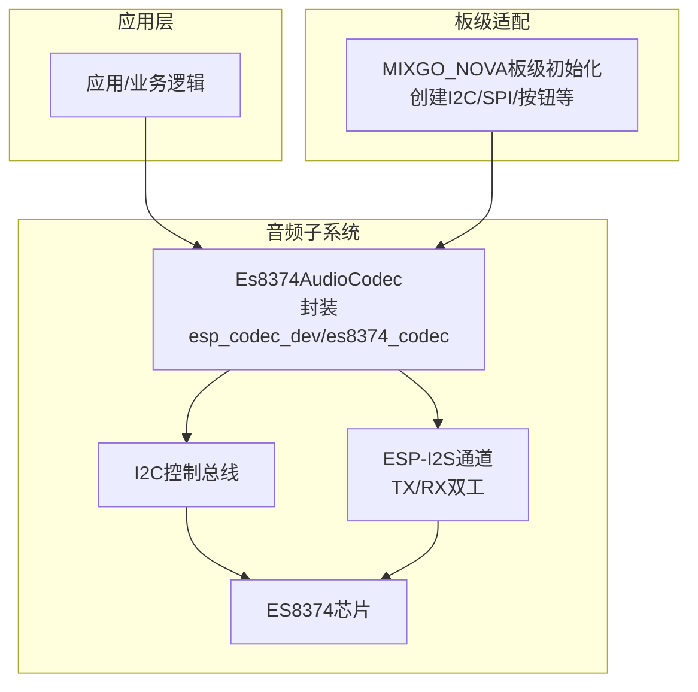
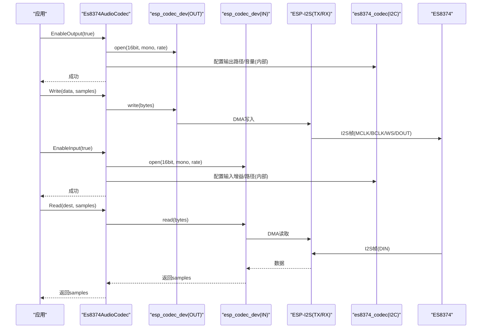
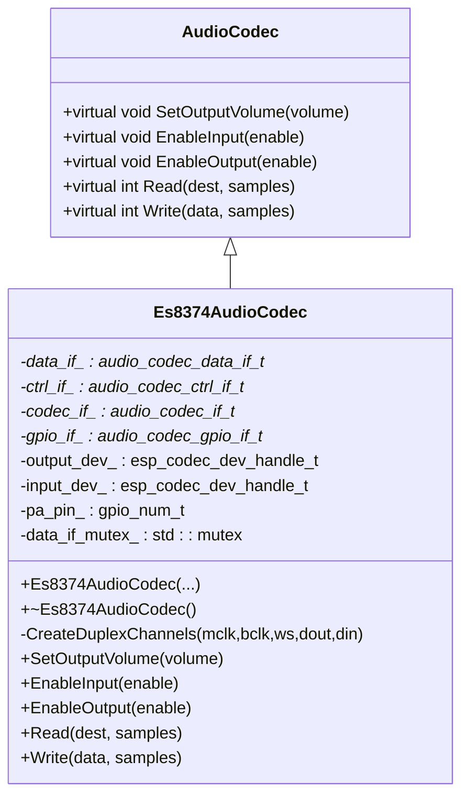
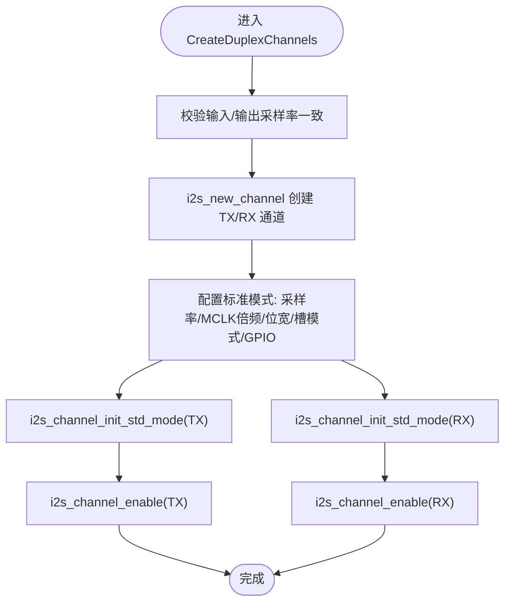
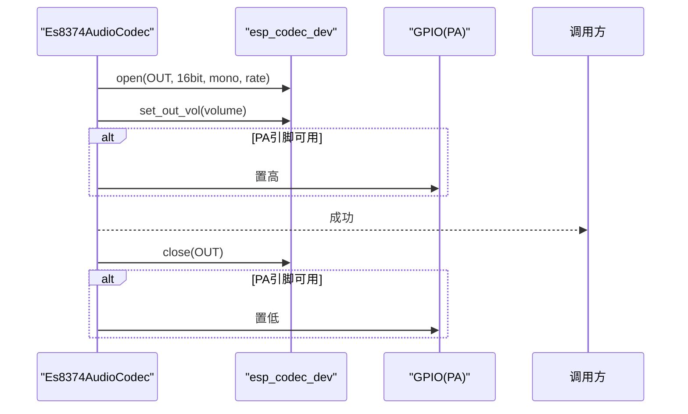
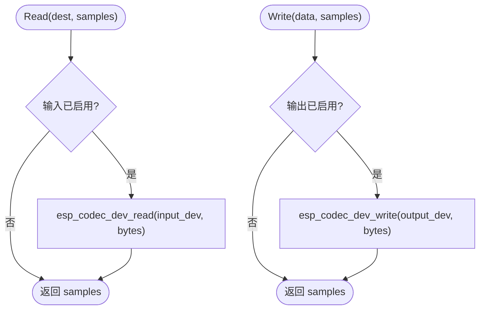
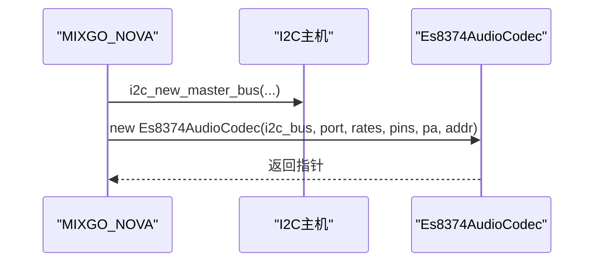
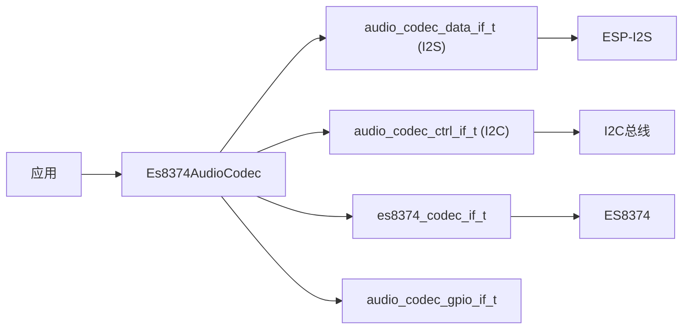

# ES8374音频编解码器

<cite>
**本文引用的文件**   
- [es8374_audio_codec.h](file://main/audio/codecs/es8374_audio_codec.h)
- [es8374_audio_codec.cc](file://main/audio/codecs/es8374_audio_codec.cc)
- [mixgo-nova.cc](file://main/boards/mixgo-nova/mixgo-nova.cc)
</cite>

## 目录
1. [简介](#简介)
2. [项目结构](#项目结构)
3. [核心组件](#核心组件)
4. [架构总览](#架构总览)
5. [详细组件分析](#详细组件分析)
6. [依赖关系分析](#依赖关系分析)
7. [性能考虑](#性能考虑)
8. [故障诊断指南](#故障诊断指南)
9. [结论](#结论)
10. [附录](#附录)

## 简介
本文件面向在ESP32平台上集成ES8374音频编解码器的工程实现，聚焦以下目标：
- 说明ES8374驱动层在ESP-IDF中的工作模式、I2S接口时序与DMA传输路径
- 梳理输入/输出通道创建、设备打开与关闭流程、音量控制与PA引脚管理
- 提供板级适配要点（I2C总线、GPIO映射、采样率一致性）与测试验证步骤
- 给出性能调优建议与常见问题排查方法

注意：当前仓库中ES8374驱动通过esp_codec_dev与es8374_codec抽象层进行寄存器配置与电源管理，具体寄存器序列与音效处理细节由底层库实现。本文档仅基于源码可见的初始化与数据通路进行分析。

## 项目结构
与ES8374相关的代码主要位于audio codecs目录，并在某块板级示例中完成实例化与引脚绑定。

图表来源
- [es8374_audio_codec.cc:76-132](file://main/audio/codecs/es8374_audio_codec.cc#L76-L132)
- [es8374_audio_codec.cc:20-47](file://main/audio/codecs/es8374_audio_codec.cc#L20-L47)
- [mixgo-nova.cc:147-152](file://main/boards/mixgo-nova/mixgo-nova.cc#L147-L152)

章节来源
- [es8374_audio_codec.h:13-39](file://main/audio/codecs/es8374_audio_codec.h#L13-L39)
- [es8374_audio_codec.cc:76-132](file://main/audio/codecs/es8374_audio_codec.cc#L76-L132)
- [mixgo-nova.cc:147-152](file://main/boards/mixgo-nova/mixgo-nova.cc#L147-L152)

## 核心组件
- Es8374AudioCodec类
  - 职责：封装ES8374的I2S数据通路、I2C控制接口、PA控制、输入/输出设备句柄管理与音量设置
  - 关键成员：data_if_、ctrl_if_、codec_if_、gpio_if_、output_dev_、input_dev_、pa_pin_
  - 关键方法：CreateDuplexChannels、EnableInput、EnableOutput、SetOutputVolume、Read、Write

章节来源
- [es8374_audio_codec.h:13-39](file://main/audio/codecs/es8374_audio_codec.h#L13-L39)
- [es8374_audio_codec.cc:7-62](file://main/audio/codecs/es8374_audio_codec.cc#L7-L62)

## 架构总览
ES8374驱动采用分层设计：
- 上层：Es8374AudioCodec暴露统一API（读写、开关、音量）
- 中层：esp_codec_dev与es8374_codec负责设备生命周期与寄存器配置
- 下层：ESP-I2S硬件通道与I2C控制器完成物理通信

图表来源
- [es8374_audio_codec.cc:139-186](file://main/audio/codecs/es8374_audio_codec.cc#L139-L186)
- [es8374_audio_codec.cc:188-200](file://main/audio/codecs/es8374_audio_codec.cc#L188-L200)
- [es8374_audio_codec.cc:20-47](file://main/audio/codecs/es8374_audio_codec.cc#L20-L47)

## 详细组件分析

### 类与接口关系

图表来源
- [es8374_audio_codec.h:13-39](file://main/audio/codecs/es8374_audio_codec.h#L13-L39)

章节来源
- [es8374_audio_codec.h:13-39](file://main/audio/codecs/es8374_audio_codec.h#L13-L39)

### I2S双工通道创建与时序
- 通道角色：I2S_NUM_0主模式，同时创建TX与RX通道
- 时钟与位宽：采样率由构造参数传入；MCLK倍频为256；数据位宽16bit；立体声槽模式；WS极性默认低有效
- GPIO映射：mclk/bclk/ws/dout/din由构造参数注入
- DMA缓冲：描述符数量与每帧样本数用于降低CPU占用并提升吞吐稳定性

图表来源
- [es8374_audio_codec.cc:76-132](file://main/audio/codecs/es8374_audio_codec.cc#L76-L132)

章节来源
- [es8374_audio_codec.cc:76-132](file://main/audio/codecs/es8374_audio_codec.cc#L76-L132)

### 设备打开/关闭与音量控制
- 输出路径：open(16bit, mono, rate)后设置输出音量；若配置了PA引脚则置高使能功放
- 输入路径：open(16bit, mono, rate)后设置输入增益；关闭时释放设备句柄
- 线程安全：输入/输出开关使用互斥锁保护，避免并发冲突
- 资源清理：析构函数按顺序关闭并删除设备与接口对象

图表来源
- [es8374_audio_codec.cc:160-186](file://main/audio/codecs/es8374_audio_codec.cc#L160-L186)

章节来源
- [es8374_audio_codec.cc:134-186](file://main/audio/codecs/es8374_audio_codec.cc#L134-L186)

### 数据读写路径
- Read：当输入已启用时，从输入设备读取指定字节数，返回请求的样本数
- Write：当输出已启用时，向输出设备写入指定字节数，返回请求的样本数
- 错误处理：使用无中止宏进行非致命错误记录，保证实时性

图表来源
- [es8374_audio_codec.cc:188-200](file://main/audio/codecs/es8374_audio_codec.cc#L188-L200)

章节来源
- [es8374_audio_codec.cc:188-200](file://main/audio/codecs/es8374_audio_codec.cc#L188-L200)

### 板级适配（以MIXGO_NOVA为例）
- I2C总线：初始化I2C主机，分配SDA/SCL引脚，启用内部上拉
- SPI与显示：初始化SPI总线与LCD面板（与音频无关，但属于同一板级初始化流程）
- 音频实例化：将I2C总线句柄、端口号、采样率、I2S引脚、PA引脚与ES8374地址传入构造函数

图表来源
- [mixgo-nova.cc:26-41](file://main/boards/mixgo-nova/mixgo-nova.cc#L26-L41)
- [mixgo-nova.cc:147-152](file://main/boards/mixgo-nova/mixgo-nova.cc#L147-L152)

章节来源
- [mixgo-nova.cc:26-41](file://main/boards/mixgo-nova/mixgo-nova.cc#L26-L41)
- [mixgo-nova.cc:147-152](file://main/boards/mixgo-nova/mixgo-nova.cc#L147-L152)

## 依赖关系分析
- 外部依赖
  - ESP-IDF I2S驱动：提供TX/RX通道、DMA与中断
  - ESP codec dev框架：提供设备句柄、打开/关闭、音量与增益控制
  - es8374_codec：封装ES8374的寄存器配置与电源管理
- 内部耦合
  - Es8374AudioCodec对data_if_/ctrl_if_/codec_if_/gpio_if_强依赖
  - 输入/输出设备句柄独立管理，避免共享状态导致的竞态

图表来源
- [es8374_audio_codec.cc:20-47](file://main/audio/codecs/es8374_audio_codec.cc#L20-L47)
- [es8374_audio_codec.h:15-23](file://main/audio/codecs/es8374_audio_codec.h#L15-L23)

章节来源
- [es8374_audio_codec.h:15-23](file://main/audio/codecs/es8374_audio_codec.h#L15-L23)
- [es8374_audio_codec.cc:20-47](file://main/audio/codecs/es8374_audio_codec.cc#L20-L47)

## 性能考虑
- DMA缓冲大小
  - 描述符数量与每帧样本数直接影响吞吐与延迟。当前实现使用固定值，可根据实际负载与功耗需求调整
- MCLK倍频
  - 使用256倍MCLK有助于降低抖动并提高时钟质量，适合高保真场景
- 单声道与位宽
  - 当前输入/输出均为16bit单声道，可降低带宽与CPU占用；如需立体声或更高精度需同步修改I2S槽模式与设备打开参数
- 线程安全
  - 输入/输出开关使用互斥锁，避免并发导致的状态不一致
- 错误处理策略
  - 读写路径使用“不中止”的错误检查宏，有利于保持实时性；建议在更高层进行日志与告警

[本节为通用指导，无需特定文件引用]

## 故障诊断指南
- 无声音/无声输出
  - 检查EnableOutput是否被调用且未返回错误
  - 确认PA引脚是否配置且置高
  - 核对I2S引脚映射与电平极性是否与硬件一致
- 无输入/静音
  - 检查EnableInput是否被调用
  - 确认输入增益设置是否过低
  - 核对I2S DIN引脚连接与采样率一致性
- 爆音/杂音
  - 检查MCLK倍频与采样率是否匹配
  - 调整DMA描述符与帧大小，避免缓冲区欠载/溢出
- 初始化失败
  - 检查I2C地址与总线初始化是否正确
  - 查看日志标签“Es8374AudioCodec”的输出信息定位问题阶段

章节来源
- [es8374_audio_codec.cc:139-186](file://main/audio/codecs/es8374_audio_codec.cc#L139-L186)
- [es8374_audio_codec.cc:188-200](file://main/audio/codecs/es8374_audio_codec.cc#L188-L200)

## 结论
本实现通过Es8374AudioCodec将ES8374的复杂功能抽象为简洁的API，结合ESP-I2S与esp_codec_dev框架，提供了稳定的双工音频通路。对于高保真与降噪等高级特性，应参考底层es8374_codec与esp_codec_dev的实现与文档进行进一步配置与优化。

[本节为总结性内容，无需特定文件引用]

## 附录
- 板级适配清单
  - I2C总线：端口号、SDA/SCL引脚、上拉配置
  - I2S引脚：MCLK/BCLK/WS/DOUT/DIN
  - PA引脚：是否连接及极性
  - ES8374地址：I2C设备地址
  - 采样率：输入/输出必须一致
- 测试验证流程
  - 初始化I2C与I2S通道，打印初始化日志
  - 开启输出，播放已知音频片段，验证PA控制与音量调节
  - 开启输入，录制一段音频并回放，验证增益与路径
  - 逐步调整DMA参数与MCLK倍频，观察底噪与失真变化
  - 模拟异常（断线、错误地址），验证错误处理与日志

[本节为操作指引，无需特定文件引用]