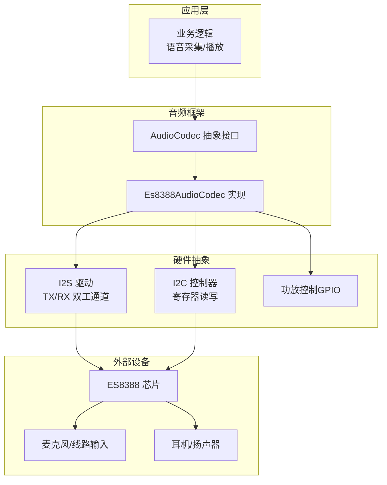
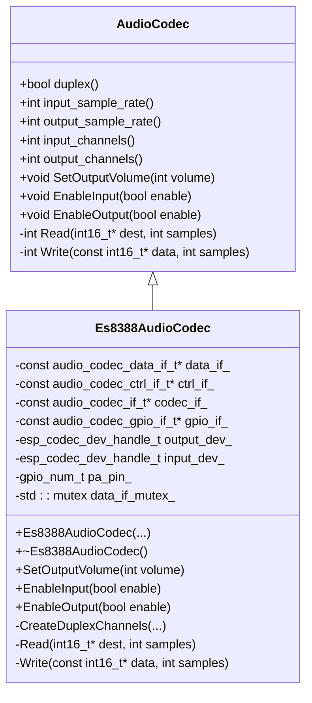
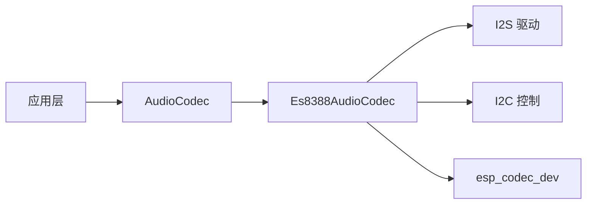

# ES8388音频编解码器

<cite>
**本文引用的文件列表**
- [es8388_audio_codec.h](file://main/audio/codecs/es8388_audio_codec.h)
- [es8388_audio_codec.cc](file://main/audio/codecs/es8388_audio_codec.cc)
- [audio_codec.h](file://main/audio/audio_codec.h)
- [atk_dnesp32s3.cc](file://main/boards/atk-dnesp32s3/atk_dnesp32s3.cc)
</cite>

## 目录
1. [简介](#简介)
2. [项目结构](#项目结构)
3. [核心组件](#核心组件)
4. [架构总览](#架构总览)
5. [详细组件分析](#详细组件分析)
6. [依赖关系分析](#依赖关系分析)
7. [性能与低延迟优化](#性能与低延迟优化)
8. [故障排查指南](#故障排查指南)
9. [结论](#结论)
10. [附录：配置示例与基准建议](#附录配置示例与基准建议)

## 简介
本文件围绕ES8388音频编解码器在ESP32平台上的实现，系统化梳理其驱动层接口、I2S双工通道创建、I2C寄存器控制、输入输出路径、PA控制、参考输入（回声消除）支持等关键能力。文档面向希望将ES8388用于专业音频应用的工程师，提供从架构到实现的深入解读，并给出可操作的配置要点与性能调优建议。

## 项目结构
ES8388驱动位于音频编解码器模块中，遵循统一的AudioCodec抽象接口；板级代码通过GetAudioCodec返回具体实例，完成引脚、I2C地址、采样率等硬件相关参数的注入。

图表来源
- [es8388_audio_codec.h:12-38](file://main/audio/codecs/es8388_audio_codec.h#L12-L38)
- [es8388_audio_codec.cc:20-70](file://main/audio/codecs/es8388_audio_codec.cc#L20-L70)
- [atk_dnesp32s3.cc:199-214](file://main/boards/atk-dnesp32s3/atk_dnesp32s3.cc#L199-L214)

章节来源
- [es8388_audio_codec.h:12-38](file://main/audio/codecs/es8388_audio_codec.h#L12-L38)
- [es8388_audio_codec.cc:20-70](file://main/audio/codecs/es8388_audio_codec.cc#L20-L70)
- [atk_dnesp32s3.cc:199-214](file://main/boards/atk-dnesp32s3/atk_dnesp32s3.cc#L199-L214)

## 核心组件
- Es8388AudioCodec：基于ESP-IDF的esp_codec_dev与i2s_std驱动，封装ES8388的I2S数据面与I2C控制面，提供统一的双工音频接口。
- AudioCodec：定义通用的音频编解码器抽象，包括音量、增益、开关、双工标志、采样率与通道数等属性与方法。
- 板级集成：在板级初始化中构造Es8388AudioCodec实例，传入I2C端口、I2S引脚、PA引脚、ES8388地址及采样率等参数。

章节来源
- [audio_codec.h:17-59](file://main/audio/audio_codec.h#L17-L59)
- [es8388_audio_codec.h:12-38](file://main/audio/codecs/es8388_audio_codec.h#L12-L38)
- [atk_dnesp32s3.cc:199-214](file://main/boards/atk-dnesp32s3/atk_dnesp32s3.cc#L199-L214)

## 架构总览
ES8388驱动采用“数据面+控制面”分层设计：
- 数据面：通过I2S标准模式建立TX/RX双工通道，使用DMA描述符与帧缓冲进行高效传输。
- 控制面：通过I2C访问ES8388内部寄存器，完成工作模式、时钟源、增益、模拟输出电平、PA使能等配置。
- 设备对象：分别创建输入与输出设备句柄，独立打开/关闭，避免资源竞争。

图表来源
- [audio_codec.h:17-59](file://main/audio/audio_codec.h#L17-L59)
- [es8388_audio_codec.h:12-38](file://main/audio/codecs/es8388_audio_codec.h#L12-L38)

## 详细组件分析

### 类与接口设计
- 继承关系：Es8388AudioCodec继承自AudioCodec，复用通用状态机与属性管理。
- 关键成员：
  - data_if_/ctrl_if_/codec_if_/gpio_if_：数据、控制、编解码器与GPIO接口指针。
  - output_dev_/input_dev_：独立的输出/输入设备句柄，便于按需开启与关闭。
  - pa_pin_：功放控制引脚，用于上电/关断扬声器或耳机放大器。
  - data_if_mutex_：保护输入/输出启停临界区，避免并发冲突。
- 生命周期：
  - 构造阶段：创建I2S双工通道、初始化数据与控制接口、创建编解码器与设备句柄。
  - 析构阶段：关闭并删除设备句柄，释放所有接口资源。

章节来源
- [es8388_audio_codec.h:12-38](file://main/audio/codecs/es8388_audio_codec.h#L12-L38)
- [es8388_audio_codec.cc:72-83](file://main/audio/codecs/es8388_audio_codec.cc#L72-L83)

### I2S双工通道创建
- 通道角色：I2S_NUM_0作为主设备，同时启用TX与RX。
- 时钟与位宽：
  - 采样率由output_sample_rate_决定，MCLK倍数为256。
  - 数据位宽16bit，立体声双时隙，左右对齐，MSB优先。
- DMA参数：
  - 描述符数量与每帧描述符数量由宏常量定义，兼顾吞吐与内存占用。
- 同步性：构造时断言输入与输出采样率一致，确保双工同步。

章节来源
- [es8388_audio_codec.cc:85-137](file://main/audio/codecs/es8388_audio_codec.cc#L85-L137)
- [audio_codec.h:14-15](file://main/audio/audio_codec.h#L14-L15)

### I2C控制面与ES8388初始化
- 控制接口：通过I2C端口与ES8388地址建立控制面，绑定总线句柄。
- 编解码器配置：
  - 工作模式为双工（IN+OUT）。
  - 主模式（master_mode=true），由ESP32提供时钟。
  - PA引脚与反转极性、硬件电压参数用于功率放大与电平换算。
- 设备句柄：分别创建输出与输入设备，设置关闭后不自动禁用，以便上层灵活控制。

章节来源
- [es8388_audio_codec.cc:20-70](file://main/audio/codecs/es8388_audio_codec.cc#L20-L70)

### 输入路径与参考输入（回声消除）
- 输入通道数：根据是否启用参考输入决定单声道或双声道。
- 参考输入模式：
  - 当input_reference为true时，输入通道掩码包含两个通道，用于AEC算法参考信号。
  - 通过直接写寄存器设置参考输入增益，绕过通用输入增益API。
- 普通输入模式：
  - 使用通用输入增益API设置MIC/线路输入增益。

章节来源
- [es8388_audio_codec.cc:144-171](file://main/audio/codecs/es8388_audio_codec.cc#L144-L171)

### 输出路径与PA控制
- 输出采样格式：16bit，单声道输出。
- 模拟输出电平：
  - 打开输出时，将HP_LVOL、HP_RVOL、SPK_LVOL、SPK_RVOL寄存器设置为0dB，避免默认低电平导致声音过小。
- PA控制：
  - 若配置了PA引脚，则在开启输出时置高，关闭时置低，以控制功放供电或使能。

章节来源
- [es8388_audio_codec.cc:173-206](file://main/audio/codecs/es8388_audio_codec.cc#L173-L206)

### 数据读写与线程安全
- Read/Write：
  - 仅在对应方向已启用时执行底层读取/写入。
  - 使用ESP_ERROR_CHECK_WITHOUT_ABORT避免异常中断影响上层流程。
- 互斥锁：
  - 在EnableInput/EnableOutput中使用互斥锁保护数据接口状态切换，防止并发竞态。

章节来源
- [es8388_audio_codec.cc:207-221](file://main/audio/codecs/es8388_audio_codec.cc#L207-L221)

### 板级集成示例
- 在板级GetAudioCodec中构造Es8388AudioCodec实例，传入：
  - I2C总线句柄与端口号
  - 输入/输出采样率
  - I2S引脚（MCLK/BCLK/WS/DOUT/DIN）
  - PA引脚（可为NC表示无外置PA）
  - ES8388的I2C地址
- 该方式将硬件差异与驱动解耦，便于多板适配。

章节来源
- [atk_dnesp32s3.cc:199-214](file://main/boards/atk-dnesp32s3/atk_dnesp32s3.cc#L199-L214)

## 依赖关系分析
- 外部依赖：
  - ESP-IDF i2s_std驱动：负责I2S数据流与DMA。
  - esp_codec_dev与默认接口：提供编解码器设备抽象与I2C/GPIO接口封装。
- 内部耦合：
  - Es8388AudioCodec对AudioCodec抽象的强依赖，统一上层调用。
  - 输入/输出设备句柄独立管理，降低耦合度。
- 可能的循环依赖：
  - 当前实现未见循环引用，依赖方向清晰：应用→AudioCodec→Es8388AudioCodec→I2S/I2C/esp_codec_dev。

图表来源
- [es8388_audio_codec.cc:20-70](file://main/audio/codecs/es8388_audio_codec.cc#L20-L70)
- [audio_codec.h:17-59](file://main/audio/audio_codec.h#L17-L59)

章节来源
- [es8388_audio_codec.cc:20-70](file://main/audio/codecs/es8388_audio_codec.cc#L20-L70)
- [audio_codec.h:17-59](file://main/audio/audio_codec.h#L17-L59)

## 性能与低延迟优化
- DMA缓冲与帧大小：
  - 通过AUDIO_CODEC_DMA_DESC_NUM与AUDIO_CODEC_DMA_FRAME_NUM调整，平衡吞吐与延迟。
- MCLK倍数与时钟源：
  - 使用256倍MCLK与默认时钟源，保证稳定采样率与较低抖动。
- 输入/输出独立句柄：
  - 按需open/close减少不必要的功耗与处理开销。
- 寄存器直写优化：
  - 参考输入模式下直接写寄存器提升响应速度，避免多次高层API调用。
- 互斥保护：
  - 在启停路径加锁，避免并发导致的丢帧或崩溃。

章节来源
- [audio_codec.h:14-15](file://main/audio/audio_codec.h#L14-L15)
- [es8388_audio_codec.cc:85-137](file://main/audio/codecs/es8388_audio_codec.cc#L85-L137)
- [es8388_audio_codec.cc:144-171](file://main/audio/codecs/es8388_audio_codec.cc#L144-L171)
- [es8388_audio_codec.cc:173-206](file://main/audio/codecs/es8388_audio_codec.cc#L173-L206)

## 故障排查指南
- 初始化失败：
  - 检查I2C地址是否正确、总线句柄是否有效、引脚分配是否与硬件一致。
- 无声或音量过低：
  - 确认模拟输出寄存器是否设置为0dB，PA引脚是否被正确拉高。
- 回声消除无效：
  - 确认input_reference为true且输入通道掩码包含两路，参考输入增益寄存器已正确写入。
- 并发问题：
  - 观察是否在多线程环境下频繁启停输入/输出，确保互斥锁生效。

章节来源
- [es8388_audio_codec.cc:173-206](file://main/audio/codecs/es8388_audio_codec.cc#L173-L206)
- [es8388_audio_codec.cc:144-171](file://main/audio/codecs/es8388_audio_codec.cc#L144-L171)

## 结论
ES8388驱动在ESP32平台上实现了稳定的双工音频路径，具备参考输入支持、PA控制与灵活的I2C寄存器配置能力。通过合理的DMA与时钟配置、独立设备句柄管理与互斥保护，可在低延迟与高可靠性之间取得良好平衡。结合板级参数化构造，易于在多硬件平台上复用与扩展。

## 附录：配置示例与基准建议
- 典型构造参数：
  - I2C端口与地址：依据原理图确定。
  - I2S引脚：MCLK/BCLK/WS/DOUT/DIN按硬件连接配置。
  - PA引脚：若无外置PA则设为NC。
  - 采样率：输入与输出保持一致，常见为16kHz或48kHz。
- 回声消除参考输入：
  - 启用input_reference，并在输入路径中设置参考通道掩码与增益寄存器。
- 性能基准建议：
  - 以不同DMA描述符与帧大小组合测试端到端延迟与CPU占用。
  - 在不同环境噪声下评估参考输入增益对AEC效果的影响。
  - 记录不同采样率下的吞吐与丢帧情况，选择最优配置。

[本节为概念性指导，不直接分析具体文件]