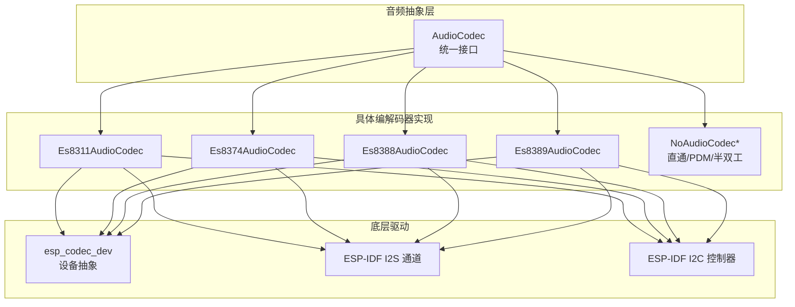
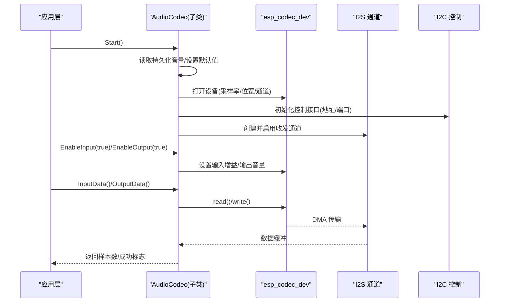
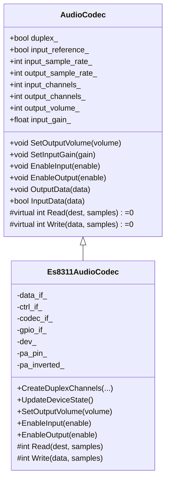
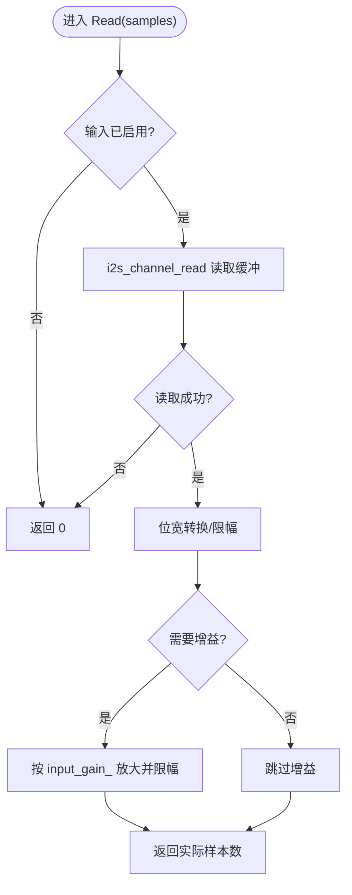
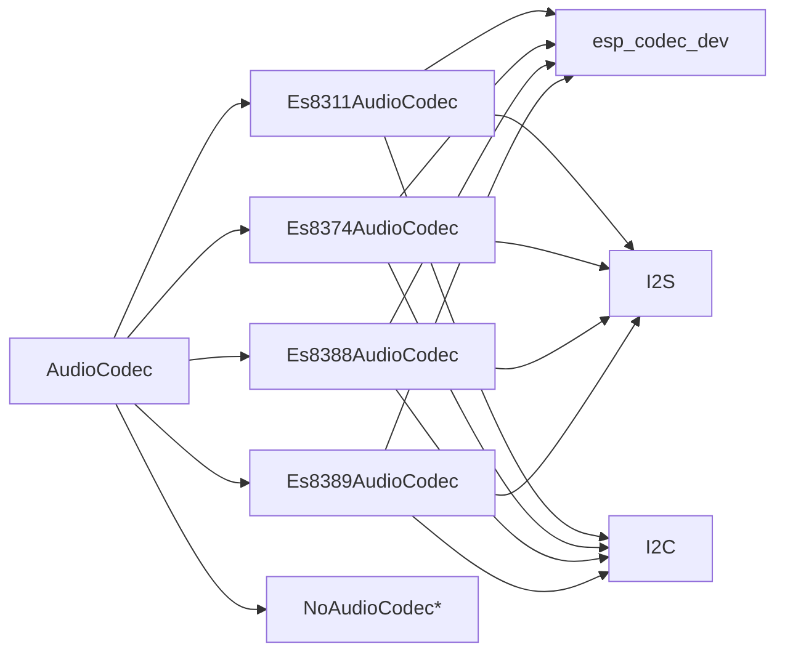

# 自定义编解码器开发指南

<cite>
**本文引用的文件**   
- [audio_codec.h](file://main\audio\audio_codec.h)
- [audio_codec.cc](file://main\audio\audio_codec.cc)
- [es8311_audio_codec.h](file://main\audio\codecs\es8311_audio_codec.h)
- [es8311_audio_codec.cc](file://main\audio\codecs\es8311_audio_codec.cc)
- [es8374_audio_codec.h](file://main\audio\codecs\es8374_audio_codec.h)
- [es8374_audio_codec.cc](file://main\audio\codecs\es8374_audio_codec.cc)
- [es8388_audio_codec.h](file://main\audio\codecs\es8388_audio_codec.h)
- [es8388_audio_codec.cc](file://main\audio\codecs\es8388_audio_codec.cc)
- [es8389_audio_codec.h](file://main\audio\codecs\es8389_audio_codec.h)
- [es8389_audio_codec.cc](file://main\audio\codecs\es8389_audio_codec.cc)
- [no_audio_codec.h](file://main\audio\codecs\no_audio_codec.h)
- [no_audio_codec.cc](file://main\audio\codecs\no_audio_codec.cc)
</cite>

## 目录
1. [简介](#简介)
2. [项目结构](#项目结构)
3. [核心组件](#核心组件)
4. [架构总览](#架构总览)
5. [详细组件分析](#详细组件分析)
6. [依赖关系分析](#依赖关系分析)
7. [性能考虑](#性能考虑)
8. [故障排查指南](#故障排查指南)
9. [结论](#结论)
10. [附录](#附录)

## 简介
本指南面向需要在现有系统中集成新音频编解码器的工程师，提供从硬件选型到驱动调试的完整流程。重点说明如何继承 AudioCodec 基类实现新的音频编解码器驱动，深入解释必须实现的虚函数 Read 与 Write 的编写规范、错误处理与性能优化；涵盖 I2C/SPI 控制总线、寄存器映射表与初始化序列配置方法；并给出音频参数配置、时钟同步与中断处理的实践建议。文档同时提供代码模板、测试用例思路与常见问题解决方案，确保新编解码器能够无缝集成到现有系统。

## 项目结构
本项目在 main/audio 目录下提供统一的音频编解码抽象层与多种具体实现：
- 抽象层：AudioCodec 定义统一接口（音量、增益、输入输出使能、数据读写等）
- 具体实现：针对 ES8311/ES8374/ES8388/ES8389 等芯片的驱动，以及无外部编解码器的直通实现（NoAudioCodec*）
- 通信方式：I2S 用于音频数据流，I2C 用于控制寄存器访问（部分实现通过 esp_codec_dev 封装）

图表来源
- [audio_codec.h:17-59](file://main\audio\audio_codec.h#L17-L59)
- [es8311_audio_codec.cc:20-58](file://main\audio\codecs\es8311_audio_codec.cc#L20-L58)
- [es8374_audio_codec.cc:20-62](file://main\audio\codecs\es8374_audio_codec.cc#L20-L62)
- [es8388_audio_codec.cc:20-71](file://main\audio\codecs\es8388_audio_codec.cc#L20-L71)
- [es8389_audio_codec.cc:19-70](file://main\audio\codecs\es8389_audio_codec.cc#L19-L70)
- [no_audio_codec.cc:19-76](file://main\audio\codecs\no_audio_codec.cc#L19-L76)

章节来源
- [audio_codec.h:17-59](file://main\audio\audio_codec.h#L17-L59)
- [audio_codec.cc:17-38](file://main\audio\audio_codec.cc#L17-L38)

## 核心组件
- AudioCodec 基类
  - 提供统一 API：SetOutputVolume、SetInputGain、EnableInput、EnableOutput、Start、OutputData、InputData
  - 暴露关键属性：duplex、input_reference、sample_rate、channels、volume/gain/enabled 状态
  - 要求子类实现纯虚函数 Read 与 Write，负责实际的数据搬运与错误返回
- 具体编解码器实现
  - Es8311/Es8374/Es8388/Es8389：基于 esp_codec_dev 与 I2S/I2C 完成数据与控制路径
  - NoAudioCodec*：直接操作 I2S 通道，支持全双工、半双工与 PDM 麦克风模式

章节来源
- [audio_codec.h:17-59](file://main\audio\audio_codec.h#L17-L59)
- [audio_codec.cc:17-68](file://main\audio\audio_codec.cc#L17-L68)
- [es8311_audio_codec.h:13-40](file://main\audio\codecs\es8311_audio_codec.h#L13-L40)
- [es8374_audio_codec.h:13-39](file://main\audio\codecs\es8374_audio_codec.h#L13-L39)
- [es8388_audio_codec.h:12-38](file://main\audio\codecs\es8388_audio_codec.h#L12-L38)
- [es8389_audio_codec.h:12-38](file://main\audio\codecs\es8389_audio_codec.h#L12-L38)
- [no_audio_codec.h:10-41](file://main\audio\codecs\no_audio_codec.h#L10-L41)

## 架构总览
下图展示上层调用与底层驱动的交互顺序，包括 I2S 数据通道与 I2C 控制通道的协作。

图表来源
- [audio_codec.cc:29-38](file://main\audio\audio_codec.cc#L29-L38)
- [es8311_audio_codec.cc:70-98](file://main\audio\codecs\es8311_audio_codec.cc#L70-L98)
- [es8311_audio_codec.cc:190-202](file://main\audio\codecs\es8311_audio_codec.cc#L190-L202)
- [es8374_audio_codec.cc:139-186](file://main\audio\codecs\es8374_audio_codec.cc#L139-L186)
- [es8388_audio_codec.cc:144-206](file://main\audio\codecs\es8388_audio_codec.cc#L144-L206)
- [es8389_audio_codec.cc:145-192](file://main\audio\codecs\es8389_audio_codec.cc#L145-L192)

## 详细组件分析

### 基类 AudioCodec 设计要点
- 必须实现的虚函数
  - Read(dest, samples)：从硬件或缓冲区读取 samples 个 int16_t 样本，返回实际读取数量；若未启用输入应返回 0 或不阻塞等待
  - Write(data, samples)：向硬件或缓冲区写入 samples 个 int16_t 样本，返回实际写入数量；若未启用输出可立即返回
- 公共 API 行为
  - OutputData/InputData：包装 Write/Read，向上层提供 vector<int16_t> 接口
  - SetOutputVolume/SetInputGain：更新内部状态并持久化（音量）或下发至硬件（增益）
  - EnableInput/EnableOutput：切换输入/输出通道状态，必要时打开/关闭 esp_codec_dev 或 I2S 通道
- 关键成员变量
  - duplex_/input_reference_：指示是否全双工与参考输入（回声消除）
  - input_sample_rate_/output_sample_rate_：输入/输出采样率
  - input_channels_/output_channels_：输入/输出通道数
  - output_volume_/input_gain_：音量与增益
  - tx_handle_/rx_handle_：I2S 通道句柄

章节来源
- [audio_codec.h:17-59](file://main\audio\audio_codec.h#L17-L59)
- [audio_codec.cc:17-68](file://main\audio\audio_codec.cc#L17-L68)

### ES8311 编解码器实现
- 初始化流程
  - 创建 I2S 全双工通道（MCLK/BCLK/WS/DOUT/DIN），配置 16bit、立体声、主模式
  - 创建 I2C 控制接口与 GPIO 接口，构造 es8311 codec_if
  - 使用 esp_codec_dev_new 创建 IN_OUT 设备，open 时设置采样率、位宽、通道
- 关键特性
  - PA 引脚控制：根据输出使能翻转电平
  - 动态设备状态管理：仅在输入或输出启用时打开设备，避免资源占用
- 数据路径
  - Read/Write 通过 esp_codec_dev_read/write 进行 DMA 传输，返回请求样本数

图表来源
- [audio_codec.h:17-59](file://main\audio\audio_codec.h#L17-L59)
- [es8311_audio_codec.h:13-40](file://main\audio\codecs\es8311_audio_codec.h#L13-L40)
- [es8311_audio_codec.cc:100-156](file://main\audio\codecs\es8311_audio_codec.cc#L100-L156)
- [es8311_audio_codec.cc:190-202](file://main\audio\codecs\es8311_audio_codec.cc#L190-L202)

章节来源
- [es8311_audio_codec.cc:7-59](file://main\audio\codecs\es8311_audio_codec.cc#L7-L59)
- [es8311_audio_codec.cc:70-98](file://main\audio\codecs\es8311_audio_codec.cc#L70-L98)
- [es8311_audio_codec.cc:158-188](file://main\audio\codecs\es8311_audio_codec.cc#L158-L188)
- [es8311_audio_codec.cc:190-202](file://main\audio\codecs\es8311_audio_codec.cc#L190-L202)

### ES8374 编解码器实现
- 初始化流程
  - 分别创建输出与输入 esp_codec_dev 实例，独立 open/close
  - 使用 I2C 控制接口与 GPIO 接口，配置 codec_if
- 关键特性
  - 独立的输入/输出设备句柄便于精细控制
  - PA 引脚控制与音量/增益设置
- 数据路径
  - Read/Write 分别调用 input_dev/output_dev 的 read/write

章节来源
- [es8374_audio_codec.cc:7-62](file://main\audio\codecs\es8374_audio_codec.cc#L7-L62)
- [es8374_audio_codec.cc:134-186](file://main\audio\codecs\es8374_audio_codec.cc#L134-L186)
- [es8374_audio_codec.cc:188-200](file://main\audio\codecs\es8374_audio_codec.cc#L188-L200)

### ES8388 编解码器实现
- 初始化流程
  - 创建输出与输入 esp_codec_dev 实例，支持主模式与参考输入
- 关键特性
  - 支持 input_reference 模式：输入通道数为 2，并通过 ctrl_if 直接写寄存器配置参考通道增益
  - 输出模拟音量寄存器批量设置
- 数据路径
  - Read/Write 分别调用 input_dev/output_dev 的 read/write

章节来源
- [es8388_audio_codec.cc:7-71](file://main\audio\codecs\es8388_audio_codec.cc#L7-L71)
- [es8388_audio_codec.cc:144-206](file://main\audio\codecs\es8388_audio_codec.cc#L144-L206)
- [es8388_audio_codec.cc:208-221](file://main\audio\codecs\es8388_audio_codec.cc#L208-L221)

### ES8389 编解码器实现
- 初始化流程
  - 创建输出与输入 esp_codec_dev 实例，支持 MCLK 与 PA 控制
- 关键特性
  - 与 ES8374 类似，但不同芯片的寄存器与默认配置存在差异
- 数据路径
  - Read/Write 分别调用 input_dev/output_dev 的 read/write

章节来源
- [es8389_audio_codec.cc:7-70](file://main\audio\codecs\es8389_audio_codec.cc#L7-L70)
- [es8389_audio_codec.cc:145-192](file://main\audio\codecs\es8389_audio_codec.cc#L145-L192)
- [es8389_audio_codec.cc:194-206](file://main\audio\codecs\es8389_audio_codec.cc#L194-L206)

### NoAudioCodec 系列（直通/PDM/半双工）
- 设计目标
  - 不依赖外部编解码器，直接通过 I2S 与 ADC/PDM 麦克风对接
- 主要变体
  - NoAudioCodecDuplex：单 I2S 端口全双工
  - NoAudioCodecSimplex：两个 I2S 端口分别用于播放与录音
  - NoAudioCodecSimplexPdm：支持 PDM 麦克风输入
- 数据路径
  - Write：将 int16_t 转换为 int32_t 并按音量因子缩放后写入 I2S
  - Read：从 I2S 读取 int32_t 或 PDM 16bit 数据，转换并可选放大

图表来源
- [no_audio_codec.cc:241-256](file://main\audio\codecs\no_audio_codec.cc#L241-L256)
- [no_audio_codec.cc:368-386](file://main\audio\codecs\no_audio_codec.cc#L368-L386)

章节来源
- [no_audio_codec.h:10-41](file://main\audio\codecs\no_audio_codec.h#L10-L41)
- [no_audio_codec.cc:19-76](file://main\audio\codecs\no_audio_codec.cc#L19-L76)
- [no_audio_codec.cc:218-282](file://main\audio\codecs\no_audio_codec.cc#L218-L282)
- [no_audio_codec.cc:285-386](file://main\audio\codecs\no_audio_codec.cc#L285-L386)

## 依赖关系分析
- 组件耦合
  - 各具体编解码器均依赖 AudioCodec 抽象接口，降低上层耦合度
  - 通过 esp_codec_dev 屏蔽不同芯片的差异，提高复用性
  - I2S 作为标准音频数据总线，所有实现共用同一套通道配置范式
- 外部依赖
  - ESP-IDF I2S 驱动：DMA 高效传输
  - ESP-IDF I2C 驱动：控制寄存器访问
  - esp_codec_dev：设备级封装（open/close/read/write/volume/gain）

图表来源
- [audio_codec.h:17-59](file://main\audio\audio_codec.h#L17-L59)
- [es8311_audio_codec.cc:20-58](file://main\audio\codecs\es8311_audio_codec.cc#L20-L58)
- [es8374_audio_codec.cc:20-62](file://main\audio\codecs\es8374_audio_codec.cc#L20-L62)
- [es8388_audio_codec.cc:20-71](file://main\audio\codecs\es8388_audio_codec.cc#L20-L71)
- [es8389_audio_codec.cc:19-70](file://main\audio\codecs\es8389_audio_codec.cc#L19-L70)

章节来源
- [audio_codec.h:17-59](file://main\audio\audio_codec.h#L17-L59)
- [es8311_audio_codec.cc:20-58](file://main\audio\codecs\es8311_audio_codec.cc#L20-L58)
- [es8374_audio_codec.cc:20-62](file://main\audio\codecs\es8374_audio_codec.cc#L20-L62)
- [es8388_audio_codec.cc:20-71](file://main\audio\codecs\es8388_audio_codec.cc#L20-L71)
- [es8389_audio_codec.cc:19-70](file://main\audio\codecs\es8389_audio_codec.cc#L19-L70)

## 性能考虑
- DMA 与缓冲
  - 合理设置 DMA 描述符数量与帧大小，平衡内存占用与吞吐
  - 使用 auto_clear_after_cb 自动清理回调缓冲，减少 CPU 干预
- 数据位宽与格式
  - 优先使用 16bit 整数 PCM，减少转换开销
  - NoAudioCodec 中 int16→int32 转换需做限幅，避免溢出
- 锁与并发
  - 对数据路径加互斥锁，防止多任务竞争导致丢帧或崩溃
- 时钟与同步
  - 使用 MCLK 256 倍频，保证 I2S 时序稳定
  - 输入/输出采样率一致，避免重采样带来的延迟与失真
- 功耗与休眠
  - 在不使用时关闭 esp_codec_dev 或 I2S 通道，降低功耗

[本节为通用指导，无需特定文件引用]

## 故障排查指南
- 常见错误定位
  - I2C 初始化失败：检查端口号、设备地址、总线句柄是否正确
  - I2S 通道创建失败：确认引脚分配、时钟配置、DMA 参数
  - esp_codec_dev open 失败：核对采样率、位宽、通道掩码
- 日志与断言
  - 使用 ESP_LOGI/E 打印关键步骤，结合 assert 快速发现异常
  - 在 Read/Write 中使用 ESP_ERROR_CHECK_WITHOUT_ABORT 避免崩溃
- 典型问题与解决
  - 无声：检查 PA 引脚电平、输出使能、音量设置
  - 爆音/杂音：检查输入增益、限幅逻辑、I2S 对齐与极性
  - 卡顿/掉帧：增大 DMA 帧数、降低采样率、检查互斥锁粒度

章节来源
- [audio_codec.cc:29-38](file://main\audio\audio_codec.cc#L29-L38)
- [es8311_audio_codec.cc:54-58](file://main\audio\codecs\es8311_audio_codec.cc#L54-L58)
- [es8311_audio_codec.cc:190-202](file://main\audio\codecs\es8311_audio_codec.cc#L190-L202)
- [no_audio_codec.cc:241-256](file://main\audio\codecs\no_audio_codec.cc#L241-L256)

## 结论
通过继承 AudioCodec 并实现 Read/Write，开发者可以快速为新音频编解码器构建驱动。借助 esp_codec_dev 与 ESP-IDF I2S/I2C 驱动，可实现跨芯片的统一接入。遵循本文的流程与最佳实践，能够在保证性能与稳定性的前提下，将新编解码器无缝集成到现有系统。

[本节为总结性内容，无需特定文件引用]

## 附录

### 开发流程清单
- 硬件选型与原理图确认
  - 确定编解码器型号、I2S 引脚、PA 控制引脚、I2C 地址
- 驱动骨架搭建
  - 新建类继承 AudioCodec，声明必要成员与构造函数
  - 实现 CreateDuplexChannels（或对应 I2S 初始化）
  - 实现 SetOutputVolume、EnableInput、EnableOutput
  - 实现 Read/Write 数据路径
- 控制总线与寄存器
  - 使用 I2C 控制接口初始化 codec_if
  - 根据芯片手册配置寄存器（如参考输入、模拟音量）
- 初始化序列
  - 创建 data_if/ctrl_if/gpio_if
  - 创建 esp_codec_dev 并 open，设置采样率/位宽/通道
- 测试与验证
  - 基础功能：播放/录音、音量调节、静音/恢复
  - 压力测试：长时间运行、高负载、温度变化
  - 音频质量：底噪、失真、延迟
- 集成与发布
  - 注册到板级配置，提供配置项（端口、地址、引脚）
  - 完善日志与错误码，提交代码评审

[本节为流程性内容，无需特定文件引用]

### 代码模板（路径指引）
- 基类接口与属性
  - [audio_codec.h:17-59](file://main\audio\audio_codec.h#L17-L59)
- 示例：ES8311 驱动
  - [es8311_audio_codec.h:13-40](file://main\audio\codecs\es8311_audio_codec.h#L13-L40)
  - [es8311_audio_codec.cc:7-59](file://main\audio\codecs\es8311_audio_codec.cc#L7-L59)
  - [es8311_audio_codec.cc:100-156](file://main\audio\codecs\es8311_audio_codec.cc#L100-L156)
  - [es8311_audio_codec.cc:190-202](file://main\audio\codecs\es8311_audio_codec.cc#L190-L202)
- 示例：NoAudioCodec 直通
  - [no_audio_codec.h:10-41](file://main\audio\codecs\no_audio_codec.h#L10-L41)
  - [no_audio_codec.cc:19-76](file://main\audio\codecs\no_audio_codec.cc#L19-L76)
  - [no_audio_codec.cc:218-282](file://main\audio\codecs\no_audio_codec.cc#L218-L282)

### 测试用例建议
- 单元测试
  - 构造最小环境，验证 Read/Write 返回值与边界条件
  - 模拟 I2S 数据源，校验位宽转换与限幅逻辑
- 集成测试
  - 端到端播放/录音链路，测量延迟与抖动
  - 多任务并发访问，验证互斥锁有效性
- 回归测试
  - 不同采样率/通道组合，覆盖常见配置矩阵
  - 异常注入（I2C 超时、I2S 读失败），验证错误处理

[本节为测试方法论，无需特定文件引用]