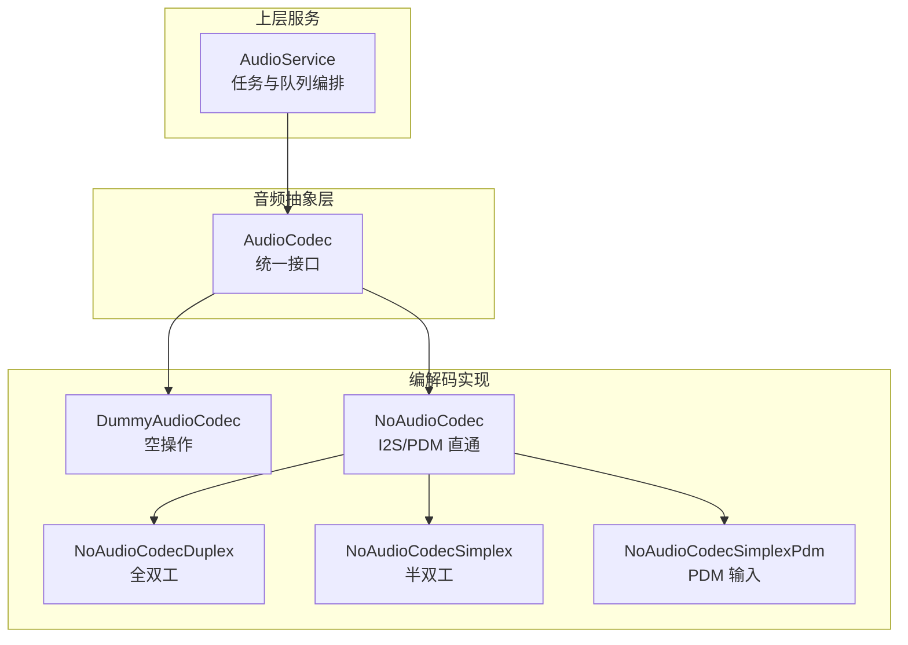
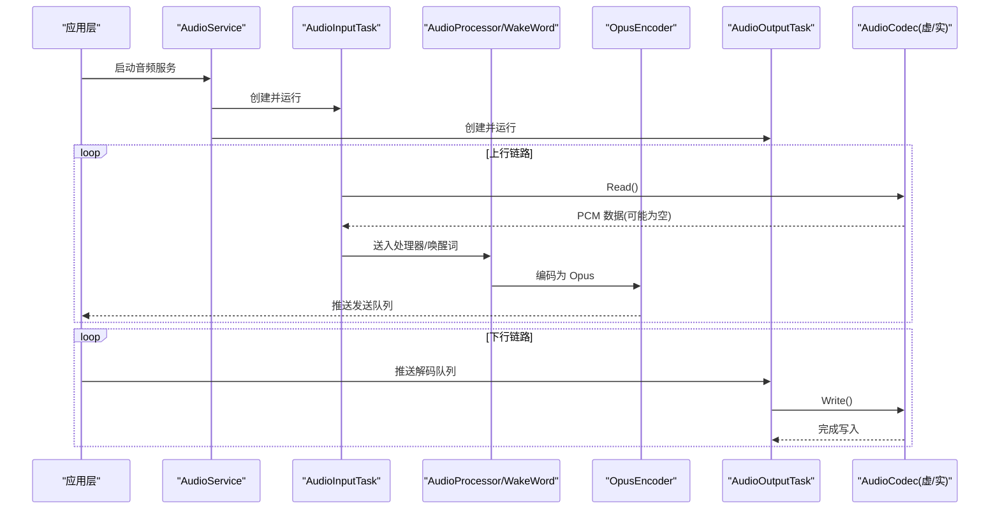
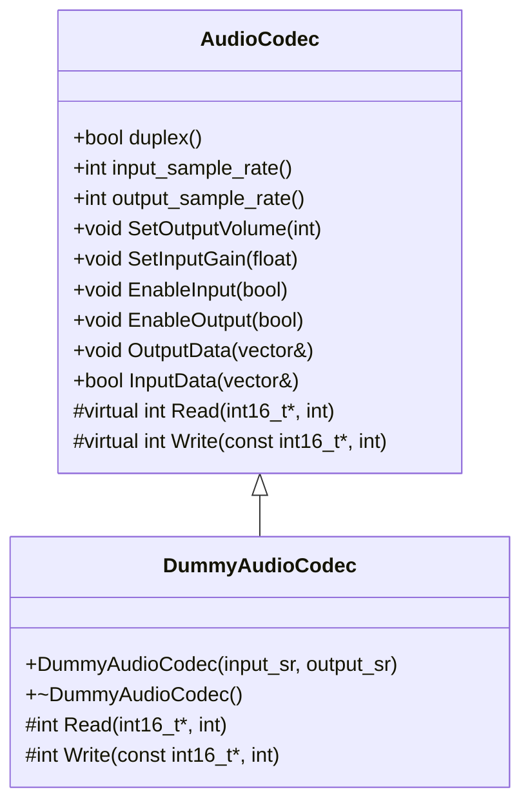
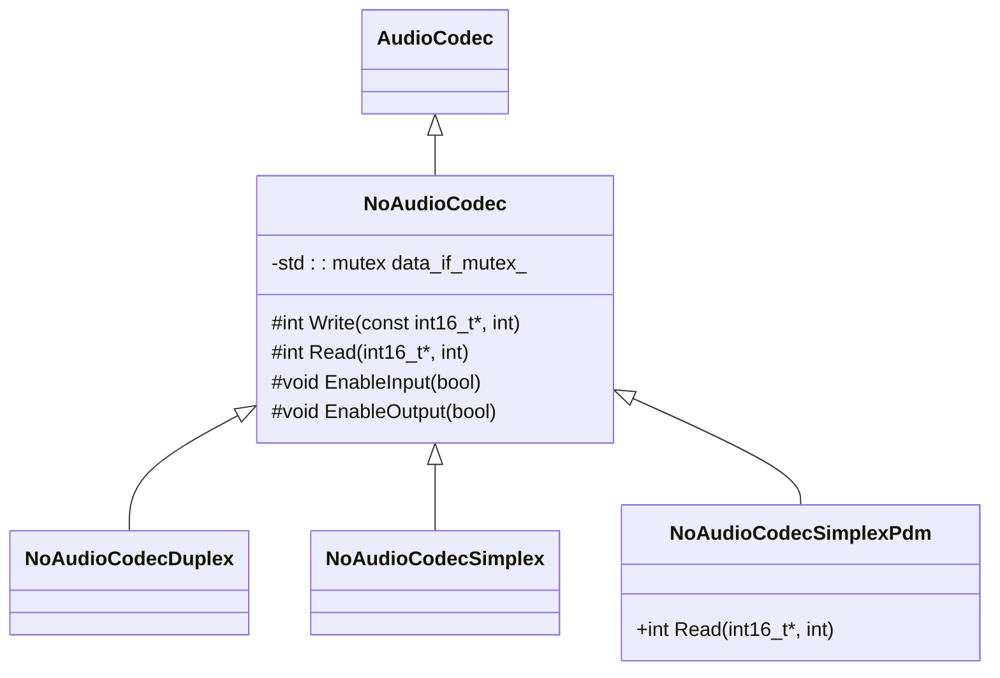
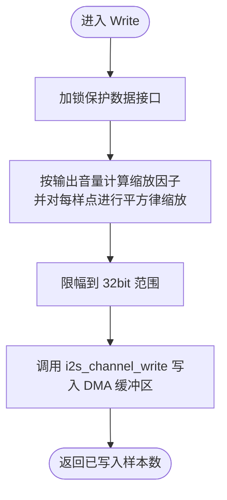
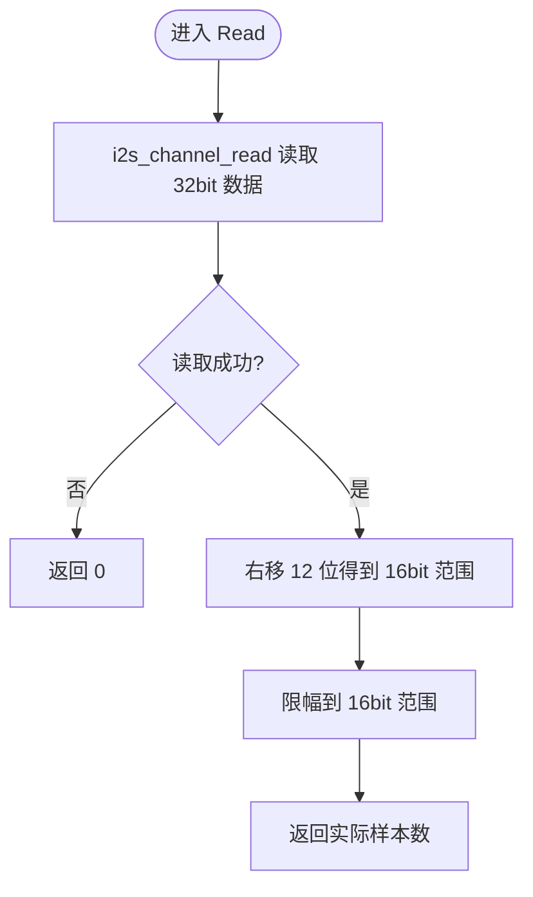
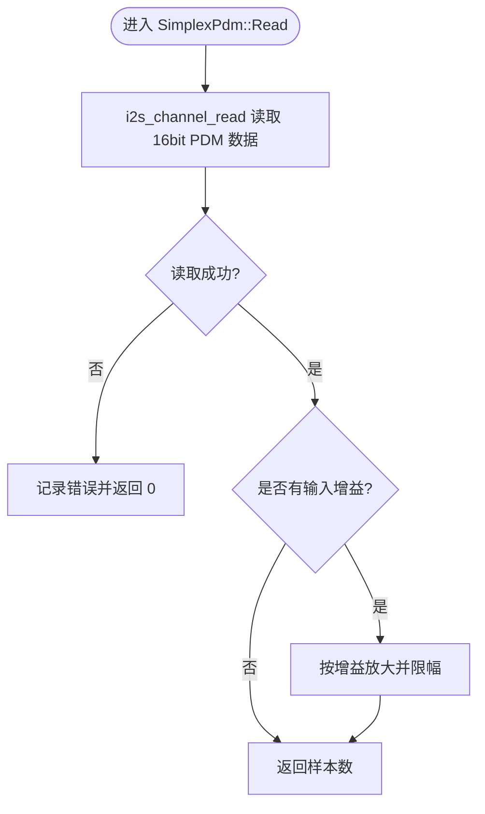
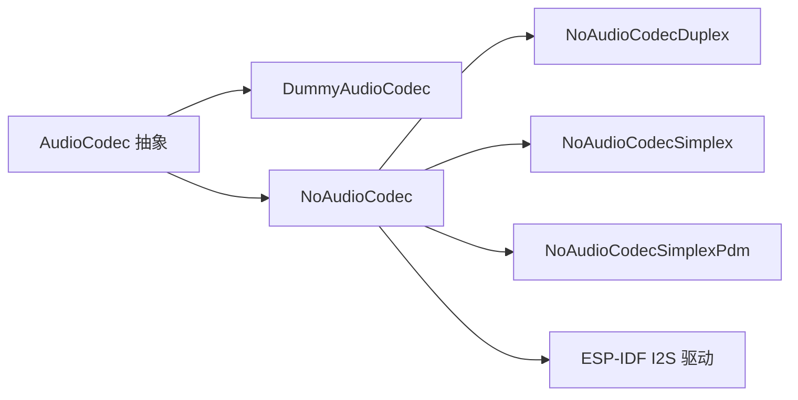

# 虚拟和无编解码器实现

<cite>
**本文引用的文件**
- [main/audio/codecs/dummy_audio_codec.h](file://main/audio/codecs/dummy_audio_codec.h)
- [main/audio/codecs/dummy_audio_codec.cc](file://main/audio/codecs/dummy_audio_codec.cc)
- [main/audio/codecs/no_audio_codec.h](file://main/audio/codecs/no_audio_codec.h)
- [main/audio/codecs/no_audio_codec.cc](file://main/audio/codecs/no_audio_codec.cc)
- [main/audio/audio_codec.h](file://main/audio/audio_codec.h)
- [main/audio/audio_codec.cc](file://main/audio/audio_codec.cc)
- [main/audio/README.md](file://main/audio/README.md)
- [main/boards/bread-compact-esp32/esp32_bread_board.cc](file://main/boards/bread-compact-esp32/esp32_bread_board.cc)
- [main/boards/bread-compact-esp32-lcd/esp32_bread_board_lcd.cc](file://main/boards/bread-compact-esp32-lcd/esp32_bread_board_lcd.cc)
- [main/boards/bread-compact-ml307/compact_ml307_board.cc](file://main/boards/bread-compact-ml307/compact_ml307_board.cc)
- [main/boards/atk-dnesp32s3-box/atk_dnesp32s3_box.cc](file://main/boards/atk-dnesp32s3-box/atk_dnesp32s3_box.cc)
</cite>

## 目录
1. [简介](#简介)
2. [项目结构](#项目结构)
3. [核心组件](#核心组件)
4. [架构总览](#架构总览)
5. [详细组件分析](#详细组件分析)
6. [依赖关系分析](#依赖关系分析)
7. [性能与功耗特性](#性能与功耗特性)
8. [测试与自动化](#测试与自动化)
9. [故障排查指南](#故障排查指南)
10. [结论](#结论)
11. [附录：开发最佳实践](#附录开发最佳实践)

## 简介
本文件聚焦于音频子系统内的“虚拟编解码器”和“无编解码器”两类实现，围绕 DummyAudioCodec 与 NoAudioCodec 系列类展开。其设计目标包括：
- 为仿真、算法验证与开发调试提供零开销或最小开销的音频路径；
- 在无真实硬件或仅使用 ESP32 I2S/PDM 直连外设时，提供可插拔的音频接口抽象；
- 通过统一的 AudioCodec 基类，屏蔽底层差异，便于上层应用与任务流复用。

## 项目结构
与本文相关的代码主要位于 main/audio 目录下的 codecs 层，以及各板级配置中实例化具体编解码器的位置。

图表来源
- [main/audio/audio_codec.h:1-62](file://main/audio/audio_codec.h#L1-L62)
- [main/audio/codecs/dummy_audio_codec.h:1-16](file://main/audio/codecs/dummy_audio_codec.h#L1-L16)
- [main/audio/codecs/no_audio_codec.h:1-42](file://main/audio/codecs/no_audio_codec.h#L1-L42)
- [main/audio/README.md:1-88](file://main/audio/README.md#L1-L88)

章节来源
- [main/audio/README.md:1-88](file://main/audio/README.md#L1-L88)

## 核心组件
- AudioCodec：定义统一的音频输入输出接口（Read/Write）、音量/增益控制、通道能力查询与启停控制等。
- DummyAudioCodec：完全空操作的虚拟编解码器，用于绕过硬件路径进行仿真与流程贯通。
- NoAudioCodec 及其派生类：直接基于 ESP-IDF I2S/PDM 驱动，面向无外部 Codec 芯片的直连场景，支持全双工与半双工模式，并包含 PDM 麦克风输入变体。

章节来源
- [main/audio/audio_codec.h:17-62](file://main/audio/audio_codec.h#L17-L62)
- [main/audio/audio_codec.cc:17-68](file://main/audio/audio_codec.cc#L17-L68)
- [main/audio/codecs/dummy_audio_codec.h:6-14](file://main/audio/codecs/dummy_audio_codec.h#L6-L14)
- [main/audio/codecs/dummy_audio_codec.cc:3-20](file://main/audio/codecs/dummy_audio_codec.cc#L3-L20)
- [main/audio/codecs/no_audio_codec.h:10-41](file://main/audio/codecs/no_audio_codec.h#L10-L41)
- [main/audio/codecs/no_audio_codec.cc:19-386](file://main/audio/codecs/no_audio_codec.cc#L19-L386)

## 架构总览
音频服务采用多任务流水线模型，将采集、处理、编码/解码与播放解耦。DummyAudioCodec 与 NoAudioCodec 均作为 AudioCodec 的具体实现接入该流水线。

图表来源
- [main/audio/README.md:14-88](file://main/audio/README.md#L14-L88)
- [main/audio/audio_codec.h:27-38](file://main/audio/audio_codec.h#L27-L38)
- [main/audio/audio_codec.cc:17-27](file://main/audio/audio_codec.cc#L17-L27)

## 详细组件分析

### DummyAudioCodec（虚拟编解码器）
- 设计目的
  - 在无需真实音频硬件的情况下，打通音频服务与上层逻辑，确保任务调度、队列流转、状态机与协议栈能完整跑通。
  - 作为算法验证的“黑盒”，隔离硬件差异，专注算法行为与端到端时序。
- 行为特征
  - Read 返回 0，表示无采样可读；Write 返回 0，表示不消耗任何数据。
  - 构造时声明 duplex=true，input_channels=1，并设置输入/输出采样率，以匹配上层期望的元数据。
- 典型使用场景
  - 仿真测试：模拟设备端音频路径，验证网络收发、状态切换、UI 联动等。
  - 算法验证：在上游注入合成数据，下游观察处理结果，避免引入硬件噪声。
  - 开发调试：快速定位问题是否来自音频硬件或上层逻辑。

图表来源
- [main/audio/audio_codec.h:17-62](file://main/audio/audio_codec.h#L17-L62)
- [main/audio/codecs/dummy_audio_codec.h:6-14](file://main/audio/codecs/dummy_audio_codec.h#L6-L14)
- [main/audio/codecs/dummy_audio_codec.cc:3-20](file://main/audio/codecs/dummy_audio_codec.cc#L3-L20)

章节来源
- [main/audio/codecs/dummy_audio_codec.h:6-14](file://main/audio/codecs/dummy_audio_codec.h#L6-L14)
- [main/audio/codecs/dummy_audio_codec.cc:3-20](file://main/audio/codecs/dummy_audio_codec.cc#L3-L20)

### NoAudioCodec（无编解码器模式）
- 设计目的
  - 当系统不使用外部 Codec 芯片，而是通过 I2S 直连扬声器与麦克风（含 PDM 麦克风）时，提供轻量、低延迟的音频通路。
  - 支持全双工（同一端口 TX/RX）与半双工（独立 TX/RX 端口），并提供 PDM 输入变体。
- 关键实现要点
  - 全双工：使用同一 I2S 端口同时初始化 TX/RX 通道，引脚复用 BCLK/WS/DOUT/DIN。
  - 半双工：分别创建 TX 与 RX 通道，可配置不同采样率与 slot mask，适配不同外设。
  - PDM 输入：使用 I2S PDM RX 模式读取 16bit 数据，并在必要时做增益放大与限幅。
  - 音量控制：输出侧对 16bit 数据进行平方律缩放至 32bit 缓冲后写入 I2S，避免削波。
  - 输入侧：标准 I2S 读取 32bit 数据后右移 12 位得到 16bit 范围，并进行限幅。
  - 资源管理：析构时关闭 RX/TX 通道，EnableInput/EnableOutput 控制通道启停以降低功耗。
- 典型使用场景
  - 低成本方案：无外部 Codec，使用板载 I2S 与 PDM 麦克风直连。
  - 低功耗优化：空闲时关闭 I2S 通道，减少功耗与 CPU 占用。
  - 灵活扩展：通过不同构造函数选择引脚与 slot mask，适配多种硬件布局。

图表来源
- [main/audio/codecs/no_audio_codec.h:10-41](file://main/audio/codecs/no_audio_codec.h#L10-L41)
- [main/audio/codecs/no_audio_codec.cc:19-386](file://main/audio/codecs/no_audio_codec.cc#L19-L386)

#### 写入流程（输出）

图表来源
- [main/audio/codecs/no_audio_codec.cc:218-239](file://main/audio/codecs/no_audio_codec.cc#L218-L239)

#### 读取流程（输入）

图表来源
- [main/audio/codecs/no_audio_codec.cc:241-256](file://main/audio/codecs/no_audio_codec.cc#L241-L256)

#### PDM 读取流程（输入）

图表来源
- [main/audio/codecs/no_audio_codec.cc:368-386](file://main/audio/codecs/no_audio_codec.cc#L368-L386)

章节来源
- [main/audio/codecs/no_audio_codec.cc:19-386](file://main/audio/codecs/no_audio_codec.cc#L19-L386)

### 上层集成与实例化
- 板级代码中通常根据硬件类型选择 NoAudioCodec 的不同派生类进行实例化，例如：
  - 面包板方案中使用 NoAudioCodecSimplex 或 NoAudioCodecDuplex。
  - ATK 盒子方案中自定义 Duplex 子类以适配特定引脚。
- 这些实例化点展示了如何在具体项目中接入“无编解码器”模式。

章节来源
- [main/boards/bread-compact-esp32/esp32_bread_board.cc:146-149](file://main/boards/bread-compact-esp32/esp32_bread_board.cc#L146-L149)
- [main/boards/bread-compact-esp32-lcd/esp32_bread_board_lcd.cc:177-180](file://main/boards/bread-compact-esp32-lcd/esp32_bread_board_lcd.cc#L177-L180)
- [main/boards/bread-compact-ml307/compact_ml307_board.cc:176-176](file://main/boards/bread-compact-ml307/compact_ml307_board.cc#L176-L176)
- [main/boards/atk-dnesp32s3-box/atk_dnesp32s3_box.cc:21-23](file://main/boards/atk-dnesp32s3-box/atk_dnesp32s3_box.cc#L21-L23)

## 依赖关系分析
- 模块耦合
  - DummyAudioCodec 与 NoAudioCodec 均继承自 AudioCodec，遵循统一接口，降低上层耦合度。
  - NoAudioCodec 依赖 ESP-IDF I2S 驱动（标准模式与 PDM 模式），并通过互斥量保护并发读写。
- 外部依赖
  - ESP-IDF I2S 驱动：负责 DMA 传输、时钟与引脚配置。
  - FreeRTOS：音频服务在多任务间传递数据，保证实时性。
- 潜在循环依赖
  - 当前实现未见循环依赖；AudioCodec 为纯抽象层，被上层服务依赖。

图表来源
- [main/audio/audio_codec.h:17-62](file://main/audio/audio_codec.h#L17-L62)
- [main/audio/codecs/no_audio_codec.h:10-41](file://main/audio/codecs/no_audio_codec.h#L10-L41)
- [main/audio/codecs/no_audio_codec.cc:19-386](file://main/audio/codecs/no_audio_codec.cc#L19-L386)

章节来源
- [main/audio/audio_codec.h:17-62](file://main/audio/audio_codec.h#L17-L62)
- [main/audio/codecs/no_audio_codec.h:10-41](file://main/audio/codecs/no_audio_codec.h#L10-L41)
- [main/audio/codecs/no_audio_codec.cc:19-386](file://main/audio/codecs/no_audio_codec.cc#L19-L386)

## 性能与功耗特性
- 虚拟编解码器（DummyAudioCodec）
  - 性能：零 CPU 开销，Read/Write 立即返回，适合端到端流程贯通与压力测试。
  - 功耗：几乎为零，因为不涉及任何硬件访问。
- 无编解码器（NoAudioCodec）
  - 性能：
    - 输出侧：对每个样点进行乘法与限幅，随后通过 DMA 写入，CPU 占用较低。
    - 输入侧：标准 I2S 读取 32bit 数据并移位限幅；PDM 模式直接读取 16bit，开销更小。
  - 功耗：
    - 通过 EnableInput/EnableOutput 动态启停 I2S 通道，结合音频服务的空闲超时机制，可在无活动时段降低功耗。
    - 半双工模式下 TX/RX 分属不同端口，可根据需要单独关闭，进一步优化能耗。

章节来源
- [main/audio/codecs/dummy_audio_codec.cc:14-20](file://main/audio/codecs/dummy_audio_codec.cc#L14-L20)
- [main/audio/codecs/no_audio_codec.cc:218-282](file://main/audio/codecs/no_audio_codec.cc#L218-L282)
- [main/audio/README.md:86-88](file://main/audio/README.md#L86-L88)

## 测试与自动化
- 单元测试框架集成建议
  - 使用 GoogleTest 或 Unity 等 C/C++ 测试框架，针对 AudioCodec 接口编写用例：
    - 覆盖 DummyAudioCodec：验证 Read 返回 0、Write 返回 0、元数据（采样率、通道数）正确。
    - 覆盖 NoAudioCodec：在模拟器或目标板上验证 I2S 通道启停、音量/增益设置、PDM 读取路径。
  - 通过 Mock 或桩函数替换底层 I2S 驱动，实现离线可重复测试。
- 自动化测试脚本
  - 构建阶段：使用 ESP-IDF 的 idf.py build/test 流程，将测试二进制烧录到目标板或仿真环境。
  - 执行阶段：通过串口日志解析或断言失败计数判定测试结果。
  - 持续集成：在 CI 中并行执行多个板级用例，收集性能指标（如吞吐、延迟）。
- 模拟数据准备
  - 生成正弦波、白噪声或语音片段，转换为 16bit PCM，注入到 OutputData/InputData 接口进行回归测试。
  - 对于 PDM 路径，可使用已知波形经 PDM 编码器生成的数据，验证增益与限幅逻辑。
- 性能测试方法
  - 基准测试：统计单位时间内 Read/Write 调用次数与平均耗时，评估 CPU 占用。
  - 延迟测量：从输入到输出的端到端延迟，结合任务调度与队列长度进行分析。
  - 功耗测量：在空闲与活跃状态下对比电流，验证 EnableInput/EnableOutput 的节能效果。

[本节为通用指导，不直接分析具体文件]

## 故障排查指南
- 常见问题
  - 无声音输出：检查 NoAudioCodec 的 EnableOutput 是否被调用，确认 I2S 通道已启用且引脚配置正确。
  - 无声输入：检查 EnableInput 与 I2S RX 通道状态；PDM 模式下确认 SOC 是否支持 PDM RX。
  - 音量异常：确认输出音量设置与缩放逻辑，避免溢出或过小导致听感异常。
  - 卡顿或丢帧：检查队列长度与任务优先级，适当调整 DMA 描述符与帧数。
- 定位手段
  - 增加日志：在 Read/Write 入口与退出处打印样本数与耗时，辅助定位瓶颈。
  - 使用 DummyAudioCodec 隔离问题：若走虚拟路径正常，则问题大概率在硬件或驱动配置。
  - 回退策略：在复杂板级上先使用 NoAudioCodecSimplex 简化路径，逐步添加功能。

章节来源
- [main/audio/codecs/no_audio_codec.cc:257-282](file://main/audio/codecs/no_audio_codec.cc#L257-L282)
- [main/audio/codecs/no_audio_codec.cc:368-386](file://main/audio/codecs/no_audio_codec.cc#L368-L386)

## 结论
- DummyAudioCodec 提供了最轻量的音频路径，适用于仿真、调试与算法验证，能有效隔离硬件差异。
- NoAudioCodec 系列在无外部 Codec 的场景下提供高效、灵活的 I2S/PDM 直通方案，支持全双工与半双工，具备较好的功耗管理能力。
- 通过统一的 AudioCodec 抽象，上层音频服务可无缝切换不同实现，提升系统的可移植性与可测试性。

[本节为总结性内容，不直接分析具体文件]

## 附录：开发最佳实践
- 开发环境搭建
  - 安装 ESP-IDF 工具链，配置目标板引脚与音频参数（输入/输出采样率、slot mask）。
  - 在板级配置中选择合适的 NoAudioCodec 派生类，或为仿真选择 DummyAudioCodec。
- 模拟数据准备
  - 使用脚本生成 PCM 文件，或通过上位机实时注入数据，验证端到端链路。
- 测试结果分析
  - 关注日志中的样本数、耗时与错误码，结合性能指标进行回归对比。
  - 对 PDM 路径，重点验证增益与限幅后的波形质量。

[本节为通用指导，不直接分析具体文件]